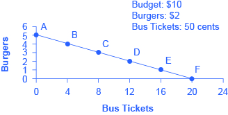
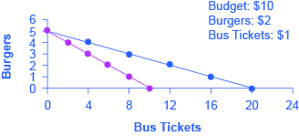

By the end of this section, you will be able to:

* Calculate and graph budgets constraints
* Explain opportunity sets and opportunity costs
* Evaluate the law of diminishing marginal utility
* Explain how marginal analysis and utility influence choices

Consider the typical consumer’s budget problem. Consumers have a limited amount of income to spend on the things they need and want. Suppose Alphonso has $10 in spending money each week that he can allocate between bus tickets for getting to work and the burgers that he eats for lunch. Burgers cost $2 each, and bus tickets are 50 cents each. [\[link\]](#CNX_Econ_C02_001) shows Alphonso’s **budget constraint**{: data-type="term"}, that is, the outer boundary of his **opportunity set**{: data-type="term"}. The opportunity set identifies all the opportunities for spending within his budget. The budget constraint indicates all the combinations of burgers and bus tickets Alphonso can afford when he exhausts his budget, given the prices of the two goods. (There are actually many different kinds of budget constraints. You will learn more about them in the chapter on [Consumer Choices](/m48640){: .target-chapter}.)

{: #CNX_Econ_C02_001 data-title="The Budget Constraint: Alphonso&#x2019;s Consumption Choice Opportunity Frontier "}

The vertical axis in the figure shows burger purchases and the horizontal axis shows bus ticket purchases. If Alphonso spends all his money on burgers, he can afford five per week. ($10 per week/$2 per burger = 5 burgers per week.) But if he does this, he will not be able to afford any bus tickets. This choice (zero bus tickets and five burgers) is shown by point A in the figure. Alternatively, if Alphonso spends all his money on bus tickets, he can afford 20 per week. ($10 per week/$0.50 per bus ticket = 20 bus tickets per week.) Then, however, he will not be able to afford any burgers. This alternative choice (20 bus tickets and zero burgers) is shown by point F.

If Alphonso is like most people, he will choose some combination that includes both bus tickets and burgers. That is, he will choose some combination on the budget constraint that connects points A and F. Every point on (or inside) the constraint shows a combination of burgers and bus tickets that Alphonso can afford. Any point outside the constraint is not affordable, because it would cost more money than Alphonso has in his budget.

The budget constraint clearly shows the tradeoff Alphonso faces in choosing between burgers and bus tickets. Suppose he is currently at point D, where he can afford 12 bus tickets and two burgers. What would it cost Alphonso for one more burger? It would be natural to answer $2, but that’s not the way economists think. Instead they ask, how many bus tickets would Alphonso have to give up to get one more burger, while staying within his budget? The answer is four bus tickets. That is the true cost to Alphonso of one more burger.

# The Concept of Opportunity Cost

Economists use the term **opportunity cost**{: data-type="term"} to indicate what must be given up to obtain something that is desired. The idea behind opportunity cost is that the cost of one item is the lost opportunity to do or consume something else; in short, opportunity cost is the value of the next best alternative. For Alphonso, the opportunity cost of a burger is the four bus tickets he would have to give up. He would decide whether or not to choose the burger depending on whether the value of the burger exceeds the value of the forgone alternative—in this case, bus tickets. Since people must choose, they inevitably face tradeoffs in which they have to give up things they desire to get other things they desire more.

View this [website][1] for an example of opportunity cost—paying someone else to wait in line for you.

  

A fundamental principle of economics is that every choice has an opportunity cost. If you sleep through your economics class (not recommended, by the way), the opportunity cost is the learning you miss from not attending class. If you spend your income on video games, you cannot spend it on movies. If you choose to marry one person, you give up the opportunity to marry anyone else. In short, opportunity cost is all around us and part of human existence.

The following Work It Out feature shows a step-by-step analysis of a budget constraint calculation. Read through it to understand another important concept—slope—that is further explained in the appendix [The Use of Mathematics in Principles of Economics](/m48831).

Understanding Budget Constraints

Budget constraints are easy to understand if you apply a little math. The appendix [The Use of Mathematics in Principles of Economics](/m48831) explains all the math you are likely to need in this book. So if math is not your strength, you might want to take a look at the appendix.

Step 1: The equation for any budget constraint is:

<math xmlns="http://www.w3.org/1998/Math/MathML"><mtext>Budget</mtext><mo>=</mo><msub><mtext>P</mtext><mn>1</mn></msub><msub><mtext> × Q</mtext><mn>1</mn></msub><msub><mtext> + P</mtext><mrow><mn>2</mn><mspace width="0.2em" /></mrow></msub><msub><mtext>× Q</mtext><mn>2</mn></msub></math>

where P and Q are the price and quantity of items purchased and Budget is the amount of income one has to spend.

Step 2. Apply the budget constraint equation to the scenario. In Alphonso’s case, this works out to be:

<math xmlns="http://www.w3.org/1998/Math/MathML"><mtable columnspacing="2px" columnalign="right center left"><mtr><mtd><mtext>Budget</mtext></mtd><mtd><mo>=</mo></mtd> <mtd><msub><mtext>P</mtext><mn>1</mn></msub><msub><mtext> × Q</mtext><mn>1</mn></msub><msub><mtext> + P</mtext><mrow><mn>2</mn><mspace width="0.2em" /></mrow></msub><msub><mtext>× Q</mtext><mn>2</mn></msub> </mtd></mtr><mtr><mtd><mtext>$10 budget</mtext></mtd><mtd><mo>=</mo></mtd><mtd><mtext>$2 per burger × quantity of burgers + $0.50 per bus ticket × quantity of bus tickets</mtext></mtd></mtr><mtr><mtd><mtext>$10</mtext></mtd><mtd><mo>=</mo></mtd><mtd><msub><mtext>$2 × Q</mtext><mtext>burgers</mtext></msub><msub><mtext> + $0.50 × Q</mtext><mtext>bus tickets</mtext></msub></mtd></mtr></mtable></math>

Step 3. Using a little algebra, we can turn this into the familiar equation of a line:

<math xmlns="http://www.w3.org/1998/Math/MathML"><mtable columnspacing="2px 2px" columnalign="right center"><mtr><mtd><mtext>y</mtext></mtd><mtd><mtext> = </mtext></mtd><mtd><mtext>b + mx</mtext></mtd></mtr></mtable></math>

For Alphonso, this is:

<math xmlns="http://www.w3.org/1998/Math/MathML"><mtable columnspacing="2px" columnalign="right center left"><mtr><mtd><mtext>$10</mtext></mtd><mtd><mtext> = </mtext></mtd><mtd><msub><mtext>$2 × Q</mtext><mrow><mtext>burgers</mtext></mrow></msub><mtext> + </mtext><mtext>$0.50</mtext><mtext> × </mtext><msub><mtext>Q</mtext><mtext>bus tickets</mtext></msub></mtd></mtr></mtable></math>

Step 4. Simplify the equation. Begin by multiplying both sides of the equation by 2:

<math xmlns="http://www.w3.org/1998/Math/MathML"><mtable columnspacing="2px" columnalign="right center left"><mtr><mtd><mtext>2 × 10</mtext></mtd><mtd><mtext> = </mtext></mtd><mtd><msub><mtext>2 × 2 × Q</mtext><mtext>burgers</mtext></msub><msub><mtext> + 2 × 0.5 × Q</mtext><mtext>bus tickets</mtext></msub><mo> </mo></mtd></mtr><mtr><mtd><mtext>20</mtext></mtd><mtd><mtext> = </mtext></mtd><mtd><msub><mtext>4 × Q</mtext><mrow><mtext>burgers</mtext></mrow></msub><msub><mtext> + 1 × Q</mtext><mtext>bus tickets</mtext></msub></mtd></mtr></mtable></math>

Step 5. Subtract one bus ticket from both sides:

<math xmlns="http://www.w3.org/1998/Math/MathML"><mtable columnspacing="2px" columnalign="right center left"><mtr><mtd><msub><mtext>20 – Q</mtext><mtext>bus tickets</mtext></msub></mtd><mtd><mtext> = </mtext></mtd><mtd><msub><mtext>4 × Q</mtext><mtext>burgers</mtext></msub></mtd></mtr></mtable></math>

Divide each side by 4 to yield the answer:

<math xmlns="http://www.w3.org/1998/Math/MathML"><mtable columnspacing="2px" columnalign="right center left"><mtr><mtd><msub><mtext>5 – 0.25 × Q</mtext><mtext>bus tickets</mtext></msub></mtd><mtd><mtext> = </mtext></mtd><mtd><msub><mtext>Q</mtext><mtext>burgers</mtext></msub></mtd></mtr><mtr><mtd /><mtd><mtext>or</mtext></mtd><mtd /></mtr><mtr><mtd><msub><mtext>Q</mtext><mtext>burgers</mtext></msub></mtd><mtd><mtext> = </mtext></mtd><mtd><msub><mtext>5 – 0.25 × Q</mtext><mtext>bus tickets</mtext></msub></mtd></mtr></mtable></math>

Step 6. Notice that this equation fits the budget constraint in [\[link\]](#CNX_Econ_C02_001). The vertical intercept is 5 and the slope is –0.25, just as the equation says. If you plug 20 bus tickets into the equation, you get 0 burgers. If you plug other numbers of bus tickets into the equation, you get the results shown in [\[link\]](#Table_02_01), which are the points on Alphonso’s budget constraint.

<table id="Table_02_01" summary="Table lists points A through F in column 1. Column 2 lists the quantity of burgers (at $2), and column 3 lists the quantity of bus tickets (at 50 cents). Point A has 5 burgers, 0 bus tickets. Point B has 4 burgers, 4 bus tickets. Point C has 3 burgers, 8 bus tickets. Point D has 2 burgers, 12 bus tickets. Point E has 1 burger, 16 bus tickets. Point F has 0 burgers, 20 bus tickets."><caption /><thead>
<tr>
<th>Point</th>
<th>Quantity of Burgers (at $2)</th>
<th>Quantity of Bus Tickets (at 50 cents)</th>
</tr>
</thead><tbody>
<tr>
<td>A</td>
<td>5</td>
<td>0</td>
</tr>
<tr>
<td>B</td>
<td>4</td>
<td>4</td>
</tr>
<tr>
<td>C</td>
<td>3</td>
<td>8</td>
</tr>
<tr>
<td>D</td>
<td>2</td>
<td>12</td>
</tr>
<tr>
<td>E</td>
<td>1</td>
<td>16</td>
</tr>
<tr>
<td>F</td>
<td>0</td>
<td>20</td>
</tr>
</tbody></table>
Step 7. Notice that the slope of a budget constraint always shows the opportunity cost of the good which is on the horizontal axis. For Alphonso, the slope is −0.25, indicating that for every four bus tickets he buys, Alphonso must give up 1 burger.

There are two important observations here. First, the algebraic sign of the slope is negative, which means that the only way to get more of one good is to give up some of the other. Second, the slope is defined as the price of bus tickets (whatever is on the horizontal axis in the graph) divided by the price of burgers (whatever is on the vertical axis), in this case $0.50/$2 = 0.25. So if you want to determine the opportunity cost quickly, just divide the two prices.

# Identifying Opportunity Cost

In many cases, it is reasonable to refer to the opportunity cost as the **price**{: data-type="term" .no-emphasis}. If your cousin buys a new bicycle for $300, then $300 measures the amount of “other consumption” that he has given up. For practical purposes, there may be no special need to identify the specific alternative product or products that could have been bought with that $300, but sometimes the price as measured in dollars may not accurately capture the true opportunity cost. This problem can loom especially large when costs of time are involved.

For example, consider a boss who decides that all employees will attend a two-day retreat to “build team spirit.” The out-of-pocket monetary cost of the event may involve hiring an outside consulting firm to run the retreat, as well as room and board for all participants. But an opportunity cost exists as well: during the two days of the retreat, none of the employees are doing any other work.

Attending college is another case where the opportunity cost exceeds the monetary cost. The out-of-pocket costs of attending college include tuition, books, room and board, and other expenses. But in addition, during the hours that you are attending class and studying, it is impossible to work at a paying job. Thus, college imposes both an out-of-pocket cost and an opportunity cost of lost earnings.

What is the opportunity cost associated with increased airport security measures?

After the terrorist plane hijackings on September 11, 2001, many steps were proposed to improve air travel safety. For example, the federal government could provide armed “sky marshals” who would travel inconspicuously with the rest of the passengers. The cost of having a sky marshal on every flight would be roughly $3 billion per year. Retrofitting all U.S. planes with reinforced cockpit doors to make it harder for terrorists to take over the plane would have a price tag of $450 million. Buying more sophisticated security equipment for airports, like three-dimensional baggage scanners and cameras linked to face recognition software, could cost another $2 billion.

But the single biggest cost of greater airline security does not involve spending money. It is the opportunity cost of additional waiting time at the airport. According to the United States Department of Transportation (DOT), more than 800 million passengers took plane trips in the United States in 2012. Since the 9/11 hijackings, security screening has become more intensive, and consequently, the procedure takes longer than in the past. Say that, on average, each air passenger spends an extra 30 minutes in the airport per trip. Economists commonly place a value on time to convert an opportunity cost in time into a monetary figure. Because many air travelers are relatively high-paid business people, conservative estimates set the average price of time for air travelers at $20 per hour. By these back-of-the-envelope calculations, the opportunity cost of delays in airports could be as much as 800 million × 0.5 hours × $20/hour, or $8 billion per year. Clearly, the opportunity costs of waiting time can be just as important as costs that involve direct spending.

In some cases, realizing the opportunity cost can alter behavior. Imagine, for example, that you spend $8 on lunch every day at work. You may know perfectly well that bringing a lunch from home would cost only $3 a day, so the opportunity cost of buying lunch at the restaurant is $5 each day (that is, the $8 buying lunch costs minus the $3 your lunch from home would cost). $5 each day does not seem to be that much. However, if you project what that adds up to in a year—250 days a year × $5 per day equals $1,250, the cost, perhaps, of a decent vacation. If the opportunity cost is described as “a nice vacation” instead of “$5 a day,” you might make different choices.

# Marginal Decision-Making and Diminishing Marginal Utility

The budget constraint framework helps to emphasize that most choices in the real world are not about getting all of one thing or all of another; that is, they are not about choosing either the point at one end of the budget constraint or else the point all the way at the other end. Instead, most choices involve **marginal analysis**{: data-type="term"}, which means comparing the benefits and costs of choosing a little more or a little less of a good.

People desire goods and services for the satisfaction or **utility**{: data-type="term"} those goods and services provide. Utility, as we will see in the chapter on [Consumer Choices](/m48640){: .target-chapter}, is subjective but that does not make it less real. Economists typically assume that the more of some good one consumes (for example, slices of pizza), the more utility one obtains. At the same time, the utility a person receives from consuming the first unit of a good is typically more than the utility received from consuming the fifth or the tenth unit of that same good. When Alphonso chooses between burgers and bus tickets, for example, the first few bus rides that he chooses might provide him with a great deal of utility—perhaps they help him get to a job interview or a doctor’s appointment. But later bus rides might provide much less utility—they may only serve to kill time on a rainy day. Similarly, the first burger that Alphonso chooses to buy may be on a day when he missed breakfast and is ravenously hungry. However, if Alphonso has a burger every single day, the last few burgers may taste pretty boring. The general pattern that consumption of the first few units of any good tends to bring a higher level of utility to a person than consumption of later units is a common pattern. Economists refer to this pattern as the **law of diminishing marginal utility**{: data-type="term"}, which means that as a person receives more of a good, the additional (or marginal) utility from each additional unit of the good declines. In other words, the first slice of pizza brings more satisfaction than the sixth.

The law of diminishing marginal utility explains why people and societies rarely make all-or-nothing choices. You would not say, “My favorite food is ice cream, so I will eat nothing but ice cream from now on.” Instead, even if you get a very high level of utility from your favorite food, if you ate it exclusively, the additional or marginal utility from those last few servings would not be very high. Similarly, most workers do not say: “I enjoy leisure, so I’ll never work.” Instead, workers recognize that even though some leisure is very nice, a combination of all leisure and no income is not so attractive. The budget constraint framework suggests that when people make choices in a world of scarcity, they will use marginal analysis and think about whether they would prefer a little more or a little less.

# Sunk Costs

In the budget constraint framework, all decisions involve what will happen next: that is, what quantities of goods will you consume, how many hours will you work, or how much will you save. These decisions do not look back to past choices. Thus, the budget constraint framework assumes that **sunk costs**{: data-type="term"}, which are costs that were incurred in the past and cannot be recovered, should not affect the current decision.

Consider the case of Selena, who pays $8 to see a movie, but after watching the film for 30 minutes, she knows that it is truly terrible. Should she stay and watch the rest of the movie because she paid for the ticket, or should she leave? The money she spent is a sunk cost, and unless the theater manager is feeling kindly, Selena will not get a refund. But staying in the movie still means paying an opportunity cost in time. Her choice is whether to spend the next 90 minutes suffering through a cinematic disaster or to do something—anything—else. The lesson of sunk costs is to forget about the money and time that is irretrievably gone and instead to focus on the marginal costs and benefits of current and future options.

For people and firms alike, dealing with sunk costs can be frustrating. It often means admitting an earlier error in judgment. Many firms, for example, find it hard to give up on a new product that is doing poorly because they spent so much money in creating and launching the product. But the lesson of sunk costs is to ignore them and make decisions based on what will happen in the future.

# From a Model with Two Goods to One of Many Goods

The budget constraint diagram containing just two goods, like most models used in this book, is not realistic. After all, in a modern economy people choose from thousands of goods. However, thinking about a model with many goods is a straightforward extension of what we discussed here. Instead of drawing just one budget constraint, showing the tradeoff between two goods, you can draw multiple budget constraints, showing the possible tradeoffs between many different pairs of goods. Or in more advanced classes in economics, you would use mathematical equations that include many possible goods and services that can be purchased, together with their quantities and prices, and show how the total spending on all goods and services is limited to the overall budget available. The graph with two goods that was presented here clearly illustrates that every choice has an opportunity cost, which is the point that does carry over to the real world.

# Key Concepts and Summary

Economists see the real world as one of scarcity: that is, a world in which people’s desires exceed what is possible. As a result, economic behavior involves tradeoffs in which individuals, firms, and society must give up something that they desire to obtain things that they desire more. Individuals face the tradeoff of what quantities of goods and services to consume. The budget constraint, which is the frontier of the opportunity set, illustrates the range of choices available. The slope of the budget constraint is determined by the relative price of the choices. Choices beyond the budget constraint are not affordable.

Opportunity cost measures cost by what is given up in exchange. Sometimes opportunity cost can be measured in money, but it is often useful to consider time as well, or to measure it in terms of the actual resources that must be given up.

Most economic decisions and tradeoffs are not all-or-nothing. Instead, they involve marginal analysis, which means they are about decisions on the margin, involving a little more or a little less. The law of diminishing marginal utility points out that as a person receives more of something—whether it is a specific good or another resource—the additional marginal gains tend to become smaller. Because sunk costs occurred in the past and cannot be recovered, they should be disregarded in making current decisions.

# Self-Check Questions

Suppose Alphonso’s town raised the price of bus tickets to $1 per trip (while the price of burgers stayed at $2 and his budget remained $10 per week.) Draw Alphonso’s new budget constraint. What happens to the opportunity cost of bus tickets?

The opportunity cost of bus tickets is the number of burgers that must be given up to obtain one more bus ticket. Originally, when the price of bus tickets was 50 cents per trip, this opportunity cost was 0.50/2 = .25 burgers. The reason for this is that at the original prices, one burger ($2) costs the same as four bus tickets ($0.50), so the opportunity cost of a burger is four bus tickets, and the opportunity cost of a bus ticket is .25 (the inverse of the opportunity cost of a burger). With the new, higher price of bus tickets, the opportunity cost rises to $1/$2 or 0.50. You can see this graphically since the slope of the new budget constraint is flatter than the original one. If Alphonso spends all of his budget on burgers, the higher price of bus tickets has no impact so the horizontal intercept of the budget constraint is the same. If he spends all of his budget on bus tickets, he can now afford only half as many, so the vertical intercept is half as much. In short, the budget constraint rotates clockwise around the horizontal intercept, flattening as it goes and the opportunity cost of bus tickets increases.

{: #CNX_Econ_C02_003}

# Review Questions

Explain why scarcity leads to tradeoffs.

Explain why individuals make choices that are directly on the budget constraint, rather than inside the budget constraint or outside it.

# Critical Thinking Question

Suppose Alphonso’s town raises the price of bus tickets from $0.50 to $1 and the price of burgers rises from $2 to $4. Why is the opportunity cost of bus tickets unchanged? Suppose Alphonso’s weekly spending money increases from $10 to $20. How is his budget constraint affected from all three changes? Explain.

# Problems

Use this information to answer the following 4 questions: Marie has a weekly budget of $24, which she likes to spend on magazines and pies.

If the price of a magazine is $4 each, what is the maximum number of magazines she could buy in a week?

If the price of a pie is $12, what is the maximum number of pies she could buy in a week?

Draw Marie’s budget constraint with pies on the horizontal axis and magazines on the vertical axis. What is the slope of the budget constraint?

What is Marie’s opportunity cost of purchasing a pie?

# References

Bureau of Labor Statistics, U.S. Department of Labor. 2015. “Median Weekly Earnings by Educational Attainment in 2014.” Accessed March 27, 2015. http://www.bls.gov/opub/ted/2015/median-weekly-earnings-by-education-gender-race-and-ethnicity-in-2014.htm.

Robbins, Lionel. *An Essay on the Nature and Significance of Economic Science*. London: Macmillan. 1932.

United States Department of Transportation. “Total Passengers on U.S Airlines and Foreign Airlines U.S. Flights Increased 1.3% in 2012 from 2011.” Accessed October 2013. http://www.rita.dot.gov/bts/press\\\_releases/bts016\\\_13

[1]: http://openstaxcollege.org/l/linestanding
