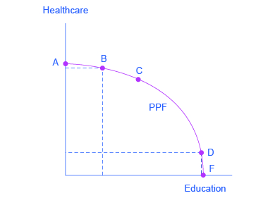
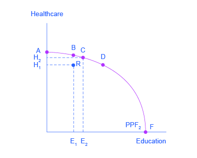

By the end of this section, you will be able to:

* Interpret production possibilities frontier graphs
* Contrast a budget constraint and a production possibilities frontier
* Explain the relationship between a production possibilities frontier and the law of diminishing returns
* Contrast productive efficiency and allocative efficiency
* Define comparative advantage

Just as individuals cannot have everything they want and must instead make choices, society as a whole cannot have everything it might want, either. This section of the chapter will explain the constraints faced by society, using a model called the **production possibilities frontier (PPF)**{: data-type="term"}. There are more similarities than differences between individual choice and social choice. As you read this section, focus on the similarities.

Because society has limited resources (e.g., labor, land, capital, raw materials) at any point in time, there is a limit to the quantities of goods and services it can produce. Suppose a society desires two products, healthcare and education. This situation is illustrated by the production possibilities frontier in [\[link\]](#CNX_Econ_C02_010).

 {: #CNX_Econ_C02_010 data-media-type="image/jpg" data-title="A Healthcare vs. Education Production Possibilities Frontier "}

In [\[link\]](#CNX_Econ_C02_010), healthcare is shown on the vertical axis and education is shown on the horizontal axis. If the society were to allocate all of its resources to healthcare, it could produce at point A. But it would not have any resources to produce education. If it were to allocate all of its resources to education, it could produce at point F. Alternatively, the society could choose to produce any combination of healthcare and education shown on the production possibilities frontier. In effect, the production possibilities frontier plays the same role for society as the budget constraint plays for Alphonso. Society can choose any combination of the two goods on or inside the PPF. But it does not have enough resources to produce outside the PPF.

Most important, the production possibilities frontier clearly shows the tradeoff between healthcare and education. Suppose society has chosen to operate at point B, and it is considering producing more education. Because the PPF is downward sloping from left to right, the only way society can obtain more education is by giving up some healthcare. That is the tradeoff society faces. Suppose it considers moving from point B to point C. What would the opportunity cost be for the additional education? The opportunity cost would be the healthcare society has to give up. Just as with Alphonso’s budget constraint, the opportunity cost is shown by the **slope**{: data-type="term" .no-emphasis} of the production possibilities frontier. By now you might be saying, “Hey, this PPF is sounding like the budget constraint.” If so, read the following Clear It Up feature.

What’s the difference between a budget constraint and a PPF?

There are two major differences between a budget constraint and a production possibilities frontier. The first is the fact that the budget constraint is a straight line. This is because its slope is given by the relative prices of the two goods. In contrast, the PPF has a curved shape because of the law of the diminishing returns. The second is the absence of specific numbers on the axes of the PPF. There are no specific numbers because we do not know the exact amount of resources this imaginary economy has, nor do we know how many resources it takes to produce healthcare and how many resources it takes to produce education. If this were a real world example, that data would be available. An additional reason for the lack of numbers is that there is no single way to measure levels of education and healthcare. However, when you think of improvements in education, you can think of accomplishments like more years of school completed, fewer high-school dropouts, and higher scores on standardized tests. When you think of improvements in healthcare, you can think of longer life expectancies, lower levels of infant mortality, and fewer outbreaks of disease.

Whether or not we have specific numbers, conceptually we can measure the opportunity cost of additional education as society moves from point B to point C on the PPF. The additional education is measured by the horizontal distance between B and C. The foregone healthcare is given by the vertical distance between B and C. The slope of the PPF between B and C is (approximately) the vertical distance (the “rise”) over the horizontal distance (the “run”). This is the opportunity cost of the additional education.

# The Shape of the PPF and the Law of Diminishing Returns

The budget constraints presented earlier in this chapter, showing individual choices about what quantities of goods to consume, were all straight lines. The reason for these straight lines was that the slope of the budget constraint was determined by relative prices of the two goods in the **consumption budget constraint**{: data-type="term" .no-emphasis}. However, the production possibilities frontier for healthcare and education was drawn as a curved line. Why does the PPF have a different shape?

To understand why the PPF is curved, start by considering point A at the top left-hand side of the PPF. At point A, all available resources are devoted to healthcare and none are left for education. This situation would be extreme and even ridiculous. For example, children are seeing a doctor every day, whether they are sick or not, but not attending school. People are having cosmetic surgery on every part of their bodies, but no high school or college education exists. Now imagine that some of these resources are diverted from healthcare to education, so that the economy is at point B instead of point A. Diverting some resources away from A to B causes relatively little reduction in health because the last few marginal dollars going into healthcare services are not producing much additional gain in health. However, putting those marginal dollars into education, which is completely without resources at point A, can produce relatively large gains. For this reason, the shape of the PPF from A to B is relatively flat, representing a relatively small drop-off in health and a relatively large gain in education.

Now consider the other end, at the lower right, of the production possibilities frontier. Imagine that society starts at choice D, which is devoting nearly all resources to education and very few to healthcare, and moves to point F, which is devoting *all* spending to education and none to healthcare. For the sake of concreteness, you can imagine that in the movement from D to F, the last few doctors must become high school science teachers, the last few nurses must become school librarians rather than dispensers of vaccinations, and the last few emergency rooms are turned into kindergartens. The gains to education from adding these last few resources to education are very small. However, the opportunity cost lost to health will be fairly large, and thus the slope of the PPF between D and F is steep, showing a large drop in health for only a small gain in education.

The lesson is not that society is likely to make an extreme choice like devoting no resources to education at point A or no resources to health at point F. Instead, the lesson is that the gains from committing additional marginal resources to education depend on how much is already being spent. If on the one hand, very few resources are currently committed to education, then an increase in resources used can bring relatively large gains. On the other hand, if a large number of resources are already committed to education, then committing additional resources will bring relatively smaller gains.

This pattern is common enough that it has been given a name: the **law of diminishing returns**{: data-type="term"}, which holds that as additional increments of resources are added to a certain purpose, the marginal benefit from those additional increments will decline. When government spends a certain amount more on reducing crime, for example, the original gains in reducing crime could be relatively large. But additional increases typically cause relatively smaller reductions in crime, and paying for enough police and security to reduce crime to nothing at all would be tremendously expensive.

The curvature of the production possibilities frontier shows that as additional resources are added to education, moving from left to right along the horizontal axis, the original gains are fairly large, but gradually diminish. Similarly, as additional resources are added to healthcare, moving from bottom to top on the vertical axis, the original gains are fairly large, but again gradually diminish. In this way, the law of diminishing returns produces the outward-bending shape of the production possibilities frontier.

# Productive Efficiency and Allocative Efficiency

The study of economics does not presume to tell a society what choice it should make along its production possibilities frontier. In a market-oriented economy with a democratic government, the choice will involve a mixture of decisions by individuals, firms, and government. However, economics can point out that some choices are unambiguously better than others. This observation is based on the concept of efficiency. In everyday usage, efficiency refers to lack of waste. An inefficient machine operates at high **cost**{: data-type="term" .no-emphasis}, while an efficient machine operates at lower cost, because it is not wasting energy or materials. An inefficient organization operates with long delays and high costs, while an efficient organization meets schedules, is focused, and performs within budget.

The production possibilities frontier can illustrate two kinds of efficiency: productive efficiency and allocative efficiency. [\[link\]](#CNX_Econ_C02_011) illustrates these ideas using a production possibilities frontier between healthcare and education.

 {: #CNX_Econ_C02_011 data-media-type="image/jpg" data-title="Productive and Allocative Efficiency "}

**Productive efficiency**{: data-type="term"} means that, given the available inputs and technology, it is impossible to produce more of one good without decreasing the quantity that is produced of another good. All choices on the PPF in [\[link\]](#CNX_Econ_C02_011), including A, B, C, D, and F, display productive efficiency. As a firm moves from any one of these choices to any other, either healthcare increases and education decreases or vice versa. However, any choice inside the production possibilities frontier is productively inefficient and wasteful because it is possible to produce more of one good, the other good, or some combination of both goods.

For example, point R is productively inefficient because it is possible at choice C to have more of both goods: education on the horizontal axis is higher at point C than point R (E2 is greater than E1), and healthcare on the vertical axis is also higher at point C than point R (H2 is great than H1).

The particular mix of goods and services being produced—that is, the specific combination of healthcare and education chosen along the production possibilities frontier—can be shown as a ray (line) from the origin to a specific point on the PPF. Output mixes that had more healthcare (and less education) would have a steeper ray, while those with more education (and less healthcare) would have a flatter ray.

**Allocative efficiency**{: data-type="term"} means that the particular mix of goods a society produces represents the combination that society most desires. How to determine what a society desires can be a controversial question, and is usually discussed in political science, sociology, and philosophy classes as well as in economics. At its most basic, allocative efficiency means producers supply the quantity of each product that consumers demand. Only one of the productively efficient choices will be the allocatively efficient choice for society as a whole.

# Why Society Must Choose

Every economy faces two situations in which it may be able to expand consumption of all goods. In the first case, a society may discover that it has been using its resources inefficiently, in which case by improving efficiency and producing on the production possibilities frontier, it can have more of all goods (or at least more of some and less of none). In the second case, as resources grow over a period of years (e.g., more labor and more capital), the economy grows. As it does, the production possibilities frontier for a society will tend to shift outward and society will be able to afford more of all goods.

But improvements in productive efficiency take time to discover and implement, and economic growth happens only gradually. So, a society must choose between tradeoffs in the present. For government, this process often involves trying to identify where additional spending could do the most good and where reductions in spending would do the least harm. At the individual and **firm**{: data-type="term" .no-emphasis} level, the **market economy**{: data-type="term" .no-emphasis} coordinates a process in which firms seek to produce goods and services in the quantity, quality, and price that people want. But for both the government and the market economy in the short term, increases in production of one good typically mean offsetting decreases somewhere else in the economy.

# The PPF and Comparative Advantage    {#eip-924}

While every society must choose how much of each good it should produce, it does not need to produce every single good it consumes. Often how much of a good a country decides to produce depends on how expensive it is to produce it versus buying it from a different country. As we saw earlier, the curvature of a country’s PPF gives us information about the tradeoff between devoting resources to producing one good versus another. In particular, its slope gives the opportunity cost of producing one more unit of the good in the x-axis in terms of the other good (in the y-axis). Countries tend to have different opportunity costs of producing a specific good, either because of different climates, geography, technology or skills.

Suppose two countries, the US and Brazil, need to decide how much they will produce of two crops: sugar cane and wheat. Due to its climatic conditions, Brazil can produce a lot of sugar cane per acre but not much wheat. Conversely, the U.S. can produce a lot of wheat per acre, but not much sugar cane. Clearly, Brazil has a lower opportunity cost of producing sugar cane (in terms of wheat) than the U.S. The reverse is also true; the U.S. has a lower opportunity cost of producing wheat than Brazil. This can be illustrated by the PPFs of the two countries in [\[link\]](#CNX_Econ_C02_012)

{: #CNX_Econ_C02_012 data-media-type="image/jpg" data-title="Production Possibility Frontier for the U.S. and Brazil "}

When a country can produce a good at a lower opportunity cost than another country, we say that this country has a **comparative advantage**{: data-type="term"} in that good. In our example, Brazil has a comparative advantage in sugar cane and the U.S. has a comparative advantage in wheat. One can easily see this with a simple observation of the extreme production points in the PPFs of the two countries. If Brazil devoted all of its resources to producing wheat, it would be producing at point A. If however it had devoted all of its resources to producing sugar cane instead, it would be producing a much larger amount, at point B. By moving from point A to point B Brazil would give up a relatively small quantity in wheat production to obtain a large production in sugar cane. The opposite is true for the U.S. If the U.S. moved from point A to B and produced only sugar cane, this would result in a large opportunity cost in terms of foregone wheat production.

The slope of the PPF gives the opportunity cost of producing an additional unit of wheat. While the slope is not constant throughout the PPFs, it is quite apparent that the PPF in Brazil is much steeper than in the U.S., and therefore the opportunity cost of wheat generally higher in Brazil. In the chapter on [International Trade](/m48731) you will learn that countries’ differences in comparative advantage determine which goods they will choose to produce and trade. When countries engage in trade, they specialize in the production of the goods that they have comparative advantage in, and trade part of that production for goods they do not have comparative advantage in. With trade, goods are produced where the opportunity cost is lowest, so total production increases, benefiting both trading parties.

# Key Concepts and Summary

A production possibilities frontier defines the set of choices society faces for the combinations of goods and services it can produce given the resources available. The shape of the PPF is typically curved outward, rather than straight. Choices outside the PPF are unattainable and choices inside the PPF are wasteful. Over time, a growing economy will tend to shift the PPF outwards.

The law of diminishing returns holds that as increments of additional resources are devoted to producing something, the marginal increase in output will become smaller and smaller. All choices along a production possibilities frontier display productive efficiency; that is, it is impossible to use society’s resources to produce more of one good without decreasing production of the other good. The specific choice along a production possibilities frontier that reflects the mix of goods society prefers is the choice with allocative efficiency. The curvature of the PPF is likely to differ by country, which results in different countries having comparative advantage in different goods. Total production can increase if countries specialize in the goods they have comparative advantage in and trade some of their production for the remaining goods.

# Self-Check Questions

Return to the example in [[link]](#CNX_Econ_C02_011). Suppose there is an improvement in medical technology that enables more healthcare to be provided with the same amount of resources. How would this affect the production possibilities curve and, in particular, how would it affect the opportunity cost of education?

Because of the improvement in technology, the vertical intercept of the PPF would be at a higher level of healthcare. In other words, the PPF would rotate clockwise around the horizontal intercept. This would make the PPF steeper, corresponding to an increase in the opportunity cost of education, since resources devoted to education would now mean forgoing a greater quantity of healthcare.

Could a nation be producing in a way that is allocatively efficient, but productively inefficient?

No. Allocative efficiency requires productive efficiency, because it pertains to choices along the production possibilities frontier.

What are the similarities between a consumer’s budget constraint and society’s production possibilities frontier, not just graphically but analytically?

Both the budget constraint and the PPF show the constraint that each operates under. Both show a tradeoff between having more of one good but less of the other. Both show the opportunity cost graphically as the slope of the constraint (budget or PPF).

# Review Questions

What is comparative advantage?

What does a production possibilities frontier illustrate?

Why is a production possibilities frontier typically drawn as a curve, rather than a straight line?

Explain why societies cannot make a choice above their production possibilities frontier and should not make a choice below it.

What are diminishing marginal returns?

What is productive efficiency? Allocative efficiency?

# Critical Thinking Questions

During the Second World War, Germany’s factories were decimated. It also suffered many human casualties, both soldiers and civilians. How did the war affect Germany’s production possibilities curve?

It is clear that productive inefficiency is a waste since resources are being used in a way that produces less goods and services than a nation is capable of. Why is allocative inefficiency also wasteful?

