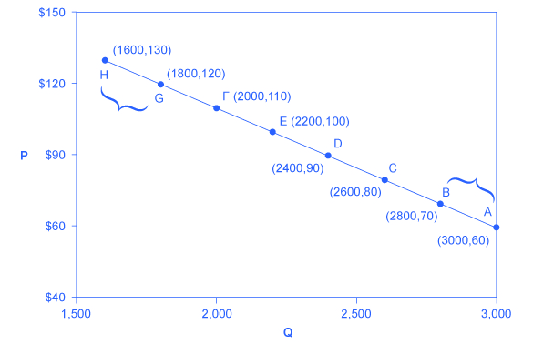
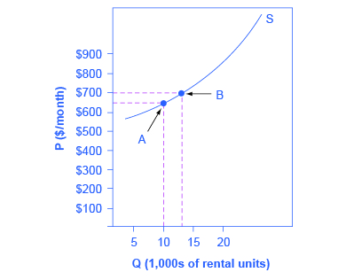

By the end of this section, you will be able to:
* Calculate the price elasticity of demand
* Calculate the price elasticity of supply

Both the demand and supply curve show the relationship between price and the number of units demanded or supplied. **Price elasticity**{: data-type="term"} is the ratio between the percentage change in the quantity demanded (Qd) or supplied (Qs) and the corresponding percent change in price. The **price elasticity of demand**{: data-type="term"} is the percentage change in the quantity *demanded* of a good or service divided by the percentage change in the price. The **price elasticity of supply**{: data-type="term"} is the percentage change in quantity *supplied* divided by the percentage change in price.

Elasticities can be usefully divided into three broad categories: elastic, inelastic, and unitary. An **elastic demand**{: data-type="term"} or **elastic supply**{: data-type="term"} is one in which the elasticity is greater than one, indicating a high responsiveness to changes in price. Elasticities that are less than one indicate low responsiveness to price changes and correspond to **inelastic demand**{: data-type="term"} or **inelastic supply**{: data-type="term"}. **Unitary elasticities**{: data-type="term"} indicate proportional responsiveness of either demand or supply, as summarized in [\[link\]](#Table_05_01).

<table id="Table_05_01" summary="If percentage change in quantity is greater than percentage change in price then percentage change in quantity divided by percentage change in price is greater than 1, and it is called &#x201C;Elastic.&#x201D; If percentage change in quantity is equal to percentage change in price then percentage change in quantity divided by percentage change in price is equal to 1, and it is called &#x201C;Unitary.&#x201D; If percentage change in quantity is less than percentage change in price then percentage change in quantity divided by percentage change in price is less than 1, and it is called &#x201C;Inelastic.&#x201D;"><caption>Elastic, Inelastic, and Unitary: Three Cases of Elasticity</caption><thead>
<tr>
	<th>If . . .</th>
	<th>Then . . .</th>
	<th>And It Is Called . . .</th>

</tr>
</thead><tbody>
        <tr>
          <td><math xmlns="http://www.w3.org/1998/Math/MathML"><mtext>% change in quantity</mtext><mo>&gt;</mo><mtext>% change in price</mtext></math></td>
          <td><math xmlns="http://www.w3.org/1998/Math/MathML"><mfrac><mrow><mtext>% change in quantity</mtext></mrow><mrow><mtext>% change in price</mtext></mrow></mfrac><mo>&gt;</mo><mn>1</mn></math></td>
          <td> Elastic </td>
        </tr>

        <tr>
          <td><math xmlns="http://www.w3.org/1998/Math/MathML"><mtext>% change in quantity</mtext><mo>=</mo><mtext>% change in price</mtext></math></td>
          <td><math xmlns="http://www.w3.org/1998/Math/MathML"><mfrac><mrow><mtext>% change in quantity</mtext></mrow><mrow><mtext>% change in price</mtext></mrow></mfrac><mo>=</mo><mn>1</mn></math></td>
          <td> Unitary </td>
        </tr>

        <tr>
          <td><math xmlns="http://www.w3.org/1998/Math/MathML"><mtext>% change in quantity</mtext><mo>&lt;</mo><mtext>% change in price</mtext></math></td>
          <td><math xmlns="http://www.w3.org/1998/Math/MathML"><mfrac><mrow><mtext>% change in quantity</mtext></mrow><mrow><mtext>% change in price</mtext></mrow></mfrac><mo>&lt;</mo><mn>1</mn></math></td>
          <td> Inelastic </td>
        </tr>
      </tbody></table>

Before we get into the nitty gritty of elasticity, enjoy this [article][1] on elasticity and ticket prices at the Super Bowl.

  

To calculate elasticity, instead of using simple percentage changes in quantity and price, economists use the average percent change in both quantity and price. This is called the Midpoint Method for Elasticity, and is represented in the following equations:

<math xmlns="http://www.w3.org/1998/Math/MathML"><mtable columnspacing="2px" columnalign="right center left"><mtr><mtd><mtext>% change in quantity</mtext></mtd><mtd><mo>=</mo></mtd><mtd><mfrac><mrow><msub><mi mathvariant="normal">Q</mi><mn>2</mn></msub><mo>–</mo><mo /><msub><mi mathvariant="normal">Q</mi><mn>1</mn></msub></mrow><mrow><mfenced><mrow><msub><mi mathvariant="normal">Q</mi><mn>2</mn></msub><mo>+</mo><mo> </mo><msub><mi mathvariant="normal">Q</mi><mn>1</mn></msub></mrow></mfenced><mn>/2</mn></mrow></mfrac><mn> × 100</mn></mtd></mtr><mtr><mtd><mtext>% change in price</mtext></mtd><mtd><mo>=</mo></mtd><mtd><mfrac><mrow><msub><mi mathvariant="normal">P</mi><mn>2</mn></msub><mo>–</mo><mo> </mo><msub><mi mathvariant="normal">P</mi><mn>1</mn></msub></mrow><mrow><mfenced><mrow><msub><mi mathvariant="normal">P</mi><mn>2</mn></msub><mo>+</mo><mo> </mo><msub><mi mathvariant="normal">P</mi><mn>1</mn></msub></mrow></mfenced><mn>/2</mn></mrow></mfrac><mn> × 100</mn></mtd></mtr></mtable><mo> </mo></math>

The advantage of the is **Midpoint Method**{: data-type="term" .no-emphasis} is that one obtains the same elasticity between two price points whether there is a price increase or decrease. This is because the formula uses the same base for both cases.

# Calculating Price Elasticity of Demand

Let’s calculate the elasticity between points A and B and between points G and H shown in [\[link\]](#CNX_Econ_C05_003).

{: #CNX_Econ_C05_003 data-title="Calculating the Price Elasticity of Demand "}

First, apply the formula to calculate the elasticity as price decreases from $70 at point B to $60 at point A:

<math xmlns="http://www.w3.org/1998/Math/MathML"><mtable columnalign="right center left"><mtr><mtd><mtext>% change in quantity</mtext></mtd><mtd><mo>=</mo></mtd><mtd><mfrac><mrow><mn>3,000</mn><mo>–</mo><mn>2,800</mn></mrow><mrow><mo>(</mo><mn>3,000</mn><mo>+</mo><mn>2,800</mn><mo>)</mo><mo>/2</mo></mrow></mfrac><mn> × 100</mn></mtd></mtr><mtr><mtd /><mtd><mo>=</mo></mtd><mtd><mfrac><mn>200</mn><mn>2,900</mn></mfrac><mn> × 100</mn></mtd></mtr><mtr><mtd /><mtd><mo>=</mo></mtd><mtd><mn>6.9</mn></mtd></mtr><mtr><mtd><mtext>% change in price</mtext></mtd><mtd><mo>=</mo></mtd><mtd><mfrac><mrow><mn>60</mn><mo>–</mo><mn>70</mn></mrow><mrow><mo>(</mo><mn>60</mn><mo>+</mo><mn>70</mn><mo>)</mo><mn>/2</mn></mrow></mfrac><mn> × 100</mn></mtd></mtr><mtr><mtd /><mtd><mo>=</mo></mtd><mtd><mfrac><mrow><mn>–10</mn></mrow><mn>65</mn></mfrac><mn> × 100</mn></mtd></mtr><mtr><mtd /><mtd><mo>=</mo></mtd><mtd><mn>–15.4</mn></mtd></mtr><mtr><mtd><mtext>Price Elasticity of Demand</mtext></mtd><mtd><mo>=</mo></mtd><mtd><mfrac><mrow><mn>    6.9%</mn></mrow><mrow><mn>–15.4%</mn></mrow></mfrac></mtd></mtr><mtr><mtd /><mtd><mo>=</mo></mtd><mtd><mn>0.45</mn></mtd></mtr></mtable></math>

Therefore, the elasticity of demand between these two points is <math xmlns="http://www.w3.org/1998/Math/MathML"><mfrac><mrow><mn>    6.9%</mn></mrow><mrow><mo /><mn>–15.4%</mn></mrow></mfrac></math>

 which is 0.45, an amount smaller than one, showing that the demand is inelastic in this interval. Price elasticities of demand are *always* negative since price and quantity demanded always move in opposite directions (on the demand curve). By convention, we always talk about elasticities as positive numbers. So mathematically, we take the absolute value of the result. We will ignore this detail from now on, while remembering to interpret elasticities as positive numbers.

This means that, along the demand curve between point B and A, if the price changes by 1%, the quantity demanded will change by 0.45%. A change in the price will result in a smaller percentage change in the quantity demanded. For example, a 10% *increase* in the price will result in only a 4.5% *decrease* in quantity demanded. A 10% *decrease* in the price will result in only a 4.5% *increase* in the quantity demanded. Price elasticities of demand are negative numbers indicating that the demand curve is downward sloping, but are read as absolute values. The following Work It Out feature will walk you through calculating the price elasticity of demand.

Finding the Price Elasticity of Demand

Calculate the price elasticity of demand using the data in [\[link\]](#CNX_Econ_C05_003) for an increase in price from G to H. Has the elasticity increased or decreased?

Step 1. We know that:

<math xmlns="http://www.w3.org/1998/Math/MathML"><mtable columnspacing="2px" columnalign="right center left"><mtr><mtd><mtext>Price Elasticity of Demand</mtext></mtd><mtd><mo>=</mo></mtd><mtd><mfrac><mrow><mtext>% change in quantity</mtext></mrow><mrow><mtext>% change in price</mtext></mrow></mfrac></mtd></mtr></mtable></math>

Step 2. From the **Midpoint Formula**{: data-type="term" .no-emphasis} we know that:

<math xmlns="http://www.w3.org/1998/Math/MathML"><mtable columnspacing="2px" columnalign="right center left"><mtr><mtd><mo>% </mo><mtext>change in quantity</mtext></mtd><mtd><mo>=</mo></mtd><mtd><mfrac><mrow><msub><mtext>Q</mtext><mn>2</mn></msub><mo>–</mo><msub><mtext>Q</mtext><mn>1</mn></msub></mrow><mrow><mo>(</mo><mrow><msub><mtext>Q</mtext><mn>2</mn></msub><mo>+</mo><msub><mtext>Q</mtext><mn>1</mn></msub></mrow><mo>)/2</mo></mrow></mfrac><mn> × 100</mn></mtd></mtr><mtr><mtd><mo>% </mo><mtext>change in price</mtext></mtd><mtd><mo>=</mo></mtd><mtd><mfrac><mrow><msub><mtext>P</mtext><mn>2</mn></msub><mo>–</mo><msub><mtext>P</mtext><mn>1</mn></msub></mrow><mrow><mo>(</mo><mrow><msub><mtext>P</mtext><mn>2</mn></msub><mo>+</mo><msub><mtext>P</mtext><mn>1</mn></msub></mrow><mo>)/2</mo></mrow></mfrac><mo /><mn> × 100</mn></mtd></mtr></mtable></math>

Step 3. So we can use the values provided in the figure in each equation:

<math xmlns="http://www.w3.org/1998/Math/MathML"><mtable columnspacing="2px" columnalign="right center left"><mtr><mtd><mtext>% change in quantity</mtext></mtd><mtd><mo>=</mo></mtd><mtd><mfrac><mrow><mn>1,600</mn><mo>–</mo><mn>1,800</mn></mrow><mrow><mo>(</mo><mrow><mn>1,600</mn><mo>+</mo><mn>1,800</mn></mrow><mo>)/2</mo></mrow></mfrac><mo> × </mo><mn>100</mn></mtd></mtr><mtr><mtd /><mtd><mo>=</mo></mtd><mtd><mfrac><mrow><mn>–200</mn></mrow><mn>1,700</mn></mfrac><mo> × </mo><mn>100</mn></mtd></mtr><mtr><mtd /><mtd><mo>=</mo></mtd><mtd><mn>–11</mn><mo>.</mo><mn>76</mn></mtd></mtr><mtr><mtd><mtext>% change in price</mtext></mtd><mtd><mo>=</mo></mtd><mtd><mfrac><mrow><mn>130</mn><mo>–</mo><mn>120</mn></mrow><mrow><mo>(</mo><mrow><mn>130</mn><mo>+</mo><mn>120</mn></mrow><mo>)/2</mo></mrow></mfrac><mo> × </mo><mn>100</mn></mtd></mtr><mtr><mtd /><mtd><mo>=</mo></mtd><mtd><mfrac><mn>10</mn><mn>125</mn></mfrac><mo> × </mo><mn>100</mn></mtd></mtr><mtr><mtd /><mtd><mo>=</mo></mtd><mtd><mn>8</mn><mo>.</mo><mn>0</mn></mtd></mtr></mtable></math>

Step 4. Then, those values can be used to determine the price elasticity of demand:

<math xmlns="http://www.w3.org/1998/Math/MathML"><mtable columnspacing="2px" columnalign="right center left"><mtr><mtd><mtext>Price Elasticity of Demand</mtext></mtd><mtd><mo>=</mo></mtd><mtd><mfrac><mrow><mtext>% change in quantity</mtext></mrow><mrow><mtext>% change in price</mtext></mrow></mfrac></mtd></mtr><mtr><mtd /><mtd><mo>=</mo></mtd><mtd><mfrac><mrow><mn>–11.76</mn></mrow><mn>8</mn></mfrac></mtd></mtr><mtr><mtd /><mtd><mo>=</mo></mtd><mtd><mn>1.47</mn></mtd></mtr></mtable></math>

Therefore, the elasticity of demand from G to H 1.47. The magnitude of the elasticity has increased (in absolute value) as we moved up along the **demand curve**{: data-type="term" .no-emphasis} from points A to B. Recall that the elasticity between these two points was 0.45. Demand was inelastic between points A and B and elastic between points G and H. This shows us that price elasticity of demand changes at different points along a **straight-line demand curve**{: data-type="term" .no-emphasis}.

# Calculating the Price Elasticity of Supply

Assume that an apartment rents for $650 per month and at that price 10,000 units are rented as shown in [\[link\]](#CNX_Econ_C05_023). When the price increases to $700 per month, 13,000 units are supplied into the market. By what percentage does apartment supply increase? What is the price sensitivity?

{: #CNX_Econ_C05_023 data-title="Price Elasticity of Supply "}

Using the **Midpoint Method**{: data-type="term" .no-emphasis},

<math xmlns="http://www.w3.org/1998/Math/MathML"><mtable columnalign="right center left"><mtr><mtd><mtext>% change in quantity</mtext></mtd><mtd><mo>=</mo></mtd><mtd><mfrac><mrow><mn>13,000</mn><mo>–</mo><mn>10,000</mn></mrow><mrow><mo>(</mo><mn>13,000</mn><mo>+</mo><mn>10,000</mn><mo>)/2</mo></mrow></mfrac><mn> × 100</mn></mtd></mtr><mtr><mtd /><mtd><mo>=</mo></mtd><mtd><mfrac><mn>3,000</mn><mn>11,500</mn></mfrac><mn> × 100</mn></mtd></mtr><mtr><mtd /><mtd><mo>=</mo></mtd><mtd><mn>26.1</mn></mtd></mtr><mtr><mtd><mtext>% change in price</mtext></mtd><mtd><mo>=</mo></mtd><mtd><mfrac><mrow><mn>$700</mn><mo>–</mo><mn>$600</mn></mrow><mrow><mo>(</mo><mn>$700</mn><mo>+</mo><mn>$650</mn><mo>)/2</mo></mrow></mfrac><mn> × 100</mn></mtd></mtr><mtr><mtd /><mtd><mo>=</mo></mtd><mtd><mfrac><mn>50</mn><mn>675</mn></mfrac><mn> × 100</mn></mtd></mtr><mtr><mtd /><mtd><mo>=</mo></mtd><mtd><mn>7.4</mn></mtd></mtr><mtr><mtd><mtext>Price Elasticity of Supply</mtext></mtd><mtd><mo>=</mo></mtd><mtd><mfrac><mrow><mn>26.1%</mn></mrow><mrow><mn>  7.4%</mn></mrow></mfrac></mtd></mtr><mtr><mtd /><mtd><mo>=</mo></mtd><mtd><mn>3.53</mn></mtd></mtr></mtable></math>

Again, as with the elasticity of demand, the elasticity of supply is not followed by any units. Elasticity is a ratio of one percentage change to another percentage change—nothing more—and is read as an absolute value. In this case, a 1% rise in price causes an increase in quantity supplied of 3.5%. The greater than one elasticity of supply means that the percentage change in quantity supplied will be greater than a one percent price change. If you\'re starting to wonder if the concept of slope fits into this calculation, read the following Clear It Up box.

Is the elasticity the slope?

It is a common mistake to confuse the slope of either the supply or demand curve with its elasticity. The slope is the rate of change in units along the curve, or the rise/run (change in y over the change in x). For example, in [\[link\]](#CNX_Econ_C05_003), each point shown on the demand curve, price drops by $10 and the number of units demanded increases by 200. So the slope is –10/200 along the entire demand curve and does not change. The price elasticity, however, changes along the curve. Elasticity between points A and B was 0.45 and increased to 1.47 between points G and H. Elasticity is the *percentage* change, which is a different calculation from the slope and has a different meaning.

When we are at the upper end of a demand curve, where price is high and the quantity demanded is low, a small change in the quantity demanded, even in, say, one unit, is pretty big in percentage terms. A change in price of, say, a dollar, is going to be much less important in percentage terms than it would have been at the bottom of the demand curve. Likewise, at the bottom of the demand curve, that one unit change when the quantity demanded is high will be small as a percentage.

So, at one end of the demand curve, where we have a large percentage change in quantity demanded over a small percentage change in price, the elasticity value would be high, or demand would be relatively elastic. Even with the same change in the price and the same change in the quantity demanded, at the other end of the demand curve the quantity is much higher, and the price is much lower, so the percentage change in quantity demanded is smaller and the percentage change in price is much higher. That means at the bottom of the curve we\'d have a small numerator over a large denominator, so the elasticity measure would be much lower, or inelastic.

As we move along the demand curve, the values for quantity and price go up or down, depending on which way we are moving, so the percentages for, say, a $1 difference in price or a one unit difference in quantity, will change as well, which means the ratios of those percentages will change.

# Key Concepts and Summary

Price elasticity measures the responsiveness of the quantity demanded or supplied of a good to a change in its price. It is computed as the percentage change in quantity demanded (or supplied) divided by the percentage change in price. Elasticity can be described as elastic (or very responsive), unit elastic, or inelastic (not very responsive). Elastic demand or supply curves indicate that quantity demanded or supplied respond to price changes in a greater than proportional manner. An inelastic demand or supply curve is one where a given percentage change in price will cause a smaller percentage change in quantity demanded or supplied. A unitary elasticity means that a given percentage change in price leads to an equal percentage change in quantity demanded or supplied.

# Self-Check Questions

From the data shown in [[link]](#Table_05_02) about demand for smart phones, calculate the price elasticity of demand from: point B to point C, point D to point E, and point G to point H. Classify the elasticity at each point as elastic, inelastic, or unit elastic.

<table id="Table_05_02" summary="For A, P = 60 and Q = 3,000. For B, P = 70 and Q = 2,800. For C, P = 80 and Q = 2,600. For D, P = 90 and Q = 2,400. For E, P = 100 and Q = 2,200. For F, P = 110 and Q = 2,000. For G, P = 120 and Q = 1,800. For H, P = 130 and Q = 1,600."><caption /><thead>

<tr>
	<th>Points</th>
	<th>P</th>
	<th>Q</th>
</tr>
</thead><tbody>
        <tr>
          <td>A</td>
          <td>60</td>
          <td>3,000</td>
        </tr>

        <tr>
          <td>B</td>
          <td>70</td>
          <td>2,800</td>
        </tr>

        <tr>
          <td>C</td>
          <td>80</td>
          <td>2,600 </td>
        </tr>

        <tr>
          <td>D</td>
          <td>90</td>
          <td> 2,400</td>
        </tr>

        <tr>
          <td>E </td>
          <td>100</td>
          <td>2,200</td>
        </tr>

        <tr>
          <td>F </td>
          <td>110</td>
          <td>2,000 </td>
        </tr>

        <tr>
          <td>G </td>
          <td>120</td>
          <td>1,800</td>
        </tr>

        <tr>
          <td>H </td>
          <td>130</td>
<td>1,600</td>
        </tr>
      </tbody></table>

From point B to point C, price rises from $70 to $80, and Qd decreases from 2,800 to 2,600. So:

<math xmlns="http://www.w3.org/1998/Math/MathML"><mtable columnspacing="2px" columnalign="right center left"><mtr><mtd><mtext>% change in quantity</mtext></mtd><mtd><mo>=</mo></mtd><mtd><mfrac><mrow><mn>2600</mn><mo>–</mo><mn>2800</mn></mrow><mrow><mfenced><mrow><mn>2600</mn><mo>+</mo><mn>2800</mn></mrow></mfenced><mo>÷</mo><mn>2</mn></mrow></mfrac><mn> × 100</mn></mtd></mtr><mtr><mtd /><mtd><mo>=</mo></mtd><mtd><mfrac><mrow><mn>–200</mn></mrow><mn>2700</mn></mfrac><mn> × 100</mn></mtd></mtr><mtr><mtd /><mtd><mo>=</mo></mtd><mtd><mn>–7.41</mn></mtd></mtr><mtr><mtd><mtext>% change in price</mtext></mtd><mtd><mo>=</mo></mtd><mtd><mfrac><mrow><mn>80</mn><mo>–</mo><mn>70</mn></mrow><mrow><mfenced><mrow><mn>80</mn><mo>+</mo><mn>70</mn></mrow></mfenced><mo>÷</mo><mn>2</mn></mrow></mfrac><mn> × 100</mn></mtd></mtr><mtr><mtd /><mtd><mo>=</mo></mtd><mtd><mfrac><mn>10</mn><mn>75</mn></mfrac><mn> × 100</mn></mtd></mtr><mtr><mtd /><mtd><mo>=</mo></mtd><mtd><mn>13.33</mn></mtd></mtr><mtr><mtd><mtext>Elasticity of Demand</mtext></mtd><mtd><mo>=</mo></mtd><mtd><mfrac><mrow><mn>–7.41%</mn></mrow><mrow><mn>13.33%</mn></mrow></mfrac></mtd></mtr><mtr><mtd /><mtd><mo>=</mo></mtd><mtd><mn>0.56</mn></mtd></mtr></mtable></math>

The demand curve is inelastic in this area; that is, its elasticity value is less than one.

Answer from Point D to point E:

<math xmlns="http://www.w3.org/1998/Math/MathML"><mtable columnspacing="2px" columnalign="right center left"><mtr><mtd><mtext>% change in quantity</mtext></mtd><mtd><mo>=</mo></mtd><mtd><mfrac><mrow><mn>2200</mn><mo>–</mo><mn>2400</mn></mrow><mrow><mfenced><mrow><mn>2200</mn><mo>+</mo><mn>2400</mn></mrow></mfenced><mo>÷</mo><mn>2</mn></mrow></mfrac><mn> × 100</mn></mtd></mtr><mtr><mtd /><mtd><mo>=</mo></mtd><mtd><mfrac><mrow><mn>–200</mn></mrow><mn>2300</mn></mfrac><mn> × 100</mn></mtd></mtr><mtr><mtd /><mtd><mo>=</mo></mtd><mtd><mn>–8.7</mn></mtd></mtr><mtr><mtd><mo>%</mo><mo> </mo><mtext>change in price</mtext></mtd><mtd><mo>=</mo></mtd><mtd><mfrac><mrow><mn>100</mn><mo>–</mo><mn>90</mn></mrow><mrow><mfenced><mrow><mn>100</mn><mo>+</mo><mn>90</mn></mrow></mfenced><mo>÷</mo><mn>2</mn></mrow></mfrac><mn> × 100</mn></mtd></mtr><mtr><mtd /><mtd><mo>=</mo></mtd><mtd><mfrac><mn>10</mn><mn>95</mn></mfrac><mn> × 100</mn></mtd></mtr><mtr><mtd /><mtd><mo>=</mo></mtd><mtd><mn>10.53</mn></mtd></mtr><mtr><mtd><mtext>Elasticity of Demand</mtext></mtd><mtd><mo>=</mo></mtd><mtd><mfrac><mrow><mn>–8.7% </mn></mrow><mrow><mn>10.53%</mn></mrow></mfrac></mtd></mtr><mtr><mtd /><mtd><mo>=</mo></mtd><mtd><mn>0.83</mn></mtd></mtr></mtable></math>

The demand curve is inelastic in this area; that is, its elasticity value is less than one.

Answer from Point G to point H:

<math xmlns="http://www.w3.org/1998/Math/MathML"><mtable columnspacing="2px" columnalign="right center left"><mtr><mtd><mtext>% change in quantity</mtext></mtd><mtd><mo>=</mo></mtd><mtd><mfrac><mrow><mn>1600</mn><mo>–</mo><mn>1800</mn></mrow><mrow> <mrow><mn>1700</mn></mrow></mrow> </mfrac><mn> × 100</mn></mtd></mtr> <mtr><mtd /><mtd><mo>=</mo></mtd><mtd><mfrac><mrow><mn>–200</mn></mrow><mn>1700</mn></mfrac><mn> × 100</mn></mtd></mtr> <mtr><mtd /><mtd><mo>=</mo></mtd><mtd><mn>–11.76</mn></mtd></mtr><mtr><mtd><mtext>% change in price</mtext></mtd><mtd><mo>=</mo></mtd><mtd><mfrac><mrow><mn>130</mn><mo>–</mo><mn>120</mn></mrow><mrow> <mn>125</mn></mrow></mfrac> <mn> × 100</mn></mtd></mtr> <mtr><mtd /><mtd><mo>=</mo></mtd><mtd><mfrac><mn>10</mn><mn>125</mn></mfrac><mn> × 100</mn></mtd></mtr> <mtr><mtd /><mtd><mo>=</mo></mtd><mtd><mn>7.81</mn></mtd></mtr><mtr><mtd><mtext>Elasticity of Demand</mtext></mtd><mtd><mo>=</mo></mtd><mtd><mfrac><mrow><mn>–11.76% </mn></mrow><mrow><mn> 7.81%</mn></mrow></mfrac></mtd></mtr> <mtr><mtd /><mtd><mo>=</mo></mtd><mtd><mn>–1.51</mn></mtd></mtr></mtable></math>

The demand curve is elastic in this interval.

From the data shown in [[link]](#Table_05_03) about supply of alarm clocks, calculate the price elasticity of supply from: point J to point K, point L to point M, and point N to point P. Classify the elasticity at each point as elastic, inelastic, or unit elastic.

| Point | Price | Quantity Supplied |
|----------
| J | $8 | 50 |
| K | $9 | 70 |
| L | $10 | 80 |
| M | $11 | 88 |
| N | $12 | 95 |
| P | $13 | 100 |
{: #Table_05_03 summary="For J, Price = $8 and Quantity Supplied = 50. For K, Price = $9 and Quantity supplied = 70. For L, Price = $10 and Quantity supplied = 80. For M, Price = $11 and Quantity supplied = 88. For N, Price = $12 and Quantity supplied = 95. For P, Price = $13 and Quantity supplied = 100. "}

From point J to point K, price rises from $8 to $9, and quantity rises from 50 to 70. So:

<math xmlns="http://www.w3.org/1998/Math/MathML"><mtable columnspacing="2px" columnalign="right center left"><mtr><mtd><mtext>% change in quantity</mtext></mtd><mtd><mo>=</mo></mtd><mtd><mfrac><mrow><mn>70</mn><mo>–</mo><mn>50</mn></mrow><mrow><mfenced><mrow><mn>70</mn><mo>+</mo><mn>50</mn></mrow></mfenced><mo>÷</mo><mn>2</mn></mrow></mfrac><mn> × 100</mn></mtd></mtr><mtr><mtd /><mtd><mo>=</mo></mtd><mtd><mfrac><mrow><mn>20</mn></mrow><mn>60</mn></mfrac><mn> × 100</mn></mtd></mtr><mtr><mtd /><mtd><mo>=</mo></mtd><mtd><mn>33.33</mn></mtd></mtr><mtr><mtd><mtext>% change in price</mtext></mtd><mtd><mo>=</mo></mtd><mtd><mfrac><mrow><mn>$9</mn><mo>–</mo><mn>$8</mn></mrow><mrow><mfenced><mrow><mn>$9</mn><mo>+</mo><mn>$8</mn></mrow></mfenced><mo>÷</mo><mn>2</mn></mrow></mfrac><mn> × 100</mn></mtd></mtr><mtr><mtd /><mtd><mo>=</mo></mtd><mtd><mfrac><mn>1</mn><mtd><mn>8.5</mn></mtd></mfrac><mn> × 100</mn></mtd></mtr><mtr><mtd /><mtd><mo>=</mo></mtd><mtd><mn>11.76</mn></mtd></mtr><mtr><mtd><mtext>Elasticity of Supply</mtext></mtd><mtd><mo>=</mo></mtd><mtd><mfrac><mrow><mn>33.33%</mn></mrow><mrow><mn>11.76%</mn></mrow></mfrac></mtd></mtr><mtr><mtd /><mtd><mo>=</mo></mtd><mtd><mn>2.83</mn></mtd></mtr></mtable></math>

The supply curve is elastic in this area; that is, its elasticity value is greater than one.

From point L to point M, the price rises from $10 to $11, while the Qs rises from 80 to 88:

<math xmlns="http://www.w3.org/1998/Math/MathML"><mtable columnspacing="2px" columnalign="right center left"><mtr><mtd><mtext>% change in quantity</mtext></mtd><mtd><mo>=</mo></mtd><mtd><mfrac><mrow><mn>88</mn><mo>–</mo><mn>80</mn></mrow><mrow><mfenced><mrow><mn>88</mn><mo>+</mo><mn>80</mn></mrow></mfenced><mo>÷</mo><mn>2</mn></mrow></mfrac><mn> × 100</mn></mtd></mtr><mtr><mtd /><mtd><mo>=</mo></mtd><mtd><mfrac><mn>8</mn><mn>84</mn></mfrac><mn> × 100</mn></mtd></mtr><mtr><mtd /><mtd><mo>=</mo></mtd><mtd><mn>9.52</mn></mtd></mtr><mtr><mtd><mtext>%change in price</mtext></mtd><mtd><mo>=</mo></mtd><mtd><mfrac><mrow><mn>$11</mn><mo>–</mo><mn>$10</mn></mrow><mrow><mfenced><mrow><mn>$11</mn><mo>+</mo><mn>$10</mn></mrow></mfenced><mo>÷</mo><mn>2</mn></mrow></mfrac><mn> × 100</mn></mtd></mtr><mtr><mtd /><mtd><mo>=</mo></mtd><mtd><mfrac><mn>1</mn><mrow><mn>10.5</mn></mrow></mfrac><mn> × 100</mn></mtd></mtr><mtr><mtd /><mtd><mo>=</mo></mtd><mtd><mn>9.52</mn></mtd></mtr><mtr><mtd><mtext>Elasticity of Demand</mtext></mtd><mtd><mo>=</mo></mtd><mtd><mfrac><mrow><mn>9.52%</mn></mrow><mrow><mn>9.52%</mn></mrow></mfrac></mtd></mtr><mtr><mtd /><mtd><mo>=</mo></mtd><mtd><mn>1.0</mn></mtd></mtr></mtable></math>

The supply curve has unitary elasticity in this area.

From point N to point P, the price rises from $12 to $13, and Qs rises from 95 to 100:

<math xmlns="http://www.w3.org/1998/Math/MathML"><mtable columnspacing="2px" columnalign="right center left"><mtr><mtd><mtext>% change in quantity</mtext></mtd><mtd><mo>=</mo></mtd><mtd><mfrac><mrow><mn>100</mn><mo>–</mo><mn>95</mn></mrow><mrow><mfenced><mrow><mn>100</mn><mo>+</mo><mn>95</mn></mrow></mfenced><mo>÷</mo><mn>2</mn></mrow></mfrac><mo>×</mo><mn>100</mn></mtd></mtr><mtr><mtd /><mtd><mo>=</mo></mtd><mtd><mfrac><mn>5</mn><mrow><mn>97.5</mn></mrow></mfrac><mo>×</mo><mn>100</mn></mtd></mtr><mtr><mtd /><mtd><mo>=</mo></mtd><mtd><mn>5.13</mn></mtd></mtr><mtr><mtd><mtext>% change in price</mtext></mtd><mtd><mo>=</mo></mtd><mtd><mfrac><mrow><mn>$13</mn><mo>–</mo><mn>$12</mn></mrow><mrow><mfenced><mrow><mn>$13</mn><mo>+</mo><mn>$12</mn></mrow></mfenced><mo>÷</mo><mn>2</mn></mrow></mfrac><mn> × 100</mn></mtd></mtr><mtr><mtd /><mtd><mo>=</mo></mtd><mtd><mfrac><mn>1</mn><mrow><mn>12.5</mn></mrow></mfrac><mn> × 100</mn></mtd></mtr><mtr><mtd /><mtd><mo>=</mo></mtd><mtd><mn>8.0</mn></mtd></mtr><mtr><mtd><mtext>Elasticity of Supply</mtext></mtd><mtd><mo>=</mo></mtd><mtd><mfrac><mrow><mn>5.13%</mn></mrow><mrow><mn>8.0%  </mn></mrow></mfrac></mtd></mtr><mtr><mtd /><mtd><mo>=</mo></mtd><mtd><mn>0.64</mn></mtd></mtr></mtable></math>

The supply curve is inelastic in this region of the supply curve.

# Review Questions

What is the formula for calculating elasticity?

What is the price elasticity of demand? Can you explain it in your own words?

What is the price elasticity of supply? Can you explain it in your own words?

# Critical Thinking Questions

Transatlantic air travel in business class has an estimated elasticity of demand of 0.40 less than transatlantic air travel in economy class, with an estimated price elasticity of 0.62. Why do you think this is the case?

What is the relationship between price elasticity and position on the demand curve? For example, as you move up the demand curve to higher prices and lower quantities, what happens to the measured elasticity? How would you explain that?

# Problems

The equation for a demand curve is P = 48 – 3Q. What is the elasticity in moving from a quantity of 5 to a quantity of 6?

The equation for a demand curve is P = 2/Q. What is the elasticity of demand as price falls from 5 to 4? What is the elasticity of demand as the price falls from 9 to 8? Would you expect these answers to be the same?

The equation for a supply curve is 4P = Q. What is the elasticity of supply as price rises from 3 to 4? What is the elasticity of supply as the price rises from 7 to 8? Would you expect these answers to be the same?

The equation for a supply curve is P = 3Q – 8. What is the elasticity in moving from a price of 4 to a price of 7?

[1]: http://openstaxcollege.org/l/Super_Bowl
