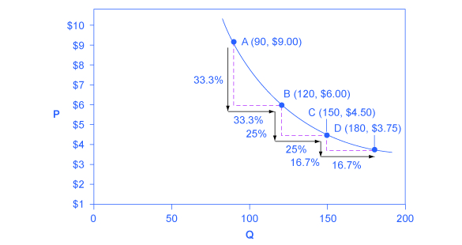
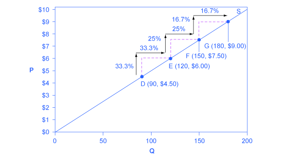

By the end of this section, you will be able to:

* Differentiate between infinite and zero elasticity
* Analyze graphs in order to classify elasticity as constant unitary, infinite, or zero

There are two extreme cases of elasticity: when elasticity equals zero and when it is infinite. A third case is that of constant unitary elasticity. We will describe each case. **Infinite elasticity**{: data-type="term"} or **perfect elasticity**{: data-type="term"} refers to the extreme case where either the quantity demanded (Qd) or supplied (Qs) changes by an infinite amount in response to any change in price at all. In both cases, the supply and the **demand curve**{: data-type="term" .no-emphasis} are horizontal as shown in [\[link\]](#CNX_Econ_C05_006). While perfectly elastic supply curves are unrealistic, goods with readily available inputs and whose production can be easily expanded will feature highly elastic supply curves. Examples include pizza, bread, books and pencils. Similarly, perfectly elastic demand is an extreme example. But luxury goods, goods that take a large share of individuals’ income, and goods with many substitutes are likely to have highly elastic demand curves. Examples of such goods are Caribbean cruises and sports vehicles.

 elastic demand curve and supply curve. The quantity supplied or demanded is extremely responsive to price changes, moving from zero for prices close to P to infinite when price reach P."){: #CNX_Econ_C05_006 data-title="Infinite Elasticity "}

**Zero elasticity**{: data-type="term"} or **perfect inelasticity**{: data-type="term"}, as depicted in [\[link\]](#CNX_Econ_C05_008) refers to the extreme case in which a percentage change in price, no matter how large, results in zero change in quantity. While a perfectly inelastic supply is an extreme example, goods with limited supply of inputs are likely to feature highly inelastic supply curves. Examples include diamond rings or housing in prime locations such as apartments facing Central Park in New York City. Similarly, while perfectly inelastic demand is an extreme case, necessities with no close substitutes are likely to have highly inelastic demand curves. This is the case of life-saving drugs and gasoline.

 demanded or (b) supplied, regardless of the price."){: #CNX_Econ_C05_008 data-title="Zero Elasticity "}

**Constant unitary elasticity**{: data-type="term" .no-emphasis}, in either a supply or demand curve, occurs when a price change of one percent results in a quantity change of one percent. [\[link\]](#CNX_Econ_C05_016) shows a demand curve with constant unit elasticity. As we move down the demand curve from A to B, the price falls by 33% and quantity demanded rises by 33%; as you move from B to C, the price falls by 25% and the quantity demanded rises by 25%; as you move from C to D, the price falls by 16% and the quantity rises by 16%. Notice that in absolute value, the declines in price, as you step down the demand curve, are not identical. Instead, the price falls by $3 from A to B, by a smaller amount of $1.50 from B to C, and by a still smaller amount of $0.75 from C to D. As a result, a demand curve with constant unitary elasticity moves from a steeper slope on the left and a flatter slope on the right—and a curved shape overall.

{: #CNX_Econ_C05_016 data-title="A Constant Unitary Elasticity Demand Curve "}

Unlike the demand curve with unitary elasticity, the supply curve with unitary elasticity is represented by a straight line. In moving up the supply curve from left to right, each increase in quantity of 30, from 90 to 120 to 150 to 180, is equal in absolute value. However, in percentage value, the steps are decreasing, from 33.3% to 25% to 16.7%, because the original quantity points in each percentage calculation are getting larger and larger, which expands the denominator in the elasticity calculation.

Consider the price changes moving up the supply curve in [\[link\]](#CNX_Econ_C05_017). From points D to E to F and to G on the supply curve, each step of $1.50 is the same in absolute value. However, if the price changes are measured in percentage change terms, they are also decreasing, from 33.3% to 25% to 16.7%, because the original price points in each percentage calculation are getting larger and larger in value. Along the constant unitary elasticity supply curve, the percentage quantity increases on the horizontal axis exactly match the percentage price increases on the vertical axis—so this supply curve has a constant unitary elasticity at all points.

 {: #CNX_Econ_C05_017 data-title="A Constant Unitary Elasticity Supply Curve "}

### Key Concepts and Summary

Infinite or perfect elasticity refers to the extreme case where either the quantity demanded or supplied changes by an infinite amount in response to any change in price at all. Zero elasticity refers to the extreme case in which a percentage change in price, no matter how large, results in zero change in quantity. Constant unitary elasticity in either a supply or demand curve refers to a situation where a price change of one percent results in a quantity change of one percent.

### Self-Check Questions

Why is the demand curve with constant unitary elasticity concave?

The demand curve with constant unitary elasticity is concave because at high prices, a one percent decrease in price results in more than a one percent increase in quantity. As we move down the demand curve, price drops and the one percent decrease in price causes less than a one percent increase in quantity.

Why is the supply curve with constant unitary elasticity a straight line?

The constant unitary elasticity is a straight line because the curve slopes upward and both price and quantity are increasing proportionally.

### Review Questions

Describe the general appearance of a demand or a supply curve with zero elasticity.

Describe the general appearance of a demand or a supply curve with infinite elasticity.

### Critical Thinking Question

Can you think of an industry (or product) with near infinite elasticity of supply in the short term? That is, what is an industry that could increase Qs almost without limit in response to an increase in the price?

### Problems

The supply of paintings by Leonardo Da Vinci, who painted the *Mona Lisa* and *The Last Supper* and died in 1519, is highly inelastic. Sketch a supply and demand diagram, paying attention to the appropriate elasticities, to illustrate that demand for these paintings will determine the price.

Say that a certain stadium for professional football has 70,000 seats. What is the shape of the supply curve for tickets to football games at that stadium? Explain.

When someone’s kidneys fail, the person needs to have medical treatment with a dialysis machine (unless or until they receive a kidney transplant) or they will die. Sketch a supply and demand diagram, paying attention to the appropriate elasticities, to illustrate that the supply of such dialysis machines will primarily determine the price.

### Glossary
{: data-type="glossary-title"}

constant unitary elasticity
: when a given percent price change in price leads to an equal percentage change in quantity demanded or supplied
^

infinite elasticity
: the extremely elastic situation of demand or supply where quantity changes by an infinite amount in response to any change in price; horizontal in appearance
^

perfect elasticity
: see infinite elasticity
^

zero inelasticity
: the highly inelastic case of demand or supply in which a percentage change in price, no matter how large, results in zero change in the quantity; vertical in appearance
^

perfect inelasticity
: see zero elasticity

