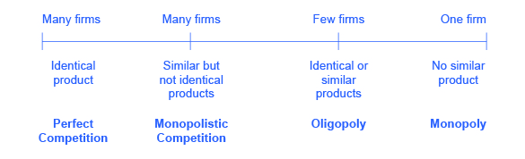

<?cnx.eoc class="summary" title="Chapter Review"?>

<?cnx.eoc class="self-check-questions" title="Self-Check Questions"?>

<?cnx.eoc class="review-questions" title="Review Questions"?>

<?cnx.eoc class="critical-thinking" title="Critical Thinking Questions"?>

<?cnx.eoc class="problems" title="Problems"?>

<?cnx.eoc class="references" title="References"?>

 "){: #CNX_Econ_C07_000 data-media-type="image/jpg"}

Amazon

In less than two decades, Amazon.com has transformed the way books are sold, bought, and even read. Prior to Amazon, books were primarily sold through independent bookstores with limited inventories in small retail locations. There were exceptions, of course; Borders and Barnes &amp; Noble offered larger stores in urban areas. In the last decade, however, independent bookstores have become few and far between, Borders has gone out of business, and Barnes &amp; Noble is struggling. Online delivery and purchase of books has indeed overtaken the more traditional business models. How has Amazon changed the book selling industry? How has it managed to crush its competition?

A major reason for the giant retailer’s success is its production model and cost structure, which has enabled Amazon to undercut the prices of its competitors even when factoring in the cost of shipping. Read on to see how firms great (like Amazon) and small (like your corner deli) determine what to sell, at what output and price.

Introduction to Cost and Industry Structure

In this chapter, you will learn about:

* Explicit and Implicit Costs, and Accounting and Economic Profit
* The Structure of Costs in the Short Run
* The Structure of Costs in the Long Run

This chapter is the first of four chapters that explore the *theory of the firm*. This theory explains that firms behave in much the same way as consumers behave. What does that mean? Let’s define what is meant by the firm. A **firm**{: data-type="term"} (or business) combines inputs of labor, capital, land, and raw or finished component materials to produce outputs. If the firm is successful, the outputs are more valuable than the inputs. This activity of **production**{: data-type="term"} goes beyond manufacturing (i.e., making things). It includes any process or service that creates value, including transportation, distribution, wholesale and retail sales. Production involves a number of important decisions that define the behavior of firms. These decisions include, but are not limited to:

* What product or products should the firm produce?
* How should the products be produced (i.e., what production process should be used)?
* How much output should the firm produce?
* What price should the firm charge for its products?
* How much labor should the firm employ?

The answers to these questions depend on the production and cost conditions facing each firm. The answers also depend on the structure of the market for the product(s) in question. Market structure is a multidimensional concept that involves how competitive the industry is. It is defined by questions such as these:

* How much market power does each firm in the industry possess?
* How similar is each firm’s product to the products of other firms in the industry?
* How difficult is it for new firms to enter the industry?
* Do firms compete on the basis of price, advertising, or other product differences?

[\[link\]](#CNX_Econ_C07_001) illustrates the range of different market structures, which we will explore in [Perfect Competition](/m48645){: .target-chapter}, [Monopoly](/m48650){: .target-chapter}, and [Monopolistic Competition and Oligopoly](/m48658){: .target-chapter}.

{: #CNX_Econ_C07_001 data-media-type="image/jpg" data-title="The Spectrum of Competition "}

First let’s take a look at how firms determine their costs and desired profit levels. Then we will discuss costs in the short run and long run and the factors that can influence each.

