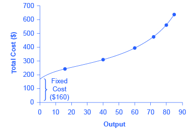

By the end of this section, you will be able to:

* Analyze short-run costs as influenced by total cost, fixed cost, variable cost, marginal cost, and average cost.
* Calculate average profit
* Evaluate patterns of costs to determine potential profit

The cost of producing a firm’s output depends on how much **labor**{: data-type="term" .no-emphasis} and **physical capital**{: data-type="term" .no-emphasis} the firm uses. A list of the costs involved in producing cars will look very different from the costs involved in producing computer software or haircuts or fast-food meals. However, the cost structure of all firms can be broken down into some common underlying patterns. When a firm looks at its **total costs**{: data-type="term"} of production in the short run, a useful starting point is to divide total costs into two categories: fixed costs that cannot be changed in the short run and variable costs that can be changed.

# Fixed and Variable Costs

**Fixed costs**{: data-type="term"} are expenditures that do not change regardless of the level of production, at least not in the short term. Whether you produce a lot or a little, the fixed costs are the same. One example is the rent on a factory or a retail space. Once you sign the lease, the rent is the same regardless of how much you produce, at least until the lease runs out. Fixed costs can take many other forms: for example, the cost of machinery or equipment to produce the product, research and development costs to develop new products, even an expense like advertising to popularize a brand name. The level of fixed costs varies according to the specific line of business: for instance, manufacturing computer chips requires an expensive factory, but a local moving and hauling business can get by with almost no fixed costs at all if it rents trucks by the day when needed.

**Variable costs**{: data-type="term"}, on the other hand, are incurred in the act of producing—the more you produce, the greater the variable cost. Labor is treated as a variable cost, since producing a greater quantity of a good or service typically requires more workers or more work hours. Variable costs would also include raw materials.

As a concrete example of fixed and variable costs, consider the barber shop called “The Clip Joint” shown in [\[link\]](#CNX_Econ_C07_002). The data for output and costs are shown in [\[link\]](#Table_07_02). The fixed costs of operating the barber shop, including the space and equipment, are $160 per day. The variable costs are the costs of hiring barbers, which in our example is $80 per barber each day. The first two columns of the table show the quantity of haircuts the barbershop can produce as it hires additional barbers. The third column shows the fixed costs, which do not change regardless of the level of production. The fourth column shows the variable costs at each level of output. These are calculated by taking the amount of labor hired and multiplying by the wage. For example, two barbers cost: 2 × $80 = $160. Adding together the fixed costs in the third column and the variable costs in the fourth column produces the total costs in the fifth column. So, for example, with two barbers the total cost is: $160 + $160 = $320.

<table id="Table_07_02" summary="This table has 5 columns and 7 rows of data. The following information reflects the data within each column from top to bottom. Column 1 shows Labor 1, 2, 3, 4, 5, 6, 7. Column 2 shows Quantity 16, 40, 60, 72, 80, 84, 82. Column 3 shows Fixed cost $160 all throughout. Column 4 shows Variable cost $80, $160, $240, $320, $400, $480, $560. Column 5 shows Total cost $240, $320, $400, $480, $560, $640, $720."><caption>Output and Total Costs</caption><thead>
<tr>
	<th>Labor</th>
	<th>Quantity</th>
	<th>Fixed Cost</th>
	<th>Variable Cost</th>
	<th>Total Cost</th>
</tr>
</thead><tbody>
        <tr>
          <td>1</td>
          <td>16</td>
          <td>$160</td>
          <td>$80</td>
          <td>$240</td>
        </tr>

        <tr>
          <td>2</td>
          <td>40</td>
          <td>$160</td>
          <td>$160</td>
          <td>$320</td>
        </tr>

        <tr>
          <td>3</td>
          <td>60</td>
          <td>$160</td>
          <td>$240</td>
          <td>$400</td>
        </tr>

        <tr>
          <td>4</td>
          <td>72</td>
          <td>$160</td>
          <td>$320</td>
          <td>$480</td>
        </tr>

        <tr>
          <td>5</td>
          <td>80</td>
          <td>$160</td>
          <td>$400</td>
          <td>$560</td>
        </tr>

        <tr>
          <td>6</td>
          <td>84</td>
          <td>$160</td>
          <td>$480</td>
          <td>$640</td>
        </tr>

        <tr>
          <td>7</td>
          <td>82</td>
          <td>$160</td>
          <td>$560</td>
          <td>$720</td>
        </tr>

      </tbody></table>

 {: #CNX_Econ_C07_002 data-media-type="image/jpeg" data-title="How Output Affects Total Costs "}

The relationship between the quantity of output being produced and the cost of producing that output is shown graphically in the figure. The fixed costs are always shown as the vertical intercept of the total cost curve; that is, they are the costs incurred when output is zero so there are no variable costs.

You can see from the graph that once production starts, total costs and variable costs rise. While variable costs may initially increase at a decreasing rate, at some point they begin increasing at an increasing rate. This is caused by diminishing marginal returns, discussed in the chapter on [Choice in a World of Scarcity](/m48602){: .target-chapter}, which is easiest to see with an example. As the number of barbers increases from zero to one in the table, output increases from 0 to 16 for a marginal gain of 16; as the number rises from one to two barbers, output increases from 16 to 40, a marginal gain of 24. From that point on, though, the marginal gain in output diminishes as each additional barber is added. For example, as the number of barbers rises from two to three, the marginal output gain is only 20; and as the number rises from three to four, the marginal gain is only 12.

To understand the reason behind this pattern, consider that a one-man barber shop is a very busy operation. The single barber needs to do everything: say hello to people entering, answer the phone, cut hair, sweep up, and run the cash register. A second barber reduces the level of disruption from jumping back and forth between these tasks, and allows a greater division of labor and specialization. The result can be greater increasing marginal returns. However, as other barbers are added, the advantage of each additional barber is less, since the specialization of labor can only go so far. The addition of a sixth or seventh or eighth barber just to greet people at the door will have less impact than the second one did. This is the pattern of diminishing marginal returns. At some point, you may even see negative returns as the additional barbers begin bumping elbows and getting in each other’s way. In this case, the addition of still more barbers would actually cause output to decrease, as shown in the last row of [\[link\]](#Table_07_02). As a result, the total costs of production will begin to rise more rapidly as output increases.

This pattern of **diminishing marginal returns**{: data-type="term" .no-emphasis} is common in production. As another example, consider the problem of irrigating a crop on a farmer’s field. The plot of land is the fixed factor of production, while the water that can be added to the land is the key variable cost. As the farmer adds water to the land, output increases. But adding more and more water brings smaller and smaller increases in output, until at some point the water floods the field and actually reduces output. Diminishing marginal returns occur because, at a given level of fixed costs, each additional input contributes less and less to overall production.

# Average Total Cost, Average Variable Cost, Marginal Cost

The breakdown of total costs into fixed and variable costs can provide a basis for other insights as well. The first five columns of [\[link\]](#Table_07_03) duplicate the previous table, but the last three columns show average total costs, average variable costs, and marginal costs. These new measures analyze costs on a per-unit (rather than a total) basis and are reflected in the curves shown in [\[link\]](#CNX_Econ_C07_003).

 is calculated by dividing total cost by the total quantity produced. The average total cost curve is typically U-shaped. Average variable cost (AVC) is calculated by dividing variable cost by the quantity produced. The average variable cost curve lies below the average total cost curve and is typically U-shaped or upward-sloping. Marginal cost (MC) is calculated by taking the change in total cost between two levels of output and dividing by the change in output. The marginal cost curve is upward-sloping."){: #CNX_Econ_C07_003 data-media-type="image/jpeg" data-title="Cost Curves at the Clip Joint "}

<table id="Table_07_03" summary=""><caption>Different Types of Costs</caption><thead>
<tr>
	<th>Labor</th>
	<th>Quantity</th>
	<th>Fixed Cost</th>
	<th>Variable Cost</th>
	<th>Total Cost</th>
	<th>Marginal Cost</th>
	<th>Average Total Cost</th>
	<th>Average Variable Cost</th>
</tr>
</thead><tbody>
        <tr>
          <td>1</td>
          <td>16</td>
          <td>$160</td>
          <td>$80</td>
          <td>$240</td>
          <td>$5.00</td>
          <td>$15.00</td>
          <td>$5.00</td>
        </tr>

        <tr>
          <td>2</td>
          <td>40</td>
          <td>$160</td>
          <td>$160</td>
          <td>$320</td>
          <td>$3.30</td>
          <td>$8.00</td>
          <td>$4.00</td>
        </tr>

        <tr>
          <td>3</td>
          <td>60</td>
          <td>$160</td>
          <td>$240</td>
          <td>$400</td>
          <td>$4.00</td>
          <td>$6.60</td>
          <td>$4.00</td>
        </tr>

        <tr>
          <td>4</td>
          <td>72</td>
          <td>$160</td>
          <td>$320</td>
          <td>$480</td>
          <td>$6.60</td>
          <td>$6.60</td>
          <td>$4.40</td>
        </tr>

        <tr>
          <td>5</td>
          <td>80</td>
          <td>$160</td>
          <td>$400</td>
          <td>$560</td>
          <td>$10.00</td>
          <td>$7.00</td>
          <td>$5.00</td>
        </tr>

        <tr>
          <td>6</td>
          <td>84</td>
          <td>$160</td>
          <td>$480</td>
          <td>$640</td>
          <td>$20.00</td>
          <td>$7.60</td>
          <td>$5.70</td>
        </tr>

      </tbody></table>

**Average total cost**{: data-type="term"} (sometimes referred to simply as average cost) is total cost divided by the quantity of output. Since the total cost of producing 40 haircuts is $320, the average total cost for producing each of 40 haircuts is $320/40, or $8 per haircut. Average cost curves are typically U-shaped, as [\[link\]](#CNX_Econ_C07_003) shows. Average total cost starts off relatively high, because at low levels of output total costs are dominated by the fixed cost; mathematically, the denominator is so small that average total cost is large. Average total cost then declines, as the fixed costs are spread over an increasing quantity of output. In the average cost calculation, the rise in the numerator of total costs is relatively small compared to the rise in the denominator of quantity produced. But as output expands still further, the average cost begins to rise. At the right side of the average cost curve, total costs begin rising more rapidly as diminishing returns kick in.

**Average variable cost**{: data-type="term"} obtained when variable cost is divided by quantity of output. For example, the variable cost of producing 80 haircuts is $400, so the average variable cost is $400/80, or $5 per haircut. Note that at any level of output, the average variable cost curve will always lie below the curve for average total cost, as shown in [\[link\]](#CNX_Econ_C07_003). The reason is that average total cost includes average variable cost and average fixed cost. Thus, for Q = 80 haircuts, the average total cost is $8 per haircut, while the average variable cost is $5 per haircut. However, as output grows, fixed costs become relatively less important (since they do not rise with output), so average variable cost sneaks closer to average cost.

Average total and variable costs measure the average costs of producing some quantity of output. Marginal cost is somewhat different. **Marginal cost**{: data-type="term"} is the additional cost of producing one more unit of output. So it is not the cost per unit of *all* units being produced, but only the next one (or next few). Marginal cost can be calculated by taking the change in total cost and dividing it by the change in quantity. For example, as quantity produced increases from 40 to 60 haircuts, total costs rise by 400 – 320, or 80. Thus, the marginal cost for each of those marginal 20 units will be 80/20, or $4 per haircut. The marginal cost curve is generally upward-sloping, because diminishing marginal returns implies that additional units are more costly to produce. A small range of increasing marginal returns can be seen in the figure as a dip in the marginal cost curve before it starts rising. There is a point at which marginal and average costs meet, as the following Clear it Up feature discusses.

Where do marginal and average costs meet?

The marginal cost line intersects the average cost line exactly at the bottom of the average cost curve—which occurs at a quantity of 72 and cost of $6.60 in [\[link\]](#CNX_Econ_C07_003). The reason why the intersection occurs at this point is built into the economic meaning of marginal and average costs. If the marginal cost of production is below the average cost for producing previous units, as it is for the points to the left of where MC crosses ATC, then producing one more additional unit will reduce average costs overall—and the ATC curve will be downward-sloping in this zone. Conversely, if the marginal cost of production for producing an additional unit is above the average cost for producing the earlier units, as it is for points to the right of where MC crosses ATC, then producing a marginal unit will increase average costs overall—and the ATC curve must be upward-sloping in this zone. The point of transition, between where MC is pulling ATC down and where it is pulling it up, must occur at the minimum point of the ATC curve.

This idea of the marginal cost “pulling down” the average cost or “pulling up” the average cost may sound abstract, but think about it in terms of your own grades. If the score on the most recent quiz you take is lower than your average score on previous quizzes, then the marginal quiz pulls down your average. If your score on the most recent quiz is higher than the average on previous quizzes, the marginal quiz pulls up your average. In this same way, low marginal costs of production first pull down average costs and then higher marginal costs pull them up.

The numerical calculations behind average cost, average variable cost, and marginal cost will change from firm to firm. However, the general patterns of these curves, and the relationships and economic intuition behind them, will not change.

# Lessons from Alternative Measures of Costs

Breaking down total costs into fixed cost, marginal cost, average total cost, and average variable cost is useful because each statistic offers its own insights for the firm.

Whatever the firm’s quantity of production, total revenue must exceed total costs if it is to earn a profit. As explored in the chapter [Choice in a World of Scarcity](/m48602){: .target-chapter}, fixed costs are often **sunk costs**{: data-type="term" .no-emphasis} that cannot be recouped. In thinking about what to do next, sunk costs should typically be ignored, since this spending has already been made and cannot be changed. However, variable costs can be changed, so they convey information about the firm’s ability to cut costs in the present and the extent to which costs will increase if production rises.

Why are total cost and average cost not on the same graph?

Total cost, fixed cost, and variable cost each reflect different aspects of the cost of production over the entire quantity of output being produced. These costs are measured in dollars. In contrast, marginal cost, average cost, and average variable cost are costs per unit. In the previous example, they are measured as cost per haircut. Thus, it would not make sense to put all of these numbers on the same graph, since they are measured in different units ($ versus $ per unit of output).

It would be as if the vertical axis measured two different things. In addition, as a practical matter, if they were on the same graph, the lines for marginal cost, average cost, and average variable cost would appear almost flat against the horizontal axis, compared to the values for total cost, fixed cost, and variable cost. Using the figures from the previous example, the total cost of producing 40 haircuts is $320. But the average cost is $320/40, or $8. If you graphed both total and average cost on the same axes, the average cost would hardly show.

Average cost tells a firm whether it can earn profits given the current price in the market. If we divide profit by the quantity of output produced we get **average profit**{: data-type="term"}, also known as the firm’s *profit margin*. Expanding the equation for profit gives:

<math xmlns="http://www.w3.org/1998/Math/MathML"><mtable columnspacing="2px 2px 2px" columnalign="right center left"><mtr><mtd><mtext>average profit</mtext></mtd><mtd><mo>=</mo></mtd><mtd><mfrac><mtext>profit</mtext><mtext>quantity produced</mtext></mfrac></mtd></mtr><mtr><mtd /><mtd><mo>=</mo></mtd><mtd><mfrac><mtext>total revenue – total cost</mtext><mtext>quantity produced</mtext></mfrac></mtd></mtr><mtr><mtd /><mtd><mo>=</mo></mtd><mtd><mfrac><mtext>total revenue</mtext><mtext>quantity produced</mtext></mfrac><mo>–</mo><mfrac><mtext>total cost</mtext><mtext>quantity produced</mtext></mfrac></mtd></mtr><mtr><mtd /><mtd><mo>=</mo></mtd><mtd><mtext>average revenue – average cost</mtext></mtd></mtr></mtable></math>

But note that:

<math xmlns="http://www.w3.org/1998/Math/MathML"><mtable columnspacing="2px 2px 2px" columnalign="left center left"><mtr><mtd><mtext>average revenue</mtext></mtd><mtd><mo>=</mo></mtd><mtd><mfrac><mtext>price × quantity produced</mtext><mtext>quantity produced</mtext></mfrac></mtd></mtr><mtr><mtd /><mtd><mo>=</mo></mtd><mtd><mtext>price</mtext></mtd></mtr></mtable></math>

Thus:

<math xmlns="http://www.w3.org/1998/Math/MathML"><mtable columnspacing="2px" columnalign="right center left"><mtr><mtd><mtext>average profit</mtext></mtd><mtd><mo>=</mo></mtd><mtd><mtext>price – average cost</mtext></mtd></mtr></mtable></math>

This is the firm’s **profit margin**{: data-type="term" .no-emphasis}. This definition implies that if the market price is above average cost, average profit, and thus total profit, will be positive; if price is below average cost, then profits will be negative.

The marginal cost of producing an additional unit can be compared with the marginal revenue gained by selling that additional unit to reveal whether the additional unit is adding to total profit—or not. Thus, marginal cost helps producers understand how profits would be affected by increasing or decreasing production.

# A Variety of Cost Patterns

The pattern of costs varies among industries and even among firms in the same industry. Some businesses have high fixed costs, but low marginal costs. Consider, for example, an Internet company that provides medical advice to customers. Such a company might be paid by consumers directly, or perhaps hospitals or healthcare practices might subscribe on behalf of their patients. Setting up the website, collecting the information, writing the content, and buying or leasing the computer space to handle the web traffic are all fixed costs that must be undertaken before the site can work. However, when the website is up and running, it can provide a high quantity of service with relatively low variable costs, like the cost of monitoring the system and updating the information. In this case, the total cost curve might start at a high level, because of the high fixed costs, but then might appear close to flat, up to a large quantity of output, reflecting the low variable costs of operation. If the website is popular, however, a large rise in the number of visitors will overwhelm the website, and increasing output further could require a purchase of additional computer space.

For other firms, fixed costs may be relatively low. For example, consider firms that rake leaves in the fall or shovel snow off sidewalks and driveways in the winter. For fixed costs, such firms may need little more than a car to transport workers to homes of customers and some rakes and shovels. Still other firms may find that diminishing marginal returns set in quite sharply. If a manufacturing plant tried to run 24 hours a day, seven days a week, little time remains for routine maintenance of the equipment, and marginal costs can increase dramatically as the firm struggles to repair and replace overworked equipment.

Every firm can gain insight into its task of earning profits by dividing its total costs into fixed and variable costs, and then using these calculations as a basis for average total cost, average variable cost, and marginal cost. However, making a final decision about the profit-maximizing quantity to produce and the price to charge will require combining these perspectives on cost with an analysis of sales and revenue, which in turn requires looking at the market structure in which the firm finds itself. Before we turn to the analysis of market structure in other chapters, we will analyze the firm’s cost structure from a long-run perspective.

# Key Concepts and Summary

In a short-run perspective, a firm’s total costs can be divided into fixed costs, which a firm must incur before producing any output, and variable costs, which the firm incurs in the act of producing. Fixed costs are sunk costs; that is, because they are in the past and cannot be altered, they should play no role in economic decisions about future production or pricing. Variable costs typically show diminishing marginal returns, so that the marginal cost of producing higher levels of output rises.

Marginal cost is calculated by taking the change in total cost (or the change in variable cost, which will be the same thing) and dividing it by the change in output, for each possible change in output. Marginal costs are typically rising. A firm can compare marginal cost to the additional revenue it gains from selling another unit to find out whether its marginal unit is adding to profit.

Average total cost is calculated by taking total cost and dividing by total output at each different level of output. Average costs are typically U-shaped on a graph. If a firm’s average cost of production is lower than the market price, a firm will be earning profits.

Average variable cost is calculated by taking variable cost and dividing by the total output at each level of output. Average variable costs are typically U-shaped. If a firm’s average variable cost of production is lower than the market price, then the firm would be earning profits if fixed costs are left out of the picture.

# Self-Check Questions

The WipeOut Ski Company manufactures skis for beginners. Fixed costs are $30. Fill in [[link]](#Table_07_04) for total cost, average variable cost, average total cost, and marginal cost.

| Quantity | Variable Cost | Fixed Cost | Total Cost | Average Total Cost | Average Variable Cost | Marginal Cost |
|----------
| 0 | 0 | $30 |  |  |  |  |
| 1 | $10 | $30 |  |  |  |  |
| 2 | $25 | $30 |  |  |  |  |
| 3 | $45 | $30 |  |  |  |  |
| 4 | $70 | $30 |  |  |  |  |
| 5 | $100 | $30 |  |  |  |  |
| 6 | $135 | $30 |  |  |  |  |
{: #Table_07_04 summary="This table has 7 columns and 7 rows of data. Columns 4-7 are &#x201C;Total cost&#x201D;, &#x201C;Average total cost&#x201D;, &#x201C;Average variable cost&#x201D;, and &#x201C;Marginal cost&#x201D; and have all been left blank. Column 1 shows Quantity 0, 1, 2, 3, 4, 5, 6. Column 2 shows Variable cost 0, $10, $25, $45, $70, $100, $135. Column 3 shows Fixed cost $30 all throughout."}

| Quantity | Variable Cost | Fixed Cost | Total Cost | Average Total Cost | Average Variable Cost | Marginal Cost |
|----------
| 0 | 0 | $30 | $30 | - | - |  |
| 1 | $10 | $30 | $40 | $10.00 | $40.00 | $10 |
| 2 | $25 | $30 | $55 | $12.50 | $27.50 | $15 |
| 3 | $45 | $30 | $75 | $15.00 | $25.00 | $20 |
| 4 | $70 | $30 | $100 | $17.50 | $25.00 | $25 |
| 5 | $100 | $30 | $130 | $20.00 | $26.00 | $30 |
| 6 | $135 | $30 | $165 | $22.50 | $27.50 | $35 |
{: #Table_07_05 summary="Completed column 4 shows Total cost $30, $40, $55, $75, $100, $130, $165. Completed column 5 shows Average total cost &#x201C;blank&#x201D;, $10, $12.50, $15, $17.50, $20, $22.5. Completed column 6 shows Average variable cost &#x201C;blank&#x201D;, $40, $27.5, $25, $25, $26, $27.50. Completed column 7 shows marginal cost &#x201C;blank&#x201D;, $10, $15, $20, $25, $30, $35." data-label=""}

Based on your answers to the WipeOut Ski Company in [[link]](#fs-idm67487424), now imagine a situation where the firm produces a quantity of 5 units that it sells for a price of $25 each.

1.  What will be the company’s profits or losses?
2.  How can you tell at a glance whether the company is making or losing money at this price by looking at average cost?
3.  At the given quantity and price, is the marginal unit produced adding to profits?
{: data-number-style="lower-alpha"}

1.  Total revenues in this example will be a quantity of five units multiplied by the price of $25/unit, which equals $125. Total costs when producing five units are $130. Thus, at this level of quantity and output the firm experiences losses (or negative profits) of $5.
2.  If price is less than average cost, the firm is not making a profit. At an output of five units, the average cost is $26/unit. Thus, at a glance you can see the firm is making losses. At a second glance, you can see that it must be losing $1 for each unit produced (that is, average cost of $26/unit minus the price of $25/unit). With five units produced, this observation implies total losses of $5.
3.  When producing five units, marginal costs are $30/unit. Price is $25/unit. Thus, the marginal unit is not adding to profits, but is actually subtracting from profits, which suggests that the firm should reduce its quantity produced.
{: data-number-style="lower-alpha"}

# Review Questions

What is the difference between fixed costs and variable costs?

Are there fixed costs in the long-run? Explain briefly.

Are fixed costs also sunk costs? Explain.

What are diminishing marginal returns as they relate to costs?

Which costs are measured on per-unit basis: fixed costs, average cost, average variable cost, variable costs, and marginal cost?

How is each of the following calculated: marginal cost, average total cost, average variable cost?

# Critical Thinking Questions

A common name for fixed cost is “overhead.” If you divide fixed cost by the quantity of output produced, you get average fixed cost. Supposed fixed cost is $1,000. What does the average fixed cost curve look like? Use your response to explain what “spreading the overhead” means.

How does fixed cost affect marginal cost? Why is this relationship important?

Average cost curves (except for average fixed cost) tend to be U-shaped, decreasing and then increasing. Marginal cost curves have the same shape, though this may be harder to see since most of the marginal cost curve is increasing. Why do you think that average and marginal cost curves have the same general shape?

# Problems

Return to [[link]](#CNX_Econ_C07_002). What is the marginal gain in output from increasing the number of barbers from 4 to 5 and from 5 to 6? Does it continue the pattern of diminishing marginal returns?

Compute the average total cost, average variable cost, and marginal cost of producing 60 and 72 haircuts. Draw the graph of the three curves between 60 and 72 haircuts.

