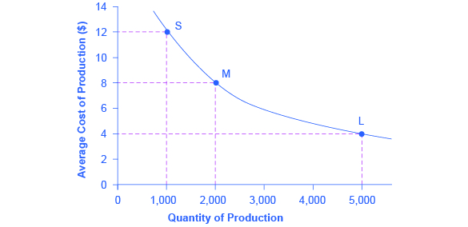

By the end of this section, you will be able to:

* Calculate total cost
* Identify economies of scale, diseconomies of scale, and constant returns to scale
* Interpret graphs of long-run average cost curves and short-run average cost curves
* Analyze cost and production in the long run and short run

The long run is the period of time when all costs are variable. The long run depends on the specifics of the firm in question—it is not a precise period of time. If you have a one-year lease on your factory, then the long run is any period longer than a year, since after a year you are no longer bound by the lease. No costs are fixed in the long run. A firm can build new factories and purchase new machinery, or it can close existing facilities. In planning for the long run, the firm will compare alternative **production technologies**{: data-type="term"} (or processes).

In this context, technology refers to all alternative methods of combining inputs to produce outputs. It does not refer to a specific new invention like the tablet computer. The firm will search for the production technology that allows it to produce the desired level of output at the lowest cost. After all, lower costs lead to higher profits—at least if total revenues remain unchanged. Moreover, each firm must fear that if it does not seek out the lowest-cost methods of production, then it may lose sales to competitor firms that find a way to produce and sell for less.

# Choice of Production Technology

Many tasks can be performed with a range of combinations of labor and physical capital. For example, a firm can have human beings answering phones and taking messages, or it can invest in an automated voicemail system. A firm can hire file clerks and secretaries to manage a system of paper folders and file cabinets, or it can invest in a computerized recordkeeping system that will require fewer employees. A firm can hire workers to push supplies around a factory on rolling carts, it can invest in motorized vehicles, or it can invest in robots that carry materials without a driver. Firms often face a choice between buying a many small machines, which need a worker to run each one, or buying one larger and more expensive machine, which requires only one or two workers to operate it. In short, physical capital and labor can often substitute for each other.

Consider the example of a private firm that is hired by local governments to clean up public parks. Three different combinations of labor and physical capital for cleaning up a single average-sized park appear in [\[link\]](#Table_07_06). The first production technology is heavy on workers and light on machines, while the next two technologies substitute machines for workers. Since all three of these production methods produce the same thing—one cleaned-up park—a profit-seeking firm will choose the production technology that is least expensive, given the prices of labor and machines.

<table id="Table_07_06" summary="Production technology 1 has 10 workers and 2 machines. Production technology 2 has 7 workers and 4 machines. Production technology 2 has 3 workers and 7 machines. "><caption>Three Ways to Clean a Park</caption><tbody>
        <tr>
          <td>Production technology 1</td>
          <td>10 workers</td>
          <td>2 machines</td>
        </tr>
        <tr>
          <td>Production technology 2</td>
          <td>7 workers</td>
          <td>4 machines</td>
        </tr>
        <tr>
          <td>Production technology 3</td>
          <td>3 workers</td>
          <td>7 machines</td>
        </tr>
      </tbody></table>

Production technology 1 uses the most labor and least machinery, while production technology 3 uses the least labor and the most machinery. [\[link\]](#Table_07_07) outlines three examples of how the total cost will change with each production technology as the cost of labor changes. As the cost of labor rises from example A to B to C, the firm will choose to substitute away from labor and use more machinery.

<table id="Table_07_07" summary="In example A, workers cost $40, machines cost $80. For technology 1, labor cost is $400 (10 x $40); machine cost is $160 (2 x $80); total cost is $560. For technology 2, labor cost is $280 (7 x $40); machine cost is $320 (4 x $80); total cost is $600. For technology 3, labor cost is $120 (3 x $40); machine cost is $560 (7 x $80); total cost is $680. In example B, workers cost $55, machines cost $80. For technology 1, labor cost is $550 (10 x $55); machine cost is $160 (2 x $80); total cost is $710. For technology 2, labor cost is $385 (7 x $55); machine cost is $320 (4 x $80); total cost is $705. For technology 3, labor cost is $165 (3 x $55); machine cost is $560 (7 x $80); total cost is $725. In example C, workers cost $90, machines cost $80. For technology 1, labor cost is $900 (10 x $90); machine cost is $160 (2 x $80); total cost is $1,600. For technology 2, labor cost is $630 (7 x $90); machine cost is $320 (4 x $80); total cost is $950. For technology 3, labor cost is $270 (3 x $90); machine cost is $560 (7 x $80); total cost is $830."><caption>Total Cost with Rising Labor Costs</caption><tbody>
        <tr>
          <td colspan="4"><strong>Example A: Workers cost $40, machines cost $80</strong></td>
        </tr>

        <tr>
          <td />
          <td>Labor Cost</td>
          <td>Machine Cost</td>
          <td>Total Cost</td>
        </tr>

        <tr>
          <td>Cost of technology 1</td>
          <td>10 × $40 = $400</td>
          <td>2 × $80 = $160</td>
          <td>$560</td>
        </tr>

        <tr>
          <td>Cost of technology 2</td>
          <td>   7 × $40 = $280</td>
          <td>4 × $80 = $320</td>
          <td>$600</td>
        </tr>

        <tr>
          <td>Cost of technology 3</td>
          <td>   3 × $40 = $120</td>
          <td>7 × $80 = $560</td>
          <td>$680</td>
        </tr>

        <tr>
<td colspan="4"><strong> Example B: Workers cost $55, machines cost $80</strong></td>
        </tr>

        <tr>
          <td />
          <td>Labor Cost</td>
          <td>Machine Cost</td>
          <td>Total Cost</td>
        </tr>

        <tr>
          <td>Cost of technology 1</td>
          <td>10 × $55 = $550</td>
          <td>2 × $80 = $160</td>
          <td>$710</td>
        </tr>

        <tr>
          <td>Cost of technology 2</td>
          <td>   7 × $55 = $385</td>
          <td>4 × $80 = $320</td>
          <td>$705</td>
        </tr>

        <tr>
          <td>Cost of technology 3</td>
          <td>   3 × $55 = $165</td>
          <td>7 × $80 = $560</td>
          <td>$725</td>
        </tr>

        <tr>
<td colspan="4"><strong>Example C: Workers cost $90, machines cost $80</strong></td>
        </tr>

        <tr>
          <td />
          <td>Labor Cost</td>
          <td>Machine Cost</td>
          <td>Total Cost</td>
        </tr>

        <tr>
          <td>Cost of technology 1</td>
          <td>10 × $90 = $900</td>
          <td>2 × $80 = $160</td>
          <td>$1,060</td>
        </tr>

        <tr>
          <td>Cost of technology 2</td>
          <td>   7 × $90 = $630</td>
          <td>4 × $80 = $320</td>
          <td>$950</td>
        </tr>

        <tr>
          <td>Cost of technology 3</td>
          <td>   3 × $90 = $270</td>
          <td>7 × $80 = $560</td>
          <td>$830</td>
        </tr>

      </tbody></table>

Example A shows the firm’s cost calculation when wages are $40 and machines costs are $80. In this case, technology 1 is the low-cost production technology. In example B, wages rise to $55, while the cost of machines does not change, in which case technology 2 is the low-cost production technology. If wages keep rising up to $90, while the cost of machines remains unchanged, then technology 3 clearly becomes the low-cost form of production, as shown in example C.

This example shows that as an input becomes more expensive (in this case, the labor input), firms will attempt to conserve on using that input and will instead shift to other inputs that are relatively less expensive. This pattern helps to explain why the demand curve for labor (or any input) slopes down; that is, as labor becomes relatively more expensive, profit-seeking firms will seek to substitute the use of other inputs. When a multinational employer like Coca-Cola or McDonald’s sets up a bottling plant or a restaurant in a high-wage economy like the United States, Canada, Japan, or Western Europe, it is likely to use production technologies that conserve on the number of workers and focuses more on machines. However, that same employer is likely to use production technologies with more workers and less machinery when producing in a lower-wage country like Mexico, China, or South Africa.

# Economies of Scale

Once a firm has determined the least costly production technology, it can consider the optimal scale of production, or quantity of output to produce. Many industries experience economies of scale. **Economies of scale**{: data-type="term" .no-emphasis} refers to the situation where, as the quantity of output goes up, the cost per unit goes down. This is the idea behind “warehouse stores” like Costco or Walmart. In everyday language: a larger factory can produce at a lower average cost than a smaller factory.

[\[link\]](#CNX_Econ_C07_004) illustrates the idea of economies of scale, showing the average cost of producing an alarm clock falling as the quantity of output rises. For a small-sized factory like S, with an output level of 1,000, the average cost of production is $12 per alarm clock. For a medium-sized factory like M, with an output level of 2,000, the average cost of production falls to $8 per alarm clock. For a large factory like L, with an output of 5,000, the average cost of production declines still further to $4 per alarm clock.

{: #CNX_Econ_C07_004 data-title="Economies of Scale "}

The average cost curve in [\[link\]](#CNX_Econ_C07_004) may appear similar to the average cost curves presented earlier in this chapter, although it is downward-sloping rather than U-shaped. But there is one major difference. The economies of scale curve is a long-run average cost curve, because it allows all factors of production to change. The short-run average cost curves presented earlier in this chapter assumed the existence of fixed costs, and only variable costs were allowed to change.

One prominent example of economies of scale occurs in the chemical industry. Chemical plants have a lot of pipes. The cost of the materials for producing a pipe is related to the circumference of the pipe and its length. However, the volume of chemicals that can flow through a pipe is determined by the cross-section area of the pipe. The calculations in [\[link\]](#Table_07_08) show that a pipe which uses twice as much material to make (as shown by the circumference of the pipe doubling) can actually carry four times the volume of chemicals because the cross-section area of the pipe rises by a factor of four (as shown in the Area column).

<table id="Table_07_08" summary="A 4-inch pipe has a circumference (2 x pi x r) of 12.5 inches and an area (pi x r squared) of 12.5 square inches. An 8-inch pipe has a circumference of 25.1 inches and an area of 50.2 square inches. A 16-inch pip has a circumference of 50.2 inches and an area of 201.1 square inches. "><caption>Comparing Pipes: Economies of Scale in the Chemical Industry</caption><thead>
<tr>
	<th />
	<th>Circumference (<math xmlns="http://www.w3.org/1998/Math/MathML"><mn>2</mn><mi>π</mi><mi>r</mi></math>)</th>
	<th>Area (<math xmlns="http://www.w3.org/1998/Math/MathML"><mi>π</mi><msup><mi>r</mi><mn>2</mn></msup></math>)</th>
</tr>
</thead><tbody>
        <tr>
          <td>4-inch pipe</td>
          <td>12.5 inches</td>
          <td>12.5 square inches</td>
        </tr>

        <tr>
          <td>8-inch pipe</td>
          <td>25.1 inches</td>
          <td>50.2 square inches</td>
        </tr>

        <tr>
          <td>16-inch pipe</td>
          <td>50.2 inches</td>
          <td>201.1 square inches</td>
        </tr>

      </tbody></table>

A doubling of the cost of producing the pipe allows the chemical firm to process four times as much material. This pattern is a major reason for economies of scale in chemical production, which uses a large quantity of pipes. Of course, economies of scale in a chemical plant are more complex than this simple calculation suggests. But the chemical engineers who design these plants have long used what they call the “six-tenths rule,” a rule of thumb which holds that increasing the quantity produced in a chemical plant by a certain percentage will increase total cost by only six-tenths as much.

# Shapes of Long-Run Average Cost Curves

While in the short run firms are limited to operating on a single average cost curve (corresponding to the level of fixed costs they have chosen), in the long run when all costs are variable, they can choose to operate on any average cost curve. Thus, the **long-run average cost (LRAC) curve**{: data-type="term"} is actually based on a group of **short-run average cost (SRAC) curves**{: data-type="term"}, each of which represents one specific level of fixed costs. More precisely, the long-run average cost curve will be the least expensive average cost curve for any level of output. [\[link\]](#CNX_Econ_C07_005) shows how the long-run average cost curve is built from a group of short-run average cost curves. Five short-run-average cost curves appear on the diagram. Each SRAC curve represents a different level of fixed costs. For example, you can imagine SRAC1 as a small factory, SRAC2 as a medium factory, SRAC3 as a large factory, and SRAC4 and SRAC5 as very large and ultra-large. Although this diagram shows only five SRAC curves, presumably there are an infinite number of other SRAC curves between the ones that are shown. This family of short-run average cost curves can be thought of as representing different choices for a firm that is planning its level of investment in fixed cost physical capital—knowing that different choices about capital investment in the present will cause it to end up with different short-run average cost curves in the future.

 curves each represents a different level of fixed costs, from the low level of fixed costs at SRAC1 to the high level of fixed costs at SRAC5. Other SRAC curves, not shown in the diagram, lie between the ones that are shown here. The long-run average cost (LRAC) curve shows the lowest cost for producing each quantity of output when fixed costs can vary, and so it is formed by the bottom edge of the family of SRAC curves. If a firm wished to produce quantity Q3, it would choose the fixed costs associated with SRAC3."){: #CNX_Econ_C07_005 data-title="From Short-Run Average Cost Curves to Long-Run Average Cost Curves "}

The long-run average cost curve shows the cost of producing each quantity in the long run, when the firm can choose its level of fixed costs and thus choose which short-run average costs it desires. If the firm plans to produce in the long run at an output of Q3, it should make the set of investments that will lead it to locate on SRAC3, which allows producing q3 at the lowest cost. A firm that intends to produce Q3 would be foolish to choose the level of fixed costs at SRAC2 or SRAC4. At SRAC2 the level of fixed costs is too low for producing Q3 at lowest possible cost, and producing q3 would require adding a very high level of variable costs and make the average cost very high. At SRAC4, the level of fixed costs is too high for producing q3 at lowest possible cost, and again average costs would be very high as a result.

The shape of the long-run cost curve, as drawn in [\[link\]](#CNX_Econ_C07_005), is fairly common for many industries. The left-hand portion of the long-run average cost curve, where it is downward- sloping from output levels Q1 to Q2 to Q3, illustrates the case of economies of scale. In this portion of the long-run average cost curve, larger scale leads to lower average costs. This pattern was illustrated earlier in [\[link\]](#CNX_Econ_C07_004).

In the middle portion of the long-run average cost curve, the flat portion of the curve around Q3, economies of scale have been exhausted. In this situation, allowing all inputs to expand does not much change the average cost of production, and it is called **constant returns to scale**{: data-type="term"}. In this range of the LRAC curve, the average cost of production does not change much as scale rises or falls. The following Clear it Up feature explains where diminishing marginal returns fit into this analysis.

How do economies of scale compare to diminishing marginal returns?

The concept of economies of scale, where average costs decline as production expands, might seem to conflict with the idea of diminishing marginal returns, where marginal costs rise as production expands. But diminishing marginal returns refers only to the short-run average cost curve, where one variable input (like labor) is increasing, but other inputs (like capital) are fixed. Economies of scale refers to the long-run average cost curve where all inputs are being allowed to increase together. Thus, it is quite possible and common to have an industry that has both diminishing marginal returns when only one input is allowed to change, and at the same time has increasing or constant economies of scale when all inputs change together to produce a larger-scale operation.

Finally, the right-hand portion of the long-run average cost curve, running from output level Q4 to Q5, shows a situation where, as the level of output and the scale rises, average costs rise as well. This situation is called **diseconomies of scale**{: data-type="term"}. A firm or a factory can grow so large that it becomes very difficult to manage, resulting in unnecessarily high costs as many layers of management try to communicate with workers and with each other, and as failures to communicate lead to disruptions in the flow of work and materials. Not many overly large factories exist in the real world, because with their very high production costs, they are unable to compete for long against plants with lower average costs of production. However, in some planned economies, like the economy of the old Soviet Union, plants that were so large as to be grossly inefficient were able to continue operating for a long time because government economic planners protected them from competition and ensured that they would not make losses.

Diseconomies of scale can also be present across an entire firm, not just a large factory. The **leviathan effect**{: data-type="term" .no-emphasis} can hit firms that become too large to run efficiently, across the entirety of the enterprise. Firms that shrink their operations are often responding to finding itself in the diseconomies region, thus moving back to a lower average cost at a lower output level.

Visit this [website][1] to read an article about the complexity of the belief that banks can be “too-big-to-fail.”

  

# The Size and Number of Firms in an Industry

The shape of the long-run average cost curve has implications for how many firms will compete in an industry, and whether the firms in an industry have many different sizes, or tend to be the same size. For example, say that one million dishwashers are sold every year at a price of $500 each and the long-run average cost curve for dishwashers is shown in [\[link\]](#CNX_Econ_C07_008) (a). In [\[link\]](#CNX_Econ_C07_008) (a), the lowest point of the LRAC curve occurs at a quantity of 10,000 produced. Thus, the market for dishwashers will consist of 100 different manufacturing plants of this same size. If some firms built a plant that produced 5,000 dishwashers per year or 25,000 dishwashers per year, the average costs of production at such plants would be well above $500, and the firms would not be able to compete.

 Low-cost firms will produce at output level R. When the LRAC curve has a clear minimum point, then any firm producing a different quantity will have higher costs. In this case, a firm producing at a quantity of 10,000 will produce at a lower average cost than a firm producing, say, 5,000 or 20,000 units. (b) Low-cost firms will produce between output levels R and S. When the LRAC curve has a flat bottom, then firms producing at any quantity along this flat bottom can compete. In this case, any firm producing a quantity between 5,000 and 20,000 can compete effectively, although firms producing less than 5,000 or more than 20,000 would face higher average costs and be unable to compete."){: #CNX_Econ_C07_008 data-title="The LRAC Curve and the Size and Number of Firms "}

How can cities be viewed as examples of economies of scale?

Why are people and economic activity concentrated in cities, rather than distributed evenly across a country? The fundamental reason must be related to the idea of economies of scale—that grouping economic activity is more productive in many cases than spreading it out. For example, cities provide a large group of nearby customers, so that businesses can produce at an efficient economy of scale. They also provide a large group of workers and suppliers, so that business can hire easily and purchase whatever specialized inputs they need. Many of the attractions of cities, like sports stadiums and museums, can operate only if they can draw on a large nearby population base. Cities are big enough to offer a wide variety of products, which is what many shoppers are looking for.

These factors are not exactly economies of scale in the narrow sense of the production function of a single firm, but they are related to growth in the overall size of population and market in an area. Cities are sometimes called “agglomeration economies.”

These agglomeration factors help to explain why every economy, as it develops, has an increasing proportion of its population living in urban areas. In the United States, about 80% of the population now lives in metropolitan areas (which include the suburbs around cities), compared to just 40% in 1900. However, in poorer nations of the world, including much of Africa, the proportion of the population in urban areas is only about 30%. One of the great challenges for these countries as their economies grow will be to manage the growth of the great cities that will arise.

If cities offer economic advantages that are a form of economies of scale, then why don’t all or most people live in one giant city? At some point, agglomeration economies must turn into diseconomies. For example, traffic congestion may reach a point where the gains from being geographically nearby are counterbalanced by how long it takes to travel. High densities of people, cars, and factories can mean more garbage and air and water pollution. Facilities like parks or museums may become overcrowded. There may be economies of scale for negative activities like crime, because high densities of people and businesses, combined with the greater impersonality of cities, make it easier for illegal activities as well as legal ones. The future of cities, both in the United States and in other countries around the world, will be determined by their ability to benefit from the economies of agglomeration and to minimize or counterbalance the corresponding diseconomies.

A more common case is illustrated in [\[link\]](#CNX_Econ_C07_008) (b), where the LRAC curve has a flat-bottomed area of constant returns to scale. In this situation, any firm with a level of output between 5,000 and 20,000 will be able to produce at about the same level of average cost. Given that the market will demand one million dishwashers per year at a price of $500, this market might have as many as 200 producers (that is, one million dishwashers divided by firms making 5,000 each) or as few as 50 producers (one million dishwashers divided by firms making 20,000 each). The producers in this market will range in size from firms that make 5,000 units to firms that make 20,000 units. But firms that produce below 5,000 units or more than 20,000 will be unable to compete, because their average costs will be too high. Thus, if we see an industry where almost all plants are the same size, it is likely that the long-run average cost curve has a unique bottom point as in [\[link\]](#CNX_Econ_C07_008) (a). However, if the long-run average cost curve has a wide flat bottom like [\[link\]](#CNX_Econ_C07_008) (b), then firms of a variety of different sizes will be able to compete with each other.

The flat section of the long-run average cost curve in [\[link\]](#CNX_Econ_C07_008) (b) can be interpreted in two different ways. One interpretation is that a single manufacturing plant producing a quantity of 5,000 has the same average costs as a single manufacturing plant with four times as much capacity that produces a quantity of 20,000. The other interpretation is that one firm owns a single manufacturing plant that produces a quantity of 5,000, while another firm owns four separate manufacturing plants, which each produce a quantity of 5,000. This second explanation, based on the insight that a single firm may own a number of different manufacturing plants, is especially useful in explaining why the long-run average cost curve often has a large flat segment—and thus why a seemingly smaller firm may be able to compete quite well with a larger firm. At some point, however, the task of coordinating and managing many different plants raises the cost of production sharply, and the long-run average cost curve slopes up as a result.

In the examples to this point, the quantity demanded in the market is quite large (one million) compared with the quantity produced at the bottom of the long-run average cost curve (5,000, 10,000 or 20,000). In such a situation, the market is set for competition between many firms. But what if the bottom of the long-run average cost curve is at a quantity of 10,000 and the total market demand at that price is only slightly higher than that quantity—or even somewhat lower?

Return to [\[link\]](#CNX_Econ_C07_008) (a), where the bottom of the long-run average cost curve is at 10,000, but now imagine that the total quantity of dishwashers demanded in the market at that price of $500 is only 30,000. In this situation, the total number of firms in the market would be three. A handful of firms in a market is called an “oligopoly,” and the chapter on [Monopolistic Competition and Oligopoly](/m48658){: .target-chapter} will discuss the range of competitive strategies that can occur when oligopolies compete.

Alternatively, consider a situation, again in the setting of [\[link\]](#CNX_Econ_C07_008) (a), where the bottom of the long-run average cost curve is 10,000, but total demand for the product is only 5,000. (For simplicity, imagine that this demand is highly inelastic, so that it does not vary according to price.) In this situation, the market may well end up with a single firm—a monopoly—producing all 5,000 units. If any firm tried to challenge this monopoly while producing a quantity lower than 5,000 units, the prospective competitor firm would have a higher average cost, and so it would not be able to compete in the longer term without losing money. The chapter on [Monopoly](/m48650){: .target-chapter} discusses the situation of a monopoly firm.

Thus, the shape of the long-run average cost curve reveals whether competitors in the market will be different sizes. If the LRAC curve has a single point at the bottom, then the firms in the market will be about the same size, but if the LRAC curve has a flat-bottomed segment of constant returns to scale, then firms in the market may be a variety of different sizes.

The relationship between the quantity at the minimum of the long-run average cost curve and the quantity demanded in the market at that price will predict how much competition is likely to exist in the market. If the quantity demanded in the market far exceeds the quantity at the minimum of the LRAC, then many firms will compete. If the quantity demanded in the market is only slightly higher than the quantity at the minimum of the LRAC, a few firms will compete. If the quantity demanded in the market is less than the quantity at the minimum of the LRAC, a single-producer monopoly is a likely outcome.

# Shifting Patterns of Long-Run Average Cost

New developments in production technology can shift the long-run average cost curve in ways that can alter the size distribution of firms in an industry.

For much of the twentieth century, the most common change has been to see alterations in technology, like the assembly line or the large department store, where large-scale producers seemed to gain an advantage over smaller ones. In the long-run average cost curve, the downward-sloping economies of scale portion of the curve stretched over a larger quantity of output.

However, new production technologies do not inevitably lead to a greater average size for firms. For example, in recent years some new technologies for generating electricity on a smaller scale have appeared. The traditional coal-burning electricity plants needed to produce 300 to 600 megawatts of power to exploit economies of scale fully. However, high-efficiency turbines to produce electricity from burning natural gas can produce electricity at a competitive price while producing a smaller quantity of 100 megawatts or less. These new technologies create the possibility for smaller companies or plants to generate electricity as efficiently as large ones. Another example of a technology-driven shift to smaller plants may be taking place in the tire industry. A traditional mid-size tire plant produces about six million tires per year. However, in 2000, the Italian company Pirelli introduced a new tire factory that uses many robots. The Pirelli tire plant produced only about one million tires per year, but did so at a lower average cost than a traditional mid-sized tire plant.

Controversy has simmered in recent years over whether the new information and communications technologies will lead to a larger or smaller size for firms. On one side, the new technology may make it easier for small firms to reach out beyond their local geographic area and find customers across a state, or the nation, or even across international boundaries. This factor might seem to predict a future with a larger number of small competitors. On the other side, perhaps the new information and communications technology will create “winner-take-all” markets where one large company will tend to command a large share of total sales, as Microsoft has done in the production of software for personal computers or Amazon has done in online bookselling. Moreover, improved information and communication technologies might make it easier to manage many different plants and operations across the country or around the world, and thus encourage larger firms. This ongoing battle between the forces of smallness and largeness will be of great interest to economists, businesspeople, and policymakers.

Amazon

Traditionally, bookstores have operated in retail locations with inventories held either on the shelves or in the back of the store. These retail locations were very pricey in terms of rent. Amazon has no retail locations; it sells online and delivers by mail. Amazon offers almost any book in print, convenient purchasing, and prompt delivery by mail. Amazon holds its inventories in huge warehouses in low-rent locations around the world. The warehouses are highly computerized using robots and relatively low-skilled workers, making for low average costs per sale. Amazon demonstrates the significant advantages economies of scale can offer to a firm that exploits those economies.

# Key Concepts and Summary

A production technology refers to a specific combination of labor, physical capital, and technology that makes up a particular method of production.

In the long run, firms can choose their production technology, and so all costs become variable costs. In making this choice, firms will try to substitute relatively inexpensive inputs for relatively expensive inputs where possible, so as to produce at the lowest possible long-run average cost.

Economies of scale refers to a situation where as the level of output increases, the average cost decreases. Constant returns to scale refers to a situation where average cost does not change as output increases. Diseconomies of scale refers to a situation where as output increases, average costs increase also.

The long-run average cost curve shows the lowest possible average cost of production, allowing all the inputs to production to vary so that the firm is choosing its production technology. A downward-sloping LRAC shows economies of scale; a flat LRAC shows constant returns to scale; an upward-sloping LRAC shows diseconomies of scale. If the long-run average cost curve has only one quantity produced that results in the lowest possible average cost, then all of the firms competing in an industry should be the same size. However, if the LRAC has a flat segment at the bottom, so that a range of different quantities can be produced at the lowest average cost, the firms competing in the industry will display a range of sizes. The market demand in conjunction with the long-run average cost curve determines how many firms will exist in a given industry.

If the quantity demanded in the market of a certain product is much greater than the quantity found at the bottom of the long-run average cost curve, where the cost of production is lowest, the market will have many firms competing. If the quantity demanded in the market is less than the quantity at the bottom of the LRAC, there will likely be only one firm.

# Self-Check Questions

Return to the problem explained in [[link]](#Table_07_06) and [[link]](#Table_07_07). If the cost of labor remains at $40, but the cost of a machine decreases to $50, what would be the total cost of each method of production? Which method should the firm use, and why?

The new table should look like this:

<table id="Table_07_09" summary="For technology 1, labor cost is $400, machine cost is $100, total cost is $500. For technology 2, labor cost is $280, machine cost is $200, total cost is $480. For technology 3, labor cost is $120, machine cost is $350, total cost is $470." data-label=""><caption /><thead>
<tr>
	<th> </th>
	<th>Labor Cost</th>
	<th>Machine Cost</th>
	<th>Total Cost</th>
</tr>
</thead><tbody>
        <tr>
          <td>Cost of technology 1</td>
          <td>10 × $40 = $400</td>
          <td>2 × $50 = $100</td>
          <td>$500</td>
        </tr>

        <tr>
          <td>Cost of technology 2</td>
          <td>7 × $40 = $280</td>
          <td>4 × $50 = $200</td>
          <td>$480</td>
        </tr>

        <tr>
          <td>Cost of technology 3</td>
          <td>3 × $40 = $120</td>
          <td>7 × $50 = $350</td>
          <td>$470</td>
        </tr>

      </tbody></table>
The firm should choose production technology 3 since it has the lowest total cost. This makes sense since, with cheaper machine hours, one would expect a shift in the direction of more machines and less labor.

Suppose the cost of machines increases to $55, while the cost of labor stays at $40. How would that affect the total cost of the three methods? Which method should the firm choose now?

<table id="Table_07_10" summary="For technology 1, labor cost is $400, machine cost is $110, total cost is $510. For technology 2, labor cost is $280, machine cost is $220, total cost is $500. For technology 3, labor cost is $120, machine cost is $385, total cost is $505." data-label=""><caption /><thead>
<tr>
	<th> </th>
	<th>Labor Cost</th>
	<th>Machine Cost</th>
	<th>Total Cost</th>
</tr>
</thead><tbody>
        <tr>
          <td>Cost of technology 1</td>
          <td>10 × $40 = $400</td>
          <td>2 × $55 = $110</td>
          <td>$510</td>
        </tr>
        <tr>
          <td>Cost of technology 2</td>
          <td>7 × $40 = $280</td>
          <td>4 × $55 = $220</td>
          <td>$500</td>
        </tr>
        <tr>
          <td>Cost of technology 3</td>
          <td>3 × $40 = $120</td>
          <td>7 × $55 = $385</td>
          <td>$505</td>
        </tr>
      </tbody></table>
The firm should choose production technology 2 since it has the lowest total cost. Because the cost of machines increased (relative to the previous question), you would expect a shift toward less capital and more labor.

Automobile manufacturing is an industry subject to significant economies of scale. Suppose there are four domestic auto manufacturers, but the demand for domestic autos is no more than 2.5 times the quantity produced at the bottom of the long-run average cost curve. What do you expect will happen to the domestic auto industry in the long run?

This is the situation that existed in the United States in the 1970s. Since there is only demand enough for 2.5 firms to reach the bottom of the average cost curve, you would expect one firm will not be around in the long run, and at least one firm will be struggling.

# Review Questions

What shapes would you generally expect each of the following cost curves to have: fixed costs, variable costs, marginal costs, average total costs, and average variable costs?

What is a production technology?

In choosing a production technology, how will firms react if one input becomes relatively more expensive?

What is a long-run average cost curve?

What is the difference between economies of scale, constant returns to scale, and diseconomies of scale?

What shape of a long-run average cost curve illustrates economies of scale, constant returns to scale, and diseconomies of scale?

Why will firms in most markets be located at or close to the bottom of the long-run average cost curve?

# Critical Thinking Questions

It is clear that businesses operate in the short run, but do they ever operate in the long run? Discuss.

How would an improvement in technology, like the high-efficiency gas turbines or Pirelli tire plant, affect the long-run average cost curve of a firm? Can you draw the old curve and the new one on the same axes? How might such an improvement affect other firms in the industry?

Do you think that the taxicab industry in large cities would be subject to significant economies of scale? Why or why not?

# Problems

A small company that shovels sidewalks and driveways has 100 homes signed up for its services this winter. It can use various combinations of capital and labor: lots of labor with hand shovels, less labor with snow blowers, and still less labor with a pickup truck that has a snowplow on front. To summarize, the method choices are:

Method 1: 50 units of labor, 10 units of capital

Method 2: 20 units of labor, 40 units of capital

Method 3: 10 units of labor, 70 units of capital

If hiring labor for the winter costs $100/unit and a unit of capital costs $400, what production method should be chosen? What method should be chosen if the cost of labor rises to $200/unit?

[1]: http://openstaxcollege.org/l/Toobig
