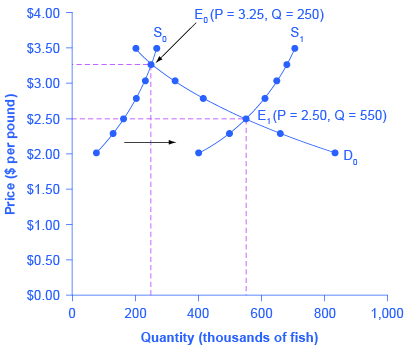
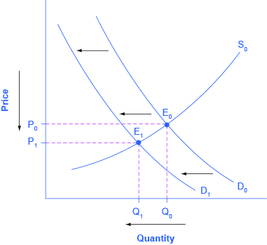
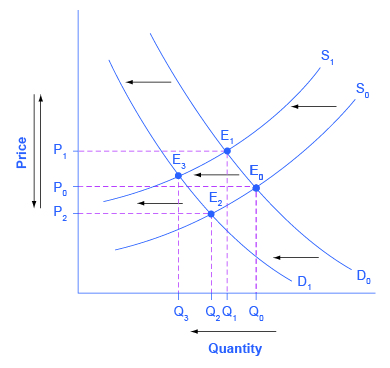
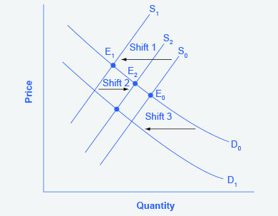

By the end of this section, you will be able to:

* Identify equilibrium price and quantity through the four-step process
* Graph equilibrium price and quantity
* Contrast shifts of demand or supply and movements along a demand or supply curve
* Graph demand and supply curves, including equilibrium price and quantity, based on real-world examples

Let’s begin this discussion with a single economic event. It might be an event that affects demand, like a change in income, population, tastes, prices of substitutes or complements, or expectations about future prices. It might be an event that affects supply, like a change in natural conditions, input prices, or technology, or government policies that affect production. How does this economic event affect equilibrium price and quantity? We will analyze this question using a four-step process.

Step 1. Draw a demand and supply model before the economic change took place. To establish the model requires four standard pieces of information: The law of demand, which tells us the slope of the demand curve; the law of supply, which gives us the slope of the supply curve; the shift variables for demand; and the shift variables for supply. From this model, find the initial equilibrium values for price and quantity.

Step 2. Decide whether the economic change being analyzed affects demand or supply. In other words, does the event refer to something in the list of demand factors or supply factors?

Step 3. Decide whether the effect on demand or supply causes the curve to shift to the right or to the left, and sketch the new demand or supply curve on the diagram. In other words, does the event increase or decrease the amount consumers want to buy or producers want to sell?

Step 4. Identify the new equilibrium and then compare the original equilibrium price and quantity to the new equilibrium price and quantity.

Let’s consider one example that involves a shift in supply and one that involves a shift in demand. Then we will consider an example where both supply and demand shift.

### Good Weather for Salmon Fishing

In the summer of 2000, weather conditions were excellent for commercial salmon fishing off the California coast. Heavy rains meant higher than normal levels of water in the rivers, which helps the salmon to breed. Slightly cooler ocean temperatures stimulated the growth of plankton, the microscopic organisms at the bottom of the ocean food chain, providing everything in the ocean with a hearty food supply. The ocean stayed calm during fishing season, so commercial fishing operations did not lose many days to bad weather. How did these climate conditions affect the quantity and price of salmon? [\[link\]](#CNX_Econ_C03_010) illustrates the four-step approach, which is explained below, to work through this problem. [\[link\]](#Table_03_07) provides the information to work the problem as well.

 {: #CNX_Econ_C03_010 data-title="Good Weather for Salmon Fishing: The Four-Step Process "}

<table id="Table_03_07" summary="The table is called &#x201C;Salmon Fishing.&#x201D; It has 4 columns and 7 rows. The four columns are called &#x201C;Price per Pound,&#x201D; &#x201C;Quantity Supplied in 1999,&#x201D; &#x201C;Quantity Supplied in 2000,&#x201D; and &#x201C;Quantity Demanded.&#x201D; Row 1: Price per Pound: $2.00. Quantity Supplied in 1999: 80. Quantity Supplied in 2000: 400. Quantity Demanded: 840. Row 2: Price per Pound: $2.25. Quantity Supplied in 1999: 120. Quantity Supplied in 2000: 480. Quantity Demanded: 680. Row 3: Price per Pound: $2.50. Quantity Supplied in 1999: 160. Quantity Supplied in 2000: 550. Quantity Demanded: 550. Row 4: Price per Pound: $2.75. Quantity Supplied in 1999: 200. Quantity Supplied in 2000: 600. Quantity Demanded: 450. Row 5: Price per Pound: $3.00. Quantity Supplied in 1999: 230. Quantity Supplied in 2000: 640. Quantity Demanded: 350. Row 6: Price per Pound: $3.25. Quantity Supplied in 1999: 250. Quantity Supplied in 2000: 670. Quantity Demanded: 250. Row 7: Price per Pound: $3.50. Quantity Supplied in 1999: 270. Quantity Supplied in 2000: 700. Quantity Demanded: 200."><caption>Salmon Fishing</caption><thead>
<tr>
<th>Price per Pound</th>
<th>Quantity Supplied in 1999</th>
<th>Quantity Supplied in 2000</th>
<th>Quantity Demanded</th>
</tr>
</thead><tbody>
<tr>
<td>$2.00</td>
<td>80</td>
<td>400</td>
<td>840</td>
</tr>
<tr>
<td>$2.25</td>
<td>120</td>
<td>480</td>
<td>680</td>
</tr>
<tr>
<td>$2.50</td>
<td>160</td>
<td>550</td>
<td>550</td>
</tr>
<tr>
<td>$2.75</td>
<td>200</td>
<td>600</td>
<td>450</td>
</tr>
<tr>
<td>$3.00</td>
<td>230</td>
<td>640</td>
<td>350</td>
</tr>
<tr>
<td>$3.25</td>
<td>250</td>
<td>670</td>
<td>250</td>
</tr>
<tr>
<td>$3.50</td>
<td>270</td>
<td>700</td>
<td>200</td>
</tr>
</tbody></table>

Step 1. Draw a demand and supply model to illustrate the market for salmon in the year before the good weather conditions began. The demand curve D0 and the supply curve S0 show that the original equilibrium price is $3.25 per pound and the original equilibrium quantity is 250,000 fish. (This price per pound is what commercial buyers pay at the fishing docks; what consumers pay at the grocery is higher.)

Step 2. Did the economic event affect supply or demand? Good weather is an example of a natural condition that affects supply.

Step 3. Was the effect on supply an increase or a decrease? Good weather is a change in natural conditions that increases the quantity supplied at any given price. The supply curve shifts to the right, moving from the original supply curve S0 to the new supply curve S1, which is shown in both the table and the figure.

Step 4. Compare the new equilibrium price and quantity to the original equilibrium. At the new equilibrium E1, the equilibrium price falls from $3.25 to $2.50, but the equilibrium quantity increases from 250,000 to 550,000 salmon. Notice that the equilibrium quantity demanded increased, even though the demand curve did not move.

In short, good weather conditions increased supply of the California commercial salmon. The result was a higher equilibrium quantity of salmon bought and sold in the market at a lower price.

### Newspapers and the Internet

According to the **Pew Research Center for People and the Press**{: data-type="term" .no-emphasis}, more and more people, especially younger people, are getting their news from online and digital sources. The majority of U.S. adults now own smartphones or tablets, and most of those Americans say they use them in part to get the news. From 2004 to 2012, the share of Americans who reported getting their news from digital sources increased from 24% to 39%. How has this affected consumption of print news media, and radio and television news? [\[link\]](#CNX_Econ_C03_011) and the text below illustrates using the four-step analysis to answer this question.

 {: #CNX_Econ_C03_011 data-title="The Print News Market: A Four-Step Analysis "}

Step 1. Develop a demand and supply model to think about what the market looked like before the event. The demand curve D0 and the supply curve S0 show the original relationships. In this case, the analysis is performed without specific numbers on the price and quantity axis.

Step 2. Did the change described affect supply or demand? A change in tastes, from traditional news sources (print, radio, and television) to digital sources, caused a change in demand for the former.

Step 3. Was the effect on demand positive or negative? A shift to digital news sources will tend to mean a lower quantity demanded of traditional news sources at every given price, causing the demand curve for print and other traditional news sources to shift to the left, from D0 to D1.

Step 4. Compare the new equilibrium price and quantity to the original equilibrium price. The new equilibrium (E1) occurs at a lower quantity and a lower price than the original equilibrium (E0).

The decline in print news reading predates 2004. Print newspaper circulation peaked in 1973 and has declined since then due to competition from television and radio news. In 1991, 55% of Americans indicated they got their news from print sources, while only 29% did so in 2012. Radio news has followed a similar path in recent decades, with the share of Americans getting their news from radio declining from 54% in 1991 to 33% in 2012. Television news has held its own over the last 15 years, with a market share staying in the mid to upper fifties. What does this suggest for the future, given that two-thirds of Americans under 30 years old say they do not get their news from television at all?

### The Interconnections and Speed of Adjustment in Real Markets

In the real world, many factors that affect demand and supply can change all at once. For example, the demand for cars might increase because of rising incomes and population, and it might decrease because of rising gasoline prices (a complementary good). Likewise, the supply of cars might increase because of innovative new technologies that reduce the cost of car production, and it might decrease as a result of new government regulations requiring the installation of costly pollution-control technology.

Moreover, rising incomes and population or changes in gasoline prices will affect many markets, not just cars. How can an economist sort out all these interconnected events? The answer lies in the ***ceteris paribus***{: data-type="term" .no-emphasis} assumption. Look at how each economic event affects each market, one event at a time, holding all else constant. Then combine the analyses to see the net effect.

### A Combined Example

The U.S. Postal Service is facing difficult challenges. Compensation for postal workers tends to increase most years due to cost-of-living increases. At the same time, more and more people are using email, text, and other digital message forms such as Facebook and Twitter to communicate with friends and others. What does this suggest about the continued viability of the Postal Service? [\[link\]](#CNX_Econ_C03_029) and the text below illustrates using the four-step analysis to answer this question.

  Higher labor compensation causes a leftward shift in the supply curve, a decrease in the equilibrium quantity, and an increase in the equilibrium price. (b) A change in tastes away from Postal Services causes a leftward shift in the demand curve, a decrease in the equilibrium quantity, and a decrease in the equilibrium price."){: #CNX_Econ_C03_029 data-title="Higher Compensation for Postal Workers: A Four-Step Analysis "}

Since this problem involves two disturbances, we need two four-step analyses, the first to analyze the effects of higher compensation for postal workers, the second to analyze the effects of many people switching from “snailmail” to email and other digital messages.

[\[link\]](#CNX_Econ_C03_029) (a) shows the shift in supply discussed in the following steps.

Step 1. Draw a demand and supply model to illustrate what the market for the U.S. Postal Service looked like before this scenario starts. The demand curve D0 and the supply curve S0 show the original relationships.

Step 2. Did the change described affect supply or demand? Labor compensation is a cost of production. A change in production costs caused a change in supply for the Postal Service.

Step 3. Was the effect on supply positive or negative? Higher labor compensation leads to a lower quantity supplied of postal services at every given price, causing the supply curve for postal services to shift to the left, from S0 to S1.

Step 4. Compare the new equilibrium price and quantity to the original equilibrium price. The new equilibrium (E1) occurs at a lower quantity and a higher price than the original equilibrium (E0).

[\[link\]](#CNX_Econ_C03_029) (b) shows the shift in demand discussed in the following steps.

Step 1. Draw a demand and supply model to illustrate what the market for U.S. Postal Services looked like before this scenario starts. The demand curve D0 and the supply curve S0 show the original relationships. Note that this diagram is independent from the diagram in panel (a).

Step 2. Did the change described affect supply or demand? A change in tastes away from snailmail toward digital messages will cause a change in demand for the Postal Service.

Step 3. Was the effect on supply positive or negative? Higher labor compensation leads to a lower quantity supplied of postal services at every given price, causing the supply curve for postal services to shift to the left, from D0 to D1.

Step 4. Compare the new equilibrium price and quantity to the original equilibrium price. The new equilibrium (E2) occurs at a lower quantity and a lower price than the original equilibrium (E0).

The final step in a scenario where both supply and demand shift is to combine the two individual analyses to determine what happens to the equilibrium quantity and price. Graphically, we superimpose the previous two diagrams one on top of the other, as in [\[link\]](#CNX_Econ_C03_030).

 {: #CNX_Econ_C03_030 data-title="Combined Effect of Decreased Demand and Decreased Supply "}

Following are the results:

Effect on Quantity: The effect of higher labor compensation on Postal Services because it raises the cost of production is to decrease the equilibrium quantity. The effect of a change in tastes away from snailmail is to decrease the equilibrium quantity. Since both shifts are to the left, the overall impact is a decrease in the equilibrium quantity of Postal Services (Q3). This is easy to see graphically, since Q3 is to the left of Q0.

Effect on Price: The overall effect on price is more complicated. The effect of higher labor compensation on Postal Services, because it raises the cost of production, is to increase the equilibrium price. The effect of a change in tastes away from snailmail is to decrease the equilibrium price. Since the two effects are in opposite directions, unless we know the magnitudes of the two effects, the overall effect is unclear. This is not unusual. When both curves shift, typically we can determine the overall effect on price or on quantity, but not on both. In this case, we determined the overall effect on the equilibrium quantity, but not on the equilibrium price. In other cases, it might be the opposite.

The next Clear It Up feature focuses on the difference between shifts of supply or demand and movements along a curve.

What is the difference between shifts of demand or supply versus movements along a demand or supply curve?

One common mistake in applying the demand and supply framework is to confuse the shift of a demand or a supply curve with movement along a demand or supply curve. As an example, consider a problem that asks whether a drought will increase or decrease the equilibrium quantity and equilibrium price of wheat. Lee, a student in an introductory economics class, might reason:

“Well, it is clear that a drought reduces supply, so I will shift back the supply curve, as in the shift from the original supply curve S0 to S1 shown on the diagram (called Shift 1). So the equilibrium moves from E0 to E1, the **equilibrium quantity**{: data-type="term" .no-emphasis} is lower and the equilibrium price is higher. Then, a higher price makes farmers more likely to supply the good, so the supply curve shifts right, as shown by the shift from S1 to S2, on the diagram (shown as Shift 2), so that the equilibrium now moves from E1 to E2. The higher price, however, also reduces demand and so causes demand to shift back, like the shift from the original demand curve, D0 to D1 on the diagram (labeled Shift 3), and the equilibrium moves from E2 to E3.”

{: #CNX_Econ_C03_018 data-title="Shifts of Demand or Supply versus Movements along a Demand or Supply Curve "}

At about this point, Lee suspects that this answer is headed down the wrong path. Think about what might be wrong with Lee’s logic, and then read the answer that follows.

*Answer:* Lee’s first step is correct: that is, a drought shifts back the supply curve of wheat and leads to a prediction of a lower equilibrium quantity and a higher equilibrium price. This corresponds to a movement along the original demand curve (D0), from E0 to E1. The rest of Lee’s argument is wrong, because it mixes up shifts in supply with quantity supplied, and shifts in demand with quantity demanded. A higher or lower price never shifts the supply curve, as suggested by the shift in supply from S1 to S2. Instead, a price change leads to a movement along a given supply curve. Similarly, a higher or lower price never shifts a demand curve, as suggested in the shift from D0 to D1. Instead, a price change leads to a movement along a given demand curve. Remember, a change in the price of a good never causes the demand or supply curve for that good to shift.

Think carefully about the timeline of events: What happens first, what happens next? What is cause, what is effect? If you keep the order right, you are more likely to get the analysis correct.

In the four-step analysis of how economic events affect equilibrium price and quantity, the movement from the old to the new equilibrium seems immediate. As a practical matter, however, prices and quantities often do not zoom straight to equilibrium. More realistically, when an economic event causes demand or supply to shift, prices and quantities set off in the general direction of equilibrium. Indeed, even as they are moving toward one new equilibrium, prices are often then pushed by another change in demand or supply toward another equilibrium.

### Key Concepts and Summary

When using the supply and demand framework to think about how an event will affect the equilibrium price and quantity, proceed through four steps: (1) sketch a supply and demand diagram to think about what the market looked like before the event; (2) decide whether the event will affect supply or demand; (3) decide whether the effect on supply or demand is negative or positive, and draw the appropriate shifted supply or demand curve; (4) compare the new equilibrium price and quantity to the original ones.

### Self-Check Questions

Let’s think about the market for air travel. From August 2014 to January 2015, the price of jet fuel decreased roughly 47%. Using the four-step analysis, how do you think this fuel price decrease affected the equilibrium price and quantity of air travel?

Step 1. Draw the graph with the initial supply and demand curves. Label the initial equilibrium price and quantity.

Step 2. Did the economic event affect supply or demand? Jet fuel is a cost of producing air travel, so an increase in jet fuel price affects supply.

Step 3. An increase in the price of jet fuel caused a decrease in the cost of air travel. We show this as a downward or rightward shift in supply.

Step 4. A rightward shift in supply causes a movement down the demand curve, lowering the equilibrium price of air travel and increasing the equilibrium quantity.

A tariff is a tax on imported goods. Suppose the U.S. government cuts the tariff on imported flat screen televisions. Using the four-step analysis, how do you think the tariff reduction will affect the equilibrium price and quantity of flat screen TVs?

Step 1. Draw the graph with the initial supply and demand curves. Label the initial equilibrium price and quantity.

Step 2. Did the economic event affect supply or demand? A tariff is treated like a cost of production, so this affects supply.

Step 3. A tariff reduction is equivalent to a decrease in the cost of production, which we can show as a rightward (or downward) shift in supply.

Step 4. A rightward shift in supply causes a movement down the demand curve, lowering the equilibrium price and raising the equilibrium quantity.

### Review Questions

How does one analyze a market where both demand and supply shift?

What causes a movement along the demand curve? What causes a movement along the supply curve?

### Critical Thinking Questions

Use the four-step process to analyze the impact of the advent of the iPod (or other portable digital music players) on the equilibrium price and quantity of the Sony Walkman (or other portable audio cassette players).

Use the four-step process to analyze the impact of a reduction in tariffs on imports of iPods on the equilibrium price and quantity of Sony Walkman-type products.

Suppose both of these events took place at the same time. Combine your analyses of the impacts of the iPod and the tariff reduction to determine the likely impact on the equilibrium price and quantity of Sony Walkman-type products. Show your answer graphically.

### Problems

Demand and supply in the market for cheddar cheese is illustrated in [[link]](#Table_03_08). Graph the data and find the equilibrium. Next, create a table showing the change in quantity demanded or quantity supplied, and a graph of the new equilibrium, in each of the following situations:

1.  The price of milk, a key input for cheese production, rises, so that the supply decreases by 80 pounds at every price.
2.  A new study says that eating cheese is good for your health, so that demand increases by 20% at every price.
{: type="a"}

<table id="Table_03_08" summary="The table shows the demand and supply in the market for cheddar cheese. At $3.00 per pound, the quantity demanded is 750lbs. and the quantity supplied is 540lbs. At $3.20 per pound, the quantity demanded is 700lbs. and the quantity supplied is 600lbs. At $3.40 per pound, the quantity demanded is 650lbs. and the quantity supplied is 650lbs. At $3.60 per pound, the quantity demanded is 620lbs. and the quantity supplied is 700lbs. At $3.80 per pound, the quantity demanded is 600lbs. and the quantity supplied is 720lbs. Finally, at $4.00 per pound, the quantity demanded is 590lbs. and the quantity supplied is 730lbs."><caption /><thead>
<tr>
<th>Price per Pound</th>
<th>Qd</th>
<th>Qs</th>
</tr>
</thead><tbody>
<tr>
<td>$3.00</td>
<td>750</td>
<td>540</td>
</tr>
<tr>
<td>$3.20</td>
<td>700</td>
<td>600</td>
</tr>
<tr>
<td><strong>$3.40</strong></td>
<td><strong>650</strong></td>
<td><strong>650</strong></td>
</tr>
<tr>
<td>$3.60</td>
<td>620</td>
<td>700</td>
</tr>
<tr>
<td>$3.80</td>
<td>600</td>
<td>720</td>
</tr>
<tr>
<td>$4.00</td>
<td>590</td>
<td>730</td>
</tr>
</tbody></table>

Supply and demand for movie tickets in a city are shown in [[link]](#Table_03_09). Graph demand and supply and identify the equilibrium. Then calculate in a table and graph the effect of the following two changes.

1.  Three new nightclubs open. They offer decent bands and have no cover charge, but make their money by selling food and drink. As a result, demand for movie tickets falls by six units at every price.
2.  The city eliminates a tax that it had been placing on all local entertainment businesses. The result is that the quantity supplied of movies at any given price increases by 10%.
{: type="a"}

<table id="Table_03_09" summary="The table shows the supply and demand for movie tickets in a city. At $5.00 per ticket, the quantity demanded is 26 and the quantity supplied is 16. At $6.00 per ticket, the quantity demanded is 24 and the quantity supplied is 18. At $7.00 per ticket, the quantity demanded is 22 and the quantity supplied is 20. At $8.00 per ticket, the quantity demanded is 21 and the quantity supplied is 21. Finally, at $9.00 per ticket, the quantity demanded is 20 and the quantity supplied is 22."><caption /><thead>
<tr>
<th>Price per Pound</th>
<th>Qd</th>
<th>Qs</th>
</tr>
</thead><tbody>
<tr>
<td>$5.00</td>
<td>26</td>
<td>16</td>
</tr>
<tr>
<td>$6.00</td>
<td>24</td>
<td>18</td>
</tr>
<tr>
<td>$7.00</td>
<td>22</td>
<td>20</td>
</tr>
<tr>
<td>$8.00</td>
<td>21</td>
<td>21</td>
</tr>
<tr>
<td>$9.00</td>
<td>20</td>
<td>22</td>
</tr>
</tbody></table>

### References

Pew Research Center. “Pew Research: Center for the People &amp; the Press.” http://www.people-press.org/.

