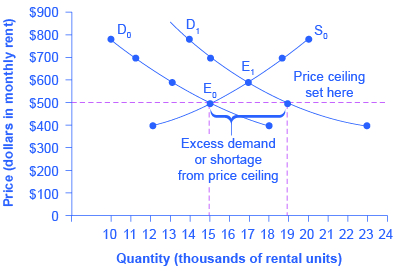

By the end of this section, you will be able to:

* Explain price controls, price ceilings, and price floors
* Analyze demand and supply as a social adjustment mechanism

Controversy sometimes surrounds the prices and quantities established by demand and supply, especially for products that are considered necessities. In some cases, discontent over prices turns into public pressure on politicians, who may then pass legislation to prevent a certain price from climbing “too high” or falling “too low.”

The demand and supply model shows how people and firms will react to the incentives provided by these laws to control prices, in ways that will often lead to undesirable consequences. Alternative policy tools can often achieve the desired goals of price control laws, while avoiding at least some of their costs and tradeoffs.

# Price Ceilings

Laws that government enacts to regulate prices are called **Price controls**{: data-type="term"}. Price controls come in two flavors. A **price ceiling**{: data-type="term"} keeps a price from rising above a certain level (the “ceiling”), while a **price floor**{: data-type="term"} keeps a price from falling below a certain level (the “floor”). This section uses the demand and supply framework to analyze price ceilings. The next section discusses price floors.

In many markets for goods and services, demanders outnumber suppliers. Consumers, who are also potential voters, sometimes unite behind a political proposal to hold down a certain price. In some cities, for example, renters have pressed political leaders to pass rent control laws, a price ceiling that usually works by stating that rents can be raised by only a certain maximum percentage each year.

Rent control becomes a politically hot topic when rents begin to rise rapidly. Everyone needs an affordable place to live. Perhaps a change in tastes makes a certain suburb or town a more popular place to live. Perhaps locally-based businesses expand, bringing higher incomes and more people into the area. Changes of this sort can cause a change in the demand for rental housing, as [\[link\]](#CNX_Econ_C03_012) illustrates. The original equilibrium (E0) lies at the intersection of supply curve S0 and demand curve D0, corresponding to an equilibrium price of $500 and an equilibrium quantity of 15,000 units of rental housing. The effect of greater income or a change in tastes is to shift the demand curve for rental housing to the right, as shown by the data in [\[link\]](#Table_03_10) and the shift from D0 to D1 on the graph. In this market, at the new equilibrium E1, the price of a rental unit would rise to $600 and the equilibrium quantity would increase to 17,000 units.

{: #CNX_Econ_C03_012 data-media-type="image/jpg" data-title="A Price Ceiling Example&#x2014;Rent Control "}

<table id="Table_03_10" summary="The table is called &#x201C;Rent Control.&#x201D; It has 4 rows and 5 columns. The 4 columns are called &#x201C;Price,&#x201D; &#x201C;Original Quantity Supplied,&#x201D; &#x201C;Original Quantity Demanded,&#x201D; and &#x201C;New Quantity Demanded.&#x201D; Row 1: Price: $400. Original Quantity Supplied: 12,000. Original Quantity Demanded: 18,000. New Quantity Demanded: 23,000. Row 2: Price: $500. Original Quantity Supplied: 15,000. Original Quantity Demanded: 15,000. New Quantity Demanded: 19,000. Row 3: Price: $600. Original Quantity Supplied: 17,000. Original Quantity Demanded: 13,000. New Quantity Demanded: 17,000. Row 4: Price: $700. Original Quantity Supplied: 19,000. Original Quantity Demanded: 11,000. New Quantity Demanded: 15,000. Row 5: Price: $800. Original Quantity Supplied: 20,000. Original Quantity Demanded: 10,000. New Quantity Demanded: 14,000."><caption>Rent Control</caption><thead>
<tr>
<th>Price</th>
<th>Original Quantity Supplied</th>
<th>Original Quantity Demanded</th>
<th>New Quantity Demanded</th>
</tr>
</thead><tbody>
<tr>
<td>$400</td>
<td>12,000</td>
<td>18,000</td>
<td>23,000</td>
</tr>
<tr>
<td>$500</td>
<td>15,000</td>
<td>15,000</td>
<td>19,000</td>
</tr>
<tr>
<td>$600</td>
<td>17,000</td>
<td>13,000</td>
<td>17,000</td>
</tr>
<tr>
<td>$700</td>
<td>19,000</td>
<td>11,000</td>
<td>15,000</td>
</tr>
<tr>
<td>$800</td>
<td>20,000</td>
<td>10,000</td>
<td>14,000</td>
</tr>
</tbody></table>

Suppose that a rent control law is passed to keep the price at the original equilibrium of $500 for a typical apartment. In [\[link\]](#CNX_Econ_C03_012), the horizontal line at the price of $500 shows the legally fixed maximum price set by the rent control law. However, the underlying forces that shifted the demand curve to the right are still there. At that price ($500), the quantity supplied remains at the same 15,000 rental units, but the quantity demanded is 19,000 rental units. In other words, the quantity demanded exceeds the quantity supplied, so there is a shortage of rental housing. One of the ironies of price ceilings is that while the price ceiling was intended to help renters, there are actually fewer apartments rented out under the price ceiling (15,000 rental units) than would be the case at the market rent of $600 (17,000 rental units).

Price ceilings do not simply benefit renters at the expense of landlords. Rather, some renters (or potential renters) lose their housing as landlords convert apartments to co-ops and condos. Even when the housing remains in the rental market, landlords tend to spend less on maintenance and on essentials like heating, cooling, hot water, and lighting. The first rule of economics is you do not get something for nothing—everything has an opportunity cost. So if renters get “cheaper” housing than the market requires, they tend to also end up with lower quality housing.

Price ceilings have been proposed for other products. For example, price ceilings to limit what producers can charge have been proposed in recent years for prescription drugs, doctor and hospital fees, the charges made by some automatic teller bank machines, and auto insurance rates. Price ceilings are enacted in an attempt to keep prices low for those who demand the product. But when the market price is not allowed to rise to the equilibrium level, quantity demanded exceeds quantity supplied, and thus a shortage occurs. Those who manage to purchase the product at the lower price given by the price ceiling will benefit, but sellers of the product will suffer, along with those who are not able to purchase the product at all. Quality is also likely to deteriorate.

# Price Floors

A price floor is the lowest legal price that can be paid in markets for goods and services, labor, or financial capital. Perhaps the best-known example of a price floor is the minimum wage, which is based on the normative view that someone working full time ought to be able to afford a basic standard of living. The federal minimum wage at the end of 2013 was $7.25 per hour, which yields an income for a single person slightly higher than the poverty line. As the cost of living rises over time, the Congress periodically raises the federal minimum wage.

Price floors are sometimes called “price supports,” because they support a price by preventing it from falling below a certain level. Around the world, many countries have passed laws to create agricultural price supports. Farm prices and thus farm incomes fluctuate, sometimes widely. So even if, on average, farm incomes are adequate, some years they can be quite low. The purpose of price supports is to prevent these swings.

The most common way price supports work is that the government enters the market and buys up the product, adding to demand to keep prices higher than they otherwise would be. According to Reuters News, the **European Union (EU)**{: data-type="term" .no-emphasis} will spend about $60 billion per year, or roughly 38% of the EU budget, on price supports for Europe’s farmers from 2014 to 2020.

[\[link\]](#CNX_Econ_C03_013) illustrates the effects of a government program that assures a price above the equilibrium by focusing on the market for wheat in Europe. In the absence of government intervention, the price would adjust so that the quantity supplied would equal the quantity demanded at the equilibrium point E0, with price P0 and quantity Q0. However, policies to keep prices high for farmers keeps the price above what would have been the market equilibrium level—the price Pf shown by the dashed horizontal line in the diagram. The result is a quantity supplied in excess of the quantity demanded (Qd). When quantity supplied exceeds quantity demanded, a surplus exists.

The high-income areas of the world, including the United States, Europe, and Japan, are estimated to spend roughly $1 billion per day in supporting their farmers. If the government is willing to purchase the excess supply (or to provide payments for others to purchase it), then farmers will benefit from the price floor, but taxpayers and consumers of food will pay the costs. Numerous proposals have been offered for reducing farm subsidies. In many countries, however, political support for subsidies for farmers remains strong. Either because this is viewed by the population as supporting the traditional rural way of life or because of the lobbying power of the agro-business industry.

For more detail on the effects price ceilings and floors have on demand and supply, see the following Clear It Up feature.

  and supply (S) would be at the equilibrium point E0. However, a price floor set at Pf holds the price above E0 and prevents it from falling. The result of the price floor is that the quantity supplied Qs exceeds the quantity demanded Qd. There is excess supply, also called a surplus."){: #CNX_Econ_C03_013 data-media-type="image/jpg" data-title="European Wheat Prices: A Price Floor Example "}

Do price ceilings and floors change demand or supply?

Neither price ceilings nor price floors cause demand or supply to change. They simply set a price that limits what can be legally charged in the market. Remember, changes in price do not cause demand or supply to change. Price ceilings and price floors can cause a different choice of quantity demanded along a demand curve, but they do not move the demand curve. Price controls can cause a different choice of quantity supplied along a supply curve, but they do not shift the supply curve.

# Demand and Supply as a Social Adjustment Mechanism

The demand and supply model emphasizes that prices are not set only by demand or only by supply, but by the interaction between the two. In 1890, the famous economist **Alfred Marshall**{: data-type="term" .no-emphasis} wrote that asking whether supply or demand determined a price was like arguing “whether it is the upper or the under blade of a pair of scissors that cuts a piece of paper.” The answer is that both blades of the demand and supply scissors are always involved.

The adjustments of equilibrium price and quantity in a market-oriented economy often occur without much government direction or oversight. If the coffee crop in Brazil suffers a terrible frost, then the supply curve of coffee shifts to the left and the price of coffee rises. Some people—call them the coffee addicts—continue to drink coffee and pay the higher price. Others switch to tea or soft drinks. No government commission is needed to figure out how to adjust coffee prices, which companies will be allowed to process the remaining supply, which supermarkets in which cities will get how much coffee to sell, or which consumers will ultimately be allowed to drink the brew. Such adjustments in response to price changes happen all the time in a market economy, often so smoothly and rapidly that we barely notice them.

Think for a moment of all the seasonal foods that are available and inexpensive at certain times of the year, like fresh corn in midsummer, but more expensive at other times of the year. People alter their diets and restaurants alter their menus in response to these fluctuations in prices without fuss or fanfare. For both the U.S. economy and the world economy as a whole, markets—that is, demand and supply—are the primary social mechanism for answering the basic questions about what is produced, how it is produced, and for whom it is produced.

Why Can We Not Get Enough of Organic?

Organic food is grown without synthetic pesticides, chemical fertilizers or genetically modified seeds. In recent decades, the demand for organic products has increased dramatically. The Organic Trade Association reported sales increased from $1 billion in 1990 to $31.5 billion in 2011, more than 90% of which were sales of food products.

Why, then, are organic foods more expensive than their conventional counterparts? The answer is a clear application of the theories of supply and demand. As people have learned more about the harmful effects of chemical fertilizers, growth hormones, pesticides and the like from large-scale factory farming, our tastes and preferences for safer, organic foods have increased. This change in tastes has been reinforced by increases in income, which allow people to purchase pricier products, and has made organic foods more mainstream. This has led to an increased demand for organic foods. Graphically, the demand curve has shifted right, and we have moved up the supply curve as producers have responded to the higher prices by supplying a greater quantity.

In addition to the movement along the supply curve, we have also had an increase in the number of farmers converting to organic farming over time. This is represented by a shift to the right of the supply curve. Since both demand and supply have shifted to the right, the resulting equilibrium quantity of organic foods is definitely higher, but the price will only fall when the increase in supply is larger than the increase in demand. We may need more time before we see lower prices in organic foods. Since the production costs of these foods may remain higher than conventional farming, because organic fertilizers and pest management techniques are more expensive, they may never fully catch up with the lower prices of non-organic foods.

As a final, specific example: The Environmental Working Group’s “Dirty Dozen” list of fruits and vegetables, which test high for pesticide residue even after washing, was released in April 2013. The inclusion of strawberries on the list has led to an increase in demand for organic strawberries, resulting in both a higher equilibrium price and quantity of sales.

# Key Concepts and Summary

Price ceilings prevent a price from rising above a certain level. When a price ceiling is set below the equilibrium price, quantity demanded will exceed quantity supplied, and excess demand or shortages will result. Price floors prevent a price from falling below a certain level. When a price floor is set above the equilibrium price, quantity supplied will exceed quantity demanded, and excess supply or surpluses will result. Price floors and price ceilings often lead to unintended consequences.

# Self-Check Questions

What is the effect of a price ceiling on the quantity demanded of the product? What is the effect of a price ceiling on the quantity supplied? Why exactly does a price ceiling cause a shortage?

A price ceiling (which is below the equilibrium price) will cause the quantity demanded to rise and the quantity supplied to fall. This is why a price ceiling creates a shortage.

Does a price ceiling change the equilibrium price?

A price ceiling is just a legal restriction. Equilibrium is an economic condition. People may or may not obey the price ceiling, so the actual price may be at or above the price ceiling, but the price ceiling does not change the equilibrium price.

What would be the impact of imposing a price floor below the equilibrium price?

A price ceiling is a legal maximum price, but a price floor is a legal minimum price and, consequently, it would leave room for the price to rise to its equilibrium level. In other words, a price floor below equilibrium will not be binding and will have no effect.

# Review Questions

Does a price ceiling attempt to make a price higher or lower?

How does a price ceiling set below the equilibrium level affect quantity demanded and quantity supplied?

Does a price floor attempt to make a price higher or lower?

How does a price floor set above the equilibrium level affect quantity demanded and quantity supplied?

# Critical Thinking Questions

Most government policy decisions have winners and losers. What are the effects of raising the minimum wage? It is more complex than simply producers lose and workers gain. Who are the winners and who are the losers, and what exactly do they win and lose? To what extent does the policy change achieve its goals?

Agricultural price supports result in governments holding large inventories of agricultural products. Why do you think the government cannot simply give the products away to poor people?

Can you propose a policy that would induce the market to supply more rental housing units?

# Problems

A low-income country decides to set a price ceiling on bread so it can make sure that bread is affordable to the poor. The conditions of demand and supply are given in [[link]](#Table_03_11). What are the equilibrium price and equilibrium quantity before the price ceiling? What will the excess demand or the shortage (that is, quantity demanded minus quantity supplied) be if the price ceiling is set at $2.40? At $2.00? At $3.60?

<table id="Table_03_11" summary="The table shows the price ceiling on bread that a low-income country decides to implement to make sure that the poor can afford bread. At $1.60, the quantity demanded is 9,000 and the quantity supplied is 5,000. At $2.00, the quantity demanded is 8,500 and the quantity supplied is 5,500. At $2.40, the quantity demanded is 8,000 and the quantity supplied is 6,400. At $2.80, the quantity demanded is 7,500 and the quantity supplied is 7,500. At $3.20, the quantity demanded is 7,000 and the quantity supplied is 9,000. At $3.60, the quantity demanded is 6,500 and the quantity supplied is 11,000. Finally, at $4.00, the quantity demanded is 6,000 and the quantity supplied is 15,000."><caption /><thead>
<tr>
<th>Price</th>
<th>Qd</th>
<th>Qs</th>
</tr>
</thead><tbody>
<tr>
<td>$1.60</td>
<td>9,000</td>
<td>5,000</td>
</tr>
<tr>
<td>$2.00</td>
<td>8,500</td>
<td>5,500</td>
</tr>
<tr>
<td>$2.40</td>
<td>8,000</td>
<td>6,400</td>
</tr>
<tr>
<td><strong>$2.80</strong></td>
<td><strong>7,500</strong></td>
<td><strong>7,500</strong></td>
</tr>
<tr>
<td>$3.20</td>
<td>7,000</td>
<td>9,000</td>
</tr>
<tr>
<td>$3.60</td>
<td>6,500</td>
<td>11,000</td>
</tr>
<tr>
<td>$4.00</td>
<td>6,000</td>
<td>15,000</td>
</tr>
</tbody></table>

