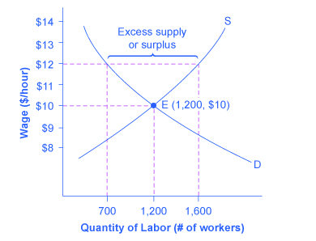

By the end of this section, you will be able to:

* Predict shifts in the demand and supply curves of the labor market
* Explain the impact of new technology on the demand and supply curves of the labor market
* Explain price floors in the labor market such as minimum wage or a living wage

Markets for labor have demand and supply curves, just like markets for goods. The law of demand applies in labor markets this way: A higher **salary**{: data-type="term" .no .emphasis} or **wage**{: data-type="term" .no .emphasis}—that is, a higher price in the labor market—leads to a decrease in the quantity of labor demanded by employers, while a lower salary or wage leads to an increase in the quantity of labor demanded. The law of supply functions in labor markets, too: A higher price for labor leads to a higher quantity of labor supplied; a lower price leads to a lower quantity supplied.

# Equilibrium in the Labor Market

In 2013, about 34,000 registered nurses worked in the Minneapolis-St. Paul-Bloomington, Minnesota-Wisconsin metropolitan area, according to the BLS. They worked for a variety of employers: hospitals, doctors’ offices, schools, health clinics, and nursing homes. [\[link\]](#CNX_Econ_C04_001) illustrates how demand and supply determine equilibrium in this labor market. The demand and supply schedules in [\[link\]](#Table_04_01) list the quantity supplied and quantity demanded of nurses at different salaries.

 of those employers who want to hire nurses intersects with the supply curve (S) of those who are qualified and willing to work as nurses at the equilibrium point (E). The equilibrium salary is $70,000 and the equilibrium quantity is 34,000 nurses. At an above-equilibrium salary of $75,000, quantity supplied increases to 38,000, but the quantity of nurses demanded at the higher pay declines to 33,000. At this above-equilibrium salary, an excess supply or surplus of nurses would exist. At a below-equilibrium salary of $60,000, quantity supplied declines to 27,000, while the quantity demanded at the lower wage increases to 40,000 nurses. At this below-equilibrium salary, excess demand or a surplus exists."){: #CNX_Econ_C04_001 data-title="Labor Market Example: Demand and Supply for Nurses in Minneapolis-St. Paul-Bloomington"}

<table id="Table_04_01" summary="This table has three columns and six rows. The first row is a header row and it labels each column, 'Annual Salary,' 'Quantity Demanded,' and 'Quantity Supplied.' Under the 'Annual Salary' column are the values: $55,000; $60,000; $65,000; $70,000; $75,000; and $80,000. Under the 'Quantity Demanded' column are the values: 45,000; 40,000; 37,000; 34,000; 33,000; and 32,000. Under the 'Quantity Supplied' column are the values: 20,000; 27,000; 31,000; 34,000; 38,000; and 41,000."><caption>Demand and Supply of Nurses in Minneapolis-St. Paul-Bloomington</caption><thead>
<tr>
<th>Annual Salary</th>
<th>Quantity Demanded</th>
<th>Quantity Supplied</th>
</tr>
</thead><tbody>
<tr>
<td>$55,000</td>
<td>45,000</td>
<td>20,000</td>
</tr>

<tr>
<td>$60,000</td>
<td>40,000</td>
<td>27,000</td>
</tr>

<tr>
<td>$65,000</td>
<td>37,000</td>
<td>31,000</td>
</tr>

<tr>
<td>$70,000</td>
<td>34,000</td>
<td>34,000</td>
</tr>

<tr>
<td>$75,000</td>
<td>33,000</td>
<td>38,000</td>
</tr>

<tr>
<td>$80,000</td>
<td>32,000</td>
<td>41,000</td>
</tr>
</tbody></table>

The horizontal axis shows the quantity of nurses hired. In this example, labor is measured by number of workers, but another common way to measure the quantity of labor is by the number of hours worked. The vertical axis shows the price for nurses’ labor—that is, how much they are paid. In the real world, this “price” would be total labor compensation: salary plus benefits. It is not obvious, but benefits are a significant part (as high as 30 percent) of labor compensation. In this example, the price of labor is measured by salary on an annual basis, although in other cases the price of labor could be measured by monthly or weekly pay, or even the wage paid per hour. As the salary for nurses rises, the quantity demanded will fall. Some hospitals and nursing homes may cut back on the number of nurses they hire, or they may lay off some of their existing nurses, rather than pay them higher salaries. Employers who face higher nurses’ salaries may also try to replace some nursing functions by investing in physical equipment, like computer monitoring and diagnostic systems to monitor patients, or by using lower-paid health care aides to reduce the number of nurses they need.

As the salary for nurses rises, the quantity supplied will rise. If nurses’ salaries in Minneapolis-St. Paul-Bloomington are higher than in other cities, more nurses will move to Minneapolis-St. Paul-Bloomington to find jobs, more people will be willing to train as nurses, and those currently trained as nurses will be more likely to pursue nursing as a full-time job. In other words, there will be more nurses looking for jobs in the area.

At **equilibrium**{: data-type="term" .no .emphasis}, the quantity supplied and the quantity demanded are equal. Thus, every employer who wants to hire a nurse at this equilibrium wage can find a willing worker, and every nurse who wants to work at this equilibrium salary can find a job. In [\[link\]](#CNX_Econ_C04_001), the supply curve (S) and demand curve (D) intersect at the equilibrium point (E). The equilibrium quantity of nurses in the Minneapolis-St. Paul-Bloomington area is 34,000, and the equilibrium salary is $70,000 per year. This example simplifies the nursing market by focusing on the “average” nurse. In reality, of course, the market for nurses is actually made up of many smaller markets, like markets for nurses with varying degrees of experience and credentials. Many markets contain closely related products that differ in quality; for instance, even a simple product like gasoline comes in regular, premium, and super-premium, each with a different price. Even in such cases, discussing the average price of gasoline, like the average salary for nurses, can still be useful because it reflects what is happening in most of the submarkets.

When the price of labor is not at the equilibrium, economic incentives tend to move salaries toward the equilibrium. For example, if salaries for nurses in Minneapolis-St. Paul-Bloomington were above the equilibrium at $75,000 per year, then 38,000 people want to work as nurses, but employers want to hire only 33,000 nurses. At that above-equilibrium salary, excess supply or a surplus results. In a situation of excess supply in the **labor market**{: data-type="term" .no .emphasis}, with many applicants for every job opening, employers will have an incentive to offer lower wages than they otherwise would have. Nurses’ salary will move down toward equilibrium.

In contrast, if the salary is below the equilibrium at, say, $60,000 per year, then a situation of excess demand or a shortage arises. In this case, employers encouraged by the relatively lower wage want to hire 40,000 nurses, but only 27,000 individuals want to work as nurses at that salary in Minneapolis-St. Paul-Bloomington. In response to the shortage, some employers will offer higher pay to attract the nurses. Other employers will have to match the higher pay to keep their own employees. The higher salaries will encourage more nurses to train or work in Minneapolis-St. Paul-Bloomington. Again, price and quantity in the labor market will move toward equilibrium.

# Shifts in Labor Demand

The demand curve for labor shows the quantity of labor employers wish to hire at any given salary or wage rate, under the ***ceteris paribus***{: data-type="term" .no-emphasis} assumption. A change in the wage or salary will result in a change in the quantity demanded of labor. If the wage rate increases, employers will want to hire fewer employees. The quantity of labor demanded will decrease, and there will be a movement upward along the demand curve. If the wages and salaries decrease, employers are more likely to hire a greater number of workers. The quantity of labor demanded will increase, resulting in a downward movement along the demand curve.

Shifts in the demand curve for labor occur for many reasons. One key reason is that the demand for labor is based on the demand for the good or service that is being produced. For example, the more new automobiles consumers demand, the greater the number of workers automakers will need to hire. Therefore the demand for labor is called a “derived demand.” Here are some examples of derived demand for labor:

* The demand for chefs is dependent on the demand for restaurant meals.
* The demand for pharmacists is dependent on the demand for prescription drugs.
* The demand for attorneys is dependent on the demand for legal services.

As the demand for the goods and services increases, the demand for labor will increase, or shift to the right, to meet employers’ production requirements. As the demand for the goods and services decreases, the demand for labor will decrease, or shift to the left. [\[link\]](#Table_04_02) shows that in addition to the derived demand for labor, demand can also increase or decrease (shift) in response to several factors.

<table id="Table_04_02" summary="This table has two columns and six rows. The columns are labeled 'Factors' and 'Results.' Under the 'Factors' column are the following phrases, 'Demand for Output,' 'Education and Training,' 'Technology,' 'Number of Companies,' 'Government Regulations,' and 'Price and Availability of Other Inputs.' Under the 'Results' column are the following explanations: 'When the demand for the good produced (output) increases, both the output price and profitability increase. As a result, producers demand more labor to ramp up production,' 'Well-trained and educated workforce causes an increase in the demand for that labor by employers. Increased levels of productivity within the workforce will cause the demand for labor to shift to the right. If the workforce is not well-trained or educated, employers will not hire from within that labor pool, since they will need to spend a significant amount of time and money training that workforce. Demand for such will shift to the left,' 'Technology changes can act as either substitutes for or complements to labor. When technology acts as a substitute, it replace the need for the number of workers an employer needs to hire. For example, word processing decreased the number of typists needed in the workplace. This shifted the demand curve for typists left. An increase in availability of certain technologies may increase the demand for labor. Technology that acts as a complement to labor will increase the demand for certain types of labor, resulting in a rightward shift of the demand curve. For example, the increased use of word processing and other software has increased the demand for information technology professionals who can resolve software and hardware issues related to a firms' network. More and better technology will increase demand for skilled workers who know how to use technology to enhance workplace productivity. Those workers who do not adapt to changes in technology will experience a decrease in demand,' 'An increase in the number of companies producing a given product will increase the demand for labor resulting in a shift to the right. A decrease in the number of companies producing a given product will decrease the demand for labor resulting in a shift to the left,' 'Complying with government regulations can increase or decrease the demand for labor at any given wage. In the heath care industry, government rules may require that nurses be hired to carry out certain medical procedures. This will increase the demand for nurses. Less-trained healthcare workers would be prohibited from carrying out these procedures, and the demand for these workers will shift to the left,' and 'Labor is not the only input into the production process. For example, a sales person at a call center needs a telephone and a computer terminal to enter data and record sales. The demand for salespersons at the call center will increase if the number of telephones and computer terminals available increases. This will cause a rightward shift of the demand curve. As the amount of inputs increases, the demand for labor will increase. If the terminal or the telephones malfunction, then the demand for that labor force will decrease. As the quantity of other inputs decreases, the demand for labor will decrease. Similarly, if prices of other inputs fall, production will become more profitable and suppliers will demand more labor in increase production. The opposite is also true. Higher input prices lower demand for labor."><caption>Factors That Can Shift Demand</caption><thead>
<tr>
<th>Factors</th>
<th>Results</th>
</tr>
</thead><tbody>
<tr>
<td>Demand for Output</td>
<td>When the demand for the good produced (output) increases, both the output price and profitability increase. As a result, producers demand more labor to ramp up production.</td>
</tr>

<tr>
<td>Education and Training</td>
<td>A well-trained and educated workforce causes an increase in the demand for that labor by employers. Increased levels of productivity within the workforce will cause the demand for labor to shift to the right. If the workforce is not well-trained or educated, employers will not hire from within that labor pool, since they will need to spend a significant amount of time and money training that workforce. Demand for such will shift to the left.</td>
</tr>

<tr>
<td>Technology</td>
<td>Technology changes can act as either substitutes for or complements to labor. When technology acts as a substitute, it replaces the need for the number of workers an employer needs to hire. For example, word processing decreased the number of typists needed in the workplace. This shifted the demand curve for typists left. An increase in the availability of certain technologies may increase the demand for labor. Technology that acts as a complement to labor will increase the demand for certain types of labor, resulting in a rightward shift of the demand curve. For example, the increased use of word processing and other software has increased the demand for information technology professionals who can resolve software and hardware issues related to a firm’s network. More and better technology will increase demand for skilled workers who know how to use technology to enhance workplace productivity. Those workers who do not adapt to changes in technology will experience a decrease in demand.</td>
</tr>

<tr>
<td>Number of Companies</td>
<td>An increase in the number of companies producing a given product will increase the demand for labor resulting in a shift to the right. A decrease in the number of companies producing a given product will decrease the demand for labor resulting in a shift to the left.</td>
</tr>

<tr>
<td>Government Regulations</td>
<td>Complying with government regulations can increase or decrease the demand for labor at any given wage. In the healthcare industry, government rules may require that nurses be hired to carry out certain medical procedures. This will increase the demand for nurses. Less-trained healthcare workers would be prohibited from carrying out these procedures, and the demand for these workers will shift to the left.</td>
</tr>

<tr>
<td>Price and Availability of Other Inputs</td>
<td>Labor is not the only input into the production process. For example, a salesperson at a call center needs a telephone and a computer terminal to enter data and record sales. The demand for salespersons at the call center will increase if the number of telephones and computer terminals available increases. This will cause a rightward shift of the demand curve. As the amount of inputs increases, the demand for labor will increase. If the terminal or the telephones malfunction, then the demand for that labor force will decrease. As the quantity of other inputs decreases, the demand for labor will decrease. Similarly, if prices of other inputs fall, production will become more profitable and suppliers will demand more labor to increase production. The opposite is also true. Higher input prices lower demand for labor</td>
</tr>
</tbody></table>

Click [here][1] to read more about “Trends and Challenges for Work in the 21st Century.”

  

# Shifts in Labor Supply

The supply of labor is upward-sloping and adheres to the law of supply: The higher the price, the greater the quantity supplied and the lower the price, the less quantity supplied. The supply curve models the tradeoff between supplying labor into the market or using time in leisure activities at every given price level. The higher the wage, the more labor is willing to work and forego leisure activities. [\[link\]](#Table_04_03) lists some of the factors that will cause the supply to increase or decrease.

<table id="Table_04_03" summary="This table has two columns and three rows. The columns are labeled 'Factors' and 'Results.' Under the column 'Factors' are the phrases: 'Number of Workers,' 'Required Education,' and 'Government Policies.' Under the 'Results' column are the explanations: 'An increased number of workers will cause the supply curve to shift to the right. An increased number of workers can be due to several factors, such as immigration, increasing population, and aging population, and changing demographics. Polices that encourage immigration will increase the supply of labor, and vice versa. Population grows when birth rates exceed death rates; this eventually increases supply of labor when the former reach working age. An again and therefore retiring population will decrease the supply of labor. Another example of changing demographics is more women working outside of the home, which increases the supply of labor,' 'The more required education, the lower the supply. There is a lower supply  of PhD mathematicians than of high school mathematics teachers; there is a lower supply of cardiologists than or primary care physicians; and there is a lower supply of physicians than of nurses,' and 'Government policies can also affect the supply of labor for jobs. On the one hand, the government may support rules that set high qualifications for certain jobs: academic training, certificates or licenses, or experience. When these qualifications are made rougher, the number of qualified workers will decrease at any given wage. On the other hand, the government may also subsidize training or even reduce the required level of qualifications. For example, government might offer subsidies for nursing schools or nursing students. Such provisions would shift the supply curve of nurses to the right. In addition, government policies that change the relative desirability of working versus not working also affect the labor supply. These include unemployment benefits, maternity leave, child care benefits, and welfare policy. For examples, child care benefits may incrase the labor supply of working mothers. Long term unemployment benefits may discourage job searching for unemployed workers. All these policies must therefore be carefully designed to minimize any negative labor supply effects."><caption>Factors that Can Shift Supply</caption><thead>
<tr>
<th>Factors</th>
<th>Results</th>
</tr>
</thead><tbody>
<tr>
<td>Number of Workers</td>
<td>An increased number of workers will cause the supply curve to shift to the right. An increased number of workers can be due to several factors, such as immigration, increasing population, an aging population, and changing demographics. Policies that encourage immigration will increase the supply of labor, and vice versa. Population grows when birth rates exceed death rates; this eventually increases supply of labor when the former reach working age. An aging and therefore retiring population will decrease the supply of labor. Another example of changing demographics is more women working outside of the home, which increases the supply of labor.</td>
</tr>

<tr>
<td>Required Education</td>
<td>The more required education, the lower the supply. There is a lower supply of PhD mathematicians than of high school mathematics teachers; there is a lower supply of cardiologists than of primary care physicians; and there is a lower supply of physicians than of nurses.</td>
</tr>

<tr>
<td>Government Policies </td>
<td>Government policies can also affect the supply of labor for jobs. On the one hand, the government may support rules that set high qualifications for certain jobs: academic training, certificates or licenses, or experience. When these qualifications are made tougher, the number of qualified workers will decrease at any given wage. On the other hand, the government may also subsidize training or even reduce the required level of qualifications. For example, government might offer subsidies for nursing schools or nursing students. Such provisions would shift the supply curve of nurses to the right. In addition, government policies that change the relative desirability of working versus not working also affect the labor supply. These include unemployment benefits, maternity leave, child care benefits and welfare policy. For example, child care benefits may increase the labor supply of working mothers. Long term unemployment benefits may discourage job searching for unemployed workers. All these policies must therefore be carefully designed to minimize any negative labor supply effects.</td>
</tr>
</tbody></table>

A change in salary will lead to a movement along labor demand or labor supply curves, but it will not shift those curves. However, other events like those outlined here will cause either the demand or the supply of labor to shift, and thus will move the labor market to a new equilibrium salary and quantity.

# Technology and Wage Inequality: The Four-Step Process

Economic events can change the equilibrium salary (or wage) and quantity of labor. Consider how the wave of new information technologies, like computer and telecommunications networks, has affected low-skill and high-skill workers in the U.S. economy. From the perspective of employers who demand labor, these new technologies are often a substitute for low-skill laborers like file clerks who used to keep file cabinets full of paper records of transactions. However, the same new technologies are a complement to high-skill workers like managers, who benefit from the technological advances by being able to monitor more information, communicate more easily, and juggle a wider array of responsibilities. So, how will the new technologies affect the wages of high-skill and low-skill workers? For this question, the four-step process of analyzing how shifts in supply or demand affect a market (introduced in [Demand and Supply](/m48628)) works in this way:

Step 1. What did the markets for low-skill labor and high-skill labor look like before the arrival of the new technologies? In [\[link\]](#CNX_Econ_C04_009) (a) and [\[link\]](#CNX_Econ_C04_009) (b), S0 is the original supply curve for labor and D0 is the original demand curve for labor in each market. In each graph, the original point of equilibrium, E0, occurs at the price W0 and the quantity Q0.

 The demand for low-skill labor shifts to the left when technology can do the job previously done by these workers. (b) New technologies can also increase the demand for high-skill labor in fields such as information technology and network administration."){: #CNX_Econ_C04_009 data-title="Technology and Wages: Applying Demand and Supply "}

Step 2. Does the new technology affect the supply of labor from households or the demand for labor from firms? The technology change described here affects demand for labor by firms that hire workers.

Step 3. Will the new technology increase or decrease demand? Based on the description earlier, as the substitute for low-skill labor becomes available, demand for low-skill labor will shift to the left, from D0 to D1. As the technology complement for high-skill labor becomes cheaper, demand for high-skill labor will shift to the right, from D0 to D1.

Step 4. The new equilibrium for low-skill labor, shown as point E1 with price W1 and quantity Q1, has a lower wage and quantity hired than the original equilibrium, E0. The new equilibrium for high-skill labor, shown as point E1 with price W1 and quantity Q1, has a higher wage and quantity hired than the original equilibrium (E0).

So, the demand and supply model predicts that the new computer and communications technologies will raise the pay of high-skill workers but reduce the pay of low-skill workers. Indeed, from the 1970s to the mid-2000s, the wage gap widened between high-skill and low-skill labor. According to the National Center for Education Statistics, in 1980, for example, a college graduate earned about 30% more than a high school graduate with comparable job experience, but by 2012, a college graduate earned about 60% more than an otherwise comparable high school graduate. Many economists believe that the trend toward greater wage inequality across the U.S. economy was primarily caused by the new technologies.

Visit this [website][2] to read about ten tech skills that have lost relevance in today’s workforce.

  

# Price Floors in the Labor Market: Living Wages and Minimum Wages

In contrast to goods and services markets, price ceilings are rare in labor markets, because rules that prevent people from earning income are not politically popular. There is one exception: sometimes limits are proposed on the high incomes of top business executives.

The labor market, however, presents some prominent examples of price floors, which are often used as an attempt to increase the wages of low-paid workers. The U.S. government sets a **minimum wage**{: data-type="term"}, a price floor that makes it illegal for an employer to pay employees less than a certain hourly rate. In mid-2009, the U.S. minimum wage was raised to $7.25 per hour. Local political movements in a number of U.S. cities have pushed for a higher minimum wage, which they call a **living wage**{: data-type="term" .no .emphasis}. Promoters of living wage laws maintain that the minimum wage is too low to ensure a reasonable standard of living. They base this conclusion on the calculation that, if you work 40 hours a week at a minimum wage of $7.25 per hour for 50 weeks a year, your annual income is $14,500, which is less than the official U.S. government definition of what it means for a family to be in poverty. (A family with two adults earning minimum wage and two young children will find it more cost efficient for one parent to provide childcare while the other works for income. So the family income would be $14,500, which is significantly lower than the federal poverty line for a family of four, which was $23,850 in 2014.)

Supporters of the living wage argue that full-time workers should be assured a high enough wage so that they can afford the essentials of life: food, clothing, shelter, and healthcare. Since Baltimore passed the first living wage law in 1994, several dozen cities enacted similar laws in the late 1990s and the 2000s. The living wage ordinances do not apply to all employers, but they have specified that all employees of the city or employees of firms that are hired by the city be paid at least a certain wage that is usually a few dollars per hour above the U.S. minimum wage.

[\[link\]](#CNX_Econ_C04_004) illustrates the situation of a city considering a living wage law. For simplicity, we assume that there is no federal minimum wage. The wage appears on the vertical axis, because the wage is the price in the labor market. Before the passage of the living wage law, the equilibrium wage is $10 per hour and the city hires 1,200 workers at this wage. However, a group of concerned citizens persuades the city council to enact a living wage law requiring employers to pay no less than $12 per hour. In response to the higher wage, 1,600 workers look for jobs with the city. At this higher wage, the city, as an employer, is willing to hire only 700 workers. At the price floor, the quantity supplied exceeds the quantity demanded, and a surplus of labor exists in this market. For workers who continue to have a job at a higher salary, life has improved. For those who were willing to work at the old wage rate but lost their jobs with the wage increase, life has not improved. [\[link\]](#Table_04_04) shows the differences in supply and demand at different wages.

{: #CNX_Econ_C04_004 data-title="A Living Wage: Example of a Price Floor "}

<table id="Table_04_04" summary="This table has three columns and seven rows. The columns are labeled: 'Wage,' 'Quantity Labor Demanded,' and 'Quantity Labor Supplied.' Under the column 'Wage' are the values: '$8/hr,' '$9/hr,' '$10/hr,' '$11/hr,' '$12/hr,' '$13/hr,' and '$14/hr.' Under the column 'Quantity Labor Demanded' are the values: 1,900; 1,500; 1,200; 900; 700; 500; and 400. Under the 'Quantity Labor Supplied' column are the values: 500; 900; 1,200; 1,400; 1,600; 1,800; and 1,900."><caption>Living Wage: Example of a Price Floor</caption><thead>
<tr>
<th>Wage</th>
<th>Quantity Labor Demanded</th>
<th>Quantity Labor Supplied</th>
</tr>
</thead><tbody>
<tr>
<td>$8/hr</td>
<td>1,900</td>
<td>500</td>
</tr>

<tr>
<td>$9/hr</td>
<td>1,500</td>
<td>900</td>
</tr>

<tr>
<td>$10/hr</td>
<td>1,200</td>
<td>1,200</td>
</tr>

<tr>
<td>$11/hr</td>
<td>900</td>
<td>1,400</td>
</tr>

<tr>
<td>$12/hr</td>
<td>700</td>
<td>1,600</td>
</tr>

<tr>
<td>$13/hr</td>
<td>500</td>
<td>1,800</td>
</tr>

<tr>
<td>$14/hr</td>
<td>400</td>
<td>1,900</td>
</tr>
</tbody></table>

# The Minimum Wage as an Example of a Price Floor

The U.S. minimum wage is a price floor that is set either very close to the equilibrium wage or even slightly below it. About 1% of American workers are actually paid the minimum wage. In other words, the vast majority of the U.S. labor force has its wages determined in the labor market, not as a result of the government price floor. But for workers with low skills and little experience, like those without a high school diploma or teenagers, the minimum wage is quite important. In many cities, the federal minimum wage is apparently below the market price for unskilled labor, because employers offer more than the minimum wage to checkout clerks and other low-skill workers without any government prodding.

Economists have attempted to estimate how much the minimum wage reduces the quantity demanded of low-skill labor. A typical result of such studies is that a 10% increase in the minimum wage would decrease the hiring of unskilled workers by 1 to 2%, which seems a relatively small reduction. In fact, some studies have even found no effect of a higher minimum wage on employment at certain times and places—although these studies are controversial.

Let’s suppose that the minimum wage lies just slightly *below* the equilibrium wage level. Wages could fluctuate according to market forces above this price floor, but they would not be allowed to move beneath the floor. In this situation, the price floor minimum wage is said to be *nonbinding* —that is, the price floor is not determining the market outcome. Even if the minimum wage moves just a little higher, it will still have no effect on the quantity of employment in the economy, as long as it remains below the equilibrium wage. Even if the minimum wage is increased by enough so that it rises slightly above the equilibrium wage and becomes binding, there will be only a small excess supply gap between the quantity demanded and quantity supplied.

These insights help to explain why U.S. minimum wage laws have historically had only a small impact on employment. Since the minimum wage has typically been set close to the equilibrium wage for low-skill labor and sometimes even below it, it has not had a large effect in creating an excess supply of labor. However, if the minimum wage were increased dramatically—say, if it were doubled to match the living wages that some U.S. cities have considered—then its impact on reducing the quantity demanded of employment would be far greater. The following Clear It Up feature describes in greater detail some of the arguments for and against changes to minimum wage.

What’s the harm in raising the minimum wage?

Because of the law of demand, a higher required wage will reduce the amount of low-skill employment either in terms of employees or in terms of work hours. Although there is controversy over the numbers, let’s say for the sake of the argument that a 10% rise in the minimum wage will reduce the employment of low-skill workers by 2%. Does this outcome mean that raising the minimum wage by 10% is bad public policy? Not necessarily.

If 98% of those receiving the minimum wage have a pay increase of 10%, but 2% of those receiving the minimum wage lose their jobs, are the gains for society as a whole greater than the losses? The answer is not clear, because job losses, even for a small group, may cause more pain than modest income gains for others. For one thing, we need to consider which minimum wage workers are losing their jobs. If the 2% of minimum wage workers who lose their jobs are struggling to support families, that is one thing. If those who lose their job are high school students picking up spending money over summer vacation, that is something else.

Another complexity is that many minimum wage workers do not work full-time for an entire year. Imagine a minimum wage worker who holds different part-time jobs for a few months at a time, with bouts of unemployment in between. The worker in this situation receives the 10% raise in the minimum wage when working, but also ends up working 2% fewer hours during the year because the higher minimum wage reduces how much employers want people to work. Overall, this worker’s income would rise because the 10% pay raise would more than offset the 2% fewer hours worked.

Of course, these arguments do not prove that raising the minimum wage is necessarily a good idea either. There may well be other, better public policy options for helping low-wage workers. (The [Poverty and Economic Inequality](/m48681){: .target-chapter} chapter discusses some possibilities.) The lesson from this maze of minimum wage arguments is that complex social problems rarely have simple answers. Even those who agree on how a proposed economic policy affects quantity demanded and quantity supplied may still disagree on whether the policy is a good idea.

# Concepts and Summary

In the labor market, households are on the supply side of the market and firms are on the demand side. In the market for financial capital, households and firms can be on either side of the market: they are suppliers of financial capital when they save or make financial investments, and demanders of financial capital when they borrow or receive financial investments.

In the demand and supply analysis of labor markets, the price can be measured by the annual salary or hourly wage received. The quantity of labor can be measured in various ways, like number of workers or the number of hours worked.

Factors that can shift the demand curve for labor include: a change in the quantity demanded of the product that the labor produces; a change in the production process that uses more or less labor; and a change in government policy that affects the quantity of labor that firms wish to hire at a given wage. Demand can also increase or decrease (shift) in response to: workers’ level of education and training, technology, the number of companies, and availability and price of other inputs.

The main factors that can shift the supply curve for labor are: how desirable a job appears to workers relative to the alternatives, government policy that either restricts or encourages the quantity of workers trained for the job, the number of workers in the economy, and required education.

# Self-Check Questions

In the labor market, what causes a movement along the demand curve? What causes a shift in the demand curve?

Changes in the wage rate (the price of labor) cause a movement along the demand curve. A change in anything else that affects demand for labor (e.g., changes in output, changes in the production process that use more or less labor, government regulation) causes a shift in the demand curve.

In the labor market, what causes a movement along the supply curve? What causes a shift in the supply curve?

Changes in the wage rate (the price of labor) cause a movement along the supply curve. A change in anything else that affects supply of labor (e.g., changes in how desirable the job is perceived to be, government policy to promote training in the field) causes a shift in the supply curve.

Why is a living wage considered a price floor? Does imposing a living wage have the same outcome as a minimum wage?

Since a living wage is a suggested minimum wage, it acts like a price floor (assuming, of course, that it is followed). If the living wage is binding, it will cause an excess supply of labor at that wage rate.

# Review Questions

What is the “price” commonly called in the labor market?

Are households demanders or suppliers in the goods market? Are firms demanders or suppliers in the goods market? What about the labor market and the financial market?

Name some factors that can cause a shift in the demand curve in labor markets.

Name some factors that can cause a shift in the supply curve in labor markets.

# Critical Thinking Questions

Other than the demand for labor, what would be another example of a “derived demand?”

Suppose that a 5% increase in the minimum wage causes a 5% reduction in employment. How would this affect employers and how would it affect workers? In your opinion, would this be a good policy?

What assumption is made for a minimum wage to be a nonbinding price floor? What assumption is made for a living wage price floor to be binding?

# Problems

Identify each of the following as involving either demand or supply. Draw a circular flow diagram and label the flows A through F. (Some choices can be on both sides of the goods market.)

1.  Households in the labor market
2.  Firms in the goods market
3.  Firms in the financial market
4.  Households in the goods market
5.  Firms in the labor market
6.  Households in the financial market
{: data-number-style="lower-alpha"}

Predict how each of the following events will raise or lower the equilibrium wage and quantity of coal miners in West Virginia. In each case, sketch a demand and supply diagram to illustrate your answer.

1.  The price of oil rises.
2.  New coal-mining equipment is invented that is cheap and requires few workers to run.
3.  Several major companies that do not mine coal open factories in West Virginia, offering a lot of well-paid jobs.
4.  Government imposes costly new regulations to make coal-mining a safer job.
{: data-number-style="lower-alpha"}

# References

American Community Survey. 2012. \"School Enrollment and Work Status: 2011.\" Accessed April 13, 2015. http://www.census.gov/prod/2013pubs/acsbr11-14.pdf.

National Center for Educational Statistics. “Digest of Education Statistics.” (2008 and 2010). Accessed December 11, 2013. nces.ed.gov.

## Glossary
{: data-type="glossary-title"}

minimum wage
: a price floor that makes it illegal for an employer to pay employees less than a certain hourly rate
{: .definition}

[1]: http://openstaxcollege.org/l/Futurework
[2]: http://openstaxcollege.org/l/oldtechjobs
