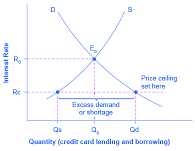

By the end of this section, you will be able to:

* Identify the demanders and suppliers in a financial market.
* Explain how interest rates can affect supply and demand
* Analyze the economic effects of U.S. debt in terms of domestic financial markets
* Explain the role of price ceilings and usury laws in the U.S.

United States\' households, institutions, and domestic businesses saved almost $1.9 trillion in 2013. Where did that savings go and what was it used for? Some of the savings ended up in banks, which in turn loaned the money to individuals or businesses that wanted to borrow money. Some was invested in private companies or loaned to government agencies that wanted to borrow money to raise funds for purposes like building roads or mass transit. Some firms reinvested their savings in their own businesses.

In this section, we will determine how the demand and supply model links those who wish to supply **financial capital**{: data-type="term" .no .emphasis} (i.e., savings) with those who demand financial capital (i.e., borrowing). Those who save money (or make financial investments, which is the same thing), whether individuals or businesses, are on the supply side of the financial market. Those who borrow money are on the demand side of the financial market. For a more detailed treatment of the different kinds of financial investments like bank accounts, stocks and bonds, see the [Financial Markets](/m48697) chapter.

# Who Demands and Who Supplies in Financial Markets?

In any market, the price is what suppliers receive and what demanders pay. In financial markets, those who supply financial capital through saving expect to receive a rate of return, while those who demand financial capital by receiving funds expect to pay a rate of return. This rate of return can come in a variety of forms, depending on the type of investment.

The simplest example of a rate of return is the **interest rate**{: data-type="term"}. For example, when you supply money into a savings account at a bank, you receive interest on your deposit. The interest paid to you as a percent of your deposits is the interest rate. Similarly, if you demand a loan to buy a car or a computer, you will need to pay interest on the money you borrow.

Let’s consider the market for borrowing money with credit cards. In 2014, almost 200 million Americans were cardholders. Credit cards allow you to borrow money from the card\'s issuer, and pay back the borrowed amount plus interest, though most allow you a period of time in which you can repay the loan without paying interest. A typical credit card interest rate ranges from 12% to 18% per year. In 2014, Americans had about $793 billion outstanding in credit card debts. About half of U.S. families with credit cards report that they almost always pay the full balance on time, but one-quarter of U.S. families with credit cards say that they “hardly ever” pay off the card in full. In fact, in 2014, 56% of consumers carried an unpaid balance in the last 12 months. Let’s say that, on average, the annual interest rate for credit card borrowing is 15% per year. So, Americans pay tens of billions of dollars every year in interest on their credit cards—plus basic fees for the credit card or fees for late payments.

[\[link\]](#CNX_Econ_C04_005) illustrates demand and supply in the financial market for credit cards. The horizontal axis of the financial market shows the quantity of money that is loaned or borrowed in this market. The vertical or price axis shows the rate of return, which in the case of credit card borrowing can be measured with an interest rate. [\[link\]](#Table_04_05) shows the quantity of financial capital that consumers demand at various interest rates and the quantity that credit card firms (often banks) are willing to supply.

  for borrowing financial capital intersects the supply curve (S) for lending financial capital at equilibrium &#x20AC;. At the equilibrium, the interest rate (the &#x201C;price&#x201D; in this market) is 15% and the quantity of financial capital being loaned and borrowed is $600 billion. The equilibrium price is where the quantity demanded and the quantity supplied are equal. At an above-equilibrium interest rate like 21%, the quantity of financial capital supplied would increase to $750 billion, but the quantity demanded would decrease to $480 billion. At a below-equilibrium interest rate like 13%, the quantity of financial capital demanded would increase to $700 billion, but the quantity of financial capital supplied would decrease to $510 billion."){: #CNX_Econ_C04_005 data-title="Demand and Supply for Borrowing Money with Credit Cards "}

<table id="Table_04_05" summary="This table has three columns and six rows. The columns are labeled, 'Interest Rate (%),' 'Quantity of Financial Capital Demanded (Borrowing) ($ billions),' and 'Quantity of Financial Capital Supplied (Lending) ($ billions).' Under the column 'Interest Rate (%)' are the values: 11, 13, 15, 17, 19, and 21. Under the column 'Quantity of Financial Capital Demanded (Borrowing) ($ billions)' are the values: $800; $700; $600; $550; $500; and $480. Under the column 'Quantity of Financial Capital Supplied (Lending) ($ billions)' are the values: $420; $510; $600; $660; $720; and $750."><caption>Demand and Supply for Borrowing Money with Credit Cards</caption><thead>
<tr>
<th>Interest Rate (%)</th>
<th>Quantity of Financial Capital Demanded (Borrowing) ($ billions)</th>
<th>Quantity of Financial Capital Supplied (Lending) ($ billions)</th>
</tr>
</thead><tbody>
<tr>
<td>11</td>
<td>$800</td>
<td>$420</td>
</tr>

<tr>
<td>13</td>
<td>$700</td>
<td>$510</td>
</tr>

<tr>
<td>15</td>
<td>$600</td>
<td>$600</td>
</tr>

<tr>
<td>17</td>
<td>$550</td>
<td>$660</td>
</tr>

<tr>
<td>19</td>
<td>$500</td>
<td>$720</td>
</tr>

<tr>
<td>21</td>
<td>$480</td>
<td>$750</td>
</tr>
</tbody></table>

The laws of demand and supply continue to apply in the financial markets. According to the **law of demand**{: data-type="term" .no .emphasis}, a higher rate of return (that is, a higher price) will decrease the quantity demanded. As the interest rate rises, consumers will reduce the quantity that they borrow. According to the law of supply, a higher price increases the quantity supplied. Consequently, as the interest rate paid on credit card borrowing rises, more firms will be eager to issue credit cards and to encourage customers to use them. Conversely, if the interest rate on credit cards falls, the quantity of financial capital supplied in the credit card market will decrease and the quantity demanded will fall.

# Equilibrium in Financial Markets

In the financial market for credit cards shown in [\[link\]](#CNX_Econ_C04_005), the supply curve (S) and the demand curve (D) cross at the equilibrium point (E). The equilibrium occurs at an interest rate of 15%, where the quantity of funds demanded and the quantity supplied are equal at an equilibrium quantity of $600 billion.

If the interest rate (remember, this measures the “price” in the financial market) is above the equilibrium level, then an excess supply, or a surplus, of financial capital will arise in this market. For example, at an interest rate of 21%, the quantity of funds supplied increases to $750 billion, while the quantity demanded decreases to $480 billion. At this above-equilibrium interest rate, firms are eager to supply loans to credit card borrowers, but relatively few people or businesses wish to borrow. As a result, some credit card firms will lower the interest rates (or other fees) they charge to attract more business. This strategy will push the interest rate down toward the equilibrium level.

If the interest rate is below the equilibrium, then excess demand or a shortage of funds occurs in this market. At an interest rate of 13%, the quantity of funds credit card borrowers demand increases to $700 billion; but the quantity credit card firms are willing to supply is only $510 billion. In this situation, credit card firms will perceive that they are overloaded with eager borrowers and conclude that they have an opportunity to raise interest rates or fees. The interest rate will face economic pressures to creep up toward the equilibrium level.

# Shifts in Demand and Supply in Financial Markets

Those who supply financial capital face two broad decisions: how much to save, and how to divide up their savings among different forms of financial investments. We will discuss each of these in turn.

Participants in financial markets must decide when they prefer to consume goods: now or in the future. Economists call this **intertemporal decision making**{: data-type="term" .no .emphasis} because it involves decisions across time. Unlike a decision about what to buy from the grocery store, decisions about investment or saving are made across a period of time, sometimes a long period.

Most workers save for retirement because their income in the present is greater than their needs, while the opposite will be true once they retire. So they save today and supply financial markets. If their income increases, they save more. If their perceived situation in the future changes, they change the amount of their saving. For example, there is some evidence that Social Security, the program that workers pay into in order to qualify for government checks after retirement, has tended to reduce the quantity of financial capital that workers save. If this is true, Social Security has shifted the supply of financial capital at any interest rate to the left.

By contrast, many college students need money today when their income is low (or nonexistent) to pay their college expenses. As a result, they borrow today and demand from financial markets. Once they graduate and become employed, they will pay back the loans. Individuals borrow money to purchase homes or cars. A business seeks financial investment so that it has the funds to build a factory or invest in a research and development project that will not pay off for five years, ten years, or even more. So when consumers and businesses have greater confidence that they will be able to repay in the future, the quantity demanded of financial capital at any given interest rate will shift to the right.

For example, in the technology boom of the late 1990s, many businesses became extremely confident that investments in new technology would have a high rate of return, and their demand for financial capital shifted to the right. Conversely, during the Great Recession of 2008 and 2009, their demand for financial capital at any given interest rate shifted to the left.

To this point, we have been looking at saving in total. Now let us consider what affects saving in different types of financial investments. In deciding between different forms of financial investments, suppliers of financial capital will have to consider the rates of return and the risks involved. Rate of return is a positive attribute of investments, but risk is a negative. If Investment A becomes more risky, or the return diminishes, then savers will shift their funds to Investment B—and the supply curve of financial capital for Investment A will shift back to the left while the supply curve of capital for Investment B shifts to the right.

# The United States as a Global Borrower

In the global economy, trillions of dollars of financial investment cross national borders every year. In the early 2000s, financial investors from foreign countries were investing several hundred billion dollars per year more in the U.S. economy than U.S. financial investors were investing abroad. The following Work It Out deals with one of the macroeconomic concerns for the U.S. economy in recent years.

The Effect of Growing U.S. Debt

Imagine that the U.S. economy became viewed as a less desirable place for foreign investors to put their money because of fears about the growth of the U.S. public debt. Using the four-step process for analyzing how changes in supply and demand affect equilibrium outcomes, how would increased U.S. public debt affect the equilibrium price and quantity for capital in U.S. financial markets?

Step 1. Draw a diagram showing demand and supply for financial capital that represents the original scenario in which foreign investors are pouring money into the U.S. economy. [\[link\]](#CNX_Econ_C04_014) shows a demand curve, D, and a supply curve, S, where the supply of capital includes the funds arriving from foreign investors. The original equilibrium E0 occurs at interest rate R0 and quantity of financial investment Q0.

 occurs at an equilibrium rate of return (R0) and the equilibrium quantity is at Q0."){: #CNX_Econ_C04_014 data-title="The United States as a Global Borrower Before U.S. Debt Uncertainty "}

Step 2. Will the diminished confidence in the U.S. economy as a place to invest affect demand or supply of financial capital? Yes, it will affect supply. Many foreign investors look to the U.S. financial markets to store their money in safe financial vehicles with low risk and stable returns. As the U.S. debt increases, debt servicing will increase—that is, more current income will be used to pay the interest rate on past debt. Increasing U.S. debt also means that businesses may have to pay higher interest rates to borrow money, because business is now competing with the government for financial resources.

Step 3. Will supply increase or decrease? When the enthusiasm of foreign investors’ for investing their money in the U.S. economy diminishes, the supply of financial capital shifts to the left. [\[link\]](#CNX_Econ_C04_006) shows the supply curve shift from S0 to S1.

 occurs at an equilibrium rate of return (R0) and the equilibrium quantity is at Q0."){: #CNX_Econ_C04_006 data-title="The United States as a Global Borrower Before and After U.S. Debt Uncertainty "}

Step 4. Thus, foreign investors’ diminished enthusiasm leads to a new equilibrium, E1, which occurs at the higher interest rate, R1, and the lower quantity of financial investment, Q1.

The economy has experienced an enormous inflow of foreign capital. According to the U.S. Bureau of Economic Analysis, by the third quarter of 2014, U.S. investors had accumulated $24.6 trillion of foreign assets, but foreign investors owned a total of $30.8 trillion of U.S. assets. If foreign investors were to pull their money out of the U.S. economy and invest elsewhere in the world, the result could be a significantly lower quantity of financial investment in the United States, available only at a higher interest rate. This reduced inflow of foreign financial investment could impose hardship on U.S. consumers and firms interested in borrowing.

In a modern, developed economy, financial capital often moves invisibly through electronic transfers between one bank account and another. Yet these flows of funds can be analyzed with the same tools of demand and supply as markets for goods or labor.

# Price Ceilings in Financial Markets: Usury Laws

As we noted earlier, about 200 million Americans own credit cards, and their interest payments and fees total tens of billions of dollars each year. It is little wonder that political pressures sometimes arise for setting limits on the interest rates or fees that credit card companies charge. The firms that issue credit cards, including banks, oil companies, phone companies, and retail stores, respond that the higher interest rates are necessary to cover the losses created by those who borrow on their credit cards and who do not repay on time or at all. These companies also point out that cardholders can avoid paying interest if they pay their bills on time.

Consider the credit card market as illustrated in [\[link\]](#CNX_Econ_C04_007). In this financial market, the vertical axis shows the interest rate (which is the price in the financial market). Demanders in the credit card market are households and businesses; suppliers are the companies that issue credit cards. This figure does not use specific numbers, which would be hypothetical in any case, but instead focuses on the underlying economic relationships. Imagine a law imposes a price ceiling that holds the interest rate charged on credit cards at the rate Rc, which lies below the interest rate R0 that would otherwise have prevailed in the market. The price ceiling is shown by the horizontal dashed line in [\[link\]](#CNX_Econ_C04_007). The demand and supply model predicts that at the lower price ceiling interest rate, the quantity demanded of credit card debt will increase from its original level of Q0 to Qd; however, the quantity supplied of credit card debt will decrease from the original Q0 to Qs. At the price ceiling (Rc), quantity demanded will exceed quantity supplied. Consequently, a number of people who want to have credit cards and are willing to pay the prevailing interest rate will find that companies are unwilling to issue cards to them. The result will be a credit shortage.

{: #CNX_Econ_C04_007 data-title="Credit Card Interest Rates: Another Price Ceiling Example "}

Many states do have **usury laws**{: data-type="term"}, which impose an upper limit on the interest rate that lenders can charge. However, in many cases these upper limits are well above the market interest rate. For example, if the interest rate is not allowed to rise above 30% per year, it can still fluctuate below that level according to market forces. A price ceiling that is set at a relatively high level is nonbinding, and it will have no practical effect unless the equilibrium price soars high enough to exceed the price ceiling.

# Key Concepts and Summary

In the demand and supply analysis of financial markets, the “price” is the rate of return or the interest rate received. The quantity is measured by the money that flows from those who supply financial capital to those who demand it.

Two factors can shift the supply of financial capital to a certain investment: if people want to alter their existing levels of consumption, and if the riskiness or return on one investment changes relative to other investments. Factors that can shift demand for capital include business confidence and consumer confidence in the future—since financial investments received in the present are typically repaid in the future.

# Self-Check Questions

In the financial market, what causes a movement along the demand curve? What causes a shift in the demand curve?

Changes in the interest rate (i.e., the price of financial capital) cause a movement along the demand curve. A change in anything else (non-price variable) that affects demand for financial capital (e.g., changes in confidence about the future, changes in needs for borrowing) would shift the demand curve.

In the financial market, what causes a movement along the supply curve? What causes a shift in the supply curve?

Changes in the interest rate (i.e., the price of financial capital) cause a movement along the supply curve. A change in anything else that affects the supply of financial capital (a non-price variable) such as income or future needs would shift the supply curve.

If a usury law limits interest rates to no more than 35%, what would the likely impact be on the amount of loans made and interest rates paid?

If market interest rates stay in their normal range, an interest rate limit of 35% would not be binding. If the equilibrium interest rate rose above 35%, the interest rate would be capped at that rate, and the quantity of loans would be lower than the equilibrium quantity, causing a shortage of loans.

Which of the following changes in the financial market will lead to a decline in interest rates:

1.  a rise in demand
2.  a fall in demand
3.  a rise in supply
4.  a fall in supply
{: data-number-style="lower-alpha"}

b and c will lead to a fall in interest rates. At a lower demand, lenders will not be able to charge as much, and with more available lenders, competition for borrowers will drive rates down.

Which of the following changes in the financial market will lead to an increase in the quantity of loans made and received:

1.  a rise in demand
2.  a fall in demand
3.  a rise in supply
4.  a fall in supply
{: data-number-style="lower-alpha"}

a and c will increase the quantity of loans. More people who want to borrow will result in more loans being given, as will more people who want to lend.

# Review Questions

How is equilibrium defined in financial markets?

What would be a sign of a shortage in financial markets?

Would usury laws help or hinder resolution of a shortage in financial markets?

# Critical Thinking Questions

Suppose the U.S. economy began to grow more rapidly than other countries in the world. What would be the likely impact on U.S. financial markets as part of the global economy?

If the government imposed a federal interest rate ceiling of 20% on all loans, who would gain and who would lose?

# Problems

Predict how each of the following economic changes will affect the equilibrium price and quantity in the financial market for home loans. Sketch a demand and supply diagram to support your answers.

1.  The number of people at the most common ages for home-buying increases.
2.  People gain confidence that the economy is growing and that their jobs are secure.
3.  Banks that have made home loans find that a larger number of people than they expected are not repaying those loans.
4.  Because of a threat of a war, people become uncertain about their economic future.
5.  The overall level of saving in the economy diminishes.
6.  The federal government changes its bank regulations in a way that makes it cheaper and easier for banks to make home loans.
{: data-number-style="lower-alpha"}

[[link]](#Table_04_06) shows the amount of savings and borrowing in a market for loans to purchase homes, measured in millions of dollars, at various interest rates. What is the equilibrium interest rate and quantity in the capital financial market? How can you tell? Now, imagine that because of a shift in the perceptions of foreign investors, the supply curve shifts so that there will be $10 million less supplied at every interest rate. Calculate the new equilibrium interest rate and quantity, and explain why the direction of the interest rate shift makes intuitive sense.

| Interest Rate | Qs | Qd |
|----------
| 5% | 130 | 170 |
| 6% | 135 | 150 |
| 7% | 140 | 140 |
| 8% | 145 | 135 |
| 9% | 150 | 125 |
| 10% | 155 | 110 |
{: #Table_04_06 summary="This table has three columns and six rows. The columns are labeled, 'Interest Rate,' 'Qs,' and 'Qd.' Under the column 'Interest Rate' are the values: 5%, 6%, 7%, 8%, 9%, and 10%. Under the column 'Qs' are the values: 130; 135; 140; 145; 150; and 155. Under the columne 'Qd' are the values: 170; 150; 140; 135; 125; and 110."}

# References

CreditCards.com. 2013. http://www.creditcards.com/credit-card-news/credit-card-industry-facts-personal-debt-statistics-1276.php.

## Glossary
{: data-type="glossary-title"}

interest rate
: the “price” of borrowing in the financial market; a rate of return on an investment
{: .definition}

usury laws
: laws that impose an upper limit on the interest rate that lenders can charge
{: .definition}

