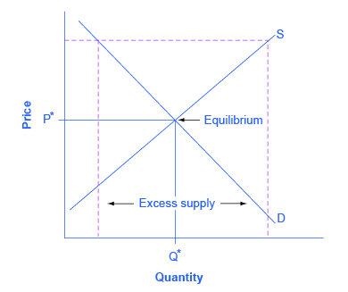
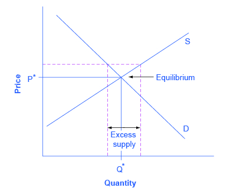
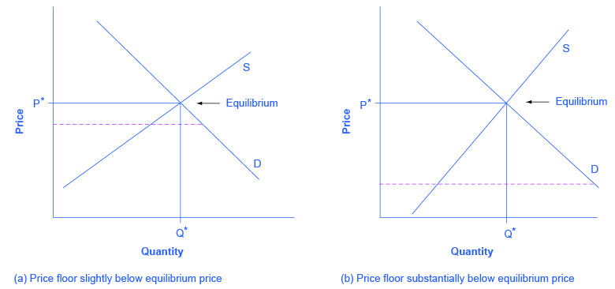
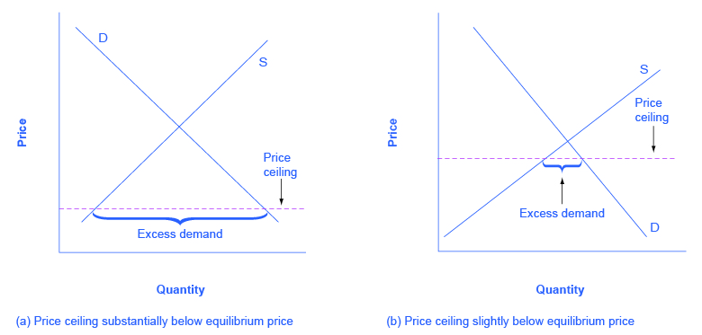

By the end of this section, you will be able to:

* Apply demand and supply models to analyze prices and quantities
* Explain the effects of price controls on the equilibrium of prices and quantities

Prices exist in markets for goods and services, for labor, and for financial capital. In all of these markets, prices serve as a remarkable social mechanism for collecting, combining, and transmitting information that is relevant to the market—namely, the relationship between demand and supply—and then serving as messengers to convey that information to buyers and sellers. In a market-oriented economy, no government agency or guiding intelligence oversees the set of responses and interconnections that result from a change in price. Instead, each consumer reacts according to that person’s preferences and budget set, and each profit-seeking producer reacts to the impact on its expected profits. The following Clear It Up feature examines the **demand and supply models**{: data-type="term" .no .emphasis}.

Why are demand and supply curves important?

The demand and supply model is the second fundamental diagram for this course. (The opportunity set model introduced in the [Choice in a World of Scarcity](/m48602){: .target-chapter} chapter was the first.) Just as it would be foolish to try to learn the arithmetic of long division by memorizing every possible combination of numbers that can be divided by each other, it would be foolish to try to memorize every specific example of demand and supply in this chapter, this textbook, or this course. Demand and supply is not primarily a list of examples; it is a model to analyze prices and quantities. Even though demand and supply diagrams have many labels, they are fundamentally the same in their logic. Your goal should be to understand the underlying model so you can use it to analyze *any* market.

[\[link\]](#CNX_Econ_C04_008) displays a generic demand and supply curve. The horizontal axis shows the different measures of quantity: a quantity of a good or service, or a quantity of labor for a given job, or a quantity of financial capital. The vertical axis shows a measure of price: the price of a good or service, the wage in the labor market, or the rate of return (like the interest rate) in the financial market.

The demand and supply model can explain the existing levels of prices, wages, and rates of return. To carry out such an analysis, think about the quantity that will be demanded at each price and the quantity that will be supplied at each price—that is, think about the shape of the demand and supply curves—and how these forces will combine to produce equilibrium.

Demand and supply can also be used to explain how economic events will cause changes in prices, wages, and rates of return. There are only four possibilities: the change in any single event may cause the demand curve to shift right or to shift left; or it may cause the supply curve to shift right or to shift left. The key to analyzing the effect of an economic event on equilibrium prices and quantities is to determine which of these four possibilities occurred. The way to do this correctly is to think back to the list of factors that shift the demand and supply curves. Note that if more than one variable is changing at the same time, the overall impact will depend on the degree of the shifts; when there are multiple variables, economists isolate each change and analyze it independently.

 in the financial market. The demand and supply curves can be used to explain how economic events will cause changes in prices, wages, and rates of return."){: #CNX_Econ_C04_008 data-title="Demand and Supply Curves "}

An increase in the price of some product signals consumers that there is a shortage and the product should perhaps be economized on. For example, if you are thinking about taking a plane trip to Hawaii, but the ticket turns out to be expensive during the week you intend to go, you might consider other weeks when the ticket might be cheaper. The price could be high because you were planning to travel during a holiday when demand for traveling is high. Or, maybe the cost of an input like jet fuel increased or the airline has raised the price temporarily to see how many people are willing to pay it. Perhaps all of these factors are present at the same time. You do not need to analyze the market and break down the price change into its underlying factors. You just have to look at the price of a ticket and decide whether and when to fly.

In the same way, price changes provide useful information to producers. Imagine the situation of a farmer who grows oats and learns that the price of oats has risen. The higher price could be due to an increase in demand caused by a new scientific study proclaiming that eating oats is especially healthful. Or perhaps the price of a substitute grain, like corn, has risen, and people have responded by buying more oats. But the oat farmer does not need to know the details. The farmer only needs to know that the price of oats has risen and that it will be profitable to expand production as a result.

The actions of individual consumers and producers as they react to prices overlap and interlock in markets for goods, labor, and financial capital. A change in any single market is transmitted through these multiple interconnections to other markets. The vision of the role of flexible prices helping markets to reach equilibrium and linking different markets together helps to explain why **price controls**{: data-type="term" .no-emphasis} can be so counterproductive. Price controls are government laws that serve to regulate prices rather than allow the various markets to determine prices. There is an old proverb: “Don’t kill the messenger.” In ancient times, messengers carried information between distant cities and kingdoms. When they brought bad news, there was an emotional impulse to kill the messenger. But killing the messenger did not kill the bad news. Moreover, killing the messenger had an undesirable side effect: Other messengers would refuse to bring news to that city or kingdom, depriving its citizens of vital information.

Those who seek price controls are trying to kill the messenger—or at least to stifle an unwelcome message that prices are bringing about the equilibrium level of price and quantity. But price controls do nothing to affect the underlying forces of demand and supply, and this can have serious repercussions. During China’s “Great Leap Forward” in the late 1950s, food prices were kept artificially low, with the result that 30 to 40 million people died of starvation because the low prices depressed farm production. Changes in demand and supply will continue to reveal themselves through consumers’ and producers’ behavior. Immobilizing the price messenger through price controls will deprive everyone in the economy of critical information. Without this information, it becomes difficult for everyone—buyers and sellers alike—to react in a flexible and appropriate manner as changes occur throughout the economy.

Baby Boomers Come of Age

The theory of supply and demand can explain what happens in the labor markets and suggests that the demand for nurses will increase as healthcare needs of baby boomers increase, as [\[link\]](#CNX_Econ_C04_015) shows. The impact of that increase will result in an average salary higher than the $67,930 earned in 2012 referenced in the first part of this case. The new equilibrium (E1) will be at the new equilibrium price (Pe1).Equilibrium quantity will also increase from Qe0 to Qe1.

 and the equilibrium quantity of nurses increases from Qe0 to Qe1. The equilibrium salary increases from Pe0 to Pe1."){: #CNX_Econ_C04_015 data-title="Impact of Increasing Demand for Nurses 2012-2022"}

Suppose that as the demand for nurses increases, the supply shrinks due to an increasing number of nurses entering retirement and increases in the tuition of nursing degrees. The impact of a decreasing supply of nurses is captured by the leftward shift of the supply curve in [\[link\]](#CNX_Econ_C04_016) The shifts in the two curves result in higher salaries for nurses, but the overall impact in the quantity of nurses is uncertain, as it depends on the relative shifts of supply and demand.

, causes a leftward shift of the supply curve resulting in even higher salaries for nurses, at Pe2, but an uncertain outcome for the equilibrium quantity of nurses, which in this representation is less than Qe1, but more than the initial Qe0."){: #CNX_Econ_C04_016 data-title="Impact of Decreasing Supply of Nurses between 2012 and 2022"}

While we do not know if the number of nurses will increase or decrease relative to their initial employment, we know they will have higher salaries. The situation of the labor market for nurses described in the beginning of the chapter is different from this example, because instead of a shrinking supply, we had the supply growing at a lower rate than the growth in demand. Since both curves were shifting to the right, we would have an unequivocal increase in the quantity of nurses. And because the shift in the demand curve was larger than the one in the supply, we would expect higher wages as a result.

# Key Concepts and Summary

The market price system provides a highly efficient mechanism for disseminating information about relative scarcities of goods, services, labor, and financial capital. Market participants do not need to know why prices have changed, only that the changes require them to revisit previous decisions they made about supply and demand. Price controls hide information about the true scarcity of products and thereby cause misallocation of resources.

# Self-Check Questions

Identify the most accurate statement. A price floor will have the largest effect if it is set:

1.  substantially above the equilibrium price
2.  slightly above the equilibrium price
3.  slightly below the equilibrium price
4.  substantially below the equilibrium price
{: data-number-style="lower-alpha"}

Sketch all four of these possibilities on a demand and supply diagram to illustrate your answer.

A price floor prevents a price from falling below a certain level, but has no effect on prices above that level. It will have its biggest effect in creating excess supply (as measured by the entire area inside the dotted lines on the graph, from D to S) if it is substantially above the equilibrium price. This is illustrated in the following figure.

{: #CNX_Econ_C04_017}

It will have a lesser effect if it is slightly above the equilibrium price. This is illustrated in the next figure.

{: #CNX_Econ_C04_018}

It will have no effect if it is set either slightly or substantially below the equilibrium price, since an equilibrium price above a price floor will not be affected by that price floor. The following figure illustrates these situations.

{: #CNX_Econ_C04_019}

A price ceiling will have the largest effect:

1.  substantially below the equilibrium price
2.  slightly below the equilibrium price
3.  substantially above the equilibrium price
4.  slightly above the equilibrium price
{: data-number-style="lower-alpha"}

Sketch all four of these possibilities on a demand and supply diagram to illustrate your answer.

A price ceiling prevents a price from rising above a certain level, but has no effect on prices below that level. It will have its biggest effect in creating excess demand if it is substantially below the equilibrium price. The following figure illustrates these situations.

{: #CNX_Econ_C04_021}

When the price ceiling is set substantially or slightly above the equilibrium price, it will have no effect on creating excess demand. The following figure illustrates these situations.

{: #CNX_Econ_C04_020}

Select the correct answer. A price floor will usually shift:

1.  demand
2.  supply
3.  both
4.  neither
{: data-number-style="lower-alpha"}

Illustrate your answer with a diagram.

Neither. A shift in demand or supply means that at every price, either a greater or a lower quantity is demanded or supplied. A price floor does not shift a demand curve or a supply curve. However, if the price floor is set above the equilibrium, it will cause the quantity supplied on the supply curve to be greater than the quantity demanded on the demand curve, leading to excess supply.

Select the correct answer. A price ceiling will usually shift:

1.  demand
2.  supply
3.  both
4.  neither
{: data-number-style="lower-alpha"}

Neither. A shift in demand or supply means that at every price, either a greater or a lower quantity is demanded or supplied. A price ceiling does not shift a demand curve or a supply curve. However, if the price ceiling is set below the equilibrium, it will cause the quantity demanded on the demand curve to be greater than the quantity supplied on the supply curve, leading to excess demand.

# Review Question

Whether the product market or the labor market, what happens to the equilibrium price and quantity for each of the four possibilities: increase in demand, decrease in demand, increase in supply, and decrease in supply.

# Critical Thinking Questions

Why are the factors that shift the demand for a product different from the factors that shift the demand for labor? Why are the factors that shift the supply of a product different from those that shift the supply of labor?

During a discussion several years ago on building a pipeline to Alaska to carry natural gas, the U.S. Senate passed a bill stipulating that there should be a guaranteed minimum price for the natural gas that would be carried through the pipeline. The thinking behind the bill was that if private firms had a guaranteed price for their natural gas, they would be more willing to drill for gas and to pay to build the pipeline.

1.  Using the demand and supply framework, predict the effects of this price floor on the price, quantity demanded, and quantity supplied.
2.  With the enactment of this price floor for natural gas, what are some of the likely unintended consequences in the market?
3.  Suggest some policies other than the price floor that the government can pursue if it wishes to encourage drilling for natural gas and for a new pipeline in Alaska.
{: data-number-style="lower-alpha"}

# Problems

Imagine that to preserve the traditional way of life in small fishing villages, a government decides to impose a price floor that will guarantee all fishermen a certain price for their catch.

1.  Using the demand and supply framework, predict the effects on the price, quantity demanded, and quantity supplied.
2.  With the enactment of this price floor for fish, what are some of the likely unintended consequences in the market?
3.  Suggest some policies other than the price floor to make it possible for small fishing villages to continue.
{: data-number-style="lower-alpha"}

What happens to the price and the quantity bought and sold in the cocoa market if countries producing cocoa experience a drought and a new study is released demonstrating the health benefits of cocoa? Illustrate your answer with a demand and supply graph.

