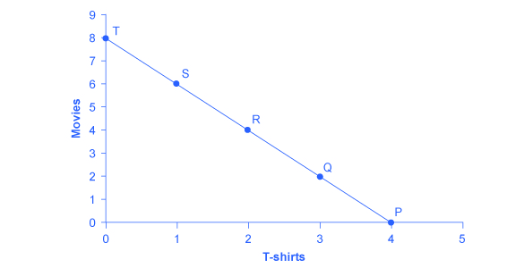

By the end of this section, you will be able to:

* Calculate total utility
* Propose decisions that maximize utility
* Explain marginal utility and the significance of diminishing marginal utility

Information on the **consumption**{: data-type="term" .no-emphasis} choices of Americans is available from the Consumer Expenditure Survey carried out by the U.S. Bureau of Labor Statistics. [\[link\]](#Table_06_01) shows spending patterns for the average U.S. household. The first row shows income and, after taxes and personal savings are subtracted, it shows that, in 2011, the average U.S. household spent $49,705 on consumption. The table then breaks down consumption into various categories. The average U.S. household spent roughly one-third of its consumption on shelter and other housing expenses, another one-third on food and vehicle expenses, and the rest on a variety of items, as shown. Of course, these patterns will vary for specific households by differing levels of family income, by geography, and by preferences.

<table id="Table_06_01" summary="The table shows the following: Average U.S. household income before taxes = $63,685; average annual expenditure = $49,705; food at home = $3,838 (8%); food away from home = $2,620 (5%); housing = $16,803 (34%); apparel and services $1,740 (4%); transportation = $8,293 (17%); healthcare = $3,313 (7%); entertainment = $2,572 (5%); education = $1,051 (2%); personal insurance and pensions = $5,424 (11%); all else: alcohol, tobacco, reading, personal care, cash contributions, miscellaneous = $4,051 (8%)."><caption>U.S. Consumption Choices in 2011(Source: http://www.bls.gov/cex/csxann11.pdf)</caption><tbody>
<tr>
<td>Average U.S. household income before taxes</td>
<td>$63,685</td>
</tr>

<tr>
<td>Average annual expenditure</td>
<td>$49,705</td>
</tr>

<tr>
<td>Food at home</td>
<td>$3,838 (8%)</td>
</tr>

<tr>
<td>Food away from home</td>
<td>$2,620 (5%)</td>
</tr>

<tr>
<td>Housing</td>
<td>$16,803 (34%)</td>
</tr>

<tr>
<td>Apparel and services</td>
<td>$1,740 (4%)</td>
</tr>

<tr>
<td>Transportation</td>
<td>$8,293 (17%)</td>
</tr>

<tr>
<td>Healthcare</td>
<td>$3,313 (7%)</td>
</tr>

<tr>
<td>Entertainment</td>
<td>$2,572 (5%)</td>
</tr>

<tr>
<td>Education</td>
<td>$1,051 (2%)</td>
</tr>

<tr>
<td>Personal insurance and pensions</td>
<td>$5,424 (11%)</td>
</tr>

<tr>
<td>All else: alcohol, tobacco, reading, personal care, cash contributions, miscellaneous</td>
<td>$4,051 (8%)</td>
</tr>
</tbody></table>

# Total Utility and Diminishing Marginal Utility

To understand how a household will make its choices, economists look at what consumers can afford, as shown in a **budget constraint line**{: data-type="term"}, and the **total utility**{: data-type="term"} or satisfaction derived from those choices. In a budget constraint line, the quantity of one good is measured on the horizontal axis and the quantity of the other good is measured on the vertical axis. The budget constraint line shows the various combinations of two goods that are affordable given consumer income. Consider the situation of José, shown in [\[link\]](#CNX_Econ_C06_001). José likes to collect T-shirts and watch movies.

In [\[link\]](#CNX_Econ_C06_001), the quantity of T-shirts is shown on the horizontal axis, while the quantity of movies is shown on the vertical axis. If José had unlimited income or goods were free, then he could consume without limit. But José, like all of us, faces a **budget constraint**{: data-type="term" .no-emphasis}. José has a total of $56 to spend. The price of T-shirts is $14 and the price of movies is $7. Notice that the vertical intercept of the budget constraint line is at eight movies and zero T-shirts ($56/$7=8). The horizontal intercept of the budget constraint is four, where José spends of all of his money on T-shirts and no movies ($56/14=4). The slope of the budget constraint line is rise/run or –8/4=–2. The specific choices along the budget constraint line show the combinations of T-shirts and movies that are affordable.

 {: #CNX_Econ_C06_001 data-media-type="image/jpeg" data-title="A Choice between Consumption Goods "}

José wishes to choose the combination that will provide him with the greatest **utility**{: data-type="term"}, which is the term economists use to describe a person’s level of satisfaction or happiness with his or her choices.

Let’s begin with an assumption, which will be discussed in more detail later, that José can measure his own utility with something called *utils*. (It is important to note that you cannot make comparisons between the utils of individuals; if one person gets 20 utils from a cup of coffee and another gets 10 utils, this does not mean than the first person gets more enjoyment from the coffee than the other or that they enjoy the coffee twice as much.) [\[link\]](#Table_06_02) shows how José’s utility is connected with his consumption of T-shirts or movies. The first column of the table shows the quantity of T-shirts consumed. The second column shows the total utility, or total amount of satisfaction, that José receives from consuming that number of T-shirts. The most common pattern of total utility, as shown here, is that consuming additional goods leads to greater total utility, but at a decreasing rate. The third column shows **marginal utility**{: data-type="term"}, which is the additional utility provided by one additional unit of consumption. This equation for marginal utility is:

<math xmlns="http://www.w3.org/1998/Math/MathML"><mtable columnspacing="2px" columnalign="right center left"><mtr><mtd><mtext>MU</mtext></mtd><mtd><mo>=</mo></mtd><mtd><mfrac><mtext>change in total utility</mtext><mtext>change in quantity</mtext></mfrac></mtd></mtr></mtable></math>

Notice that marginal utility diminishes as additional units are consumed, which means that each subsequent unit of a good consumed provides less *additional* utility. For example, the first T-shirt José picks is his favorite and it gives him an addition of 22 utils. The fourth T-shirt is just to something to wear when all his other clothes are in the wash and yields only 18 additional utils. This is an example of the law of **diminishing marginal utility**{: data-type="term"}, which holds that the additional utility decreases with each unit added.

The rest of [\[link\]](#Table_06_02) shows the quantity of movies that José attends, and his total and marginal utility from seeing each movie. Total utility follows the expected pattern: it increases as the number of movies seen rises. Marginal utility also follows the expected pattern: each additional movie brings a smaller gain in utility than the previous one. The first movie José attends is the one he wanted to see the most, and thus provides him with the highest level of utility or satisfaction. The fifth movie he attends is just to kill time. Notice that total utility is also the sum of the marginal utilities. Read the following Work It Out feature for instructions on how to calculate total utility.

<table id="Table_06_02" summary="The table has columns quantity, total utility, and marginal utility for t-shirts and movies. The quantity, total utility and marginal utility for t-shirts are as follows. For quantity 1, total utility = 22, marginal utility = 22; for quantity 2, total utility = 43, marginal utility = 21; for quantity 3, total utility = 63, marginal utility = 20; for quantity 4, total utility = 81, marginal utility = 18; for quantity 5, total utility = 97, marginal utility = 16; for quantity 6, total utility = 111, marginal utility = 14; for quantity 7, total utility = 123, marginal utility = 12; for quantity 8, total utility = 133, marginal utility = 10.  The quantity, total utility, and marginal utility for movies are as follows. For quantity 1, total utility = 16, marginal utility = 16; for quantity 2, total utility = 31, marginal utility = 15; for quantity 3, total utility = 45, marginal utility = 14; for quantity 4, total utility = 58, marginal utility = 13; for quantity 5, total utility = 70, marginal utility = 12; for quantity 6, total utility = 81, marginal utility = 11; for quantity 7, total utility = 91, marginal utility = 10; for quantity 8, total utility = 100, marginal utility = 9."><caption>Total and Marginal Utility</caption><thead>
<tr>
<th>T-Shirts (Quantity)</th>
<th>Total Utility</th>
<th>Marginal Utility</th>
<th>Movies (Quantity)</th>
<th>Total Utility</th>
<th>Marginal Utility</th>
</tr>
</thead><tbody>
<tr>
<td><strong>1</strong></td>
<td>22</td>
<td>22</td>
<td><strong>1</strong></td>
<td>16</td>
<td>16</td>
</tr>

<tr>
<td><strong>2</strong></td>
<td>43</td>
<td>21</td>
<td><strong>2</strong></td>
<td>31</td>
<td>15</td>
</tr>

<tr>
<td><strong>3</strong></td>
<td>63</td>
<td>20</td>
<td><strong>3</strong></td>
<td>45</td>
<td>14</td>
</tr>

<tr>
<td><strong>4</strong></td>
<td>81</td>
<td>18</td>
<td><strong>4</strong></td>
<td>58</td>
<td>13</td>
</tr>

<tr>
<td><strong>5</strong></td>
<td>97</td>
<td>16</td>
<td><strong>5</strong></td>
<td>70</td>
<td>12</td>
</tr>

<tr>
<td><strong>6</strong></td>
<td>111</td>
<td>14</td>
<td><strong>6</strong></td>
<td>81</td>
<td>11</td>
</tr>

<tr>
<td><strong>7</strong></td>
<td>123</td>
<td>12</td>
<td><strong>7</strong></td>
<td>91</td>
<td>10</td>
</tr>

<tr>
<td><strong>8</strong></td>
<td>133</td>
<td>10</td>
<td><strong>8</strong></td>
<td>100</td>
<td>9</td>
</tr>

</tbody></table>

[\[link\]](#Table_06_03) looks at each point on the budget constraint in [\[link\]](#CNX_Econ_C06_001), and adds up José’s total utility for five possible combinations of T-shirts and movies.

<table id="Table_06_03" summary="The table has columns labeled Point, T-Shirts, Movies, and Total Utility. For point P, t-shirts = 4, movies =0, total utility = (81 +0 = 81). For point Q, t-shirts = 3, movies = 2, total utility = (63+ 31 = 94). For point R, t-shirts = 2, movies = 4, total utility = (43 + 58 = 101). For point S, t-shirts = 1, movies = 6, total utility = (22 + 81 = 103). For point T, t-shirts = 0, movies = 8, total utility = (0 + 10 = 100)."><caption>Finding the Choice with the Highest Utility</caption><thead>
<tr>
<th>Point</th>
<th>T-Shirts</th>
<th>Movies</th>
<th>Total Utility</th>
</tr>
</thead><tbody>
<tr>
<td>P</td>
<td>4</td>
<td>0</td>
<td>81 + 0 = 81</td>
</tr>

<tr>
<td>Q</td>
<td>3</td>
<td>2</td>
<td>63 + 31 = 94</td>
</tr>

<tr>
<td>R</td>
<td>2</td>
<td>4</td>
<td>43 + 58 = 101</td>
</tr>

<tr>
<td>S</td>
<td>1</td>
<td>6</td>
<td>22 + 81 = 103</td>
</tr>

<tr>
<td>T</td>
<td>0</td>
<td>8</td>
<td>0 + 100 = 100</td>
</tr>

</tbody></table>

Calculating Total Utility

Let’s look at how José makes his decision in more detail.

Step 1. Observe that, at point Q (for example), José consumes three T-shirts and two movies.

Step 2. Look at [\[link\]](#Table_06_02). You can see from the fourth row/second column that three T-shirts are worth 63 utils. Similarly, the second row/fifth column shows that two movies are worth 31 utils.

Step 3. From this information, you can calculate that point Q has a total utility of 94 (63 + 31).

Step 4. You can repeat the same calculations for each point on [\[link\]](#Table_06_03), in which the total utility numbers are shown in the last column.

For José, the highest total utility for all possible combinations of goods occurs at point S, with a total utility of 103 from consuming one T-shirt and six movies.

# Choosing with Marginal Utility

Most people approach their utility-maximizing combination of choices in a step-by-step way. This step-by-step approach is based on looking at the tradeoffs, measured in terms of marginal utility, of consuming less of one good and more of another.

For example, say that José starts off thinking about spending all his money on T-shirts and choosing point P, which corresponds to four T-shirts and no movies, as illustrated in [\[link\]](#CNX_Econ_C06_001). José chooses this starting point randomly; he has to start somewhere. Then he considers giving up the last T-shirt, the one that provides him the least marginal utility, and using the money he saves to buy two movies instead. [\[link\]](#Table_06_04) tracks the step-by-step series of decisions José needs to make (*Key*\: T-shirts are $14, movies are $7, and income is $56). The following Work It Out feature explains how marginal utility can effect decision making.

<table id="Table_06_04" summary="The table has for columns. Column 1 is labeled &#x201C;Try,&#x201D; Column 2 is labeled &#x201C;Which Has,&#x201D; Column 3 is labeled &#x201C;Total Utility,&#x201D; Column 4 is labeled &#x201C;Marginal Gain and Loss of Utility, Compared with Previous Choice,&#x201D; Column 5 is labeled &#x201C;Conclusion.&#x201D; Row 1 shows the following: Column 1 = Choice 1: P. column 2 = 4 t-shirts and 0 movies; column 3 = 81 from 4 &#x2013;t-shirts + 0 from 0 movies = 81; columns 4 and 5 are blank. Row 2 shows column 1 = Choice 2: Q; column 2 = 3 t-shirts and 2 movies; column 3 = 63 from 3 t-shirts + 31 from 0 movies = 94; column 4 = loss of 18 from 1 less t-shirt, but gain of 31 from 2 more movies, for a net utility gain of 13; column 5 = Q is preferred over P. Row 3 shows the following: column 1 = Choice 3: R, column 2 = 2 t-shirts and 4 movies; column 3 = 43 from 2 t-shirts + 58 from 4 movies = 101; column 4 = loss from 1 less t-shirt, but gain of 27 from two more movies for a net utility gain of 7; column 5 = R is preferred over Q. Row 4 shows the following: Choice 4 : S; column 2 = 1 t-shirt and 6 movies; column 3 = 22 from 1 t-shirt + 81 from 6 movies = 1-3; column 4 = loss of 21 from 1 less t-shirt, but gain of 23 from two more movies, for a net utility gain of 2; column 5 = s is preferred over R. Row 5 shows the following: column 1 = Choice 5: T; column 2 = 0 t-shirts and 8 movies; column 3 = 0 from 0 t-shirts + 100 from 8 movies = 100; column 4 = loss of 22 from 1 less t-shirt, but gain of 19 from two more movies, for a net utility loss of 3; column 5 = s is preferred over T."><caption>A Step-by-Step Approach to Maximizing Utility</caption><thead>
  <tr>
    <th>Try</th>
    <th>Which Has</th>
    <th>Total Utility</th>
    <th>Marginal Gain and Loss of Utility, Compared with Previous Choice</th>
    <th>Conclusion</th>
  </tr>
</thead><tbody>  
  <tr>
    <td>Choice 1: P</td>
    <td>4 T-shirts and 0 movies</td>
    <td>81 from 4 T-shirts + 0 from 0 movies = 81</td>
    <td>     –</td>
    <td>     –</td>
  </tr>
  <tr>
    <td>Choice 2: Q</td>
    <td>3 T-shirts and 2 movies</td>
    <td>63 from 3 T-shirts + 31 from 0 movies = 94</td>
    <td>Loss of 18 from 1 less T-shirt, but gain of 31 from 2 more movies, for a net utility gain of 13</td>
    <td>Q is preferred over P</td>
  </tr>
  <tr>
    <td>Choice 3: R</td>
    <td>2 T-shirts and 4 movies</td>
    <td>43 from 2 T-shirts + 58 from 4 movies = 101</td>
    <td>Loss of 20 from 1 less T-shirt, but gain of 27 from two more movies for a net utility gain of 7</td>
    <td>R is preferred over Q</td>
  </tr>
  <tr>
    <td>Choice 4: S</td>
    <td>1 T-shirt and 6 movies</td>
    <td>22 from 1 T-shirt + 81 from 6 movies = 103</td>
    <td>Loss of 21 from 1 less T-shirt, but gain of 23 from two more movies, for a net utility gain of 2</td>
    <td>S is preferred over R</td>
  </tr>
  <tr>
    <td>Choice 5: T</td>
    <td>0 T-shirts and 8 movies</td>
    <td>0 from 0 T-shirts + 100 from 8 movies = 100</td>
    <td>Loss of 22 from 1 less T-shirt, but gain of 19 from two more movies, for a net utility loss of 3</td>
    <td>S is preferred over T</td>
  </tr>
 </tbody></table>

Decision Making by Comparing Marginal Utility

José could use the following thought process (if he thought in utils) to make his decision regarding how many T-shirts and movies to purchase:

Step 1. From [\[link\]](#Table_06_02), José can see that the marginal utility of the fourth T-shirt is 18. If José gives up the fourth T-shirt, then he loses 18 utils.

Step 2. Giving up the fourth T-shirt, however, frees up $14 (the price of a T-shirt), allowing José to buy the first two movies (at $7 each).

Step 3. José knows that the marginal utility of the first movie is 16 and the marginal utility of the second movie is 15. Thus, if José moves from point P to point Q, he gives up 18 utils (from the T-shirt), but gains 31 utils (from the movies).

Step 4. Gaining 31 utils and losing 18 utils is a net gain of 13. This is just another way of saying that the total utility at Q (94 according to the last column in [\[link\]](#Table_06_03)) is 13 more than the total utility at P (81).

Step 5. So, for José, it makes sense to give up the fourth T-shirt in order to buy two movies.

José clearly prefers point Q to point P. Now repeat this step-by-step process of decision making with marginal utilities. José thinks about giving up the third T-shirt and surrendering a marginal utility of 20, in exchange for purchasing two more movies that promise a combined marginal utility of 27. José prefers point R to point Q. What if José thinks about going beyond R to point S? Giving up the second T-shirt means a marginal utility loss of 21, and the marginal utility gain from the fifth and sixth movies would combine to make a marginal utility gain of 23, so José prefers point S to R.

However, if José seeks to go beyond point S to point T, he finds that the loss of marginal utility from giving up the first T-shirt is 22, while the marginal utility gain from the last two movies is only a total of 19. If José were to choose point T, his utility would fall to 100. Through these stages of thinking about marginal tradeoffs, José again concludes that S, with one T-shirt and six movies, is the choice that will provide him with the highest level of total utility. This step-by-step approach will reach the same conclusion regardless of José’s starting point.

Another way to look at this is by focusing on satisfaction per dollar. **Marginal utility per dollar**{: data-type="term"} is the amount of additional utility José receives given the price of the product. For José’s T-shirts and movies, the marginal utility per dollar is shown in [\[link\]](#Table_06_05).

<math xmlns="http://www.w3.org/1998/Math/MathML"><mtable columnspacing="2px" columnalign="right center left"><mtr><mtd><mtext>marginal utility per dollar</mtext></mtd><mtd><mo>=</mo></mtd><mtd><mfrac><mtext>marginal utility</mtext><mtext>price</mtext></mfrac></mtd></mtr></mtable></math>

José’s first purchase will be a movie. Why? Because it gives him the highest marginal utility per dollar and it is affordable. José will continue to purchase the good which gives him the highest marginal utility per dollar until he exhausts the budget. José will keep purchasing movies because they give him a greater “bang or the buck” until the sixth movie is equivalent to a T-shirt purchase. José can afford to purchase that T-shirt. So José will choose to purchase six movies and one T-shirt.

<table id="Table_06_05" summary="The table has 8 columns and 7 rows of data. Column 1 is &#x201C;quantity of t-shirts&#x201D;; Column 2 is &#x201C;total utility&#x201D;; column 3 is &#x201C;marginal utility&#x201D;; column 4 is &#x201C;marginal utility per dollar&#x201D;; column 5 is &#x201C;quantity of movies&#x201D;; column 6 is &#x201C;total utility&#x201D;; column 7 is &#x201C;marginal utility&#x201D;; column 8 is &#x201C;marginal utility per dollar.&#x201D; Column 1 has the following data: 1, 2, 3, 4, 5, 6, 7. Column 2 has the following data: 22, 43, 63, 81, 97, 111, 123. Column 3 has the following data: 22, 21, 20, 18, 16, 14, 12. Column 4 has the following data: (22/$14=1.6); (21/$14=1.5); (20/$14=1.4); (18/$14=1.3); (16/$14=1.1); (14/$14=1); (12/$14=1.2). Column 5 has the following data: 1, 2, 3, 4, 5, 6, 7. Column 6 has the following data: 16, 31, 45, 58, 70, 81, 91. Column 7 has the following data: 16, 15, 14, 13, 12, 11, 10. Column 8 has the following data: (16/$7=2.3); (15/$7=2.14); (14/$7=2); (13/$7=1.9); (12/$7=1.7); (11/$7=1.6); (10/$7=1.4)."><caption>Marginal Utility per Dollar</caption><thead>
<tr>
<th>Quantity of T-Shirts</th>
<th>Total Utility</th>
<th>Marginal Utility</th>
<th>Marginal Utility per Dollar</th>
<th>Quantity of Movies</th>
<th>Total Utility</th>
<th>Marginal Utility</th>
<th>Marginal Utility per Dollar</th>
</tr>
</thead><tbody>
<tr>
<td><strong>1</strong></td>
<td><strong>22</strong></td>
<td><strong>22</strong></td>
<td><strong>  22/$14=1.6</strong></td>
<td>1</td>
<td>16</td>
<td>16</td>
<td>16/$7=2.3</td>
</tr>

<tr>
<td>2</td>
<td>43</td>
<td>21</td>
<td>  21/$14=1.5</td>
<td>2</td>
<td>31</td>
<td>15</td>
<td>15/$7=2.14</td>
</tr>

<tr>
<td>3</td>
<td>63</td>
<td>20</td>
<td>  20/$14=1.4</td>
<td>3</td>
<td>45</td>
<td>14</td>
<td>14/$7=2</td>
</tr>

<tr>
<td>4</td>
<td>81</td>
<td>18</td>
<td>  18/$14=1.3</td>
<td>4</td>
<td>58</td>
<td>13</td>
<td>13/$7=1.9</td>
</tr>

<tr>
<td>5</td>
<td>97</td>
<td>16</td>
<td>  16/$14=1.1</td>
<td>5</td>
<td>70</td>
<td>12</td>
<td>12/$7=1.7</td>
</tr>

<tr>
<td>6</td>
<td>111</td>
<td>14</td>
<td>  14/$14=1</td>
<td><strong>6</strong></td>
<td><strong>81</strong></td>
<td><strong>11</strong></td>
<td><strong>11/$7=1.6</strong></td>
</tr>

<tr>
<td>7</td>
<td>123</td>
<td>12</td>
<td>  12/$14=1.2</td>
<td>7</td>
<td>91</td>
<td>10</td>
<td>10/$7=1.4</td>
</tr>
</tbody></table>

# A Rule for Maximizing Utility

This process of decision making suggests a rule to follow when **maximizing utility**{: data-type="term" .no-emphasis}. Since the price of T-shirts is twice as high as the price of movies, to maximize utility the last T-shirt chosen needs to provide exactly twice the marginal utility (MU) of the last movie. If the last T-shirt provides less than twice the marginal utility of the last movie, then the T-shirt is providing less “bang for the buck” (i.e., marginal utility per dollar spent) than if the same money were spent on movies. If this is so, José should trade the T-shirt for more movies to increase his total utility. Marginal utility per dollar measures the additional utility that José will enjoy given what he has to pay for the good.

If the last T-shirt provides more than twice the marginal utility of the last movie, then the T-shirt is providing more “bang for the buck” or marginal utility per dollar, than if the money were spent on movies. As a result, José should buy more T-shirts. Notice that at José’s optimal choice of point S, the marginal utility from the first T-shirt, of 22 is exactly twice the marginal utility of the sixth movie, which is 11. At this choice, the marginal utility per dollar is the same for both goods. This is a tell-tale signal that José has found the point with highest total utility.

This argument can be written as a general rule: the utility-maximizing choice between consumption goods occurs where the marginal utility per dollar is the same for both goods.

<math xmlns="http://www.w3.org/1998/Math/MathML"><mtable columnspacing="2px" columnalign="right center left"><mtr><mtd><mfrac><msub><mtext>MU</mtext><mn>1</mn></msub><msub><mtext>P</mtext><mn>1</mn></msub></mfrac></mtd><mtd><mo>=</mo></mtd><mtd><mfrac><msub><mtext>MU</mtext><mn>2</mn></msub><msub><mtext>P</mtext><mn>2</mn></msub></mfrac></mtd></mtr></mtable></math>

A sensible economizer will pay twice as much for something only if, in the marginal comparison, the item confers twice as much utility. Notice that the formula for the table above is:

<math xmlns="http://www.w3.org/1998/Math/MathML"><mtable columnspacing="2px" columnalign="right center left"><mtr><mtd><mfrac><mn>22</mn><mtext>$14</mtext></mfrac></mtd><mtd><mo>=</mo></mtd><mtd><mfrac><mn>11</mn><mtext>$7</mtext></mfrac></mtd></mtr><mtr><mtd><mtext>1.6</mtext></mtd><mtd><mo>=</mo></mtd><mtd><mtext>1.6</mtext></mtd></mtr></mtable></math>

The following Work It Out feature provides step by step guidance for this concept of utility-maximizing choices.

Maximizing Utility

The general rule, <math xmlns="http://www.w3.org/1998/Math/MathML"><mtable columnspacing="2px" columnalign="right center left"><mtr><mtd><mfrac><msub><mtext>MU</mtext><mn>1</mn></msub><msub><mtext>P</mtext><mn>1</mn></msub></mfrac></mtd><mtd><mo>=</mo></mtd><mtd><mfrac><msub><mtext>MU</mtext><mn>2</mn></msub><msub><mtext>P</mtext><mn>2</mn></msub></mfrac></mtd></mtr></mtable></math>

, means that the last dollar spent on each good provides exactly the same marginal utility. So:

Step 1. If we traded a dollar more of movies for a dollar more of T-shirts, the marginal utility gained from T-shirts would exactly offset the marginal utility lost from fewer movies. In other words, the net gain would be zero.

Step 2. Products, however, usually cost more than a dollar, so we cannot trade a dollar’s worth of movies. The best we can do is trade two movies for another T-shirt, since in this example T-shirts cost twice what a movie does.

Step 3. If we trade two movies for one T-shirt, we would end up at point R (two T-shirts and four movies).

Step 4. Choice 4 in [\[link\]](#Table_06_04) shows that if we move to point S, we would lose 21 utils from one less T-shirt, but gain 23 utils from two more movies, so we would end up with more total utility at point S.

In short, the general rule shows us the utility-maximizing choice.

There is another, equivalent way to think about this. The general rule can also be expressed as *the ratio of the prices of the two goods should be equal to the ratio of the marginal utilities.* When the price of good 1 is divided by the price of good 2, at the utility-maximizing point this will equal the marginal utility of good 1 divided by the marginal utility of good 2. This rule, known as the **consumer equilibrium**{: data-type="term"}, can be written in algebraic form:

<math xmlns="http://www.w3.org/1998/Math/MathML"><mtable columnspacing="2px" columnalign="right center left"><mtr><mtd><mfrac><msub><mtext>P</mtext><mn>1</mn></msub><msub><mtext>P</mtext><mn>2</mn></msub></mfrac></mtd><mtd><mo>=</mo></mtd><mtd><mfrac><msub><mtext>MU</mtext><mn>1</mn></msub><msub><mtext>MU</mtext><mn>2</mn></msub></mfrac></mtd></mtr></mtable></math>

Along the budget constraint, the total price of the two goods remains the same, so the ratio of the prices does not change. However, the marginal utility of the two goods changes with the quantities consumed. At the optimal choice of one T-shirt and six movies, point S, the ratio of marginal utility to price for T-shirts (22:14) matches the ratio of marginal utility to price for movies (of 11:7).

# Measuring Utility with Numbers

This discussion of utility started off with an assumption that it is possible to place numerical values on utility, an assumption that may seem questionable. You can buy a thermometer for measuring temperature at the hardware store, but what store sells an “utilimometer” for measuring utility? However, while measuring utility with numbers is a convenient assumption to clarify the explanation, the key assumption is not that utility can be measured by an outside party, but only that individuals can decide which of two alternatives they prefer.

To understand this point, think back to the step-by-step process of finding the choice with highest total utility by comparing the marginal utility that is gained and lost from different choices along the budget constraint. As José compares each choice along his budget constraint to the previous choice, what matters is not the specific numbers that he places on his utility—or whether he uses any numbers at all—but only that he personally can identify which choices he prefers.

In this way, the step-by-step process of choosing the highest level of utility resembles rather closely how many people make consumption decisions. We think about what will make us the happiest; we think about what things cost; we think about buying a little more of one item and giving up a little of something else; we choose what provides us with the greatest level of satisfaction. The vocabulary of comparing the points along a budget constraint and total and marginal utility is just a set of tools for discussing this everyday process in a clear and specific manner. It is welcome news that specific utility numbers are not central to the argument, since a good utilimometer is hard to find. Do not worry—while we cannot measure utils, by the end of the next module, we will have transformed our analysis into something we can measure—demand.

# Key Concepts and Summary

Economic analysis of household behavior is based on the assumption that people seek the highest level of utility or satisfaction. Individuals are the only judge of their own utility. In general, greater consumption of a good brings higher total utility. However, the additional utility received from each unit of greater consumption tends to decline in a pattern of diminishing marginal utility.

The utility-maximizing choice on a consumption budget constraint can be found in several ways. You can add up total utility of each choice on the budget line and choose the highest total. You can choose a starting point at random and compare the marginal utility gains and losses of moving to neighboring points—and thus eventually seek out the preferred choice. Alternatively, you can compare the ratio of the marginal utility to price of good 1 with the marginal utility to price of good 2 and apply the rule that at the optimal choice, the two ratios should be equal:

<math xmlns="http://www.w3.org/1998/Math/MathML"><mtable columnspacing="2px" columnalign="right center left"><mtr><mtd><mfrac><msub><mtext>MU</mtext><mn>1</mn></msub><msub><mtext>P</mtext><mn>1</mn></msub></mfrac></mtd><mtd><mo>=</mo></mtd><mtd><mfrac><msub><mtext>MU</mtext><mn>2</mn></msub><msub><mtext>P</mtext><mn>2</mn></msub></mfrac></mtd></mtr></mtable></math>

# Self-Check Questions

Jeremy is deeply in love with Jasmine. Jasmine lives where cell phone coverage is poor, so he can either call her on the land-line phone for five cents per minute or he can drive to see her, at a round-trip cost of $2 in gasoline money. He has a total of $10 per week to spend on staying in touch. To make his preferred choice, Jeremy uses a handy utilimometer that measures his total utility from personal visits and from phone minutes. Using the values given in [[link]](#Table_06_06), figure out the points on Jeremy’s consumption choice budget constraint (it may be helpful to do a sketch) and identify his utility-maximizing point.

<table id="Table_06_06" summary="The table has four columns labeled &#x201C;round trips,&#x201D; &#x201C;total utility,&#x201D; phone minutes,&#x201D; and &#x201C;total utility.&#x201D; The first two columns represent the total utility for round trips in the car. 0 round trips = 0 total utility; 1 round trip = 80 total utility; 2 round trips = 150 total utility; 3 = 210; 4 = 260; 5 = 300; 6 = 330; 7 = 200; 8 = 180; 9 = 160; 10 = 140. The last two columns represent the total utility for phone minutes. 0 phone minutes = 0 total utility; 20 phone minutes = 200 total utility; 40 phone minutes = 280 total utility; 60 = 540; 80 = 680; 100 = 800; 120 = 900; 140 = 980; 160 = 1040; 180 = 1080; 200 = 1100."><caption /><thead>
<tr>
<th>Round Trips</th>
<th>Total Utility</th>
<th>Phone Minutes</th>
<th>Total Utility</th>
</tr>
</thead><tbody>
<tr>
<td>0</td>
<td>   0</td>
<td>   0</td>
<td>     0</td>
</tr>

<tr>
<td>1</td>
<td> 80</td>
<td>  20</td>
<td>  200</td>
</tr>

<tr>
<td>2</td>
<td>150</td>
<td>  40</td>
<td>  380</td>
</tr>

<tr>
<td>3</td>
<td>210</td>
<td>  60</td>
<td>  540</td>
</tr>

<tr>
<td>4</td>
<td>260</td>
<td>  80</td>
<td>  680</td>
</tr>

<tr>
<td>5</td>
<td>300</td>
<td>100</td>
<td>  800</td>
</tr>

<tr>
<td>6</td>
<td>330</td>
<td>120</td>
<td>  900</td>
</tr>

<tr>
<td>7</td>
<td>200</td>
<td>140</td>
<td>  980</td>
</tr>

<tr>
<td>8</td>
<td>180</td>
<td>160</td>
<td>1040</td>
</tr>

<tr>
<td>9</td>
<td>160</td>
<td>180</td>
<td>1080</td>
</tr>

<tr>
<td>10</td>
<td>140</td>
<td>200</td>
<td>1100</td>
</tr>
</tbody></table>

The rows of the table in the problem do not represent the actual choices available on the budget set; that is, the combinations of round trips and phone minutes that Jeremy can afford with his budget. One of the choices listed in the problem, the six round trips, is not even available on the budget set. If Jeremy has only $10 to spend and a round trip costs $2 and phone calls cost $0.05 per minute, he could spend his entire budget on five round trips but no phone calls or 200 minutes of phone calls, but no round trips or any combination of the two in between. It is easy to see all of his budget options with a little algebra. The equation for a budget line is:

<math xmlns="http://www.w3.org/1998/Math/MathML"><mtable columnspacing="2px" columnalign="right center left"><mtr><mtd><mtext>Budget</mtext></mtd><mtd><mo>=</mo></mtd><mtd><msub><mtext>P</mtext><mi>RT</mi></msub></mtd></mtr></mtable><mo>×</mo><mo> </mo><msub><mtext>Q</mtext><mi>RT</mi></msub><mo> </mo><mo>+</mo><mo> </mo><msub><mtext>P</mtext><mi>PC</mi></msub><mo> </mo><mo>×</mo><mo> </mo><msub><mtext>Q</mtext><mi>PC</mi></msub></math>

where P and Q are price and quantity of round trips (RT) and phone calls (PC) (per minute). In Jeremy’s case the equation for the budget line is:

<math xmlns="http://www.w3.org/1998/Math/MathML"><mtable columnspacing="2px" columnalign="right center left"><mtr><mtd><mtext>$10</mtext></mtd><mtd><mo>=</mo></mtd><mtd><mtext>$2 </mtext><mo>×</mo><msub><mtext> Q</mtext><mtext>RT</mtext></msub><mtext> </mtext><mo>+</mo><mtext> $.05 </mtext><mo>×</mo><msub><mtext> Q</mtext><mtext>PC</mtext></msub></mtd></mtr><mtr><mtd><mfrac><mtext>$10</mtext><mtext>$.05</mtext></mfrac></mtd><mtd><mo>=</mo></mtd><mtd><mfrac><mrow><msub><mtext>$2Q</mtext><mtext>RT</mtext></msub><mtext> </mtext><mo>+</mo><msub><mtext>  $.05Q</mtext><mtext>PC</mtext></msub><mo> </mo></mrow><mtext>$.05</mtext></mfrac></mtd></mtr><mtr><mtd><mtext>200</mtext></mtd><mtd><mo>=</mo></mtd><mtd><msub><mtext>40Q</mtext><mtext>RT</mtext></msub><mtext> </mtext><mo>+</mo><msub><mtext> Q</mtext><mtext>PC</mtext></msub></mtd></mtr><mtr><mtd><msub><mtext>Q</mtext><mtext>PC</mtext></msub></mtd><mtd><mo>=</mo></mtd><mtd><mtext>200 </mtext><mo>-</mo><msub><mtext> 40Q</mtext><mtext>RT</mtext></msub></mtd></mtr></mtable></math>

If we choose zero through five round trips (column 1), the table below shows how many phone minutes can be afforded with the budget (column 3). The total utility figures are given in the table below.

| Round Trips | Total Utility for Trips | Phone Minutes | Total Utility for Minutes | Total Utility |
|----------
| 0 |     0 | 200 | 1100 | 1100 |
| 1 |   80 | 160 | 1040 | 1120 |
| 2 | 150 | 120 |   900 | 1050 |
| 3 | 210 |   80 |   680 |   890 |
| 4 | 260 |   40 |   380 |   640 |
| 5 | 300 |     0 |       0 |   300 |
{: #Table_06_07 summary="The table has 5 columns labeled &#x201C;round trips,&#x201D; &#x201C;total utility for trips,&#x201D; &#x201C;phone minutes,&#x201D; &#x201C;total utility for minutes,&#x201D; &#x201C;total utility.&#x201D; Row 1 shows the following: 0 (column 1); 0 (column 2); 200 (column 3); 1100 (column 4). Row 2 shows  the following: 1 (column 1); 80 (column 2); 160 (column 3); 1040 (column 4); 1120 (column 5). Row 3 shows the following: 2 (column 1); 150 (column 2) 120 (column 3); 900 (column 4); 1050 (column 5). Row 4 shows the following: 3 (column 1); 210 (column 2); 80 (column 3); 680 (column 4); 890 (column 5). Row 5 shows the following: 4 (column 1); 260 (column 2); 40 (column 3) 380 (column 4); 640 (column 5). Row 6 shows the following: 5 (column 1); 300 (column 2); 0 (column 3); 0 (column 4); 300 (column 5)."}

Adding up total utility for round trips and phone minutes at different points on the budget line gives total utility at each point on the budget line. The highest possible utility is at the combination of one trip and 160 minutes of phone time, with a total utility of 1120.

Take Jeremy’s total utility information in [[link]](#fs-idp54001568), and use the marginal utility approach to confirm the choice of phone minutes and round trips that maximize Jeremy’s utility.

The first step is to use the total utility figures, shown in the table below, to calculate marginal utility, remembering that marginal utility is equal to the change in total utility divided by the change in trips or minutes.

| Round Trips | Total Utility | Marginal Utility (per trip) | Phone Minutes | Total Utility | Marginal Utility (per minute) |
|----------
| 0 |     0 | - | 200 | 1100 | - |
| 1 |   80 | 80 | 160 | 1040 |   60/40 = 1.5 |
| 2 | 150 | 70 | 120 | 900 | 140/40 = 3.5 |
| 3 | 210 | 60 |   80 | 680 | 220/40 = 5.5 |
| 4 | 260 | 50 |   40 | 380 | 300/40 = 7.5 |
| 5 | 300 | 40 |     0 |     0 | 380/40 = 9.5 |
{: #Table_06_08 summary="The table has 6 columns labeled &#x201C;round trips,&#x201D; &#x201C;total utility,&#x201D; &#x201C;marginal utility (per trip),&#x201D; &#x201C;phone minutes,&#x201D; &#x201C;total utility,&#x201D; &#x201C;Marginal utility (per minute).&#x201D; Row 1 shows the following: 0 (column 1); 0 (column 2); - (column 3); 200 (column 4); 1100 (column 5); - (column 6). Row 2 shows  the following: 1 (column 1); 80 (column 2); 80 (column 3); 160 (column 4); 1040 (column 5); 60/40 = 1.5 (column 6). Row 3 shows the following: 2 (column 1); 150 (column 2) 70 (column 3); 120 (column 4); 900 (column 5); 140/40=3.5 (column 6). Row 4 shows the following: 3 (column 1); 210 (column 2); 60 (column 3); 80 (column 4); 680 (column 5); 220/40=5.5 (column 6). Row 5 shows the following: 4 (column 1); 260 (column 2); 50 (column 3) 40 (column 4); 380 (column 5); 300/40=7.5 (column 6). Row 6 shows the following: 5 (column 1); 300 (column 2); 40 (column 3); 0 (column 4); 0 (column 5); 380/40=9.5 (column 6)."}

Note that we cannot directly compare marginal utilities, since the units are trips versus phone minutes. We need a common denominator for comparison, which is price. Dividing MU by the price, yields columns 4 and 8 in the table below.

| Round Trips | Total Utility | Marginal Utility (per trip) | MU/P | Phone Minutes | Total Utility | Marginal utility (per minute) | MU/P |
|----------
| 0 | 0 | - | - | 200 | 1100 | 60/40 = 1.5 | 1.5/$0.05 = 30 |
| 1 |   80 | 80 | 80/$2 = 40 | 160 | 1040 | 140/40 = 3.5 | 3.5/$0.05 = 70 |
| 2 | 150 | 70 | 70/$2 = 35 | 120 |   900 | 220/40 = 5.5 | 5.5/$0.05 = 110 |
| 3 | 210 | 60 | 60/$2 = 30 |   80 |   680 | 300/40 =7.5 | 7.5/$0.05 = 150 |
| 4 | 260 | 50 | 50/$2 = 25 |   40 |   380 | 380/40 = 9.5 | 9.5/$0.05 = 190 |
| 5 | 300 | 40 | 40/$2 = 20 |    0 |      0 | - | - |
{: #Table_06_09 summary="The table has 8 columns labeled &#x201C;round trips,&#x201D; &#x201C;total utility,&#x201D; &#x201C;marginal utility (per trip),&#x201D; &#x201C;MU/P,&#x201D; &#x201C;phone minutes,&#x201D; &#x201C;total utility,&#x201D; &#x201C;Marginal utility (per minute),&#x201D; &#x201C;MU/P.&#x201D; Row 1 shows the following: 0 (column 1); 0 (column 2); - (column 3); - (column 4); 200 (column 5); 1100 (column 6); 60/40=1.5 (column 7); 1.5/$0.05=30 (column 8). Row 2 shows  the following: 1 (column 1); 80 (column 2); 80 (column 3); 80/$2=40 (column 4); 160 (column 5); 1040 (column 6); 140/40=3.5 (column 7); 3.5/$0.05=70 (column 8). Row 3 shows the following: 2 (column 1); 150 (column 2) 70 (column 3); 70/$2=35 (column 4); 120 (column 5); 900 (column 6); 220/40=5.5 (column 7); 5.5/$0.05=110 (column 8). Row 4 shows the following: 3 (column 1); 210 (column 2); 60 (column 3); 60/$2=30 (column 4); 80 (column 5); 680 (column 6); 300/40=7.5 (column 7); 7.5/$0.05=150 (column 8). Row 5 shows the following: 4 (column 1); 260 (column 2); 50 (column 3) 50/$2=25 (column 4); 40 (column 5); 380 (column 6); 380/40=9.5 (column 7); 9.5/$0.05=190 (column 8). Row 6 shows the following: 5 (column 1); 300 (column 2); 40 (column 3); 40/$2=20 (column 4); 0 (column 5); 0 (column 6); - (column 7); - (column 8)."}

Start at the bottom of the table where the combination of round trips and phone minutes is (5, 0). This starting point is arbitrary, but the numbers in this example work best starting from the bottom. Suppose we consider moving to the next point up. At (4, 40), the marginal utility per dollar spent on a round trip is 25. The marginal utility per dollar spent on phone minutes is 190.

Since 25 &lt; 190, we are getting much more utility per dollar spent on phone minutes, so let’s choose more of those. At (3, 80), MU/PRT is 30 &lt; 150 (the MU/PM), but notice that the difference is narrowing. We keep trading round trips for phone minutes until we get to (1, 160), which is the best we can do. The MU/P comparison is as close as it is going to get (40 vs. 70). Often in the real world, it is not possible to get MU/P exactly equal for both products, so you get as close as you can.

# Review Questions

Who determines how much utility an individual will receive from consuming a good?

Would you expect total utility to rise or fall with additional consumption of a good? Why?

Would you expect marginal utility to rise or fall with additional consumption of a good? Why?

Is it possible for total utility to increase while marginal utility diminishes? Explain.

If people do not have a complete mental picture of total utility for every level of consumption, how can they find their utility-maximizing consumption choice?

What is the rule relating the ratio of marginal utility to prices of two goods at the optimal choice? Explain why, if this rule does not hold, the choice cannot be utility-maximizing.

# Critical Thinking Questions

Think back to a purchase that you made recently. How would you describe your thinking before you made that purchase?

The rules of politics are not always the same as the rules of economics. In discussions of setting budgets for government agencies, there is a strategy called “closing the Washington monument.” When an agency faces the unwelcome prospect of a budget cut, it may decide to close a high-visibility attraction enjoyed by many people (like the Washington monument). Explain in terms of diminishing marginal utility why the Washington monument strategy is so misleading. (*Consider:* If you are really trying to make the best of a budget cut, should you cut the items in your budget with the highest marginal utility or the lowest marginal utility? Does the Washington monument strategy cut the items with the highest marginal utility or the lowest marginal utility?)

# Problems

Praxilla, who lived in ancient Greece, derives utility from reading poems and from eating cucumbers. Praxilla gets 30 units of marginal utility from her first poem, 27 units of marginal utility from her second poem, 24 units of marginal utility from her third poem, and so on, with marginal utility declining by three units for each additional poem. Praxilla gets six units of marginal utility for each of her first three cucumbers consumed, five units of marginal utility for each of her next three cucumbers consumed, four units of marginal utility for each of the following three cucumbers consumed, and so on, with marginal utility declining by one for every three cucumbers consumed. A poem costs three bronze coins but a cucumber costs only one bronze coin. Praxilla has 18 bronze coins. Sketch Praxilla’s budget set between poems and cucumbers, placing poems on the vertical axis and cucumbers on the horizontal axis. Start off with the choice of zero poems and 18 cucumbers, and calculate the changes in marginal utility of moving along the budget line to the next choice of one poem and 15 cucumbers. Using this step-by-step process based on marginal utility, create a table and identify Praxilla’s utility-maximizing choice. Compare the marginal utility of the two goods and the relative prices at the optimal choice to see if the expected relationship holds. (*Hint*: Label the table columns: 1) Choice, 2) Marginal Gain from More Poems, 3) Marginal Loss from Fewer Cucumbers, 4) Overall Gain or Loss, 5) Is the previous choice optimal? Label the table rows: 1) 0 Poems and 18 Cucumbers, 2) 1 Poem and 15 Cucumbers, 3) 2 Poems and 12 Cucumbers, 4) 3 Poems and 9 Cucumbers, 5) 4 Poems and 6 Cucumbers, 6) 5 Poems and 3 Cucumbers, 7) 6 Poems and 0 Cucumbers.)

# References

Bureau of Labor Statistics. “Consumer Expenditures in 2011.” Accessed December 5, 2013. http://www.bls.gov/cex/csxann11.pdf.

