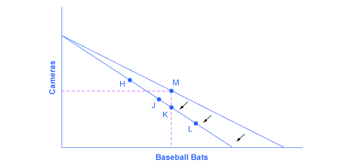

By the end of this section, you will be able to:

* Explain how income, prices, and preferences affect consumer choices
* Contrast the substitution effect and the income effect
* Utilize concepts of demand to analyze consumer choices
* Apply utility-maximizing choices to governments and businesses

Just as utility and marginal utility can be used to discuss making consumer choices along a budget constraint, these ideas can also be used to think about how consumer choices change when the budget constraint shifts in response to changes in income or price. Indeed, because the budget constraint framework can be used to analyze how quantities demanded change because of price movements, the budget constraint model can illustrate the underlying logic behind demand curves.

# How Changes in Income Affect Consumer Choices

Let’s begin with a concrete example illustrating how changes in income level affect consumer choices. [\[link\]](#CNX_Econ_C06_002) shows a **budget constraint**{: data-type="term" .no-emphasis} that represents Kimberly’s choice between concert tickets at $50 each and getting away overnight to a bed-and-breakfast for $200 per night. Kimberly has $1,000 per year to spend between these two choices. After thinking about her total utility and marginal utility and applying the decision rule that the ratio of the marginal utilities to the prices should be equal between the two products, Kimberly chooses point M, with eight concerts and three overnight getaways as her utility-maximizing choice.

 {: #CNX_Econ_C06_002 data-title="How a Change in Income Affects Consumption Choices "}

Now, assume that the income Kimberly has to spend on these two items rises to $2,000 per year, causing her budget constraint to shift out to the right. How does this rise in income alter her utility-maximizing choice? Kimberly will again consider the utility and marginal utility that she receives from concert tickets and overnight getaways and seek her **utility-maximizing choice**{: data-type="term" .no-emphasis} on the new budget line. But how will her new choice relate to her original choice?

The possible choices along the new budget constraint can be divided into three groups, which are divided up by the dashed horizontal and vertical lines that pass through the original choice M in the figure. All choices on the upper left of the new budget constraint that are to the left of the vertical dashed line, like choice P with two overnight stays and 32 concert tickets, involve less of the good on the horizontal axis but much more of the good on the vertical axis. All choices to the right of the vertical dashed line and above the horizontal dashed line—like choice N with five overnight getaways and 20 concert tickets—have more consumption of both goods. Finally, all choices that are to the right of the vertical dashed line but below the horizontal dashed line, like choice Q with four concerts and nine overnight getaways, involve less of the good on the vertical axis but much more of the good on the horizontal axis.

All of these choices are theoretically possible, depending on Kimberly’s personal preferences as expressed through the total and marginal utility she would receive from consuming these two goods. When income rises, the most common reaction is to purchase more of both goods, like choice N, which is to the upper right relative to Kimberly’s original choice M, although exactly how much more of each good will vary according to personal taste. Conversely, when income falls, the most typical reaction is to purchase less of both goods. As defined in the chapter on [Demand and Supply](/m48628) and again in the chapter on [Elasticity](/m48611){: .target-chapter}, goods and services are called **normal goods**{: data-type="term" .no-emphasis} when a rise in income leads to a rise in the quantity consumed of that good and a fall in income leads to a fall in quantity consumed.

However, depending on Kimberly’s preferences, a rise in income could cause consumption of one good to increase while consumption of the other good declines. A choice like P means that a rise in income caused her quantity consumed of overnight stays to decline, while a choice like Q would mean that a rise in income caused her quantity of concerts to decline. Goods where demand declines as income rises (or conversely, where the demand rises as income falls) are called “inferior goods.” An **inferior good**{: data-type="term" .no-emphasis} occurs when people trim back on a good as income rises, because they can now afford the more expensive choices that they prefer. For example, a higher-income household might eat fewer hamburgers or be less likely to buy a used car, and instead eat more steak and buy a new car.

# How Price Changes Affect Consumer Choices

For analyzing the possible effect of a change in price on consumption, let’s again use a concrete example. [\[link\]](#CNX_Econ_C06_003) represents the consumer choice of Sergei, who chooses between purchasing baseball bats and cameras. A price increase for baseball bats would have no effect on the ability to purchase cameras, but it would reduce the number of bats Sergei could afford to buy. Thus a price increase for baseball bats, the good on the horizontal axis, causes the budget constraint to rotate inward, as if on a hinge, from the vertical axis. As in the previous section, the point labeled M represents the originally preferred point on the original budget constraint, which Sergei has chosen after contemplating his total utility and marginal utility and the tradeoffs involved along the budget constraint. In this example, the units along the horizontal and vertical axes are not numbered, so the discussion must focus on whether more or less of certain goods will be consumed, not on numerical amounts.

 {: #CNX_Econ_C06_003 data-title="How a Change in Price Affects Consumption Choices "}

After the price increase, Sergei will make a choice along the new budget constraint. Again, his choices can be divided into three segments by the dashed vertical and horizontal lines. In the upper left portion of the new budget constraint, at a choice like H, Sergei consumes more cameras and fewer bats. In the central portion of the new budget constraint, at a choice like J, he consumes less of both goods. At the right-hand end, at a choice like L, he consumes more bats but fewer cameras.

The typical response to higher prices is that a person chooses to consume less of the product with the higher price. This occurs for two reasons, and both effects can occur simultaneously. The **substitution effect**{: data-type="term"} occurs when a price changes and consumers have an incentive to consume less of the good with a relatively higher price and more of the good with a relatively lower price. The **income effect**{: data-type="term"} is that a higher price means, in effect, the buying power of income has been reduced (even though actual income has not changed), which leads to buying less of the good (when the good is normal). In this example, the higher price for baseball bats would cause Sergei to buy a fewer bats for both reasons. Exactly how much will a higher price for bats cause Sergei consumption of bats to fall? [\[link\]](#CNX_Econ_C06_003) suggests a range of possibilities. Sergei might react to a higher price for baseball bats by purchasing the same quantity of bats, but cutting his consumption of cameras. This choice is the point K on the new budget constraint, straight below the original choice M. Alternatively, Sergei might react by dramatically reducing his purchases of bats and instead buy more cameras.

The key is that it would be imprudent to assume that a change in the price of baseball bats will only or primarily affect the good whose price is changed, while the quantity consumed of other goods remains the same. Since Sergei purchases all his products out of the same budget, a change in the price of one good can also have a range of effects, either positive or negative, on the quantity consumed of other goods.

In short, a higher price typically causes reduced consumption of the good in question, but it can affect the consumption of other goods as well.

Read this [article][1] about the potential of variable prices in vending machines.

  

# The Foundations of Demand Curves

Changes in the price of a good lead the budget constraint to shift. A shift in the budget constraint means that when individuals are seeking their highest utility, the quantity that is demanded of that good will change. In this way, the logical foundations of demand curves—which show a connection between prices and quantity demanded—are based on the underlying idea of individuals seeking utility. [\[link\]](#CNX_Econ_C06_004) (a) shows a budget constraint with a choice between housing and “everything else.” (Putting “everything else” on the vertical axis can be a useful approach in some cases, especially when the focus of the analysis is on one particular good.) The preferred choice on the original budget constraint that provides the highest possible utility is labeled M0. The other three budget constraints represent successively higher prices for housing of P1, P2, and P3. As the budget constraint rotates in, and in, and in again, the utility-maximizing choices are labeled M1, M2, and M3, and the quantity demanded of housing falls from Q0 to Q1 to Q2 to Q3.

  As the price increases from P0 to P1 to P2 to P3, the budget constraint on the upper part of the diagram shifts to the left. The utility-maximizing choice changes from M0 to M1 to M2 to M3. As a result, the quantity demanded of housing shifts from Q0 to Q1 to Q2 to Q3, ceteris paribus. (b) The demand curve graphs each combination of the price of housing and the quantity of housing demanded, ceteris paribus. Indeed, the quantities of housing are the same at the points on both (a) and (b). Thus, the original price of housing (P0) and the original quantity of housing (Q0) appear on the demand curve as point E0. The higher price of housing (P1) and the corresponding lower quantity demanded of housing (Q1) appear on the demand curve as point E1."){: #CNX_Econ_C06_004 data-title="The Foundations of a Demand Curve: An Example of Housing "}

So, as the price of housing rises, the budget constraint shifts to the left, and the quantity consumed of housing falls, *ceteris paribus* (meaning, with all other things being the same). This relationship—the price of housing rising from P0 to P1 to P2 to P3, while the quantity of housing demanded falls from Q0 to Q1 to Q2 to Q3—is graphed on the demand curve in [\[link\]](#CNX_Econ_C06_004) (b). Indeed, the vertical dashed lines stretching between the top and bottom of [\[link\]](#CNX_Econ_C06_004) show that the quantity of housing demanded at each point is the same in both (a) and (b). The shape of a demand curve is ultimately determined by the underlying choices about maximizing utility subject to a budget constraint. And while economists may not be able to measure “utils,” they can certainly measure price and quantity demanded.

# Applications in Government and Business 

The budget constraint framework for making utility-maximizing choices offers a reminder that people can react to a change in price or income in a range of different ways. For example, in the winter months of 2005, costs for heating homes increased significantly in many parts of the country as prices for natural gas and electricity soared, due in large part to the disruption caused by Hurricanes Katrina and Rita. Some people reacted by reducing the quantity demanded of energy; for example, by turning down the thermostats in their homes by a few degrees and wearing a heavier sweater inside. Even so, many home heating bills rose, so people adjusted their consumption in other ways, too. As you learned in the chapter on [Elasticity](/m48611){: .target-chapter}, the short run demand for home heating is generally inelastic. Each household cut back on what it valued least on the margin; for some it might have been some dinners out, or a vacation, or postponing buying a new refrigerator or a new car. Indeed, sharply higher energy prices can have effects beyond the energy market, leading to a widespread reduction in purchasing throughout the rest of the economy.

A similar issue arises when the government imposes taxes on certain products, like it does on gasoline, cigarettes, and alcohol. Say that a tax on alcohol leads to a higher price at the liquor store, the higher price of alcohol causes the budget constraint to pivot left, and consumption of alcoholic beverages is likely to decrease. However, people may also react to the higher price of alcoholic beverages by cutting back on other purchases. For example, they might cut back on snacks at restaurants like chicken wings and nachos. It would be unwise to assume that the liquor industry is the only one affected by the tax on alcoholic beverages. Read the next Clear It Up to learn about how buying decisions are influenced by who controls the household income.

Does who controls household income make a difference?

In the mid-1970s, the United Kingdom made an interesting policy change in its “child allowance” policy. This program provides a fixed amount of money per child to every family, regardless of family income. Traditionally, the child allowance had been distributed to families by withholding less in taxes from the paycheck of the family wage earner—typically the father in this time period. The new policy instead provided the child allowance as a cash payment to the mother. As a result of this change, households have the same level of income and face the same prices in the market, but the money is more likely to be in the purse of the mother than in the wallet of the father.

Should this change in policy alter household consumption patterns? Basic models of consumption decisions, of the sort examined in this chapter, assume that it does not matter whether the mother or the father receives the money, because both parents seek to maximize the utility of the family as a whole. In effect, this model assumes that everyone in the family has the same preferences.

In reality, the share of income controlled by the father or the mother does affect what the household consumes. When the mother controls a larger share of family income a number of studies, in the United Kingdom and in a wide variety of other countries, have found that the family tends to spend more on restaurant meals, child care, and women’s clothing, and less on alcohol and tobacco. As the mother controls a larger share of household resources, children’s health improves, too. These findings suggest that when providing assistance to poor families, in high-income countries and low-income countries alike, the monetary amount of assistance is not all that matters: it also matters which member of the family actually receives the money.

The budget constraint framework serves as a constant reminder to think about the full range of effects that can arise from changes in income or price, not just effects on the one product that might seem most immediately affected.

# Key Concepts and Summary

The budget constraint framework suggest that when income or price changes, a range of responses are possible. When income rises, households will demand a higher quantity of normal goods, but a lower quantity of inferior goods. When the price of a good rises, households will typically demand less of that good—but whether they will demand a much lower quantity or only a slightly lower quantity will depend on personal preferences. Also, a higher price for one good can lead to more or less of the other good being demanded.

# Self-Check Questions

Explain all the reasons why a decrease in the price of a product would lead to an increase in purchases of the product.

This is the opposite of the example explained in the text. A decrease in price has a substitution effect and an income effect. The substitution effect says that because the product is cheaper relative to other things the consumer purchases, he or she will tend to buy more of the product (and less of the other things). The income effect says that after the price decline, the consumer could purchase the same goods as before, and still have money left over to purchase more. For both reasons, a decrease in price causes an increase in quantity demanded.

As a college student you work at a part-time job, but your parents also send you a monthly “allowance.” Suppose one month your parents forgot to send the check. Show graphically how your budget constraint is affected. Assuming you only buy normal goods, what would happen to your purchases of goods?

This is a negative income effect. Because your parents’ check failed to arrive, your monthly income is less than normal and your budget constraint shifts in toward the origin. If you only buy normal goods, the decrease in your income means you will buy less of every product.

# Review Questions

As a general rule, is it safe to assume that a change in the price of a good will always have its most significant impact on the quantity demanded of that good, rather than on the quantity demanded of other goods? Explain.

Why does a change in income cause a parallel shift in the budget constraint?

# Critical Thinking Questions

Income effects depend on the income elasticity of demand for each good that you buy. If one of the goods you buy has a negative income elasticity, that is, it is an inferior good, what must be true of the income elasticity of the other good you buy?

# Problems

If a 10% decrease in the price of one product that you buy causes an 8% increase in quantity demanded of that product, will another 10% decrease in the price cause another 8% increase (no more and no less) in quantity demanded?

[1]: http://openstaxcollege.org/l/vending
