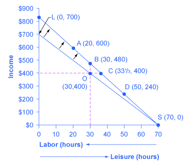
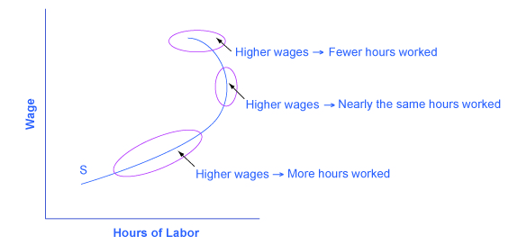

By the end of this section, you will be able to:

* Interpret labor-leisure budget constraint graphs
* Predict consumer choices based on wages and other compensation
* Explain the backward-bending supply curve of labor

People do not obtain utility just from products they purchase. They also obtain utility from leisure time. Leisure time is time not spent at work. The decision-making process of a utility-maximizing household applies to what quantity of hours to work in much the same way that it applies to purchases of goods and services. Choices made along the **labor-leisure budget constraint**{: data-type="term" .no-emphasis}, as wages shift, provide the logical underpinning for the labor supply curve. The discussion also offers some insights about the range of possible reactions when people receive higher wages, and specifically about the claim that if people are paid higher wages, they will work a greater quantity of hours—assuming that they have a say in the matter.

According to the Bureau of Labor Statistics, U.S. workers averaged 38.5 hours per week on the job in 2013. This average includes part-time workers; for full-time workers only, the average was 42.5 hours per week. [\[link\]](#Table_06_10) shows that more than half of all workers are on the job 35 to 48 hours per week, but significant proportions work more or less than this amount.

[\[link\]](#Table_06_11) breaks down the average hourly compensation received by private industry workers, including wages and benefits. Wages and salaries are about three-quarters of total compensation received by workers; the rest is in the form of health insurance, vacation pay, and other benefits. The compensation workers receive differs for many reasons, including experience, education, skill, talent, membership in a labor union, and the presence of discrimination against certain groups in the labor market. Issues surrounding the inequality of incomes in a market-oriented economy are explored in the chapters on [Poverty and Economic Inequality](/m48681){: .target-chapter} and [Issues in Labor Markets: Unions, Discrimination, Immigration](/m48689){: .target-chapter}.

<table id="Table_06_10" summary="The table breaks down the number of hours per week most people work, according to the BLS. People who work 1-14 hours per week amount to 6.9 million people and 5.0% of the workforce. People who work 15-34 hours per week amount to 27.6 million people and 20.1% of the workforce. People who work 35-40 hours per week amount to 68.5 million people and 49.9% of the workforce. People who work 41-48 hours per week amount to 11.9 million people and 8.6% of the workforce. People who work 49-59 hours per week amount to 13.3 million people and 9.6% of the workforce. People who work 60 or more hours amount to 9.3 million people and 6.8% of the workforce."><caption>Persons at Work, by Average Hours Worked per Week in 2013 (Total number of workers: 137.7 million)(Source: http://www.bls.gov/news.release/empsit.t18.htm)</caption><thead>
  <tr>
    <th>Hours Worked per Week</th>
    <th>Number of Workers</th>
    <th>Percentage of Workforce</th>
  </tr>
</thead><tbody>
  <tr>
    <td>1–14 hours</td>
    <td>6.9 million</td>
    <td>5.0%</td>
  </tr>
  <tr>
    <td>15–34 hours</td>
    <td>27.6 million</td>
    <td>20.1%</td>
  </tr>
  <tr>
    <td>35–40 hours</td>
    <td>68.5 million</td>
    <td>49.9%</td>
  </tr>
  <tr>
    <td>41–48 hours</td>
    <td>11.9 million</td>
    <td>8.6%</td>
  </tr>
  <tr>
    <td>49–59 hours</td>
    <td>13.3 million</td>
    <td>9.6%</td>
  </tr>
  <tr>
    <td>60 hours and over</td>
    <td>9.3 million</td>
    <td>6.8%</td>
  </tr>
 </tbody></table>

<table id="Table_06_11" summary="The table shows the average hourly compensation and benefits of employees in 2013, according to the BLS. Wages and salaries = $21.50. vacation and holiday pay = $1.72. Sick leave and other leave = $0.45. Bonuses and premium pay = $0.73. employee insurance (mainly health) = $2.81. retirement plans = $1.47. Employer payments to social security = $1.39. Unemployment and worker&#x2019;s compensation insurance = $0.67. Other benefits (Medicare) = $0.35. Total compensation per hour = $31.09."><caption>Hourly Compensation: Wages, Benefits, and Taxes in 2013(Source: http://www.bls.gov/news.release/ecec.nr0.htm)</caption><thead>
  <tr>
    <th>Compensation and Benefits</th>
    <th>Hourly Amount</th>
  </tr>
</thead><tbody>
      <tr>
      <td>Wages and salaries</td>
    <td>$21.50</td>
    </tr>
    <tr>
      <td>Vacation and holiday pay</td>
      <td>$1.72</td>
    </tr>
    <tr>
      <td>Sick leave and other leave</td>
      <td>$0.45</td>
    </tr>
    <tr>
      <td>Bonuses and premium pay</td>
      <td>$0.73</td>
    </tr>
    <tr>
      <td>Employee insurance (mainly health)</td>
      <td>$2.81</td>
    </tr>
    <tr>
      <td>Retirement plans</td>
      <td>$1.47</td>
    </tr>
    <tr>
      <td>Employer payments to Social Security</td>
      <td>$1.39</td>
    </tr>
    <tr>
      <td>Unemployment and worker's compensation insurance</td>
      <td>$0.67</td>
    </tr>
    <tr>
      <td>Other benefits (Medicare)</td>
      <td>$0.35</td>
    </tr>
    <tr>
      <td>
        <strong>Total compensation per hour</strong>
      </td>
      <td>
        <strong>$31.09</strong>
      </td>
    </tr>
    </tbody></table>

# The Labor-Leisure Budget Constraint

How do workers make decisions about the number of hours to work? Again, let’s proceed with a concrete example. The economic logic is precisely the same as in the case of a **consumption choice budget constraint**{: data-type="term" .no-emphasis}, but the labels are different on a labor-leisure budget constraint.

Vivian has 70 hours per week that she could devote either to work or to leisure, and her wage is $10/hour. The lower budget constraint in [\[link\]](#CNX_Econ_C06_005) shows Vivian’s possible choices. The horizontal axis of this diagram measures both leisure and labor, by showing how Vivian’s time is divided between leisure and labor. Hours of leisure are measured from left to right on the horizontal axis, while hours of labor are measured from right to left. Vivian will compare choices along this budget constraint, ranging from 70 hours of leisure and no income at point S to zero hours of leisure and $700 of income at point L. She will choose the point that provides her with the highest total utility. For this example, let’s assume that Vivian’s utility-maximizing choice occurs at O, with 30 hours of leisure, 40 hours of work, and $400 in weekly income.

 {: #CNX_Econ_C06_005 data-media-type="image/jpeg" data-title="How a Rise in Wages Alters the Utility-Maximizing Choice "}

For Vivian to discover the labor-leisure choice that will maximize her utility, she does not have to place numerical values on the total and marginal utility that she would receive from every level of income and leisure. All that really matters is that Vivian can compare, in her own mind, whether she would prefer more leisure or more income, given the tradeoffs she faces. If Vivian can say to herself: “I’d really rather work a little less and have more leisure, even if it means less income,” or “I’d be willing to work more hours to make some extra income,” then as she gradually moves in the direction of her preferences, she will seek out the utility-maximizing choice on her labor-leisure budget constraint.

Now imagine that Vivian’s wage level increases to $12/hour. A higher wage will mean a new budget constraint that tilts up more steeply; conversely, a lower wage would have led to a new budget constraint that was flatter. How will a change in the wage and the corresponding shift in the budget constraint affect Vivian’s decisions about how many hours to work?

Vivian’s choices of quantity of hours to work and income along her new budget constraint can be divided into several categories, using the dashed horizontal and vertical lines in [\[link\]](#CNX_Econ_C06_005) that go through her original choice (O). One set of choices in the upper-left portion of the new budget constraint involves more hours of work (that is, less leisure) and more income, at a point like A with 20 hours of leisure, 50 hours of work, and $600 of income (that is, 50 hours of work multiplied by the new wage of $12 per hour). A second choice would be to work exactly the same 40 hours, and to take the benefits of the higher wage in the form of income that would now be $480, at choice B. A third choice would involve more leisure and the same income at point C (that is, 33-1/3 hours of work multiplied by the new wage of $12 per hour equals $400 of total income). A fourth choice would involve less income and much more leisure at a point like D, with a choice like 50 hours of leisure, 20 hours of work, and $240 in income.

In effect, Vivian can choose whether to receive the benefits of her wage increase in the form of more income, or more leisure, or some mixture of these two. With this range of possibilities, it would be unwise to assume that Vivian (or anyone else) will necessarily react to a wage increase by working substantially more hours. Maybe they will; maybe they will not.

# Applications of Utility Maximizing with the Labor-Leisure Budget Constraint

The theoretical insight that higher wages will sometimes cause an increase in hours worked, sometimes cause hours worked not to change by much, and sometimes cause hours worked to decline, has led to labor supply curves that look like the one in [\[link\]](#CNX_Econ_C06_006). The bottom-left portion of the labor supply curve slopes upward, which reflects the situation of a person who reacts to a higher wage by supplying a greater quantity of labor. The middle, close-to-vertical portion of the labor supply curve reflects the situation of a person who reacts to a higher wage by supplying about the same quantity of labor. The very top portion of the labor supply curve is called a **backward-bending supply curve for labor**{: data-type="term"}, which is the situation of high-wage people who can earn so much that they respond to a still-higher wage by working fewer hours. Read the following Clear It Up feature for more on the number of hours the average person works each year.

 {: #CNX_Econ_C06_006 data-media-type="image/jpeg" data-title="A Backward-Bending Supply Curve of Labor "}

Is America a nation of workaholics?

Americans work a lot. [\[link\]](#Table_06_12) shows average hours worked per year in the United States, Canada, Japan, and several European countries, with most of the data from 2008. To get a perspective on these numbers, someone who works 40 hours per week for 50 weeks per year, with two weeks off, would work 2,000 hours per year. The gap in hours worked is a little astonishing; the 250 to 300 hour gap between how much Americans work and how much Germans or the French work amounts to roughly six to seven weeks less of work per year. Economists who study these international patterns debate the extent to which average Americans and Japanese have a preference for working more than, say, Germans, or whether German workers and employers face particular kinds of taxes and regulations that lead to fewer hours worked. Many countries have laws that regulate the work week and dictate holidays and the standards of “normal” vacation time vary from country to country. It is also interesting to take the amount of time spent working in context; it is estimated that in the late nineteenth century in the United States, the average work week was over 60 hours per week—leaving little to no time for leisure.

<table id="Table_06_12" summary="The table shows the average annual hours actually worked per employed person in various countries. The United States = 1,824. Spain = 1,799. Japan = 1,759. Canada = 1,751. The United Kingdom = 1,669. Sweden = 1,585. German = 1,443. Franc = 1,441."><caption>Average Hours Worked Per Year in Select Countries(Source:  http://stats.oecd.org/Index.aspx?DataSetCode=ANHRS)</caption><thead>
      <tr>
        <th>Country</th>
        <th>Average Annual Hours Actually Worked per Employed Person</th>
      </tr>
    </thead><tbody>
      <tr>
        <td>United States</td>
        <td>1,824</td>
      </tr>
      <tr>
        <td>Spain</td>
        <td>1,799</td>
      </tr>
      <tr>
        <td>Japan</td>
        <td>1,759</td>
      </tr>
      <tr>
        <td>Canada</td>
        <td>1,751</td>
      </tr>
      <tr>
        <td>United Kingdom</td>
        <td>1,669</td>
      </tr>
      <tr>
        <td>Sweden</td>
        <td>1,585</td>
      </tr>
      <tr>
        <td>Germany</td>
        <td>1,443</td>
      </tr>
      <tr>
        <td>France</td>
        <td>1,441</td>
      </tr>
    </tbody></table>

The different responses to a rise in wages—more hours worked, the same hours worked, or fewer hours worked—are patterns exhibited by different groups of workers in the U.S. economy. Many full-time workers have jobs where the number of hours is held relatively fixed, partly by their own choice and partly by their employer’s practices. These workers do not much change their hours worked as wages rise or fall, so their supply curve of labor is inelastic. However, part-time workers and younger workers tend to be more flexible in their hours, and more ready to increase hours worked when wages are high or cut back when wages fall.

The backward-bending supply curve for labor, when workers react to higher wages by working fewer hours and having more income, is not observed often in the short run. However, some well-paid professionals, like dentists or accountants, may react to higher wages by choosing to limit the number of hours, perhaps by taking especially long vacations, or taking every other Friday off. Over a long-term perspective, the backward-bending supply curve for labor is common. Over the last century, Americans have reacted to gradually rising wages by working fewer hours; for example, the length of the average work-week has fallen from about 60 hours per week in 1900 to the present average of less than 40 hours per week.

Recognizing that workers have a range of possible reactions to a change in wages casts some fresh insight on a perennial political debate: the claim that a reduction in income taxes—which would, in effect, allow people to earn more per hour—will encourage people to work more. The leisure-income budget set points out that this connection will not hold true for all workers. Some people, especially part-timers, may react to higher wages by working more. Many will work the same number of hours. Some people, especially those whose incomes are already high, may react to the tax cut by working *fewer* hours. Of course, cutting taxes may be a good or a bad idea for a variety of reasons, not just because of its impact on work incentives, but the specific claim that tax cuts will lead people to work more hours is only likely to hold for specific groups of workers and will depend on how and for whom taxes are cut.

# Key Concepts and Summary

When making a choice along the labor-leisure budget constraint, a household will choose the combination of labor, leisure, and income that provides the most utility. The result of a change in wage levels can be higher work hours, the same work hours, or lower work hours.

# Self-Check Questions

Siddhartha has 50 hours per week to devote to work or leisure. He has been working for $8 per hour. Based on the information in [[link]](#Table_06_13), calculate his utility-maximizing choice of labor and leisure time.

<table id="Table_06_13" summary="The table has 5 columns labeled &#x201C;leisure hours,&#x201D; total utility from leisure,&#x201D; &#x201C;work hours,&#x201D; &#x201C;income,&#x201D; &#x201C;total utility from income.&#x201D; Row 1 has zeros all the way across. Row 2 shows 10 (column 1); 200 (column 2); 10 (column 3); 80 (column 4); 500 (column 5). Row 3 shows 20 (column 1); 350 (column 2) 20 (column 3); 160 (column 4); 800 (column 5). Row 4 shows 30 (column 1); 450 (column 2); 30 (column 3); 240 (column 4); 1,040 (column 5). Row 5 shows 40 (column 1); 500 (column 2); 40 (column 3) 320 (column 4); 1,240 (column 5). Row 6 shows 50 (column 1); 530 (column 2); 50 (column 3); 400 (column 4); 1,400 (column 5)."><caption /><thead>
  <tr>
    <th>Leisure Hours</th>
    <th>Total Utility from Leisure</th>
    <th>Work Hours</th>
    <th>Income</th>
    <th>Total Utility from Income</th>
  </tr>
</thead><tbody>  
  <tr>
    <td>0</td>
    <td>0</td>
    <td>0</td>
    <td>0</td>
    <td>0</td>
  </tr>
  <tr>
    <td>10</td>
    <td>200</td>
    <td>10</td>
    <td>80</td>
    <td>500</td>
  </tr>
  <tr>
    <td>20</td>
    <td>350</td>
    <td>20</td>
    <td>160</td>
    <td>800</td>
  </tr>
  <tr>
    <td>30</td>
    <td>450</td>
    <td>30</td>
    <td>240</td>
    <td>1,040</td>
  </tr>
  <tr>
    <td>40</td>
    <td>500</td>
    <td>40</td>
    <td>320</td>
    <td>1,240</td>
  </tr>
  <tr>
    <td>50</td>
    <td>530</td>
    <td>50</td>
    <td>400</td>
    <td>1,400</td>
  </tr>
  </tbody></table>

This problem is straightforward if you remember leisure hours plus work hours are limited to 50 hours total. If you reverse the order of the last three columns so that more leisure corresponds to less work and income, you can add up columns two and five to find utility is maximized at 10 leisure hours and 40 work hours:

<table id="Table_06_14" summary="The table has 6 columns labeled &#x201C;leisure hours,&#x201D; &#x201C;total utility from leisure,&#x201D; &#x201C;work hours,&#x201D; &#x201C;income,&#x201D; &#x201C;total utility from income,&#x201D; &#x201C;total utility from both.&#x201D; Row 1 shows the following: 0 (column 1); 0 (column 2); 50 (column 3); 400 (column 4); 1400 (column 5); 1400 (column 6). Row 2 shows  the following: 10 (column 1); 200 (column 2); 40 (column 3); 320 (column 4); 1240 (column 5); 1440 (column 6). Row 3 shows the following: 20 (column 1); 350 (column 2) 30 (column 3); 240 (column 4); 1040 (column 5); 1390 (column 6). Row 4 shows the following: 30 (column 1); 450 (column 2); 20 (column 3); 160 (column 4); 800 (column 5); 1250 (column 6). Row 5 shows the following: 40 (column 1); 500 (column 2); 10 (column 3); 80 (column 4); 500 (column 5); 1000 (column 6). Row 6 shows the following: 50 (column 1); 530 (column 2); 0 (column 3); 0 (column 4); 0 (column 5); 530 (column 6)."><caption /><thead>
  <tr>
    <th>Leisure Hours</th>
    <th>Total Utility from Leisure</th>
    <th>Work Hours</th>
    <th>Income</th>
    <th>Total Utility from Income</th>
    <th>Total Utility from Both</th>
  </tr>
 </thead><tbody>
  <tr>
    <td>0</td>
    <td>0</td>
    <td>50</td>
    <td>400</td>
    <td>1,400</td>
    <td>1,400</td>
  </tr>
  <tr>
    <td>10</td>
    <td>200</td>
    <td>40</td>
    <td>320</td>
    <td>1,240</td>
    <td>1,440</td>
  </tr>
  <tr>
    <td>20</td>
    <td>350</td>
    <td>30</td>
    <td>240</td>
    <td>1,040</td>
    <td>1,390</td>
  </tr>
  <tr>
    <td>30</td>
    <td>450</td>
    <td>20</td>
    <td>160</td>
    <td>800</td>
    <td>1,250</td>
  </tr>
  <tr>
    <td>40</td>
    <td>500</td>
    <td>10</td>
    <td>80</td>
    <td>500</td>
    <td>1,000</td>
  </tr>
  <tr>
    <td>50</td>
    <td>530</td>
    <td>0</td>
    <td>0</td>
    <td>0</td>
    <td>530</td>
  </tr>
  </tbody></table>

In Siddhartha’s problem, calculate marginal utility for income and for leisure. Now, start off at the choice with 50 hours of leisure and zero income, and a wage of $8 per hour, and explain, in terms of marginal utility how Siddhartha could reason his way to the optimal choice, using marginal thinking only.

Begin from the last table and compute marginal utility from leisure and work:

| Leisure Hours | Total Utility from Leisure | MU from Leisure | Work Hours | Income | Total Utility from Income | MU from Income |
|----------
| 0 | 0 | - | 50 | 400 | 1,400 | 160 |
| 10 | 200 | 200 | 40 | 320 | 1,240 | 200 |
| 20 | 350 | 150 | 30 | 240 | 1,040 | 240 |
| 30 | 450 | 100 | 20 | 160 | 800 | 300 |
| 40 | 500 | 50 | 10 | 80 | 500 | 500 |
| 50 | 530 | 30 | 0 | 0 | 0 | - |
{: #Table_06_15 summary="The table has 7 columns labeled &#x201C;leisure hours,&#x201D; &#x201C;total utility from leisure,&#x201D; &#x201C;MU from Leisure,&#x201D; &#x201C;work hours,&#x201D; &#x201C;income,&#x201D; &#x201C;total utility from income,&#x201D; &#x201C;MU from income.&#x201D; Row 1 shows the following: 0 (column 1); 0 (column 2); - (column 3); 50 (column 4); 400 (column 5); 1400 (column 6); 160 (column 7). Row 2 shows the following: 10 (column 1); 200 (column 2); 200 (column 3); 40 (column 4); 320 (column 5); 1240 (column 6); 200 (column 7). Row 3 shows the following: 20 (column 1); 350 (column 2) 150 (column 3); 30 (column 4); 240 (column 5); 1040 (column 6); 240 (column 7). Row 4 shows the following: 30 (column 1); 450 (column 2); 100 (column 3); 20 (column 4); 160 (column 5); 800 (column 6); 300 (column 7). Row 5 shows the following: 40 (column 1); 500 (column 2); 50 (column 3); 10 (column 4); 80 (column 5); 500 (column 6); 500 (column 7). Row 6 shows the following: 50 (column 1); 530 (column 2); 30 (column 3); 0 (column 4); 0 (column 5); 0 (column 6); - (column 7)."}

Suppose Sid starts with 50 hours of leisure and 0 hours of work. As Sid moves up the table, he trades 10 hours of leisure for 10 hours of work at each step. At (40, 10), his MULeisure = 50, which is substantially less than his MUIncome of 500. This shortfall signals Sid to keep trading leisure for work/income until at (10, 40) the marginal utility of both is equal at 200. This is the sign that he should stop here, confirming the answer in question 1.

# Review Questions

How will a utility-maximizer find the choice of leisure and income that provides the greatest utility?

As a general rule, is it safe to assume that a higher wage will encourage significantly more hours worked for all individuals? Explain.

# Critical Thinking Questions

In the labor-leisure choice model, what is the price of leisure?

Think about the backward-bending part of the labor supply curve. Why would someone work less as a result of a higher wage rate?

What would be the substitution effect and the income effect of a wage increase?

Visit the BLS website and determine if education level, race/ethnicity, or gender appear to impact labor versus leisure choices.

