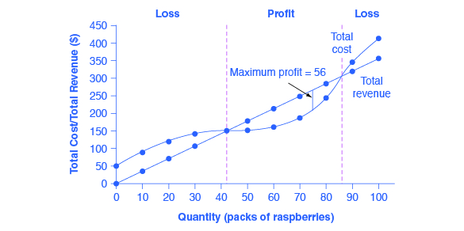
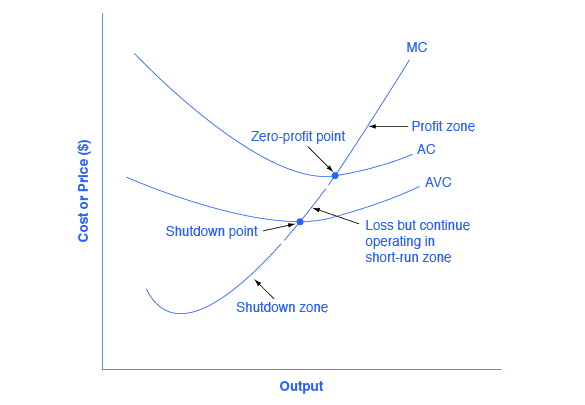

By the end of this section, you will be able to:
* Calculate profits by comparing total revenue and total cost
* Identify profits and losses with the average cost curve
* Explain the shutdown point
* Determine the price at which a firm should continue producing in the short run

A **perfectly competitive firm**{: data-type="term" .no-emphasis} has only one major decision to make—namely, what quantity to produce. To understand why this is so, consider a different way of writing out the basic definition of **profit**{: data-type="term" .no-emphasis}\:

<math xmlns="http://www.w3.org/1998/Math/MathML" display="block"> <mrow> <mtable columnalign="left"> <mtr columnalign="left"> <mtd columnalign="left"> <mrow> <mtext>Profit</mtext><mo>=</mo><mtext>Total revenue</mtext><mo>−</mo><mtext>Total cost</mtext> </mrow> </mtd> </mtr> <mtr columnalign="left"> <mtd columnalign="left"> <mrow> <mtext>         </mtext><mo>=</mo><mo stretchy="false">(</mo><mtext>Price</mtext><mo stretchy="false">)</mo><mo stretchy="false">(</mo><mtext>Quantity produced</mtext><mo stretchy="false">)</mo><mo>−</mo><mo stretchy="false">(</mo><mtext>Average cost</mtext><mo stretchy="false">)</mo><mo stretchy="false">(</mo><mtext>Quantity produced</mtext><mo stretchy="false">)</mo> </mrow> </mtd> </mtr> </mtable> </mrow> </math>

<!--@eq:{eq}-->

Since a perfectly competitive firm must accept the price for its output as determined by the product’s market demand and supply, it cannot choose the price it charges. This is already determined in the profit equation, and so the perfectly competitive firm can sell any number of units at exactly the same price. It implies that the firm faces a perfectly elastic demand curve for its product: buyers are willing to buy any number of units of output from the firm at the market price. When the perfectly competitive firm chooses what quantity to produce, then this quantity—along with the prices prevailing in the market for output and inputs—will determine the firm’s total revenue, total costs, and ultimately, level of profits.

### Determining the Highest Profit by Comparing Total Revenue and Total Cost   {#ch08mod02_01}

A perfectly competitive firm can sell as large a quantity as it wishes, as long as it accepts the prevailing market price. Total revenue is going to increase as the firm sells more, depending on the price of the product and the number of units sold. If you increase the number of units sold at a given price, then total revenue will increase. If the price of the product increases for every unit sold, then total revenue also increases. As an example of how a perfectly competitive firm decides what quantity to produce, consider the case of a small farmer who produces raspberries and sells them frozen for $4 per pack. Sales of one pack of raspberries will bring in $4, two packs will be $8, three packs will be $12, and so on. If, for example, the price of frozen raspberries doubles to $8 per pack, then sales of one pack of raspberries will be $8, two packs will be $16, three packs will be $24, and so on.

**Total revenue**{: data-type="term" .no-emphasis} and **total costs**{: data-type="term" .no-emphasis} for the raspberry farm, broken down into fixed and variable costs, are shown in [\[link\]](#ch08mod02_tab01) and also appear in [\[link\]](#CNX_Econ_C08_001). The horizontal axis shows the quantity of frozen raspberries produced in packs; the vertical axis shows both total revenue and total costs, measured in dollars. The total cost curve intersects with the vertical axis at a value that shows the level of fixed costs, and then slopes upward. All these cost curves follow the same characteristics as the curves covered in the [Cost and Industry Structure](/m48620){: .target-chapter} chapter.

{: #CNX_Econ_C08_001 data-title="Total Cost and Total Revenue at the Raspberry Farm"}

<table id="ch08mod02_tab01" summary="The table shows the total cost and total revenue at the raspberry farm. Column 1 shows the quantity (Q). Column 2 shows the total cost (TC). Column 3 shows the fixed cost (FC). Column 4 shows the variable cost (VC). Column 5 shows the total revenue (TR). Column 6 shows the profit. Row 1: At Q = 0, TC = $62, FC = $62, VC = (blank cell), TR = $0, profit = &#x2013;$62.  Row 2: At Q = 10, TC = $90, FC = $62, VC = $28, TR = $40, profit = &#x2013;$52. Row 3: At Q = 20, TC = $110, FC = $62, VC = $48, TR = $80, profit = &#x2013;$30. Row 4: At Q = 30, TC = $126, FC = $62, VC = $64, TR = $120, profit = &#x2013;$6. Row 5: At Q = 40, TC = $144, FC = $62, VC = $82, TR = $160, profit = $16. Row 6: At Q = 50, TC = $166, FC = $62, VC = $104, TR = $200, profit = $34. Row 7: At Q = 60, TC = $192, FC = $62, VC = $130, TR = $280, profit = $48. Row 8: At Q = 70, TC = $224, FC = $62, VC = $162, TR = $280, profit = $56. Row 9: At Q = 80, TC = $264, FC = $62, VC = $202, TR = $320, profit = $56. Row 10: At Q = 90, TC = $324, FC = $62, VC = $262, TR = $360, profit = $36. Row 11: At Q = 100, TC = $404, FC = $62, VC = $342, TR = $400, profit = &#x2013;$4."><caption>Total Cost and Total Revenue at the Raspberry Farm</caption><thead>
<tr>
<th data-align="center">Quantity
(Q)</th>
<th data-align="center">Total Cost
(TC)</th>
<th data-align="center">Fixed Cost
(FC)</th>
<th data-align="center">Variable Cost
(VC)</th>
<th data-align="center">Total Revenue
(TR)</th>
<th data-align="center">Profit
</th>
</tr>
</thead><tbody>
<tr>
<td>0</td>
<td>$62</td>
<td>$62</td>
<td>-</td>
<td>$0</td>
<td>−$62</td>
</tr>
<tr>
<td>10</td>
<td>$90</td>
<td>$62</td>
<td>$28</td>
<td>$40</td>
<td>−$50</td>
</tr>
<tr>
<td>20</td>
<td>$110</td>
<td>$62</td>
<td>$48</td>
<td>$80</td>
<td>−$30</td>
</tr>
<tr>
<td>30</td>
<td>$126</td>
<td>$62</td>
<td>$64</td>
<td>$120</td>
<td>−$6</td>
</tr>
<tr>
<td>40</td>
<td>$144</td>
<td>$62</td>
<td>$82</td>
<td>$160</td>
<td>$16</td>
</tr>
<tr>
<td>50</td>
<td>$166</td>
<td>$62</td>
<td>$104</td>
<td>$200</td>
<td>$34</td>
</tr>
<tr>
<td>60</td>
<td>$192</td>
<td>$62</td>
<td>$130</td>
<td>$240</td>
<td>$48</td>
</tr>
<tr>
<td>70</td>
<td>$224</td>
<td>$62</td>
<td>$162</td>
<td>$280</td>
<td>$56</td>
</tr>
<tr>
<td>80</td>
<td>$264</td>
<td>$62</td>
<td>$202</td>
<td>$320</td>
<td>$56</td>
</tr>
<tr>
<td>90</td>
<td>$324</td>
<td>$62</td>
<td>$262</td>
<td>$360</td>
<td>$36</td>
</tr>
<tr>
<td>100</td>
<td>$404</td>
<td>$62</td>
<td>$342</td>
<td>$400</td>
<td>−$4</td>
</tr>
</tbody></table>

Based on its total revenue and total cost curves, a perfectly competitive firm like the raspberry farm can calculate the quantity of output that will provide the highest level of profit. At any given quantity, total revenue minus total cost will equal profit. One way to determine the most profitable quantity to produce is to see at what quantity total revenue exceeds total cost by the largest amount. On [\[link\]](#CNX_Econ_C08_001), the vertical gap between total revenue and total cost represents either profit (if total revenues are greater that total costs at a certain quantity) or losses (if total costs are greater that total revenues at a certain quantity). In this example, total costs will exceed total revenues at output levels from 0 to 40, and so over this range of output, the firm will be making losses. At output levels from 50 to 80, total revenues exceed total costs, so the firm is earning profits. But then at an output of 90 or 100, total costs again exceed total revenues and the firm is making losses. Total profits appear in the final column of [\[link\]](#ch08mod02_tab01). The highest total profits in the table, as in the figure that is based on the table values, occur at an output of 70–80, when profits will be $56.

A higher price would mean that total revenue would be higher for every quantity sold. A lower price would mean that total revenue would be lower for every quantity sold. What happens if the price drops low enough so that the total revenue line is completely below the total cost curve; that is, at every level of output, total costs are higher than total revenues? In this instance, the best the firm can do is to suffer losses. But a profit-maximizing firm will prefer the quantity of output where total revenues come closest to total costs and thus where the losses are smallest.

(Later we will see that sometimes it will make sense for the firm to shutdown, rather than stay in operation producing output.)

### Comparing Marginal Revenue and Marginal Costs   {#ch08mod02_02}

Firms often do not have the necessary data they need to draw a complete total cost curve for all levels of production. They cannot be sure of what total costs would look like if they, say, doubled production or cut production in half, because they have not tried it. Instead, firms experiment. They produce a slightly greater or lower quantity and observe how profits are affected. In economic terms, this practical approach to maximizing profits means looking at how changes in production affect marginal revenue and marginal cost.

[\[link\]](#CNX_Econ_C08_002) presents the marginal revenue and marginal cost curves based on the total revenue and total cost in [\[link\]](#ch08mod02_tab01). The **marginal revenue**{: data-type="term"} curve shows the additional revenue gained from selling one more unit. As mentioned before, a firm in perfect competition faces a perfectly elastic demand curve for its product—that is, the firm’s demand curve is a horizontal line drawn at the market price level. This also means that the firm’s marginal revenue curve is the same as the firm’s demand curve: Every time a consumer demands one more unit, the firm sells one more unit and revenue goes up by exactly the same amount equal to the market price. In this example, every time a pack of frozen raspberries is sold, the firm’s revenue increases by $4. [\[link\]](#ch08mod02_tab02) shows an example of this. This condition only holds for price taking firms in perfect competition where:

<math xmlns="http://www.w3.org/1998/Math/MathML" display="block"> <mrow> <mtext>marginal revenue = price</mtext> </mrow> </math>

The formula for marginal revenue is:

<math xmlns="http://www.w3.org/1998/Math/MathML"> <mrow> <mtext>marginal revenue = </mtext><mfrac> <mrow> <mtext>change in total revenue</mtext> </mrow> <mrow> <mtext>change in quantity</mtext> </mrow> </mfrac> </mrow> </math>

| Price | Quantity | Total Revenue | Marginal Revenue |
|----------
| $4 | 1 | $4 | - |
| $4 | 2 | $8 | $4 |
| $4 | 3 | $12 | $4 |
| $4 | 4 | $16 | $4 |
{: #ch08mod02_tab02 summary="Column 1 shows the price (P); column 2 shows the quantity (Q); column 3 shows the total revenue (TR); column 4 shows marginal revenue (MR). Row 1: P = $4, Quantity = 1, TR = $4, MR = (blank cell). Row 2: P = $4, Q = 2, TR = $8, MR = $4. Row 3: P = $4, Q = 3, TR =  2, MR = $4. Row 4: P = $4, Q = 4, TR =  6, MR = $4."}

Notice that marginal revenue does not change as the firm produces more output. That is because the price is determined by supply and demand and does not change as the farmer produces more (keeping in mind that, due to the relative small size of each firm, increasing their supply has no impact on the total market supply where price is determined).

Since a perfectly competitive firm is a price taker, it can sell whatever quantity it wishes at the market-determined price. Marginal cost, the cost per additional unit sold, is calculated by dividing the change in total cost by the change in quantity. The formula for marginal cost is:

<math xmlns="http://www.w3.org/1998/Math/MathML"> <mrow> <mtext>marginal cost = </mtext><mfrac> <mrow> <mtext>change in total cost</mtext> </mrow> <mrow> <mtext>change in quantity</mtext> </mrow> </mfrac> </mrow> </math>

Ordinarily, marginal cost changes as the firm produces a greater quantity.

In the raspberry farm example, shown in [\[link\]](#CNX_Econ_C08_002), [\[link\]](#CNX_Econ_C08_015) and [\[link\]](#ch08mod02_tab03), marginal cost at first declines as production increases from 10 to 20 to 30 packs of raspberries—which represents the area of increasing marginal returns that is not uncommon at low levels of production. But then marginal costs start to increase, displaying the typical pattern of diminishing marginal returns. If the firm is producing at a quantity where MR &gt; MC, like 40 or 50 packs of raspberries, then it can increase profit by increasing output because the marginal revenue is exceeding the marginal cost. If the firm is producing at a quantity where MC &gt; MR, like 90 or 100 packs, then it can increase profit by reducing output because the reductions in marginal cost will exceed the reductions in marginal revenue. The firm’s profit-maximizing choice of output will occur where MR = MC (or at a choice close to that point). You will notice that what occurs on the production side is exemplified on the cost side. This is referred to as duality.

 curve is a horizontal straight line because it is equal to the price of the good, which is determined by the market, shown in [link]. The marginal cost (MC) curve is sometimes first downward-sloping, if there is a region of increasing marginal returns at low levels of output, but is eventually upward-sloping at higher levels of output as diminishing marginal returns kick in."){: #CNX_Econ_C08_002 data-title="Marginal Revenues and Marginal Costs at the Raspberry Farm: Individual Farmer"}

{: #CNX_Econ_C08_015 data-title="Marginal Revenues and Marginal Costs at the Raspberry Farm: Raspberry Market"}

<table id="ch08mod02_tab03" summary="The table shows the marginal revenues and marginal costs at the raspberry farm. Column 1 shows the quantity (Q). Column 2 shows the total cost (TC). Column 3 shows the fixed cost (FC). Column 4 shows the variable cost (VC). Column 5 shows the marginal cost (MC). Column 6 shows the total revenue (TR). Column 7 shows the marginal revenue (MR). Row 1: At Q = 0, TC = $62, FC = $62, and VC, MC, TR, and MR are all blank. Row 2: At Q = 10, TC = $90, FC = $62, VC = $28, MC = $2.80, TR = $40, MR = $4.00. Row 3: At Q = 20, TC = $110, FC = $62, VC = $48, MC = $2.00, TR = $8, MR = $4.00.  Row 4: At Q = 30, TC = $126, FC = $62, VC = $64, MC = $1.60, TR = $120, MR = $4.00. Row 5: At Q = 40, TC = $144, FC = $62, VC = $82, MC = $1.80, TR = $160, MR = $4.00.  Row 6: At Q = 50, TC = $166, FC = $62, VC = $104, MC = $2.20, TR = $200, MR = $4.00. Row 7: At Q =60, TC = $192, FC = $62, VC = $130, MC = $2.60, TR = $240, MR = $4.00. Row 8: At Q = 70, TC = $224, FC = $62, VC = $162, MC = $3.20, TR = $280, MR = $4.00.  Row 9: At Q = 80, TC = $264, FC = $62, VC = $202, MC = $4.00, TR = $320, MR = $4.00. Row 10: At Q = 90, TC = $324, FC = $62, VC = $262, MC = $6.00, TR = $360, MR = $4.00. Row 11: At Q = 100, TC = $404, FC = $62, VC = $342, MC = $8.00, TR = $400, MR = $4.00."><caption>Marginal Revenues and Marginal Costs at the Raspberry Farm</caption><thead>
<tr>
<th>Quantity</th>
<th>Total Cost</th>
<th>Fixed Cost</th>
<th>Variable Cost</th>
<th>Marginal Cost</th>
<th>Total Revenue</th>
<th>Marginal Revenue</th>
</tr>
</thead><tbody>
<tr>
<td>0</td>
<td>$62</td>
<td>$62</td>
<td>-</td>
<td>-</td>
<td>-</td>
<td>-</td>
</tr>
<tr>
<td>10</td>
<td>$90</td>
<td>$62</td>
<td>$28</td>
<td>$2.80</td>
<td>$40</td>
<td>$4.00</td>
</tr>
<tr>
<td>20</td>
<td>$110</td>
<td>$62</td>
<td>$48</td>
<td>$2.00</td>
<td>$80</td>
<td>$4.00</td>
</tr>
<tr>
<td>30</td>
<td>$126</td>
<td>$62</td>
<td>$64</td>
<td>$1.60</td>
<td>$120</td>
<td>$4.00</td>
</tr>
<tr>
<td>40</td>
<td>$144</td>
<td>$62</td>
<td>$82</td>
<td>$1.80</td>
<td>$160</td>
<td>$4.00</td>
</tr>
<tr>
<td>50</td>
<td>$166</td>
<td>$62</td>
<td>$104</td>
<td>$2.20</td>
<td>$200</td>
<td>$4.00</td>
</tr>
<tr>
<td>60</td>
<td>$192</td>
<td>$62</td>
<td>$130</td>
<td>$2.60</td>
<td>$240</td>
<td>$4.00</td>
</tr>
<tr>
<td>70</td>
<td>$224</td>
<td>$62</td>
<td>$162</td>
<td>$3.20</td>
<td>$280</td>
<td>$4.00</td>
</tr>
<tr>
<td>80</td>
<td>$264</td>
<td>$62</td>
<td>$202</td>
<td>$4.00</td>
<td>$320</td>
<td>$4.00</td>
</tr>
<tr>
<td>90</td>
<td>$324</td>
<td>$62</td>
<td>$262</td>
<td>$6.00</td>
<td>$360</td>
<td>$4.00</td>
</tr>
<tr>
<td>100</td>
<td>$404</td>
<td>$62</td>
<td>$342</td>
<td>$8.00</td>
<td>$400</td>
<td>$4.00</td>
</tr>
</tbody></table>

In this example, the marginal revenue and **marginal cost**{: data-type="term" .no-emphasis} curves cross at a price of $4 and a quantity of 80 produced. If the farmer started out producing at a level of 60, and then experimented with increasing production to 70, marginal revenues from the increase in production would exceed marginal costs—and so profits would rise. The farmer has an incentive to keep producing. From a level of 70 to 80, marginal cost and marginal revenue are equal so profit doesn’t change. If the farmer then experimented further with increasing production from 80 to 90, he would find that marginal costs from the increase in production are greater than marginal revenues, and so profits would decline.

The profit-maximizing choice for a perfectly competitive firm will occur where marginal revenue is equal to marginal cost—that is, where MR = MC. A profit-seeking firm should keep expanding production as long as MR &gt; MC. But at the level of output where MR = MC, the firm should recognize that it has achieved the highest possible level of economic profits. (In the example above, the profit maximizing output level is between 70 and 80 units of output, but the firm will not know they’ve maximized profit until they reach 80, where MR = MC.) Expanding production into the zone where MR &lt; MC will only reduce economic profits. Because the marginal revenue received by a perfectly competitive firm is equal to the price P, so that P = MR, the profit-maximizing rule for a perfectly competitive firm can also be written as a recommendation to produce at the quantity where P = MC.

### Profits and Losses with the Average Cost Curve   {#ch08mod02_03}

Does maximizing profit (producing where MR = MC) imply an actual economic profit? The answer depends on the relationship between price and average total cost. If the price that a firm charges is higher than its average cost of production for that quantity produced, then the firm will earn profits. Conversely, if the price that a firm charges is lower than its average cost of production, the firm will suffer losses. You might think that, in this situation, the farmer may want to shut down immediately. Remember, however, that the firm has already paid for fixed costs, such as equipment, so it may continue to produce and incur a loss. [\[link\]](#CNX_Econ_C08_014) illustrates three situations: (a) where price intersects marginal cost at a level above the average cost curve, (b) where price intersects marginal cost at a level equal to the average cost curve, and (c) where price intersects marginal cost at a level below the average cost curve.

 , price intersects marginal cost above the average cost curve. Since price is greater than average cost, the firm is making a profit. In (b), price intersects marginal cost at the minimum point of the average cost curve. Since price is equal to average cost, the firm is breaking even. In (c), price intersects marginal cost below the average cost curve. Since price is less than average cost, the firm is making a loss."){: #CNX_Econ_C08_014 data-title="Price and Average Cost at the Raspberry Farm"}

First consider a situation where the price is equal to $5 for a pack of frozen raspberries. The rule for a profit-maximizing perfectly competitive firm is to produce the level of output where Price= MR = MC, so the raspberry farmer will produce a quantity of 90, which is labeled as e in [\[link\]](#CNX_Econ_C08_014) (a). Remember that the area of a rectangle is equal to its base multiplied by its height. The farm’s total revenue at this price will be shown by the large shaded rectangle from the origin over to a quantity of 90 packs (the base) up to point E\' (the height), over to the price of $5, and back to the origin. The average cost of producing 80 packs is shown by point C or about $3.50. Total costs will be the quantity of 80 times the average cost of $3.50, which is shown by the area of the rectangle from the origin to a quantity of 90, up to point C, over to the vertical axis and down to the origin. It should be clear from examining the two rectangles that total revenue is greater than total cost. Thus, profits will be the blue shaded rectangle on top.

It can be calculated as:

<math xmlns="http://www.w3.org/1998/Math/MathML" display="block"> <mtable columnalign="left"> <mtr> <mtd> <mtext>profit</mtext></mtd> <mtd><mo>=</mo> </mtd> <mtd><mtext>total revenue</mtext><mo>−</mo><mtext>total cost</mtext> </mtd> </mtr> <mtr><mtd /> <mtd><mo>=</mo></mtd> <mtd><mo stretchy="false">(</mo><mn>90</mn><mo stretchy="false">)</mo><mo stretchy="false">(</mo><mtext>$5.00</mtext><mo stretchy="false">)</mo><mo>−</mo><mo stretchy="false">(</mo><mn>90</mn><mo stretchy="false">)</mo><mo stretchy="false">(</mo><mtext>$3.50</mtext><mo stretchy="false">)</mo> </mtd> </mtr> <mtr> <mtd /> <mtd><mo>=</mo></mtd><mtd><mtext>$135</mtext> </mtd> </mtr> </mtable> </math>

Or, it can be calculated as:

<math xmlns="http://www.w3.org/1998/Math/MathML" display="block"> <mtable columnalign="left"> <mtr><mtd><mtext>profit</mtext></mtd><mtd><mo>=</mo></mtd> <mtd> <mtext>(price</mtext><mo>–</mo><mtext>average cost) × quantity</mtext> </mtd> </mtr> <mtr><mtd /><mtd><mo>=</mo></mtd> <mtd> <mn>($5.00</mn><mo>–</mo><mn>$3.50) × 90</mn> </mtd> </mtr> <mtr><mtd /><mtd><mo>=</mo></mtd> <mtd> <mtext>$135</mtext> </mtd> </mtr> </mtable> </math>

Now consider [\[link\]](#CNX_Econ_C08_014) (b), where the price has fallen to $3.00 for a pack of frozen raspberries. Again, the perfectly competitive firm will choose the level of output where Price = MR = MC, but in this case, the quantity produced will be 70. At this price and output level, where the marginal cost curve is crossing the average cost curve, the price received by the firm is exactly equal to its average cost of production.

The farm’s total revenue at this price will be shown by the large shaded rectangle from the origin over to a quantity of 70 packs (the base) up to point E (the height), over to the price of $3, and back to the origin. The average cost of producing 70 packs is shown by point C’. Total costs will be the quantity of 70 times the average cost of $3.00, which is shown by the area of the rectangle from the origin to a quantity of 70, up to point E, over to the vertical axis and down to the origin. It should be clear from that the rectangles for total revenue and total cost are the same. Thus, the firm is making zero profit. The calculations are as follows:

<math xmlns="http://www.w3.org/1998/Math/MathML" display="block"> <mrow> <mtable columnalign="left"> <mtr columnalign="left"> <mtd><mrow><mtext>profit</mtext></mrow></mtd> <mtd><mo>=</mo></mtd> <mtd columnalign="left"> <mrow> <mtext>total revenue</mtext><mo>–</mo><mtext>total cost</mtext> </mrow> </mtd> </mtr> <mtr columnalign="left"> <mtd /> <mtd><mo>=</mo></mtd> <mtd columnalign="left"> <mrow> <mn>(70)($3.00)</mn><mo>–</mo><mn>(70)($3.00)</mn> </mrow> </mtd> </mtr> <mtr columnalign="left"> <mtd /> <mtd><mo>=</mo></mtd> <mtd columnalign="left"> <mrow> <mn>$0</mn> </mrow> </mtd> </mtr> </mtable> </mrow> </math>

Or, it can be calculated as:

<math xmlns="http://www.w3.org/1998/Math/MathML" display="block"> <mrow> <mtable columnalign="left"> <mtr columnalign="left"> <mtd><mtext>profit</mtext></mtd> <mtd><mo>=</mo></mtd> <mtd columnalign="left"> <mrow> <mtext>(price</mtext><mo>–</mo><mtext>average cost)</mtext><mo>×</mo><mtext>quantity</mtext> </mrow> </mtd> </mtr> <mtr columnalign="left"><mtd /> <mtd><mo>=</mo></mtd> <mtd columnalign="left"> <mrow> <mn>($3.00</mn><mo>–</mo><mn>$3.00)</mn><mo>×</mo><mn>70</mn> </mrow> </mtd> </mtr> <mtr columnalign="left"><mtd /> <mtd><mo>=</mo></mtd> <mtd columnalign="left"> <mrow> <mn>$0</mn> </mrow> </mtd> </mtr> </mtable> </mrow> </math>

In [\[link\]](#CNX_Econ_C08_014) (c), the market price has fallen still further to $2.00 for a pack of frozen raspberries. At this price, marginal revenue intersects marginal cost at a quantity of 50. The farm’s total revenue at this price will be shown by the large shaded rectangle from the origin over to a quantity of 50 packs (the base) up to point E” (the height), over to the price of $2, and back to the origin. The average cost of producing 50 packs is shown by point C” or about $3.30. Total costs will be the quantity of 50 times the average cost of $3.30, which is shown by the area of the rectangle from the origin to a quantity of 50, up to point C”, over to the vertical axis and down to the origin. It should be clear from examining the two rectangles that total revenue is less than total cost. Thus, the firm is losing money and the loss (or negative profit) will be the rose-shaded rectangle.

The calculations are:

<math xmlns="http://www.w3.org/1998/Math/MathML" display="block"> <mrow> <mtable columnalign="left"> <mtr columnalign="left"><mtd><mtext>profit</mtext></mtd><mtd><mo>=</mo></mtd> <mtd columnalign="left"> <mrow> <mtext>(total revenue</mtext><mo>–</mo><mtext> total cost)</mtext> </mrow> </mtd> </mtr> <mtr columnalign="left"><mtd /> <mtd><mo>=</mo></mtd> <mtd columnalign="left"> <mrow> <mn>(50)($2.00)</mn><mo>–</mo><mn>(50)($3.30)</mn> </mrow> </mtd> </mtr> <mtr columnalign="left"><mtd /> <mtd><mo>=</mo></mtd> <mtd columnalign="left"> <mrow> <mn>–$77.50</mn> </mrow> </mtd> </mtr> </mtable> </mrow> </math>

Or:

<math xmlns="http://www.w3.org/1998/Math/MathML" display="block"> <mrow> <mtable columnalign="left"> <mtr columnalign="left"><mtd><mtext>profit</mtext></mtd> <mtd><mo>=</mo></mtd> <mtd columnalign="left"> <mrow> <mtext>(price</mtext><mo>–</mo><mtext>average cost) × quantity</mtext> </mrow> </mtd> </mtr> <mtr columnalign="left"><mtd /> <mtd><mo>=</mo></mtd> <mtd columnalign="left"> <mrow> <mn>($1.75</mn><mo>–</mo><mn>$3.30) × 50</mn> </mrow> </mtd> </mtr> <mtr columnalign="left"><mtd /> <mtd><mo>=</mo></mtd> <mtd columnalign="left"> <mrow> <mn>–$77.50</mn> </mrow> </mtd> </mtr> </mtable> </mrow> </math>

If the market price received by a perfectly competitive firm leads it to produce at a quantity where the price is greater than average cost, the firm will earn profits. If the price received by the firm causes it to produce at a quantity where price equals average cost, which occurs at the minimum point of the AC curve, then the firm earns zero profits. Finally, if the price received by the firm leads it to produce at a quantity where the price is less than average cost, the firm will earn losses. This is summarized in [\[link\]](#ch08mod02_tab04).

| If... | Then... |
|----------
| Price &gt; ATC | Firm earns an economic profit |
| Price = ATC | Firm earns zero economic profit |
| Price &lt; ATC | Firm earns a loss |
{: #ch08mod02_tab04 summary="The table shows how the difference in amount between price and ATC effects a firm&#x2019;s earnings. Column 1 is labeled &#x201C;If&#x2026;&#x201D; and Column 2 is labeled &#x201C;Then&#x2026;&#x201D; If price is greater than ATC, then the firm earns an economic profit. If price equals ATC, then the firm earns zero economic profit. If price is less than ATC, then the firm earns a loss."}

### The Shutdown Point   {#ch08mod02_04}

The possibility that a firm may earn losses raises a question: Why can the firm not avoid losses by shutting down and not producing at all? The answer is that shutting down can reduce variable costs to zero, but in the short run, the firm has already paid for fixed costs. As a result, if the firm produces a quantity of zero, it would still make losses because it would still need to pay for its fixed costs. So, when a firm is experiencing losses, it must face a question: should it continue producing or should it shut down?

As an example, consider the situation of the Yoga Center, which has signed a contract to rent space that costs $10,000 per month. If the firm decides to operate, its marginal costs for hiring yoga teachers is $15,000 for the month. If the firm shuts down, it must still pay the rent, but it would not need to hire labor. [\[link\]](#ch08mod02_tab05) shows three possible scenarios. In the first scenario, the Yoga Center does not have any clients, and therefore does not make any revenues, in which case it faces losses of $10,000 equal to the fixed costs. In the second scenario, the Yoga Center has clients that earn the center revenues of $10,000 for the month, but ultimately experiences losses of $15,000 due to having to hire yoga instructors to cover the classes. In the third scenario, the Yoga Center earns revenues of $20,000 for the month, but experiences losses of $5,000.

In all three cases, the Yoga Center loses money. In all three cases, when the rental contract expires in the long run, assuming revenues do not improve, the firm should exit this business. In the short run, though, the decision varies depending on the level of losses and whether the firm can cover its variable costs. In scenario 1, the center does not have any revenues, so hiring yoga teachers would increase variable costs and losses, so it should shut down and only incur its fixed costs. In scenario 2, the center’s losses are greater because it does not make enough revenue to offset the increased variable costs plus fixed costs, so it should shut down immediately. If price is below the minimum average variable cost, the firm must shut down. In contrast, in scenario 3 the revenue that the center can earn is high enough that the losses diminish when it remains open, so the center should remain open in the short run.

<table id="ch08mod02_tab05" summary="The table shows three scenarios for determining whether a yoga center should shut down now or later. Scenario 1 reads: If the center shuts down now, revenues are zero but it will not incur any variable costs and would only need to pay fixed costs of $10,000. The first scenario 1 equation is: profit = total revenue &#x2013; (fixed costs + variable cost). The next scenario 1 equation is: [profit] = 0 &#x2013; $10,000. The last scenario 3 equation is: [profit] = &#x2013; $10,000. Scenario 2 reads: The center earns revenues of $10,000, and variable costs are $15,000. The center should shut down now. The first scenario 2 equation is: profit = total revenue &#x2013; (fixed costs + variable cost). The next scenario 2 equation is: [profit] = $10,000 &#x2013; ($10,000 + $15,000). The last scenario 2 equation is: [profit] = &#x2013; $15,000. Scenario 3 reads: The center earns revenues of $20,000, and variable costs are $15,000. The center should continue in business. The first scenario 3 equation is: profit = total revenue &#x2013; (fixed costs + variable cost). The next scenario 3 equation is: [profit] = $20,000 &#x2013; ($10,000 + $15,000). The last scenario 3 equation is: [profit] = &#x2013; $5,000."><caption>Should the Yoga Center Shut Down Now or Later?</caption><tbody>
<tr>
<td><strong>Scenario 1</strong></td>
</tr>
<tr>
<td>If the center shuts down now, revenues are zero but it will not incur any variable costs and would only need to pay fixed costs of $10,000.</td>
</tr>
<tr>
<td>
<math xmlns="http://www.w3.org/1998/Math/MathML" display="block">
 <mrow>
  <mtable columnalign="left">
   <mtr columnalign="left">
    <mtd columnalign="left">
     <mrow>
      <mtext>profit = total revenue–(fixed costs + variable cost)</mtext>
     </mrow>
    </mtd>
   </mtr>
   <mtr columnalign="left">
    <mtd columnalign="left">
     <mrow>
      <mtext>          = 0 –$10,000</mtext>
     </mrow>
    </mtd>
   </mtr>
   <mtr columnalign="left">
    <mtd columnalign="left">
     <mrow>
      <mtext>          = –$10,000</mtext>
     </mrow>
    </mtd>
   </mtr>
   
  </mtable>
 </mrow>
</math>
</td>
</tr>
<tr>
<td><strong>Scenario 2</strong></td>
</tr>
<tr>
<td>The center earns revenues of $10,000, and variable costs are $15,000. The center should shut down now.</td>
</tr>
<tr>
<td>
<math xmlns="http://www.w3.org/1998/Math/MathML" display="block">
 <mrow>
  <mtable columnalign="left">
   <mtr columnalign="left">
    <mtd columnalign="left">
     <mrow>
      <mtext>profit = total revenue </mtext><mo>–</mo><mtext> (fixed costs + variable cost)</mtext>
     </mrow>
    </mtd>
   </mtr>
   <mtr columnalign="left">
    <mtd columnalign="left">
     <mrow>
      <mtext>          = $10,000 </mtext><mo>–</mo><mtext> ($10,000 + $15,000)</mtext>
     </mrow>
    </mtd>
   </mtr>
   <mtr columnalign="left">
    <mtd columnalign="left">
     <mrow>
      <mtext>          = –$15,000</mtext>
     </mrow>
    </mtd>
   </mtr>
   
  </mtable>
 </mrow>
</math>
</td>
</tr>
<tr>
<td><strong>Scenario 3</strong></td>
</tr>
<tr>
<td>The center earns revenues of $20,000, and variable costs are $15,000. The center should continue in business.</td>
</tr>
<tr>
<td>
<math xmlns="http://www.w3.org/1998/Math/MathML" display="block">
 <mrow>
  <mtable columnalign="left">
   <mtr columnalign="left">
    <mtd columnalign="left">
     <mrow>
      <mtext>profit = total revenue </mtext><mo>–</mo><mtext> (fixed costs + variable cost)</mtext>
     </mrow>
    </mtd>
   </mtr>
   <mtr columnalign="left">
    <mtd columnalign="left">
     <mrow>
      <mtext>          = $20,000 </mtext><mo>–</mo><mtext> ($10,000 + $15,000)</mtext>
     </mrow>
    </mtd>
   </mtr>
   <mtr columnalign="left">
    <mtd columnalign="left">
     <mrow>
      <mtext>          = –$5,000</mtext>
     </mrow>
    </mtd>
   </mtr>
   
  </mtable>
 </mrow>
</math>
</td>
</tr>
</tbody></table>

This example suggests that the key factor is whether a firm can earn enough revenues to cover at least its variable costs by remaining open. Let’s return now to our raspberry farm. [\[link\]](#CNX_Econ_C08_012) illustrates this lesson by adding the average variable cost curve to the marginal cost and average cost curves. At a price of $2.20 per pack, as shown in [\[link\]](#CNX_Econ_C08_012) (a), the farm produces at a level of 50. It is making losses of $56 (as explained earlier), but price is above average variable cost and so the firm continues to operate. However, if the price declined to $1.80 per pack, as shown in [\[link\]](#CNX_Econ_C08_012) (b), and if the firm applied its rule of producing where P = MR = MC, it would produce a quantity of 40. This price is below average variable cost for this level of output. If the farmer cannot pay workers (the variable costs), then it has to shut down. At this price and output, total revenues would be $72 (quantity of 40 times price of $1.80) and total cost would be $144, for overall losses of $72. If the farm shuts down, it must pay only its fixed costs of $62, so shutting down is preferable to selling at a price of $1.80 per pack.

 , the farm produces at a level of 50. It is making losses of $56, but price is above average variable cost, so it continues to operate. In (b), total revenues are $72 and total cost is $144, for overall losses of $72. If the farm shuts down, it must pay only its fixed costs of $62. Shutting down is preferable to selling at a price of $1.80 per pack."){: #CNX_Econ_C08_012 data-title="The Shutdown Point for the Raspberry Farm"}

Looking at [\[link\]](#ch08mod02_tab06), if the price falls below $2.05, the minimum average variable cost, the firm must shut down.

<table id="ch08mod02_tab06" summary="The table shows the cost of production for the raspberry farm. Column 1 shows the quantity (Q). Column 2 shows the total cost (TC). Column 3 shows the fixed cost (FC). Column 4 shows the variable cost (VC). Column 5 shows the marginal cost (MC). Column 6 shows the average cost (AC). Column 7 shows the average variable cost (AVC). Row 1: At Q = 0, TC = $62, FC = $62, and VC, MC, AC, and AVC are all blank. Row 2: At Q = 10, TC = $90, FC = $62, VC = $28, MC = $2.80, AC = $9.00, AVC = $2.80. Row 3: At Q = 20, TC = $110, FC = $62, VC = $48, MC = $2.00, AC = $5.50, AVC = $2.40.  Row 4: At Q = 30, TC = $126, FC = $62, VC = $64, MC = $1.60, AC = $4.20, AVC = $2.13. Row 5: At Q = 40, TC = $144, FC = $62, VC = $82, MC = $1.80, AC = $3.60, AVC = $2.05.  Row 6: At Q = 50, TC = $166, FC = $62, VC = $104, MC = $2.20, AC = $3.32, AVC = $2.08. Row 7: At Q =60, TC = $192, FC = $62, VC = $130, MC = $2.60, AC = $3.20, AVC = $2.16. Row 8: At Q = 70, TC = $224, FC = $62, VC = $162, MC = $3.20, AC = $3.20, AVC = $2.31. Row 9: At Q = 80, TC = $264, FC = $62, VC = $202, MC = $4.00, AC = $3.30, AVC = $2.52. Row 10: At Q = 90, TC = $324, FC = $62, VC = $262, MC = $6.00, AC = $3.60, AVC = $2.91. Row 11: At Q = 100, TC = $404, FC = $62, VC = $342, MC = $8.00, AC = $4.04, AVC = $3.42."><caption>Cost of Production for the Raspberry Farm</caption><thead>
<tr>
<th>Quantity</th>
<th>Total Cost</th>
<th>Fixed Cost</th>
<th>Variable Cost</th>
<th>Marginal Cost</th>
<th>Average Cost</th>
<th>Average Variable Cost</th>
</tr>
</thead><tbody>
<tr>
<td>0</td>
<td>$62</td>
<td>$62</td>
<td>-</td>
<td>-</td>
<td>-</td>
<td>-</td>
</tr>
<tr>
<td>10</td>
<td>$90</td>
<td>$62</td>
<td>$28</td>
<td>$2.80</td>
<td>$9.00</td>
<td>$2.80</td>
</tr>
<tr>
<td>20</td>
<td>$110</td>
<td>$62</td>
<td>$48</td>
<td>$2.00</td>
<td>$5.50</td>
<td>$2.40</td>
</tr>
<tr>
<td>30</td>
<td>$126</td>
<td>$62</td>
<td>$64</td>
<td>$1.60</td>
<td>$4.20</td>
<td>$2.13</td>
</tr>
<tr>
<td>40</td>
<td>$144</td>
<td>$62</td>
<td>$82</td>
<td>$1.80</td>
<td>$3.60</td>
<td>$2.05</td>
</tr>
<tr>
<td>50</td>
<td>$166</td>
<td>$62</td>
<td>$104</td>
<td>$2.20</td>
<td>$3.32</td>
<td>$2.08</td>
</tr>
<tr>
<td>60</td>
<td>$192</td>
<td>$62</td>
<td>$130</td>
<td>$2.60</td>
<td>$3.20</td>
<td>$2.16</td>
</tr>
<tr>
<td>70</td>
<td>$224</td>
<td>$62</td>
<td>$162</td>
<td>$3.20</td>
<td>$3.20</td>
<td>$2.31</td>
</tr>
<tr>
<td>80</td>
<td>$264</td>
<td>$62</td>
<td>$202</td>
<td>$4.00</td>
<td>$3.30</td>
<td>$2.52</td>
</tr>
<tr>
<td>90</td>
<td>$324</td>
<td>$62</td>
<td>$262</td>
<td>$6.00</td>
<td>$3.60</td>
<td>$2.91</td>
</tr>
<tr>
<td>100</td>
<td>$404</td>
<td>$62</td>
<td>$342</td>
<td>$8.00</td>
<td>$4.04</td>
<td>$3.42</td>
</tr>
</tbody></table>

The intersection of the average variable cost curve and the marginal cost curve, which shows the price where the firm would lack enough revenue to cover its variable costs, is called the **shutdown point**. If the perfectly competitive firm can charge a price above the shutdown point, then the firm is at least covering its average variable costs. It is also making enough revenue to cover at least a portion of fixed costs, so it should limp ahead even if it is making losses in the short run, since at least those losses will be smaller than if the firm shuts down immediately and incurs a loss equal to total fixed costs. However, if the firm is receiving a price below the price at the shutdown point, then the firm is not even covering its variable costs. In this case, staying open is making the firm’s losses larger, and it should shut down immediately. To summarize, if:

* price &lt; minimum average variable cost, then firm shuts down
* price = minimum average variable cost, then firm stays in business

### Short-Run Outcomes for Perfectly Competitive Firms   {#ch08mod02_05}

The average cost and average variable cost curves divide the marginal cost curve into three segments, as shown in [\[link\]](#CNX_Econ_C08_008). At the market price, which the perfectly competitive firm accepts as given, the profit-maximizing firm chooses the output level where price or marginal revenue, which are the same thing for a perfectly competitive firm, is equal to marginal cost: P = MR = MC.

 {: #CNX_Econ_C08_008 data-title="Profit, Loss, Shutdown"}

First consider the upper zone, where prices are above the level where marginal cost (MC) crosses average cost (AC) at the zero profit point. At any price above that level, the firm will earn profits in the short run. If the price falls exactly on the zero profit point where the MC and AC curves cross, then the firm earns zero profits. If a price falls into the zone between the zero profit point, where MC crosses AC, and the shutdown point, where MC crosses AVC, the firm will be making losses in the short run—but since the firm is more than covering its variable costs, the losses are smaller than if the firm shut down immediately. Finally, consider a price at or below the shutdown point where MC crosses AVC. At any price like this one, the firm will shut down immediately, because it cannot even cover its variable costs.

### Marginal Cost and the Firm’s Supply Curve   {#ch08mod02_06}

For a perfectly competitive firm, the marginal cost curve is identical to the firm’s supply curve starting from the minimum point on the average variable cost curve. To understand why this perhaps surprising insight holds true, first think about what the supply curve means. A firm checks the market price and then looks at its supply curve to decide what quantity to produce. Now, think about what it means to say that a firm will maximize its profits by producing at the quantity where P = MC. This rule means that the firm checks the market price, and then looks at its marginal cost to determine the quantity to produce—and makes sure that the price is greater than the minimum average variable cost. In other words, the marginal cost curve above the minimum point on the average variable cost curve becomes the firm’s supply curve.

Watch this [video][1] that addresses how drought in the United States can impact food prices across the world. (Note that the story on the drought is the second one in the news report; you need to let the video play through the first story in order to watch the story on the drought.)

  

As discussed in the chapter on [Demand and Supply](/m48628){: .target-chapter}, many of the reasons that supply curves shift relate to underlying changes in costs. For example, a lower price of key inputs or new technologies that reduce production costs cause supply to shift to the right; in contrast, bad weather or added government regulations can add to costs of certain goods in a way that causes supply to shift to the left. These shifts in the firm’s supply curve can also be interpreted as shifts of the marginal cost curve. A shift in costs of production that increases marginal costs at all levels of output—and shifts MC to the left—will cause a perfectly competitive firm to produce less at any given market price. Conversely, a shift in costs of production that decreases marginal costs at all levels of output will shift MC to the right and as a result, a competitive firm will choose to expand its level of output at any given price. The following Work It Out feature will walk you through an example.

At What Price Should the Firm Continue Producing in the Short Run?

To determine the short-run economic condition of a firm in perfect competition, follow the steps outlined below. Use the data shown in [\[link\]](#ch08mod02_tab07).

| Q | P | TFC | TVC | TC | AVC | ATC | MC | TR | Profits |
|----------
| 0 | $28 | $20 | $0 | - | - | - | - | - | - |
| 1 | $28 | $20 | $20 | - | - | - | - | - | - |
| 2 | $28 | $20 | $25 | - | - | - | - | - | - |
| 3 | $28 | $20 | $35 | - | - | - | - | - | - |
| 4 | $28 | $20 | $52 | - | - | - | - | - | - |
| 5 | $28 | $20 | $80 | - | - | - | - | - | - |
{: #ch08mod02_tab07 summary="The table has 10 columns. Column 1 shows quantity (Q). Column 2 shows price (P). Column 3 shows total fixed cost (TFC). Column 4 shows total variable cost (TVC). Column 5 shows total cost (TC). Column 6 shows average variable cost (AVC). Column 7 shows average total cost (ATC). Column 8 shows marginal cost (MC). Column 9 shows total revenue (TR). Column 10 shows profits. Columns 5 through 10 are blank in the table. At Q = 0, P = $28, TFC = $20, TVC = $0. At Q = 1, P = $28, TFC = $20, TVC = $20. At Q = 2, P = $28, TFC = $20, TVC = $25. At Q = 3, P = $28, TFC = $20, TVC = $35. At Q = 4, P = $28, TFC = $20, TVC = $52. At Q = 5, P = $28, TFC = $20, TVC = $80."}

Step 1. Determine the cost structure for the firm. For a given total fixed costs and variable costs, calculate total cost, average variable cost, average total cost, and marginal cost. Follow the formulas given in the [Cost and Industry Structure](/m48620){: .target-chapter} chapter. These calculations are shown in [\[link\]](#ch08mod02_tab08).

<table id="ch08mod02_tab08" summary="The table has 10 columns. Column 1 shows quantity (Q). Column 2 shows price (P). Column 3 shows total fixed cost (TFC). Column 4 shows total variable cost (TVC). Column 5 shows total cost (TC) which is (TFC + TVC). Column 6 shows average variable cost (AVC) which is (TVC/Q). Column 7 shows average total cost (ATC) which is (TC/Q). Column 8 shows marginal cost (MC) which is (TC2 &#x2013; TC1)/(Q2 &#x2013; Q2). Column 9 shows total revenue (TR). Column 10 shows profits. Row 1: At Q = 0, P = $28, TFC = $20, TVC = $0, TC = ($20+$0=$20), and AVC, ATC, and MC are blank. Row 2: At Q = 1, P = $28, TFC = $20, TVC = $20, TC = ($20+$20=$40), AVC = ($20/1=$20), ATC = ($40/1=$40), MC = [($40&#x2013;$20)/(1&#x2013;0)=$20]. Row 3: At Q = 2, P = $28, TFC = $20, TVC = $25, TC = ($20+$25=$45), AVC = ($25/2=$12.50), ATC = ($45/2=$22.50), MC = [($45&#x2013;$40)/(2&#x2013;1)=$5]. Row 4: At Q = 3, P = $28, TFC = $20, TVC = $35, TC = ($20+$35=$55), AVC = ($35/3=$11.67), ATC = ($55/3=$18.33), MC = [($55&#x2013;$45)/(3&#x2013;2)=$10]. Row 5: At Q = 4, P = $28, TFC = $20, TVC = $52, TC = ($20+$52=$72), AVC = ($52/4=$13), ATC = ($72/4=$18), MC = [($72&#x2013;$55)/(4&#x2013;3)=$17]. Row 6: At Q = 5, P = $28, TFC = $20, TVC = $80, TC = ($20+$80=$100), AVC = ($80/5=$16), ATC = ($100/5=$20), MC = [($100&#x2013;$72)/(5&#x2013;4)=$28]."><thead>
<tr>
<th data-align="center">Q</th>
<th data-align="center">P</th>
<th data-align="center">TFC</th>
<th data-align="center">TVC</th>
<th data-align="center">TC
(TFC+TVC)</th>
<th data-align="center">AVC
(TVC/Q)</th>
<th data-align="center">ATC
(TC/Q)</th>
<th data-align="center">MC
(TC2−TC1)/
(Q2−Q1)</th>
</tr>
</thead><tbody>
<tr>
<td>0</td>
<td>$28</td>
<td>$20</td>
<td>$0</td>
<td>$20+$0=$20</td>
<td>-</td>
<td>-</td>
<td>-</td>
</tr>
<tr>
<td>1</td>
<td>$28</td>
<td>$20</td>
<td>$20</td>
<td>$20+$20=$40</td>
<td>$20/1=$20.00</td>
<td>$40/1=$40.00</td>
<td>($40−$20)/
(1−0)= $20</td>
</tr>
<tr>
<td>2</td>
<td>$28</td>
<td>$20</td>
<td>$25</td>
<td>$20+$25=$45</td>
<td>$25/2=$12.50</td>
<td>$45/2=$22.50</td>
<td>($45−$40)/
(2−1)= $5</td>
</tr>
<tr>
<td>3</td>
<td>$28</td>
<td>$20</td>
<td>$35</td>
<td>$20+$35=$55</td>
<td>$35/3=$11.67</td>
<td>$55/3=$18.33</td>
<td>($55−$45)/
(3−2)= $10</td>
</tr>
<tr>
<td>4</td>
<td>$28</td>
<td>$20</td>
<td>$52</td>
<td>$20+$52=$72</td>
<td>$52/4=$13.00</td>
<td>$72/4=$18.00</td>
<td>($72−$55)/
(4−3)= $17</td>
</tr>
<tr>
<td>5</td>
<td>$28</td>
<td>$20</td>
<td>$80</td>
<td>$20+$80=$100</td>
<td>$80/5=$16.00</td>
<td>$100/5=$20.00</td>
<td>($100−$72)/
(5−4)= $28</td>
</tr>
</tbody></table>

Step 2. Determine the market price that the firm receives for its product. This should be given information, as the firm in perfect competition is a price taker. With the given price, calculate total revenue as equal to price multiplied by quantity for all output levels produced. In this example, the given price is $30. You can see that in the second column of [\[link\]](#ch08mod02_tab09).

| Quantity | Price | Total Revenue (P × Q) |
|----------
| 0 | $28 | $28×0=$0 |
| 1 | $28 | $28×1=$28 |
| 2 | $28 | $28×2=$56 |
| 3 | $28 | $28×3=$84 |
| 4 | $28 | $28×4=$112 |
| 5 | $28 | $28×5=$140 |
{: #ch08mod02_tab09 summary="The table shows how to calculate total revenue by multiplying quantity and price. Column 1 shows the quantity (Q). Column 2 shows the price (P). Column 3 shows the total revenue (TR) which is (P x Q). Row 1: At Q = 0, P = 28, TR is 28x0=$0. Row 2: At Q = 1, P = 28, TR is 28x1=&gt;28. Row 3: At Q = 2, P = 28, TR is 28x2=$56. Row 4: At Q = 3, P = 28, TR is 28x3=$84. Row 5: At Q = 4, P = 28, TR is 28x4= 112. Row 6: At Q = 5, P = 28, TR is 28x5= 140."}

Step 3. Calculate profits as total cost subtracted from total revenue, as shown in [\[link\]](#ch08mod02_tab10).

| Quantity | Total Revenue | Total Cost | Profits (TR−TC) |
|----------
| 0 | $0 | $20 | $0−$20=−$20 |
| 1 | $28 | $40 | $28−$40=−$12 |
| 2 | $56 | $45 | $56−$45=$11 |
| 3 | $84 | $55 | $84−$55=$29 |
| 4 | $112 | $72 | $112−$72=$40 |
| 5 | $140 | $100 | $140−$100=$40 |
{: #ch08mod02_tab10 summary="The table shows how to calculate profits by subtracting total cost from total revenue. Column 1 shows the quantity (Q). Column 2 shows the total revenue (TR). Column 3 shows the total cost (TC). Column 4 shows the profits which is (TR &#x2013; TC). Row 1: At Q = 0, TR = $0, TC = $20, Profits is $0&#x2013;$20= &#x2013;$20. Row 2: At Q = 1, TR = $28, TC = $40, profits is $28&#x2013;$40= &#x2013;$12. Row 3: At Q = 2, TR = $56, TC = $45, profits is $56&#x2013;$45= $11. Row 4: At Q = 3, TR = $84, TC = $55, profits is $84&#x2013;$55= $29. Row 5: At Q = 4, TR = $112, TC = $72, profits is $112&#x2013;$72= $40. Row 6: At Q = 5, TR = $140, TC = $100, profits is $140&#x2013;$100= $40."}

Step 4. To find the profit-maximizing output level, look at the Marginal Cost column (at every output level produced), as shown in [\[link\]](#ch08mod02_tab11), and determine where it is equal to the market price. The output level where price equals the marginal cost is the output level that maximizes profits.

| Q | P | TFC | TVC | TC | AVC | ATC | MC | TR | Profits |
|----------
| 0 | $28 | $20 | $0 | $20 | - | - | - | $0 | −$20 |
| 1 | $28 | $20 | $20 | $40 | $20.00 | $40.00 | $20 | $28 | −$12 |
| 2 | $28 | $20 | $25 | $45 | $12.50 | $22.50 | $5 | $56 | $11 |
| 3 | $28 | $20 | $35 | $55 | $11.67 | $18.33 | $10 | $84 | $29 |
| 4 | $28 | $20 | $52 | $72 | $13.00 | $18.00 | $17 | $112 | $40 |
| **5** | **$28** | $20 | $80 | $100 | $16.40 | $20.40 | **$30** | $140 | **$40** |
{: #ch08mod02_tab11 summary="The table shows the profit-maximizing output level. Column 1 shows quantity (Q). Column 2 shows price (P). Column 3 shows total fixed cost (TFC). Column 4 shows total variable cost (TVC). Column 5 shows total cost (TC). Column 6 shows average variable cost (AVC). Column 7 shows average total cost (ATC). Column 8 shows marginal cost (MC). Column 9 shows total revenue (TR). Column 10 shows profits. Row 1: At Q = 0, P = $28, TFC = $20, TVC = $0, TC = $20, AVC = (blank cell), ATC = (blank cell), MC = (blank cell), TR = $0, Profits = &#x2013;$20. Row 2: At Q = 1, P = $28, TFC = $20, TVC = $20, TC = $20, AVC = $20, ATC = $40, MC =$20, TR = $28, Profits = &#x2013;$12. Row 3: At Q = 2, P = $28, TFC = $20, TVC = $25, TC = $45, AVC = $12.50, ATC = $22.50, MC =$5, TR = $56, Profits = $11. Row 4: At Q = 3, P = $28, TFC = $20, TVC = $35, TC = $55, AVC = $11.67, ATC = $18.33, MC =$10, TR = $84, Profits = $29. Row 5: At Q = 4, P = $28, TFC = $20, TVC = $52, TC = $72, AVC = $13, ATC = $18, MC =$17, TR = $112, Profits = $40. Row 6: At Q = 5, P = $28, TFC = $20, TVC = $80, TC = $100, AVC = $16.40, ATC = $20.40, MC =$30, TR = $140, Profits = $40."}

Step 5. Once you have determined the profit-maximizing output level (in this case, output quantity 5), you can look at the amount of profits made (in this case, $40).

Step 6. If the firm is making economic losses, the firm needs to determine whether it produces the output level where price equals marginal revenue and equals marginal cost or it shuts down and only incurs its fixed costs.

Step 7. For the output level where marginal revenue is equal to marginal cost, check if the market price is greater than the average variable cost of producing that output level.

* If P &gt; AVC but P &lt; ATC, then the firm continues to produce in the short-run, making economic losses.
* If P &lt; AVC, then the firm stops producing and only incurs its fixed costs.

In this example, the price of $28 is greater than the AVC ($16.40) of producing 5 units of output, so the firm continues producing.

### Key Concepts and Summary   {#ch08mod02_summ}

As a perfectly competitive firm produces a greater quantity of output, its total revenue steadily increases at a constant rate determined by the given market price. Profits will be highest (or losses will be smallest) at the quantity of output where total revenues exceed total costs by the greatest amount (or where total revenues fall short of total costs by the smallest amount). Alternatively, profits will be highest where marginal revenue, which is price for a perfectly competitive firm, is equal to marginal cost. If the market price faced by a perfectly competitive firm is above average cost at the profit-maximizing quantity of output, then the firm is making profits. If the market price is below average cost at the profit-maximizing quantity of output, then the firm is making losses.

If the market price is equal to average cost at the profit-maximizing level of output, then the firm is making zero profits. The point where the marginal cost curve crosses the average cost curve, at the minimum of the average cost curve, is called the “zero profit point.” If the market price faced by a perfectly competitive firm is below average variable cost at the profit-maximizing quantity of output, then the firm should shut down operations immediately. If the market price faced by a perfectly competitive firm is above average variable cost, but below average cost, then the firm should continue producing in the short run, but exit in the long run. The point where the marginal cost curve crosses the average variable cost curve is called the shutdown point.

### Self-Check Questions   {#ch08mod02_sques}

Look at [[link]](#ch08mod02_tab12). What would happen to the firm’s profits if the market price increases to $6 per pack of raspberries?

| Quantity | Total Cost | Fixed Cost | Variable Cost | Total Revenue | Profit |
|----------
| 0 | $62 | $62 | - | $0 | −$62 |
| 10 | $90 | $62 | $28 | $60 | −$30 |
| 20 | $110 | $62 | $48 | $120 | $10 |
| 30 | $126 | $62 | $64 | $180 | $54 |
| 40 | $144 | $62 | $82 | $240 | $96 |
| 50 | $166 | $62 | $104 | $300 | $134 |
| 60 | $192 | $62 | $130 | $360 | $168 |
| 70 | $224 | $62 | $162 | $420 | $196 |
| 80 | $264 | $62 | $202 | $480 | $216 |
| 90 | $324 | $62 | $262 | $540 | $216 |
| 100 | $404 | $62 | $342 | $600 | $196 |
{: #ch08mod02_tab12 summary="The table has 6 columns. Column 1 shows the quantity (Q). Column 2 shows the total cost (TC). Column 3 shows the fixed cost (FC). Column 4 shows the variable cost (VC). Column 5 shows the total revenue (TR). Column 6 shows the profit. Row 1: At Q = 0, TC = $62, FC = $62, VC = (blank cell), TR = $0, profit = &#x2013;$62. Row 2: At Q = 10, TC = $90, FC = $62, VC = $28, TR = $60, profit = &#x2013;$30. Row 3: At Q = 20, TC = $110, FC = $62, VC = $48, TR = $120, profit = $10. Row 4: At Q = 30, TC = $126, FC = $62, VC = $64, TR = $180, profit = $54. Row 5: At Q = 40, TC = $144, FC = $62, VC = $82, TR = $240, profit = $96. Row 6: At Q = 50, TC = $166, FC = $62, VC = $104, TR = $300, profit = $134. Row 7: At Q = 60, TC = $192, FC = $62, VC = $130, TR = $360, profit = $168. Row 8: At Q = 70, TC = $224, FC = $62, VC = $162, TR = $420, profit = $196. Row 9: At Q = 80, TC = $264, FC = $62, VC = $202, TR = $480, profit = $216. Row 10: At Q = 90, TC = $324, FC = $62, VC = $262, TR = $540, profit = $216. Row 11: At Q = 100, TC = $404, FC = $62, VC = $342, TR = $600, profit = &#x2013;$196."}

Holding total cost constant, profits at every output level would increase.

Suppose that the market price increases to $6, as shown in [[link]](#ch08mod02_tab13). What would happen to the profit-maximizing output level?

| Quantity | Total Cost | Fixed Cost | Variable Cost | Marginal Cost | Total Revenue | Marginal Revenue |
|----------
| 0 | $62 | $62 | - | - | $0 | - |
| 10 | $90 | $62 | $28 | $2.80 | $60 | $6.00 |
| 20 | $110 | $62 | $48 | $2.00 | $120 | $6.00 |
| 30 | $126 | $62 | $64 | $1.60 | $180 | $6.00 |
| 40 | $144 | $62 | $82 | $1.80 | $240 | $6.00 |
| 50 | $166 | $62 | $104 | $2.20 | $300 | $6.00 |
| 60 | $192 | $62 | $130 | $2.60 | $360 | $6.00 |
| 70 | $224 | $62 | $162 | $3.20 | $420 | $6.00 |
| 80 | $264 | $62 | $202 | $4.00 | $480 | $6.00 |
| **90** | $324 | $62 | $262 | **$6.00** | $540 | **$6.00** |
| 100 | $404 | $62 | $342 | $8.00 | $600 | $6.00 |
{: #ch08mod02_tab13 summary="The table has 7 columns. Column 1 shows the quantity (Q). Column 2 shows the total cost (TC). Column 3 shows the fixed cost (FC). Column 4 shows the variable cost (VC). Column 5 shows the marginal cost (MC). Column 6 shows the total revenue (TR). Column 7 shows the marginal revenue (MR). Row 1: At Q = 0, TC = $62, FC = $62, VC = (blank cell), MC = (blank cell) TR = $0, MR = (blank cell). Row 2: At Q = 10, TC = $90, FC = $62, VC = $28, MC = $2.80, TR = $60, MR = $6.00. Row 3: At Q = 20, TC = $110, FC = $62, VC = $48, MC = $2.00, TR = $120, MR = $6.00.  Row 4: At Q = 30, TC = $126, FC = $62, VC = $64, MC = $1.60, TR = $180, MR = $6.00. Row 5: At Q = 40, TC = $144, FC = $62, VC = $82, MC = $1.80, TR = $240, MR = $6.00.  Row 6: At Q = 50, TC = $166, FC = $62, VC = $104, MC = $2.20, TR = $300, MR = $6.00. Row 7: At Q =60, TC = $192, FC = $62, VC = $130, MC = $2.60, TR = $360, MR = $6.00. Row 8: At Q = 70, TC = $224, FC = $62, VC = $162, MC = $3.20, TR = $420, MR = $6.00. Row 9: At Q = 80, TC = $264, FC = $62, VC = $202, MC = $4.00, TR = $480, MR = $6.00. Row 10: At Q = 90, TC = $324, FC = $62, VC = $262, MC = $6.00, TR = $540, MR = $6.00. Row 11: At Q = 100, TC = $404, FC = $62, VC = $342, MC = $8.00, TR = $600, MR = $6.00."}

When the market price increases, marginal revenue increases. The firm would then increase production up to the point where the new price equals marginal cost, at a quantity of 90.

Explain in words why a profit-maximizing firm will not choose to produce at a quantity where marginal cost exceeds marginal revenue.

If marginal costs exceeds marginal revenue, then the firm will reduce its profits for every additional unit of output it produces. Profit would be greatest if it reduces output to where MR = MC.

A firm’s marginal cost curve above the average variable cost curve is equal to the firm’s individual supply curve. This means that every time a firm receives a price from the market it will be willing to supply the amount of output where the price equals marginal cost. What happens to the firm’s individual supply curve if marginal costs increase?

The firm will be willing to supply fewer units at every price level. In other words, the firm’s individual supply curve decreases and shifts to the left.

### Review Questions   {#ch08mod02_rques}

How does a perfectly competitive firm decide what price to charge?

What prevents a perfectly competitive firm from seeking higher profits by increasing the price that it charges?

How does a perfectly competitive firm calculate total revenue?

Briefly explain the reason for the shape of a marginal revenue curve for a perfectly competitive firm.

What two rules does a perfectly competitive firm apply to determine its profit-maximizing quantity of output?

How does the average cost curve help to show whether a firm is making profits or losses?

What two lines on a cost curve diagram intersect at the zero-profit point?

Should a firm shut down immediately if it is making losses?

How does the average variable cost curve help a firm know whether it should shut down immediately?

What two lines on a cost curve diagram intersect at the shutdown point?

### Critical Thinking Questions   {#ch08mod02_ctques}

Your company operates in a perfectly competitive market. You have been told that advertising can help you increase your sales in the short run. Would you create an aggressive advertising campaign for your product?

Since a perfectly competitive firm can sell as much as it wishes at the market price, why can the firm not simply increase its profits by selling an extremely high quantity?

### Problems   {#ch08mod02_prob}

The AAA Aquarium Co. sells aquariums for $20 each. Fixed costs of production are $20. The total variable costs are $20 for one aquarium, $25 for two units, $35 for the three units, $50 for four units, and $80 for five units. In the form of a table, calculate total revenue, marginal revenue, total cost, and marginal cost for each output level (one to five units). What is the profit-maximizing quantity of output? On one diagram, sketch the total revenue and total cost curves. On another diagram, sketch the marginal revenue and marginal cost curves.

Perfectly competitive firm Doggies Paradise Inc. sells winter coats for dogs. Dog coats sell for $72 each. The fixed costs of production are $100. The total variable costs are $64 for one unit, $84 for two units, $114 for three units, $184 for four units, and $270 for five units. In the form of a table, calculate total revenue, marginal revenue, total cost and marginal cost for each output level (one to five units). On one diagram, sketch the total revenue and total cost curves. On another diagram, sketch the marginal revenue and marginal cost curves. What is the profit maximizing quantity?

A computer company produces affordable, easy-to-use home computer systems and has fixed costs of $250. The marginal cost of producing computers is $700 for the first computer, $250 for the second, $300 for the third, $350 for the fourth, $400 for the fifth, $450 for the sixth, and $500 for the seventh.

1.  Create a table that shows the company’s output, total cost, marginal cost, average cost, variable cost, and average variable cost.
2.  At what price is the zero-profit point? At what price is the shutdown point?
3.  If the company sells the computers for $500, is it making a profit or a loss? How big is the profit or loss? Sketch a graph with AC, MC, and AVC curves to illustrate your answer and show the profit or loss.
4.  If the firm sells the computers for $300, is it making a profit or a loss? How big is the profit or loss? Sketch a graph with AC, MC, and AVC curves to illustrate your answer and show the profit or loss.
{: type="a"}

### Glossary
{: data-type="glossary-title"}

marginal revenue
: {: #ch08mod02_gl01m} the additional revenue gained from selling one more unit
{: #ch08mod02_gl01}

shutdown point
: {: #ch08mod02_gl02m} level of output where the marginal cost curve intersects the average variable cost curve at the minimum point of AVC; if the price is below this point, the firm should shut down immediately
{: #ch08mod02_gl02}

[1]: http://openstaxcollege.org/l/foodprice
