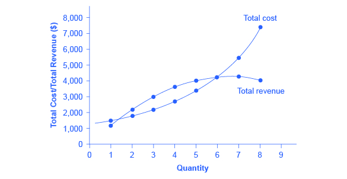
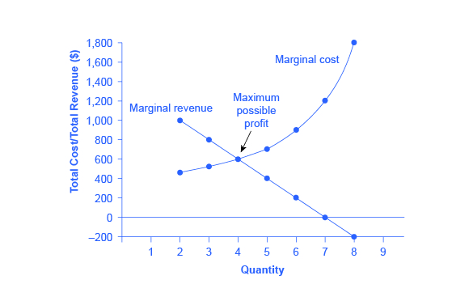
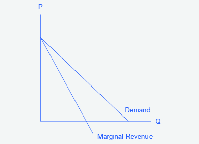

By the end of this section, you will be able to:

* Explain the perceived demand curve for a perfect competitor and a monopoly
* Analyze a demand curve for a monopoly and determine the output that maximizes profit and revenue
* Calculate marginal revenue and marginal cost
* Explain allocative efficiency as it pertains to the efficiency of a monopoly

Consider a monopoly firm, comfortably surrounded by barriers to entry so that it need not fear competition from other producers. How will this monopoly choose its profit-maximizing quantity of output, and what price will it charge? Profits for the monopolist, like any firm, will be equal to total revenues minus total costs. The pattern of costs for the monopoly can be analyzed within the same framework as the costs of a **perfectly competitive firm**{: data-type="term" .no-emphasis}—that is, by using total cost, fixed cost, variable cost, marginal cost, average cost, and average variable cost. However, because a monopoly faces no competition, its situation and its decision process will differ from that of a perfectly competitive firm. (The Clear it Up feature discusses how hard it is sometimes to define “market” in a monopoly situation.)

# Demand Curves Perceived by a Perfectly Competitive Firm and by a Monopoly

A perfectly competitive firm acts as a price taker, so its calculation of total revenue is made by taking the given market price and multiplying it by the quantity of output that the firm chooses. The demand curve *as it is perceived by a perfectly competitive firm* appears in [\[link\]](#CNX_Econ_C09_008) (a). The flat perceived demand curve means that, from the viewpoint of the perfectly competitive firm, it could sell either a relatively low quantity like Ql or a relatively high quantity like Qh at the market price P.

 A perfectly competitive firm perceives the demand curve that it faces to be flat. The flat shape means that the firm can sell either a low quantity (Ql) or a high quantity (Qh) at exactly the same price (P). (b) A monopolist perceives the demand curve that it faces to be the same as the market demand curve, which for most goods is downward-sloping. Thus, if the monopolist chooses a high level of output (Qh), it can charge only a relatively low price (Pl); conversely, if the monopolist chooses a low level of output (Ql), it can then charge a higher price (Ph). The challenge for the monopolist is to choose the combination of price and quantity that maximizes profits."){: #CNX_Econ_C09_008 data-title="The Perceived Demand Curve for a Perfect Competitor and a Monopolist "}

What defines the market?

A monopoly is a firm that sells all or nearly all of the goods and services in a given market. But what defines the “market”?

In a famous 1947 case, the federal government accused the DuPont company of having a monopoly in the cellophane market, pointing out that DuPont produced 75% of the cellophane in the United States. DuPont countered that even though it had a 75% market share in cellophane, it had less than a 20% share of the “flexible packaging materials,” which includes all other moisture-proof papers, films, and foils. In 1956, after years of legal appeals, the U.S. Supreme Court held that the broader market definition was more appropriate, and the case against DuPont was dismissed.

Questions over how to define the market continue today. True, Microsoft in the 1990s had a dominant share of the software for computer operating systems, but in the total market for all computer software and services, including everything from games to scientific programs, the Microsoft share was only about 14% in 2014. The Greyhound bus company may have a near-monopoly on the market for intercity bus transportation, but it is only a small share of the market for intercity transportation if that market includes private cars, airplanes, and railroad service. DeBeers has a monopoly in diamonds, but it is a much smaller share of the total market for precious gemstones and an even smaller share of the total market for jewelry. A small town in the country may have only one gas station: is this gas station a “monopoly,” or does it compete with gas stations that might be five, 10, or 50 miles away?

In general, if a firm produces a product without close substitutes, then the firm can be considered a monopoly producer in a single market. But if buyers have a range of similar—even if not identical—options available from other firms, then the firm is not a monopoly. Still, arguments over whether substitutes are close or not close can be controversial.

While a monopolist can charge *any* price for its product, that price is nonetheless constrained by demand for the firm’s product. No monopolist, even one that is thoroughly protected by high barriers to entry, can require consumers to purchase its product. Because the monopolist is the only firm in the market, its demand curve is the same as the market demand curve, which is, unlike that for a perfectly competitive firm, downward-sloping.

[\[link\]](#CNX_Econ_C09_008) illustrates this situation. The monopolist can either choose a point like R with a low price (Pl) and high quantity (Qh), or a point like S with a high price (Ph) and a low quantity (Ql), or some intermediate point. Setting the price too high will result in a low quantity sold, and will not bring in much revenue. Conversely, setting the price too low may result in a high quantity sold, but because of the low price, it will not bring in much revenue either. The challenge for the monopolist is to strike a profit-maximizing balance between the price it charges and the quantity that it sells. But why isn’t the perfectly competitive firm’s demand curve also the market demand curve? See the following Clear it Up feature for the answer to this question.

What is the difference between perceived demand and market demand?

The demand curve as perceived by a perfectly competitive firm is not the overall market demand curve for that product. However, the firm’s demand curve as perceived by a monopoly is the same as the market demand curve. The reason for the difference is that each perfectly competitive firm perceives the demand for its products in a market that includes many other firms; in effect, the demand curve perceived by a perfectly competitive firm is a tiny slice of the entire market demand curve. In contrast, a monopoly perceives demand for its product in a market where the monopoly is the only producer.

# Total Cost and Total Revenue for a Monopolist

Profits for a monopolist can be illustrated with a graph of total revenues and total costs, as shown with the example of the hypothetical HealthPill firm in [\[link\]](#CNX_Econ_C09_004). The total cost curve has its typical shape; that is, total costs rise and the curve grows steeper as output increases.

{: #CNX_Econ_C09_004 data-title="Total Revenue and Total Cost for the HealthPill Monopoly "}

<table id="Table_09_02" summary="This table has 6 columns labeled quantity, total cost, quantity, price, total revenue, and profit = total revenue minus total cost. The first column has the following values: 1, 2, 3, 4, 5, 6, 7, 8. The second column has the following values: 1500, 1800, 2200, 2800, 3500, 4200, 5600, 7400. The third column has the following values: 1, 2, 3, 4, 5, 6, 7, 8. the fourth column has the following values: 1200, 1100, 1000, 900, 800, 700, 600, 500. The fifth column has the following values: 1200, 2200, 3000, 3600, 4000, 4200, 4200, 4000. The sixth column has the following values: -300, 400, 800, 900, 700, 0, &#x2013;1400, &#x2013;3400."><caption>Total Costs and Total Revenues of HealthPill</caption><thead>
<tr>
<th>Quantity</th>
<th>Total Cost</th>
<th>Quantity</th>
<th>Price</th>
<th>Total Revenue</th>
<th>Profit = Total Revenue – Total Cost</th>
</tr>
</thead><tbody>
<tr>
<td>1</td>
<td>1,500</td>
<td>1</td>
<td>1,200</td>
<td>1,200</td>
<td>–300</td>
</tr>

<tr>
<td>2</td>
<td>1,800</td>
<td>2</td>
<td>1,100</td>
<td>2,200</td>
<td>400</td>
</tr>

<tr>
<td>3</td>
<td>2,200</td>
<td>3</td>
<td>1,000</td>
<td>3,000</td>
<td>800</td>
</tr>

<tr>
<td>4</td>
<td>2,800</td>
<td>4</td>
<td>900</td>
<td>3,600</td>
<td>800</td>
</tr>

<tr>
<td>5</td>
<td>3,500</td>
<td>5</td>
<td>800</td>
<td>4,000</td>
<td>500</td>
</tr>

<tr>
<td>6</td>
<td>4,200</td>
<td>6</td>
<td>700</td>
<td>4,200</td>
<td>0</td>
</tr>

<tr>
<td>7</td>
<td>5,600</td>
<td>7</td>
<td>600</td>
<td>4,200</td>
<td>–1,400</td>
</tr>

<tr>
<td>8</td>
<td>7,400</td>
<td>8</td>
<td>500</td>
<td>4,000</td>
<td>–3,400</td>
</tr>
</tbody></table>

To calculate total revenue for a monopolist, start with the demand curve perceived by the monopolist. [\[link\]](#Table_09_02) shows quantities along the demand curve and the price at each quantity demanded, and then calculates total revenue by multiplying price times quantity at each level of output. (In this example, the output is given as 1, 2, 3, 4, and so on, for the sake of simplicity. If you prefer a dash of greater realism, you can imagine that these output levels and the corresponding prices are measured per 1,000 or 10,000 pills.) As the figure illustrates, total revenue for a monopolist rises, flattens out, and then falls. In this example, total revenue is highest at a quantity of 6 or 7.

Clearly, the total revenue for a monopolist is not a straight upward-sloping line, in the way that total revenue was for a perfectly competitive firm. The different total revenue pattern for a monopolist occurs because the quantity that a monopolist chooses to produce affects the market price, which was not true for a perfectly competitive firm. If the monopolist charges a very high price, then quantity demanded drops, and so total revenue is very low. If the monopolist charges a very low price, then, even if quantity demanded is very high, total revenue will not add up to much. At some intermediate level, total revenue will be highest.

However, the monopolist is not seeking to maximize revenue, but instead to earn the highest possible profit. Profits are calculated in the final row of the table. In the HealthPill example in [\[link\]](#CNX_Econ_C09_004), the highest profit will occur at the quantity where total revenue is the farthest above total cost. Of the choices given in the table, the highest profits occur at an output of 4, where profit is 800.

# Marginal Revenue and Marginal Cost for a Monopolist

In the real world, a monopolist often does not have enough information to analyze its entire total revenues or total costs curves; after all, the firm does not know exactly what would happen if it were to alter production dramatically. But a monopolist often has fairly reliable information about how changing output by small or moderate amounts will affect its marginal revenues and marginal costs, because it has had experience with such changes over time and because modest changes are easier to extrapolate from current experience. A monopolist can use information on **marginal revenue**{: data-type="term" .no-emphasis} and **marginal cost**{: data-type="term" .no-emphasis} to seek out the profit-maximizing combination of quantity and price.

The first four columns of [\[link\]](#Table_09_03) use the numbers on total cost from the HealthPill example in the previous exhibit and calculate marginal cost and average cost. This monopoly faces a typical upward-sloping marginal cost curve, as shown in [\[link\]](#CNX_Econ_C09_005). The second four columns of [\[link\]](#Table_09_03) use the total revenue information from the previous exhibit and calculate marginal revenue.

Notice that marginal revenue is zero at a quantity of 7, and turns negative at quantities higher than 7. It may seem counterintuitive that marginal revenue could ever be zero or negative: after all, does an increase in quantity sold not always mean more revenue? For a perfect competitor, each additional unit sold brought a positive marginal revenue, because marginal revenue was equal to the given market price. But a monopolist can sell a larger quantity and see a decline in **total revenue**{: data-type="term" .no-emphasis}. When a monopolist increases sales by one unit, it gains some marginal revenue from selling that extra unit, but also loses some marginal revenue because every other unit must now be sold at a lower price. As the quantity sold becomes higher, the drop in price affects a greater quantity of sales, eventually causing a situation where more sales cause marginal revenue to be negative.

 {: #CNX_Econ_C09_005 data-title="Marginal Revenue and Marginal Cost for the HealthPill Monopoly "}

<table id="Table_09_03" summary="This table has two columns with four subcolumns each. The two columns are labeled cost information and revenue information. Under cost information, the columns are labeled quantity, total cost, marginal cost, and average cost. Under revenue information the columns are labeled quantity, price, total revenue, and total revenue. This gives us eight columns total. The values in the first column are 1, 2, 3, 4, 5, 6, 7, 8. The values in the second column are 1500, 1800, 2200, 2800, 3500, 4400, 5600, 7400. The values in the third column are 1500, 300, 400, 600, 700, 900, 1200, 1800. The values in the fourth column are 1500, 900, 733, 700, 700, 733, 800, 925. The values in the fifth column are 1, 2, 3, 4, 5, 6, 7, 8. The values in the sixth column are 1200, 1100, 1000, 900, 800, 700, 600, 500. The values in the seventh column are 1200, 2200, 3000, 3600, 4000, 4200, 4200, 4000. The values in the eighth column are 1200, 1000, 800, 600, 400, 200, 0, -200."><caption>Costs and Revenues of HealthPill</caption><thead>
<tr>
<th colspan="4" data-align="center">Cost Information</th>
<th colspan="4" data-align="center">Revenue Information</th>
</tr>
</thead><tbody>
<tr>
<td><strong>Quantity</strong></td>
<td><strong>Total Cost</strong></td>
<td><strong>Marginal Cost</strong></td>
<td><strong>Average Cost</strong></td>
<td><strong>Quantity</strong></td>
<td><strong>Price</strong></td>
<td><strong>Total Revenue</strong></td>
<td><strong>Marginal Revenue</strong></td>
</tr>

<tr>
<td>1</td>
<td>1,500</td>
<td>1,500</td>
<td>1,500</td>
<td>1</td>
<td>1,200</td>
<td>1,200</td>
<td>1,200</td>
</tr>

<tr>
<td>2</td>
<td>1,800</td>
<td>300</td>
<td>900</td>
<td>2</td>
<td>1,100</td>
<td>2,200</td>
<td>1,000</td>
</tr>

<tr>
<td>3</td>
<td>2,200</td>
<td>400</td>
<td>733</td>
<td>3</td>
<td>1,000</td>
<td>3,000</td>
<td>800</td>
</tr>

<tr>
<td>4</td>
<td>2,800</td>
<td>600</td>
<td>700</td>
<td>4</td>
<td>900</td>
<td>3,600</td>
<td>600</td>
</tr>

<tr>
<td>5</td>
<td>3,500</td>
<td>700</td>
<td>700</td>
<td>5</td>
<td>800</td>
<td>4,000</td>
<td>400</td>
</tr>

<tr>
<td>6</td>
<td>4,200</td>
<td>700</td>
<td>700</td>
<td>6</td>
<td>700</td>
<td>4,200</td>
<td>200</td>
</tr>

<tr>
<td>7</td>
<td>5,600</td>
<td>1,400</td>
<td>800</td>
<td>7</td>
<td>600</td>
<td>4,200</td>
<td>0</td>
</tr>

<tr>
<td>8</td>
<td>7,400</td>
<td>1,800</td>
<td>925</td>
<td>8</td>
<td>500</td>
<td>4,000</td>
<td>–200</td>
</tr>
</tbody></table>

A monopolist can determine its profit-maximizing price and quantity by analyzing the marginal revenue and marginal costs of producing an extra unit. If the marginal revenue exceeds the marginal cost, then the firm should produce the extra unit.

For example, at an output of 3 in [\[link\]](#CNX_Econ_C09_005), marginal revenue is 800 and marginal cost is 400, so producing this unit will clearly add to overall profits. At an output of 4, marginal revenue is 600 and marginal cost is 600, so producing this unit still means overall profits are unchanged. However, expanding output from 4 to 5 would involve a marginal revenue of 400 and a marginal cost of 700, so that fifth unit would actually reduce profits. Thus, the monopoly can tell from the marginal revenue and marginal cost that of the choices given in the table, the profit-maximizing level of output is 4.

Indeed, the monopoly could seek out the profit-maximizing level of output by increasing quantity by a small amount, calculating marginal revenue and marginal cost, and then either increasing output as long as marginal revenue exceeds marginal cost or reducing output if marginal cost exceeds marginal revenue. This process works without any need to calculate total revenue and total cost. Thus, a profit-maximizing monopoly should follow the rule of producing up to the quantity where marginal revenue is equal to marginal cost—that is, MR = MC.

Maximizing Profits

If you find it counterintuitive that producing where marginal revenue equals marginal cost will maximize profits, working through the numbers will help.

Step 1. Remember that marginal cost is defined as the change in total cost from producing a small amount of additional output.

<math xmlns="http://www.w3.org/1998/Math/MathML"><mtext>MC</mtext><mo>=</mo><mfrac><mtext>change in total cost</mtext><mtext>change in quantity produced</mtext></mfrac></math>

Step 2. Note that in [\[link\]](#Table_09_03), as output increases from 1 to 2 units, total cost increases from $1500 to $1800. As a result, the marginal cost of the second unit will be:

<math xmlns="http://www.w3.org/1998/Math/MathML"><mtable columnspacing="2px" columnalign="right center left"><mtr><mtd><mtext>MC</mtext></mtd><mtd><mo>=</mo></mtd><mtd><mfrac><mrow><mn>$1800</mn><mo>–</mo><mn>$1500</mn></mrow><mn>1</mn></mfrac></mtd></mtr><mtr><mtd /><mtd><mo>=</mo></mtd><mtd><mn>$300</mn></mtd></mtr></mtable></math>

Step 3. Remember that, similarly, marginal revenue is the change in total revenue from selling a small amount of additional output.

<math xmlns="http://www.w3.org/1998/Math/MathML"><mtable columnspacing="2px" columnalign="right center left"><mtr><mtd><mtext>MR</mtext></mtd><mtd><mo>=</mo></mtd><mtd><mfrac><mtext>change in total revenue</mtext><mtext>change in quantity sold</mtext></mfrac></mtd></mtr></mtable></math>

Step 4. Note that in [\[link\]](#Table_09_03), as output increases from 1 to 2 units, total revenue increases from $1200 to $2200. As a result, the marginal revenue of the second unit will be:

<math xmlns="http://www.w3.org/1998/Math/MathML"><mtable columnspacing="2px" columnalign="right center left"><mtr><mtd><mtext>MR</mtext></mtd><mtd><mo>=</mo></mtd><mtd><mfrac><mrow><mn>$2200</mn><mo>–</mo><mn>$1200</mn></mrow><mn>1</mn></mfrac></mtd></mtr><mtr><mtd /><mtd><mo>=</mo></mtd><mtd><mn>$1000</mn></mtd></mtr></mtable></math>

<table id="Table_09_04" summary="This table has five columns and seven rows. The first column is labeled quantity and has the values 1, 2, 3, 4, 5, 6, 7. The second column is labeled marginal revenue and has the values 1200, 1000, 800, 600, 400, 200, 0. The third column is labeled marginal cost and has the values 1500, 300, 400, 600, 700, 900, 1200. The fourth column is labeled marginal profit and has the values -300, 700, 400, 0, -300, -700, -1200. The fifth column is labeled total profit and has the values -300, 400, 800, 800, 500, -200, -1400."><caption>Marginal Revenue, Marginal Cost, Marginal and Total Profit</caption><thead>
<tr>
<th>Quantity</th>
<th>Marginal Revenue</th>
<th>Marginal Cost</th>
<th>Marginal Profit</th>
<th>Total Profit</th>
</tr>
</thead><tbody>
<tr>
<td>1</td>
<td>1,200</td>
<td>1,500</td>
<td>–300</td>
<td>–300</td>
</tr>

<tr>
<td>2</td>
<td>1,000</td>
<td>300</td>
<td>700</td>
<td>400</td>
</tr>

<tr>
<td>3</td>
<td>800</td>
<td>400</td>
<td>400</td>
<td>800</td>
</tr>

<tr>
<td>4</td>
<td>600</td>
<td>600</td>
<td>0</td>
<td>800</td>
</tr>

<tr>
<td>5</td>
<td>400</td>
<td>700</td>
<td>–300</td>
<td>500</td>
</tr>

<tr>
<td>6</td>
<td>200</td>
<td>700</td>
<td>–500</td>
<td>0</td>
</tr>

<tr>
<td>7</td>
<td>0</td>
<td>1,400</td>
<td>–1,400</td>
<td>–1,400</td>
</tr>
</tbody></table>

[\[link\]](#Table_09_04) repeats the marginal cost and marginal revenue data from [\[link\]](#Table_09_03), and adds two more columns: **Marginal profit**{: data-type="term"} is the profitability of each additional unit sold. It is defined as marginal revenue minus marginal cost. Finally, total profit is the sum of marginal profits. As long as marginal profit is positive, producing more output will increase total profits. When marginal profit turns negative, producing more output will decrease total profits. Total profit is maximized where marginal revenue equals marginal cost. In this example, maximum profit occurs at 4 units of output.

A perfectly competitive firm will also find its profit-maximizing level of output where MR = MC. The key difference with a perfectly competitive firm is that in the case of perfect competition, marginal revenue is equal to price (MR = P), while for a monopolist, marginal revenue is not equal to the price, because changes in quantity of output affect the price.

# Illustrating Monopoly Profits

It is straightforward to calculate profits of given numbers for total revenue and total cost. However, the size of monopoly profits can also be illustrated graphically with [\[link\]](#CNX_Econ_C09_006), which takes the marginal cost and marginal revenue curves from the previous exhibit and adds an average cost curve and the monopolist’s perceived demand curve.

{: #CNX_Econ_C09_006 data-title="Illustrating Profits at the HealthPill Monopoly"}

[\[link\]](#CNX_Econ_C09_007) illustrates the three-step process where a monopolist: selects the profit-maximizing quantity to produce; decides what price to charge; determines total revenue, total cost, and profit.

**Step 1: The Monopolist Determines Its Profit-Maximizing Level of Output**

The firm can use the points on the demand curve D to calculate total revenue, and then, based on total revenue, calculate its marginal revenue curve. The profit-maximizing quantity will occur where MR = MC—or at the last possible point before marginal costs start exceeding marginal revenue. On [\[link\]](#CNX_Econ_C09_006), MR = MC occurs at an output of 4.

**Step 2: The Monopolist Decides What Price to Charge**

The monopolist will charge what the market is willing to pay. A dotted line drawn straight up from the profit-maximizing quantity to the demand curve shows the profit-maximizing price. This price is above the average cost curve, which shows that the firm is earning profits.

**Step 3: Calculate Total Revenue, Total Cost, and Profit**

Total revenue is the overall shaded box, where the width of the box is the quantity being sold and the height is the price. In [\[link\]](#CNX_Econ_C09_006), the bottom part of the shaded box, which is shaded more lightly, shows total costs; that is, quantity on the horizontal axis multiplied by average cost on the vertical axis. The larger box of total revenues minus the smaller box of total costs will equal profits, which is shown by the darkly shaded box. In a perfectly competitive market, the forces of entry would erode this profit in the long run. But a monopolist is protected by barriers to entry. In fact, one telltale sign of a possible monopoly is when a firm earns profits year after year, while doing more or less the same thing, without ever seeing those profits eroded by increased competition.

. In Step 3, the monopoly identifies its profit. Total revenue will be Q1 multiplied by P1. Total cost will be &#10;Q1 multiplied by the average cost of producing Q1, which is shown by point S on the average cost curve to be P2. Profits will be the total revenue rectangle minus the total cost rectangle, shown by the shaded zone in the figure."){: #CNX_Econ_C09_007 data-title="How a Profit-Maximizing Monopoly Decides Price"}

Why is a monopolist’s marginal revenue always less than the price?

The marginal revenue curve for a monopolist always lies beneath the market demand curve. To understand why, think about increasing the quantity along the demand curve by one unit, so that you take one step down the demand curve to a slightly higher quantity but a slightly lower price. A demand curve is not sequential: It is not that first we sell Q1 at a higher price, and then we sell Q2 at a lower price. Rather, a demand curve is conditional: If we charge the higher price, we would sell Q1. If, instead, we charge a lower price (on all the units that we sell), we would sell Q2.

So when we think about increasing the quantity sold by one unit, marginal revenue is affected in two ways. First, we sell one additional unit at the new market price. Second, all the previous units, which could have been sold at the higher price, now sell for less. Because of the lower price on all units sold, the marginal revenue of selling a unit is less than the price of that unit—and the marginal revenue curve is below the demand curve. *Tip*\: For a straight-line demand curve, MR and demand have the same vertical intercept. As output increases, marginal revenue decreases twice as fast as demand, so that the horizontal intercept of MR is halfway to the horizontal intercept of demand. You can see this in the [\[link\]](#CNX_Econ_C09_009).

{: #CNX_Econ_C09_009 data-title="The Monopolist&#x2019;s Marginal Revenue Curve versus Demand Curve"}

# The Inefficiency of Monopoly

Most people criticize monopolies because they charge too high a price, but what economists object to is that monopolies do not supply enough output to be allocatively efficient. To understand why a monopoly is inefficient, it is useful to compare it with the benchmark model of perfect competition.

**Allocative efficiency**{: data-type="term"} is a social concept. It refers to producing the optimal quantity of some output, the quantity where the marginal benefit to society of one more unit just equals the marginal cost. The rule of profit maximization in a world of perfect competition was for each firm to produce the quantity of output where P = MC, where the price (P) is a measure of how much buyers value the good and the marginal cost (MC) is a measure of what marginal units cost society to produce. Following this rule assures allocative efficiency. If P &gt; MC, then the marginal benefit to society (as measured by P) is greater than the marginal cost to society of producing additional units, and a greater quantity should be produced. But in the case of monopoly, price is always greater than marginal cost at the profit-maximizing level of output, as can be seen by looking back at [\[link\]](#CNX_Econ_C09_006). Thus, consumers will suffer from a monopoly because a lower quantity will be sold in the market, at a higher price, than would have been the case in a perfectly competitive market.

The problem of inefficiency for monopolies often runs even deeper than these issues, and also involves incentives for efficiency over longer periods of time. There are counterbalancing incentives here. On one side, firms may strive for new inventions and new intellectual property because they want to become monopolies and earn high profits—at least for a few years until the competition catches up. In this way, monopolies may come to exist because of competitive pressures on firms. However, once a barrier to entry is in place, a monopoly that does not need to fear competition can just produce the same old products in the same old way—while still ringing up a healthy rate of profit. John Hicks, who won the Nobel Prize for economics in 1972, wrote in 1935: “The best of all monopoly profits is a quiet life.” He did not mean the comment in a complimentary way. He meant that monopolies may bank their profits and slack off on trying to please their customers.

When AT&amp;T provided all of the local and long-distance phone service in the United States, along with manufacturing most of the phone equipment, the payment plans and types of phones did not change much. The old joke was that you could have any color phone you wanted, as long as it was black. But in 1982, AT&amp;T was split up by government litigation into a number of local phone companies, a long-distance phone company, and a phone equipment manufacturer. An explosion of innovation followed. Services like call waiting, caller ID, three-way calling, voice mail though the phone company, mobile phones, and wireless connections to the Internet all became available. A wide range of payment plans was offered, as well. It was no longer true that all phones were black; instead, phones came in a wide variety of shapes and colors. The end of the telephone monopoly brought lower prices, a greater quantity of services, and also a wave of innovation aimed at attracting and pleasing customers.

The Rest is History

In the opening case, the East India Company and the Confederate States were presented as a monopoly or near monopoly provider of a good. Nearly every American schoolchild knows the result of the ‘unwelcome visit’ the ‘Mohawks’ bestowed upon Boston Harbor’s tea-bearing ships—the Boston Tea Party. Regarding the cotton industry, we also know Great Britain remained neutral during the Civil War, taking neither side during the conflict.

Did the monopoly nature of these business have unintended and historical consequences? Might the American Revolution have been deterred, if the East India Company had sailed the tea-bearing ships back to England? Might the southern states have made different decisions had they not been so confident “King Cotton” would force diplomatic recognition of the Confederate States of America? Of course, it is not possible to definitively answer these questions; after all we cannot roll back the clock and try a different scenario. We can, however, consider the monopoly nature of these businesses and the roles they played and hypothesize about what might have occurred under different circumstances.

Perhaps if there had been legal free tea trade, the colonists would have seen things differently; there was smuggled Dutch tea in the colonial market. If the colonists had been able to freely purchase Dutch tea, they would have paid lower prices and avoided the tax.

What about the cotton monopoly? With one in five jobs in Great Britain depending on Southern cotton and the Confederate States nearly the sole provider of that cotton, why did Great Britain remain neutral during the Civil War? At the beginning of the war, Britain simply drew down massive stores of cotton. These stockpiles lasted until near the end of 1862. Why did Britain not recognize the Confederacy at that point? Two reasons: The Emancipation Proclamation and new sources of cotton. Having outlawed slavery throughout the United Kingdom in 1833, it was politically impossible for Great Britain, empty cotton warehouses or not, to recognize, diplomatically, the Confederate States. In addition, during the two years it took to draw down the stockpiles, Britain expanded cotton imports from India, Egypt, and Brazil.

Monopoly sellers often see no threats to their superior marketplace position. In these examples did the power of the monopoly blind the decision makers to other possibilities? Perhaps. But, as they say, the rest is history.

# Key Concepts and Summary

A monopolist is not a price taker, because when it decides what quantity to produce, it also determines the market price. For a monopolist, total revenue is relatively low at low quantities of output, because not much is being sold. Total revenue is also relatively low at very high quantities of output, because a very high quantity will sell only at a low price. Thus, total revenue for a monopolist will start low, rise, and then decline. The marginal revenue for a monopolist from selling additional units will decline. Each additional unit sold by a monopolist will push down the overall market price, and as more units are sold, this lower price applies to more and more units.

The monopolist will select the profit-maximizing level of output where MR = MC, and then charge the price for that quantity of output as determined by the market demand curve. If that price is above average cost, the monopolist earns positive profits.

Monopolists are not productively efficient, because they do not produce at the minimum of the average cost curve. Monopolists are not allocatively efficient, because they do not produce at the quantity where P = MC. As a result, monopolists produce less, at a higher average cost, and charge a higher price than would a combination of firms in a perfectly competitive industry. Monopolists also may lack incentives for innovation, because they need not fear entry.

# Self-Check Questions

Suppose demand for a monopoly’s product falls so that its profit-maximizing price is below average variable cost. How much output should the firm supply? *Hint*: Draw the graph.

If price falls below AVC, the firm will not be able to earn enough revenues even to cover its variable costs. In such a case, it will suffer a smaller loss if it shuts down and produces no output. By contrast, if it stayed in operation and produced the level of output where MR = MC, it would lose all of its fixed costs plus some variable costs. If it shuts down, it only loses its fixed costs.

Imagine a monopolist could charge a different price to every customer based on how much he or she were willing to pay. How would this affect monopoly profits?

This scenario is called “perfect price discrimination.” The result would be that the monopolist would produce more output, the same amount in fact as would be produced by a perfectly competitive industry. However, there would be no consumer surplus since each buyer is paying exactly what they think the product is worth. Therefore, the monopolist would be earning the maximum possible profits.

# Review Questions

How is the demand curve perceived by a perfectly competitive firm different from the demand curve perceived by a monopolist?

How does the demand curve perceived by a monopolist compare with the market demand curve?

Is a monopolist a price taker? Explain briefly.

What is the usual shape of a total revenue curve for a monopolist? Why?

What is the usual shape of a marginal revenue curve for a monopolist? Why?

How can a monopolist identify the profit-maximizing level of output if it knows its total revenue and total cost curves?

How can a monopolist identify the profit-maximizing level of output if it knows its marginal revenue and marginal costs?

When a monopolist identifies its profit-maximizing quantity of output, how does it decide what price to charge?

Is a monopolist allocatively efficient? Why or why not?

How does the quantity produced and price charged by a monopolist compare to that of a perfectly competitive firm?

# Critical Thinking Questions

Imagine that you are managing a small firm and thinking about entering the market of a monopolist. The monopolist is currently charging a high price, and you have calculated that you can make a nice profit charging 10% less than the monopolist. Before you go ahead and challenge the monopolist, what possibility should you consider for how the monopolist might react?

If a monopoly firm is earning profits, how much would you expect these profits to be diminished by entry in the long run?

# Problems

Draw the demand curve, marginal revenue, and marginal cost curves from [[link]](#CNX_Econ_C09_006), and identify the quantity of output the monopoly wishes to supply and the price it will charge. Suppose demand for the monopoly’s product increases dramatically. Draw the new demand curve. What happens to the marginal revenue as a result of the increase in demand? What happens to the marginal cost curve? Identify the new profit-maximizing quantity and price. Does the answer make sense to you?

Draw a monopolist’s demand curve, marginal revenue, and marginal cost curves. Identify the monopolist’s profit-maximizing output level. Now, think about a slightly higher level of output (say Q0 + 1). According to the graph, is there any consumer willing to pay more than the marginal cost of that new level of output? If so, what does this mean?

# References

Aboukhadijeh, Feross. “Chapter 20: Girding for War - The North and the South, 1861-1865.” *StudyNotes, Inc*. Accessed July 7, 2013. http://www.apstudynotes.org/us-history/outlines/chapter-20-girding-for-war-the-north-and-the-south-1861-1865/.

British Parliament. “(28 August 1833). Slavery Abolition Act 1833; Section LXIV.” Accessed July 2013. http://www.pdavis.nl/Legis\\\_07.htm.

Dattel, E. (nd). \"Cotton and the Civil War.\" *Mississippi Historical Society*. Accessed July 2013. http://mshistorynow.mdah.state.ms.us/articles/291/cotton-and-the-civil-war.

Gartner. 2015. “Gartner Says Tablet Sales Continue to Be Slow in 2015.” Accessed March 12, 2015. http://www.gartner.com/newsroom/id/2954317.

Grogan, David. 2015. “Federal Judge Finds AmEx’s Anti-Steering Rule Violates Antitrust Law.” American Booksellers Association. Accessed March 12, 2015. http://www.bookweb.org/news/federal-judge-finds-amex%E2%80%99s-anti-steering-rule-violates-antitrust-law.

Massachusetts Historical Society. “The Coming of the American Revolution 1764-1776: The Boston Tea Party.” Retrieved from http://www.masshist.org/revolution/teaparty.php.

Massachusetts Historical Society. “Whereas our Nation.” *The Massachusetts Gazette*, p. 2. Accessed July 2013 http://www.masshist.org/revolution/image-viewer.php?old=1&amp;item\\\_id=457&amp;img\\\_step=1&amp;nmask=1&amp;mode=large.

Pelegrin, William. 2015. “Judge Overrules Antitrust Case Against Google , Says Setting Default Search Engines Is Fair.” Digital Trends. Accessed March 12, 2015. http://www.digitaltrends.com/mobile/judge-tosses-out-google-antitrust-lawsuit/.

## Glossary
{: data-type="glossary-title"}

allocative efficiency
: producing the optimal quantity of some output; the quantity where the marginal benefit to society of one more unit just equals the marginal cost
{: .definition}

marginal profit
: profit of one more unit of output, computed as marginal revenue minus marginal cost
{: .definition}

