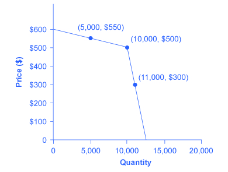
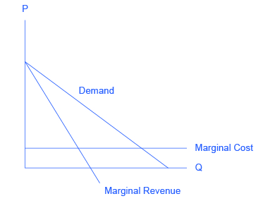

By the end of this section, you will be able to:

* Explain why and how oligopolies exist
* Contrast collusion and competition
* Interpret and analyze the prisoner’s dilemma diagram
* Evaluate the tradeoffs of imperfect competition

Many purchases that individuals make at the retail level are produced in markets that are neither perfectly competitive, monopolies, nor monopolistically competitive. Rather, they are oligopolies. **Oligopoly**{: data-type="term" .no-emphasis} arises when a small number of large firms have all or most of the sales in an industry. Examples of oligopoly abound and include the auto industry, cable television, and commercial air travel. Oligopolistic firms are like cats in a bag. They can either scratch each other to pieces or cuddle up and get comfortable with one another. If oligopolists compete hard, they may end up acting very much like perfect competitors, driving down costs and leading to zero profits for all. If oligopolists collude with each other, they may effectively act like a monopoly and succeed in pushing up prices and earning consistently high levels of profit. Oligopolies are typically characterized by mutual interdependence where various decisions such as output, price, advertising, and so on, depend on the decisions of the other firm(s). Analyzing the choices of oligopolistic firms about pricing and quantity produced involves considering the pros and cons of competition versus collusion at a given point in time.

# Why Do Oligopolies Exist?

A combination of the barriers to entry that create monopolies and the product differentiation that characterizes monopolistic competition can create the setting for an oligopoly. For example, when a government grants a patent for an invention to one firm, it may create a monopoly. When the government grants patents to, for example, three different pharmaceutical companies that each has its own drug for reducing high blood pressure, those three firms may become an oligopoly.

Similarly, a **natural monopoly**{: data-type="term" .no-emphasis} will arise when the quantity demanded in a market is only large enough for a single firm to operate at the minimum of the long-run average cost curve. In such a setting, the market has room for only one firm, because no smaller firm can operate at a low enough average cost to compete, and no larger firm could sell what it produced given the quantity demanded in the market.

**Quantity demanded**{: data-type="term" .no-emphasis} in the market may also be two or three times the quantity needed to produce at the minimum of the average cost curve—which means that the market would have room for only two or three oligopoly firms (and they need not produce differentiated products). Again, smaller firms would have higher average costs and be unable to compete, while additional large firms would produce such a high quantity that they would not be able to sell it at a profitable price. This combination of economies of scale and market demand creates the barrier to entry, which led to the Boeing-Airbus oligopoly for large passenger aircraft.

The product differentiation at the heart of monopolistic competition can also play a role in creating oligopoly. For example, firms may need to reach a certain minimum size before they are able to spend enough on advertising and marketing to create a recognizable brand name. The problem in competing with, say, Coca-Cola or Pepsi is not that producing fizzy drinks is technologically difficult, but rather that creating a brand name and marketing effort to equal Coke or Pepsi is an enormous task.

# Collusion or Competition?

When oligopoly firms in a certain market decide what quantity to produce and what price to charge, they face a temptation to act as if they were a monopoly. By acting together, oligopolistic firms can hold down industry output, charge a higher price, and divide up the profit among themselves. When firms act together in this way to reduce output and keep prices high, it is called **collusion**{: data-type="term"}. A group of firms that have a formal agreement to collude to produce the monopoly output and sell at the monopoly price is called a **cartel**{: data-type="term"}. See the following Clear It Up feature for a more in-depth analysis of the difference between the two.

Collusion versus cartels: How can I tell which is which?

In the United States, as well as many other countries, it is illegal for firms to collude since collusion is anti-competitive behavior, which is a violation of antitrust law. Both the **Antitrust Division of the Justice Department**{: data-type="term" .no-emphasis} and the **Federal Trade Commission**{: data-type="term" .no-emphasis} have responsibilities for preventing collusion in the United States.

The problem of enforcement is finding hard evidence of collusion. Cartels are formal agreements to collude. Because cartel agreements provide evidence of collusion, they are rare in the United States. Instead, most collusion is tacit, where firms implicitly reach an understanding that competition is bad for profits.

The desire of businesses to avoid competing so that they can instead raise the prices that they charge and earn higher profits has been well understood by economists. **Adam Smith**{: data-type="term" .no-emphasis} wrote in *Wealth of Nations* in 1776: “People of the same trade seldom meet together, even for merriment and diversion, but the conversation ends in a conspiracy against the public, or in some contrivance to raise prices.”

Even when oligopolists recognize that they would benefit as a group by acting like a monopoly, each individual oligopoly faces a private temptation to produce just a slightly higher quantity and earn slightly higher profit—while still counting on the other oligopolists to hold down their production and keep prices high. If at least some oligopolists give in to this temptation and start producing more, then the market price will fall. Indeed, a small handful of oligopoly firms may end up competing so fiercely that they all end up earning zero economic profits—as if they were perfect competitors.

# The Prisoner’s Dilemma

Because of the complexity of oligopoly, which is the result of mutual interdependence among firms, there is no single, generally-accepted theory of how oligopolies behave, in the same way that we have theories for all the other market structures. Instead, economists use **game theory**{: data-type="term"}, a branch of mathematics that analyzes situations in which players must make decisions and then receive payoffs based on what other players decide to do. Game theory has found widespread applications in the social sciences, as well as in business, law, and military strategy.

The **prisoner’s dilemma**{: data-type="term"} is a scenario in which the gains from cooperation are larger than the rewards from pursuing self-interest. It applies well to oligopoly. The story behind the prisoner’s dilemma goes like this:

\> Two co-conspiratorial criminals are arrested. When they are taken to the police station, they refuse to say anything and are put in separate interrogation rooms. Eventually, a police officer enters the room where Prisoner A is being held and says: “You know what? Your partner in the other room is confessing. So your partner is going to get a light prison sentence of just one year, and because you’re remaining silent, the judge is going to stick you with eight years in prison. Why don’t you get smart? If you confess, too, we’ll cut your jail time down to five years, and your partner will get five years, also.” Over in the next room, another police officer is giving exactly the same speech to Prisoner B. What the police officers do not say is that if both prisoners remain silent, the evidence against them is not especially strong, and the prisoners will end up with only two years in jail each.

The game theory situation facing the two prisoners is shown in [\[link\]](#Table_10_03). To understand the dilemma, first consider the choices from Prisoner A’s point of view. If A believes that B will confess, then A ought to confess, too, so as to not get stuck with the eight years in prison. But if A believes that B will not confess, then A will be tempted to act selfishly and confess, so as to serve only one year. The key point is that A has an incentive to confess regardless of what choice B makes! B faces the same set of choices, and thus will have an incentive to confess regardless of what choice A makes. Confess is considered the dominant strategy or the strategy an individual (or firm) will pursue regardless of the other individual’s (or firm’s) decision. The result is that if prisoners pursue their own self-interest, both are likely to confess, and end up doing a total of 10 years of jail time between them.

<table id="Table_10_03" summary="The table shows the prisoner&#x2019;s dilemma. The 4 column 4 row table is modified differently than a standard table. Rows 1 and 2 in Columns 1 and 2 are empty. Columns 3 and 4 show the options for Prisoner B. Rows 4 and 5 show the options for Prisoner A.  Prisoner B can either &#x201C;remain silent (cooperate with other prisoner)&#x201D; (column 3 row 2), or confess (not cooperate with other prisoner)&#x201D; (column 4 row 2). Prisoner A can either &#x201C;remain silent (cooperate with other prisoner)&#x201D; (column 2 row 3), or confess (not cooperate with other prisoner)&#x201D; (column 2 row 4). The possible outcomes are as follows: If both prisoners remain silent: A gets 2 years, B gets 2 years (column 3 row 3); if prisoner B remains silent but prisoner A confesses: A gets 8 years, B gets 1 year (column 3 row 4); if prisoner B confesses but prisoner A remains silent: A gets 1 year, b gets 8 years (column 4 row 3); if both prisoners confess: A gets 5 years, B gets 5 years (column 4 row 4)."><caption>The Prisoner’s Dilemma Problem</caption><tbody>
<tr>
<td rowspan="2" colspan="2" />
<td colspan="2">Prisoner B</td>
</tr>
<tr>

<td>Remain Silent (cooperate with other prisoner)</td>
<td>Confess (do not cooperate with other prisoner)</td>
</tr>

<tr>
<td rowspan="2">Prisoner A</td>
<td>Remain Silent (cooperate with other prisoner)</td>
<td>A gets 2 years, B gets 2 years</td>
<td>A gets 1 year, B gets 8 years</td>
</tr>

<tr>
<td>Confess (do not cooperate with other prisoner)</td>
<td>A gets 8 years, B gets 1 year</td>
<td>A gets 5 years B gets 5 years</td>
</tr>
</tbody></table>

The game is called a dilemma because if the two prisoners had cooperated by both remaining silent, they would only have had to serve a total of four years of jail time between them. If the two prisoners can work out some way of cooperating so that neither one will confess, they will both be better off than if they each follow their own individual self-interest, which in this case leads straight into longer jail terms.

# The Oligopoly Version of the Prisoner’s Dilemma

The members of an oligopoly can face a prisoner’s dilemma, also. If each of the oligopolists cooperates in holding down output, then high monopoly profits are possible. Each oligopolist, however, must worry that while it is holding down output, other firms are taking advantage of the high price by raising output and earning higher profits. [\[link\]](#Table_10_04) shows the prisoner’s dilemma for a two-firm oligopoly—known as a **duopoly**{: data-type="term"}. If Firms A and B both agree to hold down output, they are acting together as a monopoly and will each earn $1,000 in profits. However, both firms’ dominant strategy is to increase output, in which case each will earn $400 in profits.

<table id="Table_10_04" summary="The table shows the prisoner&#x2019;s dilemma for oligopolists. The 4 column 4 row table is modified differently than a standard table. Rows 1 and 2 in Columns 1 and 2 are empty. Columns 3 and 4 show the options for Firm B. Rows 4 and 5 show the options for Firm A.  Firm B can either &#x201C;hold down output (cooperate with other Firm)&#x201D; (column 3 row 2), or increase output (not cooperate with other Firm)&#x201D; (column 4 row 2). Firm A can either &#x201C;hold down output (cooperate with other Firm)&#x201D; (column 2 row 3), or increase output (not cooperate with other Firm)&#x201D; (column 2 row 4). The possible outcomes are as follows: If both Firms hold down output: A gets $1,000, B gets $1,000 (column 3 row 3); if Firm B holds down output but Firm A increases output : A gets $1,500 years, B gets $200 (column 3 row 4); if Firm B increases output but Firm A holds down output: A gets $200, B gets $1,500 (column 4 row 3); if both Firms increase output: A gets $400, B gets $400 (column 4 row 4)."><caption>A Prisoner’s Dilemma for Oligopolists</caption><tbody>
<tr>
<td rowspan="2" colspan="2" />
<td colspan="2">Firm B</td>
</tr>
<tr>

<td>Hold Down Output (cooperate with other firm)</td>
<td>Increase Output (do not cooperate with other firm)</td>
</tr>

<tr>
<td rowspan="2">Firm A</td>
<td>Hold Down Output (cooperate with other firm)</td>
<td>A gets $1,000, B gets $1,000</td>
<td>A gets $200, B gets $1,500</td>
</tr>
<tr>

<td>Increase Output (do not cooperate with other firm)</td>
<td>A gets $1,500, B gets $200</td>
<td>A gets $400, B gets $400</td>
</tr>
</tbody></table>

Can the two firms trust each other? Consider the situation of Firm A: If A thinks that B will cheat on their agreement and increase output, then A will increase output, too, because for A the profit of $400 when both firms increase output (the bottom right-hand choice in [\[link\]](#Table_10_04)) is better than a profit of only $200 if A keeps output low and B raises output (the upper right-hand choice in the table). If A thinks that B will cooperate by holding down output, then A may seize the opportunity to earn higher profits by raising output. After all, if B is going to hold down output, then A can earn $1,500 in profits by expanding output (the bottom left-hand choice in the table) compared with only $1,000 by holding down output as well (the upper left-hand choice in the table). 

Thus, firm A will reason that it makes sense to expand output if B holds down output and that it also makes sense to expand output if B raises output. Again, B faces a parallel set of decisions.

The result of this prisoner’s dilemma is often that even though A and B could make the highest combined profits by cooperating in producing a lower level of output and acting like a monopolist, the two firms may well end up in a situation where they each increase **output**{: data-type="term" .no-emphasis} and earn only $400 each in **profits**{: data-type="term" .no-emphasis}. The following Clear It Up feature discusses one cartel scandal in particular.

What is the Lysine cartel?

Lysine, a $600 million-a-year industry, is an amino acid used by farmers as a feed additive to ensure the proper growth of swine and poultry. The primary U.S. producer of lysine is Archer Daniels Midland (ADM), but several other large European and Japanese firms are also in this market. For a time in the first half of the 1990s, the world’s major lysine producers met together in hotel conference rooms and decided exactly how much each firm would sell and what it would charge. The U.S. Federal Bureau of Investigation (FBI), however, had learned of the cartel and placed wire taps on a number of their phone calls and meetings.

From FBI surveillance tapes, following is a comment that Terry Wilson, president of the corn processing division at ADM, made to the other lysine producers at a 1994 meeting in Mona, Hawaii:

\> I wanna go back and I wanna say something very simple. If we’re going to trust each other, okay, and if I’m assured that I’m gonna get 67,000 tons by the year’s end, we’re gonna sell it at the prices we agreed to . . . The only thing we need to talk about there because we are gonna get manipulated by these \[expletive\] buyers—they can be smarter than us if we let them be smarter. . . . They \[the customers\] are not your friend. They are not my friend. And we gotta have ‘em, but they are not my friends. You are my friend. I wanna be closer to you than I am to any customer. Cause you can make us ... money. ... And all I wanna tell you again is let’s—let’s put the prices on the board. Let’s all agree that’s what we’re gonna do and then walk out of here and do it.

The price of lysine doubled while the cartel was in effect. Confronted by the FBI tapes, Archer Daniels Midland pled guilty in 1996 and paid a fine of $100 million. A number of top executives, both at ADM and other firms, later paid fines of up to $350,000 and were sentenced to 24–30 months in prison.

In another one of the FBI recordings, the president of Archer Daniels Midland told an executive from another competing firm that ADM had a slogan that, in his words, had “penetrated the whole company.” The company president stated the slogan this way: “Our competitors are our friends. Our customers are the enemy.” That slogan could stand as the motto of cartels everywhere.

# How to Enforce Cooperation

How can parties who find themselves in a prisoner’s dilemma situation avoid the undesired outcome and cooperate with each other? The way out of a prisoner’s dilemma is to find a way to penalize those who do not cooperate.

Perhaps the easiest approach for colluding oligopolists, as you might imagine, would be to sign a contract with each other that they will hold output low and keep prices high. If a group of U.S. companies signed such a contract, however, it would be illegal. Certain international organizations, like the nations that are members of the **Organization of Petroleum Exporting Countries (OPEC)**{: data-type="term" .no-emphasis}, have signed international agreements to act like a monopoly, hold down output, and keep prices high so that all of the countries can make high profits from oil exports. Such agreements, however, because they fall in a gray area of international law, are not legally enforceable. If Nigeria, for example, decides to start cutting prices and selling more oil, Saudi Arabia cannot sue Nigeria in court and force it to stop.

Visit the Organization of the Petroleum Exporting Countries [website][1] and learn more about its history and how it defines itself.

 {: data-media-type="image/png"} 

Because oligopolists cannot sign a legally enforceable contract to act like a monopoly, the firms may instead keep close tabs on what other firms are producing and charging. Alternatively, oligopolists may choose to act in a way that generates pressure on each firm to stick to its agreed quantity of output.

One example of the pressure these firms can exert on one another is the **kinked demand curve**{: data-type="term"}, in which competing oligopoly firms commit to match price cuts, but not price increases. This situation is shown in [\[link\]](#CNX_Econ_C10_007). Say that an oligopoly airline has agreed with the rest of a cartel to provide a quantity of 10,000 seats on the New York to Los Angeles route, at a price of $500. This choice defines the kink in the firm’s perceived demand curve. The reason that the firm faces a kink in its demand curve is because of how the other oligopolists react to changes in the firm’s price. If the oligopoly decides to produce more and cut its price, the other members of the cartel will immediately match any price cuts—and therefore, a lower price brings very little increase in quantity sold.

If one **firm**{: data-type="term" .no-emphasis} cuts its price to $300, it will be able to sell only 11,000 seats. However, if the airline seeks to raise prices, the other oligopolists will not raise their prices, and so the firm that raised prices will lose a considerable share of sales. For example, if the firm raises its price to $550, its sales drop to 5,000 seats sold. Thus, if oligopolists always match price cuts by other firms in the cartel, but do not match price increases, then none of the oligopolists will have a strong incentive to change prices, since the potential gains are minimal. This strategy can work like a silent form of cooperation, in which the cartel successfully manages to hold down output, increase **price**{: data-type="term" .no-emphasis}, and share a monopoly level of profits even without any legally enforceable agreement.

 {: #CNX_Econ_C10_007 data-media-type="image/jpg" data-title="A Kinked Demand Curve "}

Many real-world oligopolies, prodded by economic changes, legal and political pressures, and the egos of their top executives, go through episodes of cooperation and competition. If oligopolies could sustain cooperation with each other on output and pricing, they could earn profits as if they were a single monopoly. However, each firm in an oligopoly has an incentive to produce more and grab a bigger share of the overall market; when firms start behaving in this way, the market outcome in terms of prices and quantity can be similar to that of a highly competitive market.

# Tradeoffs of Imperfect Competition

Monopolistic competition is probably the single most common market structure in the U.S. economy. It provides powerful incentives for innovation, as firms seek to earn profits in the short run, while entry assures that firms do not earn economic profits in the long run. However, monopolistically competitive firms do not produce at the lowest point on their average cost curves. In addition, the endless search to impress consumers through product differentiation may lead to excessive social expenses on advertising and marketing.

Oligopoly is probably the second most common market structure. When oligopolies result from patented innovations or from taking advantage of economies of scale to produce at low average cost, they may provide considerable benefit to consumers. Oligopolies are often buffeted by significant barriers to entry, which enable the oligopolists to earn sustained profits over long periods of time. Oligopolists also do not typically produce at the minimum of their average cost curves. When they lack vibrant competition, they may lack incentives to provide innovative products and high-quality service.

The task of public policy with regard to competition is to sort through these multiple realities, attempting to encourage behavior that is beneficial to the broader society and to discourage behavior that only adds to the profits of a few large companies, with no corresponding benefit to consumers. [Monopoly and Antitrust Policy](/m48661){: .target-chapter} discusses the delicate judgments that go into this task.

The Temptation to Defy the Law

Oligopolistic firms have been called “cats in a bag,” as this chapter mentioned. The French detergent makers chose to “cozy up” with each other. The result? An uneasy and tenuous relationship. When the *Wall Street Journal* reported on the matter, it wrote: “According to a statement a Henkel manager made to the \[French anti-trust\] commission, the detergent makers wanted ‘to limit the intensity of the competition between them and clean up the market.’ Nevertheless, by the early 1990s, a price war had broken out among them.” During the soap executives’ meetings, which sometimes lasted more than four hours, complex pricing structures were established. “One \[soap\] executive recalled ‘chaotic’ meetings as each side tried to work out how the other had bent the rules.” Like many cartels, the soap cartel disintegrated due to the very strong temptation for each member to maximize its own individual profits.

How did this soap opera end? After an investigation, French antitrust authorities fined Colgate-Palmolive, Henkel, and Proctor &amp; Gamble a total of €361 million ($484 million). A similar fate befell the icemakers. Bagged ice is a commodity, a perfect substitute, generally sold in 7- or 22-pound bags. No one cares what label is on the bag. By agreeing to carve up the ice market, control broad geographic swaths of territory, and set prices, the icemakers moved from perfect competition to a monopoly model. After the agreements, each firm was the sole supplier of bagged ice to a region; there were profits in both the long run and the short run. According to the courts: “These companies illegally conspired to manipulate the marketplace.” Fines totaled about $600,000—a steep fine considering a bag of ice sells for under $3 in most parts of the United States.

Even though it is illegal in many parts of the world for firms to set prices and carve up a market, the temptation to earn higher profits makes it extremely tempting to defy the law.

# Key Concepts and Summary

An oligopoly is a situation where a few firms sell most or all of the goods in a market. Oligopolists earn their highest profits if they can band together as a cartel and act like a monopolist by reducing output and raising price. Since each member of the oligopoly can benefit individually from expanding output, such collusion often breaks down—especially since explicit collusion is illegal.

The prisoner’s dilemma is an example of game theory. It shows how, in certain situations, all sides can benefit from cooperative behavior rather than self-interested behavior. However, the challenge for the parties is to find ways to encourage cooperative behavior.

# Self-Check Questions

Consider the curve shown in [[link]](#CNX_Econ_C10_010), which shows the market demand, marginal cost, and marginal revenue curve for firms in an oligopolistic industry. In this example, we assume firms have zero fixed costs. {: #CNX_Econ_C10_010 data-media-type="image/jpg"}

 Suppose the firms collude to form a cartel. What price will the cartel charge? What quantity will the cartel supply? How much profit will the cartel earn? Suppose now that the cartel breaks up and the oligopolistic firms compete as vigorously as possible by cutting the price and increasing sales. What will the industry quantity and price be? What will the collective profits be of all firms in the industry? Compare the equilibrium price, quantity, and profit for the cartel and cutthroat competition outcomes. 

If the firms form a cartel, they will act like a monopoly, choosing the quantity of output where MR = MC. Drawing a line from the monopoly quantity up to the demand curve shows the monopoly price. Assuming that fixed costs are zero, from [Cost and Industry Structure](/m48620){: .target-chapter}, we can infer that when the marginal cost curve is horizontal, average cost is the same as marginal cost. Thus, the cartel will earn positive economic profits equal to the area of the rectangle, with a base equal to the monopoly quantity and a height equal to the difference between price (on the demand above the monopoly quantity) and average cost, as shown in [[link]](#CNX_Econ_C10_011): {: #CNX_Econ_C10_011 data-media-type="image/jpg"}

 The firms will expand output and cut price as long as there are profits remaining. The long-run equilibrium will occur at the point where average cost equals demand. As a result, the oligopoly will earn zero economic profits due to “cutthroat competition,” as shown in [[link]](#CNX_Econ_C10_012). {: #CNX_Econ_C10_012 data-media-type="image/jpg"}

 Pc &gt; Pcc. Qc &lt; Qcc. Profit for the cartel is positive and large. Profit for cutthroat competition is zero. 

Sometimes oligopolies in the same industry are very different in size. Suppose we have a duopoly where one firm (Firm A) is large and the other firm (Firm B) is small, as shown in the prisoner’s dilemma box in [[link]](#Table_10_05). <table id="Table_10_05" summary="The table shows the prisoner&#x2019;s dilemma for a duopoly. The 4 column 4 row table is modified differently than a standard table. Rows 1 and 2 in Columns 1 and 2 are empty. Columns 3 and 4 show the options for Firm B. Rows 4 and 5 show the options for Firm A.  Firm B can either &#x201C;collude with Firm A&#x201D; (column 3 row 2), or &#x201C;cheat by selling more output&#x201D; (column 4 row 2). Firm A can either &#x201C;collude with Firm B&#x201D; (column 2 row 3), or &#x201C;cheat by selling more output&#x201D; (column 2 row 4). The possible outcomes are as follows: If both Firms collude with one another: A gets $1,000, B gets $100 (column 3 row 3); if Firm B holds colludes but Firm A cheats: A gets $1,050, B gets $50 (column 3 row 4); if Firm B cheats but Firm A colludes: A gets $800, B gets $200 (column 4 row 3); if both Firms cheat: A gets $500, B gets $20 (column 4 row 4)."><caption /><tbody>
<tr>
<td />
<td>Firm B colludes with Firm A</td>
<td>Firm B cheats by selling more output</td>
</tr>

<tr>
<td>Firm A colludes with Firm B</td>
<td>A gets $1,000, B gets $100</td>
<td>A gets $800, B gets $200</td>
</tr>
<tr>
<td>Firm A cheats by selling more output</td>
<td>A gets $1,050, B gets $50</td>
<td>A gets $500, B gets $20</td>
</tr>
</tbody></table>

 Assuming that the payoffs are known to both firms, what is the likely outcome in this case?

Firm B reasons that if it cheats and Firm A does not notice, it will double its money. Since Firm A’s profits will decline substantially, however, it is likely that Firm A will notice and if so, Firm A will cheat also, with the result that Firm B will lose 90% of what it gained by cheating. Firm A will reason that Firm B is unlikely to risk cheating. If neither firm cheats, Firm A earns $1000. If Firm A cheats, assuming Firm B does not cheat, A can boost its profits only a little, since Firm B is so small. If both firms cheat, then Firm A loses at least 50% of what it could have earned. The possibility of a small gain ($50) is probably not enough to induce Firm A to cheat, so in this case it is likely that both firms will collude.

# Review Questions

Will the firms in an oligopoly act more like a monopoly or more like competitors? Briefly explain.

Does each individual in a prisoner’s dilemma benefit more from cooperation or from pursuing self-interest? Explain briefly.

What stops oligopolists from acting together as a monopolist and earning the highest possible level of profits?

# Critical Thinking Questions

Would you expect the kinked demand curve to be more extreme (like a right angle) or less extreme (like a normal demand curve) if each firm in the cartel produces a near-identical product like OPEC and petroleum? What if each firm produces a somewhat different product? Explain your reasoning.

When OPEC raised the price of oil dramatically in the mid-1970s, experts said it was unlikely that the cartel could stay together over the long term—that the incentives for individual members to cheat would become too strong. More than forty years later, OPEC still exists. Why do you think OPEC has been able to beat the odds and continue to collude? *Hint:* You may wish to consider non-economic reasons.

# Problems

Mary and Raj are the only two growers who provide organically grown corn to a local grocery store. They know that if they cooperated and produced less corn, they could raise the price of the corn. If they work independently, they will each earn $100. If they decide to work together and both lower their output, they can each earn $150. If one person lowers output and the other does not, the person who lowers output will earn $0 and the other person will capture the entire market and will earn $200. [[link]](#Table_10_06) represents the choices available to Mary and Raj. What is the best choice for Raj if he is sure that Mary will cooperate? If Mary thinks Raj will cheat, what should Mary do and why? What is the prisoner’s dilemma result? What is the preferred choice if they could ensure cooperation? A = Work independently; B = Cooperate and Lower Output. (Each results entry lists Raj’s earnings first, and Mary's earnings second.) <table id="Table_10_06" summary="The table shows the prisoner&#x2019;s dilemma for Mary and Raj. The 4 column 4 row table is modified differently than a standard table. Rows 1 and 2 in Columns 1 and 2 are empty. Columns 3 and 4 show the options for Mary. Rows 4 and 5 show the options for Raj.  Mary can either work independently (column 3 row 2), or cooperate and lower output (column 4 row 2). Raj can either work independently (column 2 row 3), or cooperate and lower output (column 2 row 4). The possible outcomes are as follows: If both Mary and Raj work independently: the result is $100, $100 (column 3 row 3); if Mary works independently but Raj cooperates and lowers output: the result is $0, $200 (column 3 row 4). If Mary stays cooperates and lowers output but Raj works independently: the result is $200, $0 (column 4 row 3); if both Mary and Raj cooperate and lower output: the result is $150, $150"><tbody>
<tr>
<td rowspan="2" colspan="2" />
<td colspan="2">Mary</td>
</tr>
<tr>

<td>A</td>
<td>B</td>
</tr>

<tr>
<td rowspan="2">Raj</td>
<td>A</td>
<td>($100, $100)</td>
<td>($200, $0)</td>
</tr>
<tr>

<td>B</td>
<td>($0, $200)</td>
<td>($150, $150)</td>
</tr>
</tbody></table>

Jane and Bill are apprehended for a bank robbery. They are taken into separate rooms and questioned by the police about their involvement in the crime. The police tell them each that if they confess and turn the other person in, they will receive a lighter sentence. If they both confess, they will be each be sentenced to 30 years. If neither confesses, they will each receive a 20-year sentence. If only one confesses, the confessor will receive 15 years and the one who stayed silent will receive 35 years. [[link]](#Table_10_07) below represents the choices available to Jane and Bill. If Jane trusts Bill to stay silent, what should she do? If Jane thinks that Bill will confess, what should she do? Does Jane have a dominant strategy? Does Bill have a dominant strategy? A = Confess; B = Stay Silent. (Each results entry lists Jane’s sentence first (in years), and Bill's sentence second.) <table id="Table_10_07" summary="The table shows the prisoner&#x2019;s dilemma for Jane and Bill. The 4 column 4 row table is modified differently than a standard table. Rows 1 and 2 in Columns 1 and 2 are empty. Columns 3 and 4 show the options for Jane. Rows 4 and 5 show the options for Bill.  Jane can either confess (column 3 row 2), or stay silent (column 4 row 2). Bill can either confess (column 2 row 3), or stay silent (column 2 row 4). The possible outcomes are as follows: If both Jane and Bill confess: the sentence is 30, 30 (column 3 row 3); if Jane confesses but bill stays silent: the sentence is 35, 15 (column 3 row 4). If Jane stays silent but Bill confesses: the sentences is 15, 35 (column 4 row 3); if both Jane and Bill stay silent: the sentence is 20, 20 (column 4 row 4)."><tbody>
<tr>
<td rowspan="2" colspan="2" />
<td colspan="2">Jane</td>
</tr>
<tr>

<td>A</td>
<td>B</td>
</tr>

<tr>
<td rowspan="2">Bill</td>
<td>A</td>
<td>(30, 30)</td>
<td>(15, 35)</td>
</tr>
<tr>

<td>B</td>
<td>(35, 15)</td>
<td>(20, 20)</td>
</tr>
</tbody></table>

# References

The United States Department of Justice. “Antitrust Division.” Accessed October 17, 2013. http://www.justice.gov/atr/.

Federal Trade Commission. “About the Federal Trade Commission.” Accessed October 17, 2013. http://www.ftc.gov/ftc/about.shtm.

[1]: http://openstaxcollege.org/l/OPEC
