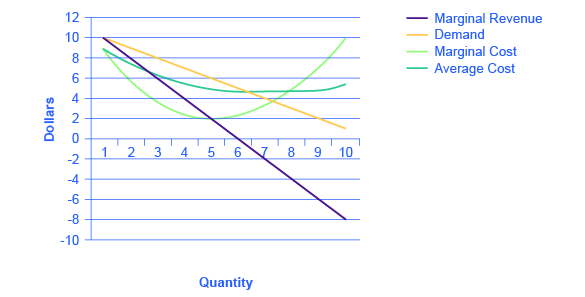

By the end of this section, you will be able to:

* Evaluate the appropriate competition policy for a natural monopoly
* Interpret a graph of regulatory choices
* Contrast cost-plus and price cap regulation

Most true monopolies today in the U.S. are regulated, natural monopolies. A natural monopoly poses a difficult challenge for competition policy, because the structure of costs and demand seems to make competition unlikely or costly. A **natural monopoly**{: data-type="term" .no .emphasis} arises when average costs are declining over the range of production that satisfies market demand. This typically happens when fixed costs are large relative to variable costs. As a result, one firm is able to supply the total quantity demanded in the market at lower cost than two or more firms—so splitting up the natural monopoly would raise the average cost of production and force customers to pay more.

Public utilities, the companies that have traditionally provided water and electrical service across much of the United States, are leading examples of natural monopoly. It would make little sense to argue that a local water company should be broken up into several competing companies, each with its own separate set of pipes and water supplies. Installing four or five identical sets of pipes under a city, one for each water company, so that each household could choose its own water provider, would be terribly costly. The same argument applies to the idea of having many competing companies for delivering electricity to homes, each with its own set of wires. Before the advent of wireless phones, the argument also applied to the idea of many different phone companies, each with its own set of phone wires running through the neighborhood.

# The Choices in Regulating a Natural Monopoly

So what then is the appropriate competition policy for a natural monopoly? [\[link\]](#CNX_Econ_C11_003) illustrates the case of natural monopoly, with a market demand curve that cuts through the downward-sloping portion of the **average cost curve**{: data-type="term" .no .emphasis}. Points A, B, C, and F illustrate four of the main choices for regulation. [\[link\]](#Table_11_05) outlines the regulatory choices for dealing with a natural monopoly.

  equals marginal costs (MC) and by then looking to the market demand curve to see what price to charge for this quantity. This monopoly will produce at point A, with a quantity of 4 and a price of 9.3. If antitrust regulators split this company exactly in half, then each half would produce at point B, with average costs of 9.75 and output of 2. The regulators might require the firm to produce where marginal cost crosses the market demand curve at point C. However, if the firm is required to produce at a quantity of 8 and sell at a price of 3.5, the firm will suffer from losses. The most likely choice is point F, where the firm is required to produce a quantity of 6 and charge a price of 6.5."){: #CNX_Econ_C11_003 data-title="Regulatory Choices in Dealing with Natural Monopoly "}

<table id="Table_11_05" summary="The table has 9 rows and 7 columns. Each row represents a quantity from 1 to 9. Column 2 lists the price for each quantity starting at quantity of 1 and ending at 9: 14.7, 12.4, 10.6, 9.3, 8, 6.5, 5, 3.5, 2. Column 3 Total Revenue: 14.7, 24.7, 31.7, 37.2, 40, 39, 35, 28, 18. Column 4 Marginal Revenue: nil, 10, 7, 5.5, 2.8, negative 1, negative 4, negative 7, negative 10. Column 5 Total Cost: 11, 19.5, 25.5, 31, 35, 39, 42, 45.5, 49.5. Column 6 Marginal Cost: nil, 8.5, 6, 5.5, 4, 4, 3, 3.5, 4. Column 7 Average Cost: 11, 9.75, 8.5, 7.75, 7, 6.5, 6, 5.7, 5.5"><caption>Regulatory Choices in Dealing with Natural Monopoly(*Total Revenue is given by multiplying price and quantity. However, some of the price values in this table have been rounded for ease of presentation.)</caption><thead>
<tr>
<th>Quantity</th>
<th>Price</th>
<th>Total Revenue*</th>
<th>Marginal Revenue</th>
<th>Total Cost</th>
<th>Marginal Cost</th>
<th>Average Cost</th>
</tr>
</thead><tbody>
<tr>
<td>1</td>
<td>14.7</td>
<td>14.7</td>
<td>-</td>
<td>11.0</td>
<td>-</td>
<td>11.00</td>
</tr>

<tr>
<td>2</td>
<td>12.4</td>
<td>24.7</td>
<td>10.0</td>
<td>19.5</td>
<td>8.5</td>
<td>  9.75</td>
</tr>
<tr>
<td>3</td>
<td>10.6</td>
<td>31.7</td>
<td>7.0</td>
<td>25.5</td>
<td>6.0</td>
<td>  8.50</td>
</tr>

<tr>
<td>4</td>
<td>  9.3</td>
<td>37.2</td>
<td>5.5</td>
<td>31.0</td>
<td>5.5</td>
<td>  7.75</td>
</tr>

<tr>
<td>5</td>
<td>  8.0</td>
<td>40.0</td>
<td>2.8</td>
<td>35.0</td>
<td>4.0</td>
<td>  7.00</td>
</tr>

<tr>
<td>6</td>
<td>  6.5</td>
<td>39.0</td>
<td>  –1.0</td>
<td>39.0</td>
<td>4.0</td>
<td>  6.50</td>
</tr>

<tr>
<td>7</td>
<td>  5.0</td>
<td>35.0</td>
<td>  –4.0</td>
<td>42.0</td>
<td>3.0</td>
<td>  6.00</td>
</tr>

<tr>
<td>8</td>
<td>  3.5</td>
<td>28.0</td>
<td>  –7.0</td>
<td>45.5</td>
<td>3.5</td>
<td>  5.70</td>
</tr>

<tr>
<td>9</td>
<td>  2.0</td>
<td>18.0</td>
<td>  –10.0</td>
<td>49.5</td>
<td>4.0</td>
<td>  5.5</td>
</tr>
</tbody></table>

The first possibility is to leave the natural monopoly alone. In this case, the monopoly will follow its normal approach to maximizing profits. It determines the quantity where MR = MC, which happens at point P at a quantity of 4. The firm then looks to point A on the demand curve to find that it can charge a price of 9.3 for that profit-maximizing quantity. Since the price is above the average cost curve, the natural monopoly would earn economic profits.

A second outcome arises if antitrust authorities decide to divide the company, so that the new firms can compete. As a simple example, imagine that the company is cut in half. Thus, instead of one large firm producing a quantity of 4, two half-size firms each produce a quantity of 2. Because of the declining average cost curve (AC), the average cost of production for each of the half-size companies each producing 2, as shown at point B, would be 9.75, while the average cost of production for a larger firm producing 4 would only be 7.75. Thus, the economy would become less productively efficient, since the good is being produced at a higher average cost. In a situation with a downward-sloping average cost curve, two smaller firms will always have higher average costs of production than one larger firm for any quantity of total output. In addition, the antitrust authorities must worry that splitting the natural monopoly into pieces may be only the start of their problems. If one of the two firms grows larger than the other, it will have lower average costs and may be able to drive its competitor out of the market. Alternatively, two firms in a market may discover subtle ways of coordinating their behavior and keeping prices high. Either way, the result will not be the greater competition that was desired.

A third alternative is that regulators may decide to set prices and quantities produced for this industry. The regulators will try to choose a point along the market demand curve that benefits both consumers and the broader social interest. Point C illustrates one tempting choice: the regulator requires that the firm produce the quantity of output where marginal cost crosses the demand curve at an output of 8, and charge the price of 3.5, which is equal to **marginal cost**{: data-type="term" .no .emphasis} at that point. This rule is appealing because it requires price to be set equal to marginal cost, which is what would occur in a perfectly competitive market, and it would assure consumers a higher quantity and lower price than at the monopoly choice A. In fact, efficient allocation of resources would occur at point C, since the value to the consumers of the last unit bought and sold in this market is equal to the marginal cost of producing it.

Attempting to bring about point C through force of regulation, however, runs into a severe difficulty. At point C, with an output of 8, a price of 3.5 is below the average cost of production, which is 5.7, and so if the firm charges a price of 3.5, it will be suffering losses. Unless the regulators or the government offer the firm an ongoing public subsidy (and there are numerous political problems with that option), the firm will lose money and go out of business.

Perhaps the most plausible option for the regulator is point F; that is, to set the price where AC crosses the demand curve at an output of 6 and a price of 6.5. This plan makes some sense at an intuitive level: let the natural monopoly charge enough to cover its average costs and earn a normal rate of profit, so that it can continue operating, but prevent the firm from raising prices and earning abnormally high monopoly profits, as it would at the monopoly choice A. Of course, determining this level of output and price with the political pressures, time constraints, and limited information of the real world is much harder than identifying the point on a graph. For more on the problems that can arise from a centrally determined price, see the discussion of price floors and price ceilings in [Demand and Supply](/m48628){: .target-chapter}.

# Cost-Plus versus Price Cap Regulation

Indeed, regulators of public utilities for many decades followed the general approach of attempting to choose a point like F in [\[link\]](#CNX_Econ_C11_003). They calculated the average cost of production for the water or electricity companies, added in an amount for the normal rate of profit the firm should expect to earn, and set the price for consumers accordingly. This method was known as **cost-plus regulation**{: data-type="term"}.

Cost-plus regulation raises difficulties of its own. If producers are reimbursed for their costs, plus a bit more, then at a minimum, producers have less reason to be concerned with high costs—because they can just pass them along in higher prices. Worse, firms under cost-plus regulation even have an incentive to generate high costs by building huge factories or employing lots of staff, because what they can charge is linked to the costs they incur.

Thus, in the 1980s and 1990s, some regulators of public utilities began to use **price cap regulation**{: data-type="term"}, where the regulator sets a price that the firm can charge over the next few years. A common pattern was to require a price that declined slightly over time. If the firm can find ways of reducing its costs more quickly than the price caps, it can make a high level of profits. However, if the firm cannot keep up with the price caps or suffers bad luck in the market, it may suffer losses. A few years down the road, the regulators will then set a new series of price caps based on the firm’s performance.

Price cap regulation requires delicacy. It will not work if the price regulators set the price cap unrealistically low. It may not work if the market changes dramatically so that the firm is doomed to incurring losses no matter what it does—say, if energy prices rise dramatically on world markets, then the company selling natural gas or heating oil to homes may not be able to meet price caps that seemed reasonable a year or two ago. But if the regulators compare the prices with producers of the same good in other areas, they can, in effect, pressure a natural monopoly in one area to compete with the prices being charged in other areas. Moreover, the possibility of earning greater profits or experiencing losses—instead of having an average rate of profit locked in every year by cost-plus regulation—can provide the natural monopoly with incentives for efficiency and innovation.

With natural monopoly, market competition is unlikely to take root, so if consumers are not to suffer the high prices and restricted output of an unrestricted monopoly, government regulation will need to play a role. In attempting to design a system of price cap regulation with flexibility and incentive, government regulators do not have an easy task.

# Key Concepts and Summary

In the case of a natural monopoly, market competition will not work well and so, rather than allowing an unregulated monopoly to raise price and reduce output, the government may wish to regulate price and/or output. Common examples of regulation are public utilities, the regulated firms that often provide electricity and water service.

Cost-plus regulation refers to government regulation of a firm which sets the price that a firm can charge over a period of time by looking at the firm’s accounting costs and then adding a normal rate of profit. Price cap regulation refers to government regulation of a firm where the government sets a price level several years in advance. In this case, the firm can either make high profits if it manages to produce at lower costs or sell a higher quantity than expected or suffer low profits or losses if costs are high or it sells less than expected.

# Self-Check Questions

Urban transit systems, especially those with rail systems, typically experience significant economies of scale in operation. Consider the transit system whose data is given in the [[link]](#Table_11_06). Note that the quantity is in millions of riders.

| **Demand:** | **Quantity** | 1 | 2 | 3 | 4 | 5 | 6 | 7 | 8 | 9 | 10 |
|  | **Price** | 10 | 9 | 8 | 7 | 6 | 5 | 4 | 3 | 2 | 1 |
|  | **Marginal Revenue** | 10 | 8 | 6 | 4 | 2 | 0 | –2 | –4 | –6 | –8 |
| **Costs:** | **Marginal Cost** | 9 | 6 | 5 | 3 | 2 | 3 | 4 | 5 | 7 | 10 |
|  | **Average Cost** | 9 | 7.5 | 6.7 | 5.8 | 5 | 4.7 | 4.6 | 4.6 | 4.9 | 5.4 |
{: #Table_11_06 summary="The table compares the demand and cost per millions of riders. The top row lists quantity from 1 to 10 million riders, per million. The following rows of the table are: Row 2 price = 10, 9, 8, 7, 6, 5, 4, 3, 2, 1. Row 3 Marginal Revenue = 10, 8, 6, 4, 2, 0, negative 2, negative 4, negative 6, negative 8. Row 4 Marginal Cost = 9, 6, 5, 3, 2, 3, 4, 5, 7, 10. And Row 5 Average Cost = 9, 7.5, 6.7, 5.8, 5, 4.7, 4.6, 4.6, 4.9, 5.4."}

Draw the demand, marginal revenue, marginal cost, and average cost curves. Do they have the normal shapes?

Yes, all curves have normal shapes.

{: #CNX_Econ_C11_005}

From the graph you drew to answer [[link]](#fs-idm35141040), would you say this transit system is a natural monopoly? Justify.

Yes it is a natural monopoly because average costs decline over the range that satisfies the market demand. For example, at the point where the demand curve and the average cost curve meet, there are economies of scale.

# Review Questions

If public utilities are a natural monopoly, what would be the danger in deregulating them?

If public utilities are a natural monopoly, what would be the danger in splitting them up into a number of separate competing firms?

What is cost-plus regulation?

What is price cap regulation?

# Critical Thinking Questions

In the middle of the twentieth century, major U.S. cities had multiple competing city bus companies. Today, there is usually only one and it runs as a subsidized, regulated monopoly. What do you suppose caused the change?

Why are urban areas willing to subsidize urban transit systems? Does the argument for subsidies make sense to you?

# Problems

Use [\[link\]](#Table_11_06) to answer the following questions.

If the transit system was allowed to operate as an unregulated monopoly, what output would it supply and what price would it charge?

If the transit system was regulated to operate with no subsidy (i.e., at zero economic profit), what approximate output would it supply and what approximate price would it charge?

If the transit system was regulated to provide the most allocatively efficient quantity of output, what output would it supply and what price would it charge? What subsidy would be necessary to insure this efficient provision of transit services?

