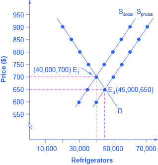

By the end of this section, you will be able to:

* Explain and give examples of positive and negative externalities
* Identify equilibrium price and quantity
* Evaluate how firms can contribute to market failure

From 1970 to 2012, the U.S. population increased by one-third and the size of the U.S. economy more than doubled. Since the 1970s, however, the United States, using a variety of anti-pollution policies, has made genuine progress against a number of pollutants. [\[link\]](#Table_12_01) lists users of energy—from residential to industrial—the types of fuels each used, and the emissions from each, according to the U.S. Energy Information Administration (EIA). The table shows that emissions of certain key air pollutants declined substantially from 2007 to 2012; they dropped 730 million metric tons (MMT) a year—a 12% reduction. This seems to indicate that progress has been made in the United States in reducing overall carbon dioxide emissions, which cause greenhouse gases.

<table id="Table_12_01" summary="The table has 6 rows of data, each representing a sector (Residential, Commercial, Industrial, Transportation, Power, and the change from 2007 to 2012). The header row lists the 5 columns of data for each sector (Primary Fossil Fuels, which encompass the first 3 columns: Coal, Petroleum and Natural Gas. Purchased Electric Power is the fourth column and Total Primary Fossil Fuels is the fifth. The data for Residential is negative 0, negative 14, negative 31, negative 134, negative 179. Commercial is negative 2, negative 2, negative 7, negative 126, negative 136. Industrial is negative 40, negative 62, 31, negative 118, negative 191. Transportation is 0, negative 228, 5, negative 1, negative 224. Power is negative 464, negative 36, negative 122, nil, nil. The change from 2007-2012 is negative 508, negative 342, 121,  negative 378, and negative 730."><caption>U.S. Carbon Dioxide (CO2) Emissions from Fossil Fuels Consumed 2007–2012, Million Metric Tons (MMT) per Year(Source: EIA Monthly Energy Review)</caption><thead>
<tr>
<th />
<th colspan="3">Primary Fossil Fuels</th>
<th>Purchased Electric Power</th>
<th>Total Primary Fossil Fuels</th>
</tr>

</thead><tbody>
<tr>
<td>End-use Sector</td>
<td>Coal</td>
<td>Petroleum</td>
<td>Natural Gas</td>
<td />
<td />
</tr>
<tr>
<td>Residential</td>
<td>(0)</td>
<td>(14)</td>
<td>(31)</td>
<td>(134)</td>
<td>(179)</td>
</tr>
<tr>
<td>Commercial</td>
<td>(2)</td>
<td>(2)</td>
<td>(7)</td>
<td>(126)</td>
<td>(136)</td>
</tr>
<tr>
<td>Industrial </td>
<td>(40)</td>
<td>(62)</td>
<td>31</td>
<td>(118)</td>
<td>(191)</td>
</tr>
<tr>
<td>Transportation</td>
<td>0</td>
<td>(228)</td>
<td>5</td>
<td>(1)</td>
<td>(224)</td>
</tr>
<tr>
<td>Power </td>
<td>(464)</td>
<td>(36)</td>
<td>(122)</td>
<td>-</td>
<td>-</td>
</tr>
<tr>
<td>Change 2007–2012</td>
<td>(508)</td>
<td>(342)</td>
<td>121</td>
<td>(378)</td>
<td>(730)</td>
</tr>
</tbody></table>

Despite the gradual reduction in emissions from fossil fuels, many important environmental issues remain. Along with the still high levels of air and water pollution, other issues include hazardous waste disposal, destruction of wetlands and other wildlife habitats, and the impact on human health from pollution.

# Externalities

**Private markets**{: data-type="term" .no-emphasis}, such as the cell phone industry, offer an efficient way to put buyers and sellers together and determine what goods are produced, how they are produced, and who gets them. The principle that voluntary exchange benefits both buyers and sellers is a fundamental building block of the economic way of thinking. But what happens when a voluntary exchange affects a third party who is neither the buyer nor the seller?

As an example, consider a concert producer who wants to build an outdoor arena that will host country music concerts a half-mile from your neighborhood. You will be able to hear these outdoor concerts while sitting on your back porch—or perhaps even in your dining room. In this case, the sellers and buyers of concert tickets may both be quite satisfied with their voluntary exchange, but you have no voice in their market transaction. The effect of a market exchange on a third party who is outside or “external” to the exchange is called an **externality**{: data-type="term"}. Because externalities that occur in market transactions affect other parties beyond those involved, they are sometimes called **spillovers**{: data-type="term"}.

Externalities can be negative or positive. If you hate country music, then having it waft into your house every night would be a **negative externality**{: data-type="term"}. If you love country music, then what amounts to a series of free concerts would be a **positive externality**{: data-type="term"}.

# Pollution as a Negative Externality

Pollution is a negative externality. Economists illustrate the **social costs**{: data-type="term"} of production with a demand and supply diagram. The social costs include the private costs of production incurred by the company and the external costs of pollution that are passed on to society. [\[link\]](#CNX_Econ_C12_001) shows the demand and supply for manufacturing refrigerators. The demand curve (D) shows the quantity demanded at each price. The supply curve (Sprivate) shows the quantity of refrigerators supplied by all the firms at each price if they are taking only their private costs into account and they are allowed to emit pollution at zero cost. The market equilibrium (E0), where quantity supplied and quantity demanded are equal, is at a price of $650 and a quantity of 45,000. This information is also reflected in the first three columns of [\[link\]](#Table_12_02).

 {: #CNX_Econ_C12_001 data-media-type="image/jpeg" data-title="Taking Social Costs into Account: A Supply Shift "}

<table id="Table_12_02" summary="The table has 7 rows and 4 columns of data. Column 1 is Price, Column 2 is Quantity Demanded, Column 3 is Quantity Supplied before Considering Pollution Cost and Column 4 is Quantity Supplied after Considering Pollution Cost. For a price of $600 the data is 50,000, 40,000, and 30,000. For $650 (45,000, 45,000,  30,000). For $700 (40,000, 50,000, 40,000). For $750 (35,000, 55,000, 45,000). For $800 (30,000, 60,000, 50,000). For $850 (25,000, 65,000, 55,000). For $900 (20,000, 70,000, 60,000)"><caption>A Supply Shift Caused by Pollution Costs</caption><thead>
<tr>
<th>Price</th>
<th>Quantity Demanded</th>
<th>Quantity Supplied before Considering Pollution Cost</th>
<th>Quantity Supplied after Considering Pollution Cost</th>
</tr>
</thead><tbody>
<tr>
<td>$600</td>
<td>50,000</td>
<td>40,000</td>
<td>30,000</td>
</tr>
<tr>
<td>$650</td>
<td>45,000</td>
<td>45,000</td>
<td>35,000</td>
</tr>
<tr>
<td>$700</td>
<td>40,000</td>
<td>50,000</td>
<td>40,000</td>
</tr>
<tr>
<td>$750</td>
<td>35,000</td>
<td>55,000</td>
<td>45,000</td>
</tr>
<tr>
<td>$800</td>
<td>30,000</td>
<td>60,000</td>
<td>50,000</td>
</tr>
<tr>
<td>$850</td>
<td>25,000</td>
<td>65,000</td>
<td>55,000</td>
</tr>
<tr>
<td>$900</td>
<td>20,000</td>
<td>70,000</td>
<td>60,000</td>
</tr>
</tbody></table>

However, as a by-product of the metals, plastics, chemicals and energy that are used in manufacturing refrigerators, some pollution is created. Let’s say that, if these pollutants were emitted into the air and water, they would create costs of $100 per refrigerator produced. These costs might occur because of injuries to human health, property values, wildlife habitat, reduction of recreation possibilities, or because of other negative impacts. In a market with no anti-pollution restrictions, firms can dispose of certain wastes absolutely free. Now imagine that firms which produce refrigerators must factor in these **external costs**{: data-type="term" .no-emphasis} of pollution—that is, the firms have to consider not only the costs of labor and materials needed to make a refrigerator, but also the broader costs to society of injuries to health and other values caused by pollution. If the firm is required to pay $100 for the **additional external costs**{: data-type="term"} of pollution each time it produces a refrigerator, production becomes more costly and the entire supply curve shifts up by $100.

As illustrated in the fourth column of [\[link\]](#Table_12_02) and in [\[link\]](#CNX_Econ_C12_001), the firm will need to receive a price of $700 per refrigerator and produce a quantity of 40,000—and the firm’s new supply curve will be Ssocial. The new equilibrium will occur at E1, taking the additional external costs of pollution into account results in a higher price, a lower quantity of production, and a lower quantity of pollution. The following Work It Out feature will walk you through an example, this time with musical accompaniment.

Identifying the Equilibrium Price and Quantity

[\[link\]](#Table_12_03) shows the supply and demand conditions for a firm that will play trumpets on the streets when requested. Output is measured as the number of songs played.

<table id="Table_12_03" summary="The table has 7 rows and 4 columns. The header row (Row 1) is Price, Quantity Demanded, Quantity Supplied Without Paying the Costs of the Externality, and Quantity Supplied after Paying the Costs of the Externality. Row 2: $20, 0, 10, 8. Row 3: $18, 1, 9, 7. Row 4: $15, 2.5, 7.5, 5.5. Row 5: $12, 4, 6, 4, Row 6: $10, 5, 5, 3. Row 7: $5, 7.5, 2.5, 0.5"><caption>Supply and Demand Conditions for a Trumpet-Playing Firm</caption><thead>
<tr>
<th>Price</th>
<th>Quantity Demanded</th>
<th>Quantity Supplied without paying the costs of the externality</th>
<th>Quantity Supplied after paying the costs of the externality</th>
</tr>
</thead><tbody>
<tr>
<td>$20</td>
<td>0</td>
<td>10</td>
<td>8</td>
</tr>
<tr>
<td>$18</td>
<td>1</td>
<td>9</td>
<td>7</td>
</tr>
<tr>
<td>$15</td>
<td>2.5</td>
<td>7.5</td>
<td>5.5</td>
</tr>
<tr>
<td>$12</td>
<td>4</td>
<td>6</td>
<td>4</td>
</tr>
<tr>
<td>$10</td>
<td>5</td>
<td>5</td>
<td>3</td>
</tr>
<tr>
<td>$5</td>
<td>7.5</td>
<td>2.5</td>
<td>0.5</td>
</tr>
</tbody></table>
Step 1. Determine the negative externality in this situation. To do this, you must think about the situation described and consider all parties that might be impacted. A negative externality might be the increase in noise pollution in the area where the firm is playing.

Step 2. Identify the equilibrium price and quantity when only private costs are taken into account, and then when social costs are taken into account. Remember that equilibrium is where the quantity demanded is equal to the quantity supplied.

Step 3. Look down the columns to where the quantity demanded (the second column) is equal to the “quantity supplied without paying the costs of the externality” (the third column). Then refer to the first column of that row to determine the equilibrium price. In this case, the equilibrium price and quantity when only private costs are taken into account would be at a price of $10 and a quantity of five.

Step 4. Identify the equilibrium price and quantity when the additional external costs are taken into account. Look down the columns of quantity demanded (the second column) and the “quantity supplied after paying the costs of the externality” (the fourth column) then refer to the first column of that row to determine the equilibrium price. In this case, the equilibrium will be at a price of $12 and a quantity of four.

Step 5. Consider how taking the externality into account affects the equilibrium price and quantity. Do this by comparing the two equilibrium situations. If the firm is forced to pay its additional external costs, then production of trumpet songs becomes more costly, and the supply curve will shift up.

Remember that the supply curve is based on choices about production that firms make while looking at their marginal costs, while the demand curve is based on the benefits that individuals perceive while maximizing utility. If no externalities existed, private costs would be the same as the costs to society as a whole, and private benefits would be the same as the benefits to society as a whole. Thus, if no externalities existed, the interaction of demand and supply will coordinate social costs and benefits.

However, when the externality of pollution exists, the supply curve no longer represents all social costs. Because externalities represent a case where markets no longer consider all social costs, but only some of them, economists commonly refer to externalities as an example of **market failure**{: data-type="term"}. When there is market failure, the private market fails to achieve efficient output, because either firms do not account for all costs incurred in the production of output and/or consumers do not account for all benefits obtained (a positive externality). In the case of pollution, at the market output, social costs of production exceed social benefits to consumers, and the market produces too much of the product.

We can see a general lesson here. If firms were required to pay the social costs of pollution, they would create less pollution but produce less of the product and charge a higher price. In the next module, we will explore how governments require firms to take the social costs of pollution into account.

# Key Concepts and Summary

Economic production can cause environmental damage. This tradeoff arises for all countries, whether high-income or low-income, and whether their economies are market-oriented or command-oriented.

An externality occurs when an exchange between a buyer and seller has an impact on a third party who is not part of the exchange. An externality, which is sometimes also called a spillover, can have a negative or a positive impact on the third party. If those parties imposing a negative externality on others had to take the broader social cost of their behavior into account, they would have an incentive to reduce the production of whatever is causing the negative externality. In the case of a positive externality, the third party is obtaining benefits from the exchange between a buyer and a seller, but they are not paying for these benefits. If this is the case, then markets would tend to under produce output because suppliers are not aware of the additional demand from others. If the parties that are generating benefits to others would be somehow compensated for these external benefits, they would have an incentive to increase production of whatever is causing the positive externality.

# Self-Check Questions

Identify the following situations as an example of a negative or a positive externality:  You are a birder (bird watcher), and your neighbor has put up several birdhouses in the yard as well as planting trees and flowers that attract birds. Your neighbor paints his house a hideous color. Investments in private education raise your country’s standard of living. Trash dumped upstream flows downstream right past your home. Your roommate is a smoker, but you are a nonsmoker. 

1.  positive externality
2.  negative externality
3.  positive externality
4.  negative externality
5.  negative externality
{: data-number-style="lower-alpha"}

Identify whether the market supply curve will shift right or left or will stay the same for the following:  Firms in an industry are required to pay a fine for their emissions of carbon dioxide. Companies are sued for polluting the water in a river. Power plants in a specific city are not required to address the impact of their emissions on the quality of air. Companies that use fracking to remove oil and gas from rock are required to clean up the damage. 

1.  supply shifts left
2.  supply shifts left
3.  supply stays the same
4.  supply shifts left
{: data-number-style="lower-alpha"}

For each of your answers to [[link]](#fs-idp37271888), will equilibrium price rise or fall or stay the same?

1.  price will rise
2.  price will rise
3.  price stays the same
4.  price will rise.
{: data-number-style="lower-alpha"}

The supply and demand conditions for a manufacturing firm are given in [[link]](#Table_12_04). The third column represents a supply curve without taking the social cost of pollution into account. The fourth column represents the supply curve when the firm is required to take the social cost of pollution into account. Identify the equilibrium before the social cost of production is included and after the social cost of production is included.

<table id="Table_12_04" summary="The table has 6 rows and 4 columns. The header row (Row 1) is Price, Quantity Demanded, Quantity Supplied Without Paying the Cost of the Pollution, and Quantity Supplied after Paying the Cost of the Pollution. Row 2: $10, 450, 400, 250. Row 3: $15, 440, 440, 290. Row 4: $20, 430, 480, 330. Row 5: $25, 420, 520, 370. Row 6: $30, 410, 560, 410"><caption /><thead>
<tr>
<th>Price</th>
<th>Quantity Demanded</th>
<th>Quantity Supplied without paying the cost of the pollution</th>
<th>Quantity Supplied after paying the cost of the pollution</th>
</tr>
</thead><tbody>
<tr>
<td>$10</td>
<td>450</td>
<td>400</td>
<td>250</td>
</tr>
<tr>
<td>$15</td>
<td>440</td>
<td>440</td>
<td>290</td>
</tr>
<tr>
<td>$20</td>
<td>430</td>
<td>480</td>
<td>330</td>
</tr>
<tr>
<td>$25</td>
<td>420</td>
<td>520</td>
<td>370</td>
</tr>
<tr>
<td>$30</td>
<td>410</td>
<td>560</td>
<td>410</td>
</tr>
</tbody></table>

The original equilibrium (before the external social cost of pollution is taken into account) is where the private supply curve crosses the demand curve. This original equilibrium is at a price of $15 and a quantity of 440. After taking into account the additional external cost of pollution, the production becomes more costly, and the supply curve shifts up. The new equilibrium will be at a price of $30 and a quantity of 410.

# Review Questions

What is an externality?

Give an example of a positive externality and an example of a negative externality.

What is the difference between private costs and social costs?

In a market without environmental regulations, will the supply curve for a firm take into account private costs, external costs, both, or neither? Explain.

# Critical Thinking Questions

Suppose you want to put a dollar value on the external costs of carbon emissions from a power plant. What information or data would you obtain to measure the external [not social] cost?

# Problems

Show the market for cigarettes in equilibrium, assuming that there are no laws banning smoking in public. Label the equilibrium private market price and quantity as Pm and Qm. Add whatever is needed to the model to show the impact of the negative externality from second-hand smoking. (Hint: In this case it is the consumers, not the sellers, who are creating the negative externality.) Label the social optimal output and price as Pe and Qe. On the graph, shade in the deadweight loss at the market output.

Refer to [[link]](#Table_12_02). The externality created by the production of refrigerators was $100. However, once both the private and additional external costs were taken into consideration, the market price increased by only $50. If the external costs were $100 why did the price only increase by $50 when all costs were taken into account?

[[link]](#Table_12_05), shows the supply and demand conditions for a firm that will play trumpets on the streets when requested. Qs1 is the quantity supplied without social costs. Qs2 is the quantity supplied with social costs. What is the negative externality in this situation? Identify the equilibrium price and quantity when only private costs are taken into account, and then when social costs are taken into account. How does taking the externality into account affect the equilibrium price and quantity?

<table id="Table_12_05" summary="The table has 7 rows and 4 columns. Row 1 is the header row and consists of columns P, Qd, Qs(sub 1), and Qs(sub 2). Row 2: $20, 0, 10, 8. Row 3: $18, 1, 9, 7. Row 4: $15, 2.5, 7.5, 5.5. Row 5: $12, 4, 6, 4. Row 6: $10, 5, 5, 3. Row 7: $5, 7.5, 2.5, 0.5"><caption /><thead>
<tr>
<th>P</th>
<th>Qd</th>
<th>Qs1</th>
<th>Qs2</th>
</tr>
</thead><tbody>
<tr>
<td>$20</td>
<td>0</td>
<td>10</td>
<td>8</td>
</tr>
<tr>
<td>$18</td>
<td>1</td>
<td>9</td>
<td>7</td>
</tr>
<tr>
<td>$15</td>
<td>2.5</td>
<td>7.5</td>
<td>5.5</td>
</tr>
<tr>
<td>$12</td>
<td>4</td>
<td>6</td>
<td>4</td>
</tr>
<tr>
<td>$10</td>
<td>5</td>
<td>5</td>
<td>3</td>
</tr>
<tr>
<td>$5</td>
<td>7.5</td>
<td>2.5</td>
<td>0.5</td>
</tr>
</tbody></table>

# References

Johnson, Oscar William. “Back on Track: Earth Day Success Story; The Chattanooga Choo-Choo No Longer Spews Foul Air.” *Sports Illustrated*. April 30, 1990. http://sportsillustrated.cnn.com/vault/article/magazine/MAG1136920/.

U.S. Energy Information Administration. “Total Energy: Monthly Energy Review.” *U.S. Department of Energy*. Accessed December 19, 2013. http://www.eia.gov/totalenergy/data/monthly/.

