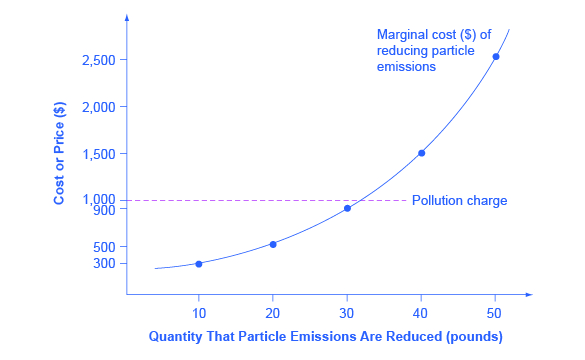

By the end of this section, you will be able to:

* Show how pollution charges impact firm decisions
* Suggest other laws and regulations that could fall under pollution charges
* Explain the significance of marketable permits and property rights
* Evaluate which policies are most appropriate for various situations

Market-oriented environmental policies create incentives to allow firms some flexibility in reducing pollution. The three main categories of market-oriented approaches to pollution control are pollution charges, marketable permits, and better-defined property rights. All of these policy tools, discussed below, address the shortcomings of command-and-control regulation—albeit in different ways.

# Pollution Charges

A **pollution charge**{: data-type="term"} is a tax imposed on the quantity of pollution that a firm emits. A pollution charge gives a profit-maximizing firm an incentive to figure out ways to reduce its emissions—as long as the marginal cost of reducing the emissions is less than the tax.

For example, consider a small firm that emits 50 pounds per year of small particles, such as soot, into the air. Particulate matter, as it is called, causes respiratory illnesses and also imposes costs on firms and individuals.

[\[link\]](#CNX_Econ_C12_002) illustrates the marginal costs that a firm faces in reducing pollution. The marginal cost of pollution reduction, like most most **marginal cost curves**{: data-type="term" .no-emphasis} increases with output, at least in the short run. Reducing the first 10 pounds of particulate emissions costs the firm $300. Reducing the second 10 pounds would cost $500; reducing the third ten pounds would cost $900; reducing the fourth 10 pounds would cost $1,500; and the fifth 10 pounds would cost $2,500. This pattern for the costs of reducing pollution is common, because the firm can use the cheapest and easiest method to make initial reductions in pollution, but additional reductions in pollution become more expensive.

 {: #CNX_Econ_C12_002 data-title="A Pollution Charge "}

Imagine the firm now faces a pollution tax of $1,000 for every 10 pounds of particulates emitted. The firm has the choice of either polluting and paying the tax, or reducing the amount of particulates they emit and paying the cost of abatement as shown in the figure. How much will the firm pollute and how much will the firm abate? The first 10 pounds would cost the firm $300 to abate. This is substantially less than the $1,000 tax, so they will choose to abate. The second 10 pounds would cost $500 to abate, which is still less than the tax, so they will choose to abate. The third 10 pounds would cost $900 to abate, which is slightly less than the $1,000 tax. The fourth 10 pounds would cost $1,500, which is much more costly than paying the tax. As a result, the firm will decide to reduce pollutants by 30 pounds, because the marginal cost of reducing pollution by this amount is less than the pollution tax. With a tax of $1,000, the firm has no incentive to reduce pollution more than 30 pounds.

A firm that has to pay a pollution tax will have an incentive to figure out the least expensive technologies for reducing pollution. Firms that can reduce pollution cheaply and easily will do so to minimize their pollution taxes, whereas firms that will incur high costs for reducing pollution will end up paying the pollution tax instead. If the pollution tax applies to every source of pollution, then no special favoritism or loopholes are created for politically well-connected producers.

For an example of a pollution charge at the household level, consider two ways of charging for garbage collection. One method is to have a flat fee per household, no matter how much garbage a household produces. An alternative approach is to have several levels of fees, depending on how much garbage the household produces—and to offer lower or free charges for recyclable materials. As of 2006 (latest statistics available), the EPA had recorded over 7,000 communities that have implemented “pay as you throw” programs. When people have a financial incentive to put out less garbage and to increase recycling, they find ways of doing so.

Visit this [website][1] to learn more about pay-as-you-throw programs, including viewing a map and a table that shows the number of communities using this program in each state.

  

A number of environmental policies are really pollution charges, although they often do not travel under that name. For example, the federal government and many state governments impose taxes on gasoline. We can view this tax as a charge on the air pollution that cars generate as well as a source of funding for maintaining roads. Indeed, gasoline taxes are far higher in most other countries than in the United States.

Similarly, the refundable charge of five or 10 cents that only 10 states have for returning recyclable cans and bottles works like a pollution tax that provides an incentive to avoid littering or throwing bottles in the trash. Compared with command-and-control regulation, a pollution tax reduces pollution in a more flexible and cost-effective way.

Visit this [website][2] to see the current U.S. states with bottle bills and the states that have active campaigns for new bottle bills. You can also view current and proposed bills in Canada and other countries around the world.

  

# Marketable Permits

When a city or state government sets up a **marketable permit program**{: data-type="term"} (e.g. cap-and-trade), it must start by determining the overall quantity of pollution it will allow as it tries to meet national pollution standards. Then, a number of permits allowing only this quantity of pollution are divided among the firms that emit that pollutant. These permits to pollute can be sold or given to firms free.

Now, add two more conditions. Imagine that these permits are designed to reduce total emissions over time. For example, a permit may allow emission of 10 units of pollution one year, but only nine units the next year, then eight units the year after that, and so on down to some lower level. In addition, imagine that these are marketable permits, meaning that firms can buy and sell them.

To see how marketable permits can work to reduce pollution, consider the four firms listed in [\[link\]](#Table_12_06). The table shows current emissions of lead from each firm. At the start of the marketable permit program, each firm receives permits to allow this level of pollution. However, these permits are shrinkable, and next year the permits allow the firms to emit only half as much pollution. Let’s say that in a year, Firm Gamma finds it easy and cheap to reduce emissions from 600 tons of lead to 200 tons, which means that it has permits that it is not using that allow emitting 100 tons of lead. Firm Beta reduces its lead pollution from 400 tons to 200 tons, so it does not need to buy any permits, and it does not have any extra permits to sell. However, although Firm Alpha can easily reduce pollution from 200 tons to 150 tons, it finds that it is cheaper to purchase permits from Gamma rather than to reduce its own emissions to 100. Meanwhile, Firm Delta did not even exist in the first period, so the only way it can start production is to purchase permits to emit 50 tons of lead.

The total quantity of pollution will decline. But the buying and selling of the marketable permits will determine exactly which firms reduce pollution and by how much. With a system of marketable permits, the firms that find it least expensive to do so will reduce pollution the most.

<table id="Table_12_06" summary="The table has 5 columns and 4 rows of data. The header row 1 lists the four firms: Alpha, Beta, Gamma, Delta. The data is as follows:  &#10;Row 2: Current emissions--permits distributed free for this amount: Alpha = 200 tons, Beta = 400 tons, Gamma = 600 tons, Delta = 0 tons.  &#10;Row 3: How much pollution will these permits allow in one year? Alpha = 100 tons, Beta = 200 tons, Gamma = 300 tons, Delta = 0 tons.  &#10;Row 4: Actual emissions one year in the future: Alpha = 150 tons, Beta = 200 tons, Gamma = 200 tons, Delta = 50 tons. &#10;Row 5: Buyer or seller of marketable permit? Alpha = Buys permits for 50 tons, Beta = Doesn't buy or sell permits, Gamma = Sells permits for 100 tons, Delta = Buys permits for 50 tons."><caption>How Marketable Permits Work</caption><thead>
<tr>
<th />
<th>Firm Alpha</th>
<th>Firm Beta</th>
<th>Firm Gamma</th>
<th>Firm Delta</th>
</tr>
</thead><tbody>
<tr>
<td>Current emissions—permits distributed free for this amount</td>
<td>200 tons</td>
<td>400 tons</td>
<td>600 tons</td>
<td>0 tons</td>
</tr>
<tr>
<td>How much pollution will these permits allow in one year?</td>
<td>100 tons</td>
<td>200 tons</td>
<td>300 tons</td>
<td>0 tons</td>
</tr>
<tr>
<td>Actual emissions one year in the future</td>
<td>150 tons</td>
<td>200 tons</td>
<td>200 tons</td>
<td>50 tons</td>
</tr>
<tr>
<td>Buyer or seller of marketable permit?</td>
<td>Buys permits for 50 tons</td>
<td>Doesn’t buy or sell permits</td>
<td>Sells permits for 100 tons</td>
<td>Buys permits for 50 tons</td>
</tr>
</tbody></table>

Another application of marketable permits occurred when the **Clean Air Act**{: data-type="term" .no-emphasis} was amended in 1990. The revised law sought to reduce sulfur dioxide emissions from electric power plants to half of the 1980 levels out of concern that sulfur dioxide was causing acid rain, which harms forests as well as buildings. In this case, the marketable permits the federal government issued were free of charge (no pun intended) to electricity-generating plants across the country, especially those that were burning coal (which produces sulfur dioxide). These permits were of the “shrinkable” type; that is, the amount of pollution allowed by a given permit declined with time.

# Better-Defined Property Rights

A clarified and strengthened idea of property rights can also strike a balance between economic activity and pollution. Ronald Coase (1910–2013), who won the 1991 Nobel Prize in economics, offered a vivid illustration of an externality: a railroad track running beside a farmer’s field where the railroad locomotive sometimes gives off sparks and sets the field ablaze. Coase asked whose responsibility it was to address this spillover. Should the farmer be required to build a tall fence alongside the field to block the sparks? Or should the railroad be required to put some gadget on the locomotive’s smokestack to reduce the number of sparks?

Coase pointed out that this issue cannot be resolved until **property rights**{: data-type="term"} are clearly defined—that is, the legal rights of ownership on which others are not allowed to infringe without paying compensation. Does the farmer have a property right not to have a field burned? Does the railroad have a property right to run its own trains on its own tracks? If neither party has a property right, then the two sides may squabble endlessly, nothing will be done, and sparks will continue to set the field aflame. However, if either the farmer or the railroad has a well-defined legal responsibility, then that party will seek out and pay for the least costly method of reducing the risk that sparks will hit the field. The property right determines whether the farmer or the railroad pays the bills.

The property rights approach is highly relevant in cases involving endangered species. The U.S. government’s endangered species list includes about 1,000 plants and animals, and about 90% of these species live on privately owned land. The protection of these endangered species requires careful thinking about incentives and property rights. The discovery of an endangered species on private land has often triggered an automatic reaction from the government to prohibit the landowner from using that land for any purpose that might disturb the imperiled creatures. Consider the incentives of that policy: If you admit to the government that you have an endangered species, the government effectively prohibits you from using your land. As a result, rumors abounded of landowners who followed a policy of “shoot, shovel, and shut up” when they found an endangered animal on their land. Other landowners have deliberately cut trees or managed land in a way that they knew would discourage endangered animals from locating there.

How effective are market-oriented environmental policy tools?

Environmentalists sometimes fear that market-oriented environmental tools are an excuse to weaken or eliminate strict limits on pollution emissions and instead to allow more pollution. It is true that if pollution charges are set very low or if marketable permits do not reduce pollution by very much then market-oriented tools will not work well. But command-and-control environmental laws can also be full of loopholes or have exemptions that do not reduce pollution by much, either. The advantage of market-oriented environmental tools is not that they reduce pollution by more or less, but because of their incentives and flexibility, they can achieve any desired reduction in pollution at a lower cost to society.

A more productive policy would consider how to provide private landowners with an incentive to protect the endangered species that they find and to provide a habitat for additional endangered species. For example, the government might pay landowners who provide and maintain suitable habitats for endangered species or who restrict the use of their land to protect an endangered species. Again, an environmental law built on incentives and flexibility offers greater promise than a command-and-control approach, which tries to oversee millions of acres of privately owned land.

# Applying Market-Oriented Environmental Tools

Market-oriented environmental policies are a tool kit. Specific policy tools will work better in some situations than in others. For example, marketable permits work best when a few dozen or a few hundred parties are highly interested in trading, as in the cases of oil refineries that trade lead permits or electrical utilities that trade sulfur dioxide permits. However, for cases in which millions of users emit small amounts of pollution—such as emissions from car engines or unrecycled soda cans—and have no strong interest in trading, pollution charges will typically offer a better choice. Market-oriented environmental tools can also be combined. Marketable permits can be viewed as a form of improved property rights. Or the government could combine marketable permits with a pollution tax on any emissions not covered by a permit.

# Key Concepts and Summary

Examples of market-oriented environmental policies include pollution charges, marketable permits, and better-defined property rights. Market-oriented environmental policies include taxes, markets, and property rights so that those who impose negative externalities must face the social cost.

# Self-Check Questions

Classify the following pollution-control policies as command-and-control or market incentive based.  A state emissions tax on the quantity of carbon emitted by each firm. The federal government requires domestic auto companies to improve car emissions by 2020. The EPA sets national standards for water quality. A city sells permits to firms that allow them to emit a specified quantity of pollution. The federal government pays fishermen to preserve salmon. 

1.  market-based
2.  command-and-control
3.  command-and-control
4.  market-based
5.  market-based
{: data-number-style="lower-alpha"}

An emissions tax on a quantity of emissions from a firm is not a command-and-control approach to reducing pollution. Why?

Even though state or local governments impose these taxes, a company has the flexibility to adopt technologies that will help it avoid the tax.

Four firms called Elm, Maple, Oak, and Cherry, produce wooden chairs. However, they also produce a great deal of garbage (a mixture of glue, varnish, sandpaper, and wood scraps). The first row of [[link]](#Table_12_07) shows the total amount of garbage (in tons) currently produced by each firm. The other rows of the table show the cost of reducing garbage produced by the first five tons, the second five tons, and so on. First, calculate the cost of requiring each firm to reduce the weight of its garbage by one-fourth. Now, imagine that marketable permits are issued for the current level of garbage, but the permits will shrink the weight of allowable garbage for each firm by one-fourth. What will be the result of this alternative approach to reducing pollution?

|  | **Elm** | **Maple** | **Oak** | **Cherry** |
|----------
| **Current production of garbage (in tons)** | **20** | **40** | **60** | **80** |
| NOT\_CONVERTED\_YET: emphasis<emphasis xmlns="http://cnx.rice.edu/cnxml" data-effect="strong">Cost of reducing garbage by first five tons</emphasis>

 | $5,500 | $6,300 | $7,200 | $3,000 |
| NOT\_CONVERTED\_YET: emphasis<emphasis xmlns="http://cnx.rice.edu/cnxml" data-effect="strong">Cost of reducing garbage by second five tons</emphasis>

 | $6,000 | $7,200 | $7,500 | $4,000 |
| NOT\_CONVERTED\_YET: emphasis<emphasis xmlns="http://cnx.rice.edu/cnxml" data-effect="strong">Cost of reducing garbage by third five tons</emphasis>

 | $6,500 | $8,100 | $7,800 | $5,000 |
| NOT\_CONVERTED\_YET: emphasis<emphasis xmlns="http://cnx.rice.edu/cnxml" data-effect="strong">Cost of reducing garbage by fouth five tons</emphasis>

 | $7,000 | $9,000 | $8,100 | $6,000 |
| NOT\_CONVERTED\_YET: emphasis<emphasis xmlns="http://cnx.rice.edu/cnxml" data-effect="strong">Cost of reducing garbage by fifth five tons</emphasis>

 | $0 | $9,900 | $8,400 | $7,000 |
{: #Table_12_07 summary="The table has 6 rows and 4 columns of data. The header row lists the 4 firms: Elm, Maple, Oak, Cherry. The data in the table is as follows: Row 1: Current production of garbage (in tons): Elm = 20, Maple = 40, Oak = 60, Cherry = 80. Row 2: Cost of reducing garbage by first five tons: Elm = $5,500, Maple = $6,300, Oak = $7,200, Cherry = &gt;,000. Row 3 Cost of reducing garbage by second five tons: Elm = $6,000, Maple = $7,200, Oak = $7,500, Cherry = $4,000. Row 4 Cost of reducing garbage by third five tons: Elm = $6,500, Maple = $8,100, Oak = $7,800, Cherry = $5,000. Row 5 Cost of reducing garbage by fourth five tons: Elm = $7,000, Maple = $9,000, Oak = $8,100, Cherry = $6,000. Row 6 Cost of reducing garbage by fifth five tons: Elm = $0, Maple = $9,900, Oak = $8,400, Cherry = $7,000."}

First, if each firm is required to reduce its garbage output by one-fourth, then Elm will reduce five tons at a cost of $5,500; Maple will reduce 10 tons at a cost of $13,500; Oak will reduce three tons at a cost of $22,500; and Cherry will reduce four tons at a cost of $18,000. Total cost of this approach: $59,500. If the system of marketable permits is put in place, and those permits shrink the weight of allowable garbage by one-quarter, then pollution must still be reduced by the same overall amount. However, now the reduction in pollution will take place where it is least expensive.

<table id="Table_12_08" summary="The table has 8 rows and 3 columns of data. The header row includes Column 1: Reductions in garbage, Column 2: Who does the reducing, and Column 3: At what cost? The data for each row is as follows: Row 1: First 5 tons, Cherry, $3,000. Row 2: Second 5 tons, Cherry, $4,000. Row 3: Third 5 tons, Cherry, $5,000, Row 4: Fourth 5 tons, Elm, $5,500, Row 5: fifth and sixth 5 tons, Elm and Cherry, $6,000 each, Row 6: Seventh five tons, Maple, $6,300, Row 7: Eighth 5 tons, Elm, $6,500, Row 8: Ninth and tenth 5 tons, Elm and Cherry, $7,000 each." data-label=""><caption /><thead>
<tr>
<th>Reductions in Garbage</th>
<th>Who does the reducing?</th>
<th>At what cost?</th>
</tr>
</thead><tbody>
<tr>
<td>First 5 tons</td>
<td>Cherry</td>
<td>$3,000</td>
</tr>
<tr>
<td>Second 5 tons</td>
<td>Cherry</td>
<td>$4,000</td>
</tr>
<tr>
<td>Third 5 tons</td>
<td>Cherry</td>
<td>$5,000</td>
</tr>
<tr>
<td>Fourth 5 tons</td>
<td>Elm</td>
<td>$5,500</td>
</tr>
<tr>
<td>Fifth and sixth 5 tons</td>
<td>Elm and Cherry</td>
<td>$6,000 each </td>
</tr>
<tr>
<td>Seventh 5 tons</td>
<td>Maple</td>
<td>$6,300</td>
</tr>
<tr>
<td>Eighth 5 tons</td>
<td>Elm</td>
<td>$6,500</td>
</tr>
<tr>
<td>Ninth and tenth 5 tons</td>
<td>Elm and Cherry</td>
<td>$7,000 each</td>
</tr>
</tbody></table>
Thus, the overall pattern of reductions here will be that Elm reduces garbage by 20 tons and has 15 tons of permits to sell. Maple reduces by five tons and needs to buy five tons of permits. Oak does not reduce garbage at all, and needs to buy 15 tons of permits. Cherry reduces garbage by 25 tons, which leaves it with five tons of permits to sell. The total cost of these reductions would be $56,300, a definite reduction in costs from the $59,500 cost of the command-and-control option.

The rows in [[link]](#Table_12_09) show three market-oriented tools for reducing pollution. The columns of the table show three complaints about command-and-control regulation. Fill in the table by stating briefly how each market-oriented tool addresses each of the three concerns.

<table id="Table_12_09" summary="The blank table has 3 empty rows and 3 columns empty. The first column lists Row 1: Pollution Charges, Row 2: Marketable Permits and Row 3: Property Rights. The top row lists column 1: incentives to go beyond, column 2: flexibility about where and how pollution will be reduced, and column 3: political process creates loopholes and exceptions."><caption /><thead>
<tr>
<th />
<th>Incentives to Go Beyond</th>
<th>Flexibility about Where and How Pollution Will Be Reduced</th>
<th>Political Process Creates Loopholes and Exceptions</th>
</tr>
</thead><tbody>
<tr>
<td>Pollution Charges</td>
<td />
<td />
<td />
</tr>
<tr>
<td>Marketable Permits</td>
<td />
<td />
<td />
</tr>
<tr>
<td>Property Rights</td>
<td />
<td />
<td />
</tr>

</tbody></table>

<table id="Table_12_10" summary="The table has 3  rows and 3 columns of data.  The data for each row is as follows: Row 1: Pollution Charges: (Incentives to go beyond) If you keep reducing the pollution you reduce your charge, (Flexibility about where and how pollution will be reduced) Reducing pollution by any method is fine, (Political process creates loopholes and exceptions) If charge applies to all emissions of pollution then no loop holes. Row 2: Marketable Permits: (Incentives to go beyond) If you reduce your pollution you can sell your extra pollution permits (Flexibility about where and how pollution will be reduced) Reductions of pollution will happen at firms where it is cheapest to do so, by the least expensive methods, (Political process creates loopholes and exceptions) If all polluters are required to have permits then there are no loopholes. Row 3: Property Rights  (Incentives to go beyond) The party that has to pay for the pollution has incentive to do so in a cost effective way (Flexibility about where and how pollution will be reduced) Reducing pollution by any method is fine, (Political process creates loopholes and exceptions) If the property rights are clearly defined, then it is not legally possible to avoid cleanup" data-label=""><caption /><thead>
<tr>
<th />
<th>Incentives to Go Beyond</th>
<th>Flexibility about Where and How Pollution Will Be Reduced</th>
<th>Political Process Creates Loopholes and Exceptions</th>
</tr>
</thead><tbody>
<tr>
<td>NOT\_CONVERTED\_YET: emphasis<emphasis xmlns="http://cnx.rice.edu/cnxml" data-effect="strong">Pollution Charges</emphasis></td>
<td>If you keep reducing pollution you reduce your charge</td>
<td>Reducing pollution by any method is fine</td>
<td>If charge applies to all emissions of pollution then no loopholes</td>
</tr>
<tr>
<td>NOT\_CONVERTED\_YET: emphasis<emphasis xmlns="http://cnx.rice.edu/cnxml" data-effect="strong">Marketable Permits</emphasis></td>
<td>If you reduce your pollution you can sell your extra pollution permits</td>
<td>Reductions of pollution will happen at firms where it is cheapest to do so, by the least expensive methods</td>
<td>If all polluters are required to have permits then there are no loopholes</td>
</tr>
<tr>
<td>NOT\_CONVERTED\_YET: emphasis<emphasis xmlns="http://cnx.rice.edu/cnxml" data-effect="strong">Property Rights</emphasis></td>
<td>The party that has to pay for the pollution has incentive to do so in a cost effect way</td>
<td>Reducing pollution by any method is fine</td>
<td>If the property rights are clearly defined, then it is not legally possible to avoid cleanup</td>
</tr>
</tbody></table>

# Review Questions

What is a pollution charge and what incentive does it provide for a firm to take external costs into account?

What is a marketable permit and what incentive does it provide for a firm to take external costs into account?

What are better-defined property rights and what incentive do they provide to take external costs into account?

# Critical Thinking Questions

Will a system of marketable permits work with thousands of firms? Why or why not?

Is zero pollution possible under a marketable permits system? Why or why not?

Is zero pollution an optimal goal? Why or why not?

# References

Environmental Protection Agency. “2006 Pay-As-You-Throw Programs.” Accessed December 20, 2013. http://www.epa.gov/epawaste/conserve/tools/payt/states/06comm.htm.

[1]: http://openstaxcollege.org/l/payasyouthrow
[2]: http://openstaxcollege.org/l/bottlebill
