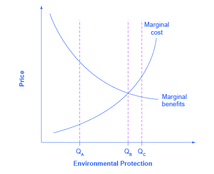

By the end of this section, you will be able to:

* Evaluate the benefits and costs of environmental protection
* Explain the effects of ecotourism
* Apply marginal analysis to illustrate the marginal costs and marginal benefits of reducing pollution

Government economists have estimated that U.S. firms may pay more than $200 billion per year to comply with federal environmental laws. That is big bucks. Is the money well spent?

### Benefits and Costs of Clean Air and Clean Water

The benefits of a cleaner environment can be divided into four areas: (1) people may stay healthier and live longer; (2) certain industries that rely on clean air and water, such as farming, fishing, and tourism, may benefit; (3) property values may be higher; and (4) people may simply enjoy a cleaner environment in a way that does not need to involve a market transaction. Some of these benefits, such as gains to tourism or farming, are relatively easy to value in economic terms. It is harder to assign a monetary value to others, such as the value of clean air for someone with asthma. It seems impossible to put a clear-cut monetary value on still others, such as the satisfaction you might feel from knowing that the air is clear over the Grand Canyon, even if you have never visited the Grand Canyon.

Although estimates of environmental benefits are not precise, they can still be revealing. For example, a study by the Environmental Protection Agency looked at the costs and benefits of the Clean Air Act from 1970 to 1990. It found that total costs over that time period were roughly $500 billion—a huge amount. However, it also found that a middle-range estimate of the health and other benefits from cleaner air was $22 trillion—about 44 times higher than the costs. A more recent study by the EPA estimated that the environmental benefits to Americans from the **Clean Air Act**{: data-type="term" .no-emphasis} will exceed their costs by a margin of four to one. The EPA estimated that “in 2010 the benefits of Clean Air Act programs will total about $110 billion. This estimate represents the value of avoiding increases in illness and premature death which would have prevailed.” Saying that overall benefits of environmental regulation have exceeded costs in the past, however, is very different from saying that every environmental regulation makes sense. For example, studies suggest that when breaking down emission reductions by type of contaminants, the benefits of air pollution control outweigh the costs primarily for particulates and lead, but when looking at other air pollutants, the costs of reducing them may be comparable to or greater than the benefits. Just because some environmental regulations have had benefits much higher than costs does not prove that every individual regulation is a sensible idea.

### Ecotourism: Making Environmentalism Pay

The definition of **ecotourism**{: data-type="term" .no-emphasis} is a little vague. Does it mean sleeping on the ground, eating roots, and getting close to wild animals? Does it mean flying in a helicopter to shoot anesthetic darts at African wildlife? Or a little of both? The definition may be fuzzy, but tourists who hope to appreciate the ecology of their destination—“eco tourists”—are the impetus to a big and growing business. The International Ecotourism Society estimates that international tourists interested in seeing nature or wildlife will take 1.56 billion trips by 2020.

Visit The International Ecotourism Society’s [website][1] to learn more about The International Ecotourism Society, its programs, and tourism’s role in sustainable community development.

Realizing the attraction of ecotourism, the residents of low-income countries may come to see that preserving wildlife habitats is more lucrative than, say, cutting down forests or grazing livestock to survive. In South Africa, Namibia, and Zimbabwe, for example, a substantial expansion of both rhinoceros and elephant populations is broadly credited to ecotourism, which has given local communities an economic interest in protecting them. Some of the leading ecotourism destinations include: Costa Rica and Panama in Central America; the Caribbean; Malaysia, and other South Pacific destinations; New Zealand; the Serengeti in Tanzania; the Amazon rain forests; and the Galapagos Islands. In many of these countries and regions, governments have enacted policies whereby revenues from ecotourism are shared with local communities, to give people in those local communities a kind of property right that encourages them to conserve their local environment.

Ecotourism needs careful management, so that the combination of eager tourists and local entrepreneurs does not destroy what the visitors are coming to see. But whatever one’s qualms are about certain kinds of ecotourism—such as the occasional practice of rich tourists shooting elderly lions with high-powered rifles—it is worth remembering that the alternative is often that low-income people in poor countries will damage their local environment in their effort to survive.

### Marginal Benefits and Marginal Costs

We can use the tools of marginal analysis to illustrate the marginal costs and the marginal benefits of reducing pollution. [\[link\]](#CNX_Econ_C12_003) illustrates a theoretical model of this situation. When the quantity of environmental protection is low so that pollution is extensive—for example, at quantity Qa—there are usually a lot of relatively cheap and easy ways to reduce pollution, and the **marginal benefits**{: data-type="term" .no-emphasis} of doing so are quite high. At Qa, it makes sense to allocate more resources to fight pollution. However, as the extent of environmental protection increases, the cheap and easy ways of reducing pollution begin to decrease, and more costly methods must be used. The **marginal cost curve**{: data-type="term" .no-emphasis} rises. Also, as environmental protection increases, the largest marginal benefits are achieved first, followed by reduced marginal benefits. As the quantity of environmental protection increases to, say, Qb, the gap between marginal benefits and marginal costs narrows. At point Qc the marginal costs will exceed the marginal benefits. At this level of environmental protection, society is not allocating resources efficiently, because too many resources are being given up to reduce pollution.

 {: #CNX_Econ_C12_003 data-title="Marginal Costs and Marginal Benefits of Environmental Protection "}

As society draws closer to Qb, some might argue that it becomes more important to use market-oriented environmental tools to hold down the costs of reducing pollution. Their objective would be to avoid environmental rules that would provide the quantity of environmental protection at Qc, where marginal costs exceed marginal benefits. The following Clear It Up feature delves into how the EPA measures its policies – and the monetary value of our lives.

What's a life worth?

The U.S. Environmental Protection Agency (EPA) must estimate the value of saving lives by reducing pollution against the additional costs. In measuring the benefits of government environmental policies, the EPA’s National Center for Environmental Economics (NCEE) values a statistical human life at $7.4 million (in 2006 U.S. dollars).

Economists value a human life on the basis of studies of the value that people actually place on human lives in their own decisions. For example, some jobs have a higher probability of death than others, and these jobs typically pay more to compensate for the risk. Examples are ocean fishery as opposed to fish farming, and ice trucking in Alaska as opposed to truck driving in the “lower forty-eight” states.

Government regulators use estimates such as these when deciding what proposed regulations are “reasonable,” which means deciding which proposals have high enough benefits to justify their cost. For example, when the U.S. Department of Transportation makes decisions about what safety systems should be required in cars or airplanes, it will approve rules only where the estimated cost per life saved is $3 million or less.

Resources spent on life-saving regulations create tradeoff. A study by W. Kip Viscusi of Vanderbilt University estimated that when a regulation costs $50 million, it diverts enough spending in the rest of the economy from health care and safety expenditures that it costs a life. This finding suggests that any regulation that costs more than $50 million per life saved actually costs lives, rather than saving them.

### Key Concepts and Summary

We can make a strong case, taken as a whole, that the benefits of U.S. environmental regulation have outweighed the costs. As the extent of environment regulation increases, additional expenditures on environmental protection will probably have increasing marginal costs and decreasing marginal benefits. This pattern suggests that the flexibility and cost savings of market-oriented environmental policies will become more important.

### Self-Check Questions

Suppose a city releases 16 million gallons of raw sewage into a nearby lake. [[link]](#Table_12_10) shows the total costs of cleaning up the sewage to different levels, together with the total benefits of doing so. (Benefits include environmental, recreational, health, and industrial benefits.)

|  | Total Cost (in thousands of dollars) | Total Benefits (in thousands of dollars) |
|----------
| 16 million gallons | Current situation | Current situation |
| 12 million gallons |  50 |  800 |
| 8 million gallons | 150 | 1300 |
| 4 million gallons | 500 | 1650 |
| 0 gallons | 1200 | 1900 |
{: #Table_12_10 summary="The table has 2 columns and 5 rows of data. The header row includes Column 1 Total Cost (in thousands of dollars), and Column 2 Total Benefits (in thousands of dollars). Row 1 16 Million Gallons = Current situation, Current Situation. Row 2 12 million gallons = 50, 800. Row 3 8 million gallons = 150, 1,300, Row 4 4 million gallons = 500, 1,650. Row 5 0 Gallons = 1,200, 1,900"}

1.  Using the information in [[link]](#Table_12_10), calculate the marginal costs and marginal benefits of reducing sewage emissions for this city. See [Cost and Industry Structure](/m48620){: .target-chapter} if you need a refresher on how to calculate marginal costs.
2.  What is the optimal level of sewage for this city?
3.  Why not just pass a law that zero sewage can be emitted? After all, the total benefits of zero emissions exceed the total costs.
{: data-number-style="lower-alpha"}

1.  See the answers in the following table. The marginal cost is calculated as the change in total cost divided by the change in quantity.
    |  | Total Cost (in thousands of dollars) [marginal cost] | Total Benefits (in thousands of dollars) [marginal benefit] |
    |----------
    | 16 million gallons | Current situation | Current situation |
    | 12 million gallons |    50    [50] |  800   [800] |
    | 8 million gallons |   150   [100] | 1,300  [500] |
    | 4 million gallons |   500   [350] | 1,850   [350] |
    | 0 gallons | 1,200   [700] | 2,000   [150] |
    {: #Table_12_11 summary="The table has 2 columns and 5 rows of data. The header row includes Column 1 Total Cost (in thousands of dollars) with the marginal cost in parenthesis, and Column 2 Total Benefits (in thousands of dollars) with the marginal benefit in parenthesis. Row 1 16 Million Gallons = Current situation, Current Situation. Row 2 12 million gallons = 50 parenthesis 50, 800 parenthesis 800. Row 3 8 million gallons = 150 parenthesis 100, 1,300 parenthesis 500, Row 4 4 million gallons = 500 parenthesis 350, 1,850 parenthesis 350. Row 5 0 Gallons = 1,200 parenthesis 700, 2,000 parenthesis 150" data-label=""}

2.  The “optimal” level of pollution is where the marginal benefits of reducing it are equal to the marginal cost. This is at four million gallons.
3.  Marginal analysis tells us if the marginal costs of cleanup are greater than the marginal benefit, society could use those resources more efficiently elsewhere in the economy.
{: data-number-style="lower-alpha"}

The state of Colorado requires oil and gas companies who use fracking techniques to return the land to its original condition after the oil and gas extractions. [[link]](#Table_12_12) shows the total cost and total benefits (in dollars) of this policy.

<table id="Table_12_12" summary="The table has 3 columns and 5 rows of data. The header row includes Column 1 Land Restored (in acres), Column 2 Total Cost, and Column 3 Total Benefit. Row 1 = 0, $0, $0, Row 2 = 100, $20, $140. Row 3 = 200, $80, $240, Row 4 = 300, $160, $320, Row 5 = 400, $280, $480"><caption /><thead>
<tr>
<th>Land Restored (in acres)</th>
<th>Total Cost</th>
<th>Total Benefit</th>
</tr>
</thead><tbody>
<tr>
<td>0</td>
<td>$0</td>
<td>$0</td>
</tr>
<tr>
<td>100</td>
<td>$20</td>
<td>$140</td>
</tr>
<tr>
<td>200</td>
<td>$80</td>
<td>$240</td>
</tr>
<tr>
<td>300</td>
<td>$160</td>
<td>$320</td>
</tr>
<tr>
<td>400</td>
<td>$280</td>
<td>$380</td>
</tr>
</tbody></table>
1.  Calculate the marginal cost and the marginal benefit at each quantity (acre) of land restored. See [Cost and Industry Structure](/m48620){: .target-chapter} if you need a refresher on how to calculate marginal costs and benefits.
2.  If we apply marginal analysis, what is the optimal amount of land to be restored?
{: data-number-style="lower-alpha"}

1.  See the next table for the answers, which were calculated using the traditional calculation of marginal cost equal to change in total cost divided by change in quantity.
    <table id="Table_12_13" summary="The table has 3 columns and 5 rows of data. The header row includes Column 1 Land Restored (in acres), Column 2 Total Cost with marginal cost in parenthesis, and Column 3 Total Benefit with marginal benefit in parenthesis. Row 1 = 0, $0, $0, Row 2 = 100, $20 parenthesis 0.2, $140 parenthesis 1.4. Row 3 = 200, $80 parenthesis 0.6, $240 parenthesis 1, Row 4 = 300, $160 parenthesis 0.8, $320 parenthesis 0.8, Row 5 = 400, $280 parenthesis 1.2, 3480 parenthesis 0.6" data-label=""><caption /><thead>
    <tr>
    <th>Land Restored (in acres)</th>
    <th>Total Cost [marginal cost]</th>
    <th>Total Benefit [marginal benefit]</th>
    </tr>
    </thead><tbody>
    <tr>
    <td>0</td>
    <td>$0</td>
    <td>$0</td>
    </tr>
    <tr>
    <td>100</td>
    <td>$20 [0.2]</td>
    <td>$140 [1.4]</td>
    </tr>
    <tr>
    <td>200</td>
    <td>$80 [0.6]</td>
    <td>$240 [1]</td>
    </tr>
    <tr>
    <td>300</td>
    <td>$160 [0.8]</td>
    <td>$320 [0.8]</td>
    </tr>
    <tr>
    <td>400</td>
    <td>$280 [1.2]</td>
    <td> $480 [0.6]</td>
    </tr>
    </tbody></table>

2.  The optimal amount of restored land is 300 acres. Beyond this quantity the marginal costs are greater than the marginal benefits.
{: data-number-style="lower-alpha"}

### Review Questions

As the extent of environmental protection expands, would you expect marginal costs of environmental protection to rise or fall? Why or why not?

As the extent of environmental protection expands, would you expect the marginal benefits of environmental protection to rise or fall? Why or why not?

### Critical Thinking Questions

From an economic perspective, is it sound policy to pursue a goal of zero pollution? Why or why not?

Recycling is a relatively inexpensive solution to much of the environmental contamination from plastics, glass, and other waste materials. Is it a sound policy to make it mandatory for everybody to recycle?

### Problems

A city currently emits 16 million gallons (MG) of raw sewage into a lake that is beside the city. [[link]](#Table_12_14) shows the total costs (TC) in thousands of dollars of cleaning up the sewage to different levels, together with the total benefits (TB) of doing so. Benefits include environmental, recreational, health, and industrial benefits.

<table id="Table_12_14" summary="The table has 6 rows and 3 columns. Row 1 is the header row and consists of column 1 labeled TC and and column 2 labeled TB. Row 2 16 MG = Current, current. Row 3 12 MG = 50, 800. Row 4 8 MG = 150, 1300. Row 5 4 MG = 500, 1850. Row 6 0 MG = 1200, 2000"><caption /><thead>
<tr>
<th />
<th>TC</th>
<th>TB</th>
</tr>
</thead><tbody>
<tr>
<td>16 MG</td>
<td>Current</td>
<td>Current</td>
</tr>
<tr>
<td>12 MG</td>
<td>50</td>
<td>800</td>
</tr>
<tr>
<td>8 MG</td>
<td>150</td>
<td>1300</td>
</tr>
<tr>
<td>4 MG</td>
<td>500</td>
<td>1850</td>
</tr>
<tr>
<td>0 MG</td>
<td>1200</td>
<td>2000</td>
</tr>
</tbody></table>
1.  Using the information in [[link]](#Table_12_14) calculate the marginal costs and marginal benefits of reducing sewage emissions for this city.
2.  What is the optimal level of sewage for this city? How can you tell?
{: data-number-style="lower-alpha"}

### References

Ryan, Dave. “New Report Shows Benefits of 1990 Clean Air Amendments Outweigh Costs by Four-to-One Margin,” press release, November 16, 1999. *United States Environmental Protection Agency.* Accessed December 19, 2013. http://www.epa.gov/oar/sect812/r-140.html.

National Center for Environmental Economics (NCEE). “Frequently Asked Questions on Mortality Risk Valuation.” *United States Environmental Protection Agency.* Accessed December 19, 2013. http://yosemite.epa.gov/ee/epa/eed.nsf/pages/MortalityRiskValuation.html#whatvalue World Tourism Organization, “Tourism 2020 Vision.” Accessed December 19, 2013. http://www.world-tourism.org/market\\\_research/facts/market\\\_trends.htm.

Viscusi, Kip W. *Fatal Tradeoffs: Public and Private Responsibilities for Risk.* New York: Oxford University Press, 1995.

[1]: http://openstaxcollege.org/l/ecotourism
