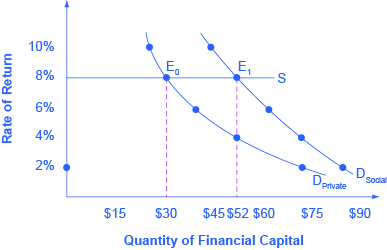

By the end of this section, you will be able to:
* Identify the positive externalities of new technology.
* Explain the difference between private benefits and social benefits and give examples of each.
* Calculate and analyze rates of return

Market competition can provide an incentive for discovering new technology because a **firm**{: data-type="term" .no-emphasis} can earn higher profits by finding a way to produce products more cheaply or to create products with characteristics consumers want. As Gregory Lee, CEO of Samsung said, “Relentless pursuit of new innovation is the key principle of our business and enables consumers to discover a world of possibilities with technology.” An innovative firm knows that it will usually have a temporary edge over its competitors and thus an ability to earn above-normal profits before competitors can catch up.

In certain cases, however, **competition**{: data-type="term" .no-emphasis} can discourage new **technology**{: data-type="term" .no-emphasis}, especially when other firms can quickly copy a new idea. Consider a pharmaceutical firm deciding to develop a new drug. On average, it can cost $800 million and take more than a decade to discover a new drug, perform the necessary safety tests, and bring the drug to market. If the research and development (R&amp;D) effort fails—and every R&amp;D project has some chance of failure—then the firm will suffer losses and could even be driven out of business. If the project succeeds, then the firm’s competitors may figure out ways of adapting and copying the underlying idea, but without having to pay the costs themselves. As a result, the innovative company will bear the much higher costs of the R&amp;D and will enjoy at best only a small, temporary advantage over the competition.

Many inventors over the years have discovered that their inventions brought them less profit than they might have reasonably expected.

* Eli Whitney (1765–1825) invented the cotton gin, but then southern cotton planters built their own seed-separating devices with a few minor changes in Whitney’s design. When Whitney sued, he found that the courts in southern states would not uphold his patent rights.
* Thomas Edison (1847–1931) still holds the record for most patents granted to an individual. His first invention was an automatic vote counter, and despite the social benefits, he could not find a government that wanted to buy it.
* Gordon Gould came up with the idea behind the laser in 1957. He put off applying for a patent and, by the time he did apply, other scientists had laser inventions of their own. A lengthy legal battle resulted, in which Gould spent $100,000 on lawyers, before he eventually received a patent for the laser in 1977. Compared to the enormous social benefits of the laser, Gould received relatively little financial reward.
* In 1936, Turing delivered a paper titled, \"On Computable Numbers, with an Application to the Entscheidungsproblem,\" in which he presented the notion of a universal machine (later called the “Universal Turing Machine,\" and then the \"Turing machine\") capable of computing anything that is computable. The central concept of the modern computer was based on Turing’s paper.

A variety of studies by economists have found that the original inventor receives one-third to one-half of the total economic benefits from innovations, while other businesses and new product users receive the rest.

# The Positive Externalities of New Technology   {#ch13mod01_01}

Will private firms in a **market economy**{: data-type="term" .no-emphasis} under invest in research and technology? If a firm builds a factory or buys a piece of equipment, the firm receives all the economic benefits that result from the investments. However, when a firm invests in new technology, the **private benefits**{: data-type="term"}, or profits, that the firm receives are only a portion of the overall social benefits. The **social benefits**{: data-type="term"} of an innovation take into account the value of all the positive externalities of the new idea or product, whether enjoyed by other companies or society as a whole, as well as the private benefits received by the firm that developed the new technology. As you learned in [Environmental Protection and Negative Externalities](/m48668){: .target-chapter}, **positive externalities**{: data-type="term"} are beneficial spillovers to a third party, or parties.

Consider the example of the Big Drug Company, which is planning its R&amp;D budget for the next year. Economists and scientists working for Big Drug have compiled a list of potential research and development projects and estimated rates of return. (The rate of return is the estimated payoff from the project.) [\[link\]](#CNX_Econ_C13_002) shows how the calculations work. The downward-sloping DPrivate curve represents the firm’s demand for financial capital and reflects the company’s willingness to borrow to finance research and development projects at various interest rates. Suppose that this firm’s investment in research and development creates a spillover benefit to other firms and households. After all, new innovations often spark other creative endeavors that society also values. If we add the spillover benefits society enjoys to the firm’s private demand for financial capital, we can draw DSocial that lies above DPrivate.

If there was a way for the firm to fully monopolize those social benefits by somehow making them unavailable to the rest of us, the firm’s private demand curve would be the same as society’s demand curve. According to [\[link\]](#CNX_Econ_C13_002) and [\[link\]](#ch13mod01_tab01), if the going rate of interest on borrowing is 8%, and the company can receive the private benefits of innovation only, then the company would finance $30 million. Society, at the same rate of 8%, would find it optimal to have $52 million of borrowing. Unless there is a way for the company to fully enjoy the total benefits, then it will borrow less than the socially optimal level of $52 million.

 {: #CNX_Econ_C13_002 data-title="Positive Externalities and Technology"}

<table id="ch13mod01_tab01" summary="This table has three columns and six rows. The first row is a header row, and it labels the columns, 'Rates of Return', 'D_{Private} (in millions)', and 'D_{Social} (in millions)'. Under the column 'Rate of Return' are the following values: 2%, 4%, 6%, 8%, and 10%. Under the 'D_{Private} (in millions)' column are the following values: $72, $52, $38, $30, and $26. Under the 'D_{Social} (in millions)' column are the following values: $84, $72, $62, $52, and $44."><caption>Return and Demand for Capital</caption><thead>
<tr>
<th>Rate of Return</th>
<th>DPrivate (in millions)</th>
<th>DSocial (in millions)</th>
</tr>
</thead><tbody>
<tr><td>2%</td><td>$72</td><td>$84</td></tr>
<tr><td>4%</td><td>$52</td><td>$72</td></tr>
<tr><td>6%</td><td>$38</td><td>$62</td></tr>
<tr><td>8%</td><td>$30</td><td>$52</td></tr>
<tr><td>10%</td><td>$26</td><td>$44</td></tr>
</tbody></table>

Big Drug’s original demand for financial capital (DPrivate) is based on the profits received by the firm. However, other pharmaceutical firms and health care companies may learn new lessons about how to treat certain medical conditions and are then able to create their own competing products. The social benefit of the drug takes into account the value of all the positive externalities of the drug. If Big Drug were able to gain this social return instead of other companies, its **demand**{: data-type="term" .no-emphasis} for financial capital would shift to the demand curve DSocial, and it would be willing to borrow and invest $52 million. However, if Big Drug is receiving only 50 cents of each dollar of social benefits, the firm will not spend as much on creating new products. The amount it would be willing to spend would fall somewhere in between DPrivate and DSocial.

# Why Invest in Human Capital?   {#ch13mod01_02}

The investment in anything, whether it is the construction of a new power plant or research in a new cancer treatment, usually requires a certain upfront cost with an uncertain future benefit. The investment in education, or human capital, is no different. Over the span of many years, a student and her family invest significant amounts of time and money into that student’s education. The idea is that higher levels of educational attainment will eventually serve to increase the student’s future productivity and subsequent ability to earn. Once the numbers are crunched, does this investment pay off for the student?

Almost universally, economists have found that the answer to this question is a clear “Yes.” For example, several studies of the return to education in the United States estimate that the rate of return to a college education is approximately 10%. Data in [\[link\]](#ch13mod01_tab02), from the U.S. Bureau of Labor Statistics’ *Usual Weekly Earnings of Wage and Salary Workers, Third Quarter 2014,* demonstrate that median weekly earnings are higher for workers who have completed more education. While these rates of return will beat equivalent investments in Treasury bonds or savings accounts, the estimated returns to education go primarily to the individual worker, so these returns are **private rates of return**{: data-type="term"} to education.

<table id="ch13mod01_tab02" summary="This table has four columns and one row. The first row is a header row and it labels the last three columns, 'Less than a High School Degree,' 'High School Degree, No College,' and 'Bachelor's Degree.' Under the 'Less than a High School Degree' column is the value: $488. Under the 'High School Degree, No College' column is the value: $668. Under the 'Bachelor's Degree' column is the value: ,101."><caption>Usual Weekly Earnings of Wage and Salary Workers, Third Quarter 2014(Source: http://www.bls.gov/news.release/pdf/wkyeng.pdf)</caption><thead>
<tr><th /><th>Less than a High School Degree</th><th>High School Degree, No College</th><th>Bachelor’s Degree</th></tr>
</thead><tbody>
<tr>
<td>Median Weekly Earnings (full-time workers over the age of 25)</td>
<td>$488</td>
<td>$668</td>
<td>$1,101</td>
</tr>
</tbody></table>

What does society gain from investing in the education of another student? After all, if the government is spending taxpayer dollars to subsidize public education, society should expect some kind of return on that spending. Again, economists like **George Psacharopoulos**{: data-type="term" .no-emphasis} have found that, across a variety of nations, the **social rate of return**{: data-type="term"} on schooling is also positive. After all, positive externalities exist from investment in education. While not always easy to measure, according to **Walter McMahon**{: data-type="term" .no-emphasis}, the positive externalities to education typically include better health outcomes for the population, lower levels of crime, a cleaner environment and a more stable, democratic government. For these reasons, many nations have chosen to use taxpayer dollars to subsidize primary, secondary, and higher education. Education clearly benefits the person who receives it, but a society where most people have a good level of education provides positive externalities for all.

# Other Examples of Positive Externalities   {#ch13mod01_03}

Although technology may be the most prominent example of a positive externality, it is not the only one. For example, being vaccinated against disease is not only a protection for the individual, but it has the positive spillover of protecting others who may become infected. When a number of homes in a neighborhood are modernized, updated, and restored, not only does it increase the value of those homes, but the value of other properties in the neighborhood may increase as well.

The appropriate public policy response to a positive externality, like a new technology, is to help the party creating the positive externality receive a greater share of the social benefits. In the case of vaccines, like flu shots, an effective policy might be to provide a subsidy to those who choose to get vaccinated.

[\[link\]](#CNX_Econ_C13_004) shows the market for flu shots. The market demand curve DMarket for flu shots reflects only the marginal private benefits (MPB) that the vaccinated individuals receive from the shots. Assuming that there are no spillover costs in the production of flu shots, the market supply curve is given by the marginal private cost (MPC) of producing the vaccinations.

The equilibrium quantity of flu shots produced in the market, where MPB is equal to MPC, is QMarket and the price of flu shots is PMarket. However, spillover benefits exist in this market because others, those who chose not to purchase a flu shot, receive a positive externality in a reduced chance of contracting the flu. When we add the spillover benefits to the marginal private benefit of flu shots, the marginal social benefit (MSB) of flu shots is given by DSocial. Because the MPB is greater than MSB, we see that the socially optimal level of flu shots is greater than the market quantity (QSocial exceeds QMarket) and the corresponding price of flu shots, if the market were to produce QSocial, would be at PSocial. Unfortunately, the marketplace does not recognize the positive externality and flu shots will go under produced and under consumed.

So how can government try to move the market level of output closer to the socially desirable level of output? One policy would be to provide a subsidy, like a voucher, to any citizen who wishes to get vaccinated. This voucher would act as “income” that could be used to purchase only a flu shot and, if the voucher was exactly equal to the per-unit spillover benefits, would increase market equilibrium to a quantity of QSocial and a price of PSocial where MSB equals MSC. Suppliers of the flu shots would receive payment of PSocial per vaccination, while consumers of flu shots would redeem the voucher and only pay a price of PSubsidy. When the government uses a subsidy in this way, the socially optimal quantity of vaccinations is produced.

 {: #CNX_Econ_C13_004 data-title="The Market for Flu Shots with Spillover Benefits (A Positive Externality)"}

# Key Concepts and Summary   {#ch13mod01_summ}

Competition creates pressure to innovate. However, if new inventions can be easily copied, then the original inventor loses the incentive to invest further in research and development. New technology often has positive externalities; that is, there are often spillovers from the invention of new technology that benefit firms other than the innovator. The social benefit of an invention, once these spillovers are taken into account, typically exceeds the private benefit to the inventor. If inventors could receive a greater share of the broader social benefits for their work, they would have a greater incentive to seek out new inventions.

# Self-Check Questions   {#ch13mod01_sques}

Are positive externalities reflected in market demand curves? Why or why not?

No. A market demand curve reflects only the private benefits of those who are consuming the product. Positive externalities are benefits that spill over to third parties, so they create social benefits, and are not captured by a market (or private benefit) demand curve.

Samsung’s R&amp;D investment in digital devices has increased profits by 20%. Is this a private or social benefit?

Clearly Samsung is benefiting from the investment, so the 20% increase in profits is a private benefit. If Samsung is unable to capture all of the benefit, perhaps because other companies quickly copy and produce close substitutes, then Samsung’s investment will produce social benefits.

The Gizmo Company is planning to develop new household gadgets. [[link]](#ch13mod01_tab03) shows the company’s demand for financial capital for research and development of these gadgets, based on expected rates of return from sales. Now, say that every investment would have an additional 5% social benefit—that is, an investment that pays at least a 6% return to the Gizmo Company will pay at least an 11% return for society as a whole; an investment that pays at least 7% for the Gizmo Company will pay at least 12% for society as a whole, and so on. Answer the questions that follow based on this information.

| Estimated Rate of Return | Private profits of the firm from an R&amp;D project (in $ millions) |
|----------
| 10% | $100 |
| 9% | $102 |
| 8% | $108 |
| 7% | $118 |
| 6% | $133 |
| 5% | $153 |
| 4% | $183 |
| 3% | $223 |
{: #ch13mod01_tab03 summary="This table has nine rows and two columns. The first row is a header row and labels the columns 'Estimated Rate of Return' and 'Private Profits of the firm from an R and D project (in $ millions)'. Under the column 'Estimated Rate of Return' are the following rates: 10%, 9%, 8%, 7%, 6%, 5%, 4%, 3%. Under the column 'Private Profits of the firm from an R and D project (in $ millions)' are the following values: $100, $102, $108, $118, $133, $153, $183, $223."}

1.  If the going interest rate is 9%, how much will Gizmo invest in R&amp;D if it receives only the private benefits of this investment?
2.  Assume that the interest rate is still 9%. How much will the firm invest if it also receives the social benefits of its investment? (Add an additional 5% return on all levels of investment.)
{: data-number-style="lower-alpha"}

1.  $102 million.
2.  If the interest rate is 9%, the cost of financial capital, and the firm can capture the 5% return to society, the firm would invest as if its effective rate of return is 4%, so it will invest $183 million.
{: data-number-style="lower-alpha"}

The Junkbuyers Company travels from home to home, looking for opportunities to buy items that would otherwise be put out with the garbage, but which the company can resell or recycle. Which will be larger, the private or the social benefits?

When the Junkbuyers Company purchases something for resale, presumably both the buyer and the seller benefit—otherwise, they would not need to make the transaction. However, the company also reduces the amount of garbage produced, which saves money for households and/or for the city that disposes of garbage. So the social benefits are larger than the private benefits.

# Review Questions   {#ch13mod01_rques}

In what ways do company investments in research and development create positive externalities?

Will the demand for borrowing and investing in R&amp;D be higher or lower if there are no external benefits?

# Critical Thinking Question   {#ch13mod01_ctques}

Can a company be guaranteed all of the social benefits of a new invention? Why or why not?

# Problems   {#ch13mod01_prob}

HighFlyer Airlines wants to build new airplanes with greatly increased cabin space. This will allow HighFlyer Airlines to give passengers more comfort and sell more tickets at a higher price. However, redesigning the cabin means rethinking many other elements of the airplane as well, like the placement of engines and luggage, and the most efficient shape of the plane for moving through the air. HighFlyer Airlines has developed a list of possible methods to increase cabin space, along with estimates of how these approaches would affect costs of operating the plane and sales of airline tickets. Based on these estimates, [[link]](#ch13mod01_tab04) shows the value of R&amp;D projects that provide at least a certain private rate of return. Column 1 = Private Rate of Return. Column 2 = Value of R&amp;D Projects that Return at Least the Private Rate of Return to HighFlyer Airlines. Use the data to answer the following questions.

| Private Rate of Return | Value of R&amp;D |
|----------
| 12% | $100 |
| 10% | $200 |
| 8% | $300 |
| 6% | $400 |
| 4% | $500 |
{: #ch13mod01_tab04 summary="This table has six rows and two columns. The first column is labeled 'Private Rate of Return' and the second column is labeled 'Value of R and D'. Under the column 'Private Rate of Return' are the following values: 12%, 10%, 8%, 6%, and 4%. Under the column 'Value of R and D' are the following values: $100, $200, $300, $400, and $500."}

1.  If the opportunity cost of financial capital for HighFlyer Airlines is 6%, how much should the firm invest in R&amp;D?
2.  Assume that the social rate of return for R&amp;D is an additional 2% on top of the private return; that is, an R&amp;D investment that had a 7% private return to HighFlyer Airlines would have a 9% social return. How much investment is socially optimal at the 6% interest rate?
{: data-number-style="lower-alpha"}

# References   {#ch13mod01_ref}

Arias, Omar and Walter W. McMahon. “Dynamic Rates of Return to Education in the U.S.” *Economics of Education Review*. 20, 2001. 121–138.

Biography.com. 2015. “Alan Turing.” Accessed April 1, 2015. http://www.biography.com/people/alan-turing-9512017.

Canty Media. 2015. “The World: Life Expectancy (2015) - Top 100+.” Accessed April 1, 2015. http://www.geoba.se/population.php?pc=world&amp;type=15.

Hyclak, Thomas, Geraint Johnes, and Robert Thornton. *Fundamentals of Labor Economics.* Boston: Houghton Mifflin Company, 2005.

McMahon, Walter. *Education and Development: Measuring the Social Benefits.* Oxford: Oxford University Press, 2000.

National Institute of Health. 2015. “Global Competitiveness—The Importance of U.S. Leadership in Science and Innovation for the Future of Our Economy and Our Health.” Accessed April 1, 2015. http://www.nih.gov/about/impact/impact\\\_global.pdf.

National Science Foundation. 2013. “U.S. R&amp;D Spending Resumes Growth in 2010 and 2011 but Still Lags Behind the Pace of Expansion of the National Economy.” Accessed April 1, 2015. http://www.nsf.gov/statistics/infbrief/nsf13313/.

Psacharopoulos, George. “Returns to Investment in Education: A Global Update.” *World Development* 22, 1994. 1325–1343.

Salientes-Narisma, Corrie. “Samsung Shift to Innovative Devices Pay Off.” *Inquirer Technology*. Accessed May 15, 2013. http://technology.inquirer.net/23831/samsungs-shift-to-innovative-devices-pays-off.

