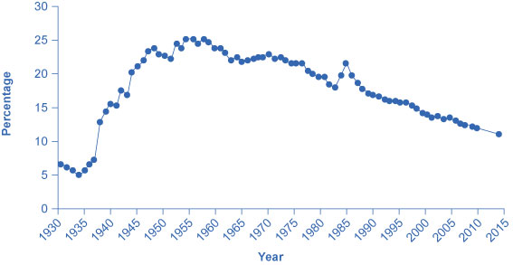

By the end of this section, you will be able to:

* Explain the concept of labor unions, including membership levels and wages
* Evaluate arguments for and against labor unions
* Analyze reasons for the decline in U.S. union membership

A **labor union**{: data-type="term"} is an organization of workers that negotiates with employers over wages and working conditions. A labor union seeks to change the balance of power between employers and workers by requiring employers to deal with workers collectively, rather than as individuals. Thus, negotiations between unions and firms are sometimes called **collective bargaining**{: data-type="term"}.

The subject of labor unions can be controversial. Supporters of labor unions view them as the workers’ primary line of defense against efforts by profit-seeking firms to hold down wages and benefits. Critics of labor unions view them as having a tendency to grab as much as they can in the short term, even if it means injuring workers in the long run by driving firms into bankruptcy or by blocking the new technologies and production methods that lead to economic growth. We will start with some facts about union membership in the United States.

### Facts about Union Membership and Pay

According to the U.S. Bureau of Labor and Statistics, about 11.1% of all U.S. workers belong to unions. Following are some of the facts provided by the bureau for 2014:

* 12\.0% of U.S. male workers belong to unions; 10.5% of female workers do
* 11\.1% of white workers, 13.4 % of black workers, and 9.8 % of Hispanic workers belong to unions
* 12\.5% of full-time workers and 6.0% of part-time workers are union members
* 4\.2% of workers ages 16–24 belong to unions, as do 14% of workers ages 45-54
* Occupations in which relatively high percentages of workers belong to unions are the federal government (26.9% belong to a union), state government (31.3%), local government (41.7%); transportation and utilities (20.6%); natural resources, construction, and maintenance (16.3%); and production, transportation, and material moving (14.7%)
* Occupations that have relatively low percentages of unionized workers are agricultural workers (1.4%), financial services (1.1%), professional and business services (2.4%), leisure and hospitality (2.7%), and wholesale and retail trade (4.7%)

In summary, the percentage of workers belonging to a union is higher for men than women; higher for blacks than for whites or Hispanics; higher for the 45–64 age range; and higher among workers in government and manufacturing than workers in agriculture or service-oriented jobs. [\[link\]](#Table_15_02) lists the largest U.S. labor unions and their membership.

<table id="Table_15_02" summary="The table shows the largest U.S. labor unions and their membership. Column 1 lists the Unions. Column 2 lists the Memberships of the unions. National Education Association (NEA); 3.2 million. Service Employees International Union (SEIU); 2.1 million. American Federation of Teachers (AFT); 1.5 million. Brotherhood of Teamsters (IBT); 1.4 million. The American Federation of State, County, and Municipal Workers (AFSCME); 1.3 million. United Food and Commercial Workers International Union; 1.3 million. United Steelworkers; 1.2 million. International Union, United Automobile, Aerospace and Agricultural Implement Workers of America (UAW); 990,000. International Association of Machinists and Aerospace Workers; 720,000. International Brotherhood of Electrical Workers (IBEW); 675,000."><caption>The Largest American Unions in 2013(Source: U.S. Department of Labor, Bureau of Labor Statistics)</caption><thead>
<tr>
<th>Union</th>
<th>Membership </th>
</tr>
</thead><tbody>
<tr>
<td>National Education Association (NEA)</td>
<td>3.2 million</td>
</tr>
<tr>
<td>Service Employees International Union (SEIU)</td>
<td>2.1 million</td>
</tr>
<tr>
<td>American Federation of Teachers (AFT)</td>
<td>1.5 million</td>
</tr>
<tr>
<td>International Brotherhood of Teamsters (IBT)</td>
<td>1.4 million</td>
</tr>
<tr>
<td>The American Federation of State, County, and Municipal Workers (AFSCME)</td>
<td>1.3 million</td>
</tr>
<tr>
<td>United Food and Commercial Workers International Union</td>
<td>1.3 million</td>
</tr>
<tr>
<td>United Steelworkers</td>
<td>1.2 million</td>
</tr>
<tr>
<td>International Union, United Automobile, Aerospace and Agricultural Implement Workers of America (UAW)</td>
<td>990,000</td>
</tr>
<tr>
<td>International Association of Machinists and Aerospace Workers</td>
<td>720,000</td>
</tr>
<tr>
<td>International Brotherhood of Electrical Workers (IBEW)</td>
<td>675,000</td>
</tr>
</tbody></table>

In terms of pay, benefits, and hiring, U.S. unions offer a good news/bad news story. The good news for unions and their members is that their members earn about 20% more than nonunion workers, even after adjusting for factors such as years of work experience and education level. The bad news for unions is that the share of U.S. workers who belong to a labor union has been steadily declining for 50 years, as shown in [\[link\]](#CNX_Econ_C15_003). About one-quarter of all U.S. workers belonged to a union in the mid-1950s, but only 11.1% of U.S. workers are union members today. If you leave out workers employed by the government (which includes teachers in public schools), only 6.6% of the workers employed by private firms now work for a union.

{: #CNX_Econ_C15_003 data-title="Percentage of Wage and Salary Workers Who Are Union Members "}

The following section analyzes the higher pay union workers receive compared the pay rates for nonunion workers. The following section analyzes declining union membership levels. An overview of these two issues will allow us to discuss many aspects of how unions work.

### Higher Wages for Union Workers

Why might union workers receive higher pay? What are the limits on how much higher pay they can receive? To analyze these questions, let’s consider a situation where all firms in an industry must negotiate with a single union, and no **firm**{: data-type="term" .no-emphasis} is allowed to hire nonunion labor. If no labor union existed in this market, then equilibrium (E) in the labor market would occur at the intersection of the demand for labor (D) and the supply of labor (S) in [\[link\]](#CNX_Econ_C15_004). The union can, however, threaten that, unless firms agree to the wages they demand, the workers will strike. As a result, the labor union manages to achieve, through negotiations with the firms, a union wage of Wu for its members, above what the equilibrium wage would otherwise have been.

 {: #CNX_Econ_C15_004 data-title="Union Wage Negotiations "}

This labor market situation resembles what a **monopoly firm**{: data-type="term" .no-emphasis} does in selling a product, but in this case a union is a monopoly selling labor to firms. At the higher union wage Wu, the firms in this industry will hire less labor than they would have hired in equilibrium. Moreover, an excess supply of workers want union jobs, but firms will not be hiring for such jobs.

From the union point of view, workers who receive higher wages are better off. However, notice that the quantity of workers (Qd) hired at the union wage Wu is smaller than the quantity Qe that would have been hired at the original equilibrium wage. A sensible union must recognize that when it pushes up the wage, it also reduces the incentive of firms to hire. This situation does not necessarily mean that union workers are fired. Instead, it may be that when union workers move on to other jobs or retire, they are not always replaced. Or perhaps when a firm expands production, it expands employment somewhat less with a higher union wage than it would have done with the lower equilibrium wage. Or perhaps a firm decides to purchase inputs from nonunion producers, rather than producing them with its own highly paid unionized workers. Or perhaps the firm moves or opens a new facility in a state or country where unions are less powerful.

From the firm’s point of view, the key question is whether the higher wage of union workers is matched by higher productivity. If so, then the firm can afford to pay the higher union wages and, indeed, the demand curve for “unionized” labor could actually shift to the right. This could reduce the job losses as the equilibrium employment level shifts to the right and the difference between the equilibrium and the union wages will have been reduced. If worker unionization does not increase productivity, then the higher union wage will cause lower profits or losses for the firm.

Union workers might have higher productivity than nonunion workers for a number of reasons. First, higher wages may elicit higher productivity. Second, union workers tend to stay longer at a given job, a trend that reduces the employer’s costs for training and hiring and results in workers with more years of experience. Many unions also offer job training and apprenticeship programs.

In addition, firms that are confronted with union demands for higher wages may choose production methods that involve more physical capital and less labor, resulting in increased labor productivity. [\[link\]](#Table_15_03) provides an example. Assume that a firm can produce a home exercise cycle with three different combinations of labor and manufacturing equipment. Say that labor is paid $16 an hour (including benefits) and the machines for manufacturing cost $200 each. Under these circumstances, the total cost of producing a home exercise cycle will be lowest if the firm adopts the plan of 50 hours of labor and one machine, as the table shows. Now, suppose that a union negotiates a wage of $20 an hour including benefits. In this case, it makes no difference to the firm whether it uses more hours of labor and fewer machines or less labor and more machines, though it might prefer to use more machines and to hire fewer union workers. (After all, machines never threaten to strike—but they do not buy the final product or service either.) In the final column of the table, the wage has risen to $24 an hour. In this case, the firm clearly has an incentive for using the plan that involves paying for fewer hours of labor and using three machines. If management responds to union demands for higher wages by investing more in machinery, then union workers can be more productive because they are working with more or better physical capital equipment than the typical nonunion worker. However, the firm will need to hire fewer workers.

<table id="Table_15_03" summary="The table shows an example of three production choices for manufacturing a home exercise cycle. Column 1 lists the Hours of Labor. Column 2 lists the Number of Machines. Column 3 lists the Cost of Labor + Cost of Machine ($16/hour). Column 4 lists the Cost of Labor + Cost of Machine ($20/hour). Column 5 lists the Cost of Labor + Cost of Machine ($24/hour). 30 hours of labor; 3 machines; $480 + 600 = $1,080; $600 + $600 = $1,200; $720 + $600 = $1,320. 40 hours of labor; 2 machines; $640 + 400 = $1,040; $800 + $400 = $1,200; $960 + $400 = $1,360. 50 hours of labor; 1 machines; $800 + 200 = $1,000; $1,00 + $200 = $1,200; $1,200 + $200 = $1,400."><caption>Three Production Choices to Manufacture a Home Exercise Cycle</caption><thead>
<tr>
<th>Hours of Labor</th>
<th>Number of Machines</th>
<th>Cost of Labor + Cost of Machine $16/hour</th>
<th>Cost of Labor + Cost of Machine $20/hour</th>
<th>Cost of Labor + Cost of Machine $24/hr </th>
</tr>
</thead><tbody>
<tr>
<td>30</td>
<td>3</td>
<td>$480 + $600 = $1,080</td>
<td>$600 + $600 = $1,200</td>
<td>$720 + $600 = $1,320</td>
</tr>
<tr>
<td>40</td>
<td>2</td>
<td>$640 + $400 = $1,040</td>
<td>$800 + $400 = $1,200</td>
<td>$960 + $400 = $1,360</td>
</tr>
<tr>
<td>50</td>
<td>1</td>
<td>$800 + $200 = $1,000</td>
<td>$1,000 + $200 = $1,200</td>
<td>$1,200 + $200 = $1,400</td>
</tr>
</tbody></table>

In some cases, unions have discouraged the use of labor-saving physical capital equipment—out of the reasonable fear that new machinery will reduce the number of union jobs. For example, in 2002, the union representing longshoremen who unload ships and the firms that operate shipping companies and port facilities staged a work stoppage that shut down the ports on the western coast of the United States. Two key issues in the dispute were the desire of the shipping companies and port operators to use handheld scanners for record-keeping and computer-operated cabs for loading and unloading ships—changes which the union opposed, along with overtime pay. President Obama threatened to use the Labor Management Relations Act of 1947—commonly known as the **Taft-Hartley Act**{: data-type="term" .no-emphasis}—where a court can impose an 80-day “cooling-off period” in order to allow time for negotiations to proceed without the threat of a work stoppage. Federal mediators were called in, and the two sides agreed to a deal in February 2015. The ultimate agreement allowed the new technologies, but also kept wages, health, and pension benefits high for workers. In the past, presidential use of the Taft-Hartley Act sometimes has made labor negotiations more bitter and argumentative but, in this case, it seems to have smoothed the road to an agreement.

In other instances, unions have proved quite willing to adopt new technologies. In one prominent example, during the 1950s and 1960s, the **United Mineworkers union**{: data-type="term" .no-emphasis} demanded that mining companies install labor-saving machinery in the mines. The mineworkers’ union realized that over time, the new machines would reduce the number of jobs in the mines, but the union leaders also knew that the mine owners would have to pay higher wages if the workers became more productive, and mechanization was a necessary step toward greater productivity.

In fact, in some cases union workers may be more willing to accept new technology than nonunion workers, because the union workers believe that the union will negotiate to protect their jobs and wages, whereas nonunion workers may be more concerned that the new technology will replace their jobs. In addition, union workers, who typically have higher job market experience and training, are likely to suffer less and benefit more than non-union workers from the introduction of new technology. Overall, it is hard to make a definitive case that union workers as a group are always either more or less welcoming to new technology than are nonunion workers.

### The Decline in U.S. Union Membership

The proportion of U.S. workers belonging to unions has declined dramatically since the early 1950s. Economists have offered a number of possible explanations:

* The shift from manufacturing to service industries
* The force of globalization and increased competition from foreign producers
* A reduced desire for unions because of the workplace protection laws now in place
* U.S. legal environment that makes it relatively more difficult for unions to organize workers and expand their membership

Let’s discuss each of these four explanations in more detail.

A first possible explanation for the decline in the share of U.S. workers belonging to unions involves the patterns of job growth in the manufacturing and service sectors of the economy shown in [\[link\]](#CNX_Econ_C15_005). The U.S. economy had about 15 million manufacturing jobs in 1960. This total rose to 19 million by the late 1970s and then declined to 17 million in 2013. Meanwhile, the number of jobs in service industries and in government combined rose from 35 million in 1960 to over 118 million by 2013, according to the Bureau of Labor Statistics. Because over time unions were stronger in manufacturing than in service industries, the growth in jobs was not happening where the unions were. It is interesting to note that several of the biggest unions in the country are made up of government workers, including the **American Federation of State**{: data-type="term" .no-emphasis}, **County and Municipal Employees (AFSCME)**{: data-type="term" .no-emphasis}; the **Service Employees International Union**{: data-type="term" .no-emphasis}; and the **National Education Association**{: data-type="term" .no-emphasis}. The membership of each of these unions is listed in [\[link\]](#Table_15_02). Outside of government employees, however, unions have not had great success in organizing the service sector.

 {: #CNX_Econ_C15_005 data-title="The Growth of Service Jobs "}

A second explanation for the decline in the share of unionized workers looks at import competition. Starting in the 1960s, U.S. carmakers and steelmakers faced increasing competition from Japanese and European manufacturers. As sales of imported cars and steel rose, the number of jobs in U.S. auto manufacturing fell. This industry is heavily unionized. Not surprisingly, membership in the United Auto Workers, which was 975,000 in 1985, had fallen to roughly 390,000 by 2015. Import competition not only decreases the employment in sectors where unions were once strong, but also decreases the bargaining power of unions in those sectors. However, as we have seen, unions that organize public-sector workers, who are not threatened by import competition, have continued to see growth.

A third possible reason for the decline in the number of union workers is that citizens often call on their elected representatives to pass laws concerning work conditions, overtime, parental leave, regulation of pensions, and other issues. Unions offered strong political support for these laws aimed at protecting workers but, in an ironic twist, the passage of those laws then made many workers feel less need for unions.

These first three possible reasons for the decline of unions are all somewhat plausible, but they have a common problem. Most other developed economies have experienced similar economic and political trends, such as the shift from manufacturing to services, globalization, and increasing government social benefits and regulation of the workplace. Clearly there are cultural differences between countries as to their acceptance of unions in the workplace. The share of the population belonging to unions in other countries is very high compared with the share in the United States. [\[link\]](#Table_15_04) shows the proportion of workers in a number of the world’s high-income economies who belong to unions. The United States is near the bottom, along with France and Spain. The last column shows union coverage, defined as including those workers whose wages are determined by a union negotiation even if the workers do not officially belong to the union. In the United States, union membership is almost identical to union coverage. However, in many countries, the wages of many workers who do not officially belong to a union are still determined by collective bargaining between unions and firms.

<table id="Table_15_04" summary="This table has three columns and nine rows. The first row is a header row and it labels each column, 'Country,' 'Union Density: Percentage of Workers Belonging to a Union,' and 'Union Coverage: Percentage of Workers Whose Wages Are Determined by Union Bargaining.' Under the 'Country' column are the values: Austria, France, Germany, Japan, Netherlands, Spain, Sweden, United Kingdom, and United States. Under the 'Union Density: Percentage of Workers Belonging to a Union' column are the values: 37%; 9%; 26%; 22%; 25%; 11.3%; 82%; 29%; and 11.1%. Under the 'Union Coverage: Percentage of Workers Whose Wages Are Determined by Union Bargaining' column are the values: 99%; 95%; 63%; 23%; 82%; 81%; 92%; 35%; and 12.5%."><caption>International Comparisons of Union Membership and Coverage in 2012(Source, CIA World Factbook, retrieved from www.cia.gov)</caption><thead>
<tr>
<th>Country</th>
<th>Union Density: Percentage of Workers Belonging to a Union</th>
<th>Union Coverage: Percentage of Workers Whose Wages Are Determined by Union Bargaining</th>
</tr>
</thead><tbody>
<tr>
<td>Austria</td>
<td>37%</td>
<td>99%</td>
</tr>
<tr>
<td>France</td>
<td>9%</td>
<td>95%</td>
</tr>
<tr>
<td>Germany</td>
<td>26%</td>
<td>63%</td>
</tr>
<tr>
<td>Japan</td>
<td>22%</td>
<td>23%</td>
</tr>
<tr>
<td>Netherlands</td>
<td>25%</td>
<td>82%</td>
</tr>
<tr>
<td>Spain</td>
<td>11.3%</td>
<td>81%</td>
</tr>
<tr>
<td>Sweden</td>
<td>82%</td>
<td>92%</td>
</tr>
<tr>
<td>United Kingdom</td>
<td>29%</td>
<td>35%</td>
</tr>
<tr>
<td>United States</td>
<td>11.1%</td>
<td>12.5%</td>
</tr>
</tbody></table>

These international differences in union membership suggest a fourth reason for the decline of union membership in the United States: perhaps U.S. laws are less friendly to the formation of unions than such laws in other countries. The close connection between union membership and a friendly legal environment is apparent in the history of U.S. unions. The great rise in union membership in the 1930s followed the passage of the **National Labor-Management Relations Act**{: data-type="term" .no-emphasis} of 1935, which specified that workers had a right to organize unions and that management had to give them a fair chance to do so. The U.S. government strongly encouraged the formation of unions during the early 1940s in the belief that unions would help to coordinate the all-out production efforts needed during World War II. However, after World War II came the passage of the Taft-Hartley Act of 1947, which gave states the power to allow workers to opt out of the union in their workplace if they so desired. This law made the legal climate less encouraging to those seeking to form unions, and union membership levels soon started declining.

The procedures for forming a union differ substantially from country to country. For example, the procedures in the United States and those in Canada are strikingly different. When a group of workers wish to form a union in the United States, they announce this fact and an election date is set when the employees at a firm will vote in a secret ballot on whether to form a union. Supporters of the union lobby for a “yes” vote, and the management of the firm lobbies for a “no” vote—often even hiring outside consultants for assistance in swaying workers to vote “no.” In Canada, by contrast, a union is formed when a sufficient proportion of workers (usually about 60%) sign an official card saying that they want a union. There is no separate “election date.” The management of Canadian firms is limited by law in its ability to lobby against the union. In addition, though it is illegal to discriminate and fire workers based on their union activity in the United States, the penalties are slight, making this a not so costly way of deterring union activity. In short, forming unions is easier in Canada—and in many other countries—than in the United States.

In summary, union membership in the United States is lower than in many other high-income countries, a difference that may be due to different legal environments and cultural attitudes toward unions.

Visit this [website][1] to read about recent protests regarding minimum wage for fast food employees.

  

### Key Concepts and Summary

A labor union is an organization of workers that negotiates as a group with employers over compensation and work conditions. Union workers in the United States are paid more on average than other workers with comparable education and experience. Thus, either union workers must be more productive to match this higher pay or the higher pay will lead employers to find ways of hiring fewer union workers than they otherwise would. American union membership has been falling for decades. Some possible reasons include the shift of jobs to service industries; greater competition from globalization; the passage of worker-friendly legislation; and U.S. laws that are less favorable to organizing unions.

### Self-Check Questions

[[link]](#Table_15_05) shows the quantity demanded and supplied in the labor market for driving city buses in the town of Unionville, where all the bus drivers belong to a union.

<table id="Table_15_05" summary="The table shows the quantity demanded and supplied in the labor market for driving city buses in the town of Unionville, where all the bus drivers belong to a union. Column 1 lists the Wage Per Hour. Column 2 lists the Quantity of Workers Demanded. Column 3 lists the Quantity of Workers Supplied. $14 (wage per hour); 12,000 (workers demanded); 6,000 (workers supplied). $16 (wage per hour); 10,000 (workers demanded); 7,000 (workers supplied). $18 (wage per hour); 8,000 (workers demanded); 8,000 (workers supplied). $20 (wage per hour); 6,000 (workers demanded); 9,000 (workers supplied). $22 (wage per hour); 4,000 (workers demanded); 10,000 (workers supplied). $24 (wage per hour); 2,000 (workers demanded); 11,000 (workers supplied)."><caption /><thead>
<tr>
<th>Wage Per Hour</th>
<th>Quantity of Workers Demanded</th>
<th>Quantity of Workers Supplied</th>
</tr>
</thead><tbody>
<tr>
<td>$14</td>
<td>12,000</td>
<td>6,000</td>
</tr>
<tr>
<td>$16</td>
<td>10,000</td>
<td>7,000</td>
</tr>
<tr>
<td>$18</td>
<td>8,000</td>
<td>8,000</td>
</tr>
<tr>
<td>$20</td>
<td>6,000</td>
<td>9,000</td>
</tr>
<tr>
<td>$22</td>
<td>4,000</td>
<td>10,000</td>
</tr>
<tr>
<td>$24</td>
<td>2,000</td>
<td>11,000</td>
</tr>
</tbody></table>
1.  What would the equilibrium wage and quantity be in this market if no union existed?
2.  Assume that the union has enough negotiating power to raise the wage to $4 per hour higher than it would otherwise be. Is there now excess demand or excess supply of labor?
{: type="a"}

1.  With no union, the equilibrium wage rate would be $18 per hour and there would be 8,000 bus drivers.
2.  If the union has enough negotiating power to raise the wage to $4 per hour higher than under the original equilibrium, the new wage would be $22 per hour. At this wage, 4,000 workers would be demanded while 10,000 would be supplied, leading to an excess supply of 6,000 workers.
{: type="a"}

Do unions typically oppose new technology out of a fear that it will reduce the number of union jobs? Why or why not?

Unions have sometimes opposed new technology out of a fear of losing jobs, but in other cases unions have helped to facilitate the introduction of new technology because unionized workers felt that the union was looking after their interests or that their higher skills meant that their jobs were essentially protected. And the new technologies meant increased productivity.

Compared with the share of workers in most other high-income countries, is the share of U.S. workers whose wages are determined by union bargaining higher or lower? Why or why not?

In a few other countries (such as France and Spain), the percentage of workers belonging to a union is similar to that in the United States. Union membership rates, however, are generally lower in the United States. When the share of workers whose wages are determined by union negotiations is considered, the United States ranks by far the lowest (because in countries like France and Spain, union negotiations often determine pay even for nonunion employees).

Are firms with a high percentage of union employees more likely to go bankrupt because of the higher wages that they pay? Why or why not?

No. While some unions may cause firms to go bankrupt, other unions help firms to become more competitive. No overall pattern exists.

Do countries with a higher percentage of unionized workers usually have less growth in productivity because of strikes and other disruptions caused by the unions? Why or why not?

From a social point of view, the benefits of unions and the costs seem to counterbalance. There is no evidence that in countries with a higher percentage of unionized workers, the economies grow more or less slowly.

### Review Questions

What is a labor union?

Why do employers have a natural advantage in bargaining with employees?

What are some of the most important laws that protect employee rights?

How does the presence of a labor union change negotiations between employers and workers?

What is the long-term trend in American union membership?

Would you expect the presence of labor unions to lead to higher or lower pay for worker-members? Would you expect a higher or lower quantity of workers hired by those employers? Explain briefly.

What are the main causes for the recent trends in union membership rates in the United States? Why are union rates lower in the United States than in many other developed countries?

### Critical Thinking Questions

Are unions and technological improvements complementary? Why or why not?

Will union membership continue to decline? Why or why not?

### References

AFL-CIO. “Training and Apprenticeships.” http://www.aflcio.org/Learn-About-Unions/Training-and-Apprenticeships.

Central Intelligence Agency. “The World Factbook.” https://www.cia.gov/library/publications/the-world-factbook/index.html.

Clark, John Bates. *Essentials of Economic Theory: As Applied to Modern Problems of Industry and Public Policy*. New York: A. M. Kelley, 1907, 501.

United Auto Workers (UAW). “About: Who We Are.” http://www.uaw.org/page/who-we-are.

United States Department of Labor: Bureau of Labor Statistics. “Economic News Release: Union Members Summary.” Last modified January 23, 2013. http://www.bls.gov/news.release/union2.nr0.htm.

United States Department of Labor, Bureau of Labor Statistics. 2015. “Economic News; Union Members Summary.” Accessed April 13, 2015. http://www.bls.gov/news.release/union2.nr0.htm.

### Glossary
{: data-type="glossary-title"}

collective bargaining
: negotiations between unions and a firm or firms
^

labor union
: an organization of workers that negotiates with employers over wages and working conditions

[1]: http://openstaxcollege.org/l/fastfoodwages
