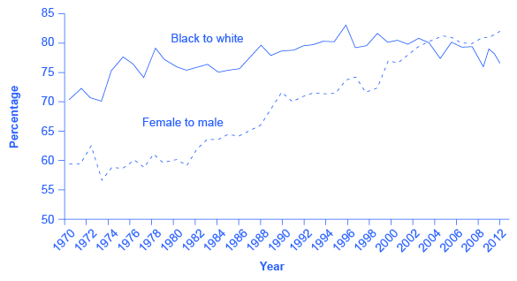

By the end of this section, you will be able to:

* Analyze earnings gaps based on race and gender
* Explain the impact of discrimination in a competitive market
* Identify U.S. public policies designed to reduce discrimination

**Discrimination**{: data-type="term"} involves acting on the belief that members of a certain group are inferior solely because of a factor such as race, gender, or religion. There are many types of discrimination but the focus here will be on discrimination in labor markets, which arises if workers with the same skill levels—as measured by education, experience, and expertise—receive different pay receive different pay or have different job opportunities because of their race or gender.

# Earnings Gaps by Race and Gender

A possible signal of labor market discrimination is when one group is paid less than another. [\[link\]](#CNX_Econ_C15_001) shows the average wage of black workers as a ratio of the average wage of white workers and the average wage of female workers as a ratio of the average wage of male workers. Research by the economists **Francine Blau**{: data-type="term" .no-emphasis} and **Laurence Kahn**{: data-type="term" .no-emphasis} shows that the gap between the earnings of women and men did not move much in the 1970s, but has declined since the 1980s. According to the U.S. Census, the gap between the earnings of blacks and whites diminished in the 1970s, but has not changed in 50 years. In both gender and race, an earnings gap remains.

 {: #CNX_Econ_C15_001 data-media-type="image/jpg" data-title="Wage Ratios by Sex and Race "}

An earnings gap between average wages, in and of itself, does not prove that discrimination is occurring in the labor market. We need to apply the same productivity characteristics to all parties (employees) involved. Gender discrimination in the labor market occurs when women are paid less than men despite having comparable levels of education, experience, and expertise. (Read the Clear It Up about the sex-discrimination suit brought against Wal-Mart.) Similarly, racial discrimination in the labor market exists when racially diverse employees are paid less than their coworkers of the majority race despite having comparable levels of education, experience, and expertise. To bring a successful gender discrimination lawsuit, a female employee must prove that she is paid less than a male employee who holds a similar job, with similar educational attainment, and with similar expertise. Likewise, someone who wants to sue on the grounds of racial discrimination must prove that he or she is paid less than an employee of another race who holds a similar job, with similar educational attainment, and with similar expertise.

What was the sex-discrimination case against Wal-Mart?

In one of the largest class-action sex-discrimination cases in U.S. history, 1.2 million female employees of Wal-Mart claimed that the company engaged in wage and promotion discrimination. In 2011, the Supreme Court threw out the case on the grounds that the group was too large and too diverse for the case to be considered a class action suit. Lawyers for the women regrouped and are now suing in smaller groups. Part of the difficulty for the female employees is that the court said that pay and promotion decisions were made by local managers and were not necessarily policies of the company as a whole. Consequently, female Wal-Mart employees in Texas are arguing that their new suit will challenge the management of a “discrete group of regional district and store managers.” They claim these managers made biased pay and promotion decisions. However, in 2013, a smaller California class action suit against the company was again rejected by a federal district court.

On other issues, Wal-Mart made the news again in 2013 when the National Labor Relations Board found Wal-Mart guilty of illegally penalizing and firing workers who took part in labor protests and strikes. Wal-Mart has already paid $11.7 million in back wages and compensation damages to women in Kentucky who were denied jobs due to their sex.

# Investigating the Female/Male Earnings Gap

As a result of changes in law and culture, women began to enter the paid workforce in substantial numbers in the mid- to late-twentieth century. By 2013, 58.6% of adult women held jobs while 71.2% of adult men did. Moreover, along with entering the workforce, women began to ratchet up their education levels. In 1971, 44% of undergraduate college degrees went to women; by 2013, women received 56% of bachelor’s degrees. In 1970, women received 5.4% of the degrees from law schools and 8.4% of the degrees from medical schools. By 2013, women were receiving 47.2% of the law degrees and 48.3% of the medical degrees. These gains in education and experience have reduced the female/male wage gap over time. However, concerns remain about the extent to which women have not yet assumed a substantial share of the positions at the top of the largest companies or in the U.S. Congress.

There are factors that can lower women’s average wages. Women are likely to bear a disproportionately large share of household responsibilities. A mother of young children is more likely to drop out of the labor force for several years or work on a reduced schedule than is the father. As a result, women in their 30s and 40s are likely, on average, to have less job experience than men. In the United States, childless women with the same education and experience levels as men are typically paid comparably. However, women with families and children are typically paid about 7% to 14% less than other women of similar education and work experience. (Meanwhile, married men earn about 10% to 15% more than single men with comparable education and work experience.)

The different patterns of family responsibilities possibly could be called discrimination, but it is primarily rooted in America’s social patterns of discrimination, which involve the roles that fathers and mothers play in child-rearing, rather than discrimination by employers in hiring and salary decisions.

Visit this [website][1] to read more about the persistently low numbers of women in executive roles in business and in the U.S. Congress.

 {: data-media-type="image/png"} 

# Investigating the Black–White Earnings Gap

Blacks experienced blatant labor market discrimination during much of the twentieth century. Until the passage of the **Civil Rights Act of 1964**{: data-type="term" .no-emphasis}, it was legal in many states to refuse to hire a black worker, regardless of the credentials or experience of that worker. Moreover, blacks were often denied access to educational opportunities, which in turn meant that they had lower levels of qualifications for many jobs. At least one economic study has shown that the 1964 law is partially responsible for the narrowing of the gap in black–white earnings in the late 1960s and into the 1970s; for example, the ratio of total earnings of black male workers to white male workers rose from 62% in 1964 to 75.3% in 2013, according to the Bureau of Labor Statistics.

However, the earnings gap between black and white workers has not changed as much as the earnings gap between men and women has in the last half century. The remaining racial gap seems related both to continuing differences in education levels and to the presence of discrimination. [\[link\]](#Table_15_06) shows that the percentage of blacks who complete a four-year college degree remains substantially lower than the percentage of whites who complete college. According to the U.S. Census, both whites and blacks have higher levels of educational attainment than Hispanics and lower levels than Asians. The lower average levels of education for black workers surely explain part of the earnings gap. In fact, black women who have the same levels of education and experience as white women receive, on average, about the same level of pay. One study shows that white and black college graduates have identical salaries immediately after college; however, the racial wage gap widens over time, an outcome that suggests the possibility of continuing discrimination. Another study conducted a field experiment by responding to job advertisements with fictitious resumes with either very African American sounding names or very white sounding names and found out that white names received 50 percent more callbacks for interviews. This is suggestive of discrimination in job opportunities. Further, as the following Clear It Up feature explains, there is evidence to support that discrimination in the housing market is connected to employment discrimination.

<table id="Table_15_06" summary="The table shows the percentages of educational attainment by race and ethnicity in 2011. Column 1 lists the level of education attained. Column 2 lists percentages for White citizens. Column 3 lists the percentages for Hispanic citizens. Column 4 lists the percentages for Black citizens. Column 5 lists the percentages for Asian citizens. Completed four years of high school or more; 87.6% (White); 63.9% (Hispanic); 84.2% (Black); 88.9% (Asian). Completed four years of college or more; 30.3% (White); 13.9% (Hispanic); 19.8% (Black); 52.4% (Asian)."><caption>Educational Attainment by Race and Ethnicity in 2011(Source: www.census.gov)</caption><thead>
<tr>
<th />
<th>White</th>
<th>Hispanic</th>
<th>Black</th>
<th>Asian</th>
</tr>
</thead><tbody>
<tr>
<td>Completed four years of high school or more</td>
<td>87.6%</td>
<td>62.9%</td>
<td>84.2%</td>
<td>88.9%</td>
</tr>
<tr>
<td>Completed four years of college or more</td>
<td>30.3%</td>
<td>13.9%</td>
<td>19.8%</td>
<td>52.4%</td>
</tr>
</tbody></table>

How is discrimination in the housing market connected to employment discrimination?

In a recent study by the Housing and Urban Development (HUD) department, black homebuyers who ask to look at homes for sale are shown 18 percent fewer homes compared to white homebuyers. Asians are shown 19 percent fewer properties. Additionally, Hispanics experience more discrimination in renting apartments and undergo stiffer credit checks than white renters. In a 2012 study conducted by the U.S. Department of Housing and Urban Development and the nonprofit Urban Institute, Hispanic testers who contacted agents about advertised rental units were given information about 12 percent fewer units available and were shown seven percent fewer units than white renters. The $9 million study, based on research in 28 metropolitan areas, concluded that blatant “door slamming” forms of discrimination are on the decline but that the discrimination that does exist is harder to detect, and as a result, more difficult to remedy. According to the *Chicago Tribune*, HUD Secretary Shaun Donovan told reporters, “Just because it’s taken on a hidden form doesn’t make it any less harmful. You might not be able to move into that community with the good schools.”

The lower levels of education for black workers can also be a result of discrimination—although it may be pre-labor market discrimination, rather than direct discrimination by employers in the labor market. For example, if discrimination in housing markets causes black families to live clustered together in certain poorer neighborhoods, then the black children will continue to have lower educational attainment then their white counterparts and, consequently, not be able to obtain the higher paying jobs that require higher levels of education. Another element to consider is that in the past, when blacks were effectively barred from many high-paying jobs, getting additional education could have seemed somewhat pointless, because the educational degrees would not pay off. Even though labor market discrimination has been legally abolished, it can take some time to establish a culture and a tradition of valuing education highly. Additionally, a legacy of past discrimination may contribute to an attitude that blacks will have a difficult time succeeding in academic subjects. In any case, the impact of social discrimination in labor markets is more complicated than seeking to punish a few bigoted employers.

# Competitive Markets and Discrimination

**Gary Becker**{: data-type="term" .no-emphasis} (b. 1930), who won the Nobel Prize in economics in 1992, was one of the first to analyze discrimination in economic terms. Becker pointed out that while competitive markets can allow some employers to practice discrimination, it can also provide profit-seeking firms with incentives not to discriminate. Given these incentives, Becker explored the question of why discrimination persists.

If a business is located in an area with a large minority population and refuses to sell to minorities, it will cut into its own profits. If some businesses run by bigoted employers refuse to pay women and/or minorities a wage based on their productivity, then other profit-seeking employers can hire these workers. In a **competitive market**{: data-type="term" .no-emphasis}, if the owners of a business care more about the color of money than about the color of skin, they will have an incentive to make buying, selling, hiring, and promotion decisions strictly based on economic factors.

The power of markets to offer at least a degree of freedom to oppressed groups should not be underestimated. In many countries, cohesive minority groups like Jews and emigrant Chinese have managed to carve out a space for themselves through their economic activities, despite legal and social discrimination against them. Many immigrants, including those who come to the United States, have taken advantage of economic freedom to make new lives for themselves. However, history teaches that market forces alone are unlikely to eliminate discrimination. After all, discrimination against African Americans persisted in the market-oriented U.S. economy during the century between President Abraham Lincoln’s Emancipation Proclamation, which freed the slaves in 1863, and the passage of the Civil Rights Act of 1964—and has continued since then, too.

So why does discrimination persist in competitive markets? Gary Becker sought to explain this persistence. Discriminatory impulses can emerge at a number of levels: among managers, among workers, and among customers. Consider the situation of a manager who is not personally prejudiced, but who has many workers or customers who are prejudiced. If that manager treats minority groups or women fairly, the manager may find it hurts the morale of prejudiced co-workers or drives away prejudiced customers. In such a situation, a policy of nondiscrimination could reduce the firm’s profits. After all, a business firm is part of society, and a firm that does not follow the societal norms is likely to suffer. Market forces alone are unlikely to overwhelm strong social attitudes about discrimination.

Visit this [website][2] to read more about wage discrimination.

 {: data-media-type="image/png"} 

# Public Policies to Reduce Discrimination

A first public policy step against discrimination in the labor market is to make it illegal. For example, the **Equal Pay Act of 1963**{: data-type="term" .no-emphasis} said that men and women who do equal work at a company must be paid the same. The Civil Rights Act of 1964 prohibits employment discrimination based on race, color, religion, sex, or national origin. The **Age Discrimination in Employment Act**{: data-type="term" .no-emphasis} of 1967 prohibited discrimination on the basis of age against individuals who are 40 years of age or older. The **Civil Rights Act of 1991**{: data-type="term" .no-emphasis} provides monetary damages in cases of intentional employment discrimination. The Pregnancy Discrimination Act of 1978 was aimed at prohibiting discrimination against women in the workplace who are planning to get pregnant, are pregnant, or are returning after pregnancy. Passing a law, however, is only part of the answer, since discrimination by prejudiced employers may be less important than broader social patterns.

These laws against discrimination have reduced the gender wage gap. A study by the Department of Labor in 2007 compared salaries of men and women who have similar educational achievement, work experience, and occupation and found that the gender wage gap is only 5%.

In the case of the earnings gap between blacks and whites (and also between Hispanics and whites), probably the single largest step that could be taken at this point in U.S. history to close the earnings gap would be to reduce the gap in educational achievement. Part of the answer to this issue involves finding ways to improve the performance of schools, which is a highly controversial topic in itself. In addition, the education gap is unlikely to close unless black and Hispanic families and peer groups strengthen their culture of support for educational achievement.

**Affirmative action**{: data-type="term"} is the name given to active efforts by government or businesses that give special rights to minorities in hiring and promotion to make up for past discrimination. Affirmative action, in its limited and not especially controversial form, means making an effort to reach out to a broader range of minority candidates for jobs. In its more aggressive and controversial form, affirmative action required government and companies to hire a specific number or percentage of minority employees. However, the U.S. Supreme Court has ruled against state affirmative action laws. Today, affirmative action policies are applied only to federal contractors who have lost a discrimination lawsuit. This type of redress is enforced by the federal **Equal Employment Opportunity Commission (EEOC)**{: data-type="term" .no-emphasis}.

# An Increasingly Diverse Workforce

Racial and ethnic diversity is on the rise in the U.S. population and work force. As [\[link\]](#CNX_Econ_C15_006) shows, while the white Americans composed 78% of the population in 2012, the U.S. Bureau of the Census projects that whites will be 69% of the U.S. population by 2060. The proportion of U.S. citizens who are of Hispanic background is predicted to rise substantially. Moreover, in addition to expected changes in the population, diversity is being increased in the workforce as the women who entered the workforce in the 1970s and 1980s are now moving up the promotion ladders within their organizations.

 ![The graph shows how populations of various ethnicities are predicted to change by 2060. The percentage of whites is expected to drop from 78% to 69%. The number of blacks is expected to increase from 13% to 15%. The number of Asians is expected to rise from 5.1% to 8.2%. The number of NHPIs is expected to rise from 0.2% to 0.3%. The number of AIANs is expected to rise from 1.2% to 1.5%. Additionally, the number of people who identify with two or more races is expected to rise from 2.4% to 6.4%. The number of non-Hispanics is expected to drop from 63% to 43%. The number of Hispanics is expected to rise from 17% to 31%.](../resources/CNX_Econ_C15_006.jpg "This figure shows projected changes in the ethnic makeup of the U.S. population by 2060. Note that &#x201C;NHPI&#x201D; stands for Native Hawaiian and Other Pacific Islander. &#x201C;AIAN&#x201D; stands for American Indian and Alaska Native. Source: US Department of Commerce"){: #CNX_Econ_C15_006 data-media-type="image/jpg" data-title="Projected Changes in America&#x2019;s Racial and Ethnic Diversity "}

Fortune-telling is not economics, but it still can be clarifying to speculate about the future. Optimists argue that the growing proportions of minority workers will knock over remaining discriminatory barriers. The economy will benefit as an increasing proportion of workers from traditionally disadvantaged groups have a greater opportunity to fulfill their potential. Pessimists worry that the social tensions between men and women and between ethnic groups will rise and that workers will be less productive as a result. Anti-discrimination policy, at its best, seeks to help society move toward the more optimistic outcome.

# Key Concepts and Summary

Discrimination occurs in a labor market when workers with the same economic characteristics, such as education, experience, and skill, are paid different amounts because of race, gender, religion, age, or disability status. In the United States, female workers on average earn less than male workers, and black workers on average earn less than white workers. There is controversy over the extent to which these earnings gaps can be explained by discrimination or by differences in factors like education and job experience. Free markets can allow discrimination to occur; but the threat of a loss of sales or a loss of productive workers can also create incentives for a firm not to discriminate. A range of public policies can be used to reduce earnings gaps between men and women or between white and other racial/ethnic groups: requiring equal pay for equal work, and attaining more equal educational outcomes.

# Self-Check Questions

Explain in each of the following situations how market forces might give a business an incentive to act in a less discriminatory fashion.

1.  A local flower delivery business run by a bigoted white owner notices that many of its local customers are black.
2.  An assembly line has traditionally only hired men, but it is having a hard time hiring sufficiently qualified workers.
3.  A biased owner of a firm that provides home health care services would like to pay lower wages to Hispanic workers than to other employees.
{: data-number-style="lower-alpha"}

1.  Firms have a profit incentive to sell to everyone, regardless of race, ethnicity, religion, or gender.
2.  A business that needs to hire workers to expand may also find that if it draws only from its accustomed pool of workers—say, white men—it lacks the workers it needs to expand production. Such a business would have an incentive to hire more women and minorities.
3.  A discriminatory business that is underpaying its workers may find those workers leaving for jobs with another employer who offers better pay. This market pressure could cause the discriminatory business to behave better.
{: data-number-style="lower-alpha"}

Does the earnings gap between the average wages of females and the average wages of males prove labor market discrimination? Why or why not?

No. The earnings gap does not prove discrimination because it does not compare the wages of men and women in the same job who have the same amounts of education, experience, and productivity.

# Review Questions

Describe how the earnings gap between men and women has evolved in recent decades.

Describe how the earnings gap between blacks and whites has evolved in recent decades.

Does a gap between the average earnings of men and women, or between whites and blacks, prove that employers are discriminating in the labor market? Explain briefly.

Will a free market tend to encourage or discourage discrimination? Explain briefly.

What policies, when used together with antidiscrimination laws, might help to reduce the earnings gap between men and women or between white and black workers?

Describe how affirmative action is applied in the labor market.

# Critical Thinking Questions

If it is not profitable to discriminate, why does discrimination persist?

If a company has discriminated against minorities in the past, should it be required to give priority to minority applicants today? Why or why not?

# References

Anderson, Deborah J., Melissa Binder, and Kate Krause. “The Motherhood Wage Penalty Revisited: Experience, Heterogeneity, Work Effort, and Work-Schedule Flexibility.” *Industrial and Labor Relations Review*. no. 2 (2003): 273–294. http://www2.econ.iastate.edu/classes/econ321/orazem/anderson\\\_motherhood-penalty.pdf.

Turner, Margery Austin, Rob Santos, Diane K. Levy, Doug Wissoker, Claudia Aranda, Rob Pitingolo, and The Urban Institute. U.S. Department of Housing and Urban Development. “Housing Discrimination Against Racial and Ethnic Minorities 2012.” Last modified June 2013. http://www.huduser.org/Publications/pdf/HUD-514\\\_HDS2012.pdf.

Austin, Algernon. Economic Policy Institute. “The Unfinished March: An Overview.” Last modified June 18, 2013. http://www.epi.org/publication/unfinished-march-overview/.

Bertrand, Marianne, and Sendhil Mullainathan. “Are Emily and Greg More Employable Than Lakisha and Jamal? A Field Experiment on Labor Market Discrimination.” *American Economic Review*. no. 4 (2004): 991-1013. https://www.aeaweb.org/articles.php?doi=10.1257/0002828042002561&amp;fnd=s.

Blau, Francine D., and Laurence M. Kahn. “The Gender Pay Gap: Have Women Gone as Far as They Can?” *Academy of Management Perspectives*. no. 1 (2007): 7–23. 10.5465/AMP.2007.24286161.

Card, David, and Alan B. Kruger. Princeton University and the National Bureau of Economic Research. “Trends in Relative Black–White Earnings Revisited (Working Paper #310).” December 1992. http://www.stanford.edu/group/scspi/\\\_media/pdf/Classic\\\_Media/Card%20and%20Krueger\\\_1993\\\_Race%20and%20Ethnicity.pdf.

Donovan, Theresa. Jurist. “Federal Judge Rejects Class Status in Wal-Mart Discrimination Suit.” Last modified August 5, 2013. http://jurist.org/paperchase/2013/08/federal-judge-rejects-class-status-in-wal-mart-discrimination-suit.php.

Harris, Elizabeth A. “Labor Panel Finds Illegal Punishments at Walmart.” *The New York Times*, November 18, 2013. http://www.nytimes.com/2013/11/19/business/labor-panel-finds-illegal-punishments-at-walmart.html?\\\_r=1&amp;.

Kolesnikova, Natalia A., and Yang Liu. Federal Reserve Bank of St. Louis: The Regional Economist, “Gender Wage Gap May Be Much Smaller Than Most Think.” Last modified October 2011.http://www.stlouisfed.org/publications/re/articles/?id=2160.

Podmolik, Mary Ellen. “HUD Finds Housing Discrimination ‘Hidden’ But Prevalent.” *Chicago Tribune: Business*, June 12, 2013. http://articles.chicagotribune.com/2013-06-12/business/ct-biz-0612-housing-discrimination-20130612\\\_1\\\_renters-testers-chicago-area.

Spreen, Thomas Luke. United States Department of Labor: Bureau of Labor Statistics, “Recent College Graduates in the U.S. Labor Force: Data from the Current Population Survey.” *Monthly Labor Review* (February, 2013). http://www.bls.gov/opub/mlr/2013/02/art1full.pdf .

U.S. Bureau of Labor Statistics: BLS Reports. “Women in the Labor Force: A Databook (Report 1040).” Last modified February 2013. http://www.bls.gov/cps/wlf-databook-2012.pdf.U.S. Equal Employment Opportunity Commission, “Walmart to Pay More than $11.7 Million to Settle EEOC Sex Discrimination Suit.” Last modified March 1, 2010. http://www.eeoc.gov/eeoc/newsroom/release/3-1-10.cfm.

United States Department of Labor: Bureau of Labor Statistics. “News Release: Usual Weekly Earnings of Wage and Salary Workers (Third Quarter 2013).” November 1, 2013. http://www.bls.gov/news.release/pdf/wkyeng.pdf.

Weinberger, Catherine J., and Lois Joy. “The Relative Earnings of Black College Graduates, 1980–2001.” In *Race and Economic Opportunity in the 21st Century*, edited by Marlene Kim. New York: Routledge, 2007. http://www.econ.ucsb.edu/~weinberg/grads.pdf.

[1]: http://openstaxcollege.org/l/catalyst
[2]: http://openstaxcollege.org/l/censusincome
