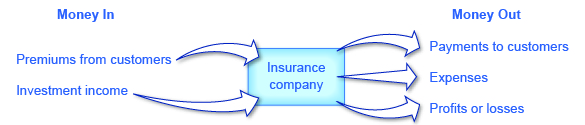

By the end of this section, you will be able to:

* Explain how insurance works
* Identify and evaluate various forms of government and social insurance
* Discuss the problems caused by moral hazard and adverse selection
* Analyze the impact of government regulation of insurance

**Insurance**{: data-type="term"} is a method that households and firms use to prevent any single event from having a significant detrimental financial effect. Generally, households or firms with insurance make regular payments, called **premiums**{: data-type="term"}. The insurance company prices these premiums based on the probability of certain events occurring among a pool of people. Members of the group who then suffer a specified bad experience receive payments from this pool of money.

Many people have several kinds of insurance: health insurance that pays when they receive medical care; car insurance that pays if they are the driver in an automobile accident; house or renter’s insurance that pays if possessions are stolen or damaged by fire; and life insurance, which pays for the family if the principal dies. [\[link\]](#Table_16_01) lists a set of insurance markets.

<table id="Table_16_01" summary="The table has three columns. The first is labeled &#x201C;type of insurance&#x201D;; the second is labeled &#x201C;who pays for it?&#x201D; and the third is labeled &#x201C;it pays out when&#x2026;&#x201D; There are 6 rows of various insurance markets. Health insurance is paid for by employers and individuals; and it pays out when medical expenses are incurred. Life insurance is paid for by employers and individuals; and it pays out when the policyholder dies. Automobile insurance is paid for by individuals; and it pays out when the car is damaged, stolen, or causes damage to others. Property and homeowner&#x2019;s insurance is paid for by homeowners and renters; and it pays out when dwelling is damaged or burglarized. Liability insurance is paid for by firms and individuals; and it pays out when an injury occurs for which you are partly responsible. Malpractice insurance is paid for by doctors, lawyers, and other professionals; and it pay out when a poor quality of service is provided that causes harm to others."><caption>Some Insurance Markets</caption><thead>
<tr>
<th>Type of Insurance</th>
<th>Who Pays for It?</th>
<th>It Pays Out When . . .</th>
</tr>
</thead><tbody>
<tr>
<td>Health insurance</td>
<td>Employers and individuals</td>
<td>Medical expenses are incurred</td>
</tr>
<tr>
<td>Life insurance</td>
<td>Employers and individuals</td>
<td>Policyholder dies</td>
</tr>
<tr>
<td>Automobile insurance</td>
<td>Individuals</td>
<td>Car is damaged, stolen, or causes damage to others</td>
</tr>
<tr>
<td>Property and homeowner’s insurance</td>
<td>Homeowners and renters</td>
<td>Dwelling is damaged or burglarized</td>
</tr>
<tr>
<td>Liability insurance</td>
<td>Firms and individuals</td>
<td>An injury occurs for which you are partly responsible</td>
</tr>
<tr>
<td>Malpractice insurance</td>
<td>Doctors, lawyers, and other professionals</td>
<td>A poor quality of service is provided that causes harm to others</td>
</tr>
</tbody></table>

All insurance involves imperfect information in both an obvious way and in a deeper way. At an obvious level, future events cannot be predicted with certainty. For example, it cannot be known with certainty who will have a car accident, become ill, die, or have his home robbed in the next year. Imperfect information also applies to estimating the risk that something will happen to any individual. It is difficult for an insurance company to estimate the risk that, say, a particular 20-year-old male driver from New York City will have an accident, because even within that group, some drivers will drive more safely than others. Thus, adverse events occur out of a combination of people’s characteristics and choices that make the risks higher or lower and then the good or bad luck of what actually happens.

# How Insurance Works

A simplified example of automobile insurance might work this way. Suppose that a group of 100 drivers can be divided into three groups. In a given year, 60 of those people have only a few door dings or chipped paint, which costs $100 each. Another 30 of the drivers have medium-sized accidents that cost an average of $1,000 in damages, and 10 of the drivers have large accidents that cost $15,000 in damages. For the moment, let’s imagine that at the beginning of any year, there is no way of identifying the drivers who are low-risk, medium-risk, or high-risk. The total damage incurred by car accidents in this group of 100 drivers will be $186,000, that is:

<math xmlns="http://www.w3.org/1998/Math/MathML"><mtable columnspacing="2px" columnalign="right center left"><mtr><mtd><mtext>Total damage</mtext></mtd><mtd><mtext> = </mtext></mtd><mtd><mtext>(60 × $100) + (30 × $1,000) + (10 × $15,000)</mtext></mtd></mtr><mtr><mtd /><mtd><mtext> = </mtext></mtd><mtd><mtext>$600 + $30,000 + $150,000</mtext></mtd></mtr><mtr><mtd /><mtd><mtext> = </mtext></mtd><mtd><mtext>$186,000</mtext></mtd></mtr></mtable></math>

If each of the 100 drivers pays a premium of $1,860 each year, the insurance company will collect the $186,000 that is needed to cover the costs of the accidents that occur.

Since insurance companies have such a large number of clients, they are able to negotiate with providers of health care and other services for lower rates than the individual would be able to get, thus increasing the benefit to consumers of becoming insured and saving the insurance company itself money when it pays out claims.

Insurance companies receive income, as shown in [\[link\]](#CNX_Econ_C16_001), from insurance premiums and investment income. Investment income is derived from investing the funds that insurance companies received in the past but did not pay out as insurance claims in prior years. The insurance company receives a rate of return from investing these funds or reserves. The investments are typically made in fairly safe, liquid (easy to convert into cash) investments, as the insurance companies needs to be able to readily access these funds when a major disaster strikes.

 {: #CNX_Econ_C16_001 data-title="An Insurance Company: What Comes In, What Goes Out "}

# Government and Social Insurance

Federal and state governments run a number of insurance programs. Some of the programs look much like **private insurance**{: data-type="term" .no-emphasis}, in the sense that the members of a group makes steady payments into a fund, and those in the group who suffer an adverse experience receive payments. Other programs protect against risk, but without an explicit fund being set up. Following are some examples.

* **Unemployment insurance**{: data-type="term" .no-emphasis}\: Employers in every state pay a small amount for unemployment insurance, which goes into a fund that is used to pay benefits to workers for a period of time, usually six months, after they lose their jobs.
* **Pension insurance**{: data-type="term" .no-emphasis}\: Employers that offer pensions to their retired employees are required by law to pay a small fraction of what they are setting aside for pensions to the Pension Benefit Guarantee Corporation, which is used to pay at least some pension benefits to workers if a company goes bankrupt and cannot pay the pensions it has promised.
* **Deposit insurance**{: data-type="term" .no-emphasis}\: Banks are required by law to pay a small fraction of their deposits to the Federal Deposit Insurance Corporation, which goes into a fund that is used to pay depositors the value of their bank deposits up to $250,000 (the amount was raised from $100,000 to $250,000 in 2008) if the bank should go bankrupt.
* **Workman’s compensation insurance**{: data-type="term" .no-emphasis}\: Employers are required by law to pay a small percentage of the salaries that they pay into funds, typically run at the state level, that are used to pay benefits to workers who suffer an injury on the job.
* **Retirement insurance**{: data-type="term" .no-emphasis}\: All workers pay a percentage of their income into Social Security and into Medicare, which then provides income and health care benefits to the elderly. Social Security and Medicare are not literally “insurance” in the sense that those currently contributing to the fund are not eligible for benefits. They function like insurance, however, in the sense that regular payments are made into the programs today in exchange for benefits to be received in the case of a later event—either becoming old or becoming sick when old. Such programs are sometimes called “social insurance.”

The major additional costs to insurance companies, other than the payment of claims, are the costs of running a business: the administrative costs of hiring workers, administering accounts, and processing insurance claims. For most insurance companies, the insurance premiums coming in and the claims payments going out are much larger than the amounts earned by investing money or the administrative costs.

Thus, while factors like investment income earned on reserves, administrative costs, and groups with different risks complicate the overall picture, a fundamental law of insurance must hold true: The average person’s payments into insurance over time must cover 1) the average person’s claims, 2) the costs of running the company, and 3) leave room for the firm’s profits. This law can be boiled down to the idea that average premiums and average insurance payouts must be approximately equal.

# Risk Groups and Actuarial Fairness

Not all of those who purchase insurance face the same risks. Some people may be more likely, because of genetics or personal habits, to fall sick with certain diseases. Some people may live in an area where car theft or home robbery is more likely than others. Some drivers are safer than others. A **risk group**{: data-type="term"} can be defined as a group that shares roughly the same risks of an adverse event occurring.

Insurance companies often classify people into risk groups, and charge lower premiums to those with lower risks. If people are not separated into risk groups, then those with low-risk must pay for those with high risks. In the simple example of how car insurance works, given earlier, 60 drivers had very low damage of $100 each, 30 drivers had medium-sized accidents that cost $1,000 each, and 10 of the drivers had large accidents that cost $15,000. If all 100 of these drivers pay the same $1,860, then those with low damages are in effect paying for those with high damages.

If it is possible to classify drivers according to risk group, then each group can be charged according to its expected losses. For example, the insurance company might charge the 60 drivers who seem safest of all $100 apiece, which is the average value of the damages they cause. Then the intermediate group could pay $1,000 apiece and the high-cost group $15,000 each. When the level of insurance premiums that someone pays is equal to the amount that an average person in that risk group would collect in insurance payments, the level of insurance is said to be “actuarially fair.”

Classifying people into risk groups can be controversial. For example, if someone had a major automobile accident last year, should that person be classified as a high-risk driver who is likely to have similar accidents in the future, or as a low-risk driver who was just extremely unlucky? The driver is likely to claim to be low-risk, and thus someone who should be in a risk group with those who pay low insurance premiums in the future. The insurance company is likely to believe that, on average, having a major accident is a signal of being a high-risk driver, and thus try to charge this driver higher insurance premiums. The next two sections discuss the two major problems of imperfect information in insurance markets—called moral hazard and adverse selection. Both problems arise from attempts to categorize those purchasing insurance into risk groups.

# The Moral Hazard Problem

**Moral hazard**{: data-type="term"} refers to the case when people engage in riskier behavior with insurance than they would if they did not have insurance. For example, if you have health insurance that covers the cost of visiting the doctor, you may be less likely to take precautions against catching an illness that might require a doctor’s visit. If you have car insurance, you will worry less about driving or parking your car in ways that make it more likely to get dented. In another example, a business without insurance might install absolute top-level security and fire sprinkler systems to guard against theft and fire. If it is insured, that same business might only install a minimum level of security and fire sprinkler systems.

Moral hazard cannot be eliminated, but insurance companies have some ways of reducing its effect. Investigations to prevent insurance fraud are one way of reducing the extreme cases of moral hazard. Insurance companies can also monitor certain kinds of behavior; to return to the example from above, they might offer a business a lower rate on property insurance if the business installs a top-level security and fire sprinkler system and has those systems inspected once a year.

Another method to reduce moral hazard is to require the injured party to pay a share of the costs. For example, insurance policies often have **deductibles**{: data-type="term"}, which is an amount that the insurance policyholder must pay out of their own pocket before the insurance coverage starts paying. For example, auto insurance might pay for all losses greater than $500. Health insurance policies often have a **copayment**{: data-type="term"}, in which the policyholder must pay a small amount; for example, a person might have to pay $20 for each doctor visit, and the insurance company would cover the rest. Another method of cost-sharing is **coinsurance**{: data-type="term"}, which means that the insurance company covers a certain percentage of the cost. For example, insurance might pay for 80% of the costs of repairing a home after a fire, but the homeowner would pay the other 20%.

All of these forms of cost-sharing discourage moral hazard, because people know that they will have to pay something out of their own pocket when they make an insurance claim. The effect can be powerful. One prominent study found that when people face moderate deductibles and copayments for their health insurance, they consume about one-third less in medical care than people who have complete insurance and do not pay anything out of pocket, presumably because deductibles and copayments reduce the level of moral hazard. However, those who consumed less health care did not seem to have any difference in health status.

A final way of reducing moral hazard, which is especially applicable to health care, is to focus on the incentives of providers of health care, rather than consumers. Traditionally, most health care in the United States has been provided on a **fee-for-service**{: data-type="term"} basis, which means that medical care providers are paid for the services they provide and are paid more if they provide additional services. However, in the last decade or so, the structure of healthcare provision has shifted to an emphasis on health maintenance organizations (HMOs). A **health maintenance organization (HMO)**{: data-type="term"} provides healthcare that receives a fixed amount per person enrolled in the plan—regardless of how many services are provided. In this case, a patient with insurance has an incentive to demand more care, but the healthcare provider, which is receiving only a fixed payment, has an incentive to reduce the moral hazard problem by limiting the quantity of care provided—as long as it will not lead to worse health problems and higher costs later. Today, many doctors are paid with some combination of managed care and fee-for-service; that is, a flat amount per patient, but with additional payments for the treatment of certain health conditions.

Imperfect information is the cause of the moral hazard problem. If an insurance company had perfect information on risk, it could simply raise its premiums every time an insured party engages in riskier behavior. However, an insurance company cannot monitor all the risks that people take all the time and so, even with various checks and cost-sharing, moral hazard will remain a problem.

Visit this [website][1] to read about the relationship between health care and behavioral economics.

  

# The Adverse Selection Problem

**Adverse selection**{: data-type="term"} refers to the problem in which the buyers of insurance have more information about whether they are high-risk or low-risk than the insurance company does. This creates an asymmetric information problem for the insurance company because buyers who are high-risk tend to want to buy more insurance, without letting the insurance company know about their higher risk. For example, someone purchasing health insurance or life insurance probably knows more about their family’s health history than an insurer can reasonably find out even with a costly investigation; someone purchasing car insurance may know that they are a high-risk driver who has not yet had a major accident—but it is hard for the insurance company to collect information about how people actually drive.

To understand how adverse selection can strangle an insurance market, recall the situation of 100 drivers who are buying automobile insurance, where 60 drivers had very low damages of $100 each, 30 drivers had medium-sized accidents that cost $1,000 each, and 10 of the drivers had large accidents that cost $15,000. That would equal $186,000 in total payouts by the insurance company. Imagine that, while the insurance company knows the overall size of the losses, it cannot identify the high-risk, medium-risk, and low-risk drivers. However, the drivers themselves know their risk groups. Since there is asymmetric information between the insurance company and the drivers, the insurance company would likely set the price of insurance at $1,860 per year, to cover the average loss (not including the cost of overhead and profit). The result is that those with low risks of only $100 will likely decide not to buy insurance; after all, it makes no sense for them to pay $1,860 per year when they are likely only to experience losses of $100. Those with medium risks of a $1,000 accident will not buy insurance either. So the insurance company ends up only selling insurance for $1,860 to high-risk drivers who will average $15,000 in claims apiece. So the insurance company ends up losing a lot of money. If the insurance company tries to raise its premiums to cover the losses of those with high risks, then those with low or medium risks will be even more discouraged from buying insurance.

Rather than face such a situation of adverse selection, the insurance company may decide not to sell insurance in this **market**{: data-type="term" .no-emphasis} at all. If an insurance market is to exist, then one of two things must happen. First, the insurance company might find some way of separating insurance buyers into risk groups with some degree of accuracy and charging them accordingly, which in practice often means that the insurance company tries not to sell insurance to those who may pose high risks. Or second, those with low risks must be required to buy insurance, even if they have to pay more than the actuarially fair amount for their risk group. The notion that people can be required to purchase insurance raises the issue of government laws and regulations that influence the insurance industry.

# U.S. Health Care in an International Context

The United States is the only high-income country in the world where most health insurance is paid for and provided by private firms. Greater government involvement in the provision of health insurance is one possible way of addressing moral hazard and adverse selection problems.

The moral hazard problem with health insurance is that when people have insurance, they will demand higher quantities of health care. In the United States, private healthcare insurance tends to encourage an ever-greater demand for healthcare services, which healthcare providers are happy to fulfill. [\[link\]](#Table_16_02) shows that on a per-person basis, U.S. healthcare spending towers above other countries. It should be noted that while healthcare expenditures in the United States are far higher than healthcare expenditures in other countries, the health outcomes in the United States, as measured by life expectancy and lower rates of childhood mortality, tend to be lower. Health outcomes, however, may not be significantly affected by healthcare expenditures. Many studies have shown that a country’s health is more closely related to diet, exercise, and genetic factors than to healthcare expenditure. This fact further emphasizes that the United States is spending very large amounts on medical care with little obvious health gain.

In the U.S. health insurance market, the main way of solving this adverse selection problem is that health insurance is often sold through groups based on place of employment, or, under The Affordable Care Act, from a state government sponsored health exchange market. From an insurance company’s point of view, selling insurance through an employer mixes together a group of people—some with high risks of future health problems and some with lower risks—and thus reduces the insurance firm’s fear of attracting only those who have high risks. However, many small companies do not provide health insurance to their employees, and many lower-paying jobs do not include health insurance. Even after all U.S. government programs that provide health insurance for the elderly and the poor are taken into account, approximately 32 million Americans were without health insurance in 2015. While a government-controlled system can avoid the adverse selection problem entirely by providing at least basic health insurance for all, another option is to mandate that all Americans buy health insurance from some provider by preventing providers from denying individuals based on preexisting conditions. Indeed, this approach was adopted in the Patient Protection and Affordable Care Act, which is discussed later on in this chapter.

<table id="Table_16_02" summary="The table has 6 columns. Column 1 is labeled &#x201C;country.&#x201D; Column two is labeled &#x201C;health care spending per person (in 2008).&#x201D; Column 3 is labeled &#x201C;male life expectancy at birth, in years (in 2012).&#x201D; Column 4 is labeled &#x201C;female life expectancy at birth, in years (in 2012). Column 5 is labeled &#x201C;male chance of dying before age 5, per 1,000 (in 2012).&#x201D; Column 6 is labeled &#x201C;female chance of dying before age 5, per 1,000 (in 2012). For the United States, column 2 = $7,538; column 3 = 76, column 4 = 81; column 5 = 8; column 6 = 7. For Germany, column 2 = $3,737; column 3 = 78; column 4 = 83; column 5 = 4; column 6 = 4. For France, column 2 = $3,696; column 3 = 78; column 4 = 85; column 5 = 4; column 6 = 4. For Canada; column 2 = $4,079; column 3 = 79; column 4 = 84; column 5 = 6; column 6 = 5. For the United Kingdom, column 2 = $3,129; column 3 = 78; column 4 = 83; column 5 = 5; column 6 = 4."><caption>A Comparison of Healthcare Spending Across Select Countries(Source: 2010 OECD study and World Fact Book)</caption><thead>
<tr>
<th>Country</th>
<th>Health Care Spending per Person (in 2008)</th>
<th>Male Life Expectancy at Birth, in Years (in 2012)</th>
<th>Female Life Expectancy at Birth, in Years (in 2012)</th>
<th>Male Chance of Dying before Age 5, per 1,000 (in 2012)</th>
<th>Female Chance of Dying before Age 5, per 1,000 (in 2012)</th>
</tr>
</thead><tbody>
<tr>
<td>United States</td>
<td>$7,538</td>
<td>76</td>
<td>81</td>
<td>8</td>
<td>7</td>
</tr>
<tr>
<td>Germany</td>
<td>$3,737</td>
<td>78</td>
<td>83</td>
<td>4</td>
<td>4</td>
</tr>
<tr>
<td>France</td>
<td>$3,696</td>
<td>78</td>
<td>85</td>
<td>4</td>
<td>4</td>
</tr>
<tr>
<td>Canada</td>
<td>$4,079</td>
<td>79</td>
<td>84</td>
<td>6</td>
<td>5</td>
</tr>
<tr>
<td>United Kingdom</td>
<td>$3,129</td>
<td>78</td>
<td>83</td>
<td>5</td>
<td>4</td>
</tr>
</tbody></table>

At its best, the largely private U.S. system of health insurance and healthcare delivery provides an extraordinarily high quality of care, along with generating a seemingly endless parade of life-saving innovations. But the system also struggles to control its high costs and to provide basic medical care to all. Other countries have lower costs and more equal access, but they often struggle to provide rapid access to health care and to offer the near-miracles of the most up-to-date medical care. The challenge is a healthcare system that strikes the right balance between quality, access, and cost.

# Government Regulation of Insurance

The U.S. insurance industry is primarily regulated at the state level; indeed, since 1871 there has been a **National Association of Insurance Commissioners**{: data-type="term" .no-emphasis} that brings together these state regulators to exchange information and strategies. The state insurance regulators typically attempt to accomplish two things: to keep the price of insurance low and to make sure that everyone has insurance. These goals, however, can conflict with each other and also become easily entangled in politics.

If insurance premiums are set at actuarially fair levels, so that people end up paying an amount that accurately reflects their risk group, certain people will end up paying a lot. For example, if health insurance companies were trying to cover people who already have a chronic disease like AIDS, or who were elderly, they would charge these groups very high premiums for health insurance, because their expected health care costs are quite high. Women in the age bracket 18–44 consume, on average, about 65% more in health care spending than men. Young male drivers have more car accidents than young female drivers. Thus, actuarially fair insurance would tend to charge young men much more for car insurance than young women. Because people in high-risk groups would find themselves charged so heavily for insurance, they might choose not to buy insurance at all.

State insurance regulators have sometimes reacted by passing rules that attempt to set low premiums for insurance. Over time, however, the fundamental law of insurance must hold: the average amount received by individuals must equal the average amount paid in premiums. When rules are passed to keep premiums low, insurance companies try to avoid insuring any high-risk or even medium-risk parties. If a state legislature passes strict rules requiring insurance companies to sell to everyone at low prices, the insurance companies always have the option of withdrawing from doing business in that state. For example, the insurance regulators in New Jersey are well-known for attempting to keep auto insurance premiums low, and more than 20 different insurance companies stopped doing business in the state in the late 1990s and early 2000s. Similarly, in 2009, State Farm announced that it was withdrawing from selling property insurance in Florida.

In short, government regulators cannot force companies to charge low prices and provide high levels of insurance coverage—and thus take losses—for a sustained period of time. If insurance premiums are going to be set below the actuarially fair level for a certain group, some other group will have to make up the difference. There are two other groups who can make up the difference: taxpayers or other buyers of insurance.

In some industries, the U.S. government has decided free markets will not provide insurance at an affordable price, and so the government pays for it directly. For example, private health insurance is too expensive for many people whose incomes are too low. To combat this, the U.S. government, together with the states, runs the Medicaid program, which provides health care to those with low incomes. Private health insurance also does not work well for the elderly, because their average health care costs can be very high. Thus, the U.S. government started the Medicare program, which provides health insurance to all those over age 65. Other government-funded health-care programs are aimed at military veterans, as an added benefit, and children in families with relatively low incomes.

Another common government intervention in insurance markets is to require that everyone buy certain kinds of insurance. For example, most states legally require car owners to buy auto insurance. Likewise, when a bank loans someone money to buy a home, the person is typically required to have homeowner’s insurance, which protects against fire and other physical damage (like hailstorms) to the home. A legal requirement that everyone must buy insurance means that insurance companies do not need to worry that those with low risks will avoid buying insurance. Since insurance companies do not need to fear adverse selection, they can set their prices based on an average for the market, and those with lower risks will, to some extent, end up subsidizing those with higher risks. However, even when laws are passed requiring people to purchase insurance, insurance companies cannot be compelled to sell insurance to everyone who asks—at least not at low cost. Thus, insurance companies will still try to avoid selling insurance to those with high risks whenever possible.

The government cannot pass laws that make the problems of moral hazard and adverse selection disappear, but the government can make political decisions that certain groups should have insurance, even though the private market would not otherwise provide that insurance. Also, the government can impose the costs of that decision on taxpayers or on other buyers of insurance.

# The Patient Protection and Affordable Care Act

In March of 2010, President Obama signed into law the **Patient Protection and Affordable Care Act (PPACA)**{: data-type="term" .no-emphasis}. This highly contentious law began to be phased in over time starting in October of 2013. The goal of the act is to bring the United States closer to universal coverage. Some of the key features of the plan include:

* Individual mandate: All individuals, who do not receive health care through their employer or through a government program (for example, Medicare), are required to have health insurance or pay a fine. The individual mandate\'s goal was to reduce the adverse selection problem and keep prices down by requiring all consumers—even the healthiest ones—to have health insurance. Without the need to guard against adverse selection (whereby only the riskiest consumers buy insurance) by raising prices, health insurance companies could provide more reasonable plans to their customers.
* Each state is required to have health insurance exchanges whereby insurance companies compete for business. The goal of the exchanges is to improve competition in the market for health insurance.
* Employer mandate: All employers with more than 50 employees must offer health insurance to their employees.

The **Affordable Care Act (ACA)**{: data-type="term" .no-emphasis} will be funded through additional taxes to include:

* Increase the Medicare tax by 0.9 percent and add a 3.8 percent tax on unearned income for high income taxpayers.
* Charge an annual fee on health insurance providers.
* Impose other taxes such as a 2.3% tax on manufacturers and importers of certain medical devices.

Many people and politicians have sought to overturn the bill. Those that oppose the bill believe it violates an individual’s right to choose whether to have insurance or not. In 2012, a number of states challenged the law on the basis that the individual mandate provision is unconstitutional. In June of 2012, the U.S. Supreme Court ruled in a 5–4 decision that the individual mandate is actually a tax, so it is constitutional as the federal government has the right to tax the populace.

What’s the Big Deal with Obamacare?

What is it that the Affordable Care Act (ACA) will actually do? To begin with, we should note that it is a massively complex law, with a large number of parts, some of which were implemented immediately, and others that will start every year from 2013 through 2020.

As noted in the chapter, people face ever-increasing healthcare costs in the United States. Those with health insurance demand more health care, pushing up the cost. This is one of the problems the ACA is attempting to fix, in part by introducing regulations designed to control increases in healthcare costs. One example is the regulation that caps the amount healthcare providers can spend on administrative costs. Another is a requirement that healthcare providers switch to electronic medical records (EMRs), which will reduce administrative costs.

Another component of the ACA is the requirement that states establish health insurance exchanges, or markets, where people without health insurance, and businesses that do not provide it for their employees, can shop for different insurance plans. Setting up these exchanges reduces the imperfections in the market for insurance and, by adding to the supply of insurance plans, may lead to lower prices if the supply increases more than demand. Also, people who are uninsured tend to use emergency rooms for treatment—the most expensive form of healthcare. Given that there are over 40 million uninsured citizens in the United States, this has contributed significantly to rising costs. Capping administrative costs, requiring the use of EMRs, and establishing health insurance markets for those currently uninsured, are all components of the ACA that are intended to help control increases in healthcare costs.

Over the years, the ranks of the uninsured in the United States have grown as rising prices, designed to offset the problem of distinguishing the high-risk from the low-risk person, have pushed employers and individuals out of the market. Also, insurance companies have increasingly used pre-existing conditions to determine if someone is high risk, and thus they either charge prices based on average costs, or they choose not to insure these groups. This has also contributed to the over 32 million uninsured. The ACA addresses this problem by providing that people with preexisting conditions cannot be denied health insurance.

This presents another selection problem because those with pre-existing conditions are a high-risk group. Taken as a separate group, the law of insurance says they should pay higher prices for insurance. Since they cannot be singled out, prices go up for everyone, and low-risk people leave the group. As the high-risk group gets sicker and more risky, prices go up again, and still more people leave the group, creating an upward spiral in prices. To offset this selection problem, the ACA includes an employer and individual mandate requirement. All businesses and individuals must purchase health insurance.

At the time of this writing, the actual impact of the Patient Protection and Affordable Care Act is still unknown. Due to political opposition and some difficulties with meeting deadlines, several parts of the law have been delayed, and it will be some time before economists are able to collect enough data to determine whether the law has, in fact, increased coverage and lowered costs as was its intent.

# Key Concepts and Summary

Insurance is a way of sharing risk. A group of people pay premiums for insurance against some unpleasant event, and those in the group who actually experience the unpleasant event then receive some compensation. The fundamental law of insurance is that what the average person pays in over time must be very similar to what the average person gets out. In an actuarially fair insurance policy, the premiums that a person pays to the insurance company are the same as the average amount of benefits for a person in that risk group. Moral hazard arises in insurance markets because those who are insured against a risk will have less reason to take steps to avoid the costs from that risk.

Many insurance policies have deductibles, copayments, or coinsurance. A deductible is the maximum amount that the policyholder must pay out-of-pocket before the insurance company pays the rest of the bill. A copayment is a flat fee that an insurance policy-holder must pay before receiving services. Coinsurance requires the policyholder to pay a certain percentage of costs. Deductibles, copayments, and coinsurance reduce moral hazard by requiring the insured party to bear some of the costs before collecting insurance benefits.

In a fee-for-service health financing system, medical care providers are reimbursed according to the cost of services they provide. An alternative method of organizing health care is through health maintenance organizations (HMOs), where medical care providers are reimbursed according to the number of patients they handle, and it is up to the providers to allocate resources between patients who receive more or fewer health care services. Adverse selection arises in insurance markets when insurance buyers know more about the risks they face than does the insurance company. As a result, the insurance company runs the risk that low-risk parties will avoid its insurance because it is too costly for them, while high-risk parties will embrace it because it looks like a good deal to them.

# Self-Check Question

Why is it difficult to measure health outcomes?

It is almost impossible to distinguish whether a health outcome such as life expectancy was the result of personal preferences that might affect health and longevity, such as diet, exercise, certain risky behavior, and consumption of certain items like tobacco, or the result of expenditures on health care (for example, annual check-ups).

# Review Questions

What is an insurance premium?

In an insurance system, would you expect each person to receive in benefits pretty much what they pay in premiums? Or is it just that the average benefits paid will equal the average premiums paid?

What is an actuarially fair insurance policy?

What is the problem of moral hazard?

How can moral hazard lead to insurance being more costly than was expected?

Define deductibles, copayments, and coinsurance.

How can deductibles, copayments, and coinsurance reduce moral hazard?

What is the key difference between a fee-for-service healthcare system and a system based on health maintenance organizations?

How might adverse selection make it difficult for an insurance market to operate?

What are some of the metrics used to measure health outcomes?

# Critical Thinking Questions

How do you think the problem of moral hazard might have affected the safety of sports such as football and boxing when safety regulations started requiring that players wear more padding?

To what sorts of customers would an insurance company offer a policy with a high copay? What about a high premium with a lower copay?

# Problems

Imagine that 50-year-old men can be divided into two groups: those who have a family history of cancer and those who do not. For the purposes of this example, say that 20% of a group of 1,000 men have a family history of cancer, and these men have one chance in 50 of dying in the next year, while the other 80% of men have one chance in 200 of dying in the next year. The insurance company is selling a policy that will pay $100,000 to the estate of anyone who dies in the next year.

1.  If the insurance company were selling life insurance separately to each group, what would be the actuarially fair premium for each group?
2.  If an insurance company were offering life insurance to the entire group, but could not find out about family cancer histories, what would be the actuarially fair premium for the group as a whole?
3.  What will happen to the insurance company if it tries to charge the actuarially fair premium to the group as a whole rather than to each group separately?
{: data-number-style="lower-alpha"}

# References

Central Intelligence Agency. “The World Factbook.” https://www.cia.gov/library/publications/the-world-factbook/index.html.

National Association of Insurance Commissioners. “National Association of Insurance Commissioners &amp; The Center for Insurance Policy and Research.” http://www.naic.org/.

OECD. “The Organisation for Economic Co-operation and Development (OECD).” http://www.oecd.org/about/.

USA Today. 2015. “Uninsured Rates Drop Dramatically under Obamacare.” Accessed April 1, 2015. http://www.usatoday.com/story/news/nation/2015/03/16/uninsured-rates-drop-sharply-under-obamacare/24852325/.

Thaler, Richard H., and Sendhil Mullainathan. “The Concise Encyclopedia of Economics: Behavioral Economics.” *Library of Economics and Liberty*. http://www.econlib.org/library/Enc/BehavioralEconomics.html.

Henry J. Kaiser Family Foundation, The. “Health Reform: Summary of the Affordable care Act.” Last modified April 25, 2013. http://kff.org/health-reform/fact-sheet/summary-of-new-health-reform-law/.

## Glossary
{: data-type="glossary-title"}

adverse selection
: when groups with inherently higher risks than the average person seek out insurance, thus straining the insurance system
{: .definition}

coinsurance
: when an insurance policyholder pays a percentage of a loss, and the insurance company pays the remaining cost
{: .definition}

copayment
: when an insurance policyholder must pay a small amount for each service, before insurance covers the rest
{: .definition}

deductible
: an amount that the insurance policyholders must pay out of their own pocket before the insurance coverage pays anything
{: .definition}

fee-for-service
: when medical care providers are paid according to the services they provide
{: .definition}

health maintenance organization (HMO)
: an organization that provides health care and is paid a fixed amount per person enrolled in the plan—regardless of how many services are provided
{: .definition}

insurance
: method of protecting a person from financial loss, whereby policy holders make regular payments to an insurance entity; the insurance firm then remunerates a group member who suffers significant financial damage from an event covered by the policy
{: .definition}

moral hazard
: when people have insurance against a certain event, they are less likely to guard against that event occurring
{: .definition}

premium
: payment made to an insurance company
{: .definition}

risk group
: a group that shares roughly the same risks of an adverse event occurring
{: .definition}

[1]: http://openstaxcollege.org/l/healtheconomics
