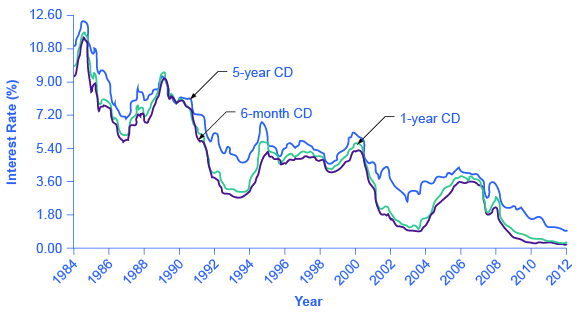
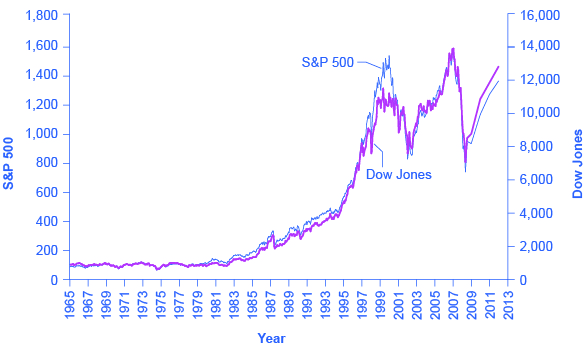

By the end of this section, you will be able to:
* Show the relationship between savers, banks, and borrowers
* Calculate bond yield
* Contrast bonds, stocks, mutual funds, and assets
* Explain the tradeoffs between return and risk

The ways in which firms would prefer to raise funds are only half the story of financial markets. The other half is what those households and individuals who supply funds desire, and how they perceive the available choices. The focus of our discussion now shifts from firms on the demand side of financial capital markets to households on the supply side of those markets. The mechanisms for saving available to households can be divided into several categories: deposits in bank accounts; bonds; stocks; money market mutual funds; stock and bond mutual funds; and housing and other tangible assets like owning gold. Each of these investments needs to be analyzed in terms of three factors: (1) the expected rate of return it will pay; (2) the risk that the return will be much lower or higher than expected; and (3) the **liquidity**{: data-type="term"} of the investment, which refers to how easily money or financial assets can be exchanged for a good or service. We will do this analysis as we discuss each of these investments in the sections below. First, however, we need to understand the difference between expected rate of return, risk, and actual rate of return.

# Expected Rate of Return, Risk, and Actual Rate of Return   {#ch17mod02_01}

The **expected rate of return**{: data-type="term"} refers to how much a project or an investment is expected to return to the investor, either in future interest payments, capital gains, or increased profitability. It is usually the average return over a period of time, usually in years or even decades. **Risk**{: data-type="term"} measures the uncertainty of that project’s profitability. There are several types of risk, including default risk and interest rate risk. Default risk, as its name suggests, is the risk that the borrower fails to pay back the bond. Interest rate risk is the danger that you might buy a long term bond at a 6% interest rate right before market rates suddenly raise, so had you waited, you could have gotten a similar bond that paid 9%. A high-risk investment is one for which a wide range of potential payoffs is reasonably probable. A low-risk investment will have actual returns that are fairly close to its expected rate of return year after year. A high-risk investment will have actual returns that are much higher than the expected rate of return in some months or years and much lower in other months or years. The **actual rate of return**{: data-type="term"} refers to the total rate of return, including capital gains and interest paid on an investment at the end of a period of time.

# Bank Accounts   {#ch17mod02_02}

An intermediary is one who stands between two other parties; for example, a person who arranges a blind date between two other people is one kind of intermediary. In financial capital markets, banks are an example of a **financial intermediary**{: data-type="term"}—that is, an institution that operates between a saver who deposits funds in a bank and a borrower who receives a loan from that bank. When a bank serves as a financial intermediary, unlike the situation with a couple on a blind date, the saver and the borrower never meet. In fact, it is not even possible to make direct connections between those who deposit funds in banks and those who borrow from banks, because all funds deposited end up in one big pool, which is then loaned out.

[\[link\]](#CNX_Econ_C17_001) illustrates the position of banks as a financial intermediary, with a pattern of deposits flowing into a bank and loans flowing out, and then repayment of the loans flowing back to the bank, with interest payments for the original savers.

 {: #CNX_Econ_C17_001 data-media-type="image/jpg" data-title="Banks as Financial Intermediaries"}

Banks offer a range of accounts to serve different needs. A **checking account**{: data-type="term"} typically pays little or no interest, but it facilitates transactions by giving you easy access to your money, either by writing a check or by using a **debit card**{: data-type="term"} (that is, a card which works like a credit card, except that purchases are immediately deducted from your checking account rather than being billed separately through a credit card company). A **savings account**{: data-type="term"} typically pays some interest rate, but getting the money typically requires you to make a trip to the bank or an automatic teller machine (or you can access the funds electronically). The lines between checking and savings accounts have blurred in the last couple of decades, as many banks offer checking accounts that will pay an interest rate similar to a savings account if you keep a certain minimum amount in the account, or conversely, offer savings accounts that allow you to write at least a few checks per month.

Another way to deposit savings at a bank is to use a **certificate of deposit (CD)**{: data-type="term"}. With a CD, as it is commonly called, you agree to deposit a certain amount of money, often measured in thousands of dollars, in the account for a stated period of time, typically ranging from a few months to several years. In exchange, the bank agrees to pay a higher interest rate than for a regular savings account. While you can withdraw the money before the allotted time, as the advertisements for CDs always warn, there is “a substantial penalty for early withdrawal.”

[\[link\]](#CNX_Econ_C17_007) shows the annual rate of interest paid on a six-month, one-year, and five-year CD since 1984, as reported by Bankrate.com. The interest rates paid by savings accounts are typically a little lower than the CD rate, because financial investors need to receive a slightly higher rate of interest as compensation for promising to leave deposits untouched for a period of time in a CD, and thus giving up some liquidity.

 {: #CNX_Econ_C17_007 data-media-type="image/jpg" data-title="Interest Rates on Six-Month, One-Year, and Five-Year Certificates of Deposit"}

The great advantages of bank accounts are that financial investors have very easy access to their money, and also money in bank accounts is extremely safe. In part, this safety arises because a bank account offers more security than keeping a few thousand dollars in the toe of a sock in your underwear drawer. In addition, the **Federal Deposit Insurance Corporation (FDIC)**{: data-type="term" .no-emphasis} protects the savings of the average person. Every bank is required by law to pay a fee to the FDIC, based on the size of its deposits. Then, if a bank should happen to go bankrupt and not be able to repay depositors, the FDIC guarantees that all customers will receive their deposits back up to $250,000.

The bottom line on bank accounts looks like this: low risk means low rate of return but high liquidity.

# Bonds   {#ch17mod02_03}

An investor who buys a bond expects to receive a rate of return. However, bonds vary in the rates of return that they offer, according to the riskiness of the borrower. An interest rate can always be divided up into three components (as explained in [Choice in a World of Scarcity](/m48602){: .target-chapter}): compensation for delaying consumption, an adjustment for an inflationary rise in the overall level of prices, and a risk premium that takes the borrower’s riskiness into account.

The U.S. government is considered to be an extremely safe borrower, so when the U.S. government issues Treasury bonds, it can pay a relatively low rate of interest. Firms that appear to be safe borrowers, perhaps because of their sheer size or because they have consistently earned profits over time, will still pay a higher interest rate than the U.S. government. Firms that appear to be riskier borrowers, perhaps because they are still growing or their businesses appear shaky, will pay the highest interest rates when they issue bonds. Bonds that offer high interest rates to compensate for their relatively high chance of default are called **high yield**{: data-type="term"} **bonds**{: data-type="term"} or **junk bonds**{: data-type="term"}. A number of today’s well-known firms issued junk bonds in the 1980s when they were starting to grow, including Turner Broadcasting and Microsoft.

Visit this [website][1] to read about Treasury bonds.

 {: data-media-type="image/png"} 

A bond issued by the U.S. government or a large corporation may seem to be relatively low risk: after all, the issuer of the bond has promised to make certain payments over time, and except for rare cases of bankruptcy, these payments will be made. If the issuer of a corporate bond fails to make the payments that it owes to its bondholders, the bondholders can require that the company declare bankruptcy, sell off its assets, and pay them as much as it can. Even in the case of junk bonds, a wise investor can reduce the risk by purchasing bonds from a wide range of different companies since, even if a few firms go broke and do not pay, they are not all likely to go bankrupt.

As we noted before, bonds carry an interest rate risk. For example, imagine you decide to buy a 10-year bond that would pay an annual interest rate of 8%. Soon after you buy the bond, interest rates on bonds rise, so that now similar companies are paying an annual rate of 12%. Anyone who buys a bond now can receive annual payments of $120 per year, but since your bond was issued at an interest rate of 8%, you have tied up $1,000 and receive payments of only $80 per year. In the meaningful sense of opportunity cost, you are missing out on the higher payments that you could have received. (Read the appendix on [Indifference Curves](/m48833) for specific calculations for how a change in interest rates will alter the value of a bond.)

In financial terms, a bond has several parts. A bond is basically an “I owe you” note that is given to an investor in exchange for capital (money). The bond has a **face value**{: data-type="term"}. This is the amount the borrower agrees to pay the investor at maturity. The bond has a **coupon rate**{: data-type="term"} or interest rate, which is usually semi-annual, but can be paid at different times throughout the year. (Bonds used to be paper documents with coupons that were clipped and turned in to the bank to receive interest.) The bond has a **maturity date**{: data-type="term"} when the borrower will pay back its face value as well as its last interest payment. Combining the bond’s face value, interest rate, and maturity date, and market interest rates, allows a buyer to compute a bond’s **present value**{: data-type="term"}, which is the most that a buyer would be willing to pay for a given bond. This may or may not be the same as the face value.

The **bond yield**{: data-type="term"} measures the rate of return a bond is expected to pay over time. Bonds are bought not only when they are issued; they are also bought and sold during their lifetimes. When buying a bond that has been around for a few years, investors should know that the interest rate printed on a bond is often not the same as the bond yield, even on new bonds. Read the following Work It Out feature to see how this happens.

Calculating the Bond Yield

You have bought a $1,000 bond whose coupon rate is 8%. To calculate your return or yield, follow these steps:

1.  Assume the following:
    * Face value of a bond: $1,000
    * Coupon rate: 8 %
    * Annual payment: $80 per year
    {: data-bullet-style="none"}

2.  Consider the risk of the bond. If this bond carries no risk, then it would be safe to assume that the bond will sell for $1,000 when it is issued and pay the purchaser $80 per year until its maturity, at which time the final interest payment will be made and the original $1,000 will be repaid. Now, assume that over time the interest rates prevailing in the economy rise to 12% and that there is now only one year left to this bond’s maturity. This makes the bond an unattractive investment, since an investor can find another bond that perhaps pays 12%. To induce the investor to buy the 8% bond, the bond seller will lower its price below its face value of $1,000.
3.  Calculate the price of the bond when its interest rate is less than the market interest rate. The expected payments from the bond one year from now are $1,080, because in the bond’s last year the issuer of the bond will make the final interest payment and then also repay the original $1,000. Given that interest rates are now 12%, you know that you could invest $964 in an alternative investment and receive $1,080 a year from now; that is, $964(1 + 0.12) = $1080. Therefore, you will not pay more than $964 for the original $1,000 bond.
4.  Consider that the investor will receive the $1,000 face value, plus $80 for the last year’s interest payment. The yield on the bond will be ($1080 – $964)/$964 = 12%. The yield, or total return, means interest payments, plus capital gains. Note that the interest or coupon rate of 8% did not change. When interest rates rise, bonds previously issued at lower interest rates will sell for less than face value. Conversely, when interest rates fall, bonds previously issued at higher interest rates will sell for more than face value.
{: data-number-style="arabic" .stepwise}

[\[link\]](#CNX_Econ_C17_003) shows bond yield for two kinds of bonds: 10-year Treasury bonds (which are officially called “notes”) and corporate bonds issued by firms that have been given an AAA rating as relatively safe borrowers by **Moody’s**{: data-type="term" .no-emphasis}, an independent firm that publishes such ratings. Even though corporate bonds pay a higher interest rate, because firms are riskier borrowers than the federal government, the rates tend to rise and fall together. Treasury bonds typically pay more than bank accounts, and corporate bonds typically pay a higher interest rate than Treasury bonds.

 rise and fall together, depending on conditions for borrowers and lenders in financial markets for borrowing. The corporate bonds always pay a higher interest rate, to make up for the higher risk they have of defaulting compared with the U.S. government."){: #CNX_Econ_C17_003 data-media-type="image/jpg" data-title="Interest Rates for Corporate Bonds and Ten-Year U.S. Treasury Bonds"}

The bottom line for bonds: rate of return—low to moderate, depending on the risk of the borrower; risk—low to moderate, depending on whether interest rates in the economy change substantially after the bond is issued; liquidity—moderate, because the bond needs to be sold before the investor regains the cash.

# Stocks   {#ch17mod02_04}

As stated earlier, the rate of return on a financial investment in a share of stock can come in two forms: as dividends paid by the firm and as a capital gain achieved by selling the stock for more than you paid. The range of possible returns from buying stock is mind-bending. Firms can decide to pay dividends or not. A stock price can rise to a multiple of its original price or sink all the way to zero. Even in short periods of time, well-established companies can see large movements in the price of their stock. For example, in July 1, 2011, Netflix stock peaked at $295 per share; one year later, on July 30, 2012, it was at $53.91 per share; a year after that, it had recovered to $264.58. When Facebook went public, its shares of stock sold for around $40 per share, but five months later they were selling for slightly over $17.

The reasons why stock prices fall and rise so abruptly will be discussed below, but first you need to know how we measure stock market performance. There are a number of different ways of measuring the overall performance of the stock market, based on averaging the stock prices of different subsets of companies. Perhaps the best-known measure of the stock markets is the Dow Jones Industrial Average, which is based on the stock prices of 30 large U.S. companies. Another gauge of stock market performance, the Standard &amp; Poor’s 500, follows the stock prices of the 500 largest U.S. companies. The Wilshire 5000 tracks the stock prices of essentially all U.S. companies that have stock the public can buy and sell.

Other measures of stock markets focus on where stocks are traded. For example, the New York Stock Exchange monitors the performance of stocks that are traded on that exchange in New York City. The Nasdaq stock market includes about 3,600 stocks, with a concentration of technology stocks. [\[link\]](#ch17mod02_tab01) lists some of the most commonly cited measures of U.S. and international stock markets.

<table id="ch17mod02_tab01" summary="Table 1.1: Some Measures of Stock Markets. This table has two columns. Column 1 is called &#x201C;Measure of the Stock Market&#x201D; and Column 2 is called &#x201C;Comments.&#x201D; Column 1 row 1: &#x201C;Down Jones Industrial Average (DJIA), http://indexes.dowjones.com.&#x201D; Column 2 row 1: &#x201C;Based on 30 companies from a diverse set of representative industries, chosen by analysts at Dow Jones and Company. The index was started in 1896.&#x201D; Column 1 row 2: &#x201C;Standard &amp; Poor&#x2019;s 500, http://www.standardandpoors.com.&#x201D; Column 2 row 2: &#x201C;Based on 500 large U.S. firms, chosen by analysts at Standard &amp; Poor&#x2019;s to represent the economy as a whole.&#x201D; Column 1 row 3: &#x201C;Wilshire 5000, http://www.willshire.com.&#x201D; Column 2 row 3: &#x201C;Includes essentially all U.S. companies with stock ownership. Despite the name, this index includes about 7,000 firms.&#x201D; Column 1 row 4: &#x201C;New York Stock Exchange, http://nyse.com.&#x201D; Column 2 row 4: &#x201C;The oldest and largest U.S. stock market, dating back to 1792. It trades stocks for 2,800 companies of all sizes. It is located at 18 Broad St. in New York City.&#x201D; Column 1 row 5: &#x201C;NASDAQ, http://nasdaq.com.&#x201D; Column 2 row 5: &#x201C;Founded in 1971 as an electronic stock market, allowing people to buy or sell from many physical locations. It has about 3,600 companies.&#x201D; Column 1 row 6: &#x201C;FTSE, http://ftse.com.&#x201D; Column 2 row 6: &#x201C;Includes the 100 largest companies on the London Stock Exchange. Pronounced &#x2018;footsie.&#x2019; Originally stood for &#x2018;Financial Times Stock Exchange.&#x2019;&#x201D; Column 1 row 7: &#x201C;Nikkei, http://www.nni.nikkei.co.jp.&#x201D; Column 2 row 7: &#x201C;Nikkei stands for Nihon Keizai Shimbun, which translates as the Japan Economic Journal, a major business newspaper in Japan. Index includes the 225 largest and most actively traded stocks on the Tokyo Stock Exchange.&#x201D; Column 1 row 8: &#x201C;DAX, http://www.exchange.de.&#x201D; Column 2 row 8: &#x201C;Tracks 30 of the largest companies on the Frankfurt, Germany stock exchange. DAX is an abbreviation for Deutscher Aktien Index.&#x201D;"><caption>Some Measures of Stock Markets</caption><thead>
<tr>
<th>Measure of the Stock Market</th>
<th>Comments</th>
</tr>
</thead><tbody>
<tr>
<td>
Dow Jones Industrial Average (DJIA):
http://indexes.dowjones.com
</td>
<td>Based on 30 large companies from a diverse set of representative industries, chosen by analysts at Dow Jones and Company. The index was started in 1896.</td>
</tr>
<tr>
<td>Standard &amp; Poor’s 500: http://www.standardandpoors.com</td>
<td>Based on 500 large U.S. firms, chosen by analysts at Standard &amp; Poor’s to represent the economy as a whole.</td>
</tr>
<tr>
<td>Wilshire 5000: http://www.wilshire.com</td>
<td>Includes essentially all U.S. companies with stock ownership. Despite the name, this index includes about 7,000 firms.</td>
</tr>
<tr>
<td>New York Stock Exchange: http://www.nyse.com</td>
<td>The oldest and largest U.S. stock market, dating back to 1792. It trades stocks for 2,800 companies of all sizes. It is located at 18 Broad St. in New York City.</td>
</tr>
<tr>
<td>NASDAQ: http://www.nasdaq.com</td>
<td>Founded in 1971 as an electronic stock market, allowing people to buy or sell from many physical locations. It has about 3,600 companies.</td>
</tr>
<tr>
<td>FTSE: http://www.ftse.com</td>
<td>Includes the 100 largest companies on the London Stock Exchange. Pronounced “footsie.” Originally stood for Financial Times Stock Exchange.</td>
</tr>
<tr>
<td>Nikkei: http://www.nni.nikkei.co.jp</td>
<td>Nikkei stands for <em>Nihon Keizai Shimbun</em>, which translates as the Japan Economic Journal, a major business newspaper in Japan. Index includes the 225 largest and most actively traded stocks on the Tokyo Stock Exchange.</td>
</tr>
<tr>
<td>DAX: http://www.exchange.de</td>
<td>Tracks 30 of the largest companies on the Frankfurt, Germany, stock exchange. DAX is an abbreviation for <em>Deutscher Aktien Index</em>.</td>
</tr>
</tbody></table>

The trend in the stock market is generally up over time, but with some large dips along the way. [\[link\]](#CNX_Econ_C17_004) shows the path of the **Standard &amp; Poor’s 500 index**{: data-type="term" .no-emphasis} (which is measured on the left-hand vertical axis) and the **Dow Jones Index**{: data-type="term" .no-emphasis} (which is measured on the right-hand vertical axis). Broad measures of the stock market, like the ones listed here, tend to move together. The S&amp;P 500 Index is the weighted average market capitalization of the firms selected to be in the index. The Dow Jones Industrial Average is the price weighted average of 30 industrial stocks tracked on the New York Stock Exchange.

When the Dow Jones average rises from 5,000 to 10,000, you know that the average price of the stocks in that index has roughly doubled. [\[link\]](#CNX_Econ_C17_004) shows that stock prices did not rise much in the 1970s, but then started a steady climb in the 1980s. From 2000 to 2013, stock prices bounced up and down, but ended up at about the same level.

 {: #CNX_Econ_C17_004 data-media-type="image/jpg" data-title="The Dow Jones Industrial Index and the Standard &amp; Poor&#x2019;s 500, 1965&#x2013;2013"}

[\[link\]](#ch17mod02_tab02) shows the total annual rate of return an investor would have received from buying the stocks in the S&amp;P 500 index over recent decades. The total return here includes both dividends paid by these companies and also capital gains arising from increases in the value of the stock. (For technical reasons related to how the numbers are calculated, the dividends and capital gains do not add exactly to the total return.) From the 1950s to the 1980s, the average firm paid annual dividends equal to about 4% of the value of its stock. Since the 1990s, dividends have dropped and now often provide a return closer to 1% to 2%. In the 1960s and 1970s, the gap between percent earned on capital gains and dividends was much closer than it has been since the 1980s. In the 1980s and 1990s, however, capital gains were far higher than dividends. In the 2000s, dividends remained low and, while stock prices fluctuated, they ended the decade roughly where they had started.

<table id="ch17mod02_tab02" summary="Table 1.2: Annual Returns on S&amp;P 500 Stocks, 1950-2012. This table has 4 columns and 9 rows. Column 1 is &#x201C;Period.&#x201D; Column 2 is &#x201C;Total Annual Return.&#x201D; Column 3 is &#x201C;Capital Gains.&#x201D; Column 4 is &#x201C;Dividends.&#x201D; Row 1: Period: 1950-1959. Total Annual Return: 19.25%. Capital Gains: 13.58%. Dividends: 4.99%. Row 2: Period: 1960-1969. Total Annual Return: 7.78%. Capital Gains: 4.39%. Dividends: 3.25%. Row 3: Period: 1970-1979. Total Annual Return: 5.88%. Capital Gains: 1.60%. Dividends: 4.20%. Row 4: Period: 1980-1989. Total Annual Return: 17.55%. Capital Gains: 12.59%. Dividends: 4.40%. Row 5: Period: 1990-1999. Total Annual Return: 18.21%. Capital Gains: 15.31%. Dividends: 2.51%. Row 6: Period: 2000-2009. Total Annual Return:  -1.0%. Capital Gains: -2.70%. Dividends: 1.70%. Row 7: Period: 2010. Total Annual Return: 15.06%. Capital Gains: 13.22%. Dividends: 1.84%. Row 8: Period: 2011. Total Annual Return: 2.11%. Capital Gains: 0.04%. Dividends: 2.07%. Row 9: Period: 2012. Total Annual Return: 16.00%. Capital Gains: 13.87%. Dividends: 2.13%."><caption>Annual Returns on S&amp;P 500 Stocks, 1950–2012</caption><thead>
<tr>
<th>Period</th>
<th>Total Annual Return</th>
<th>Capital Gains</th>
<th>Dividends</th>
</tr>
</thead><tbody>
<tr>
<td>1950–1959</td>
<td>19.25%</td>
<td>13.58%</td>
<td>4.99%</td>
</tr>
<tr>
<td>1960–1969</td>
<td>7.78%</td>
<td>4.39%</td>
<td>3.25%</td>
</tr>
<tr>
<td>1970–1979</td>
<td>5.88%</td>
<td>1.60%</td>
<td>4.20%</td>
</tr>
<tr>
<td>1980–1989</td>
<td>17.55%</td>
<td>12.59%</td>
<td>4.40%</td>
</tr>
<tr>
<td>1990–1999</td>
<td>18.21%</td>
<td>15.31%</td>
<td>2.51%</td>
</tr>
<tr>
<td>2000–2009</td>
<td>−1.0%</td>
<td>−2.70%</td>
<td>1.70%</td>
</tr>
<tr>
<td>2010</td>
<td>15.06%</td>
<td>13.22%</td>
<td>1.84%</td>
</tr>
<tr>
<td>2011</td>
<td>2.11%</td>
<td>0.04%</td>
<td>2.07%</td>
</tr>
<tr>
<td>2012</td>
<td>16.00%</td>
<td>13.87%</td>
<td>2.13%</td>
</tr>
</tbody></table>

The overall pattern is that stocks as a group have provided a high rate of return over extended periods of time, but this return comes with risks. The market value of individual companies can rise and fall substantially, both over short time periods and over the long run. During extended periods of time like the 1970s or the first decade of the 2000s, the overall return on the stock market can be quite modest. The stock market can sometimes fall sharply, as it did in 2008.

The bottom line on investing in stocks is that the rate of return over time will be high, but the risks are also high, especially in the short run; liquidity is also high since stock in publicly held companies can be readily sold for spendable money.

# Mutual Funds   {#ch17mod02_05}

Buying stocks or bonds issued by a single company is always somewhat risky. An individual firm may find itself buffeted by unfavorable supply and demand conditions or hurt by unlucky or unwise managerial decisions. Thus, a standard recommendation from financial investors is **diversification**{: data-type="term"}, which means buying stocks or bonds from a wide range of companies. A saver who diversifies is following the old proverb: “Don’t put all your eggs in one basket.” In any broad group of companies, some firms will do better than expected and some will do worse—but the extremes have a tendency to cancel out extreme increases and decreases in value.

Purchasing a diversified group of the stocks or bonds has gotten easier in the Internet age, but it remains something of a task. To simplify the process, companies offer **mutual funds**{: data-type="term"}, which are organizations that buy a range of stocks or bonds from different companies. The financial investor buys shares of the mutual fund, and then receives a return based on how the fund as a whole performs. In 2012, according to the Investment Company Factbook, about 44% of U.S. households had a financial investment in a mutual fund—including many people who have their retirement savings or pension money invested in this way.

Mutual funds can be focused in certain areas: one mutual fund might invest only in stocks of companies based in Indonesia, or only in bonds issued by large manufacturing companies, or only in stock of biotechnology companies. At the other end of the spectrum, a mutual fund might be quite broad; at the extreme, some mutual funds own a tiny share of every firm in the stock market, and thus the value of the mutual fund will fluctuate with the average of the overall stock market. A mutual fund that seeks only to mimic the overall performance of the market is called an **index fund**{: data-type="term"}.

Diversification can offset some of the risks of individual stocks rising or falling. Even investors who buy an indexed mutual fund designed to mimic some measure of the broad stock market, like the Standard &amp; Poor’s 500, had better buckle their seatbelts against some ups and downs, like those the stock market experienced in the first decade of the 2000s. In 2008 average U.S. stock funds declined 38%, reducing the wealth of individuals and households. This steep drop in value hit hardest those who were close to retirement and were counting on their stock funds to supplement retirement income.

The bottom line on investing in mutual funds is that the rate of return over time will be high; the risks are also high, but the risks and returns for an individual mutual fund will be lower than those for an individual stock. As with stocks, liquidity is also high provided the mutual fund or stock index fund is readily traded.

# Housing and Other Tangible Assets   {#ch17mod02_06}

Households can also seek a rate of return by purchasing tangible assets, especially housing. About two-thirds of U.S. households own their own home. An owner’s **equity**{: data-type="term"} in a house is the monetary value the owner would have after selling the house and repaying any outstanding bank loans used to buy the house. For example, imagine that you buy a house for $200,000, paying 10% of the price as a down payment and taking out a bank loan for the remaining $180,000. Over time, you pay off some of your bank loan, so that only $100,000 remains, and the value of the house on the market rises to $250,000. At that point, your equity in the home is the value of the home minus the value of the loan outstanding, which is $150,000. For many middle-class Americans, home equity is their single greatest financial asset. The total value of all home equity held by U.S. households was $8.8 trillion at the end of 2012, according to Federal Reserve Data.

Investment in a house is tangibly different from bank accounts, stocks, and bonds because a house offers both a financial and a nonfinancial return. If you buy a house to live in, part of the return on your investment occurs from your consumption of “housing services”—that is, having a place to live. (Of course, if you buy a home and rent it out, you receive rental payments for the housing services you provide, which would offer a financial return.) Buying a house to live in also offers the possibility of a capital gain from selling the house in the future for more than you paid for it. There can, however, be different outcomes, as the Clear It Up on the housing market shows.

Housing prices have usually risen steadily over time; for example, the median sales price for an existing one-family home was $122,900 in 1990, but $245,200 in 2013. Over these 23 years, home prices increased an average of 3.1% per year, which is an average financial return over this time. [\[link\]](#CNX_Econ_C17_005) shows U.S. Census data for the median average sales price of a house in the United States over this time period.

Go to this [website][2] to experiment with a compound annual growth rate calculator.

 {: data-media-type="image/png"} 

However, the possible capital gains from rising housing prices are riskier than these national price averages. Certain regions of the country or metropolitan areas have seen drops in housing prices over time. The median housing price for the United States as a whole fell almost 7% in 2008 and again in 2009, dropping the median price from $247,900 to $216,700. As of 2012, home values had almost recovered to their pre-recession levels.

Visit this [website][3] to watch the trailer for *Inside Job*, a movie that explores the modern financial crisis.

 {: data-media-type="image/png"} 

 "){: #CNX_Econ_C17_005 data-media-type="image/jpg" data-title="The Median Average Sales Price for New Single-Family Homes, 1990&#x2013;2012"}

Investors can also put money into other tangible assets such as gold, silver, and other precious metals, or in duller commodities like sugar, cocoa, coffee, orange juice, oil, and natural gas. The return on these investments derives from the saver’s hope of buying low, selling high, and receiving a capital gain. Investing in, say, gold or coffee offers relatively little in the way of nonfinancial benefits to the user (unless the investor likes to caress gold or gaze upon a warehouse full of coffee). Indeed, typically investors in these commodities never even see the physical goods; instead, they sign a contract that takes ownership of a certain quantity of these commodities, which are stored in a warehouse, and later they sell the ownership to someone else. As one example, from 1981 to 2005, the price of gold generally fluctuated between about $300 and $500 per ounce, but then rose sharply to over $1,100 per ounce by early 2010.

A final area of tangible assets are “collectibles” like paintings, fine wine, jewelry, antiques, or even baseball cards. Most collectibles provide returns both in the form of services or of a potentially higher selling price in the future. You can use paintings by hanging them on the wall; jewelry by wearing it; baseball cards by displaying them. You can also hope to sell them someday for more than you paid for them. However, the evidence on prices of collectibles, while scanty, is that while they may go through periods where prices skyrocket for a time, you should not expect to make a higher-than-average rate of return over a sustained period of time from investing in this way.

The bottom line on investing in tangible assets: rate of return—moderate, especially if you can receive nonfinancial benefits from, for example, living in the house; risk—moderate for housing or high if you buy gold or baseball cards; liquidity—low, because it often takes considerable time and energy to sell a house or a piece of fine art and turn your capital gain into cash. The following Clear It Up feature explains the issues in the recent U.S. housing market crisis.

What was all the commotion in the recent U.S. housing market?

The cumulative average growth rate in housing prices from 1981 to 2000 was 5.1%. The price of an average U.S. home then took off from 2003 to 2005, rising at more than 10% per year. No serious analyst believed this rate of growth was sustainable; after all, if housing prices grew at, say, 11% per year over time, the average price of a home would more than double every seven years. However, at the time many serious analysts saw no reason for deep concern. After all, housing prices often change in fits and starts, like all prices, and a price surge for a few years is often followed by prices that are flat or even declining a bit as local markets adjust.

The sharp rise in housing prices was driven by a high level of demand for housing. Interest rates were low, so people were encouraged to borrow money to buy a house. Banks became much more flexible in their lending, making what were called “subprime” loans. Banks loaned money with low, or sometimes no, down payment. They offered loans with very low payments for the first two years, but then much higher payments after that; the idea was that housing prices would keep rising, so the borrower would just refinance the mortgage two years in the future, and thus would not ever have to make the higher payments. Some banks even offered so-called NINJA loans, which meant a loan given even though the borrower had No Income, No Job or Assets.

In retrospect, these loans seem nearly crazy. Many borrowers figured, however, that as long as housing prices kept rising, it made sense to buy. Many lenders used a process called “securitizing,” in which they sold their mortgages to financial companies, which put all the mortgages into a big pool, creating large financial securities, and then re-sold these mortgage-backed securities to investors. In this way, the lenders off-loaded the risks of the mortgages to investors. Investors were interested in mortgage-backed securities as they appeared to offer a steady stream of income, provided the mortgages were repaid. Investors relied on the ratings agencies to assess the credit risk associated with the mortgage backed securities. In hindsight, it appears that the credit agencies were far too lenient in their ratings of many of the securitized loans. Bank and financial regulators watched the steady rise in the market for mortgage-backed securities, but saw no reason at the time to intervene.

When housing prices turned down, many households that had borrowed when prices were high found that what they owed the bank was more than their home was worth. Many banks believed that they had diversified by selling their individual loans and instead buying securities based on mortgage loans from all over the country. After all, banks thought back in 2005, the average price of a house had not declined at any time since the Great Depression of the 1930s. These securities based on mortgage loans, however, turned out to be far riskier than expected. The bust in housing prices weakened the finances of both banks and households, and thus helped bring on the Great Recession of 2008–2009.

# The Tradeoffs between Return and Risk   {#ch17mod02_07}

The discussion of financial investments has emphasized the expected rate of return, the risk, and the liquidity of each investment. [\[link\]](#ch17mod02_tab03) summarizes these characteristics.

<table id="ch17mod02_tab03" summary="Table 1.3: Key Characteristics for Financial Investments. This table shows different types of financial investments and indicates the expected rate of return, the risk, and the liquidity. It has 4 columns and 9 rows. The 4 columns are &#x201C;Financial Investment,&#x201D; &#x201C;Return,&#x201D; &#x201C;Risk,&#x201D; and &#x201C;Liquidity.&#x201D; Row 1: Financial Investment: Checking account. Return: Very low. Risk: Very little. Liquidity: Very high. Row 2: Financial Investment: Savings account. Return: Low. Risk: Very little. Liquidity: High. Row 3: Financial Investment: Certificate of deposit: Return: Low to medium. Risk: Very little. Liquidity: Medium. Row 4: Financial Investment: Stocks. Return: High. Risk: Medium to high. Liquidity: Medium. Row 5: Financial Investment: Bonds. Return: Medium. Risk: Low to medium. Liquidity: Medium. Row 6: Financial Investment: Mutual funds. Return: Medium to high. Risk: Medium to high. Liquidity: Medium to high. Row 7: Financial Investment: Housing. Return: Medium. Risk: Medium. Liquidity: Low. Row 8: Financial Investment: Gold. Return: Medium. Risk: High. Liquidity: Low. Row 9: Financial Investment: Collectibles. Return: Low to medium. Risk: High. Liquidity: Low."><caption>Key Characteristics for Financial Investments</caption><thead>
<tr>
<th>Financial Investment</th>
<th>Return</th>
<th>Risk</th>
<th>Liquidity</th>
</tr>
</thead><tbody>
<tr>
<td>Checking account</td>
<td>Very low</td>
<td>Very little</td>
<td>Very high</td>
</tr>
<tr>
<td>Savings account</td>
<td>Low</td>
<td>Very little</td>
<td>High</td>
</tr>
<tr>
<td>Certificate of deposit</td>
<td>Low to medium</td>
<td>Very little</td>
<td>Medium</td>
</tr>
<tr>
<td>Stocks</td>
<td>High</td>
<td>Medium to high</td>
<td>Medium</td>
</tr>
<tr>
<td>Bonds</td>
<td>Medium</td>
<td>Low to medium</td>
<td>Medium</td>
</tr>
<tr>
<td>Mutual funds</td>
<td>Medium to high</td>
<td>Medium to high</td>
<td>Medium to high</td>
</tr>
<tr>
<td>Housing</td>
<td>Medium</td>
<td>Medium</td>
<td>Low</td>
</tr>
<tr>
<td>Gold</td>
<td>Medium</td>
<td>High</td>
<td>Low</td>
</tr>
<tr>
<td>Collectibles</td>
<td>Low to medium</td>
<td>High</td>
<td>Low</td>
</tr>
</tbody></table>

The household investment choices listed here display a tradeoff between the expected return and the degree of risk involved. Bank accounts have very low risk and very low returns; bonds have higher risk but higher returns; and stocks are riskiest of all but have the potential for still higher returns. In effect, the higher average return compensates for the higher degree of risk. If risky assets like stocks did not also offer a higher average return, then few investors would want them.

This tradeoff between return and risk complicates the task of any financial investor: Is it better to invest safely or to take a risk and go for the high return? Ultimately, choices about risk and return will be based on personal preferences. However, it is often useful to examine risk and return in the context of different time frames.

The high returns of stock market investments refer to a high average return that can be expected over a period of several years or decades. The high risk of such investments refers to the fact that in shorter time frames, from months to a few years, the rate of return may fluctuate a great deal. Thus, a person near retirement age, who already owns a house, may prefer reduced risk and certainty about retirement income. For young workers, just starting to make a reasonably profitable living, it may make sense to put most of their savings for retirement in stocks. Stocks are risky in the short term, to be sure, but when the worker can look forward to several decades during which stock market ups and downs can even out, stocks will typically pay a much higher return over that extended period than will bonds or bank accounts. Thus, tradeoffs between risk and return must be considered in the context of where the investor is in life.

# Key Concepts and Summary   {#ch08mod04_summ}

All investments can be categorized according to three key characteristics: average expected return, degree of risk, and liquidity. To get a higher rate of return, an investor must typically accept either more risk or less liquidity. Banks are an example of a financial intermediary, an institution that operates to coordinate supply and demand in the financial capital market. Banks offer a range of accounts, including checking accounts, savings accounts, and certificates of deposit. Under the federal deposit insurance program, banks purchase insurance against the risk of a bank failure.

A typical bond promises the financial investor a series of payments over time, based on the interest rate at the time the bond is issued, and then repayment of what was borrowed. Bonds that offer a high rate of return but also a relatively high chance of defaulting on the payments are called high yield or junk bonds. The bond yield is the rate of return that a bond promises to pay at the time of purchase. Even when bonds make payments based on a fixed rate of interest, they are somewhat risky, because if interest rates rise for the economy as a whole, an investor who owns bonds issued at lower interest rates is now locked into the low rate and suffers a loss.

Changes in the price of a stock depend on changes in expectations about future profits. Investing in any individual firm is somewhat risky, so investors are wise to practice diversification, which means investing in a range of companies. A mutual fund purchases an array of stocks and/or bonds. An investor in the mutual fund then receives a return depending on the overall performance of the investments made by the fund as a whole. A mutual fund that seeks to imitate the overall behavior of the stock market is called an index fund.

Housing and other tangible assets can also be regarded as forms of financial investment, which pay a rate of return in the form of capital gains. Housing can also offer a nonfinancial return—specifically, you can live in it.

# Self-Check Questions   {#ch17mod02_sques}

Calculate the equity each of these people has in his or her home: Fred just bought a house for $200,000 by putting 10% as a down payment and borrowing the rest from the bank. Freda bought a house for $150,000 in cash, but if she were to sell it now, it would sell for $250,000. Frank bought a house for $100,000. He put 20% down and borrowed the rest from the bank. However, the value of the house has now increased to $160,000 and he has paid off $20,000 of the bank loan. 

1.  Remember, equity is the market value of the house minus what is still owed to the bank. Thus: the value of the house is $200,000, Fred owes $180,000 to the bank, and his equity is $20,000.
2.  The value of Freda’s house is $250,000. It does not matter what price she bought it for. She owes zero to the bank, so her equity is the whole $250,000.
3.  The value of Frank’s house is $160,000. He owes $60,000 to the bank (the original $80,000 minus the $20,000 he has paid off the loan). His equity is $100,000.
{: data-number-style="lower-alpha" .lower-alpha}

Which has a higher average return over time: stocks, bonds, or a savings account? Explain your answer.

Over a sustained period of time, stocks have an average return higher than bonds, and bonds have an average return higher than a savings account. This is because in any given year the value of a savings account changes very little. In contrast, stock values can grow or decline by a very large amount (for example, the S&amp;P 500 increased 26% in 2009 after declining 37% in 2008. The value of a bond, which depends largely on interest rate fluctuations, varies far less than a stock, but more than a savings account.

Investors sometimes fear that a high-risk investment is especially likely to have low returns. Is this fear true? Does a high risk mean the return must be low?

When people believe that a high-risk investment must have a low return, they are getting confused between what risk and return mean. Yes, a high-risk investment might have a low return, but it might also have a high return. Risk refers to the fact that a wide range of outcomes is possible. However, a high-risk investment must, on average, expect a relatively high return or else no one would be willing to take the risk. Thus, it is quite possible—even likely—for an investment to have high risk and high return. Indeed, the reason that an investment has a high expected return is that it also has a high risk.

# Review Questions   {#ch17mod02_rques}

Why are banks called “financial intermediaries”?

Name several different kinds of bank account. How are they different?

Why are bonds somewhat risky to buy, even though they make predetermined payments based on a fixed rate of interest?

Why should a financial investor care about diversification?

What is a mutual fund?

What is an index fund?

How is buying a house to live in a type of financial investment?

Why is it hard to forecast future movements in stock prices?

# Critical Thinking Questions   {#ch17mod02_ctques}

What are some reasons why the investment strategy of a 30-year-old might differ from the investment strategy of a 65-year-old?

Explain why a financial investor in stocks cannot earn high capital gains simply by buying companies with a demonstrated record of high profits.

# Problems   {#ch17mod02_prob}

Imagine that a $10,000 ten-year bond was issued at an interest rate of 6%. You are thinking about buying this bond one year before the end of the ten years, but interest rates are now 9%. Given the change in interest rates, would you expect to pay more or less than $10,000 for the bond? Calculate what you would actually be willing to pay for this bond. 

Suppose Ford Motor Company issues a five year bond with a face value of $5,000 that pays an annual coupon payment of $150. What is the interest rate Ford is paying on the borrowed funds? Suppose the market interest rate rises from 3% to 4% a year after Ford issues the bonds. Will the value of the bond increase or decrease? 

# References   {#ch17mod02_ref}

Howley, Kathleen M. Bloomberg. “Home Value Highest Since ’07 as U.S. Houses Make Cash.” Last modified March 26, 2013. http://www.bloomberg.com/news/2013-03-26/home-value-highest-since-07-as-u-s-houses-make-cash-mortgages.html.

Rooney, Ben. CNN Money. “Trading Program Sparked May ‘Flash Crash’.” Last modified October 1, 2010. http://money.cnn.com/2010/10/01/markets/SEC\_CFTC\_flash\_crash/index.htm.

Investment Company Institute. “2013 Investment Company Fact Book, Chapter 6: Characteristics of Mutual Fund Owners.” http://icifactbook.org/fb\_ch6.html.

[1]: http://openstaxcollege.org/l/bondsecurities
[2]: http://openstaxcollege.org/l/investopedia
[3]: http://openstaxcollege.org/l/insidejob
