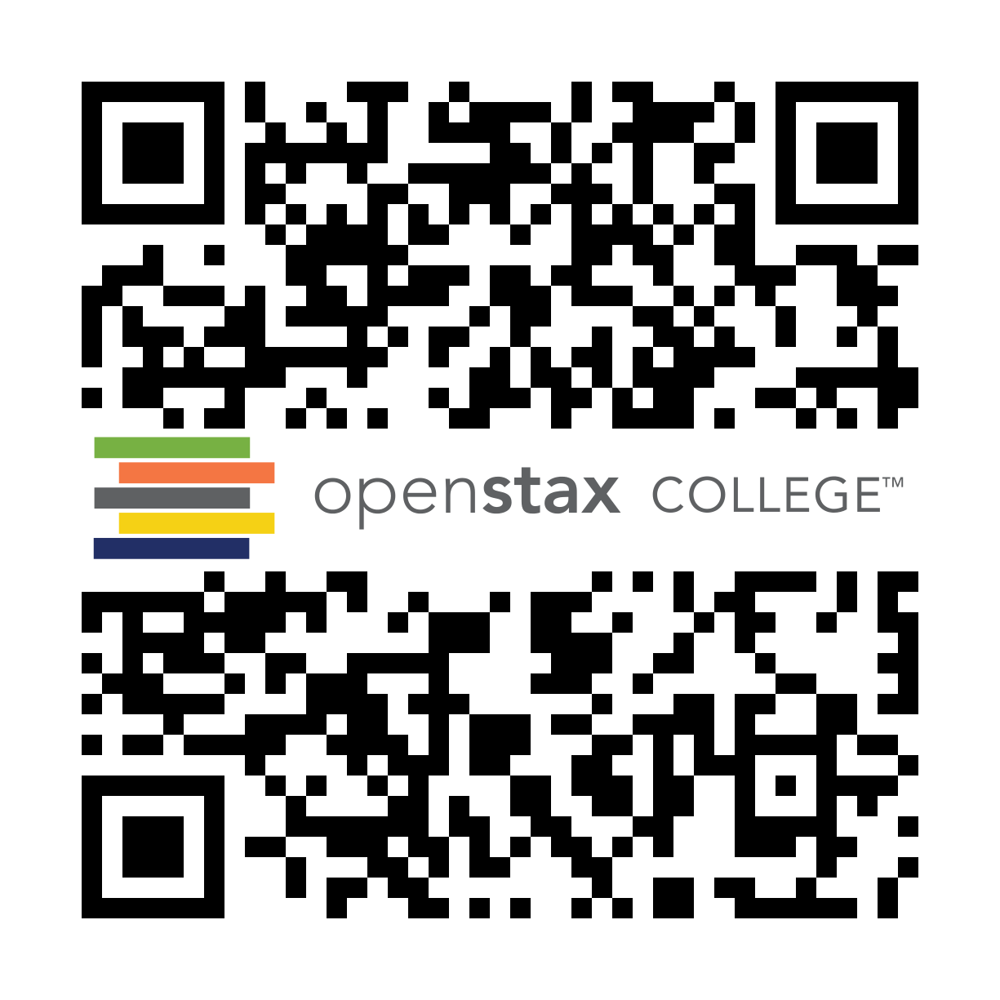

By the end of this section, you will be able to:

* Explain the significance of rational ignorance
* Evaluate the impact of election expenses

In U.S. presidential elections over the last few decades, about 55% to 65% of voting-age citizens actually voted, according to the U.S. Census. In congressional elections when there is no presidential race, or in local elections, the turnout is typically lower, often less than half the eligible voters. In other countries, the share of adults who vote is often higher. For example, in national elections since the 1980s in Germany, Spain, and France, about 75% to 80% of those of voting age cast ballots. Even this total falls well short of 100%. Some countries have laws that require voting, among them Australia, Belgium, Italy, Greece, Turkey, Singapore, and most Latin American nations. At the time the United States was founded, voting was mandatory in Virginia, Maryland, Delaware, and Georgia. Even if the law can require people to vote, however, no law can require that each voter cast an informed or a thoughtful vote. Moreover, in the United States and in most countries around the world, the freedom to vote has also typically meant the freedom *not* to vote.

Why do people not vote? Perhaps they do not care too much about who wins, or they are uninformed about who is running, or they do not believe their vote will matter or change their lives in any way. Indeed, these reasons are probably tied together, since people who do not believe their vote matters will not bother to become informed or care who wins. Economists have suggested why a **utility-maximizing**{: data-type="term" .no-emphasis} person might rationally decide not to vote or not to become informed about the election. While a few elections in very small towns may be decided by a single vote, in most elections of any size, the margin of victory is measured in hundreds, thousands, or even millions of votes. A rational voter will recognize that one vote is extremely unlikely to make a difference. This theory of **rational ignorance**{: data-type="term"} holds that people will not vote if the costs of becoming informed and voting are too high, or they feel their vote will not be decisive in the election.

In a 1957 work, *An Economic Theory of Democracy*, the economist **Anthony Downs**{: data-type="term" .no-emphasis} stated the problem this way: “It seems probable that for a great many citizens in a democracy, rational behavior excludes any investment whatever in political information per se. No matter how significant a difference between parties is revealed to the rational citizen by his free information, or how uncertain he is about which party to support, he realizes that his vote has almost no chance of influencing the outcome… He will not even utilize all the free information available, since assimilating it takes time.” In his classic 1948 novel *Walden Two*, the psychologist B. F. Skinner puts the issue even more succinctly via one of his characters, who states: “The chance that one man’s vote will decide the issue in a national election…is less than the chance that he will be killed on his way to the polls.” The following Clear It Up feature explores another aspect of the election process: spending.

How much is too much to spend on an election?

According to a report from *The New York Times*, the 2012 elections for president, Congress, and state and local offices, saw a total of about $5.8 billion spent. The money raised went to the campaigns, including advertising, fundraising, travel, and staff. Many people worry that politicians spend too much time raising money and end up entangled with special interest groups that make major donations. Critics would prefer a system that restricts what candidates can spend, perhaps in exchange for limited public campaign financing or free television advertising time.

How much spending on campaigns is too much? Five billion dollars will buy a lot of potato chips, but in the U.S. economy, which exceeded $16 trillion in 2012, the $5.8 billion spent on political campaigns was about 1/25 of 1% of the overall economy. Here is another way to think about campaign spending. *Total* government spending programs in 2009, including federal and state governments, was about $5.1 trillion, so the cost of choosing the people who would determine how this money would be spent was about 1/10 of 1% of that. In the context of the enormous U.S. economy, $5.8 billion is not as much money as it sounds. U.S. consumers spend about $2 billion per year on toothpaste and $7 billion on hair care products. In 2008, Proctor and Gamble spent $4.8 billion on advertising. It may not be sensible to believe the United States is going to decide its presidential elections for less than we spend on toothpaste or than Proctor and Gamble spends on advertisements.

Whatever we believe about whether candidates and their parties spend too much or too little on elections, the U.S. Supreme Court has placed limits on how government can limit campaign spending. In a 1976 decision, *Buckley v. Valeo*, the Supreme Court emphasized that the First Amendment to the U.S. Constitution specifies freedom of speech. The federal government and states can offer candidates a voluntary deal in which government makes some public financing available to candidates, but only if the candidates agree to abide by certain spending limits. Of course, candidates can also voluntarily agree to set certain spending limits if they wish. But government cannot forbid people or organizations to raise and spend money above these limits if they choose.

In 2002, Congress passed and President George W. Bush signed into law the **Bipartisan Campaign Reform Act (BCRA)**{: data-type="term" .no-emphasis}. The relatively noncontroversial portions of the act strengthen the rules requiring full and speedy disclosure of who contributes money to campaigns. However, some controversial portions of the Act limit the ability of individuals and groups to make certain kinds of political donations and they ban certain kinds of advertising in the months leading up to an election. These bans were called into question after the release of two films: Michael Moore’s *Fahrenheit 9/11* and Citizens United’s *Hillary: The Movie*. At question was whether each film sought to discredit political candidates for office too close to an election, in violation of the BCRA. Moore’s film was found by lower courts not to violate the Act, while Citizens United’s was. The fight reached the Supreme Court, as *Citizens United v. Federal Election Commission*, saying that the First Amendment protects the rights of corporations as well as individuals to donate to political campaigns. The Court ruled, in a 5–4 decision, that the spending limits were unconstitutional. This controversial decision, which essentially allows unlimited contributions by corporations to political action committees, overruled several previous decisions and will likely be revisited in the future, due to the strength of the public reaction. For now, it has resulted in a sharp increase in election spending.

While many U.S. adults do not bother to vote in presidential elections, more than half do. What motivates them? Research on voting behavior has shown that people who are more settled or more “connected” to society tend to vote more frequently. According to the *Washington Post*, more married people vote than single people. Those with a job vote more than the unemployed. Those who have lived longer in a neighborhood are more likely to vote than newcomers. Those who report that they know their neighbors and talk to them are more likely to vote than socially isolated people. Those with a higher income and level of education are also more likely to vote. These factors suggest that politicians are likely to focus more on the interests of married, employed, well-educated people with at least a middle-class level of income than on the interests of other groups. For example, those who vote may tend to be more supportive of financial assistance for the two-year and four-year colleges they expect their children to attend than they are of medical care or public school education aimed at families of the poor and unemployed.

Visit this [website][1] to see a breakdown of how different groups voted in 2012.

A number of proposals have been offered to encourage greater voter turnout: making it easier to register to vote, keeping the polls open for more hours, or even moving Election Day to the weekend, when fewer people need to worry about jobs or school commitments. However, the changes that have been made do not seem to have caused a long-term upward trend in the number of people voting. After all, casting an informed vote will always impose some costs of time and energy. It is not clear how to strengthen people’s feeling of connectedness to society in a way that will lead to a substantial increase in voter turnout. Without greater voter turnout, however, politicians elected by the votes of 60% or fewer of the population may not enact economic policy in the best interests of 100% of the population. Meanwhile, countering a long trend toward making voting easier, many states have recently erected new voting laws that critics say are actually barriers to voting. States have passed laws reducing early voting, restricting groups who are organizing get-out-the-vote efforts, enacted strict photo ID laws, as well as laws that require showing proof of U.S. citizenship. The ACLU argues that while these laws profess to prevent voter fraud, they are in effect making it harder for individuals to cast their vote.

### Key Concepts and Summary

The theory of rational ignorance says voters will recognize that their single vote is extremely unlikely to influence the outcome of an election. As a consequence, they will choose to remain uninformed about issues and not vote. This theory helps explain why voter turnout is so low in the United States.

### Self-Check Questions

Based on the theory of rational ignorance, what should we expect to happen to voter turnout as the Internet makes information easier to obtain?

All other things being equal, voter turnout should increase as the cost of casting an informed vote decreases.

What is the cost of voting in an election?

The cost in time of voting, transportation costs to and from the polling place, and any additional time and effort spent becoming informed about the candidates.

### Review Question

How does rational ignorance discourage voting?

### Critical Thinking Questions

What are some reasons people might find acquiring information about politics and voting rational, in contrast to rational ignorance theory?

What are some possible ways to encourage voter participation and overcome rational ignorance?

Given that rational ignorance discourages some people from becoming informed about elections, is it necessarily a good idea to encourage greater voter turnout? Why or why not?

### References

Olson, Mancur. *The Logic of Collective Action: Public Goods and the Theory of Groups*, (Boston: Harvard University Press, 1965).

Downs, Anthony. *An Economic Theory of Democracy*. New York: Harper, 1957.

Skinner, B.F. *Walden Two*. Indianapolis: Hackett Publishing Company, Inc., 1948.

American Civil Liberties Union (ACLU). \"Voting Rights.\" https://www.aclu.org/voting-rights.

The New York Times. “The 2012 Money Race: Compare the Candidates.” http://elections.nytimes.com/2012/campaign-finance.

The Washington Post. “Exit Polls 2012: Where Americans Stood this Election.” Last modified November 7, 2012. http://www.washingtonpost.com/wp-srv/special/politics/2012-exit-polls/national-breakdown/.

Cornell University Law School: Legal Information Institute. “Citizens United v. Federal Election Committee (No. 08-205).” Last modified January 21, 2010. http://www.law.cornell.edu/supct/html/08-205.ZS.html.

U.S. Department of Commerce: United States Census Bureau. “Voting and Registration: Historical Time Series Tables; Table A-9: Reported Voting Rates in Presidential Election Years, by Selected Characteristics: November 1964 to 2012.” http://www.census.gov/hhes/www/socdemo/voting/publications/historical/index.html

### Glossary
{: data-type="glossary-title"}

rational ignorance
: the theory that rational people will not vote if the costs of becoming informed and voting are too high or because they know their vote will not be decisive in the election

[1]: http://openstaxcollege.org/l/votergroups
