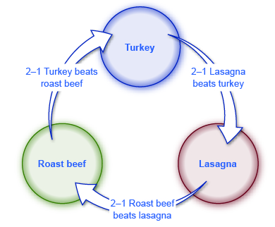

By the end of this section, you will be able to:

* Assess the median voter theory
* Explain the voting cycle
* Analyze the interrelationship between markets and government

Most developed countries today have a democratic system of government: citizens express their opinions through votes and those votes affect the direction of the country. The advantage of democracy over other systems is that it allows everyone in a society an equal say and therefore may reduce the possibility of oppression of the masses by a small group of wealthy oligarchs. There is no such thing as a perfect system, and democracy, for all its popularity, is not without its problems, a few of which we will examine here.

**Democracy**{: data-type="term" .no-emphasis} is sometimes summed up (and oversimplified) in two words: “Majority rule.” When voters face three or more choices, however, then voting may not always be a useful way of determining what the majority prefers.

As one example, consider an election in a state where 60% of the population is liberal and 40% is conservative. If there are only two candidates, one from each side, and if liberals and conservatives vote in the same 60–40 proportions in which they are represented in the population, then the liberal will win. What if the election ends up including two liberal candidates and one conservative? It is possible that the liberal vote will split and victory will go to the minority party. In this case, the outcome does not reflect the majority’s preference.

Does the majority view prevail in the case of sugar **quotas**{: data-type="term" .no-emphasis}? Clearly there are more sugar consumers in the United States than sugar producers, but the U.S. domestic sugar lobby (www.sugarcane.org) has successfully argued for protection against imports since 1789. By law, therefore, U.S. makers of cookies and candies must use 85% domestic sugar in their products. Meanwhile quotas on imported sugar restrict supply and keep the domestic price of sugar up—raising prices for companies that use sugar in the production of their goods and for consumers. The European Union allows sugar imports, and prices there are 40% lower than U.S. sugar prices. Sugar-producing countries in the Caribbean repeatedly protest the U.S. quotas at the World Trade Organization meetings, but each bite of cookie, at present, costs you more than if there were no sugar lobby. This case goes against the theory of the “median” voter in a democracy. The **median voter theory**{: data-type="term"} argues that politicians will try to match policies to what pleases the median voter preferences. If we think of political positions along a spectrum from left to right, the median voter is in the middle of the spectrum. This theory argues that actual policy will reflect “middle of the road.” In the case of sugar lobby politics, the *minority*, not the median, dominates policy.

Sometimes it is not even clear how to define what the majority opinion might be. Step aside from politics for a moment and think about a choice facing three families (the Ortegas, the Schmidts, and the Alexanders) who are planning to celebrate New Year’s Day together. They agree to vote on the menu, choosing from three entrees, and they agree that the majority vote wins. With three families, it seems reasonable that one choice of entree will get a 2–1 majority. What if, however, their vote ends up looking like [\[link\]](#Table_18_01)?

Clearly, the three families disagree on their first choice. But the problem goes even deeper. Instead of looking at all three choices at once, compare them two at a time. (See [\[link\]](#CNX_Econ_C18_001)) In a vote of turkey versus beef, turkey wins by 2–1. In a vote of beef versus lasagna, beef wins 2–1. If turkey beats beef, and beef beats lasagna, then it might seem only logical that turkey must also beat lasagna. However, with the preferences shown, lasagna is preferred to turkey by a 2–1 vote, as well. If lasagna is preferred to turkey, and turkey beats beef, then surely it must be that lasagna also beats beef? Actually, no; beef beats lasagna. In other words, the majority view may not win. Clearly, as any car salesmen will tell you, choices are influenced by the way they are presented.

 {: #CNX_Econ_C18_001 data-title="A Voting Cycle "}

<table id="Table_18_01" summary="The table shows the ranked meal preferences of the Ortega Family, the Schmidt Family, and the Alexander Family. The Ortega family&#x2019;s first choice is Turkey; their second choice is Roast beef; and their third choice is Lasagna. The Schmidt family&#x2019;s first choice is Roast beef; their second choice is Lasagna; and their third choice is Turkey. The Alexander family&#x2019;s first choice is Lasagna; their second choice is Turkey; and their third choice is Roast beef."><caption>Circular Preferences</caption><thead>
<tr>
	<th />
<th>The Ortega Family</th>
	<th>The Schmidt Family</th>
	<th>The Alexander Family</th>

</tr>
</thead><tbody>
        <tr>
          <td><strong>First Choice</strong></td>
          <td>Turkey</td>
          <td>Roast beef</td>
          <td>Lasagna</td>
        </tr>

        <tr>
          <td><strong>Second Choice</strong></td>
          <td>Roast beef</td>
          <td>Lasagna</td>
          <td>Turkey</td>
        </tr>
        <tr>
          <td><strong>Third Choice</strong></td>
          <td>Lasagna</td>
          <td>Turkey</td>
          <td>Roast beef</td>
        </tr>
</tbody></table>

The situation in which Choice A is preferred by a majority over Choice B, Choice B is preferred by a majority over Choice C, and Choice C is preferred by a majority over Choice A is called a **voting cycle**{: data-type="term"}. It is easy to imagine sets of government choices—say, perhaps the choice between increased defense spending, increased government spending on health care, and a tax cut—in which a voting cycle could occur. The result will be determined by the order in which choices are presented and voted on, not by majority rule, because every choice is both preferred to some alternative and also not preferred to another alternative.

Visit this [website][1] to read about instant runoff voting, a preferential voting system.

  

# Where Is Government’s Self-Correcting Mechanism?

When a **firm**{: data-type="term" .no-emphasis} produces a product no one wants to buy or produces at a higher cost than its competitors, the firm is likely to suffer losses. If it cannot change its ways, it will go out of business. This self-correcting mechanism in the marketplace can have harsh effects on workers or on local economies, but it also puts pressure on firms for good performance.

Government agencies, on the other hand, do not sell their products in a market; they receive tax dollars instead. They are not challenged by competitors as are private-sector firms. If the U.S. Department of Education or the U.S. Department of Defense is doing a poor job, citizens cannot purchase their services from another provider and drive the existing government agencies into bankruptcy. If you are upset that the Internal Revenue Service is slow in sending you a tax refund or seems unable to answer your questions, you cannot decide to pay your income taxes through a different organization. Of course, elected politicians can assign new leaders to government agencies and instruct them to reorganize or to emphasize a different mission. The pressure government faces, however, to change its bureaucracy, to seek greater efficiency, and to improve customer responsiveness is much milder than the threat of being put out of business altogether.

This insight suggests that when government provides goods or services directly, we might expect it to do so with less efficiency than private firms—except in certain cases where the government agency may compete directly with private firms. At the local level, for example, services like garbage collection can be provided by government directly, by private firms under contract to the government, or by a mix of government employees competing with private firms.

# A Balanced View of Markets and Government

The British statesman Sir Winston Churchill (1874–1965) once wrote: “No one pretends that democracy is perfect or all-wise. Indeed, it has been said that democracy is the worst form of government except for all of the other forms which have been tried from time to time.” In that spirit, the theme of this discussion is certainly not that democratic government should be abandoned. A practical student of public policy needs to recognize that in some cases, like the case of well-organized special interests or pork-barrel legislation, a democratic government may seek to enact economically unwise projects or programs. In other cases, by placing a low priority on the problems of those who are not well organized or who are less likely to vote, the government may fail to act when it could do some good. In these and other cases, there is no automatic reason to believe that government will necessarily make economically sensible choices.

“The true test of a first-rate mind is the ability to hold two contradictory ideas at the same time,” wrote the American author F. Scott Fitzgerald (1896–1940). At this point in your study of microeconomics, you should be able to go one better than Fitzgerald and hold three somewhat contradictory ideas about the interrelationship between markets and government in your mind at the same time.

First, markets are extraordinarily useful and flexible institutions through which society can allocate its scarce resources. This idea was introduced with the subjects of international trade and demand and supply in other chapters and reinforced in all the subsequent discussions of how households and firms make decisions.

Second, markets may sometimes produce unwanted results. A short list of the cases in which markets produce unwanted results includes monopoly and other cases of imperfect competition, pollution, poverty and inequality of incomes, discrimination, and failure to provide insurance.

Third, while government may play a useful role in addressing the problems of markets, government action is also imperfect and may not reflect majority views. Economists readily admit that, in settings like monopoly or negative externalities, a potential role exists for government intervention. However, in the real world, it is not enough to point out that government action might be a good idea. Instead, we must have some confidence that the government is likely to identify and carry out the appropriate public policy. To make sensible judgments about economic policy, we must see the strengths and weaknesses of both markets and government. We must not idealize or demonize either unregulated markets or government actions. Instead, consider the actual strengths and weaknesses of real-world markets and real-world governments.

These three insights seldom lead to simple or obvious political conclusions. As the famous British economist **Joan Robinson**{: data-type="term" .no-emphasis} wrote some decades ago: “\[E\]conomic theory, in itself, preaches no doctrines and cannot establish any universally valid laws. It is a method of ordering ideas and formulating questions.” The study of economics is neither politically conservative, nor moderate, nor liberal. There are economists who are Democrats, Republicans, libertarians, socialists, and members of every other political group you can name. Of course, conservatives may tend to emphasize the virtues of markets and the limitations of government, while liberals may tend to emphasize the shortcomings of markets and the need for government programs. Such differences only illustrate that the language and terminology of economics is not limited to one set of political beliefs, but can be used by all.

Chinese Tire Tariffs

In April 2009, the union representing U.S. tire manufacturing workers filed a request with the U.S. **International Trade Commission (ITC)**{: data-type="term" .no-emphasis}, asking it to investigate tire imports from China. Under U.S. trade law, if imports from a country increase to the point that they cause market disruption in the United States, as determined by the ITC, then it can also recommend a remedy for this market disruption. In this case, the ITC determined that from 2004 to 2008, U.S. tire manufacturers suffered declines in production, financial health, and employment as a direct result of increases in tire imports from China. The ITC recommended that an additional tax be placed on tire imports from China. President Obama and Congress agreed with the ITC recommendation, and in June 2009 tariffs on Chinese tires increased from 4% to 39%.

Why would U.S. consumers buy imported tires from China in the first place? Most likely, because they are cheaper than tires produced domestically or in other countries. Therefore, this tariff increase should cause U.S. consumers to pay higher prices for tires, either because Chinese tires are now more expensive, or because U.S. consumers are pushed by the tariff to buy more expensive tires made by U.S. manufacturers or those from other countries. In the end, this tariff made U.S. consumers pay more for tires.

Was this tariff met with outrage expressed via social media, traditional media, or mass protests? Were there “Occupy Wall Street-type” demonstrations? The answer is a resounding “No.” Most U.S. tire consumers were likely unaware of the tariff increase, although they may have noticed the price increase, which was between $4 and $13 depending on the type of tire. Tire consumers are also potential voters. Conceivably, a tax increase, even a small one, might make voters unhappy. However, voters probably realized that it was not worth their time to learn anything about this issue or cast a vote based on it. They probably thought their vote would not matter in determining the outcome of an election or changing this policy.

Estimates of the impact of this tariff show it costs U.S. consumers around $1.11 billion annually. Of this amount, roughly $817 million ends up in the pockets of foreign tire manufacturers other than in China, and the remaining $294 million goes to U.S. tire manufacturers. In other words, the tariff increase on Chinese tires may have saved 1,200 jobs in the domestic tire sector, but it cost 3,700 jobs in other sectors, as consumers had to cut down on their spending because they were paying more for tires. Jobs were actually lost as a result of this tariff. Workers in U.S. tire manufacturing firms earned about $40,000 in 2010. Given the number of jobs saved and the total cost to U.S. consumers, the cost of saving one job amounted to $926,500!

This tariff caused a net decline in U.S. social surplus. (Total surplus is discussed in the [Demand and Supply](/m48628) chapter, and tariffs are discussed in the [The International Trade and Capital Flows](/m48731) chapter.) Instead of saving jobs, it cost jobs, and those jobs that it saved cost many times more than the people working in them could ever hope to earn. Why would the government do this?

The chapter answers this question by discussing the influence special interest groups have on economic policy. The steelworkers union, whose members make tires, saw more and more of its members lose their jobs as U.S. consumers consumed more and more cheap Chinese tires. By definition, this union is relatively small but well organized, especially compared to tire consumers. It stands to gain much for each of its members, compared to what each tire consumer may have to give up in terms of higher prices. So the steelworkers union (joined by domestic tire manufacturers) has not only the means but the incentive to lobby economic policymakers and lawmakers. Given that U.S. tire consumers are a large and unorganized group, if they even are a group, it is unlikely they will lobby against higher tire tariffs. In the end, lawmakers tend to listen to those who lobby them, even though the results make for bad economic policy.

# Key Concepts and Summary

Majority votes can run into difficulties when more than two choices exist. A voting cycle occurs when, in a situation with at least three choices, choice A is preferred by a majority vote to choice B, choice B is preferred by a majority vote to choice C, and choice C is preferred by a majority vote to choice A. In such a situation, it is impossible to identify what the majority prefers. Another difficulty arises when the vote is so divided that no choice receives a majority.

A practical approach to microeconomic policy will need to take a realistic view of the specific strengths and weaknesses of markets and the specific strengths and weaknesses of government, rather than making the easy but wrong assumption that either the market or government is always beneficial or always harmful.

# Self-Check Questions

True or false: Majority rule can fail to produce a single preferred outcome when there are more than two choices.

True. This is exactly what occurs in a voting cycle. That is, the majority can prefer policy A to policy B, policy B to policy C, but also prefer policy C to policy A. Then, the majority will never reach a conclusive outcome.

Anastasia, Emma, and Greta are deciding what to do on a weekend getaway. They each suggest a first, second, and third choice and then vote on the options. Their first choice, second choice, and third choice preferences are as shown in [[link]](#Table_18_02). Explain why they will have a hard time reaching a decision. Does the group prefer mountain biking to canoeing? What about canoeing compared to the beach? What about the beach compared to the original choice of mountain biking? <table id="Table_18_02" summary="The table shows the ranked activity preferences of the Anastasia, Emma, and Greta. The Anastasia&#x2019;s first choice is the beach; her second choice is mountain biking; and her third choice is canoeing. Emma&#x2019;s first choice is mountain biking; her second choice is canoeing; and her third choice is the beach. Greta&#x2019;s first choice is canoeing; her second choice is the beach; and her third choice is mountain biking."><caption /><thead>
<tr>
<th />
	<th>Anastasia</th>
	<th>Emma</th>
	<th>Greta</th>

</tr>
</thead><tbody>
        <tr>
          <td>First Choice</td>
          <td>Beach</td>
          <td>Mountain biking</td>
          <td>Canoeing</td>
        </tr>

        <tr>
          <td>Second Choice</td>
          <td>Mountain biking</td>
          <td>Canoeing</td>
          <td>Beach</td>
        </tr>
        <tr>
          <td>Third Choice</td>
          <td>Canoeing</td>
          <td>Beach</td>
          <td>Mountain biking</td>
        </tr>
</tbody></table>

The problem is an example of a voting cycle. The group will vote for mountain biking over canoeing by 2–1. It will vote for canoeing over the beach by 2–1. If mountain biking is preferred to canoeing and canoeing is preferred to the beach, it might seem that it must be true that mountain biking is the favorite. But in a vote of the beach versus mountain biking, the beach wins by a 2–1 vote. When a voting cycle occurs, choosing a single favorite that is always preferred by a majority becomes impossible.

Suppose an election is being held for Soft Drink Commissioner. The field consists of one candidate from the Pepsi party and four from the Coca-Cola party. This would seem to indicate a strong preference for Coca-Cola among the voting population, but the Pepsi candidate ends up winning in a landslide. Why does this happen?

The four Coca-Cola candidates compete with each other for Coca-Cola voters, whereas everyone who prefers Pepsi had only one candidate to vote for. Thus the will of the majority is not satisfied.

# Review Questions

Why does a voting cycle make it impossible to decide on a majority-approved choice?

How does a government agency raise revenue differently from a private company, and how does that affect the way government decisions are made, compared to business decisions?

# Critical Thinking Questions

The United States currently uses a voting system called “first past the post” in elections, meaning that the candidate with the most votes wins. What are some of the problems with a “first past the post” system?

What are some alternatives to a “first past the post” system that might reduce the problem of voting cycles?

AT&amp;T spent some $10 million dollars lobbying Congress to block entry of competitors into the telephone market in 1978. Why do you think it efforts failed?

Occupy Wall Street was a national (and later global) organized protest against the greed, bank profits, and financial corruption that led to the 2008–2009 recession. The group popularized slogans like “We are the 99%,” meaning it represented the majority against the wealth of the top 1%. Does the fact that the protests had little to no effect on legislative changes support or contradict the chapter?

# References

Nixon, Ron. “American Candy Makers. Pinched by Inflated Sugar Prices. Look Abroad.” *The New York Times*. Last modified October 30, 2013. http://www.nytimes.com/2013/10/31/us/american-candy-makers-pinched-by-inflated-sugar-prices-look-abroad.html?\\\_r=0.

Hufbauer, Gary Clyde, and Sean Lowry. “U.S. Tire Tariffs: Saving Few Jobs at High Cost (Policy Brief 12-9).” *Peterson Institute for International Economics*. Last modified April 2012.

[1]: http://openstaxcollege.org/l/IRV
