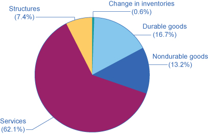

By the end of this section, you will be able to:

* Identify the components of GDP on the demand side and on the supply side
* Evaluate how gross domestic product (GDP) is measured
* Contrast and calculate GDP, net exports, and net national product

Macroeconomics is an empirical subject, so the first step toward understanding it is to measure the economy.

How large is the U.S. economy? The size of a nation’s overall economy is typically measured by its **gross domestic product (GDP)**{: data-type="term"}, which is the value of all final goods and services produced within a country in a given year. The measurement of GDP involves counting up the production of millions of different goods and services—smart phones, cars, music downloads, computers, steel, bananas, college educations, and all other new goods and services produced in the current year—and summing them into a total dollar value. This task is straightforward: take the quantity of everything produced, multiply it by the price at which each product sold, and add up the total. In 2014, the U.S. GDP totaled $17.4 trillion, the largest GDP in the world.

Each of the market transactions that enter into GDP must involve both a buyer and a seller. The GDP of an economy can be measured either by the total dollar value of what is purchased in the economy, or by the total dollar value of what is produced. There is even a third way, as we will explain later.

# GDP Measured by Components of Demand

Who buys all of this production? This **demand**{: data-type="term" .no-emphasis} can be divided into four main parts: consumer spending (consumption), business spending (investment), government spending on goods and services, and spending on net exports. (See the following Clear It Up feature to understand what is meant by investment.) [\[link\]](#Table_19_01) shows how these four components added up to the GDP in 2014. [\[link\]](#CNX_Econ_C19_007) (a) shows the levels of consumption, investment, and government purchases over time, expressed as a percentage of GDP, while [\[link\]](#CNX_Econ_C19_007) (b) shows the levels of exports and imports as a percentage of GDP over time. A few patterns about each of these components are worth noticing. [\[link\]](#Table_19_01) shows the components of GDP from the demand side. [\[link\]](#CNX_Econ_C19_012) provides a visual of the percentages.

<table id="Table_19_01" summary="This table has three columns and six rows. The first row is a header row and it labels the last two columns, &#x201C;Components of GDP on the Demand Side (in trillions of dollars),&#x201D; and &#x201C;Percentage of Total.&#x201D; Under the first, unlabeled column are the values: Consumption, Investment, Government, Exports, Imports, and Total GDP.  Under the &#x201C;Components of GDP on the Demand Side (in trillions of dollars)&#x201D; column are the values: $11.9, $2.9, $3.2, $2.3, &#x2212;$2.9, and $17.4. Under the &#x201C;Percentage of Total&#x201D; column are the values: 68.4%, 16.7%, 18.4%, 13.2%, &#x2212;16.7%, and 100%."><caption>Components of U.S. GDP in 2014: From the Demand Side(Source: http://bea.gov/iTable/index\_nipa.cfm)</caption><thead>
<tr>
<th />
<th>Components of GDP on the Demand Side (in trillions of dollars)</th>
<th>Percentage of Total</th>
</tr>
</thead><tbody>
<tr>
<td>Consumption</td>
<td>$11.9</td>
<td>68.4%</td>
</tr>

<tr>
<td>Investment</td>
<td>$2.9</td>
<td>16.7%</td>
</tr>

<tr>
<td>Government</td>
<td>$3.2</td>
<td>18.4%</td>
</tr>

<tr>
<td>Exports</td>
<td>$2.3</td>
<td>13.2%</td>
</tr>

<tr>
<td>Imports</td>
<td>–$2.9</td>
<td>–16.7%</td>
</tr>
<tr>
<td><strong>Total GDP</strong></td>
<td><strong>$17.4</strong></td>
<td><strong>100%</strong></td>
</tr>

      </tbody></table>

 "){: #CNX_Econ_C19_012 data-title="Percentage of Components of U.S. GDP on the Demand Side "}

What is meant by the word “investment”?

What do economists mean by investment, or business spending? In calculating GDP, investment does not refer to the purchase of stocks and bonds or the trading of financial assets. It refers to the purchase of new capital goods, that is, new commercial real estate (such as buildings, factories, and stores) and equipment, residential housing construction, and inventories. Inventories that are produced this year are included in this year’s GDP—even if they have not yet sold. From the accountant’s perspective, it is as if the firm invested in its own inventories. Business investment in 2014 was almost $3 trillion, according to the Bureau of Economic Analysis.

 ![This is a line graph with parts a and b. Part a shows the demand from consumption, investment, and government from the year 1960 to 2014. In 1960, the graph starts out at 61.0% for consumption. It remains fairly steady around 60% until 1993, when it is at 65%.  By 2014, it is at 68.5%. In 1960, the graph starts out at 22.3% for government. It remains steady around 20%, and by 2014, it is at 18.2%. In 1960, the graph starts out at 15.9% for investment. It rises gradually to 20.3% in 1978, then generally goes down to 16.4% in 2014.   Part b shows imports and exports from the year 1960 to 2014. In 1960, the graph starts out at 4.2% for imports. It rises fairly steadily with only a few drops, such as from 14.3% in 2000 to 13.1% in 2001. By 2014 it is at 16.5%. In 1960, the graph starts out at 5.0% for exports. It remains steadily around 5% until 1973, when it jumps to 6.7%. By 2014, the exports line is at 13.4%. ](../resources/CNX_Econv1-2_C19_04.jpg "(a) Consumption is about two-thirds of GDP, but it moves relatively little over time. Business investment hovers around 15% of GDP, but it increases and declines more than consumption. Government spending on goods and services is around 20% of GDP. (b) Exports are added to total demand for goods and services, while imports are subtracted from total demand. If exports exceed imports, as in most of the 1960s and 1970s in the U.S. economy, a trade surplus exists. If imports exceed exports, as in recent years, then a trade deficit exists. (Source: http://bea.gov/iTable/index_nipa.cfm)"){: #CNX_Econ_C19_007 data-title="Components of GDP on the Demand Side "}

Consumption expenditure by households is the largest component of GDP, accounting for about two-thirds of the GDP in any year. This tells us that consumers’ spending decisions are a major driver of the economy. However, consumer spending is a gentle elephant: when viewed over time, it does not jump around too much.

**Investment expenditure**{: data-type="term" .no-emphasis} refers to purchases of physical plant and equipment, primarily by businesses. If Starbucks builds a new store, or Amazon buys robots, these expenditures are counted under business investment. **Investment demand**{: data-type="term" .no-emphasis} is far smaller than **consumption demand**{: data-type="term" .no-emphasis}, typically accounting for only about 15–18% of GDP, but it is very important for the economy because this is where jobs are created. However, it fluctuates more noticeably than consumption. Business investment is volatile; new technology or a new product can spur business investment, but then confidence can drop and business investment can pull back sharply.

If you have noticed any of the infrastructure projects (new bridges, highways, airports) launched during the recession of 2009, you have seen how important government spending can be for the economy. Government expenditure in the United States is about 20% of GDP, and includes spending by all three levels of government: federal, state, and local. The only part of government spending counted in demand is government purchases of goods or services produced in the economy. Examples include the government buying a new fighter jet for the Air Force (federal government spending), building a new highway (state government spending), or a new school (local government spending). A significant portion of government budgets are transfer payments, like unemployment benefits, veteran’s benefits, and Social Security payments to retirees. These payments are excluded from GDP because the government does not receive a new good or service in return or exchange. Instead they are transfers of income from taxpayers to others. If you are curious about the awesome undertaking of adding up GDP, read the following Clear It Up feature.

How do statisticians measure GDP?

Government economists at the Bureau of Economic Analysis (BEA), within the U.S. Department of Commerce, piece together estimates of GDP from a variety of sources.

Once every five years, in the second and seventh year of each decade, the Bureau of the Census carries out a detailed census of businesses throughout the United States. In between, the Census Bureau carries out a monthly survey of retail sales. These figures are adjusted with foreign trade data to account for exports that are produced in the United States and sold abroad and for imports that are produced abroad and sold here. Once every ten years, the Census Bureau conducts a comprehensive survey of housing and residential finance. Together, these sources provide the main basis for figuring out what is produced for consumers.

For investment, the Census Bureau carries out a monthly survey of construction and an annual survey of expenditures on physical capital equipment.

For what is purchased by the federal government, the statisticians rely on the U.S. Department of the Treasury. An annual Census of Governments gathers information on state and local governments. Because a lot of government spending at all levels involves hiring people to provide services, a large portion of government spending is also tracked through payroll records collected by state governments and by the Social Security Administration.

With regard to foreign trade, the Census Bureau compiles a monthly record of all import and export documents. Additional surveys cover transportation and travel, and adjustment is made for financial services that are produced in the United States for foreign customers.

Many other sources contribute to the estimates of GDP. Information on energy comes from the U.S. Department of Transportation and Department of Energy. Information on healthcare is collected by the Agency for Health Care Research and Quality. Surveys of landlords find out about rental income. The Department of Agriculture collects statistics on farming.

All of these bits and pieces of information arrive in different forms, at different time intervals. The BEA melds them together to produce estimates of GDP on a quarterly basis (every three months). These numbers are then “annualized” by multiplying by four. As more information comes in, these estimates are updated and revised. The “advance” estimate of GDP for a certain quarter is released one month after a quarter. The “preliminary” estimate comes out one month after that. The “final” estimate is published one month later, but it is not actually final. In July, roughly updated estimates for the previous calendar year are released. Then, once every five years, after the results of the latest detailed five-year business census have been processed, the BEA revises all of the past estimates of GDP according to the newest methods and data, going all the way back to 1929.

Visit this [website][1] to read FAQs on the BEA site. You can even email your own questions!

  

When thinking about the demand for domestically produced goods in a global economy, it is important to count spending on exports—domestically produced goods that are sold abroad. By the same token, we must also subtract spending on imports—goods produced in other countries that are purchased by residents of this country. The net export component of GDP is equal to the dollar value of exports (X) minus the dollar value of imports (M), (X – M). The gap between exports and imports is called the **trade balance**{: data-type="term"}. If a country’s exports are larger than its imports, then a country is said to have a **trade surplus**{: data-type="term"}. In the United States, exports typically exceeded imports in the 1960s and 1970s, as shown in [\[link\]](#CNX_Econ_C19_007) (b).

Since the early 1980s, imports have typically exceeded exports, and so the United States has experienced a **trade deficit**{: data-type="term"} in most years. Indeed, the trade deficit grew quite large in the late 1990s and in the mid-2000s. [\[link\]](#CNX_Econ_C19_007) (b) also shows that imports and exports have both risen substantially in recent decades, even after the declines during the **Great Recession**{: data-type="term" .no-emphasis} between 2008 and 2009. As noted before, if exports and imports are equal, foreign trade has no effect on total GDP. However, even if exports and imports are balanced overall, foreign trade might still have powerful effects on particular industries and workers by causing nations to shift workers and physical capital investment toward one industry rather than another.

Based on these four components of demand, GDP can be measured as:

<math xmlns="http://www.w3.org/1998/Math/MathML"><mtable columnspacing="2px" columnalign="right center left"><mtr><mtd><mtext>GDP</mtext></mtd><mtd><mtext> = </mtext></mtd><mtd><mtext>Consumption + Investment + Government + Trade balance</mtext></mtd></mtr><mtr><mtd><mtext>GDP</mtext></mtd><mtd><mtext> = </mtext></mtd><mtd><mtext>C + I + G + (X – M)</mtext></mtd></mtr></mtable></math>

Understanding how to measure GDP is important for analyzing connections in the macro economy and for thinking about macroeconomic policy tools.

# GDP Measured by What is Produced

Everything that is purchased must be produced first. [\[link\]](#Table_19_02) breaks down what is produced into five categories: **durable goods**{: data-type="term"}, **nondurable goods**{: data-type="term"}, **services**{: data-type="term"}, **structures**{: data-type="term"}, and the change in **inventories**{: data-type="term"}. Before going into detail about these categories, notice that total GDP measured according to what is produced is exactly the same as the GDP measured by looking at the five components of demand. [\[link\]](#CNX_Econ_C19_011) provides a visual representation of this information.

<table id="Table_19_02" summary="This table has three columns and seven rows. The first row is a header row and it labels the last two columns, &#x201C;Components of GDP on the Supply Side (in trillions of dollars),&#x201D; and &#x201C;Percentage of Total.&#x201D; Under the first, unlabeled column are the values: Goods, Durable goods, Nondurable goods, Services, Structures, Change in inventories, and Total GDP. Under the &#x201C;Components of GDP on the Supply Side (in trillions of dollars)&#x201D; column starting with Durable goods are the values: $2.9, $2.3, $10.8, $1.3, $0.1, and $17.4. Under the &#x201C;Percentage of Total&#x201D; column starting with Durable goods are the values: 16.7%, 13.2%, 62.1%, 7.4%, 0.6%, and 100%. "><caption>Components of U.S. GDP on the Production Side, 2014(Source:  http://bea.gov/iTable/index\_nipa.cfm)</caption><thead>
<tr>
<th />
<th>Components of GDP on the Supply Side (in trillions of dollars)</th>
<th>Percentage of Total</th>
</tr>
</thead><tbody>
<tr>
<td>Goods</td>
<td />
<td />
</tr>

<tr>
<td>Durable goods</td>
<td>$2.9</td>
<td>16.7%</td>
</tr>

<tr>
<td>Nondurable goods</td>
<td>$2.3</td>
<td>13.2%</td>
</tr>

<tr>
<td>Services</td>
<td>$10.8</td>
<td>62.1%</td>
</tr>

<tr>
<td>Structures</td>
<td>$1.3</td>
<td>7.4%</td>
</tr>

<tr>
<td>Change in inventories</td>
<td>$0.1</td>
<td>0.6%</td>
</tr>

<tr>
<td><strong>Total GDP</strong></td>
<td><strong>$17.4</strong></td>
<td><strong>100%</strong></td>
</tr>

      </tbody></table>

{: #CNX_Econ_C19_011 data-title="Percentage of Components of GDP on the Production Side "}

Since every market transaction must have both a buyer and a seller, GDP must be the same whether measured by what is demanded or by what is produced. [\[link\]](#CNX_Econ_C19_004) shows these components of what is produced, expressed as a percentage of GDP, since 1960.

 {: #CNX_Econ_C19_004 data-title="Types of Production "}

In thinking about what is produced in the economy, many non-economists immediately focus on solid, long-lasting goods, like cars and computers. By far the largest part of GDP, however, is services. Moreover, services have been a growing share of GDP over time. A detailed breakdown of the leading service industries would include healthcare, education, and legal and financial services. It has been decades since most of the U.S. economy involved making solid objects. Instead, the most common jobs in a modern economy involve a worker looking at pieces of paper or a computer screen; meeting with co-workers, customers, or suppliers; or making phone calls.

Even within the overall category of goods, long-lasting durable goods like cars and refrigerators are about the same share of the economy as short-lived nondurable goods like food and clothing. The category of structures includes everything from homes, to office buildings, shopping malls, and factories. Inventories is a small category that refers to the goods that have been produced by one business but have not yet been sold to consumers, and are still sitting in warehouses and on shelves. The amount of inventories sitting on shelves tends to decline if business is better than expected, or to rise if business is worse than expected.

# The Problem of Double Counting

GDP is defined as the current value of all final goods and services produced in a nation in a year. What are final goods? They are goods at the furthest stage of production at the end of a year. Statisticians who calculate GDP must avoid the mistake of **double counting**{: data-type="term"}, in which output is counted more than once as it travels through the stages of production. For example, imagine what would happen if government statisticians first counted the value of tires produced by a tire manufacturer, and then counted the value of a new truck sold by an automaker that contains those tires. In this example, the value of the tires would have been counted twice-because the price of the truck includes the value of the tires.

To avoid this problem, which would overstate the size of the economy considerably, government statisticians count just the value of **final goods and services**{: data-type="term"} in the chain of production that are sold for consumption, investment, government, and trade purposes. **Intermediate goods**{: data-type="term"}, which are goods that go into the production of other goods, are excluded from GDP calculations. From the example above, only the value of the Ford truck will be counted. The value of what businesses provide to other businesses is captured in the final products at the end of the production chain.

The concept of GDP is fairly straightforward: it is just the dollar value of all final goods and services produced in the economy in a year. In our decentralized, market-oriented economy, actually calculating the more than $16 trillion-dollar U.S. GDP—along with how it is changing every few months—is a full-time job for a brigade of government statisticians.

<table id="Table_19_03" summary="The table shows what is included in a measure of GDP and what is not. Column 1 lists what is counted in GDP. Column 2 lists what is not included in GDP. What is Counted in GDP: Consumption; Business investment; Government spending on goods and services; Net exports. What is not Included in GDP: Intermediate goods; Transfer payments and non-market activities; Used goods; Illegal goods."><caption>Counting GDP</caption><thead>
<tr>
<th>What is Counted in GDP</th>
<th>What is not included in GDP</th>
</tr>
</thead><tbody>
<tr>
<td>Consumption</td>
<td>Intermediate goods</td>
</tr>

<tr>
<td>Business investment</td>
<td>Transfer payments and non-market activities</td>
</tr>

<tr>
<td>Government spending on goods and services</td>
<td>Used goods</td>
</tr>

<tr>
<td>Net exports</td>
<td>Illegal goods</td>
</tr>

      </tbody></table>

Notice the items that are not counted into GDP, as outlined in [\[link\]](#Table_19_03). The sales of used goods are not included because they were produced in a previous year and are part of that year’s GDP. The entire underground economy of services paid “under the table” and illegal sales should be counted, but is not, because it is impossible to track these sales. In a recent study by Friedrich Schneider of shadow economies, the underground economy in the United States was estimated to be 6.6% of GDP, or close to $2 trillion dollars in 2013 alone. Transfer payments, such as payment by the government to individuals, are not included, because they do not represent production. Also, production of some goods—such as home production as when you make your breakfast—is not counted because these goods are not sold in the marketplace.

Visit this [website][2] to read about the “New Underground Economy.”

  

# Other Ways to Measure the Economy

Besides GDP, there are several different but closely related ways of measuring the size of the economy. We mentioned above that GDP can be thought of as total production and as total purchases. It can also be thought of as total income since anything produced and sold produces income.

One of the closest cousins of GDP is the **gross national product (GNP)**{: data-type="term"}. GDP includes only what is produced within a country’s borders. GNP adds what is produced by domestic businesses and labor abroad, and subtracts out any payments sent home to other countries by foreign labor and businesses located in the United States. In other words, GNP is based more on the production of citizens and firms of a country, wherever they are located, and GDP is based on what happens within the geographic boundaries of a certain country. For the United States, the gap between GDP and GNP is relatively small; in recent years, only about 0.2%. For small nations, which may have a substantial share of their population working abroad and sending money back home, the difference can be substantial.

**Net national product (NNP)**{: data-type="term"} is calculated by taking GNP and then subtracting the value of how much physical capital is worn out, or reduced in value because of aging, over the course of a year. The process by which capital ages and loses value is called **depreciation**{: data-type="term"}. The NNP can be further subdivided into **national income**{: data-type="term"}, which includes all income to businesses and individuals, and personal income, which includes only income to people.

For practical purposes, it is not vital to memorize these definitions. However, it is important to be aware that these differences exist and to know what statistic you are looking at, so that you do not accidentally compare, say, GDP in one year or for one country with GNP or NNP in another year or another country. To get an idea of how these calculations work, follow the steps in the following Work It Out feature.

Calculating GDP, Net Exports, and NNP

Based on the information in [\[link\]](#Table_19_04)\:  What is the value of GDP? What is the value of net exports? What is the value of NNP? 

| Government purchases | $120 billion |
| Depreciation | $40 billion |
| Consumption | $400 billion |
| Business Investment | $60 billion |
| Exports | $100 billion |
| Imports | $120 billion |
| Income receipts from rest of the world | $10 billion |
| Income payments to rest of the world | $8 billion |
{: #Table_19_04 summary="The table shows information that is useful for calculating GDP, net exports, and NNP. Column 1 lists the category. Column 2 lists the value in billions of dollars. Government purchases;  20 billion. Depreciation; $40 billion. Consumption; $400 billion. Business investment; $60 billion. Exports;  00 billion. Imports;  20 billion."}

Step 1. To calculate GDP use the following formula:

<math xmlns="http://www.w3.org/1998/Math/MathML"><mtable columnspacing="2px" columnalign="right center left"><mtr><mtd><mtext>GDP</mtext></mtd><mtd><mtext> = </mtext></mtd><mtd><mtext>Consumption + Investment + Government spending + (Exports – Imports)</mtext></mtd></mtr><mtr><mtd /><mtd><mtext> = </mtext></mtd><mtd><mtext>C + I + G + (X – M)</mtext></mtd></mtr><mtr><mtd /><mtd><mtext> = </mtext></mtd><mtd><mtext>$400 + $60 + $120 + ($100 – $120)</mtext></mtd></mtr><mtr><mtd /><mtd><mtext> = </mtext></mtd><mtd><mtext>$560 billion</mtext></mtd></mtr></mtable></math>

Step 2. To calculate net exports, subtract imports from exports.

<math xmlns="http://www.w3.org/1998/Math/MathML"><mtable columnspacing="2px" columnalign="right center left"><mtr><mtd><mtext>Net exports</mtext></mtd><mtd><mtext> = </mtext></mtd><mtd><mtext>X – M</mtext></mtd></mtr><mtr><mtd /><mtd><mtext> = </mtext></mtd><mtd><mtext>$100 – $120</mtext></mtd></mtr><mtr><mtd /><mtd><mtext> = </mtext></mtd><mtd><mtext>–$20 billion</mtext></mtd></mtr></mtable></math>

Step 3. To calculate NNP, use the following formula:

<math xmlns="http://www.w3.org/1998/Math/MathML"><mtable columnspacing="2px" columnalign="right center left"> <mtr><mtd><mtext>NNP</mtext></mtd> <mtd><mtext> = </mtext></mtd> <mtd><mtext>GDP + Income receipts from the rest of the world</mtext></mtd></mtr> <mtr><mtd /><mtd /><mtd><mtext>– Income payments to the rest of the world – Depreciation</mtext></mtd></mtr> <mtr><mtd /><mtd><mtext>=</mtext></mtd> <mtd><mtext>$560 + $10 – $8 – $40</mtext></mtd></mtr> <mtr><mtd /><mtd><mtext>=</mtext></mtd> <mtd><mtext>$522 billion</mtext></mtd> </mtr></mtable></math>

# Key Concepts and Summary

The size of a nation’s economy is commonly expressed as its gross domestic product (GDP), which measures the value of the output of all goods and services produced within the country in a year. GDP is measured by taking the quantities of all goods and services produced, multiplying them by their prices, and summing the total. Since GDP measures what is bought and sold in the economy, it can be measured either by the sum of what is purchased in the economy or what is produced.

Demand can be divided into consumption, investment, government, exports, and imports. What is produced in the economy can be divided into durable goods, nondurable goods, services, structures, and inventories. To avoid double counting, GDP counts only final output of goods and services, not the production of intermediate goods or the value of labor in the chain of production.

# Self-Check Questions

Country A has export sales of $20 billion, government purchases of $1,000 billion, business investment is $50 billion, imports are $40 billion, and consumption spending is $2,000 billion. What is the dollar value of GDP?

GDP is C + I + G + (X – M). GDP = $2,000 billion + $50 billion + $1,000 billion + ($20 billion – $40 billion) = $3,030

Which of the following are included in GDP, and which are not?  The cost of hospital stays The rise in life expectancy over time Child care provided by a licensed day care center Child care provided by a grandmother The sale of a used car The sale of a new car The greater variety of cheese available in supermarkets The iron that goes into the steel that goes into a refrigerator bought by a consumer. 

 Hospital stays are part of GDP. Changes in life expectancy are not market transactions and not part of GDP. Child care that is paid for is part of GDP. If Grandma gets paid and reports this as income, it is part of GDP, otherwise not. A used car is not produced this year, so it is not part of GDP. A new car is part of GDP. Variety does not count in GDP, where the cheese could all be cheddar. The iron is not counted because it is an intermediate good. 

# Review Questions

What are the main components of measuring GDP with what is demanded?

What are the main components of measuring GDP with what is produced?

Would you usually expect GDP as measured by what is demanded to be greater than GDP measured by what is supplied, or the reverse?

Why must double counting be avoided when measuring GDP?

# Critical Thinking Question

U.S. macroeconomic data are thought to be among the best in the world. Given what you learned in the [Clear It Up](#fs-idm64181600) "How do statisticians measure GDP?", does this surprise you? Or does this simply reflect the complexity of a modern economy?

What does GDP not tell us about the economy?

# Problem

Last year, a small nation with abundant forests cut down $200 worth of trees. $100 worth of trees were then turned into $150 worth of lumber. $100 worth of that lumber was used to produce $250 worth of bookshelves. Assuming the country produces no other outputs, and there are no other inputs used in the production of trees, lumber, and bookshelves, what is this nation's GDP? In other words, what is the value of the final goods produced including trees, lumber and bookshelves?

# References

U.S. Department of Commerce: Bureau of Economic Analysis. “National data: National Income and Product Accounts Tables.” http://bea.gov/iTable/iTable.cfm?ReqID=9&amp;step=1.

U.S. Department of Commerce: United States Census Bureau. “Census of Governments: 2012 Census of Governments.” http://www.census.gov/govs/cog/.

United States Department of Transportation. “About DOT.” Last modified March 2, 2012. http://www.dot.gov/about.

U.S. Department of Energy. “Energy.gov.” http://energy.gov/.

U.S. Department of Health &amp; Human Services. “Agency for Healthcare Research and Quality.” http://www.ahrq.gov/.

United States Department of Agriculture. “USDA.” http://www.usda.gov/wps/portal/usda/usdahome.

Schneider, Friedrich. Department of Economics. “Size and Development of the Shadow Economy of 31 European and 5 other OECD Countries from 2003 to 2013: A Further Decline.” *Johannes Kepler University*. Last modified April 5, 2013. http://www.econ.jku.at/members/Schneider/files/publications/2013/ShadEcEurope31\\\_Jan2013.pdf.

[1]: http://openstaxcollege.org/l/beafaq
[2]: http://openstaxcollege.org/l/undergroundecon
