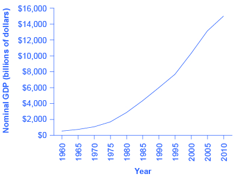
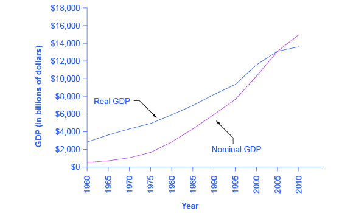

By the end of this section, you will be able to:

* Contrast nominal GDP and real GDP
* Explain GDP deflator
* Calculate real GDP based on nominal GDP values

When examining economic statistics, there is a crucial distinction worth emphasizing. The distinction is between nominal and real measurements, which refer to whether or not inflation has distorted a given statistic. Looking at economic statistics without considering inflation is like looking through a pair of binoculars and trying to guess how close something is: unless you know how strong the lenses are, you cannot guess the distance very accurately. Similarly, if you do not know the rate of inflation, it is difficult to figure out if a rise in GDP is due mainly to a rise in the overall level of prices or to a rise in quantities of goods produced. The **nominal value**{: data-type="term"} of any economic statistic means the statistic is measured in terms of actual prices that exist at the time. The **real value**{: data-type="term"} refers to the same statistic after it has been adjusted for inflation. Generally, it is the real value that is more important.

# Converting Nominal to Real GDP

[\[link\]](#Table_19_05) shows U.S. GDP at five-year intervals since 1960 in nominal dollars; that is, GDP measured using the actual market prices prevailing in each stated year. This data is also reflected in the graph shown in [\[link\]](#CNX_Econ_C19_009)

<table id="Table_19_05" summary="The table shows U.S. GDP at five-year intervals since 1960 in nominal dollars. Column 1 lists the Year. Column 2 lists the Nominal GDP (billions of dollars). Column 3 lists the GDP Deflator (2005 = 100). Row 1: Year 1960; nominal GDP = $543.3 billion; deflator = 19.0. Row 2: Year 1965; nominal GDP = $743.7 billion; deflator = 20.3. Row 3: Year 1970; nominal GDP = $1,075.9 billion; deflator = 24.8. Row 4: Year 1975; nominal GDP = $1,688.9 billion; deflator = 34.1. Row 5: Year 1980; nominal GDP = $2,862.5 billion; deflator = 48.3. Row 6: Year 1985; nominal GDP = $4,346.7 billion; deflator = 62.3. Row 7: Year 1990; nominal GDP = $5,979.6 billion; deflator = 72.7. Row 8: Year 1995; nominal GDP = $7,664.0 billion; deflator = 81.7. Row 9: Year 2000; nominal GDP = $10,289.7 billion; deflator = 89.0. Row 10: Year 2005; nominal GDP = $13,095.4 billion; deflator = 100.0. Row 11: Year 2010; nominal GDP = $14,958.3 billion; deflator = 110.0."><caption>U.S. Nominal GDP and the GDP Deflator(Source: www.bea.gov)</caption><thead>
<tr>
<th>Year</th>
<th>Nominal GDP (billions of dollars)</th>
<th>GDP Deflator (2005 = 100)</th>
</tr>
</thead><tbody>
<tr>
<td>1960</td>
<td>543.3</td>
<td>19.0</td>
</tr>

<tr>
<td>1965</td>
<td>743.7</td>
<td>20.3</td>
</tr>

<tr>
<td>1970</td>
<td>1,075.9</td>
<td>24.8</td>
</tr>

<tr>
<td>1975</td>
<td>1,688.9</td>
<td>34.1</td>
</tr>

<tr>
<td>1980</td>
<td>2,862.5</td>
<td>48.3</td>
</tr>
<tr>
<td>1985</td>
<td>4,346.7</td>
<td>62.3</td>
</tr>
<tr>
<td>1990</td>
<td>5,979.6</td>
<td>72.7</td>
</tr>
<tr>
<td>1995</td>
<td>7,664.0</td>
<td>81.7</td>
</tr>
<tr>
<td>2000</td>
<td>10,289.7</td>
<td>89.0</td>
</tr>
<tr>
<td>2005</td>
<td>13,095.4</td>
<td>100.0</td>
</tr>
<tr>
<td>2010</td>
<td>14,958.3</td>
<td>110.0</td>
</tr>

      </tbody></table>

 {: #CNX_Econ_C19_009 data-media-type="image/jpeg" data-title="U.S. Nominal GDP, 1960&#x2013;2010 "}

If an unwary analyst compared nominal GDP in 1960 to nominal GDP in 2010, it might appear that national output had risen by a factor of twenty-seven over this time (that is, GDP of $14,958 billion in 2010 divided by GDP of $543 billion in 1960). This conclusion would be highly misleading. Recall that nominal GDP is defined as the quantity of every good or service produced multiplied by the price at which it was sold, summed up for all goods and services. In order to see how much production has actually increased, we need to extract the effects of higher prices on nominal GDP. This can be easily done, using the GDP deflator.

**GDP deflator**{: data-type="term" .no-emphasis} is a price index measuring the average prices of all goods and services included in the economy. We explore price indices in detail and how they are computed in [Inflation](/m48724){: .target-chapter}, but this definition will do in the context of this chapter. The data for the GDP deflator are given in [\[link\]](#Table_19_05) and shown graphically in [\[link\]](#CNX_Econ_C19_010).

"){: #CNX_Econ_C19_010 data-media-type="image/jpeg" data-title="U.S. GDP Deflator, 1960&#x2013;2010 "}

[\[link\]](#CNX_Econ_C19_010) shows that the price level has risen dramatically since 1960. The price level in 2010 was almost six times higher than in 1960 (the deflator for 2010 was 110 versus a level of 19 in 1960). Clearly, much of the apparent growth in nominal GDP was due to inflation, not an actual change in the quantity of goods and services produced, in other words, not in real GDP. Recall that nominal GDP can rise for two reasons: an increase in output, and/or an increase in prices. What is needed is to extract the increase in prices from nominal GDP so as to measure only changes in output. After all, the dollars used to measure nominal GDP in 1960 are worth more than the inflated dollars of 1990—and the price index tells exactly how much more. This adjustment is easy to do if you understand that nominal measurements are in value terms, where

<math xmlns="http://www.w3.org/1998/Math/MathML"><mtable columnspacing="2px" columnalign="right center left"><mtr><mtd><mtext>Value</mtext></mtd><mtd><mtext> = </mtext></mtd><mtd><mtext>Price × Quantity</mtext></mtd><mtd><mspace /></mtd></mtr><mtr><mtd /><mtd /><mtd><mtext>     or</mtext></mtd><mtd><mspace /></mtd></mtr><mtr><mtd><mtext>Nominal GDP</mtext></mtd><mtd><mtext> = </mtext></mtd><mtd><mtext>GDP Deflator × Real GDP</mtext></mtd><mtd><mspace /></mtd></mtr></mtable></math>

Let’s look at an example at the micro level. Suppose the t-shirt company, Coolshirts, sells 10 t-shirts at a price of $9 each.

<math xmlns="http://www.w3.org/1998/Math/MathML"><mtable columnspacing="2px" columnalign="right center left"><mtr><mtd><mtext>Coolshirt's nominal revenue from sales</mtext></mtd><mtd><mtext> = </mtext></mtd><mtd><mtext>Price × Quantity</mtext></mtd></mtr><mtr><mtd /><mtd><mtext> = </mtext></mtd><mtd><mtext>$9 × 10</mtext></mtd></mtr><mtr><mtd /><mtd><mtext> = </mtext></mtd><mtd><mtext>$90</mtext></mtd></mtr></mtable></math>

Then,

<math xmlns="http://www.w3.org/1998/Math/MathML"><mtable columnspacing="2px 2px 2px" columnalign="left center left"><mtr><mtd><mtext>Coolshirt's real income</mtext></mtd><mtd><mtext> = </mtext></mtd><mtd><mfrac><mtext>Nominal revenue</mtext><mtext>Price</mtext></mfrac></mtd></mtr><mtr><mtd /><mtd><mtext> = </mtext></mtd><mtd><mfrac><mtext>$90</mtext><mrow><mtext>$9</mtext></mrow></mfrac></mtd></mtr><mtr><mtd /><mtd><mtext> = </mtext></mtd><mtd><mtext>10</mtext></mtd></mtr></mtable></math>

In other words, when we compute “real” measurements we are trying to get at actual quantities, in this case, 10 t-shirts.

With GDP, it is just a tiny bit more complicated. We start with the same formula as above:

<math xmlns="http://www.w3.org/1998/Math/MathML"><mtable columnspacing="2px" columnalign="right center left"><mtr><mtd><mtext>Real GDP</mtext></mtd><mtd><mtext> = </mtext></mtd><mtd><mfrac><mtext>Nominal GDP</mtext><mtext>Price Index</mtext></mfrac></mtd></mtr></mtable></math>

For reasons that will be explained in more detail below, mathematically, a price index is a two-digit decimal number like 1.00 or 0.85 or 1.25. Because some people have trouble working with decimals, when the price index is published, it has traditionally been multiplied by 100 to get integer numbers like 100, 85, or 125. What this means is that when we “deflate” nominal figures to get real figures (by dividing the nominal by the price index). We also need to remember to divide the published price index by 100 to make the math work. So the formula becomes:

<math xmlns="http://www.w3.org/1998/Math/MathML"><mtable columnspacing="2px" columnalign="right center left"><mtr><mtd><mtext>Real GDP</mtext></mtd><mtd><mtext> = </mtext></mtd><mtd><mfrac><mtext>Nominal GDP</mtext><mtext>Price Index ÷ 100</mtext></mfrac></mtd></mtr></mtable></math>

Now read the following Work It Out feature for more practice calculating real GDP.

Computing GDP

It is possible to use the data in [\[link\]](#Table_19_05) to compute real GDP.

Step 1. Look at [\[link\]](#Table_19_05), to see that, in 1960, nominal GDP was $543.3 billion and the price index (GDP deflator) was 19.0.

Step 2. To calculate the real GDP in 1960, use the formula:

<math xmlns="http://www.w3.org/1998/Math/MathML"><mtable columnspacing="2px" columnalign="right center left"><mtr><mtd><mtext>Real GDP</mtext></mtd><mtd><mtext> = </mtext></mtd><mtd><mfrac><mtext>Nominal GDP</mtext><mtext>Price Index ÷ 100</mtext></mfrac></mtd></mtr><mtr><mtd /><mtd><mtext> = </mtext></mtd><mtd><mfrac><mtext>$543.3 billion</mtext><mtext>19 ÷ 100</mtext></mfrac></mtd></mtr><mtr><mtd /><mtd><mtext> = </mtext></mtd><mtd><mtext>$2,859.5 billion</mtext></mtd></mtr></mtable></math>

We’ll do this in two parts to make it clear. First adjust the price index: 19 divided by 100 = 0.19. Then divide into nominal GDP: $543.3 billion / 0.19 = $2,859.5 billion.

Step 3. Use the same formula to calculate the real GDP in 1965.

<math xmlns="http://www.w3.org/1998/Math/MathML"><mtable columnspacing="2px" columnalign="right center left"><mtr><mtd><mtext>Real GDP</mtext></mtd><mtd><mtext> = </mtext></mtd><mtd><mfrac><mtext>Nominal GDP</mtext><mtext>Price Index ÷ 100</mtext></mfrac></mtd></mtr><mtr><mtd /><mtd><mtext> = </mtext></mtd><mtd><mfrac><mtext>$743.7 billion</mtext><mtext>20.3 ÷ 100</mtext></mfrac></mtd></mtr><mtr><mtd /><mtd><mtext> = </mtext></mtd><mtd><mtext>$3,663.5 billion</mtext></mtd></mtr></mtable></math>

Step 4. Continue using this formula to calculate all of the real GDP values from 1960 through 2010. The calculations and the results are shown in [\[link\]](#Table_19_06).

<table id="Table_19_06" summary="The table shows the calculations and results for all real GDP values from 1960 through 2010. Column 1 lists the Year. Column 2 lists the Nominal GDP values (billions of dollars). Column 3 lists the GDP Deflator values (1005 = 100). Column 4 lists the Calculations. Column 5 lists the Real GDP values (billions of 2005 dollars). Row 1: Year 1960; nominal GDP = $543.3 billion; deflator = 19.0; calculations = 543.3 / (19.0/100); real GDP = $2,859.5 billion. Row 2: Year 1965; nominal GDP = $743.7 billion; deflator = 20.3; calculations = 743.7 / (20.3/100); real GDP = $3,663.5 billion. Row 3: Year 1970; nominal GDP = $1,075.9 billion; deflator = 24.8; calculations = 1,075.9 / (24.8/100); real GDP = $4,338.3 billion. Row 4: Year 1975; nominal GDP = $1,688.9 billion; deflator = 34.1; calculations = 1,688.9 / (34.1/100); real GDP = $4,952.8 billion. Row 5: Year 1980; nominal GDP = $2,862.5 billion; deflator = 48.3; calculations = 2,862.5 / (48.3/100); real GDP = $5,926.5 billion. Row 6: Year 1985; nominal GDP = $4,346.7 billion; deflator = 62.3; calculations = 4,346.7 / (62.3/100); real GDP = $6,977.0 billion. Row 7: Year 1990; nominal GDP = $5,979.6 billion; deflator = 72.7; calculations = 5,979.6 / (72.7/100); real GDP = $8,225.0 billion. Row 8: Year 1995; nominal GDP = $7,664 billion; deflator = 82.0; calculations = 7,664 / (82.0/100); real GDP = $9,346.3 billion. Row 9: Year 2000; nominal GDP = $10,289.7 billion; deflator = 89.0; calculations = 10,289.7 / (89.0/100); real GDP = $11,561.5 billion. Row 10: Year 2005; nominal GDP = $13,095.4 billion; deflator = 100.0; calculations = 13,095.4 / (100.0/100); real GDP = $13,095.4 billion. Row 11: Year 2010; nominal GDP = $14,958.3 billion; deflator = 110.0; calculations = 14,958.3 / (110.0/100); real GDP = $13,598.5 billion."><caption>Converting Nominal to Real GDP(Source: Bureau of Economic Analysis, www.bea.gov)</caption><thead>
<tr>
<th>Year</th>
<th>Nominal GDP (billions of dollars)</th>
<th>GDP Deflator (2005 = 100)</th>
<th>Calculations</th>
<th>Real GDP (billions of 2005 dollars)</th>
</tr>
</thead><tbody>
<tr>
<td>1960</td>
<td>543.3</td>
<td>19.0</td>
<td>  543.3 / (19.0/100)</td>
<td>2859.5</td>
</tr>

<tr>
<td>1965</td>
<td>743.7</td>
<td>20.3</td>
<td>  743.7 / (20.3/100)</td>
<td>3663.5</td>
</tr>

<tr>
<td>1970</td>
<td>1075.9</td>
<td>24.8</td>
<td>1,075.9 / (24.8/100)</td>
<td>4338.3</td>
</tr>

<tr>
<td>1975</td>
<td>1688.9</td>
<td>34.1</td>
<td>1,688.9 / (34.1/100)</td>
<td>4952.8</td>
</tr>

<tr>
<td>1980</td>
<td>2862.5</td>
<td>48.3</td>
<td>2,862.5 / (48.3/100)</td>
<td>5926.5</td>
</tr>
<tr>
<td>1985</td>
<td>4346.7</td>
<td>62.3</td>
<td>4,346.7 / (62.3/100)</td>
<td>6977.0</td>
</tr>
<tr>
<td>1990</td>
<td>5979.6</td>
<td>72.7</td>
<td>5,979.6 / (72.7/100)</td>
<td>8225.0</td>
</tr>
<tr>
<td>1995</td>
<td>7664.0</td>
<td>82.0</td>
<td> 7,664 / (82.0/100)</td>
<td>9346.3</td>
</tr>
<tr>
<td>2000</td>
<td>10289.7</td>
<td>89.0</td>
<td>10,289.7 / (89.0/100)</td>
<td>11561.5</td>
</tr>
<tr>
<td>2005</td>
<td>13095.4</td>
<td>100.0</td>
<td>13,095.4 / (100.0/100)</td>
<td>13095.4</td>
</tr>
<tr>
<td>2010</td>
<td>14958.3</td>
<td>110.0</td>
<td>14,958.3 / (110.0/100)</td>
<td>13598.5</td>
</tr>

      </tbody></table>
There are a couple things to notice here. Whenever you compute a real statistic, one year (or period) plays a special role. It is called the base year (or base period). The base year is the year whose prices are used to compute the real statistic. When we calculate real GDP, for example, we take the quantities of goods and services produced in each year (for example, 1960 or 1973) and multiply them by their prices in the base year (in this case, 2005), so we get a measure of GDP that uses prices that do not change from year to year. That is why real GDP is labeled “Constant Dollars” or “2005 Dollars,” which means that real GDP is constructed using prices that existed in 2005. The formula used is:

<math xmlns="http://www.w3.org/1998/Math/MathML"><mtable columnspacing="2px 2px" columnalign="right center"><mtr><mtd><mtext>GDP deflator</mtext></mtd><mtd><mtext> = </mtext></mtd><mtd><mfrac><mtext>Nominal GDP</mtext><mtext>Real GDP</mtext></mfrac></mtd></mtr></mtable><mtext> × 100</mtext></math>

Rearranging the formula and using the data from 2005:

<math xmlns="http://www.w3.org/1998/Math/MathML"><mtable columnspacing="2px 2px 2px" columnalign="right center left"><mtr><mtd><mtext>Real GDP</mtext></mtd><mtd><mtext> = </mtext></mtd><mtd><mfrac><mtext>Nominal GDP</mtext><mtext>Price Index ÷ 100</mtext></mfrac></mtd></mtr><mtr><mtd /><mtd><mtext> = </mtext></mtd><mtd><mfrac><mtext>$13,095.4 billion</mtext><mtext>100 ÷ 100</mtext></mfrac></mtd></mtr><mtr><mtd /><mtd><mtext> = </mtext></mtd><mtd><mtext>$13,095.4 billion</mtext></mtd></mtr></mtable></math>

Comparing real GDP and nominal GDP for 2005, you see they are the same. This is no accident. It is because 2005 has been chosen as the “base year” in this example. Since the price index in the base year always has a value of 100 (by definition), nominal and real GDP are always the same in the base year.

Look at the data for 2010.

<math xmlns="http://www.w3.org/1998/Math/MathML"><mtable columnspacing="2px 2px 2px" columnalign="right center left"><mtr><mtd><mtext>Real GDP</mtext></mtd><mtd><mtext> = </mtext></mtd><mtd><mfrac><mtext>Nominal GDP</mtext><mtext>Price Index ÷ 100</mtext></mfrac></mtd></mtr><mtr><mtd /><mtd><mtext> = </mtext></mtd><mtd><mfrac><mtext>$14,958.3 billion</mtext><mtext>110 ÷ 100</mtext></mfrac></mtd></mtr><mtr><mtd /><mtd><mtext> = </mtext></mtd><mtd><mtext>$13,598.5 billion</mtext></mtd></mtr></mtable></math>

Use this data to make another observation: As long as inflation is positive, meaning prices increase on average from year to year, real GDP should be less than nominal GDP in any year after the base year. The reason for this should be clear: The value of nominal GDP is “inflated” by inflation. Similarly, as long as inflation is positive, real GDP should be greater than nominal GDP in any year before the base year.

[\[link\]](#CNX_Econ_C19_013) shows the U.S. nominal and **real GDP**{: data-type="term" .no-emphasis} since 1960. Because 2005 is the base year, the nominal and real values are exactly the same in that year. However, over time, the rise in nominal GDP looks much larger than the rise in real GDP (that is, the **nominal GDP**{: data-type="term" .no-emphasis} line rises more steeply than the real GDP line), because the rise in nominal GDP is exaggerated by the presence of inflation, especially in the 1970s.

{: #CNX_Econ_C19_013 data-media-type="image/jpeg" data-title="U.S. Nominal and Real GDP, 1960&#x2013;2012 "}

Let’s return to the question posed originally: How much did GDP increase in real terms? What was the rate of growth of real GDP from 1960 to 2010? To find the real growth rate, we apply the formula for percentage change:

<math xmlns="http://www.w3.org/1998/Math/MathML"><mtable columnspacing="2px" columnalign="right center left"><mtr><mtd><mfrac><mtext>2010 real GDP – 1960 real GDP</mtext><mtext>1960 real GDP</mtext></mfrac><mtext> × 100</mtext></mtd><mtd><mtext> = </mtext></mtd><mtd><mtext>% change</mtext></mtd></mtr><mtr><mtd><mfrac><mtext>13,598.5 – 2,859.5</mtext><mtext>2,859.5</mtext></mfrac><mtext> × 100</mtext></mtd><mtd><mtext> = </mtext></mtd><mtd><mtext>376%</mtext></mtd></mtr></mtable></math>

In other words, the U.S. economy has increased real production of goods and services by nearly a factor of four since 1960. Of course, that understates the material improvement since it fails to capture improvements in the quality of products and the invention of new products.

There is a quicker way to answer this question approximately, using another math trick. Because:

<math xmlns="http://www.w3.org/1998/Math/MathML"><mtable columnspacing="2px" columnalign="right center left"><mtr><mtd><mtext>Real GDP</mtext></mtd><mtd><mtext> = </mtext></mtd><mtd><mtext>Price × Quantity</mtext></mtd></mtr><mtr><mtd><mtext>% change in real GDP</mtext></mtd><mtd><mtext> = </mtext></mtd><mtd><mtext>% change in price + % change in quantity</mtext></mtd></mtr><mtr><mtd /><mtd><mtext> OR </mtext></mtd><mtd /></mtr><mtr><mtd><mtext>% change in quantity</mtext></mtd><mtd><mtext> = </mtext></mtd><mtd><mtext>% change in real GDP – % change in price</mtext></mtd></mtr></mtable></math>

Therefore, the growth rate of real GDP (% change in quantity) equals the growth rate in nominal GDP (% change in value) minus the inflation rate (% change in price).

Note that using this equation provides an approximation for small changes in the levels. For more accurate measures, one should use the first formula shown.

# Key Concepts and Summary

The nominal value of an economic statistic is the commonly announced value. The real value is the value after adjusting for changes in inflation. To convert nominal economic data from several different years into real, inflation-adjusted data, the starting point is to choose a base year arbitrarily and then use a price index to convert the measurements so that they are measured in the money prevailing in the base year.

# Self-Check Question

Using data from [[link]](#Table_19_05) how much of the nominal GDP growth from 1980 to 1990 was real GDP and how much was inflation?

From 1980 to 1990, real GDP grew by (8,225.0 – 5,926.5) / (5,926.5) = 39%. Over the same period, prices increased by (72.7 – 48.3) / (48.3/100) = 51%. So about 57% of the growth 51 / (51 + 39) was inflation, and the remainder: 39 / (51 + 39) = 43% was growth in real GDP.

# Review Questions

What is the difference between a series of economic data over time measured in nominal terms versus the same data series over time measured in real terms?

How do you convert a series of nominal economic data over time to real terms?

# Critical Thinking Question

Should people typically pay more attention to their real income or their nominal income? If you choose the latter, why would that make sense in today’s world? Would your answer be the same for the 1970s?

# Problems

The “prime” interest rate is the rate that banks charge their best customers. Based on the nominal interest rates and inflation rates given in [[link]](#Table_19_07), in which of the years given would it have been best to be a lender? Based on the nominal interest rates and inflation rates given in [[link]](#Table_19_07), in which of the years given would it have been best to be a borrower?

<table id="Table_19_07" summary="The table shows nominal interest rates and inflation rates over time. Column 1 lists the Year. Column 2 lists the Prime Interest Rate. Column 3 lists the Inflation Rate. Year 1970; 7.9% prime interest rate; 5.7% inflation rate. Year 1974; 10.8% prime interest rate; 11.0% inflation rate. Year 1978; 9.1% prime interest rate; 7.6% inflation rate. Year 1981; 18.9% prime interest rate; 10.3% inflation rate."><caption></caption><thead>
<tr>
<th>Year</th>
<th>Prime Interest Rate</th>
<th>Inflation Rate</th>
</tr>
</thead><tbody>
<tr>
<td>1970</td>
<td>7.9%</td>
<td>5.7%</td>
</tr>

<tr>
<td>1974</td>
<td>10.8%</td>
<td>11.0%</td>
</tr>

<tr>
<td>1978</td>
<td>9.1%</td>
<td>7.6%</td>
</tr>

<tr>
<td>1981</td>
<td>18.9%</td>
<td>10.3%</td>
</tr>

      </tbody></table>

A mortgage loan is a loan that a person makes to purchase a house. [[link]](#Table_19_08) provides a list of the mortgage interest rate being charged for several different years and the rate of inflation for each of those years. In which years would it have been better to be a person borrowing money from a bank to buy a home? In which years would it have been better to be a bank lending money?

<table id="Table_19_08" summary="The table shows a list of the mortgage interest rates being charged for several different years and the rate of inflation for each of those years. Column 1 lists the Year. Column 2 lists the Mortgage Interest Rate. Column 3 lists the Inflation Rate. Year 1984; 12.4% mortgage interest rate; 4.3% inflation rate. Year 1990; 10% mortgage interest rate; 5.4% inflation rate. Year 2001; 7.0% mortgage interest rate; 2.8% inflation rate."><caption></caption><thead>
<tr>
<th>Year</th>
<th>Mortgage Interest Rate</th>
<th>Inflation Rate</th>
</tr>
</thead><tbody>
<tr>
<td>1984</td>
<td>12.4%</td>
<td>4.3%</td>
</tr>

<tr>
<td>1990</td>
<td>10%</td>
<td>5.4%</td>
</tr>

<tr>
<td>2001</td>
<td>7.0%</td>
<td>2.8%</td>
</tr>

      </tbody></table>

