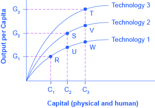

By the end of this section, you will be able to:

* Explain economic convergence
* Analyze various arguments for and against economic convergence
* Evaluate the speed of economic convergence between high-income countries and the rest of the world

Some low-income and middle-income economies around the world have shown a pattern of **convergence**{: data-type="term"}, in which their economies grow faster than those of high-income countries. GDP increased by an average rate of 2.7% per year in the 1990s and 2.3% per year from 2000 to 2008 in the high-income countries of the world, which include the United States, Canada, the countries of the European Union, Japan, Australia, and New Zealand.

[\[link\]](#Table_20_05) lists 10 countries of the world that belong to an informal “fast growth club.” These countries averaged GDP growth (after adjusting for inflation) of at least 5% per year in both the time periods from 1990 to 2000 and from 2000 to 2008. Since economic growth in these countries has exceeded the average of the world’s high-income economies, these countries may converge with the high-income countries. The second part of [\[link\]](#Table_20_05) lists the “slow growth club,” which consists of countries that averaged GDP growth of 2% per year or less (after adjusting for inflation) during the same time periods. The final portion of [\[link\]](#Table_20_05) shows GDP growth rates for the countries of the world divided by income.

<table id="Table_20_05" summary="The table consists of three parts. The first part shows 10 countries of the world that belong to an informal &#x201C;fast growth club:&#x201D; these countries averaged GDP growth (after adjusting for inflation) of at least 5% per year in both the time periods from 1990 to 2000 and from 2000 to 2008. The second part of the table shows 10 countries of the world that belong to an informal &#x201C;slow growth club:&#x201D; these countries averaged GDP growth of 2% per year or less (after adjusting for inflation) during the same time periods. The third part shows a world overview of averaged GDP growth during the same time periods for high, low, and middle income countries. Column 1 lists the Country. Column 2 lists the Average Growth Rate of GDP for 1990 to 2000. Column 3 lists the Average Growth Rate of GDP for 2000 to 2008. Fast Growth Club: Cambodia = 7.1% GDP growth rate 1990 to 2000; 9.1% GDP growth rate 2000 to 2008. China = 10.6% GDP growth rate 1990 to 2000; 9.9% GDP growth rate 2000 to 2008. India = 6.0% GDP growth rate 1990 to 2000; 7.1% GDP growth rate 2000 to 2008. Ireland = 7.5% GDP growth rate 1990 to 2000; 5.1% GDP growth rate 2000 to 2008. Jordan = 5.0% GDP growth rate 1990 to 2000; 6.3% GDP growth rate 2000 to 2008. Laos = 6.5% GDP growth rate 1990 to 2000; 6.8% GDP growth rate 2000 to 2008. Mozambique = 6.4% GDP growth rate 1990 to 2000; 7.3% GDP growth rate 2000 to 2008. Sudan = 5.4% GDP growth rate 1990 to 2000; 7.3% GDP growth rate 2000 to 2008. Uganda = 7.1% GDP growth rate 1990 to 2000; 7.3% GDP growth rate 2000 to 2008. Vietnam = 7.9% GDP growth rate 1990 to 2000; 7.3% GDP growth rate 2000 to 2008. Slow Growth Club: Central African Republic = 2.0% GDP growth rate 1990 to 2000; 0.8% GDP growth rate 2000 to 2008. France = 2.0% GDP growth rate 1990 to 2000; 1.8% GDP growth rate 2000 to 2008. Germany = 1.8% GDP growth rate 1990 to 2000; 1.3% GDP growth rate 2000 to 2008. Guinea-Bissau = 1.2% GDP growth rate 1990 to 2000; 0.2% GDP growth rate 2000 to 2008. Haiti = &#x2013;1.5% GDP growth rate 1990 to 2000; 0.3% GDP growth rate 2000 to 2008. Italy = 1.6% GDP growth rate 1990 to 2000; 1.2% GDP growth rate 2000 to 2008. Jamaica = 0.9% GDP growth rate 1990 to 2000; 1.4% GDP growth rate 2000 to 2008. Japan = 1.3% GDP growth rate 1990 to 2000; 1.3% GDP growth rate 2000 to 2008. Switzerland = 1.0% GDP growth rate 1990 to 2000; 2.0% GDP growth rate 2000 to 2008. United States = 3.2% GDP growth rate 1990 to 2000; 2.2% GDP growth rate 2000 to 2008. World Overview: High Income = 2.7% GDP growth rate 1990 to 2000; 2.3% GDP growth rate 2000 to 2008. Low Income = 3.8% GDP growth rate 1990 to 2000; 5.6% GDP growth rate 2000 to 2008. Middle Income = 4.7% GDP growth rate 1990 to 2000; 6.1% GDP growth rate 2000 to 2008."><caption>Economic Growth around the World(Source: http://databank.worldbank.org/data/views/variableSelection/selectvariables.aspx?source=world-development-indicators#c\_u)</caption><thead>
<tr>
<th>Country</th>
<th>Average Growth Rate of GDP 1990–2000</th>
<th>Average Growth Rate of GDP 2000–2008</th>
</tr>
</thead><tbody>
<tr>
<td colspan="3" data-align="left"><em>Fast Growth Club (5% or more per year in both time periods)</em></td>

</tr>

<tr>
<td>Cambodia</td>
<td>7.1%</td>
<td>9.1%</td>
</tr>

<tr>
<td>China</td>
<td>10.6%</td>
<td>9.9%</td>
</tr>

<tr>
<td>India</td>
<td>6.0%</td>
<td>7.1%</td>
</tr>

<tr>
<td>Ireland</td>
<td>7.5%</td>
<td>5.1%</td>
</tr>

<tr>
<td>Jordan</td>
<td>5.0%</td>
<td>6.3%</td>
</tr>

<tr>
<td>Laos</td>
<td>6.5%</td>
<td>6.8 %</td>
</tr>

<tr>
<td>Mozambique</td>
<td>6.4%</td>
<td>7.3%</td>
</tr>

<tr>
<td>Sudan</td>
<td>5.4%</td>
<td>7.3%</td>
</tr>

<tr>
<td>Uganda</td>
<td>7.1%</td>
<td>7.3%</td>
</tr>

<tr>
<td>Vietnam</td>
<td>7.9%</td>
<td>7.3%</td>
</tr>

<tr>
<td colspan="3" data-align="left"><em>Slow Growth Club (2% or less per year in both time periods)</em></td>

</tr>

<tr>
<td>Central African Republic</td>
<td>2.0%</td>
<td>0.8%</td>
</tr>

<tr>
<td>France</td>
<td>2.0%</td>
<td>1.8%</td>
</tr>

<tr>
<td>Germany</td>
<td>1.8%</td>
<td>1.3%</td>
</tr>

<tr>
<td>Guinea-Bissau</td>
<td>1.2%</td>
<td>0.2%</td>
</tr>

<tr>
<td>Haiti</td>
<td>–1.5%</td>
<td>0.3%</td>
</tr>

<tr>
<td>Italy</td>
<td>1.6%</td>
<td>1.2%</td>
</tr>

<tr>
<td>Jamaica</td>
<td>0.9%</td>
<td>1.4%</td>
</tr>

<tr>
<td>Japan</td>
<td>1.3%</td>
<td>1.3%</td>
</tr>

<tr>
<td>Switzerland</td>
<td>1.0%</td>
<td>2.0%</td>
</tr>

<tr>
<td>United States</td>
<td>3.2%</td>
<td>2.2%</td>
</tr>

<tr>
<td colspan="3" data-align="left"><em>World Overview</em></td>

</tr>

<tr>
<td>High income</td>
<td>2.7%</td>
<td>2.3%</td>
</tr>

<tr>
<td>Low income</td>
<td>3.8%</td>
<td>5.6%</td>
</tr>

<tr>
<td>Middle income</td>
<td>4.7%</td>
<td>6.1%</td>
</tr>

      </tbody></table>

Each of the countries in [\[link\]](#Table_20_05) has its own unique story of investments in human and physical capital, technological gains, market forces, government policies, and even lucky events, but an overall pattern of convergence is clear. The low-income countries have GDP growth that is faster than that of the middle-income countries, which in turn have GDP growth that is faster than that of the high-income countries. Two prominent members of the fast-growth club are China and India, which between them have nearly 40% of the world’s population. Some prominent members of the slow-growth club are high-income countries like the United States, France, Germany, Italy, and Japan.

Will this pattern of economic convergence persist into the future? This is a controversial question among economists that we will consider by looking at some of the main arguments on both sides.

### Arguments Favoring Convergence

Several arguments suggest that low-income countries might have an advantage in achieving greater worker productivity and economic growth in the future.

A first argument is based on diminishing marginal returns. Even though deepening human and physical capital will tend to increase GDP per capita, the **law of diminishing returns**{: data-type="term" .no-emphasis} suggests that as an economy continues to increase its human and physical capital, the marginal gains to economic growth will diminish. For example, raising the average education level of the population by two years from a tenth-grade level to a high school diploma (while holding all other inputs constant) would produce a certain increase in output. An additional two-year increase, so that the average person had a two-year college degree, would increase output further, but the marginal gain would be smaller. Yet another additional two-year increase in the level of education, so that the average person would have a four-year-college bachelor’s degree, would increase output still further, but the marginal increase would again be smaller. A similar lesson holds for physical capital. If the quantity of physical capital available to the average worker increases, by, say, $5,000 to $10,000 (again, while holding all other inputs constant), it will increase the level of output. An additional increase from $10,000 to $15,000 will increase output further, but the marginal increase will be smaller.

Low-income countries like China and India tend to have lower levels of human capital and physical capital, so an investment in capital deepening should have a larger marginal effect in these countries than in high-income countries, where levels of human and physical capital are already relatively high. Diminishing returns implies that low-income economies could converge to the levels achieved by the high-income countries.

A second argument is that low-income countries may find it easier to improve their technologies than high-income countries. High-income countries must continually invent new technologies, whereas low-income countries can often find ways of applying technology that has already been invented and is well understood. The economist **Alexander Gerschenkron**{: data-type="term" .no-emphasis} (1904–1978) gave this phenomenon a memorable name: “the advantages of backwardness.” Of course, he did not literally mean that it is an advantage to have a lower standard of living. He was pointing out that a country that is behind has some extra potential for catching up.

Finally, optimists argue that many countries have observed the experience of those that have grown more quickly and have learned from it. Moreover, once the people of a country begin to enjoy the benefits of a higher standard of living, they may be more likely to build and support the market-friendly institutions that will help provide this standard of living.

View this [video][1] to learn about economic growth across the world.

### Arguments That Convergence Is neither Inevitable nor Likely

If the growth of an economy depended only on the deepening of human capital and physical capital, then the growth rate of that economy would be expected to slow down over the long run because of diminishing marginal returns. However, there is another crucial factor in the aggregate production function: technology.

The development of new technology can provide a way for an economy to sidestep the diminishing marginal returns of capital deepening. [\[link\]](#CNX_Econ_C20_006) shows how. The horizontal axis of the figure measures the amount of capital deepening, which on this figure is an overall measure that includes deepening of both physical and human capital. The amount of human and physical capital per worker increases as you move from left to right, from C1 to C2 to C3. The vertical axis of the diagram measures per capita output. Start by considering the lowest line in this diagram, labeled Technology 1. Along this aggregate production function, the level of technology is being held constant, so the line shows only the relationship between capital deepening and output. As capital deepens from C1 to C2 to C3 and the economy moves from R to U to W, per capita output does increase—but the way in which the line starts out steeper on the left but then flattens as it moves to the right shows the diminishing marginal returns, as additional marginal amounts of capital deepening increase output by ever-smaller amounts. The shape of the aggregate production line (Technology 1) shows that the ability of capital deepening, by itself, to generate sustained economic growth is limited, since diminishing returns will eventually set in.

 {: #CNX_Econ_C20_006 data-title="Capital Deepening and New Technology "}

Now, bring improvements in technology into the picture. Improved technology means that with a given set of inputs, more output is possible. The production function labeled Technology 1 in the figure is based on one level of technology, but Technology 2 is based on an improved level of technology, so for every level of capital deepening on the horizontal axis, it produces a higher level of output on the vertical axis. In turn, production function Technology 3 represents a still higher level of technology, so that for every level of inputs on the horizontal axis, it produces a higher level of output on the vertical axis than either of the other two aggregate production functions.

Most healthy, growing economies are deepening their human and physical capital and increasing technology at the same time. As a result, the economy can move from a choice like point R on the Technology 1 aggregate production line to a point like S on Technology 2 and a point like T on the still higher aggregate production line (Technology 3). With the combination of technology and capital deepening, the rise in GDP per capita in high-income countries does not need to fade away because of diminishing returns. The gains from technology can offset the diminishing returns involved with capital deepening.

Will technological improvements themselves run into diminishing returns over time? That is, will it become continually harder and more costly to discover new technological improvements? Perhaps someday, but, at least over the last two centuries since the Industrial Revolution, improvements in technology have not run into diminishing marginal returns. Modern inventions, like the Internet or discoveries in genetics or materials science, do not seem to provide smaller gains to output than earlier inventions like the steam engine or the railroad. One reason that technological ideas do not seem to run into diminishing returns is that the ideas of new technology can often be widely applied at a marginal cost that is very low or even zero. A specific additional machine, or an additional year of education, must be used by a specific worker or group of workers. A new technology or invention can be used by many workers across the economy at very low marginal cost.

The argument that it is easier for a low-income country to copy and adapt existing technology than it is for a high-income country to invent new technology is not necessarily true, either. When it comes to adapting and using new technology, a society’s performance is not necessarily guaranteed, but is the result of whether the economic, educational, and public policy institutions of the country are supportive. In theory, perhaps, low-income countries have many opportunities to copy and adapt technology, but if they lack the appropriate supportive economic infrastructure and institutions, the theoretical possibility that backwardness might have certain advantages is of little practical relevance.

Visit this [website][2] to read more about economic growth in India.

### The Slowness of Convergence

Although economic convergence between the high-income countries and the rest of the world seems possible and even likely, it will proceed slowly. Consider, for example, a country that starts off with a GDP per capita of $40,000, which would roughly represent a typical high-income country today, and another country that starts out at $4,000, which is roughly the level in low-income but not impoverished countries like Indonesia, Guatemala, or Egypt. Say that the rich country chugs along at a 2% annual growth rate of GDP per capita, while the poorer country grows at the aggressive rate of 7% per year. After 30 years, GDP per capita in the rich country will be $72,450 (that is, $40,000 (1 + 0.02)30) while in the poor country it will be $30,450 (that is, $4,000 (1 + 0.07)30). Convergence has occurred; the rich country used to be 10 times as wealthy as the poor one, and now it is only about 2.4 times as wealthy. Even after 30 consecutive years of very rapid growth, however, people in the low-income country are still likely to feel quite poor compared to people in the rich country. Moreover, as the poor country catches up, its opportunities for catch-up growth are reduced, and its growth rate may slow down somewhat.

The slowness of convergence illustrates again that small differences in annual rates of economic growth become huge differences over time. The high-income countries have been building up their advantage in standard of living over decades—more than a century in some cases. Even in an optimistic scenario, it will take decades for the low-income countries of the world to catch up significantly.

Calories and Economic Growth

The story of modern economic growth can be told by looking at calorie consumption over time. The dramatic rise in incomes allowed the average person to eat better and consume more calories. How did these incomes increase? The neoclassical growth consensus uses the **aggregate production function**{: data-type="term" .no-emphasis} to suggest that the period of modern economic growth came about because of increases in inputs such as technology and physical and human capital. Also important was the way in which technological progress combined with physical and human capital deepening to create growth and convergence. The issue of distribution of income notwithstanding, it is clear that the average worker can afford more calories in 2014 than in 1875.

Aside from increases in income, there is another reason why the average person can afford more food. Modern agriculture has allowed many countries to produce more food than they need. Despite having more than enough food, however, many governments and multilateral agencies have not solved the food distribution problem. In fact, food shortages, famine, or general food insecurity are caused more often by the failure of government macroeconomic policy, according to the Nobel Prize-winning economist Amartya Sen. Sen has conducted extensive research into issues of inequality, poverty, and the role of government in improving standards of living. Macroeconomic policies that strive toward stable inflation, full employment, education of women, and preservation of property rights are more likely to eliminate starvation and provide for a more even distribution of food.

Because we have more food per capita, global food prices have decreased since 1875. The prices of some foods, however, have decreased more than the prices of others. For example, researchers from the University of Washington have shown that in the United States, calories from zucchini and lettuce are 100 times more expensive than calories from oil, butter, and sugar. Research from countries like India, China, and the United States suggests that as incomes rise, individuals want more calories from fats and protein and fewer from carbohydrates. This has very interesting implications for global food production, obesity, and environmental consequences. Affluent urban India has an obesity problem much like many parts of the United States. The forces of convergence are at work.

### Key Concepts and Summary

When countries with lower levels of GDP per capita catch up to countries with higher levels of GDP per capita, the process is called convergence. Convergence can occur even when both high- and low-income countries increase investment in physical and human capital with the objective of growing GDP. This is because the impact of new investment in physical and human capital on a low-income country may result in huge gains as new skills or equipment are combined with the labor force. In higher-income countries, however, a level of investment equal to that of the low income country is not likely to have as big an impact, because the more developed country most likely has high levels of capital investment. Therefore, the marginal gain from this additional investment tends to be successively less and less. Higher income countries are more likely to have diminishing returns to their investments and must continually invent new technologies; this allows lower-income economies to have a chance for convergent growth. However, many high-income economies have developed economic and political institutions that provide a healthy economic climate for an ongoing stream of technological innovations. Continuous technological innovation can counterbalance diminishing returns to investments in human and physical capital.

### Self-Check Questions

Use an example to explain why, after periods of rapid growth, a low-income country that has not caught up to a high-income country may feel poor.

A good way to think about this is how a runner who has fallen behind in a race feels psychologically and physically as he catches up. Playing catch-up can be more taxing than maintaining one’s position at the head of the pack.

Would the following events usually lead to capital deepening? Why or why not?

A weak economy in which businesses become reluctant to make long-term investments in physical capital.

A rise in international trade.

A trend in which many more adults participate in continuing education courses through their employers and at colleges and universities.

No. Capital deepening refers to an increase in the amount of capital per person in an economy. A decrease in investment by firms will actually cause the opposite of capital deepening (since the population will grow over time).

There is no direct connection between and increase in international trade and capital deepening. One could imagine particular scenarios where trade could lead to capital deepening (for example, if international capital inflows which are the counterpart to increasing the trade deficit) lead to an increase in physical capital investment), but in general, no.

Yes. Capital deepening refers to an increase in either physical capital or human capital per person. Continuing education or any time of lifelong learning adds to human capital and thus creates capital deepening.

What are the “advantages of backwardness” for economic growth?

The advantages of backwardness include faster growth rates because of the process of convergence, as well as the ability to adopt new technologies that were developed first in the “leader” countries. While being “backward” is not inherently a good thing, Gerschenkron stressed that there are certain advantages which aid countries trying to “catch up.”

Would you expect capital deepening to result in diminished returns? Why or why not? Would you expect improvements in technology to result in diminished returns? Why or why not?

Capital deepening, by definition, should lead to diminished returns because you're investing more and more but using the same methods of production, leading to the marginal productivity declining. This is shown on a production function as a movement along the curve. Improvements in technology should not lead to diminished returns because you are finding new and more efficient ways of using the same amount of capital. This can be illustrated as a shift upward of the production function curve.

Why does productivity growth in high-income economies not slow down as it runs into diminishing returns from additional investments in physical capital and human capital? Does this show one area where the theory of diminishing returns fails to apply? Why or why not?

Productivity growth from new advances in technology will not slow because the new methods of production will be adopted relatively quickly and easily, at very low marginal cost. Also, countries that are seeing technology growth usually have a vast and powerful set of institutions for training workers and building better machines, which allows the maximum amount of people to benefit from the new technology. These factors have the added effect of making additional technological advances even easier for these countries.

### Review Questions

For a high-income economy like the United States, what elements of the aggregate production function are most important in bringing about growth in GDP per capita? What about a middle-income country such as Brazil? A low-income country such as Niger?

List some arguments for and against the likelihood of convergence.

### Critical Thinking Questions

What sorts of policies can governments implement to encourage convergence?

As technological change makes us more sedentary and food costs increase, obesity is likely. What factors do you think may limit obesity?

### References

Central Intelligence Agency. “The World Factbook: Country Comparison: GDP–Real Growth Rate.” https://www.cia.gov/library/publications/the-world-factbook/rankorder/2003rank.html.

Sen, Amartya. “Hunger in the Contemporary World (Discussion Paper DEDPS/8).” *The Suntory Centre: London School of Economics and Political Science*. Last modified November 1997. http://sticerd.lse.ac.uk/dps/de/dedps8.pdf.

### Glossary
{: data-type="glossary-title"}

convergence
: pattern in which economies with low per capita incomes grow faster than economies with high per capita incomes

[1]: http://openstaxcollege.org/l/tedhansrosling
[2]: http://openstaxcollege.org/l/Indiapoverty
