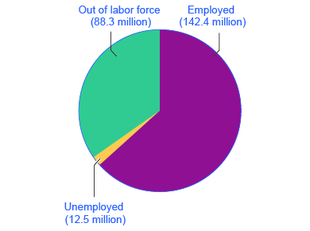

By the end of this section, you will be able to:

* Calculate the labor force percentage and the unemployment rate
* Explain hidden unemployment and what it means to be in or out of the labor force
* Evaluate the collection and interpretation of unemployment data

Unemployment is typically described in newspaper or television reports as a percentage or a rate. A recent report might have said, for example, *from August 2009 to November 2009, the U.S. unemployment rate rose from 9.7% to 10.0%, but by June 2010, it had fallen to 9.5%*. At a glance, the changes between the percentages may seem small. But remember that the U.S. economy has about 155 million adults who either have jobs or are looking for them. A rise or fall of just 0.1% in the unemployment rate of 155 million potential workers translates into 155,000 people, which is roughly the total population of a city like Syracuse, New York, Brownsville, Texas, or Pasadena, California. Large rises in the unemployment rate mean large numbers of job losses. The increase from 5% in April 2008 to 10% by November 2009 meant an additional 7.75 million people were looking for jobs but could not find them.

The [Bureau of Labor Statistics][1] tracks and reports all data related to unemployment.

  

# Who’s In or Out of the Labor Force?

Should everyone without a job be counted as unemployed? Of course not. Children, for example, should not be counted as unemployed. Surely, the retired should not be counted as unemployed. Many full-time college students have only a part-time job, or no job at all, but it seems inappropriate to count them as suffering the pains of unemployment. Some people are not working because they are rearing children, ill, on vacation, or on parental leave.

The point is that the adult population is not just divided into employed and unemployed. A third group exists: people who do not have a job, and for some reason—retirement, looking after children, taking a voluntary break before a new job—are not interested in having a job, either. It also includes those who do want a job but have quit looking, often due to being discouraged by their inability to find suitable employment. Economists refer to this third group of those who are not working and not looking for work as **out of the labor force**{: data-type="term"} or not in the labor force.

The U.S. unemployment rate, which is based on a monthly survey carried out by the U.S. Bureau of the Census, asks a series of questions to divide up the adult population into employed, unemployed, or not in the labor force. To be classified as unemployed, a person must be without a job, currently available to work, and actively looking for work in the previous four weeks. Thus, a person who does not have a job but who is not currently available to work or has not actively looked for work in the last four weeks is counted as out of the labor force.

NOT\_CONVERTED\_YET: emphasis

<emphasis xmlns="http://cnx.rice.edu/cnxml" data-effect="strong">Employed</emphasis>

\: currently working for pay

NOT\_CONVERTED\_YET: emphasis

<emphasis xmlns="http://cnx.rice.edu/cnxml" data-effect="strong">Unemployed</emphasis>

\: Out of work and actively looking for a job

NOT\_CONVERTED\_YET: emphasis

<emphasis xmlns="http://cnx.rice.edu/cnxml" data-effect="strong">Out of the labor force</emphasis>

\: Out of paid work and not actively looking for a job

NOT\_CONVERTED\_YET: emphasis

<emphasis xmlns="http://cnx.rice.edu/cnxml" data-effect="strong">Labor force</emphasis>

\: the number of employed plus the unemployed

# Calculating the Unemployment Rate

[\[link\]](#CNX_Econ_C21_001) shows the three-way division of the over-16 adult population. In 2012, 63.7% of the adult population was “in the labor force;” that is, either employed or without a job but looking for work. Those in the labor force can be divided into the employed and the unemployed. These values are also shown in [\[link\]](#Table_21_01). The **unemployment rate**{: data-type="term"} is not the percentage of the total adult population without jobs, but rather the percentage of adults who are in the labor force but who do not have jobs:

<math xmlns="http://www.w3.org/1998/Math/MathML"><mtable columnspacing="2px" columnalign="right center left"><mtr><mtd><mtext>Unemployment rate</mtext></mtd><mtd><mo>=</mo></mtd><mtd><mfrac><mtext>Unemployed people</mtext><mtext>Total labor force</mtext></mfrac></mtd></mtr></mtable><mo> × </mo><mn>100</mn></math>

{: #CNX_Econ_C21_001 data-title="Employed, Unemployed, and Out of the Labor Force Distribution of Adult Population (age 16 and older), 2012 "}

<table id="Table_21_01" summary="The total U.S. adult population over the age of 16 is 243.2 million. The number of people in the labor force is 154.9 million (63.7%). The number of people unemployed is 142.4 million. The number of people unemployed is 12.5 million. The number of people out of the labor force is 88.3 million (36.3%)."><caption>U.S. Employment and Unemployment, 2012(Source: www.bls.gov)</caption><tbody>
        <tr>
          <td>Total adult population over the age of 16</td>
          <td>243.2 million </td>
        </tr>
        <tr>
          <td> In the labor force </td>
          <td>154.9 million (63.7%)</td>
        </tr>
        <tr>
          <td> Employed </td>
          <td>142.4 million </td>
        </tr>
        <tr>
          <td> Unemployed </td>
          <td>12.5 million </td>
        </tr>
        <tr>
          <td> Out of the labor force </td>
          <td>88.3 million (36.3%)</td>
        </tr>
      </tbody></table>

In this example, the unemployment rate can be calculated as 12.5 million unemployed people divided by 155.0 million people in the labor force, which works out to an 8.1% rate of unemployment. The following Work It Out feature will walk you through the steps of this calculation.

Calculating Labor Force Percentages

So how do economists arrive at the percentages in and out of the labor force and the unemployment rate? We will use the values in [\[link\]](#Table_21_01) to illustrate the steps.

To determine the percentage in the labor force:

Step 1. Divide the number of people in the labor force (154.9 million) by the total adult (working-age) population (243.2 million).

Step 2. Multiply by 100 to obtain the percentage.

<math xmlns="http://www.w3.org/1998/Math/MathML"><mtable columnspacing="2px" columnalign="right center left"><mtr><mtd><mtext>Percentage in the labor force</mtext></mtd><mtd><mo>=</mo></mtd><mtd><mfrac><mrow><mn>154</mn><mo>.</mo><mn>9</mn></mrow><mrow><mn>243</mn><mo>.</mo><mn>2</mn></mrow></mfrac></mtd></mtr><mtr><mtd /><mtd><mo>=</mo></mtd><mtd><mn>0</mn><mo>.</mo><mn>6369</mn></mtd></mtr><mtr><mtd /><mtd><mo>=</mo></mtd><mtd><mn>63</mn><mo>.</mo><mn>7%</mn></mtd></mtr></mtable></math>

To determine the percentage out of the labor force:

Step 1. Divide the number of people out the labor force (88.3 million) by the total adult (working-age) population (243.2 million).

Step 2. Multiply by 100 to obtain the percentage.

<math xmlns="http://www.w3.org/1998/Math/MathML"><mtable columnspacing="2px" columnalign="right center left"><mtr><mtd><mtext>Percentage in the labor force</mtext></mtd><mtd><mo>=</mo></mtd><mtd><mfrac><mrow><mn>88</mn><mo>.</mo><mn>3</mn></mrow><mrow><mn>243</mn><mo>.</mo><mn>2</mn></mrow></mfrac></mtd></mtr><mtr><mtd /><mtd><mo>=</mo></mtd><mtd><mn>0</mn><mo>.</mo><mn>3631</mn></mtd></mtr><mtr><mtd /><mtd><mo>=</mo></mtd><mtd><mn>36</mn><mo>.</mo><mn>3%</mn></mtd></mtr></mtable></math>

To determine the unemployment rate:

Step 1. Divide the number of unemployed people (12.5 million) by the total labor force (154.9 million).

Step 2. Multiply by 100 to obtain the rate.

<math xmlns="http://www.w3.org/1998/Math/MathML"><mtable columnspacing="2px" columnalign="right center left"><mtr><mtd><mtext>Unemployment rate</mtext></mtd><mtd><mo>=</mo></mtd><mtd><mfrac><mrow><mn>12</mn><mo>.</mo><mn>5</mn></mrow><mrow><mn>154</mn><mo>.</mo><mn>9</mn></mrow></mfrac></mtd></mtr><mtr><mtd /><mtd><mo>=</mo></mtd><mtd><mn>0</mn><mo>.</mo><mn>0807</mn></mtd></mtr><mtr><mtd /><mtd><mo>=</mo></mtd><mtd><mn>8</mn><mo>.</mo><mn>1%</mn></mtd></mtr></mtable></math>

# Hidden Unemployment

Even with the “out of the labor force” category, there are still some people that are mislabeled in the categorization of employed, unemployed, or out of the labor force. There are some people who have only part time or temporary jobs and who are looking for full time and permanent employment that are counted as employed, though they are not employed in the way they would like or need to be. Additionally, there are individuals who are **underemployed**{: data-type="term"}. This includes those that are trained or skilled for one type or level of work who are working in a lower paying job or one that does not utilize their skills. For example, an individual with a college degree in finance who is working as a sales clerk would be considered underemployed. They are, however, also counted in the employed group. All of these individuals fall under the umbrella of the term “**hidden unemployment**{: data-type="term" .no-emphasis}.” **Discouraged workers**{: data-type="term"}, those who have stopped looking for employment and, hence, are no longer counted in the unemployed also fall into this group

# Labor Force Participation Rate

Another important statistic is the **labor force participation rate**{: data-type="term"}. This is the percentage of adults in an economy who are either employed or who are unemployed and looking for a job. So, using the data in [\[link\]](#CNX_Econ_C21_001) and [\[link\]](#Table_21_01), those included in this calculation would be the 154.9 million individuals in the labor force. The rate is calculated by taking the number of people in the labor force, that is, the number employed and the number unemployed, divided by the total adult population and multiplying by 100 to get the percentage. For the data from 2012, the labor force participation rate is 63.7%. In the United States the labor force participation rate is usually around 67-68%.

# The Establishment Payroll Survey

When the unemployment report comes out each month, the Bureau of Labor Statistics (BLS) also reports on the number of jobs created—which comes from the establishment payroll survey. The payroll survey is based on a survey of about 140,000 businesses and government agencies throughout the United States. It generates payroll employment estimates by the following criteria: all employees, average weekly hours worked, and average hourly, weekly, and overtime earnings. One of the criticisms of this survey is that it does not count the self-employed. It also does not make a distinction between new, minimum wage, part time or temporary jobs and full time jobs with “decent” pay.

# How Is the U.S. Unemployment Data Collected?

The unemployment rate announced by the U.S. Bureau of Labor Statistics each month is based on the Current Population Survey (CPS), which has been carried out every month since 1940. Great care is taken to make this survey representative of the country as a whole. The country is first divided into 3,137 areas. The U.S. Bureau of the Census then selects 729 of these areas to survey. The 729 areas are then divided into districts of about 300 households each, and each district is divided into clusters of about four dwelling units. Every month, Census Bureau employees call about 15,000 of the four-household clusters, for a total of 60,000 households. Households are interviewed for four consecutive months, then rotated out of the survey for eight months, and then interviewed again for the same four months the following year, before leaving the sample permanently.

Based on this survey, unemployment rates are calculated by state, industry, urban and rural areas, gender, age, race or ethnicity, and level of education. A wide variety of other information is available, too. For example, how long have people been unemployed? Did they become unemployed because they quit, or were laid off, or their employer went out of business? Is the unemployed person the only wage earner in the family? The Current Population Survey is a treasure trove of information about employment and unemployment. If you are wondering what the difference is between the CPS and EPS, read the following Clear it Up feature.

What is the difference between CPS and EPS?

The Current Population Survey (CPS) conducted by the United States Census Bureau measures the percentage of the labor force that is unemployed. The establishment payroll survey (EPS) by the Bureau of Labor Statistics is a payroll survey that measures the net change in jobs created for the month.

# Criticisms of Measuring Unemployment

There are always complications in measuring the number of unemployed. For example, what about people who do not have jobs and would be available to work, but have gotten discouraged at the lack of available jobs in their area and stopped looking? Such people, and their families, may be suffering the pains of unemployment. But the survey counts them as out of the labor force because they are not actively looking for work. Other people may tell the Census Bureau that they are ready to work and looking for a job but, truly, they are not that eager to work and are not looking very hard at all. They are counted as unemployed, although they might more accurately be classified as out of the labor force. Still other people may have a job, perhaps doing something like yard work, child care, or cleaning houses, but are not reporting the income earned to the tax authorities. They may report being unemployed, when they actually are working.

Although the unemployment rate gets most of the public and media attention, economic researchers at the Bureau of Labor Statistics publish a wide array of surveys and reports that try to measure these kinds of issues and to develop a more nuanced and complete view of the labor market. It is not exactly a hot news flash that economic statistics are imperfect. Even imperfect measures like the unemployment rate, however, can still be quite informative, when interpreted knowledgeably and sensibly.

Click [here][2] to learn more about the CPS to read frequently asked questions about employment and labor.

  

# Key Concepts and Summary

Unemployment imposes high costs. Unemployed individuals suffer from loss of income and from stress. An economy with high unemployment suffers an opportunity cost of unused resources. The adult population can be divided into those in the labor force and those out of the labor force. In turn, those in the labor force are divided into employed and unemployed. A person without a job must be willing and able to work and actively looking for work to be counted as unemployed; otherwise, a person without a job is counted as being out of the labor force. The unemployment rate is defined as the number of unemployed persons divided by the number of persons in the labor force (not the overall adult population). The Current Population Survey (CPS) conducted by the United States Census Bureau measures the percentage of the labor force that is unemployed. The establishment payroll survey by the Bureau of Labor Statistics measures the net change in jobs created for the month.

# Self-Check Questions

Suppose the adult population over the age of 16 is 237.8 million and the labor force is 153.9 million (of whom 139.1 million are employed). How many people are “not in the labor force?” What are the proportions of employed, unemployed and not in the labor force in the population? *Hint*: Proportions are percentages.

The population is divided into those “in the labor force” and those “not in the labor force.” Thus, the number of adults not in the labor force is 237.8 – 153.9 = 83.9 million. Since the labor force is divided into employed persons and unemployed persons, the number of unemployed persons is 153.9 – 139.1 = 14.8 million. Thus, the adult population has the following proportions: 139.1/237.8 = 58.5% employed persons 14.8/237.8 = 6.2% unemployed persons 83.9/237.8 = 35.3% persons out of the labor force  

Using the above data, what is the unemployment rate? These data are U.S. statistics from 2010. How does it compare to the 2012 unemployment rate computed earlier?

The unemployment rate is defined as the number of unemployed persons as a percentage of the labor force or 14.8/153.9 = 9.6%. This is higher than the 2012 unemployment rate, computed earlier, of 8.1%.

# Review Questions

What is the difference between being unemployed and being out of the labor force?

How is the unemployment rate calculated? How is the labor force participation rate calculated?

Are all adults who do not hold jobs counted as unemployed?

If you are out of school but working part time, are you considered employed or unemployed in U.S. labor statistics? If you are a full time student and working 12 hours a week at the college cafeteria are you considered employed or not in the labor force? If you are a senior citizen who is collecting social security and a pension and working as a greeter at Wal-Mart are you considered employed or not in the labor force?

What happens to the unemployment rate when unemployed workers are reclassified as discouraged workers?

What happens to the labor force participation rate when employed individuals are reclassified as unemployed? What happens when they are reclassified as discouraged workers?

What are some of the problems with using the unemployment rate as an accurate measure of overall joblessness?

What criteria are used by the BLS to count someone as employed? As unemployed?

Assess whether the following would be counted as “unemployed” in the Current Employment Statistics survey. A husband willingly stays home with children while his wife works. A manufacturing worker whose factory just closed down. A college student doing an unpaid summer internship. A retiree. Someone who has been out of work for two years but keeps looking for a job. Someone who has been out of work for two months but isn’t looking for a job. Someone who hates her present job and is actively looking for another one. Someone who decides to take a part time job because she could not find a full time position. 

# Critical Thinking Questions

Using the definition of the unemployment rate, is an increase in the unemployment rate necessarily a bad thing for a nation?

Is a decrease in the unemployment rate necessarily a good thing for a nation? Explain.

If many workers become discouraged from looking for jobs, explain how the number of jobs could decline but the unemployment rate could fall at the same time.

Would you expect hidden unemployment to be higher, lower, or about the same when the unemployment rate is high, say 10%, versus low, say 4%? Explain.

# Problems

A country with a population of eight million adults has five million employed, 500,000 unemployed, and the rest of the adult population is out of the labor force. What’s the unemployment rate? What share of population is in the labor force? Sketch a pie chart that divides the adult population into these three groups.

[1]: http://openstaxcollege.org/l/BLS1
[2]: http://openstaxcollege.org/l/BLS_CPS
