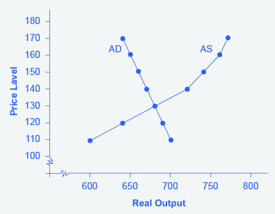

By the end of this section, you will be able to:
* Explain the aggregate supply curve and how it relates to real GDP and potential GDP
* Explain the aggregate demand curve and it is influenced by price levels
* Interpret the aggregate demand/aggregate supply model
* Identify the point of equilibrium in the aggregate demand/aggregate supply model
* Define short run aggregate supply and long run aggregate supply

To build a useful macroeconomic model, we need a model that shows what determines total supply or total demand for the economy, and how total demand and total supply interact at the macroeconomic level. This model is called the **aggregate demand/aggregate supply model**{: data-type="term"}. This module will explain aggregate supply, aggregate demand, and the equilibrium between them. The following modules will discuss the causes of shifts in aggregate supply and aggregate demand.

# The Aggregate Supply Curve and Potential GDP   {#ch24mod02_01}

Firms make decisions about what quantity to supply based on the profits they expect to earn. Profits, in turn, are also determined by the price of the outputs the firm sells and by the price of the inputs, like labor or raw materials, the firm needs to buy. **Aggregate supply (AS)**{: data-type="term"} refers to the total quantity of output (i.e. real GDP) firms will produce and sell. The **aggregate supply (AS) curve**{: data-type="term"} shows the total quantity of output (i.e. real GDP) that firms will produce and sell at each price level.

[\[link\]](#CNX_Econ_C24_001) shows an aggregate supply curve. In the following paragraphs, we will walk through the elements of the diagram one at a time: the horizontal and vertical axes, the aggregate supply curve itself, and the meaning of the potential GDP vertical line.

  slopes up, because as the price level for outputs rises, with the price of inputs remaining fixed, firms have an incentive to produce more and to earn higher profits. The potential GDP line shows the maximum that the economy can produce with full employment of workers and physical capital."){: #CNX_Econ_C24_001 data-title="The Aggregate Supply Curve"}

The horizontal axis of the diagram shows real GDP—that is, the level of GDP adjusted for inflation. The vertical axis shows the price level. Remember that the price level is different from the inflation rate. Visualize the price level as an index number, like the GDP deflator, while the inflation rate is the percentage change between price levels over time.

As the price level (the average price of all goods and services produced in the economy) rises, the aggregate quantity of goods and services supplied rises as well. Why? The price level shown on the vertical axis represents prices for final goods or outputs bought in the economy—like the GDP deflator—not the price level for intermediate goods and services that are inputs to production. Thus, the AS curve describes how suppliers will react to a higher price level for final outputs of goods and services, while holding the prices of inputs like labor and energy constant. If firms across the economy face a situation where the price level of what they produce and sell is rising, but their costs of production are not rising, then the lure of higher profits will induce them to expand production.

The slope of an AS curve changes from nearly flat at its far left to nearly vertical at its far right. At the far left of the aggregate supply curve, the level of output in the economy is far below **potential GDP**{: data-type="term"}, which is defined as the quantity that an economy can produce by fully employing its existing levels of labor, physical capital, and technology, in the context of its existing market and legal institutions. At these relatively low levels of output, levels of unemployment are high, and many factories are running only part-time, or have closed their doors. In this situation, a relatively small increase in the prices of the outputs that businesses sell—while making the assumption of no rise in input prices—can encourage a considerable surge in the quantity of aggregate supply because so many workers and factories are ready to swing into production.

As the quantity produced increases, however, certain firms and industries will start running into limits: perhaps nearly all of the expert workers in a certain industry will have jobs or factories in certain geographic areas or industries will be running at full speed. In the intermediate area of the AS curve, a higher price level for outputs continues to encourage a greater quantity of output—but as the increasingly steep upward slope of the aggregate supply curve shows, the increase in quantity in response to a given rise in the price level will not be quite as large. (Read the following Clear It Up feature to learn why the AS curve crosses potential GDP.)

Why does AS cross potential GDP?

The aggregate supply curve is typically drawn to cross the potential GDP line. This shape may seem puzzling: How can an economy produce at an output level which is higher than its “potential” or “full employment” GDP? The economic intuition here is that if prices for outputs were high enough, producers would make fanatical efforts to produce: all workers would be on double-overtime, all machines would run 24 hours a day, seven days a week. Such hyper-intense production would go beyond using potential labor and physical capital resources fully, to using them in a way that is not sustainable in the long term. Thus, it is indeed possible for production to sprint above potential GDP, but only in the short run.

At the far right, the aggregate supply curve becomes nearly vertical. At this quantity, higher prices for outputs cannot encourage additional output, because even if firms want to expand output, the inputs of labor and machinery in the economy are fully employed. In this example, the vertical line in the exhibit shows that potential GDP occurs at a total output of 9,500. When an economy is operating at its potential GDP, machines and factories are running at capacity, and the unemployment rate is relatively low—at the natural rate of unemployment. For this reason, potential GDP is sometimes also called **full-employment GDP**{: data-type="term"}.

# The Aggregate Demand Curve   {#ch24mod02_02}

**Aggregate demand (AD)**{: data-type="term"} refers to the amount of total spending on domestic goods and services in an economy. (Strictly speaking, AD is what economists call total planned expenditure. This distinction will be further explained in the appendix [The Expenditure-Output Model ](/m48835). For now, just think of aggregate demand as total spending.) It includes all four components of demand: consumption, investment, government spending, and net exports (exports minus imports). This demand is determined by a number of factors, but one of them is the price level—recall though, that the price level is an index number such as the GDP deflator that measures the average price of the things we buy. The **aggregate demand (AD) curve**{: data-type="term"} shows the total spending on domestic goods and services at each price level.

[\[link\]](#CNX_Econ_C24_002) presents an aggregate demand (AD) curve. Just like the aggregate supply curve, the horizontal axis shows real GDP and the vertical axis shows the price level. The AD curve slopes down, which means that increases in the price level of outputs lead to a lower quantity of total spending. The reasons behind this shape are related to how changes in the price level affect the different components of aggregate demand. The following components make up aggregate demand: consumption spending (C), investment spending (I), government spending (G), and spending on exports (X) minus imports (M): C + I + G + X – M.

 slopes down, showing that, as the price level rises, the amount of total spending on domestic goods and services declines."){: #CNX_Econ_C24_002 data-title="The Aggregate Demand Curve"}

The wealth effect holds that as the price level increases, the buying power of savings that people have stored up in bank accounts and other assets will diminish, eaten away to some extent by inflation. Because a rise in the price level reduces people’s wealth, consumption spending will fall as the price level rises.

The interest rate effect is that as prices for outputs rise, the same purchases will take more money or credit to accomplish. This additional demand for money and credit will push interest rates higher. In turn, higher interest rates will reduce borrowing by businesses for investment purposes and reduce borrowing by households for homes and cars—thus reducing consumption and investment spending.

The foreign price effect points out that if prices rise in the United States while remaining fixed in other countries, then goods in the United States will be relatively more expensive compared to goods in the rest of the world. U.S. **exports**{: data-type="term" .no-emphasis} will be relatively more expensive, and the quantity of exports sold will fall. U.S. **imports**{: data-type="term" .no-emphasis} from abroad will be relatively cheaper, so the quantity of imports will rise. Thus, a higher domestic price level, relative to price levels in other countries, will reduce net export expenditures.

Truth be told, among economists all three of these effects are controversial, in part because they do not seem to be very large. For this reason, the aggregate demand curve in [\[link\]](#CNX_Econ_C24_002) slopes downward fairly steeply; the steep slope indicates that a higher price level for final outputs reduces aggregate demand for all three of these reasons, but that the change in the quantity of aggregate demand as a result of changes in price level is not very large.

Read the following Work It Out feature to learn how to interpret the AD/AS model. In this example, aggregate supply, aggregate demand, and the price level are given for the imaginary country of Xurbia.

Interpreting the AD/AS Model

[\[link\]](#ch24mod02_tab01) shows information on aggregate supply, aggregate demand, and the price level for the imaginary country of Xurbia. What information does [\[link\]](#ch24mod02_tab01) tell you about the state of the Xurbia’s economy? Where is the equilibrium price level and output level (this is the SR macroequilibrium)? Is Xurbia risking inflationary pressures or facing high unemployment? How can you tell?

<table id="ch24mod02_tab01" summary="This table has three columns and eight rows. The first row is a header row, and it labels each column &#x201C;Price Level&#x201D;, &#x201C;Aggregate Demand&#x201D;, and &#x201C;Aggregate Supply&#x201D;. Under the column &#x201C;Price Level&#x201D; are the following values: 110, 120, 130, 140, 150, 160, 170. Under the column &#x201C;Aggregate Demand&#x201D; are the following values: $700, $690, $680, $670, $660, $650, $640. Under the column &#x201C;Aggregate Supply&#x201D; are the following values: $600, $640, $680, $720, $740, $760, $770."><caption>Price Level: Aggregate Demand/Aggregate Supply</caption><thead>
        <tr>
            <th>Price Level</th>
            <th>Aggregate Demand</th>
            <th>Aggregate Supply</th>
        </tr>
    </thead><tbody>
        <tr>
            <td>110</td>
            <td>$700</td>
            <td>$600</td>
        </tr>
        <tr>
            <td>120</td>
            <td>$690</td>
            <td>$640</td>
        </tr>
        <tr>
            <td>130</td>
            <td>$680</td>
            <td>$680</td>
        </tr>
        <tr>
            <td>140</td>
            <td>$670</td>
            <td>$720</td>
        </tr>
        <tr>
            <td>150</td>
            <td>$660</td>
            <td>$740</td>
        </tr>
        <tr>
            <td>160</td>
            <td>$650</td>
            <td>$760</td>
        </tr>
        <tr>
            <td>170</td>
            <td>$640</td>
            <td>$770</td>
        </tr>
        </tbody></table>
To begin to use the AD/AS model, it is important to plot the AS and AD curves from the data provided. What is the equilibrium?

Step 1. Draw your x- and y-axis. Label the x-axis Real GDP and the y-axis Price Level.

Step 2. Plot AD on your graph.

Step 3. Plot AS on your graph.

Step 4. Look at [\[link\]](#CNX_Econ_C24_016) which provides a visual to aid in your analysis.

{: #CNX_Econ_C24_016 data-title="The AD/AS Curves"}

Step 5. Determine where AD and AS intersect. This is the equilibrium with price level at 130 and real GDP at $680.

Step 6. Look at the graph to determine where equilibrium is located. We can see that this equilibrium is fairly far from where the AS curve becomes near-vertical (or at least quite steep) which seems to start at about $750 of real output. This implies that the economy is not close to potential GDP. Thus, unemployment will be high. In the relatively flat part of the AS curve, where the equilibrium occurs, changes in the price level will not be a major concern, since such changes are likely to be small.

Step 7. Determine what the steep portion of the AS curve indicates. Where the AS curve is steep, the economy is at or close to potential GDP.

Step 8. Draw conclusions from the given information:

* If equilibrium occurs in the flat range of AS, then economy is not close to potential GDP and will be experiencing unemployment, but stable price level.
* If equilibrium occurs in the steep range of AS, then the economy is close or at potential GDP and will be experiencing rising price levels or inflationary pressures, but will have a low unemployment rate.

# Equilibrium in the Aggregate Demand/Aggregate Supply Model   {#ch24mod02_03}

The intersection of the aggregate supply and aggregate demand curves shows the equilibrium level of real GDP and the equilibrium price level in the economy. At a relatively low price level for output, firms have little incentive to produce, although consumers would be willing to purchase a high quantity. As the price level for outputs rises, aggregate supply rises and aggregate demand falls until the equilibrium point is reached.

[\[link\]](#CNX_Econ_C24_003) combines the AS curve from [\[link\]](#CNX_Econ_C24_001) and the AD curve from [\[link\]](#CNX_Econ_C24_002) and places them both on a single diagram. In this example, the equilibrium point occurs at point E, at a price level of 90 and an output level of 8,800.

  equals aggregate demand (AD), occurs at a price level of 90 and an output level of 8,800."){: #CNX_Econ_C24_003 data-title="Aggregate Supply and Aggregate Demand"}

Confusion sometimes arises between the aggregate supply and aggregate demand model and the microeconomic analysis of demand and supply in particular markets for goods, services, labor, and capital. Read the following Clear It Up feature to gain an understanding of whether AS and AD are macro or micro.

Are AS and AD macro or micro?

These aggregate supply and aggregate demand model and the microeconomic analysis of demand and supply in particular markets for goods, services, labor, and capital have a superficial resemblance, but they also have many underlying differences.

For example, the vertical and horizontal axes have distinctly different meanings in macroeconomic and microeconomic diagrams. The vertical axis of a microeconomic demand and supply diagram expresses a price (or wage or rate of return) for an individual good or service. This price is implicitly relative: it is intended to be compared with the prices of other products (for example, the price of pizza relative to the price of fried chicken). In contrast, the vertical axis of an aggregate supply and aggregate demand diagram expresses the level of a price index like the Consumer Price Index or the GDP deflator—combining a wide array of prices from across the economy. The price level is absolute: it is not intended to be compared to any other prices since it is essentially the average price of all products in an economy. The horizontal axis of a microeconomic supply and demand curve measures the quantity of a particular good or service. In contrast, the horizontal axis of the aggregate demand and aggregate supply diagram measures GDP, which is the sum of all the final goods and services produced in the economy, not the quantity in a specific market.

In addition, the economic reasons for the shapes of the curves in the macroeconomic model are different from the reasons behind the shapes of the curves in microeconomic models. Demand curves for individual goods or services slope down primarily because of the existence of substitute goods, not the wealth effects, interest rate, and foreign price effects associated with aggregate demand curves. The slopes of individual supply and demand curves can have a variety of different slopes, depending on the extent to which quantity demanded and quantity supplied react to price in that specific market, but the slopes of the AS and AD curves are much the same in every diagram (although as we shall see in later chapters, short-run and long-run perspectives will emphasize different parts of the AS curve).

In short, just because the AD/AS diagram has two lines that cross, do not assume that it is the same as every other diagram where two lines cross. The intuitions and meanings of the macro and micro diagrams are only distant cousins from different branches of the economics family tree.

# Defining SRAS and LRAS   {#eip-631}

In the Clear It Up feature titled “Why does AS cross potential GDP?” we differentiated between short run changes in aggregate supply which are shown by the AS curve and long run changes in aggregate supply which are defined by the vertical line at potential GDP. In the short run, if demand is too low (or too high), it is possible for producers to supply less GDP (or more GDP) than potential. In the long run, however, producers are limited to producing at potential GDP. For this reason, what we have been calling the AS curve, will from this point on may also be referred to as the **short run aggregate supply (SRAS) curve**{: data-type="term"}. The vertical line at potential GDP may also be referred to as the **long run aggregate supply (LRAS) curve**{: data-type="term"}.

# Key Concepts and Summary   {#ch24mod02_summ}

The upward-sloping short run aggregate supply (SRAS) curve shows the positive relationship between the price level and the level of real GDP in the short run. Aggregate supply slopes up because when the price level for outputs increases, while the price level of inputs remains fixed, the opportunity for additional profits encourages more production. The aggregate supply curve is near-horizontal on the left and near-vertical on the right. In the long run, aggregate supply is shown by a vertical line at the level of potential output, which is the maximum level of output the economy can produce with its existing levels of workers, physical capital, technology, and economic institutions.

The downward-sloping aggregate demand (AD) curve shows the relationship between the price level for outputs and the quantity of total spending in the economy. It slopes down because of: (a) the wealth effect, which means that a higher price level leads to lower real wealth, which reduces the level of consumption; (b) the interest rate effect, which holds that a higher price level will mean a greater demand for money, which will tend to drive up interest rates and reduce investment spending; and (c) the foreign price effect, which holds that a rise in the price level will make domestic goods relatively more expensive, discouraging exports and encouraging imports.

# Self-Check Questions   {#ch24mod02_sques}

The short run aggregate supply curve was constructed assuming that as the price of outputs increases, the price of inputs stays the same. How would an increase in the prices of important inputs, like energy, affect aggregate supply?

Higher input prices make output less profitable, decreasing the desired supply. This is shown graphically as a leftward shift in the AS curve.

In the AD/AS model, what prevents the economy from achieving equilibrium at potential output?

Equilibrium occurs at the level of GDP where AD = AS. Insufficient aggregate demand could explain why the equilibrium occurs at a level of GDP less than potential. A decrease (or leftward shift) in aggregate supply could be another reason.

# Review Questions   {#ch24mod02_rques}

What is on the horizontal axis of the AD/AS diagram? What is on the vertical axis?

What is the economic reason why the SRAS curve slopes up?

What are the components of the aggregate demand (AD) curve?

What are the economic reasons why the AD curve slopes down?

Briefly explain the reason for the near-horizontal shape of the SRAS curve on its far left.

Briefly explain the reason for the near-vertical shape of the SRAS curve on its far right.

What is potential GDP?

# Critical Thinking Questions   {#ch24mod02_ctques}

On a microeconomic demand curve, a decrease in price causes an increase in quantity demanded because the product in question is now relatively less expensive than substitute products. Explain why aggregate demand does not increase for the same reason in response to a decrease in the aggregate price level. In other words, what causes total spending to increase if it is not because goods are now cheaper?

# Problems   {#ch24mod02_prob}

Review the problem shown in the [Work It Out](#ch14mod02_workout01) titled "Interpreting the AD/AS Model." Like the information provided in that feature, [[link]](#ch24mod02_tab02) shows information on aggregate supply, aggregate demand, and the price level for the imaginary country of Xurbia.

<table id="ch24mod02_tab02" summary="This table has three column and eight rows. The first row is a header row, and it labels each column &#x201C;Price Level&#x201D;, &#x201C;AD&#x201D;, and &#x201C;AS&#x201D;. Under the column &#x201C;Price Level&#x201D; are the following values: 110, 120, 130, 140, 150, 160, 170. Under the column &#x201C;AD&#x201D; are the following values: 700, 690, 680, 670, 660, 650, 640. Under the column &#x201C;AS&#x201D; are the following values: 600, 640, 680, 720, 740, 760, 770."><caption>Price Level: AD/AS</caption><thead>
<tr>
<th>Price Level</th>
<th>AD</th>
<th>AS</th>
</tr>
</thead><tbody>
<tr>
<td>110</td>
<td>700</td>
<td>600</td>
</tr>
<tr>
<td>120</td>
<td>690</td>
<td>640</td>
</tr>
<tr>
<td>130</td>
<td>680</td>
<td>680</td>
</tr>
<tr>
<td>140</td>
<td>670</td>
<td>720</td>
</tr>
<tr>
<td>150</td>
<td>660</td>
<td>740</td>
</tr>
<tr>
<td>160</td>
<td>650</td>
<td>760</td>
</tr>
<tr>
<td>170</td>
<td>640</td>
<td>770</td>
</tr>
</tbody></table>
1.  Plot the AD/AS diagram from the data shown. Identify the equilibrium.
2.  Imagine that, as a result of a government tax cut, aggregate demand becomes higher by 50 at every price level. Identify the new equilibrium.
3.  How will the new equilibrium alter output? How will it alter the price level? What do you think will happen to employment?
{: data-number-style="lower-alpha"}

The imaginary country of Harris Island has the aggregate supply and aggregate demand curves as shown in [[link]](#ch24mod02_tab03).

<table id="ch24mod02_tab03" summary="This table has three columns and six rows. The first row is a header row and it labels the columns &#x201C;Price Level&#x201D;, &#x201C;AD&#x201D;, and &#x201C;AS&#x201D;. Under the column &#x201C;Price Level&#x201D; are the following values: 100, 120, 140, 160, 180. Under the column &#x201C;AD&#x201D; are the following values: 700, 600, 500, 400, 300. Under the column &#x201C;AS&#x201D; are the following values: 200, 325, 500, 570, 620."><caption>Price Level: AD/AS</caption><thead>
<tr>
<th>Price Level</th>
<th>AD</th>
<th>AS</th>
</tr>
</thead><tbody>
<tr>
<td>100</td>
<td>700</td>
<td>200</td>
</tr>
<tr>
<td>120</td>
<td>600</td>
<td>325</td>
</tr>
<tr>
<td>140</td>
<td>500</td>
<td>500</td>
</tr>
<tr>
<td>160</td>
<td>400</td>
<td>570</td>
</tr>
<tr>
<td>180</td>
<td>300</td>
<td>620</td>
</tr>
        </tbody></table>
1.  Plot the AD/AS diagram. Identify the equilibrium.
2.  Would you expect unemployment in this economy to be relatively high or low?
3.  Would you expect concern about inflation in this economy to be relatively high or low?
4.  Imagine that consumers begin to lose confidence about the state of the economy, and so AD becomes lower by 275 at every price level. Identify the new aggregate equilibrium.
5.  How will the shift in AD affect the original output, price level, and employment?
{: data-number-style="lower-alpha"}

Santher is an economy described by [[link]](#ch24mod02_tab04).

<table id="ch24mod02_tab04" summary="This table has three columns and six rows. The first row is a header row and it labels the columns &#x201C;Price Level&#x201D;, &#x201C;AD&#x201D;, and &#x201C;AS&#x201D;. Under the column &#x201C;Price Level&#x201D; are the following values: 50, 60, 70, 80, 90. Under the column &#x201C;AD&#x201D; are the following values: 1000, 950, 900, 850, and 800. Under the column &#x201C;AS&#x201D; are the following values: 250, 580, 750, 850, 900."><caption>Price Level: AD/AS</caption><thead>
<tr>
<th>Price Level</th>
<th>AD</th>
<th>AS</th>
</tr>
</thead><tbody>
<tr>
<td>50</td>
<td>1,000</td>
<td>250</td>
</tr>
<tr>
<td>60</td>
<td>950</td>
<td>580</td>
</tr>
<tr>
<td>70</td>
<td>900</td>
<td>750</td>
</tr>
<tr>
<td>80</td>
<td>850</td>
<td>850</td>
</tr>
<tr>
<td>90</td>
<td>800</td>
<td>900</td>
</tr>
</tbody></table>
1.  Plot the AD/AS curves and identify the equilibrium.
2.  Would you expect unemployment in this economy to be relatively high or low?
3.  Would you expect prices to be a relatively large or small concern for this economy?
4.  Imagine that input prices fall and so AS shifts to the right by 150 units. Identify the new equilibrium.
5.  How will the shift in AS affect the original output, price level, and employment?
{: data-number-style="lower-alpha"}

