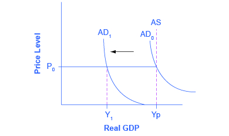

By the end of this section, you will be able to:
* Explain real GDP, recessionary gaps, and inflationary gaps
* Recognize the Keynesian AD/AS model
* Identify the determining factors of both consumption expenditure and investment expenditure
* Analyze the factors that determine government spending and net exports

The Keynesian perspective focuses on aggregate demand. The idea is simple: firms produce output only if they expect it to sell. Thus, while the availability of the factors of production determines a nation’s **potential GDP**{: data-type="term" .no-emphasis}, the amount of goods and services actually being sold, known as **real GDP**{: data-type="term"}, depends on how much demand exists across the economy. This point is illustrated in [\[link\]](#CNX_Econ_C25_031).

{: #CNX_Econ_C25_031 data-title="The Keynesian AD/AS Model"}

Keynes argued that, for reasons we explain shortly, aggregate demand is not stable—that it can change unexpectedly. Suppose the economy starts where AD intersects SRAS at P0 and Yp. Because Yp is potential output, the economy is at full employment. Because AD is volatile, it can easily fall. Thus, even if we start at Yp, if AD falls, then we find ourselves in what Keynes termed a **recessionary gap**{: data-type="term"}. The economy is in equilibrium but with less than full employment, as shown at Y1 in the [\[link\]](#CNX_Econ_C25_031). Keynes believed that the economy would tend to stay in a recessionary gap, with its attendant unemployment, for a significant period of time.

In the same way (though not shown in the figure), if AD increases, the economy could experience an **inflationary gap**{: data-type="term"}, where demand is attempting to push the economy past potential output. As a consequence, the economy experiences inflation. The key policy implication for either situation is that government needs to step in and close the gap, increasing spending during recessions and decreasing spending during booms to return aggregate demand to match potential output.

Recall from [The Aggregate Supply-Aggregate Demand Model](/m48739){: .target-chapter} that **aggregate demand**{: data-type="term" .no-emphasis} is total spending, economy-wide, on domestic goods and services. (Aggregate demand (AD) is actually what economists call total planned expenditure. Read the appendix on [The Expenditure-Output Model](/m48835) for more on this.) You may also remember that aggregate demand is the sum of four components: consumption expenditure, investment expenditure, government spending, and spending on net exports (exports minus imports). In the following sections, we will examine each component through the Keynesian perspective.

# What Determines Consumption Expenditure?   {#ch25mod02_01}

Consumption expenditure is spending by households and individuals on durable goods, nondurable goods, and services. Durable goods are things that last and provide value over time, such as automobiles. Nondurable goods are things like groceries—once you consume them, they are gone. Recall from [The Macroeconomic Perspective](/m48705) that **services**{: data-type="term" .no-emphasis} are intangible things consumers buy, like healthcare or entertainment.

Keynes identified three factors that affect consumption:

* Disposable income: For most people, the single most powerful determinant of how much they consume is how much income they have in their take-home pay, also known as **disposable income**{: data-type="term"}, which is income after taxes.
* Expected future income: Consumer expectations about future income also are important in determining consumption. If consumers feel optimistic about the future, they are more likely to spend and increase overall aggregate demand. News of recession and troubles in the economy will make them pull back on consumption.
* Wealth or credit: When households experience a rise in wealth, they may be willing to consume a higher share of their income and to save less. When the U.S. stock market rose dramatically in the late 1990s, for example, U.S. rates of saving declined, probably in part because people felt that their wealth had increased and there was less need to save. How do people spend beyond their income, when they perceive their wealth increasing? The answer is borrowing. On the other side, when the U.S. stock market declined about 40% from March 2008 to March 2009, people felt far greater uncertainty about their economic future, so rates of saving increased while consumption declined.
{: data-bullet-style="bullet"}

Finally, Keynes noted that a variety of other factors combine to determine how much people save and spend. If household preferences about saving shift in a way that encourages consumption rather than saving, then AD will shift out to the right.

Visit this [website][1] for more information about how the recession affected various groups of people.

  

# What Determines Investment Expenditure?   {#ch25mod02_02}

Spending on new capital goods is called **investment expenditure**{: data-type="term" .no-emphasis}. Investment falls into four categories: producer’s durable equipment and software, new nonresidential structures (such as factories, offices, and retail locations), changes in inventories, and residential structures (such as single-family homes, townhouses, and apartment buildings). The first three types of investment are conducted by businesses, while the last is conducted by households.

Keynes’s treatment of investment focuses on the key role of expectations about the future in influencing business decisions. When a business decides to make an investment in physical assets, like plants or equipment, or in intangible assets, like skills or a research and development project, that firm considers both the expected benefits of the investment (expectations of future profits) and the costs of the investment (interest rates).

* Expectations of future profits: The clearest driver of the benefits of an investment is expectations for future profits. When an economy is expected to grow, businesses perceive a growing market for their products. Their higher degree of business confidence will encourage new investment. For example, in the second half of the 1990s, U.S. investment levels surged from 18% of GDP in 1994 to 21% in 2000. However, when a recession started in 2001, U.S. investment levels quickly sank back to 18% of GDP by 2002.
* Interest rates also play a significant role in determining how much investment a firm will make. Just as individuals need to borrow money to purchase homes, so businesses need financing when they purchase big ticket items. The cost of investment thus includes the **interest rate**{: data-type="term" .no-emphasis}. Even if the firm has the funds, the interest rate measures the opportunity cost of purchasing business capital. Lower interest rates stimulate investment spending and higher interest rates reduce it.
{: data-bullet-style="bullet"}

Many factors can affect the expected profitability on investment. For example, if the price of energy declines, then investments that use energy as an input will yield higher profits. If government offers special incentives for investment (for example, through the tax code), then investment will look more attractive; conversely, if government removes special investment incentives from the tax code, or increases other business taxes, then investment will look less attractive. As Keynes noted, business investment is the most variable of all the components of aggregate demand.

# What Determines Government Spending?   {#ch25mod02_03}

The third component of aggregate demand is spending by federal, state, and local governments. Although the United States is usually thought of as a market economy, government still plays a significant role in the economy. As we discuss in [Environmental Protection and Negative Externalities](/m48668){: .target-chapter} and [Positive Externalitites and Public Goods](/m48675){: .target-chapter}, government provides important public services such as national defense, transportation infrastructure, and education.

Keynes recognized that the government budget offered a powerful tool for influencing aggregate demand. Not only could AD be stimulated by more government spending (or reduced by less government spending), but consumption and investment spending could be influenced by lowering or raising tax rates. Indeed, Keynes concluded that during extreme times like deep recessions, only the government had the power and resources to move aggregate demand.

# What Determines Net Exports?   {#ch25mod02_04}

Recall that **exports**{: data-type="term" .no-emphasis} are products produced domestically and sold abroad while **imports**{: data-type="term" .no-emphasis} are products produced abroad but purchased domestically. Since aggregate demand is defined as spending on domestic goods and services, export expenditures add to AD, while import expenditures subtract from AD.

Two sets of factors can cause shifts in export and import demand: changes in relative growth rates between countries and changes in relative prices between countries. The level of demand for a nation’s exports tends to be most heavily affected by what is happening in the economies of the countries that would be purchasing those exports. For example, if major importers of American-made products like Canada, Japan, and Germany have recessions, exports of U.S. products to those countries are likely to decline. Conversely, the quantity of a nation’s imports is directly affected by the amount of income in the domestic economy: more income will bring a higher level of imports.

Exports and imports can also be affected by relative prices of goods in domestic and international markets. If U.S. goods are relatively cheaper compared with goods made in other places, perhaps because a group of U.S. producers has mastered certain productivity breakthroughs, then U.S. exports are likely to rise. If U.S. goods become relatively more expensive, perhaps because a change in the exchange rate between the U.S. dollar and other currencies has pushed up the price of inputs to production in the United States, then exports from U.S. producers are likely to decline.

[\[link\]](#ch25mod02_tbl01) summarizes the reasons given here for changes in aggregate demand.

<table id="ch25mod02_tbl01" summary="The table shows summaries of common reasons for changes in aggregate demand. Column 1 lists the Reasons for a Decrease in Aggregate Demand. Column 2 lists the Reasons for an Increase in Aggregate Demand. Consumption (for decrease in aggregate demand): Rise in taxes; Fall in income; Rise in interest; Desire to save more; Decrease in wealth; Fall in future expected income. Consumption (for increase in aggregate demand): Decrease in taxes; Increase in income; Fall in interest; Desire to save less; Rise in wealth; Rise in future expected income. Investment (for decrease in aggregate demand): Fall in expected rate of return; Rise in interest rates; Drop in business confidence. Investment (for increase in aggregate demand): Rise in expected rate of return; Drop in interest rates; Rise in business confidence. Government (for decrease in aggregate demand): Reduction in government spending; Increase in taxes. Government (for increase in aggregate demand): Increase in government spending; Decrease in taxes. Net exports (for decrease in aggregate demand): Decrease in foreign demand; Relative price increase of U.S. goods. Net exports (for increase in aggregate demand): Increase in foreign demand; Relative price drop of U.S. goods."><caption>Determinants of Aggregate Demand</caption><thead>
<tr>
<th>Reasons for a Decrease in Aggregate Demand</th>
<th>Reasons for an Increase in Aggregate Demand</th>
</tr>
</thead><tbody>
<tr>
<td><strong><em>Consumption</em></strong>
<ul data-bullet-style="bullet">
<li>Rise in taxes</li>
<li>Fall in income</li>
<li>Rise in interest</li>
<li>Desire to save more</li>
<li>Decrease in wealth</li>
<li>Fall in future expected income</li>
</ul>
</td>
<td><strong><em>Consumption</em></strong>
<ul data-bullet-style="bullet"><li>Decrease in taxes</li>
<li>Increase in income</li>
<li>Fall in interest rates</li>
<li>Desire to save less</li>
<li>Rise in wealth</li>
<li>Rise in future expected income</li>
</ul></td>
</tr>
<tr>
<td><strong><em>Investment</em></strong>
<ul data-bullet-style="bullet">
<li>Fall in expected rate of return</li>
<li>Rise in interest rates</li>
<li>Drop in business confidence</li>
</ul>
</td>
<td><strong><em>Investment</em></strong>
<ul data-bullet-style="bullet">
<li>Rise in expected rate of return</li>
<li>Drop in interest rates</li>
<li>Rise in business confidence</li>
</ul>
</td>
</tr>
<tr>
<td><strong><em>Government</em></strong>
<ul data-bullet-style="bullet"><li>Reduction in government spending</li>
<li>Increase in taxes</li>
</ul></td>
<td><strong><em>Government</em></strong>
<ul data-bullet-style="bullet"><li>Increase in government spending</li>
<li>Decrease in taxes</li>
</ul></td>
</tr>
<tr>
<td><strong><em>Net Exports</em></strong>
<ul data-bullet-style="bullet">
<li>Decrease in foreign demand</li>
<li>Relative price increase of U.S. goods</li>
</ul>
</td>
<td><strong><em>Net Exports</em></strong>
<ul data-bullet-style="bullet">
<li>Increase in foreign demand</li>
<li>Relative price drop of U.S. goods</li>
</ul>
</td>
</tr>
</tbody></table>

# Key Concepts and Summary   {#ch25mod02_summ}

Aggregate demand is the sum of four components: consumption, investment, government spending, and net exports. Consumption will change for a number of reasons, including movements in income, taxes, expectations about future income, and changes in wealth levels. Investment will change in response to its expected profitability, which in turn is shaped by expectations about future economic growth, the creation of new technologies, the price of key inputs, and tax incentives for investment. Investment will also change when interest rates rise or fall. Government spending and taxes are determined by political considerations. Exports and imports change according to relative growth rates and prices between two economies.

# Self-Check Questions   {#ch25mod02_sques}

In the Keynesian framework, which of the following events might cause a recession? Which might cause inflation? Sketch AD/AS diagrams to illustrate your answers.

1.  A large increase in the price of the homes people own.
2.  Rapid growth in the economy of a major trading partner.
3.  The development of a major new technology offers profitable opportunities for business.
4.  The interest rate rises.
5.  The good imported from a major trading partner become much less expensive.
{: data-number-style="lower-alpha"}

1.  An increase in home values will increase consumption spending (due to increased wealth). AD will shift to the right and may cause inflation if it goes beyond potential GDP.
2.  Rapid growth by a major trading partner will increase demand for exports. AD will shift to the right and may cause inflation if it goes beyond potential GDP.
3.  Increased profit opportunities will increase business investment. AD will shift to the right and may cause inflation if it goes beyond potential GDP.
4.  Higher interest rates reduce investment spending. AD will shift to the left and may cause recession if it falls below potential GDP.
5.  Demand for cheaper imports increases, reducing demand for domestic products. AD will shift to the left and may be recessionary.
{: data-number-style="lower-alpha"}

In a Keynesian framework, using an AD/AS diagram, which of the following government policy choices offer a possible solution to recession? Which offer a possible solution to inflation?

1.  A tax increase on consumer income.
2.  A surge in military spending.
3.  A reduction in taxes for businesses that increase investment.
4.  A major increase in what the U.S. government spends on healthcare.
{: data-number-style="lower-alpha"}

1.  A tax increase on consumer income will cause consumption to fall, pushing the AD curve left, and is a possible solution to inflation.
2.  A surge in military spending is an increase in government spending. This will cause the AD curve to shift to the right. If real GDP is less than potential GDP, then this spending would pull the economy out of a recession. If real GDP is to the right of potential GDP, then the AD curve will shift farther to the right and military spending will be inflationary.
3.  A tax cut focused on business investment will shift AD to the right. If the original macroeconomic equilibrium is below potential GDP, then this policy can help move an economy out of a recession.
4.  Government spending on healthcare will cause the AD curve to shift to the right. If real GDP is less than potential GDP, then this spending would pull the economy out of a recession. If real GDP is to th right of potential GDP, then the AD curve will shift farther to the right and healthcare spending will be inflationary.
{: data-number-style="lower-alpha"}

# Review Questions   {#ch25mod02_rques}

Name some economic events not related to government policy that could cause aggregate demand to shift.

Name some government policies that could cause aggregate demand to shift.

# Critical Thinking Questions   {#ch25mod02_ctques}

In its recent report, The Conference Board’s *Global Economic Outlook 2015*, updated November 2014 (http://www.conference-board.org/data/globaloutlook.cfm), projects China’s growth between 2015 and 2019 to be about 5.5%. *International Business Times* (http://www.ibtimes.com/us-exports-china-have-grown-294-over-past-decade-1338693) reports that China is the United States’ third largest export market, with exports to China growing 294% over the last ten years. Explain what impact China has on the U.S. economy.

What may happen if growth in China continues or contracts?

# References   {#ch25mod02_ref}

Mahapatra, Lisa. “US Exports To China Have Grown 294% Over The Past Decade.” *International Business Times*. Last modified July 09, 2013. http://www.ibtimes.com/us-exports-china-have-grown-294-over-past-decade-1338693.

The Conference Board, Inc. “Global Economic Outlook 2014, November 2013.” http://www.conference-board.org/data/globaloutlook.cfm.

Thomas, G. Scott. “Recession claimed 170,000 small businesses in two years.” *The Business Journals*. Last modified July 24, 2012. http://www.bizjournals.com/bizjournals/on-numbers/scott-thomas/2012/07/recession-claimed-170000-small.html.

United States Department of Labor: Bureau of Labor Statistics. “Top Picks.” http://data.bls.gov/cgi-bin/surveymost?bls.

[1]: http://openstaxcollege.org/l/Diane_Rehm
