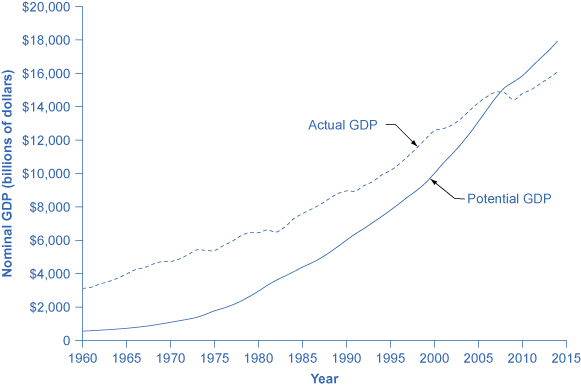
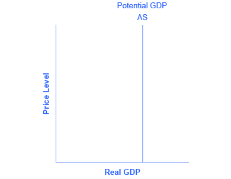

By the end of this section, you will be able to:
* Explain the importance of potential GDP in the long run
* Analyze the role of flexible prices
* Interpret a neoclassical model of aggregate demand and aggregate supply
* Evaluate different ways for measuring the speed of macroeconomic adjustment

The **neoclassical perspective**{: data-type="term"} on macroeconomics holds that, in the long run, the economy will fluctuate around its potential GDP and its natural rate of unemployment. This chapter begins with two building blocks of neoclassical economics: (1) the size of the economy is determined by potential GDP, and (2) wages and prices will adjust in a flexible manner so that the economy will adjust back to its potential GDP level of output. The key policy implication is this: Should the government focus more on long-term growth and on controlling inflation than on worrying about recession or cyclical unemployment? This focus on long-run growth rather than the short-run fluctuations in the business cycle means that neoclassical economics is more useful for long-run macroeconomic analysis and **Keynesian economics**{: data-type="term" .no-emphasis} is more useful for analyzing the macroeconomic short run. Let\'s consider the two neoclassical building blocks in turn, and how they can be embodied in the **aggregate demand/aggregate supply model**{: data-type="term" .no-emphasis}.

# The Importance of Potential GDP in the Long Run   {#ch26mod01_01}

Over the long run, the level of potential GDP determines the size of real GDP. When economists refer to “potential GDP” they are referring to that level of output that can be achieved when all resources (land, labor, capital, and entrepreneurial ability) are fully employed. While the unemployment rate in labor markets will never be zero, full employment in the labor market refers to zero cyclical unemployment. There will still be some level of unemployment due to frictional or structural unemployment, but when the economy is operating with zero cyclical unemployment, the economy is said to be at the natural rate of unemployment or at full employment.

Actual or **real GDP**{: data-type="term" .no-emphasis} is benchmarked against the **potential GDP**{: data-type="term" .no-emphasis} to determine how well the economy is performing. Growth in GDP can be explained by increases and investment in physical capital and human capital per person as well as advances in technology. **Physical capital per person**{: data-type="term"} refers to the amount and kind of machinery and equipment available to help people get work done. Compare, for example, your productivity in typing a term paper on a typewriter to working on your laptop with word processing software. Clearly, you will be able to be more productive using word processing software. The technology and level of capital of your laptop and software has increased your productivity. More broadly, the development of GPS technology and Universal Product Codes (those barcodes on every product we buy) has made it much easier for firms to track shipments, tabulate inventories, and sell and distribute products. These two technological innovations, and many others, have increased a nation\'s ability to produce goods and services for a given population. Likewise, increasing human capital involves increasing levels of knowledge, education, and skill sets per person through vocational or higher education. Physical and human capital improvements with technological advances will increase overall productivity and, thus, GDP.

To see how these improvements have increased productivity and output at the national level, we should examine evidence from the United States. The United States experienced significant growth in the twentieth century due to phenomenal changes in infrastructure, equipment, and technological improvements in physical capital and human capital. The population more than tripled in the twentieth century, from 76 million in 1900 to over 300 million in 2012. The **human capital**{: data-type="term" .no-emphasis} of modern workers is far higher today because the education and skills of workers have risen dramatically. In 1900, only about one-eighth of the U.S. population had completed high school and just one person in 40 had completed a four-year college degree. By 2010, more than 87% of Americans had a high school degree and over 29% had a four-year college degree as well. In 2014, 40% of working-age Americans had a four-year college degree. The average amount of physical capital per worker has grown dramatically. The technology available to modern workers is extraordinarily better than a century ago: cars, airplanes, electrical machinery, smartphones, computers, chemical and biological advances, materials science, health care—the list of technological advances could run on and on. More workers, higher skill levels, larger amounts of physical capital per worker, and amazingly better technology, and potential GDP for the U.S. economy has clearly increased a great deal since 1900.

This growth has fallen below its potential GDP and, at times, has exceeded its potential. For example from 2008 to 2009, the U.S. economy tumbled into recession and remains below its potential. At other times, like in the late 1990s, the economy ran at potential GDP—or even slightly ahead. [\[link\]](#CNX_Econ_C26_001) shows the actual data for the increase in nominal GDP since 1960. The slightly smoother line shows the potential GDP since 1960 as estimated by the nonpartisan Congressional Budget Office. Most economic recessions and upswings are times when the economy is 1–3% below or above potential GDP in a given year. Clearly, short-run fluctuations around potential GDP do exist, but over the long run, the upward trend of potential GDP determines the size of the economy.

 {: #CNX_Econ_C26_001 data-title="Potential and Actual GDP (in Nominal Dollars)"}

In the aggregate demand/aggregate supply model, potential GDP is shown as a vertical line. Neoclassical economists who focus on potential GDP as the primary determinant of real GDP argue that the long-run aggregate supply curve is located at potential GDP—that is, the long-run aggregate supply curve is a vertical line drawn at the level of potential GDP, as shown in [\[link\]](#CNX_Econ_C26_002). A vertical LRAS curve means that the level of **aggregate supply**{: data-type="term" .no-emphasis} (or potential GDP) will determine the real GDP of the economy, regardless of the level of **aggregate demand**{: data-type="term" .no-emphasis}. Over time, increases in the quantity and quality of physical capital, increases in human capital, and technological advancements shift potential GDP and the vertical LRAS curve gradually to the right. This gradual increase in an economy\'s potential GDP is often described as a nation\'s long-term economic growth.

{: #CNX_Econ_C26_002 data-title="A Vertical AS Curve"}

# The Role of Flexible Prices   {#ch26mod01_02}

How does the macroeconomy adjust back to its level of potential GDP in the long run? What if aggregate demand increases or decreases? The neoclassical view of how the macroeconomy adjusts is based on the insight that even if wages and prices are “sticky”, or slow to change, in the short run, they are flexible over time. To understand this better, let\'s follow the connections from the short-run to the long-run macroeconomic equilibrium.

The aggregate demand and aggregate supply diagram shown in [\[link\]](#CNX_Econ_C26_003) shows two aggregate supply curves. The original upward sloping aggregate supply curve (SRAS0) is a short-run or Keynesian AS curve. The vertical aggregate supply curve (LRASn) is the long-run or neoclassical AS curve, which is located at potential GDP. The original aggregate demand curve, labeled AD0, is drawn so that the original equilibrium occurs at point E0, at which point the economy is producing at its potential GDP.

, at an output level of 500 and a price level of 120, happens at the intersection of the aggregate demand curve (AD0) and the short-run aggregate supply curve (SRAS0). The output at E0 is equal to potential GDP. Aggregate demand shifts right from AD0 to AD1. The new equilibrium is E1, with a higher output level of 550 and an increase in the price level to 125. With unemployment rates unsustainably low, wages are bid up by eager employers, which shifts short-run aggregate supply to the left, from SRAS0 to SRAS1. The new equilibrium (E2) is at the same original level of output, 500, but at a higher price level of 130. Thus, the long-run aggregate supply curve (LRASn), which is vertical at the level of potential GDP, determines the level of real GDP in this economy in the long run."){: #CNX_Econ_C26_003 data-title="The Rebound to Potential GDP after AD Increases"}

Now, imagine that some economic event boosts aggregate demand: perhaps a surge of export sales or a rise in business confidence that leads to more investment, perhaps a policy decision like higher government spending, or perhaps a tax cut that leads to additional aggregate demand. The short-run Keynesian analysis is that the rise in aggregate demand will shift the aggregate demand curve out to the right, from AD0 to AD1, leading to a new equilibrium at point E1 with higher output, lower unemployment, and pressure for an inflationary rise in the price level.

In the long-run neoclassical analysis, however, the chain of economic events is just beginning. As economic output rises above potential GDP, the level of unemployment falls. The economy is now above full employment and there is a shortage of labor. Eager employers are trying to bid workers away from other companies and to encourage their current workers to exert more effort and to put in longer hours. This high demand for labor will drive up wages. Most workers have their salaries reviewed only once or twice a year, and so it will take time before the higher wages filter through the economy. As wages do rise, it will mean a leftward shift in the short-run Keynesian aggregate supply curve back to SRAS1, because the price of a major input to production has increased. The economy moves to a new equilibrium (E2). The new equilibrium has the same level of real GDP as did the original equilibrium (E0), but there has been an inflationary increase in the price level.

This description of the short-run shift from E0 to E1 and the long-run shift from E1 to E2 is a step-by-step way of making a simple point: the economy cannot sustain production above its potential GDP in the long run. An economy may produce above its level of potential GDP in the short run, under pressure from a surge in aggregate demand. Over the long run, however, that surge in aggregate demand ends up as an increase in the price level, not as a rise in output.

The rebound of the economy back to potential GDP also works in response to a shift to the left in aggregate demand. [\[link\]](#CNX_Econ_C26_004) again starts with two aggregate supply curves, with SRAS0 showing the original upward sloping short-run Keynesian AS curve and LRASn showing the vertical long-run neoclassical aggregate supply curve. A decrease in aggregate demand—for example, because of a decline in consumer confidence that leads to less consumption and more saving—causes the original aggregate demand curve AD0 to shift back to AD1. The shift from the original equilibrium (E0) to the new equilibrium (E1) results in a decline in output. The economy is now below full employment and there is a surplus of labor. As output falls below potential GDP, unemployment rises. While a lower price level (i.e., deflation) is rare in the United States, it does happen from time to time during very weak periods of economic activity. For practical purposes, we might consider a lower price level in the AD–AS model as indicative of disinflation, which is a decline in the rate of inflation. Thus, the long-run aggregate supply curve LRASn, which is vertical at the level of potential GDP, ultimately determines the real GDP of this economy.

, at an output level of 500 and a price level of 120, happens at the intersection of the aggregate demand curve (AD0) and the short-run aggregate supply curve (SRAS0). The output at E0 is equal to potential GDP. Aggregate demand shifts left, from AD0 to AD1. The new equilibrium is at E1, with a lower output level of 450 and downward pressure on the price level of 115. With high unemployment rates, wages are held down. Lower wages are an economy-wide decrease in the price of a key input, which shifts short-run aggregate supply to the right, from SRAS0 to SRAS1. The new equilibrium (E2) is at the same original level of output, 500, but at a lower price level of 110."){: #CNX_Econ_C26_004 data-title="A Rebound Back to Potential GDP from a Shift to the Left in Aggregate Demand"}

Again, from the neoclassical perspective, this short-run scenario is only the beginning of the chain of events. The higher level of unemployment means more workers looking for jobs. As a result, employers can hold down on pay increases—or perhaps even replace some of their higher-paid workers with unemployed people willing to accept a lower wage. As wages stagnate or fall, this decline in the price of a key input means that the short-run Keynesian aggregate supply curve shifts to the right from its original (SRAS0 to SRAS1). The overall impact in the long run, as the macroeconomic equilibrium shifts from E0 to E1 to E2, is that the level of output returns to potential GDP, where it started. There is, however, downward pressure on the price level. Thus, in the neoclassical view, changes in aggregate demand can have a short-run impact on output and on unemployment—but only a short-run impact. In the long run, when wages and prices are flexible, potential GDP and aggregate supply determine the size of real GDP.

# How Fast Is the Speed of Macroeconomic Adjustment?   {#ch26mod01_03}

How long does it take for wages and prices to adjust, and for the economy to rebound back to its potential GDP? This subject is highly contentious. Keynesian economists argue that if the adjustment from recession to potential GDP takes a very long time, then neoclassical theory may be more hypothetical than practical. In response to those immortal words of **John Maynard Keynes**{: data-type="term" .no-emphasis}, “In the long run we are all dead,” neoclassical economists respond that even if the adjustment takes as long as, say, ten years the neoclassical perspective remains of central importance in understanding the economy.

One subset of neoclassical economists holds that the adjustment of wages and prices in the macroeconomy might be quite rapid indeed. The theory of **rational expectations**{: data-type="term"} holds that people form the most accurate possible expectations about the future that they can, using all information available to them. In an economy where most people have rational expectations, economic adjustments may happen very quickly.

To understand how rational expectations may affect the speed of price adjustments, think about a situation in the real estate market. Imagine that several events seem likely to push up the value of homes in the neighborhood. Perhaps a local employer announces that it is going to hire many more people or the city announces that it is going to build a local park or a library in that neighborhood. The theory of rational expectations points out that even though none of the changes will happen immediately, home prices in the neighborhood will rise immediately, because the expectation that homes will be worth more in the future will lead buyers to be willing to pay more in the present. The amount of the immediate increase in home prices will depend on how likely it seems that the announcements about the future will actually happen and on how distant the local jobs and neighborhood improvements are in the future. The key point is that, because of rational expectations, prices do not wait on events, but adjust immediately.

At a macroeconomic level, the theory of rational expectations points out that if the aggregate supply curve is vertical over time, then people should rationally expect this pattern. When a shift in aggregate demand occurs, people and businesses with rational expectations will know that its impact on output and employment will be temporary, while its impact on the price level will be permanent. If firms and workers perceive the outcome of the process in advance, and if all firms and workers know that everyone else is perceiving the process in the same way, then they have no incentive to go through an extended series of short-run scenarios, like a firm first hiring more people when aggregate demand shifts out and then firing those same people when aggregate supply shifts back. Instead, everyone will recognize where this process is heading—toward a change in the price level—and then will act on that expectation. In this scenario, the expected long-run change in the price level may happen very quickly, without a drawn-out zigzag of output and employment first moving one way and then the other.

The theory that people and firms have rational expectations can be a useful simplification, but as a statement about how people and businesses actually behave, the assumption seems too strong. After all, many people and firms are not especially well informed, either about what is happening in the economy or about how the economy works. An alternate assumption is that people and firms act with **adaptive expectations**{: data-type="term"}\: they look at past experience and gradually adapt their beliefs and behavior as circumstances change, but are not perfect synthesizers of information and accurate predictors of the future in the sense of rational expectations theory. If most people and businesses have some form of adaptive expectations, then the adjustment from the short run and long run will be traced out in incremental steps that occur over time.

The empirical evidence on the speed of macroeconomic adjustment of prices and wages is not clear-cut. Indeed, the speed of macroeconomic adjustment probably varies among different countries and time periods. A reasonable guess is that the initial short-run effect of a shift in aggregate demand might last two to five years, before the adjustments in wages and prices cause the economy to adjust back to potential GDP. Thus, one might think of the short run for applying Keynesian analysis as time periods less than two to five years, and the long run for applying neoclassical analysis as longer than five years. For practical purposes, this guideline is frustratingly imprecise, but when analyzing a complex social mechanism like an economy as it evolves over time, some imprecision seems unavoidable.

# Key Concepts and Summary   {#ch26mod01_summ}

Neoclassical perspective argues that, in the long run, the economy will adjust back to its potential GDP level of output through flexible price levels. Thus, the neoclassical perspective views the long-run AS curve as vertical. A rational expectations perspective argues that people have excellent information about economic events and how the economy works and that, as a result, price and other economic adjustments will happen very quickly. In adaptive expectations theory, people have limited information about economic information and how the economy works, and so price and other economic adjustments can be slow.

# Self-Check Question   {#ch26mod01_sques}

Do rational expectations tend to look back at past experience while adaptive expectations look ahead to the future? Explain your answer.

No, this statement is false. It would be more accurate to say that rational expectations seek to predict the future as accurately as possible, using all of past experience as a guide. Adaptive expectations are largely backward looking; that is, they adapt as experience accumulates, but without attempting to look forward.

# Review Questions   {#ch26mod01_rques}

Does neoclassical economics focus on the long term or the short term? Explain your answer.

Does neoclassical economics view prices and wages as sticky or flexible? Why?

What shape is the long-run aggregate supply curve? Why does it have this shape?

What is the difference between rational expectations and adaptive expectations?

A neoclassical economist and a Keynesian economist are studying the economy of Vineland. It appears that Vineland is beginning to experience a mild recession with a decrease in aggregate demand. Which of these two economists would likely advocate that the government of Vineland take active measures to reverse this decline in aggregate demand? Why?

# Critical Thinking Questions   {#ch26mod01_ctques}

If most people have rational expectations, how long will recessions last?

Explain why the neoclassical economists believe that nothing much needs to be done about unemployment. Do you agree or disagree? Explain.

# Problems   {#ch26mod01_prob}

Use [[link]](#ch26mod01_tab01) to answer the following questions.

| Price Level | Aggregate Supply | Aggregate Demand |
|----------
| 90 | 3,000 | 3,500 |
| 95 | 3,000 | 3,000 |
| 100 | 3,000 | 2,500 |
| 105 | 3,000 | 2,200 |
| 110 | 3,000 | 2,100 |
{: #ch26mod01_tab01 summary="Table 1"}

1.  Sketch an aggregate supply and aggregate demand diagram.
2.  What is the equilibrium output and price level?
3.  If aggregate demand shifts right, what is equilibrium output?
4.  If aggregate demand shifts left, what is equilibrium output?
5.  In this scenario, would you suggest using aggregate demand to alter the level of output or to control any inflationary increases in the price level?
{: data-number-style="lower-alpha"}

# References   {#ch26mod01_ref}

Lumina Foundation. 2014. \"A Stronger Nation Through Higher Education.\" Accessed March 4, 2015. http://www.luminafoundation.org/publications/A\\\_stronger\\\_nation\\\_through\\\_higher\\\_education-2014.pdf.

The National Bureau of Economic Research. http://www.nber.org/.

U.S. Department of Commerce: United States Census Bureau. “The 2012 Statistical Abstract.” http://www.census.gov/compendia/statab/cats/education.html.

U.S. Department of the Treasury. “TARP Programs.” Last modified December 12, 2013. http://www.treasury.gov/initiatives/financial-stability/TARP-Programs/Pages/default.aspx.

United States Government. “Recovery.gov: Track the Money.” Last modified October 30, 2013. http://www.recovery.gov/Pages/default.aspx.

