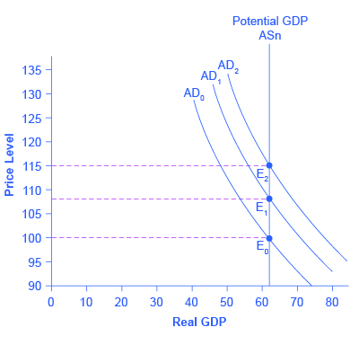

By the end of this section, you will be able to:
* Discuss why and how inflation expectations are measured
* Analyze the impacts of fiscal policy and monetary policy on aggregate supply and aggregate demand
* Explain the neoclassical Phillips curve, noting its tradeoff between inflation and unemployment
* Identify clear distinctions between neoclassical economics and Keynesian economics

To understand the policy recommendations of the neoclassical economists, it helps to start with the Keynesian perspective. Suppose a decrease in aggregate demand causes the economy to go into recession with high unemployment. The Keynesian response would be to use government policy to stimulate aggregate demand and eliminate the recessionary gap. The neoclassical economists believe that the Keynesian response, while perhaps well intentioned, will not have a good outcome for reasons we will discuss shortly. Since the neoclassical economists believe that the economy will correct itself over time, the only advantage of a Keynesian stabilization policy would be to speed up the process and minimize the time that the unemployed are out of work. Is that the likely outcome?

Keynesian macroeconomic policy requires some optimism about the ability of the government to recognize a situation of too little or too much **aggregate demand**{: data-type="term" .no-emphasis}, and to adjust aggregate demand accordingly with the right level of changes in taxes or spending, all enacted in a timely fashion. After all, neoclassical economists argue, it takes government statisticians months to produce even preliminary estimates of GDP so that politicians know whether a recession is occurring—and those preliminary estimates may be revised substantially later. Moreover, there is the question of timely action. The political process can take more months to enact a tax cut or a spending increase; the amount of those tax or spending changes may be determined as much by political considerations as economic ones; and then the economy will take still more months to put changes in aggregate demand into effect through spending and production. When all of these time lags and political realities are considered, active fiscal policy may fail to address the current problem, and could even make the future economy worse. The average U.S. post-World War II recession has lasted only about a year. By the time government policy kicks in, the recession will likely be over. As a consequence, the only result of government fine-tuning will be to stimulate the economy when it is already recovering (or to contract the economy when it is already falling). In other words, an active macroeconomic policy is likely to exacerbate the cycles rather than dampen them. Indeed, some neoclassical economists believe a large part of the business cycles we observe are due to flawed government policy. To learn about this issue further, read the following Clear It Up feature.

Why and how are inflation expectations measured?

People take expectations about inflation into consideration every time they make a major purchase, such as a house or a car. As inflation fluctuates, so too does the nominal interest rate on loans to buy these goods. The nominal interest rate is comprised of the real rate, plus an **expected inflation**{: data-type="term"} factor. Expected inflation also tells economists about how the public views the direction of the economy. Suppose the public expects inflation to increase. This could be the result of positive demand shock due to an expanding economy and increasing aggregate demand. It could also be the result of a negative supply shock, perhaps from rising energy prices, and decreasing aggregate supply. In either case, the public may expect the central bank to engage in contractionary monetary policy to reduce inflation, and this policy results in higher interest rates. If, on the other hand, inflation is expected to decrease, the public may anticipate a recession. In turn, the public may expect expansionary monetary policy, and the lowering of interest rates, in the short run. By monitoring expected inflation, economists garner information about the effectiveness of macroeconomic policies. Additionally, monitoring expected inflation allows for projecting the direction of real interest rates that isolate for the effect of inflation. This information is necessary for making decisions about financing investments.

Expectations about inflation may seem like a highly theoretical concept, but, in fact, inflation expectations are measured by the Federal Reserve Bank based upon early research conducted by Joseph Livingston, a financial journalist for the *Philadelphia Inquirer*. In 1946, he started a twice-a-year survey of economists about their expectations of inflation. After Livingston\'s death in 1969, the survey was continued by the Federal Reserve Bank and other economic research agencies such as the Survey Research Center at the University of Michigan, the American Statistical Association, and the National Bureau of Economic Research.

Current research by the Federal Reserve compares these expectations to actual inflation that has occurred, and the results, so far, are mixed. Economists\' forecasts, however, have become notably more accurate in the last few decades. Economists are actively researching how expectations of inflation and other economic variables are formed and changed.

Visit this [website][1] to read “The Federal Reserve Bank of Cleveland’s Economic Commentary: A New Approach to Gauging Inflation Expectations” by Joseph G. Haubrich for more information about how expected inflation is forecast.

  

# The Neoclassical Phillips Curve Tradeoff   {#ch26mod02_01}

[The Keynesian Perspective](/m48749){: .target-chapter} introduced the **Phillips curve**{: data-type="term" .no-emphasis} and explained how it is derived from the aggregate supply curve. The short run upward sloping aggregate supply curve implies a downward sloping Phillips curve; thus, there is a tradeoff between inflation and unemployment in the short run. By contrast, a neoclassical long-run aggregate supply curve will imply a vertical shape for the Phillips curve, indicating no long run tradeoff between inflation and unemployment. [\[link\]](#CNX_Econ_C26_012) (a) shows the vertical AS curve, with three different levels of aggregate demand, resulting in three different equilibria, at three different price levels. At every point along that vertical AS curve, potential GDP and the rate of unemployment remains the same. Assume that for this economy, the natural rate of unemployment is 5%. As a result, the long-run Phillips curve relationship, shown in [\[link\]](#CNX_Econ_C26_012) (b), is a vertical line, rising up from 5% unemployment, at any level of inflation. Read the following Work It Out feature for additional information on how to interpret inflation and unemployment rates.

 With a vertical LRAS curve, shifts in aggregate demand do not alter the level of output but do lead to changes in the price level. Because output is unchanged between the equilibria E0, E1, and E2, all unemployment in this economy will be due to the natural rate of unemployment. (b) If the natural rate of unemployment is 5%, then the Phillips curve will be vertical. That is, regardless of changes in the price level, the unemployment rate remains at 5%."){: #CNX_Econ_C26_012 data-title="From a Long-Run AS Curve to a Long-Run Phillips Curve"}

Tracking Inflation and Unemployment Rates

Suppose that you have collected data for years on the rates of inflation and unemployment and recorded them in a table, such as [\[link\]](#ch26mod02_tab02). How do you interpret that information?

| Year | Inflation Rate | Unemployment Rate |
|----------
| 1970 | 2% | 4% |
| 1975 | 3% | 3% |
| 1980 | 2% | 4% |
| 1985 | 1% | 6% |
| 1990 | 1% | 4% |
| 1995 | 4% | 2% |
| 2000 | 5% | 4% |
{: #ch26mod02_tab02 summary="The table shows data for rates of inflation and unemployment over the course of 25 years. Column 1 lists the Year. Column 2 lists the Inflation Rate. Column 3 lists the Unemployment Rate. The year 1970 = 2% inflation; 4% unemployment. The year 1975 = 3% inflation; 3% unemployment. The year 1980 = 2% inflation; 4% unemployment. The year 1985 = 1% inflation; 6% unemployment. The year 1990 = 1% inflation; 4% unemployment. The year 1995 = 4% inflation; 2% unemployment. The year 2000 = 5% inflation; 4% unemployment."}

Step 1. Plot the data points in a graph with inflation rate on the vertical axis and unemployment rate on the horizontal axis. Your graph will appear similar to [\[link\]](#CNX_Econ_C26_013). {: #CNX_Econ_C26_013 data-title="Inflation Rates"}

Step 2. What patterns do you see in the data? You should notice that there are years when unemployment falls but inflation rises, and other years where unemployment rises and inflation falls.

Step 3. Can you determine the natural rate of unemployment from the data or from the graph? As you analyze the graph, it appears that the natural rate of unemployment lies at 4%; this is the rate that the economy appears to adjust back to after an apparent change in the economy. For example, in 1975 the economy appeared to have an increase in aggregate demand; the unemployment rate fell to 3% but inflation increased from 2% to 3%. By 1980, the economy had adjusted back to 4% unemployment and the inflation rate had returned to 2%. In 1985, the economy looks to have suffered a recession as unemployment rose to 6% and inflation fell to 1%. This would be consistent with a decrease in aggregate demand. By 1990, the economy recovered back to 4% unemployment, but at a lower inflation rate of 1%. In 1995 the economy again rebounded and unemployment fell to 2%, but inflation increased to 4%, which is consistent with a large increase in aggregate demand. The economy adjusted back to 4% unemployment but at a higher rate of inflation of 5%. Then in 2000, both unemployment and inflation increased to 5% and 4%, respectively.

Step 4. Do you see the Phillips curve(s) in the data? If we trace the downward sloping trend of data points, we could see a short-run Phillips curve that exhibits the inverse tradeoff between higher unemployment and lower inflation rates. If we trace the vertical line of data points, we could see a long-run Phillips curve at the 4% natural rate of unemployment.

The unemployment rate on the long-run Phillips curve will be the natural rate of unemployment. A small inflationary increase in the price level from AD0 to AD1 will have the same natural rate of unemployment as a larger inflationary increase in the price level from AD0 to AD2. The macroeconomic equilibrium along the vertical aggregate supply curve can occur at a variety of different price levels, and the natural rate of unemployment can be consistent with all different rates of inflation. The great economist **Milton Friedman**{: data-type="term" .no-emphasis} (1912–2006) summed up the neoclassical view of the long-term Phillips curve tradeoff in a 1967 speech: “\[T\]here is always a temporary trade-off between inflation and unemployment; there is no permanent trade-off.”

In the Keynesian perspective, the primary focus is on getting the level of aggregate demand right in relationship to an upward-sloping aggregate supply curve. That is, AD should be adjusted so that the economy produces at its potential GDP, not so low that cyclical unemployment results and not so high that inflation results. In the neoclassical perspective, aggregate supply will determine output at potential GDP, unemployment is determined by the natural rate of unemployment churned out by the forces of supply and demand in the labor market, and shifts in aggregate demand are the primary determinant of changes in the price level.

Visit this [website][2] to read about the effects of economic intervention.

  

# Fighting Unemployment or Inflation?   {#ch26mod02_02}

As explained in [Unemployment](/m48719){: .target-chapter}, unemployment can be divided into two categories: **cyclical unemployment**{: data-type="term" .no-emphasis} and the **natural rate of unemployment**{: data-type="term" .no-emphasis}, which is the sum of frictional and structural unemployment. Cyclical unemployment results from fluctuations in the business cycle and is created when the economy is producing below potential GDP—giving potential employers less incentive to hire. When the economy is producing at potential GDP, cyclical unemployment will be zero. Because of the dynamics of the labor market, in which people are always entering or exiting the labor force, the unemployment rate never falls to 0%, not even when the economy is producing at or even slightly above potential GDP. Probably the best we can hope for is for the number of job vacancies to equal the number of job seekers. We know that it takes time for job seekers and employers to find each other, and this time is the cause of frictional unemployment. Most economists do not consider frictional unemployment to be a “bad” thing. After all, there will always be workers who are unemployed while looking for a job that is a better match for their skills. There will always be employers that have an open position, while looking for a worker that is a better match for the job. Ideally, these matches happen quickly, but even when the economy is very strong there will be some natural unemployment and this is what is measured by the natural rate of unemployment.

The neoclassical view of unemployment tends to focus attention away from the problem of cyclical unemployment—that is, unemployment caused by recession—while putting more attention on the issue of the rates of unemployment that prevail even when the economy is operating at potential GDP. To put it another way, the neoclassical view of unemployment tends to focus on how public policy can be adjusted to reduce the natural rate of unemployment. Such policy changes might involve redesigning unemployment and welfare programs so that they support those in need, but also offer greater encouragement for job-hunting. It might involve redesigning business rules with an eye to whether they are unintentionally discouraging businesses from taking on new employees. It might involve building institutions to improve the flow of information about jobs and the mobility of workers, to help bring workers and employers together more quickly. For those workers who find that their skills are permanently no longer in demand (for example, the structurally unemployed), policy can be designed to provide opportunities for retraining so that these workers can reenter the labor force and seek employment.

Neoclassical economists will not tend to see aggregate demand as a useful tool for reducing unemployment; after all, if economic output is determined by a vertical **aggregate supply curve**{: data-type="term" .no-emphasis}, then aggregate demand has no long-run effect on unemployment. Instead, neoclassical economists believe that aggregate demand should be allowed to expand only to match the gradual shifts of aggregate supply to the right—keeping the price level much the same and inflationary pressures low.

If **aggregate demand**{: data-type="term" .no-emphasis} rises rapidly in the neoclassical model, in the long run it leads only to inflationary pressures. [\[link\]](#CNX_Econ_C26_005) shows a vertical LRAS curve and three different levels of aggregate demand, rising from AD0 to AD1 to AD2. As the macroeconomic equilibrium rises from E0 to E1 to E2, the price level rises, but real GDP does not budge; nor does the rate of unemployment, which adjusts to its natural rate. Conversely, reducing inflation has no long-term costs, either. Think about [\[link\]](#CNX_Econ_C26_005) in reverse, as the aggregate demand curve shifts from AD2 to AD1 to AD0, and the equilibrium moves from E2 to E1 to E0. During this process, the price level falls, but, in the long run, neither real GDP nor the natural rate of unemployment is changed.

{: #CNX_Econ_C26_005 data-title="How Aggregate Demand Determines the Price Level in the Long Run"}

Visit this [website][3] to read about how inflation and unemployment are related.

  

# Fighting Recession or Encouraging Long-Term Growth?   {#ch26mod02_03}

Neoclassical economists believe that the economy will rebound out of a recession or eventually contract during an expansion because prices and wage rates are flexible and will adjust either upward or downward to restore the economy to its potential GDP. Thus, the key policy question for neoclassicals is how to promote growth of potential GDP. We know that economic growth ultimately depends on the growth rate of long-term productivity. Productivity measures how effective inputs are at producing outputs. We know that U.S. productivity has grown on average about 2% per year. That means that the same amount of inputs produce 2% more output than the year before. We also know that productivity growth varies a great deal in the short term due to cyclical factors. It also varies somewhat in the long term. From 1953–1972, U.S. labor productivity (as measured by output per hour in the business sector) grew at 3.2% per year. From 1973–1992, productivity growth declined significantly to 1.8% per year. Then, from 1993–2012, productivity growth increased to 2.2% per year. The neoclassical economists believe the underpinnings of long-run productivity growth to be an economy’s investments in human capital, physical capital, and technology, operating together in a market-oriented environment that rewards innovation. Promotion of these factors is what government policy should focus on.

# Summary of Neoclassical Macroeconomic Policy Recommendations   {#ch26mod02_04}

Let’s summarize what neoclassical economists recommend for macroeconomic policy. Neoclassical economists do not believe in “fine-tuning” the economy. They believe that economic growth is fostered by a stable economic environment with a low rate of inflation. Similarly, tax rates should be low and unchanging. In this environment, private economic agents can make the best possible investment decisions, which will lead to optimal investment in physical and human capital as well as research and development to promote improvements in technology.

# Summary of Neoclassical Economics versus Keynesian Economics   {#ch26mod02_05}

[\[link\]](#ch24mod02_tab03) summarizes the key differences between the two schools of thought.

<table id="ch24mod02_tab03" summary="The table shows the key differences between Neoclassical Economics and Keynesian Economics. Column 1 lists a Summary of key economic considerations. Column 2 lists the stance of Neoclassical Economics. Column 3 lists the stance of Keynesian Economics. Focus: Long term or short term; Long-term (Neoclassical Economics); Short-term (Keynesian Economics). Prices and wages: sticky or flexible?; Flexible (Neoclassical Economics); Sticky (Keynesian Economics). Economic output: Primarily determined by aggregate demand or aggregate supply?; Aggregate supply (Neoclassical Economics); Aggregate demand (Keynesian Economics). Aggregate supply: vertical or upward-sloping?; Vertical (Neoclassical Economics); Upward-sloping (Keynesian Economics). Phillips curve vertical or downward-sloping; Vertical (Neoclassical Economics); Downward sloping (Keynesian Economics). Is aggregate demand a useful tool for controlling inflation?; Yes (Neoclassical Economics); Yes (Keynesian Economics). What should be the primary area of policy emphasis for reducing unemployment?; Reform labor market institutions to reduce natural rate of unemployment (Neoclassical Economics); Increase aggregate demand to eliminate cyclical unemployment (Keynesian Economics). Is aggregate demand a useful tool for ending recession?; At best, only in the short-run temporary sense, but may just increase inflation instead (Neoclassical Economics); Yes (Keynesian Economics)."><caption>Neoclassical versus Keynesian Economics</caption><thead>
    <tr>
        <th>Summary</th>
        <th>Neoclassical Economics</th>
        <th>Keynesian Economics</th>
    </tr>
</thead><tbody>
    <tr>
        <td>Focus: long-term or short term</td>
        <td>Long-term</td>
        <td>Short-term</td>
    </tr>
    <tr>
        <td>Prices and wages: sticky or flexible?</td>
        <td>Flexible</td>
        <td>Sticky</td>
    </tr>
    <tr>
        <td>Economic output: Primarily determined by aggregate demand or aggregate supply?</td>
        <td>Aggregate supply</td>
        <td>Aggregate demand</td>
    </tr>
    <tr>
        <td>Aggregate supply: vertical or upward-sloping?</td>
        <td>Vertical</td>
        <td>Upward-sloping</td>
    </tr>
    <tr>
        <td>Phillips curve vertical or downward-sloping</td>
        <td>Vertical</td>
        <td>Downward sloping</td>
    </tr>
    <tr>
        <td>Is aggregate demand a useful tool for controlling inflation?</td>
        <td>Yes</td>
        <td>Yes</td>
    </tr>
    <tr>
        <td>What should be the primary area of policy emphasis for reducing unemployment?</td>
        <td>Reform labor market institutions to reduce natural rate of unemployment</td>
        <td>Increase aggregate demand to eliminate cyclical unemployment</td>
    </tr>
    <tr>
        <td>Is aggregate demand a useful tool for ending recession?</td>
        <td>At best, only in the short-run temporary sense, but may just increase inflation instead</td>
        <td>Yes</td>
    </tr>
</tbody></table>

# Key Concepts and Summary   {#ch26mod02_summ}

Neoclassical economists tend to put relatively more emphasis on long-term growth than on fighting recession, because they believe that recessions will fade in a few years and long-term growth will ultimately determine the standard of living. They tend to focus more on reducing the natural rate of unemployment caused by economic institutions and government policies than the cyclical unemployment caused by recession.

Neoclassical economists also see no social benefit to inflation. With an upward-sloping Keynesian AS curve, inflation can arise because an economy is approaching full employment. With a vertical long-run neoclassical AS curve, inflation does not accompany any rise in output. If aggregate supply is vertical, then aggregate demand does not affect the quantity of output. Instead, aggregate demand can only cause inflationary changes in the price level. A vertical aggregate supply curve, where the quantity of output is consistent with many different price levels, also implies a vertical Phillips curve.

# Self-Check Questions   {#ch26mod02_sques}

Legislation proposes that the government should use macroeconomic policy to achieve an unemployment rate of zero percent, by increasing aggregate demand for as much and as long as necessary to accomplish this goal. From a neoclassical perspective, how will this policy affect output and the price level in the short run and in the long run? Sketch an aggregate demand/aggregate supply diagram to illustrate your answer. *Hint*: revisit [[link]](/m48758#CNX_Econ_C26_003).

An unemployment rate of zero percent is presumably well below the rate that is consistent with potential GDP and with the natural rate of unemployment. As a result, this policy would be attempting to push AD out to the right.

In the short run, it is possible to have unemployment slightly below the natural rate for a time, at a price of higher inflation, as shown by the movement from E0 to E1 along the short-run AS curve. However, over time the extremely low unemployment rates will tend to cause wages to be bid up, and shift the short-run AS curve back to the left. The result would be a higher price level, but an economy still at potential GDP and the natural rate of unemployment, as determined by the long-run AS curve. If the government continues this policy, it will continually be pushing the price level higher and higher, but it will not be able to achieve its goal of zero percent unemployment, because that goal is inconsistent with market forces.

Would it make sense to argue that rational expectations economics is an extreme version of neoclassical economics? Explain.

The statement is accurate. Rational expectations can be thought of as a version of neoclassical economics because it argues that potential GDP and the rate of unemployment are shaped by market forces as wages and prices adjust. However, it is an “extreme” version because it argues that this adjustment takes place very quickly. Other theories, like adaptive expectations, suggest that adjustment to the neoclassical outcome takes a few years.

# Review Questions   {#ch26mod02_rques}

Do neoclassical economists tend to focus more on long term economic growth or on recessions? Explain briefly.

Do neoclassical economists tend to focus more on cyclical unemployment or on inflation? Explain briefly.

Do neoclassical economists see a value in tolerating a little more inflation if it brings additional economic output? Explain your answer.

If aggregate supply is vertical, what role does aggregate demand play in determining output? In determining the price level?

What is the shape of the neoclassical long-run Phillips curve? What assumptions are made that lead to this shape?

# Critical Thinking Question   {#ch26mod02_ctques}

The American Recovery and Reinvestment Act was criticized by economists from all theoretical persuasions. The “Stimulus Package” was arguably a Keynesian measure so why would a Keynesian economist be critical of it? Why would neoclassical economists be critical?

# References   {#ch26mod02_ref}

American Statistical Association. “ASA Headlines.” http://www.amstat.org/.

Haubrich, Joseph G., George Pennacchi, and Peter Ritchken. “Working Paper 11-07: Inflation Expectations, Real Rates, and Risk Premia: Evidence from Inflation Swaps.” *Federal Reserve Bank of Cleveland*. Last modified March 2011. http://www.clevelandfed.org/research/workpaper/2011/wp1107.pdf.

University of Michigan: Institute for Social Research. “Survey Research Center.” http://www.src.isr.umich.edu/.

[1]: http://openstaxcollege.org/l/Haubrich
[2]: http://openstaxcollege.org/l/modeledbehavior
[3]: http://openstaxcollege.org/l/inflatemploy
