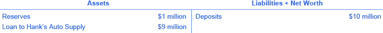
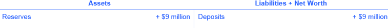
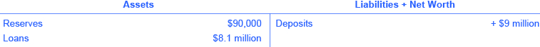

By the end of this section, you will be able to:

* Utilize the money multiplier formulate to determine how banks create money
* Analyze and create T-account balance sheets
* Evaluate the risks and benefits of money and banks

Banks and money are intertwined. It is not just that most money is in the form of bank accounts. The banking system can literally create money through the process of making loans. Let’s see how.

### Money Creation by a Single Bank

Start with a hypothetical bank called Singleton Bank. The bank has $10 million in deposits. The T-account balance sheet for Singleton Bank, when it holds all of the deposits in its vaults, is shown in [\[link\]](#CNX_Econ_C27_005). At this stage, Singleton Bank is simply storing money for depositors and is using these deposits to make loans. In this simplified example, Singleton Bank cannot earn any interest income from these loans and cannot pay its depositors an interest rate either.

 {: #CNX_Econ_C27_005 data-title="Singleton Bank&#x2019;s Balance Sheet: Receives $10 million in Deposits "}

Singleton Bank is required by the Federal Reserve to keep $1 million on reserve (10% of total deposits). It will loan out the remaining $9 million. By loaning out the $9 million and charging interest, it will be able to make interest payments to depositors and earn interest income for Singleton Bank (for now, we will keep it simple and not put interest income on the balance sheet). Instead of becoming just a storage place for deposits, Singleton Bank can become a financial intermediary between savers and borrowers.

This change in business plan alters Singleton Bank’s balance sheet, as shown in [\[link\]](#CNX_Econ_C27_006). Singleton’s assets have changed; it now has $1 million in reserves and a loan to Hank’s Auto Supply of $9 million. The bank still has $10 million in deposits.

 {: #CNX_Econ_C27_006 data-title="Singleton Bank&#x2019;s Balance Sheet: 10% Reserves, One Round of Loans "}

Singleton Bank lends $9 million to Hank’s Auto Supply. The bank records this loan by making an entry on the balance sheet to indicate that a loan has been made. This loan is an asset, because it will generate interest income for the bank. Of course, the loan officer is not going to let Hank walk out of the bank with $9 million in cash. The bank issues Hank’s Auto Supply a cashier’s check for the $9 million. Hank deposits the loan in his regular checking account with First National. The deposits at First National rise by $9 million and its reserves also rise by $9 million, as [\[link\]](#CNX_Econ_C27_007) shows. First National must hold 10% of additional deposits as required reserves but is free to loan out the rest

 {: #CNX_Econ_C27_007 data-title="First National Balance Sheet "}

Making loans that are deposited into a demand deposit account increases the M1 money supply. Remember the definition of M1 includes checkable (demand) deposits, which can be easily used as a medium of exchange to buy goods and services. Notice that the money supply is now $19 million: $10 million in deposits in Singleton bank and $9 million in deposits at First National. Obviously these deposits will be drawn down as Hank’s Auto Supply writes checks to pay its bills. But the bigger picture is that a bank must hold enough money in reserves to meet its liabilities; the rest the bank loans out. In this example so far, bank lending has expanded the money supply by $9 million.

Now, First National must hold only 10% as required reserves ($900,000) but can lend out the other 90% ($8.1 million) in a loan to Jack’s Chevy Dealership as shown in [\[link\]](#CNX_Econ_C27_008).

{: #CNX_Econ_C27_008 data-title="First National Balance Sheet "}

If Jack’s deposits the loan in its checking account at Second National, the money supply just increased by an additional $8.1 million, as [\[link\]](#CNX_Econ_C27_009) shows.

 {: #CNX_Econ_C27_009 data-title="Second National Bank&#x2019;s Balance Sheet "}

How is this money creation possible? It is possible because there are multiple banks in the financial system, they are required to hold only a fraction of their deposits, and loans end up deposited in other banks, which increases deposits and, in essence, the money supply.

Watch this [video][1] to learn more about how banks create money.

### The Money Multiplier and a Multi-Bank System

In a system with multiple banks, the initial excess reserve amount that Singleton Bank decided to lend to Hank’s Auto Supply was deposited into Frist National Bank, which is free to loan out $8.1 million. If all banks loan out their excess reserves, the money supply will expand. In a multi-bank system, the amount of money that the system can create is found by using the money multiplier. The money multiplier tells us by how many times a loan will be “multiplied” as it is spent in the economy and then re-deposited in other banks.

Fortunately, a formula exists for calculating the total of these many rounds of lending in a banking system. The **money multiplier formula**{: data-type="term"} is:

<math xmlns="http://www.w3.org/1998/Math/MathML"><mfrac><mn>1</mn><mtext>Reserve Requirement</mtext></mfrac></math>

The money multiplier is then multiplied by the change in excess reserves to determine the total amount of M1 money supply created in the banking system. See the Work it Out feature to walk through the multiplier calculation.

Using the Money Multiplier Formula

Using the money multiplier for the example in this text:

Step 1. In the case of Singleton Bank, for whom the reserve requirement is 10% (or 0.10), the money multiplier is 1 divided by .10, which is equal to 10.

Step 2. We have identified that the excess reserves are $9 million, so, using the formula we can determine the total change in the M1 money supply:

<math xmlns="http://www.w3.org/1998/Math/MathML"><mtable columnspacing="2px" columnalign="right center left"><mtr><mtd><mtext>Total Change in the M1 Money Supply</mtext></mtd><mtd><mo>=</mo></mtd><mtd><mfrac><mn>1</mn><mtext>Reserve Requirement</mtext></mfrac><mo> × </mo><mtext>Excess Requirement</mtext></mtd></mtr><mtr><mtd /><mtd><mo>=</mo></mtd><mtd><mfrac><mn>1</mn><mrow><mn>0.10</mn></mrow></mfrac><mo> × </mo><mo>$9</mo><mtext> million</mtext></mtd></mtr><mtr><mtd /><mtd><mo>=</mo></mtd><mtd><mn>10</mn><mo> × </mo><mo>$9</mo><mtext> million</mtext></mtd></mtr><mtr><mtd /><mtd><mo>=</mo></mtd><mtd><mo>$90</mo><mtext> million</mtext></mtd></mtr></mtable></math>

Step 3. Thus, we can say that, in this example, the total quantity of money generated in this economy after all rounds of lending are completed will be $90 million.

### Cautions about the Money Multiplier

The money multiplier will depend on the proportion of reserves that banks are required to hold by the Federal Reserve Bank. Additionally, a bank can also choose to hold extra reserves. Banks may decide to vary how much they hold in reserves for two reasons: macroeconomic conditions and government rules. When an economy is in recession, banks are likely to hold a higher proportion of reserves because they fear that loans are less likely to be repaid when the economy is slow. The Federal Reserve may also raise or lower the required reserves held by banks as a policy move to affect the quantity of money in an economy, as [Monetary Policy and Bank Regulation](/m48768){: .target-chapter} will discuss.

The process of how banks create money shows how the quantity of money in an economy is closely linked to the quantity of lending or credit in the economy. Indeed, all of the money in the economy, except for the original reserves, is a result of bank loans that are re-deposited and loaned out, again, and again.

Finally, the money multiplier depends on people re-depositing the money that they receive in the banking system. If people instead store their cash in safe-deposit boxes or in shoeboxes hidden in their closets, then banks cannot recirculate the money in the form of loans. Indeed, central banks have an incentive to assure that bank deposits are safe because if people worry that they may lose their bank deposits, they may start holding more money in cash, instead of depositing it in banks, and the quantity of loans in an economy will decline. Low-income countries have what economists sometimes refer to as “mattress savings,” or money that people are hiding in their homes because they do not trust banks. When mattress savings in an economy are substantial, banks cannot lend out those funds and the money multiplier cannot operate as effectively. The overall quantity of money and loans in such an economy will decline.

Watch a [video][2] of Jem Bendell discussing “The Money Myth.”

### Money and Banks—Benefits and Dangers

Money and banks are marvelous social inventions that help a modern economy to function. Compared with the alternative of barter, money makes market exchanges vastly easier in goods, labor, and financial markets. Banking makes money still more effective in facilitating exchanges in goods and labor markets. Moreover, the process of banks making loans in financial capital markets is intimately tied to the creation of money.

But the extraordinary economic gains that are possible through money and banking also suggest some possible corresponding dangers. If banks are not working well, it sets off a decline in convenience and safety of transactions throughout the economy. If the banks are under financial stress, because of a widespread decline in the value of their assets, loans may become far less available, which can deal a crushing blow to sectors of the economy that depend on borrowed money like business investment, home construction, and car manufacturing. The Great Recession of 2008–2009 illustrated this pattern.

The Many Disguises of Money: From Cowries to Bit Coins

The global economy has come a long way since it started using cowrie shells as currency. We have moved away from commodity and commodity-backed paper money to fiat currency. As technology and global integration increases, the need for paper currency is diminishing, too. Every day, we witness the increased use of debit and credit cards.

The latest creation and perhaps one of the purest forms of fiat money is the Bitcoin. Bitcoins are a digital currency that allows users to buy goods and services online. Products and services such as videos and books may be purchased using Bitcoins. It is not backed by any commodity nor has it been decreed by any government as legal tender, yet it used as a medium of exchange and its value (online at least) can be stored. It is also unregulated by any central bank, but is created online through people solving very complicated mathematics problems and getting paid afterward. Bitcoin.org is an information source if you are curious. Bitcoins are a relatively new type of money. At present, because it is not sanctioned as a legal currency by any country nor regulated by any central bank, it lends itself for use in illegal trading activities as well as legal ones. As technology increases and the need to reduce transactions costs associated with using traditional forms of money increases, Bitcoins or some sort of digital currency may replace our dollar bill, just as the cowrie shell was replaced.

### Key Concepts and Summary

The money multiplier is defined as the quantity of money that the banking system can generate from each $1 of bank reserves. The formula for calculating the multiplier is 1/reserve ratio, where the reserve ratio is the fraction of deposits that the bank wishes to hold as reserves. The quantity of money in an economy and the quantity of credit for loans are inextricably intertwined. Much of the money in an economy is created by the network of banks making loans, people making deposits, and banks making more loans.

Given the macroeconomic dangers of a malfunctioning banking system, [Monetary Policy and Bank Regulation](/m48768){: .target-chapter} will discuss government policies for controlling the money supply and for keeping the banking system safe.

### Self-Check Questions

Imagine that you are in the position of buying loans in the secondary market (that is, buying the right to collect the payments on loans made by banks) for a bank or other financial services company. Explain why you would be willing to pay more or less for a given loan if:

1.  The borrower has been late on a number of loan payments
2.  Interest rates in the economy as a whole have risen since the loan was made
3.  The borrower is a firm that has just declared a high level of profits
4.  Interest rates in the economy as a whole have fallen since the loan was made
{: data-number-style="lower-alpha"}

1.  A borrower who has been late on a number of loan payments looks perhaps less likely to repay the loan, or to repay it on time, and so you would want to pay less for that loan.
2.  If interest rates generally have risen, then this loan made at a time of relatively lower interest rates looks less attractive, and you would pay less for it.
3.  If the borrower is a firm with a record of high profits, then it is likely to be able to repay the loan, and you would be willing to pay more for the loan.
4.  If interest rates in the economy have fallen, then the loan is worth more.
{: data-number-style="lower-alpha"}

### Review Questions

How do banks create money?

What is the formula for the money multiplier?

### Critical Thinking Questions

Should banks have to hold 100% of their deposits? Why or why not?

Explain what will happen to the money multiplier process if there is an increase in the reserve requirement?

What do you think the Federal Reserve Bank did to the reserve requirement during the Great Recession of 2008–2009?

### Problems

Humongous Bank is the only bank in the economy. The people in this economy have $20 million in money, and they deposit all their money in Humongous Bank.

Humongous Bank decides on a policy of holding 100% reserves. Draw a T-account for the bank.

Humongous Bank is required to hold 5% of its existing $20 million as reserves, and to loan out the rest. Draw a T-account for the bank after this first round of loans has been made.

Assume that Humongous bank is part of a multibank system. How much will money supply increase with that original loan of $19 million?

### References

Bitcoin. 2013. www.bitcoin.org.

National Public Radio. *Lawmakers and Regulators Take Closer Look at Bitcoin*. November 19, 2013. http://thedianerehmshow.org/shows/2013-11-19/lawmakers-and-regulators-take-closer-look-bitcoin.

### Glossary
{: data-type="glossary-title"}

money multiplier formula
: total money in the economy divided by the original quantity of money, or change in the total money in the economy divided by a change in the original quantity of money

[1]: http://openstaxcollege.org/l/createmoney
[2]: http://openstaxcollege.org/l/moneymyth
