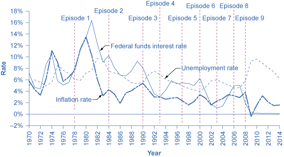

By the end of this section, you will be able to:

* Contrast expansionary monetary policy and contractionary monetary policy
* Explain how monetary policy impacts interest rates and aggregate demand
* Evaluate Federal Reserve decisions over the last forty years
* Explain the significance of quantitative easing (QE)

A monetary policy that lowers interest rates and stimulates borrowing is known as an **expansionary monetary policy**{: data-type="term"} or **loose monetary policy**{: data-type="term"}. Conversely, a monetary policy that raises interest rates and reduces borrowing in the economy is a **contractionary monetary policy**{: data-type="term"} or **tight monetary policy**{: data-type="term"}. This module will discuss how expansionary and contractionary monetary policies affect interest rates and aggregate demand, and how such policies will affect macroeconomic goals like unemployment and inflation. We will conclude with a look at the Fed’s monetary policy practice in recent decades.

# The Effect of Monetary Policy on Interest Rates

Consider the market for loanable bank funds, shown in [\[link\]](#CNX_Econ_C28_002). The original equilibrium (E0) occurs at an interest rate of 8% and a quantity of funds loaned and borrowed of $10 billion. An expansionary monetary policy will shift the supply of loanable funds to the right from the original supply curve (S0) to S1, leading to an equilibrium (E1) with a lower interest rate of 6% and a quantity of funds loaned of $14 billion. Conversely, a contractionary monetary policy will shift the supply of loanable funds to the left from the original supply curve (S0) to S2, leading to an equilibrium (E2) with a higher interest rate of 10% and a quantity of funds loaned of $8 billion.

  to the new supply curve (S1) and to a new equilibrium of E1, reducing the interest rate from 8% to 6%. A contractionary monetary policy will shift the supply of loanable funds to the left from the original supply curve (S0) to the new supply (S2), and raise the interest rate from 8% to 10%."){: #CNX_Econ_C28_002 data-title="Monetary Policy and Interest Rates "}

So how does a central bank “raise” interest rates? When describing the monetary policy actions taken by a central bank, it is common to hear that the central bank “raised interest rates” or “lowered interest rates.” We need to be clear about this: more precisely, through open market operations the central bank changes bank reserves in a way which affects the supply curve of loanable funds. As a result, interest rates change, as shown in [\[link\]](#CNX_Econ_C28_002). If they do not meet the Fed’s target, the Fed can supply more or less reserves until interest rates do.

Recall that the specific interest rate the Fed targets is the **federal funds rate**{: data-type="term"}. The Federal Reserve has, since 1995, established its target federal funds rate in advance of any open market operations.

Of course, financial markets display a wide range of **interest rates**{: data-type="term" .no-emphasis}, representing borrowers with different risk premiums and loans that are to be repaid over different periods of time. In general, when the federal funds rate drops substantially, other interest rates drop, too, and when the federal funds rate rises, other interest rates rise. However, a fall or rise of one percentage point in the federal funds rate—which remember is for borrowing overnight—will typically have an effect of less than one percentage point on a 30-year loan to purchase a house or a three-year loan to purchase a car. Monetary policy can push the entire spectrum of interest rates higher or lower, but the specific interest rates are set by the forces of supply and demand in those specific markets for lending and borrowing.

# The Effect of Monetary Policy on Aggregate Demand

Monetary policy affects interest rates and the available quantity of loanable funds, which in turn affects several components of aggregate demand. Tight or contractionary monetary policy that leads to higher interest rates and a reduced quantity of loanable funds will reduce two components of aggregate demand. Business investment will decline because it is less attractive for firms to borrow money, and even firms that have money will notice that, with higher interest rates, it is relatively more attractive to put those funds in a financial investment than to make an investment in physical capital. In addition, higher interest rates will discourage consumer borrowing for big-ticket items like houses and cars. Conversely, loose or expansionary monetary policy that leads to lower interest rates and a higher quantity of loanable funds will tend to increase business investment and consumer borrowing for big-ticket items.

If the economy is suffering a recession and high unemployment, with output below **potential GDP**{: data-type="term" .no-emphasis}, expansionary monetary policy can help the economy return to potential GDP. [\[link\]](#CNX_Econv1-2_C28_08) (a) illustrates this situation. This example uses a short-run upward-sloping **Keynesian aggregate supply curve**{: data-type="term" .no-emphasis} (SRAS). The original equilibrium during a recession of E0 occurs at an output level of 600. An expansionary monetary policy will reduce interest rates and stimulate investment and consumption spending, causing the original aggregate demand curve (AD0) to shift right to AD1, so that the new equilibrium (E1) occurs at the potential GDP level of 700.

 The economy is originally in a recession with the equilibrium output and price level shown at E0. Expansionary monetary policy will reduce interest rates and shift aggregate demand to the right from AD0 to AD1, leading to the new equilibrium (E1) at the potential GDP level of output with a relatively small rise in the price level. (b) The economy is originally producing above the potential GDP level of output at the equilibrium E0 and is experiencing pressures for an inflationary rise in the price level. Contractionary monetary policy will shift aggregate demand to the left from AD0 to AD1, thus leading to a new equilibrium (E1) at the potential GDP level of output."){: #CNX_Econv1-2_C28_08 data-title="Expansionary or Contractionary Monetary Policy "}

Conversely, if an economy is producing at a quantity of output above its potential GDP, a contractionary monetary policy can reduce the inflationary pressures for a rising price level. In [\[link\]](#CNX_Econv1-2_C28_08) (b), the original equilibrium (E0) occurs at an output of 750, which is above potential GDP. A contractionary monetary policy will raise interest rates, discourage borrowing for investment and consumption spending, and cause the original demand curve (AD0) to shift left to AD1, so that the new equilibrium (E1) occurs at the potential GDP level of 700.

These examples suggest that monetary policy should be **countercyclical**{: data-type="term"}; that is, it should act to counterbalance the business cycles of economic downturns and upswings. Monetary policy should be loosened when a recession has caused unemployment to increase and tightened when inflation threatens. Of course, countercyclical policy does pose a danger of overreaction. If loose monetary policy seeking to end a recession goes too far, it may push aggregate demand so far to the right that it triggers inflation. If tight monetary policy seeking to reduce inflation goes too far, it may push aggregate demand so far to the left that a recession begins. [\[link\]](#CNX_Econ_C28_011) (a) summarizes the chain of effects that connect loose and tight monetary policy to changes in output and the price level.

  In expansionary monetary policy the central bank causes the supply of money and loanable funds to increase, which lowers the interest rate, stimulating additional borrowing for investment and consumption, and shifting aggregate demand right. The result is a higher price level and, at least in the short run, higher real GDP. (b) In contractionary monetary policy, the central bank causes the supply of money and credit in the economy to decrease, which raises the interest rate, discouraging borrowing for investment and consumption, and shifting aggregate demand left. The result is a lower price level and, at least in the short run, lower real GDP."){: #CNX_Econ_C28_011 data-title="The Pathways of Monetary Policy "}

# Federal Reserve Actions Over Last Four Decades

For the period from the mid-1970s up through the end of 2007, Federal Reserve monetary policy can largely be summed up by looking at how it targeted the federal funds interest rate using open market operations.

Of course, telling the story of the U.S. economy since 1975 in terms of Federal Reserve actions leaves out many other macroeconomic factors that were influencing unemployment, recession, economic growth, and inflation over this time. The nine episodes of Federal Reserve action outlined in the sections below also demonstrate that the central bank should be considered one of the leading actors influencing the macro economy. As noted earlier, the single person with the greatest power to influence the U.S. economy is probably the chairperson of the Federal Reserve.

[\[link\]](#CNX_Econv1-2_C28_10) shows how the Federal Reserve has carried out monetary policy by targeting the federal funds interest rate in the last few decades. The graph shows the federal funds interest rate (remember, this interest rate is set through open market operations), the **unemployment rate**{: data-type="term" .no-emphasis}, and the **inflation rate**{: data-type="term" .no-emphasis} since 1975. Different episodes of monetary policy during this period are indicated in the figure.

 {: #CNX_Econv1-2_C28_10 data-title="Monetary Policy, Unemployment, and Inflation "}

**Episode 1**

Consider Episode 1 in the late 1970s. The rate of inflation was very high, exceeding 10% in 1979 and 1980, so the Federal Reserve used tight monetary policy to raise interest rates, with the federal funds rate rising from 5.5% in 1977 to 16.4% in 1981. By 1983, inflation was down to 3.2%, but aggregate demand contracted sharply enough that back-to-back recessions occurred in 1980 and in 1981–1982, and the unemployment rate rose from 5.8% in 1979 to 9.7% in 1982.

**Episode 2**

In Episode 2, when the Federal Reserve was persuaded in the early 1980s that inflation was declining, the Fed began slashing interest rates to reduce unemployment. The federal funds interest rate fell from 16.4% in 1981 to 6.8% in 1986. By 1986 or so, inflation had fallen to about 2% and the unemployment rate had come down to 7%, and was still falling.

**Episode 3**

However, in Episode 3 in the late 1980s, inflation appeared to be creeping up again, rising from 2% in 1986 up toward 5% by 1989. In response, the Federal Reserve used contractionary monetary policy to raise the federal funds rates from 6.6% in 1987 to 9.2% in 1989. The tighter monetary policy stopped inflation, which fell from above 5% in 1990 to under 3% in 1992, but it also helped to cause the recession of 1990–1991, and the unemployment rate rose from 5.3% in 1989 to 7.5% by 1992.

**Episode 4**

In Episode 4, in the early 1990s, when the Federal Reserve was confident that inflation was back under control, it reduced interest rates, with the federal funds interest rate falling from 8.1% in 1990 to 3.5% in 1992. As the economy expanded, the unemployment rate declined from 7.5% in 1992 to less than 5% by 1997.

**Episodes 5 and 6**

In Episodes 5 and 6, the Federal Reserve perceived a risk of inflation and raised the federal funds rate from 3% to 5.8% from 1993 to 1995. Inflation did not rise, and the period of economic growth during the 1990s continued. Then in 1999 and 2000, the Fed was concerned that inflation seemed to be creeping up so it raised the federal funds interest rate from 4.6% in December 1998 to 6.5% in June 2000. By early 2001, inflation was declining again, but a recession occurred in 2001. Between 2000 and 2002, the unemployment rate rose from 4.0% to 5.8%.

**Episodes 7 and 8**

In Episodes 7 and 8, the Federal Reserve conducted a loose monetary policy and slashed the federal funds rate from 6.2% in 2000 to just 1.7% in 2002, and then again to 1% in 2003. They actually did this because of fear of Japan-style deflation; this persuaded them to lower the Fed funds further than they otherwise would have. The recession ended, but, unemployment rates were slow to decline in the early 2000s. Finally, in 2004, the unemployment rate declined and the Federal Reserve began to raise the federal funds rate until it reached 5% by 2007.

**Episode 9**

In Episode 9, as the Great Recession took hold in 2008, the Federal Reserve was quick to slash interest rates, taking them down to 2% in 2008 and to nearly 0% in 2009. When the Fed had taken interest rates down to near-zero by December 2008, the economy was still deep in recession. Open market operations could not make the interest rate turn negative. The Federal Reserve had to think “outside the box.”

# Quantitative Easing

The most powerful and commonly used of the three traditional tools of monetary policy—open market operations—works by expanding or contracting the money supply in a way that influences the interest rate. In late 2008, as the U.S. economy struggled with recession, the Federal Reserve had already reduced the interest rate to near-zero. With the recession still ongoing, the Fed decided to adopt an innovative and nontraditional policy known as **quantitative easing (QE)**{: data-type="term"}. This is the purchase of long-term government and private mortgage-backed securities by central banks to make credit available so as to stimulate **aggregate demand**{: data-type="term" .no-emphasis}.

Quantitative easing differed from traditional monetary policy in several key ways. First, it involved the Fed purchasing long term **Treasury bonds**{: data-type="term" .no-emphasis}, rather than short term **Treasury bills**{: data-type="term" .no-emphasis}. In 2008, however, it was impossible to stimulate the economy any further by lowering short term rates because they were already as low as they could get. (Read the closing Bring it Home feature for more on this.) Therefore, Bernanke sought to lower long-term rates utilizing quantitative easing.

This leads to a second way QE is different from traditional monetary policy. Instead of purchasing Treasury securities, the Fed also began purchasing private mortgage-backed securities, something it had never done before. During the financial crisis, which precipitated the recession, mortgage-backed securities were termed “toxic assets,” because when the housing market collapsed, no one knew what these securities were worth, which put the financial institutions which were holding those securities on very shaky ground. By offering to purchase mortgage-backed securities, the Fed was both pushing long term interest rates down and also removing possibly “toxic assets” from the balance sheets of private financial firms, which would strengthen the financial system.

Quantitative easing (QE) occurred in three episodes: 

During QE1, which began in November 2008, the Fed purchased $600 billion in mortgage-backed securities from government enterprises Fannie Mae and Freddie Mac.

In November 2010, the Fed began QE2, in which it purchased $600 billion in U.S. Treasury bonds.

QE3, began in September 2012 when the Fed commenced purchasing $40 billion of additional mortgage-backed securities per month. This amount was increased in December 2012 to $85 billion per month. The Fed stated that, when economic conditions permit, it will begin tapering (or reducing the monthly purchases). By October 2014, the Fed had announced the final $15 billion purchase of bonds, ending Quantitative Easing.

The quantitative easing policies adopted by the Federal Reserve (and by other central banks around the world) are usually thought of as temporary emergency measures. If these steps are, indeed, to be temporary, then the Federal Reserve will need to stop making these additional loans and sell off the financial securities it has accumulated. The concern is that the process of quantitative easing may prove more difficult to reverse than it was to enact. The evidence suggests that QE1 was somewhat successful, but that QE2 and QE3 have been less so.

# Key Concepts and Summary

An expansionary (or loose) monetary policy raises the quantity of money and credit above what it otherwise would have been and reduces interest rates, boosting aggregate demand, and thus countering recession. A contractionary monetary policy, also called a tight monetary policy, reduces the quantity of money and credit below what it otherwise would have been and raises interest rates, seeking to hold down inflation. During the 2008–2009 recession, central banks around the world also used quantitative easing to expand the supply of credit.

# Self-Check Questions

Why does contractionary monetary policy cause interest rates to rise?

Contractionary policy reduces the amount of loanable funds in the economy. As with all goods, greater scarcity leads a greater price, so the interest rate, or the price of borrowing money, rises.

Why does expansionary monetary policy causes interest rates to drop?

An increase in the amount of available loanable funds means that there are more people who want to lend. They, therefore, bid the price of borrowing (the interest rate) down.

# Review Questions

How do the expansionary and contractionary monetary policy affect the quantity of money?

How do tight and loose monetary policy affect interest rates?

How do expansionary, tight, contractionary, and loose monetary policy affect aggregate demand?

Which kind of monetary policy would you expect in response to high inflation: expansionary or contractionary? Why?

Explain how to use quantitative easing to stimulate aggregate demand.

# Critical Thinking Question

A well-known economic model called the Phillips Curve (discussed in [The Keynesian Perspective](/m48749){: .target-chapter} chapter) describes the short run tradeoff typically observed between inflation and unemployment. Based on the discussion of expansionary and contractionary monetary policy, explain why one of these variables usually falls when the other rises.

## Glossary
{: data-type="glossary-title"}

contractionary monetary policy
: a monetary policy that reduces the supply of money and loans
{: .definition}

countercyclical
: moving in the opposite direction of the business cycle of economic downturns and upswings
{: .definition}

expansionary monetary policy
: a monetary policy that increases the supply of money and the quantity of loans
{: .definition}

federal funds rate
: the interest rate at which one bank lends funds to another bank overnight
{: .definition}

loose monetary policy
: see expansionary monetary policy
{: .definition}

quantitative easing (QE)
: the purchase of long term government and private mortgage-backed securities by central banks to make credit available in hopes of stimulating aggregate demand
{: .definition}

tight monetary policy
: see contractionary monetary policy
{: .definition}

