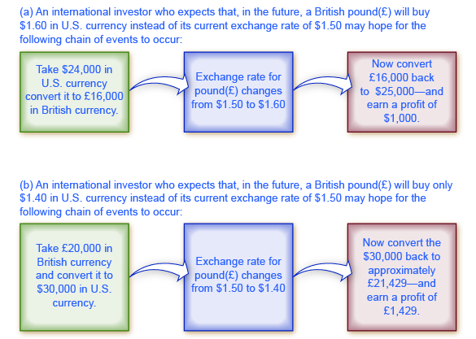
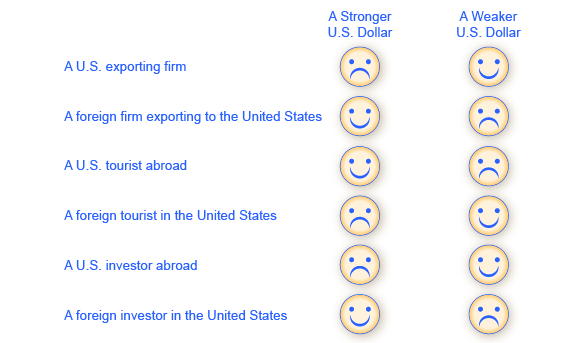

By the end of this section, you will be able to:

* Define \"foreign exchange market\"
* Describe different types of investments like foreign direct investments (FDI), portfolio investments, and hedging
* Explain how the appreciating or depreciating of currency affects exchange rates
* Identify who benefits from a stronger currency and benefits from a weaker currency

Most countries have different currencies, but not all. Sometimes small economies use the currency of an economically larger neighbor. For example, Ecuador, El Salvador, and Panama have decided to **dollarize**{: data-type="term"}—that is, to use the U.S. dollar as their currency. Sometimes nations share a common currency. A large-scale example of a common currency is the decision by 17 European nations—including some very large economies such as France, Germany, and Italy—to replace their former currencies with the euro. With these exceptions duly noted, most of the international economy takes place in a situation of multiple national currencies in which both people and firms need to convert from one currency to another when selling, buying, hiring, borrowing, traveling, or investing across national borders. The market in which people or firms use one currency to purchase another currency is called the **foreign exchange market**{: data-type="term"}.

You have encountered the basic concept of exchange rates in earlier chapters. In [The International Trade and Capital Flows](/m48731){: .target-chapter}, for example, we discussed how exchange rates are used to compare **GDP**{: data-type="term" .no-emphasis} statistics from countries where GDP is measured in different currencies. These earlier examples, however, took the actual exchange rate as given, as if it were a fact of nature. In reality, the exchange rate is a price—the price of one currency expressed in terms of units of another currency. The key framework for analyzing prices, whether in this course, any other economics course, in public policy, or business examples, is the operation of supply and demand in markets.

Visit this [website][1] for an exchange rate calculator.

  

### The Extraordinary Size of the Foreign Exchange Markets

The quantities traded in foreign exchange markets are breathtaking. A survey done in April, 2013 by the Bank of International Settlements, an international organization for banks and the financial industry, found that $5.3 trillion *per day* was traded on foreign exchange markets, which makes the foreign exchange market the largest market in the world economy. In contrast, 2013 U.S. real GDP was $15.8 trillion *per year*.

[\[link\]](#Table_29_01) shows the currencies most commonly traded on foreign exchange markets. The foreign exchange market is dominated by the U.S. dollar, the currencies used by nations in Western Europe (the euro, the British pound, and the Australian dollar), and the Japanese yen.

<table id="Table_29_01" summary="This table has two columns and ten rows. the first row is a header row and it labels the columns &#x201C;Currency&#x201D; and &#x201C;%Daily Share&#x201D;. Under the &#x201C;Currency&#x201D; column, are the following monetary units: U.S. dollar, Euro, Japanese yen, British pound, Australian dollar, Swiss franc, Canadian dollar, Mexican peso, and Chinese yuan. Under the &#x201C;% Daily Share&#x201D; column are the following percentages: 87.0%, 33.4%, 23.0%, 11.8%, 8.6%, 5.2%, 4.6%, 2.5%, 2.2%."><caption>Currencies Traded Most on Foreign Exchange Markets as of April, 2013(Source: http://www.bis.org/publ/rpfx13fx.pdf)</caption><thead>
<tr>
<th>Currency</th>
<th>% Daily Share</th>
</tr>
</thead><tbody>
<tr>
<td>U.S. dollar</td>
<td>87.0%</td>
</tr>
<tr>
<td>Euro</td>
<td>33.4%</td>
</tr>
<tr>
<td>Japanese yen</td>
<td>23.0%</td>
</tr>
<tr>
<td>British pound</td>
<td>11.8%</td>
</tr>
<tr>
<td>Australian dollar</td>
<td>  8.6%</td>
</tr>
<tr>
<td>Swiss franc</td>
<td>  5.2%</td>
</tr>
<tr>
<td>Canadian dollar</td>
<td>  4.6%</td>
</tr>
<tr>
<td>Mexican peso</td>
<td>  2.5%</td>
</tr>
<tr>
<td>Chinese yuan</td>
<td>  2.2%</td>
</tr>
</tbody></table>

### Demanders and Suppliers of Currency in Foreign Exchange Markets

In foreign exchange markets, demand and supply become closely interrelated, because a person or firm who demands one currency must at the same time supply another currency—and vice versa. To get a sense of this, it is useful to consider four groups of people or firms who participate in the market: (1) **firms**{: data-type="term" .no-emphasis} that are involved in international trade of goods and services; (2) tourists visiting other countries; (3) international investors buying ownership (or part-ownership) of a foreign firm; (4) international investors making financial investments that do not involve ownership. Let’s consider these categories in turn.

Firms that buy and sell on international markets find that their costs for workers, suppliers, and investors are measured in the currency of the nation where their production occurs, but their revenues from sales are measured in the currency of the different nation where their sales happened. So, a Chinese firm exporting abroad will earn some other currency—say, U.S. dollars—but will need Chinese yuan to pay the workers, suppliers, and investors who are based in China. In the foreign exchange markets, this firm will be a supplier of U.S. dollars and a demander of Chinese yuan.

International tourists will supply their home currency to receive the currency of the country they are visiting. For example, an American tourist who is visiting China will supply U.S. dollars into the foreign exchange market and demand Chinese yuan.

Financial investments that cross international boundaries, and require exchanging currency, are often divided into two categories. **Foreign direct investment (FDI)**{: data-type="term"} refers to purchasing a firm (at least ten percent) in another country or starting up a new enterprise in a foreign country For example, in 2008 the Belgian beer-brewing company InBev bought the U.S. beer-maker Anheuser-Busch for $52 billion. To make this purchase of a U.S. firm, InBev would have to supply euros (the currency of Belgium) to the foreign exchange market and demand U.S. dollars.

The other kind of international financial investment, **portfolio investment**{: data-type="term"}, involves a purely financial investment that does not entail any management responsibility. An example would be a U.S. financial investor who purchased bonds issued by the government of the United Kingdom, or deposited money in a British bank. To make such investments, the American investor would supply U.S. dollars in the foreign exchange market and demand British pounds.

Portfolio investment is often linked to expectations about how exchange rates will shift. Look at a U.S. financial investor who is considering purchasing bonds issued in the United Kingdom. For simplicity, ignore any interest paid by the bond (which will be small in the short run anyway) and focus on exchange rates. Say that a British pound is currently worth $1.50 in U.S. currency. However, the investor believes that in a month, the British pound will be worth $1.60 in U.S. currency. Thus, as [\[link\]](#CNX_Econ_C29_020) (a) shows, this investor would change $24,000 for 16,000 British pounds. In a month, if the pound is indeed worth $1.60, then the portfolio investor can trade back to U.S. dollars at the new exchange rate, and have $25,600—a nice profit. A portfolio investor who believes that the foreign exchange rate for the pound will work in the opposite direction can also invest accordingly. Say that an investor expects that the pound, now worth $1.50 in U.S. currency, will decline to $1.40. Then, as shown in [\[link\]](#CNX_Econ_C29_020) (b), that investor could start off with £20,000 in British currency (borrowing the money if necessary), convert it to $30,000 in U.S. currency, wait a month, and then convert back to approximately £21,429 in British currency—again making a nice profit. Of course, this kind of investing comes without guarantees, and an investor will suffer losses if the exchange rates do not move as predicted.

 {: #CNX_Econ_C29_020 data-title="A Portfolio Investor Trying to Benefit from Exchange Rate Movements "}

Many portfolio investment decisions are not as simple as betting that the value of the currency will change in one direction or the other. Instead, they involve firms trying to protect themselves from movements in exchange rates. Imagine you are running a U.S. firm that is exporting to France. You have signed a contract to deliver certain products and will receive 1 million euros a year from now. But you do not know how much this contract will be worth in U.S. dollars, because the dollar/euro exchange rate can fluctuate in the next year. Let’s say you want to know for sure what the contract will be worth, and not take a risk that the euro will be worth less in U.S. dollars than it currently is. You can **hedge**{: data-type="term"}, which means using a financial transaction to protect yourself against a risk from one of your investments (in this case, currency risk from the contract). Specifically, you can sign a financial contract and pay a fee that guarantees you a certain exchange rate one year from now—regardless of what the market exchange rate is at that time. Now, it is possible that the euro will be worth more in dollars a year from now, so your hedging contract will be unnecessary, and you will have paid a fee for nothing. But if the value of the euro in dollars declines, then you are protected by the hedge. Financial contracts like hedging, where parties wish to be protected against exchange rate movements, also commonly lead to a series of portfolio investments by the firm that is receiving a fee to provide the hedge.

Both foreign direct investment and portfolio investment involve an investor who supplies domestic currency and demands a foreign currency. With portfolio investment less than ten percent of a company is purchased. As such, portfolio investment is often made with a short term focus. With foreign direct investment more than ten percent of a company is purchased and the investor typically assumes some managerial responsibility; thus foreign direct investment tends to have a more long-run focus. As a practical matter, portfolio investments can be withdrawn from a country much more quickly than foreign direct investments. A U.S. portfolio investor who wants to buy or sell bonds issued by the government of the United Kingdom can do so with a phone call or a few clicks of a computer key. However, a U.S. firm that wants to buy or sell a company, such as one that manufactures automobile parts in the United Kingdom, will find that planning and carrying out the transaction takes a few weeks, even months. [\[link\]](#Table_29_02) summarizes the main categories of demanders and suppliers of currency.

<table id="Table_29_02" summary="This table has two columns and five rows. The first row is a header row, and it labels the columns &#x201C;Demand for the U.S. Dollar Comes from...&#x201D; and &#x201C;Supply of the U.S. Dollar Comes from...&#x201D;. Under the column &#x201C;Demand for the U.S. Dollar Comes from...&#x201D; are four sources: A U.S. exporting firm that earned foreign currency and is trying to pay U.S.-based expenses, Foreign tourists visiting the United States, Foreign investors who wish to make direct investments in the U.S. economy, and Foreign investors who wish to make portfolio investments in the U.S. Under the column &#x201C;Supply of the U.S. Dollar Comes from...&#x201D; are the following suppliers: A foreign firm that has sold imported goods in the United States, earned U.S. dollars, and is trying to pay expenses incurred in its home country, U.S. tourists leaving to visit other countries, U.S. investors who want to make foreign direct investments in other countries, and U.S. investors who want to make portfolio investments in other countries."><caption>The Demand and Supply Line-ups in Foreign Exchange Markets</caption><thead>
<tr>
<th>Demand for the U.S. Dollar Comes from…</th>
<th>Supply of the U.S. Dollar Comes from…</th>
</tr>
</thead><tbody>
<tr>
<td>A U.S. exporting firm that earned foreign currency and is trying to pay U.S.-based expenses</td>
<td>A foreign firm that has sold imported goods in the United States, earned U.S. dollars, and is trying to pay expenses incurred in its home country</td>
</tr>
<tr>
<td>Foreign tourists visiting the United States</td>
<td>U.S. tourists leaving to visit other countries</td>
</tr>
<tr>
<td>Foreign investors who wish to make direct investments in the U.S. economy</td>
<td>U.S. investors who want to make foreign direct investments in other countries</td>
</tr>
<tr>
<td>Foreign investors who wish to make portfolio investments in the U.S. economy</td>
<td>U.S. investors who want to make portfolio investments in other countries</td>
</tr>
</tbody></table>

### Participants in the Exchange Rate Market

The foreign exchange market does not involve the ultimate suppliers and demanders of foreign exchange literally seeking each other out. If Martina decides to leave her home in Venezuela and take a trip in the United States, she does not need to find a U.S. citizen who is planning to take a vacation in Venezuela and arrange a person-to-person currency trade. Instead, the foreign exchange market works through financial institutions, and it operates on several levels.

Most people and firms who are exchanging a substantial quantity of currency go to a bank, and most banks provide foreign exchange as a service to customers. These banks (and a few other firms), known as **dealers**{: data-type="term" .no-emphasis}, then trade the foreign exchange. This is called the **interbank market**{: data-type="term" .no-emphasis}.

In the world economy, roughly 2,000 firms are foreign exchange dealers. The U.S. economy has less than 100 foreign exchange dealers, but the largest 12 or so dealers carry out more than half the total transactions. The foreign exchange market has no central location, but the major dealers keep a close watch on each other at all times.

The foreign exchange market is huge not because of the demands of tourists, firms, or even foreign direct investment, but instead because of portfolio investment and the actions of interlocking foreign exchange dealers. International tourism is a very large industry, involving about $1 trillion per year. Global exports are about 23% of global GDP; which is about $18 trillion per year. Foreign direct investment totaled about $1.5 trillion in the end of 2013. These quantities are dwarfed, however, by the $5.3 trillion *per day* being traded in foreign exchange markets. Most transactions in the foreign exchange market are for portfolio investment—relatively short-term movements of financial capital between currencies—and because of the actions of the large foreign exchange dealers as they constantly buy and sell with each other.

### Strengthening and Weakening Currency

When the prices of most goods and services change, the price is said to “rise” or “fall.” For exchange rates, the terminology is different. When the exchange rate for a currency rises, so that the currency exchanges for more of other currencies, it is referred to as **appreciating**{: data-type="term"} or “strengthening.” When the exchange rate for a currency falls, so that a currency trades for less of other currencies, it is referred to as **depreciating**{: data-type="term"} or “weakening.”

To illustrate the use of these terms, consider the exchange rate between the U.S. dollar and the Canadian dollar since 1980, shown in [\[link\]](#CNX_Econv1-2_C29_03) (a). The vertical axis in [\[link\]](#CNX_Econv1-2_C29_03) (a) shows the price of $1 in U.S. currency, measured in terms of Canadian currency. Clearly, exchange rates can move up and down substantially. A U.S. dollar traded for $1.17 Canadian in 1980. The U.S. dollar appreciated or strengthened to $1.39 Canadian in 1986, depreciated or weakened to $1.15 Canadian in 1991, and then appreciated or strengthened to $1.60 Canadian by early in 2002, fell to roughly $1.20 Canadian in 2009, and then had a sharp spike up and decline in 2009 and 2010. The units in which exchange rates are measured can be confusing, because the exchange rate of the U.S. dollar is being measured using a different currency—the Canadian dollar. But exchange rates always measure the price of one unit of currency by using a different currency.

 , it is clear that the values in part (a) are a mirror image of part (b), which demonstrates that the depreciation of one currency correlates to the appreciation of the other and vice versa.  This means that when comparing the exchange rates between two countries (in this case, the United States and Canada), the depreciation (or weakening) of one country (the U.S. dollar for this example) indicates the appreciation (or strengthening) of the other currency (which in this example is the Canadian dollar). (Source: Federal Reserve Economic Data (FRED) (a) https://research.stlouisfed.org/fred2/series/EXCAUS ; (b) https://research.stlouisfed.org/fred2/series/CCUSSP01CAQ650N)"){: #CNX_Econv1-2_C29_03 data-title="Strengthen or Appreciate vs. Weaken or Depreciate "}

In looking at the exchange rate between two currencies, the appreciation or strengthening of one currency must mean the depreciation or weakening of the other. [\[link\]](#CNX_Econv1-2_C29_03) (b) shows the exchange rate for the Canadian dollar, measured in terms of U.S. dollars. The exchange rate of the U.S. dollar measured in Canadian dollars, shown in [\[link\]](#CNX_Econv1-2_C29_03) (a), is a perfect mirror image with the exchange rate of the Canadian dollar measured in U.S. dollars, shown in [\[link\]](#CNX_Econv1-2_C29_03) (b). A fall in the Canada $/U.S. $ ratio means a rise in the U.S. $/Canada $ ratio, and vice versa.

With the price of a typical good or service, it is clear that higher prices benefit sellers and hurt buyers, while lower prices benefit buyers and hurt sellers. In the case of exchange rates, where the buyers and sellers are not always intuitively obvious, it is useful to trace through how different participants in the market will be affected by a stronger or weaker currency. Consider, for example, the impact of a stronger U.S. dollar on six different groups of economic actors, as shown in [\[link\]](#CNX_Econ_C29_005)\: (1) U.S. exporters selling abroad; (2) foreign exporters (that is, firms selling imports in the U.S. economy); (3) U.S. tourists abroad; (4) foreign tourists visiting the United States; (5) U.S. investors (either foreign direct investment or portfolio investment) considering opportunities in other countries; (6) and foreign investors considering opportunities in the U.S. economy.

 {: #CNX_Econ_C29_005 data-title="How Do Exchange Rate Movements Affect Each Group? "}

For a U.S. firm selling abroad, a stronger U.S. dollar is a curse. A strong U.S. dollar means that foreign currencies are correspondingly weak. When this exporting firm earns foreign currencies through its export sales, and then converts them back to U.S. dollars to pay workers, suppliers, and investors, the stronger dollar means that the foreign currency buys fewer U.S. dollars than if the currency had not strengthened, and that the firm’s profits (as measured in dollars) fall. As a result, the firm may choose to reduce its exports, or it may raise its selling price, which will also tend to reduce its exports. In this way, a stronger currency reduces a country’s exports.

Conversely, for a foreign firm selling in the U.S. economy, a stronger dollar is a blessing. Each dollar earned through export sales, when traded back into the home currency of the exporting firm, will now buy more of the home currency than expected before the dollar had strengthened. As a result, the stronger dollar means that the importing firm will earn higher profits than expected. The firm will seek to expand its sales in the U.S. economy, or it may reduce prices, which will also lead to expanded sales. In this way, a stronger U.S. dollar means that consumers will purchase more from foreign producers, expanding the country’s level of imports.

For a U.S. tourist abroad, who is exchanging U.S. dollars for foreign currency as necessary, a stronger U.S. dollar is a benefit. The tourist receives more foreign currency for each U.S. dollar, and consequently the cost of the trip in U.S. dollars is lower. When a country’s currency is strong, it is a good time for citizens of that country to tour abroad. Imagine a U.S. tourist who has saved up $5,000 for a trip to South Africa. In January 2008, $1 bought 7 South African rand, so the tourist had 35,000 rand to spend. In January 2009, $1 bought 10 rand, so the tourist had 50,000 rand to spend. By January 2010, $1 bought only 7.5 rand. Clearly, 2009 was the year for U.S. tourists to visit South Africa. For foreign visitors to the United States, the opposite pattern holds true. A relatively stronger U.S. dollar means that their own currencies are relatively weaker, so that as they shift from their own currency to U.S. dollars, they have fewer U.S. dollars than previously. When a country’s currency is strong, it is not an especially good time for foreign tourists to visit.

A stronger dollar injures the prospects of a U.S. financial investor who has already invested money in another country. A U.S. financial investor abroad must first convert U.S. dollars to a foreign currency, invest in a foreign country, and then later convert that foreign currency back to U.S. dollars. If in the meantime the U.S. dollar becomes stronger and the foreign currency becomes weaker, then when the investor converts back to U.S. dollars, the rate of return on that investment will be less than originally expected at the time it was made.

However, a stronger U.S. dollar boosts the returns of a foreign investor putting money into a U.S. investment. That foreign investor converts from the home currency to U.S. dollars and seeks a U.S. investment, while later planning to switch back to the home currency. If, in the meantime, the dollar grows stronger, then when the time comes to convert from U.S. dollars back to the foreign currency, the investor will receive more foreign currency than expected at the time the original investment was made.

The preceding paragraphs all focus on the case where the U.S. dollar becomes stronger. The corresponding happy or unhappy economic reactions are illustrated in the first column of [\[link\]](#CNX_Econ_C29_005). The following Work It Out feature centers the analysis on the opposite: a weaker dollar.

Effects of a Weaker Dollar

Let’s work through the effects of a weaker dollar on a U.S. exporter, a foreign exporter into the United States, a U.S. tourist going abroad, a foreign tourist coming to the United States, a U.S. investor abroad, and a foreign investor in the United States.

Step 1. Note that the demand for U.S. exports is a function of the price of those exports, which depends on the dollar price of those goods and the exchange rate of the dollar in terms of foreign currency. For example, a Ford pickup truck costs $25,000 in the United States. When it is sold in the United Kingdom, the price is $25,000 / $1.50 per British pound, or £16,667. The dollar affects the price faced by foreigners who may purchase U.S. exports.

Step 2. Consider that, if the dollar weakens, the pound rises in value. If the pound rises to $2.00 per pound, then the price of a Ford pickup is now $25,000 / $2.00 = £12,500. A weaker dollar means the foreign currency buys more dollars, which means that U.S. exports appear less expensive.

Step 3. Summarize that a weaker U.S. dollar leads to an increase in U.S. exports. For a foreign exporter, the outcome is just the opposite.

Step 4. Suppose a brewery in England is interested in selling its Bass Ale to a grocery store in the United States. If the price of a six pack of Bass Ale is £6.00 and the exchange rate is $1.50 per British pound, the price for the grocery store is 6.00 × $1.50 = $9.00 per six pack. If the dollar weakens to $2.00 per pound, the price of Bass Ale is now 6.00 × $2.00 = $12.

Step 5. Summarize that, from the perspective of U.S. purchasers, a weaker dollar means that foreign currency is more expensive, which means that foreign goods are more expensive also. This leads to a decrease in U.S. imports, which is bad for the foreign exporter.

Step 6. Consider U.S. tourists going abroad. They face the same situation as a U.S. importer—they are purchasing a foreign trip. A weaker dollar means that their trip will cost more, since a given expenditure of foreign currency (e.g., hotel bill) will take more dollars. The result is that the tourist may not stay as long abroad, and some may choose not to travel at all.

Step 7. Consider that, for the foreign tourist to the United States, a weaker dollar is a boon. It means their currency goes further, so the cost of a trip to the United States will be less. Foreigners may choose to take longer trips to the United States, and more foreign tourists may decide to take U.S. trips.

Step 8. Note that a U.S. investor abroad faces the same situation as a U.S. importer—they are purchasing a foreign asset. A U.S. investor will see a weaker dollar as an increase in the “price” of investment, since the same number of dollars will buy less foreign currency and thus less foreign assets. This should decrease the amount of U.S. investment abroad.

Step 9. Note also that foreign investors in the Unites States will have the opposite experience. Since foreign currency buys more dollars, they will likely invest in more U.S. assets.

At this point, you should have a good sense of the major players in the foreign exchange market: firms involved in international trade, tourists, international financial investors, banks, and foreign exchange dealers. The next module shows how the tools of demand and supply can be used in foreign exchange markets to explain the underlying causes of stronger and weaker currencies (“stronger” and “weaker” addressed more in the following Clear It Up feature).

Why is a stronger currency not necessarily better?

One common misunderstanding about exchange rates is that a “stronger” or “appreciating” currency must be better than a “weaker” or “depreciating” currency. After all, is it not obvious that “strong” is better than “weak”? But do not let the terminology confuse you. When a currency becomes stronger, so that it purchases more of other currencies, it benefits some in the economy and injures others. Stronger currency is not necessarily better, it is just different.

### Key Concepts and Summary

In the foreign exchange market, people and firms exchange one currency to purchase another currency. The demand for dollars comes from those U.S. export firms seeking to convert their earnings in foreign currency back into U.S. dollars; foreign tourists converting their earnings in a foreign currency back into U.S. dollars; and foreign investors seeking to make financial investments in the U.S. economy. On the supply side of the foreign exchange market for the trading of U.S. dollars are foreign firms that have sold imports in the U.S. economy and are seeking to convert their earnings back to their home currency; U.S. tourists abroad; and U.S. investors seeking to make financial investments in foreign economies. When currency A can buy more of currency B, then currency A has strengthened or appreciated relative to B. When currency A can buy less of currency B, then currency A has weakened or depreciated relative to B. If currency A strengthens or appreciates relative to currency B, then currency B must necessarily weaken or depreciate with regard to currency A. A stronger currency benefits those who are buying with that currency and injures those who are selling. A weaker currency injures those, like importers, who are buying with that currency and benefits those who are selling with it, like exporters.

### Self-Check Questions

How will a stronger euro affect the following economic agents?

1.  A British exporter to Germany.
2.  A Dutch tourist visiting Chile.
3.  A Greek bank investing in a Canadian government bond.
4.  A French exporter to Germany.
{: type="a"}

1.  The British use the pound sterling, while Germans use the euro, so a British exporter will receive euros from export sales, which will need to be exchanged for pounds. A stronger euro will mean more pounds per euro, so the exporter will be better off. In addition, the lower price for German imports will stimulate demand for British exports. For both these reasons, a stronger euro benefits the British exporter.
2.  The Dutch use euros while the Chileans use pesos, so the Dutch tourist needs to turn euros into Chilean pesos. An increase in the euro means that the tourist will get more pesos per euro. As a consequence, the Dutch tourist will have a less expensive vacation than he planned, so the tourist will be better off.
3.  The Greek use euros while the Canadians use dollars. An increase in the euro means it will buy more Canadian dollars. As a result, the Greek bank will see a decrease in the cost of the Canadian bonds, so it may purchase more bonds. Either way, the Greek bank benefits.
4.  Since both the French and Germans use the euro, an increase in the euro, in terms of other currencies, should have no impact on the French exporter.
{: type="a"}

### Review Questions

What is the foreign exchange market?

Describe some buyers and some sellers in the market for U.S. dollars.

What is the difference between foreign direct investment and portfolio investment?

What does it mean to hedge a financial transaction?

What does it mean to say that a currency appreciates? Depreciates? Becomes stronger? Becomes weaker?

### Critical Thinking Question

Why would a nation “dollarize”—that is, adopt another country’s currency instead of having its own?

Can you think of any major disadvantages to dollarization? How would a central bank work in a country that has dollarized?

### Problems

A British pound cost $1.56 in U.S. dollars in 1996, but $1.66 in U.S. dollars in 1998. Was the pound weaker or stronger against the dollar? Did the dollar appreciate or depreciate versus the pound?

In [[link]](#fs-idm17531680) calculate the cost of a U.S. dollar in terms of British pounds in 1996 and 1998.

### Glossary
{: data-type="glossary-title"}

appreciating
: when a currency is worth more in terms of other currencies; also called “strengthening”
^

depreciating
: when a currency is worth less in terms of other currencies; also called “weakening”
^

dollarize
: a country that is not the United States uses the U.S. dollar as its currency
^

foreign direct investment (FDI)
: purchasing more than ten percent of a firm or starting a new enterprise in another country
^

foreign exchange market
: the market in which people use one currency to buy another currency
^

hedge
: using a financial transaction as protection against risk
^

portfolio investment
: an investment in another country that is purely financial and does not involve any management responsibility

[1]: http://openstaxcollege.org/l/exratecalc
