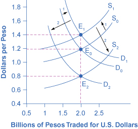
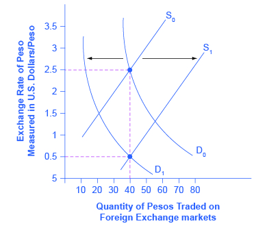

By the end of this section, you will be able to:

* Explain supply and demand for exchange rates
* Define arbitrage
* Explain purchasing power parity\'s importance when comparing countries.

The foreign exchange market involves firms, households, and investors who demand and supply currencies coming together through their banks and the key foreign exchange dealers. [\[link\]](#CNX_Econv1-2_C29_05) (a) offers an example for the exchange rate between the U.S. dollar and the Mexican peso. The vertical axis shows the exchange rate for U.S. dollars, which in this case is measured in pesos. The horizontal axis shows the quantity of U.S. dollars being traded in the foreign exchange market each day. The demand curve (D) for U.S. dollars intersects with the supply curve (S) of U.S. dollars at the equilibrium point (E), which is an exchange rate of 10 pesos per dollar and a total volume of $8.5 billion.

  The quantity measured on the horizontal axis is in U.S. dollars, and the exchange rate on the vertical axis is the price of U.S. dollars measured in Mexican pesos. (b) The quantity measured on the horizontal axis is in Mexican pesos, while the price on the vertical axis is the price of pesos measured in U.S. dollars. In both graphs, the equilibrium exchange rate occurs at point E, at the intersection of the demand curve (D) and the supply curve (S)."){: #CNX_Econv1-2_C29_05 data-title="Demand and Supply for the U.S. Dollar and Mexican Peso Exchange Rate "}

[\[link\]](#CNX_Econv1-2_C29_05) (b) presents the same demand and supply information from the perspective of the Mexican peso. The vertical axis shows the exchange rate for Mexican pesos, which is measured in U.S. dollars. The horizontal axis shows the quantity of Mexican pesos traded in the foreign exchange market. The **demand curve**{: data-type="term" .no-emphasis} (D) for Mexican pesos intersects with the **supply curve**{: data-type="term" .no-emphasis} (S) of Mexican pesos at the equilibrium point (E), which is an exchange rate of 10 cents in U.S. currency for each Mexican peso and a total volume of 85 billion pesos. Note that the two exchange rates are inverses: 10 pesos per dollar is the same as 10 cents per peso (or $0.10 per peso). In the actual foreign exchange market, almost all of the trading for Mexican pesos is done for U.S. dollars. What factors would cause the demand or supply to shift, thus leading to a change in the **equilibrium exchange rate**{: data-type="term" .no-emphasis}? The answer to this question is discussed in the following section.

# Expectations about Future Exchange Rates

One reason to demand a currency on the foreign exchange market is the belief that the value of the currency is about to increase. One reason to supply a currency—that is, sell it on the foreign exchange market—is the expectation that the value of the currency is about to decline. For example, imagine that a leading business newspaper, like the *Wall Street Journal* or the *Financial Times*, runs an article predicting that the Mexican peso will appreciate in value. The likely effects of such an article are illustrated in [\[link\]](#CNX_Econ_C29_008). Demand for the Mexican peso shifts to the right, from D0 to D1, as investors become eager to purchase pesos. Conversely, the supply of pesos shifts to the left, from S0 to S1, because investors will be less willing to give them up. The result is that the equilibrium exchange rate rises from 10 cents/peso to 12 cents/peso and the equilibrium exchange rate rises from 85 billion to 90 billion pesos as the equilibrium moves from E0 to E1.

 {: #CNX_Econ_C29_008 data-title="Exchange Rate Market for Mexican Peso Reacts to Expectations about Future Exchange Rates "}

[\[link\]](#CNX_Econ_C29_008) also illustrates some peculiar traits of supply and demand diagrams in the foreign exchange market. In contrast to all the other cases of supply and demand you have considered, in the **foreign exchange market**{: data-type="term" .no-emphasis}, supply and demand typically both move at the same time. Groups of participants in the foreign exchange market like firms and investors include some who are buyers and some who are sellers. An expectation of a future shift in the exchange rate affects both buyers and sellers—that is, it affects both demand and supply for a currency.

The shifts in demand and supply curves both cause the exchange rate to shift in the same direction; in this example, they both make the peso exchange rate stronger. However, the shifts in demand and supply work in opposing directions on the quantity traded. In this example, the rising demand for pesos is causing the quantity to rise while the falling supply of pesos is causing quantity to fall. In this specific example, the result is a higher quantity. But in other cases, the result could be that quantity remains unchanged or declines.

This example also helps to explain why exchange rates often move quite substantially in a short period of a few weeks or months. When investors expect a country’s currency to strengthen in the future, they buy the currency and cause it to appreciate immediately. The appreciation of the currency can lead other investors to believe that future appreciation is likely—and thus lead to even further appreciation. Similarly, a fear that a currency *might* weaken quickly leads to an *actual* weakening of the currency, which often reinforces the belief that the currency is going to weaken further. Thus, beliefs about the future path of exchange rates can be self-reinforcing, at least for a time, and a large share of the trading in foreign exchange markets involves dealers trying to outguess each other on what direction exchange rates will move next.

# Differences across Countries in Rates of Return

The motivation for investment, whether domestic or foreign, is to earn a return. If rates of return in a country look relatively high, then that country will tend to attract funds from abroad. Conversely, if rates of return in a country look relatively low, then funds will tend to flee to other economies. Changes in the expected rate of return will shift demand and supply for a currency. For example, imagine that interest rates rise in the United States as compared with Mexico. Thus, financial investments in the United States promise a higher return than they previously did. As a result, more investors will demand U.S. dollars so that they can buy interest-bearing assets and fewer investors will be willing to supply U.S. dollars to foreign exchange markets. Demand for the U.S. dollar will shift to the right, from D0 to D1, and supply will shift to the left, from S0 to S1, as shown in [\[link\]](#CNX_Econ_C29_009). The new equilibrium (E1), will occur at an exchange rate of nine pesos/dollar and the same quantity of $8.5 billion. Thus, a higher interest rate or rate of return relative to other countries leads a nation’s currency to appreciate or strengthen, and a lower interest rate relative to other countries leads a nation’s currency to depreciate or weaken. Since a nation’s central bank can use monetary policy to affect its interest rates, a central bank can also cause changes in exchange rates—a connection that will be discussed in more detail later in this chapter.

  has a stronger exchange rate than the original equilibrium (E0), but in this example, the equilibrium quantity traded does not change."){: #CNX_Econ_C29_009 data-title="Exchange Rate Market for U.S. Dollars Reacts to Higher Interest Rates "}

# Relative Inflation

If a country experiences a relatively high inflation rate compared with other economies, then the buying power of its currency is eroding, which will tend to discourage anyone from wanting to acquire or to hold the currency. [\[link\]](#CNX_Econ_C29_010) shows an example based on an actual episode concerning the Mexican peso. In 1986–87, Mexico experienced an inflation rate of over 200%. Not surprisingly, as inflation dramatically decreased the purchasing power of the peso in Mexico, the exchange rate value of the peso declined as well. As shown in [\[link\]](#CNX_Econ_C29_010), demand for the peso on foreign exchange markets decreased from D0 to D1, while supply of the peso increased from S0 to S1. The equilibrium exchange rate fell from $2.50 per peso at the original equilibrium (E0) to $0.50 per peso at the new equilibrium (E1). In this example, the quantity of pesos traded on foreign exchange markets remained the same, even as the exchange rate shifted.

 {: #CNX_Econ_C29_010 data-title="Exchange Rate Markets React to Higher Inflation "}

Visit this [website][1] to learn about the Big Mac index.

  

# Purchasing Power Parity

Over the long term, exchange rates must bear some relationship to the buying power of the currency in terms of goods that are internationally traded. If at a certain exchange rate it was much cheaper to buy internationally traded goods—such as oil, steel, computers, and cars—in one country than in another country, businesses would start buying in the cheap country, selling in other countries, and pocketing the profits.

For example, if a U.S. dollar is worth $1.60 in Canadian currency, then a car that sells for $20,000 in the United States should sell for $32,000 in Canada. If the price of cars in Canada was much lower than $32,000, then at least some U.S. car-buyers would convert their U.S. dollars to Canadian dollars and buy their cars in Canada. If the price of cars was much higher than $32,000 in this example, then at least some Canadian buyers would convert their Canadian dollars to U.S. dollars and go to the United States to purchase their cars. This is known as **arbitrage**{: data-type="term"}, the process of buying and selling goods or currencies across international borders at a profit. It may occur slowly, but over time, it will force prices and exchange rates to align so that the price of internationally traded goods is similar in all countries.

The exchange rate that equalizes the prices of internationally traded goods across countries is called the **purchasing power parity (PPP)**{: data-type="term"} exchange rate. A group of economists at the International Comparison Program, run by the World Bank, have calculated the PPP exchange rate for all countries, based on detailed studies of the prices and quantities of internationally tradable goods.

The purchasing power parity exchange rate has two functions. First, PPP exchange rates are often used for international comparison of GDP and other economic statistics. Imagine that you are preparing a table showing the size of **GDP**{: data-type="term" .no-emphasis} in many countries in several recent years, and for ease of comparison, you are converting all the values into U.S. dollars. When you insert the value for Japan, you need to use a yen/dollar exchange rate. But should you use the market exchange rate or the PPP exchange rate? Market exchange rates bounce around. In summer 2008, the exchange rate was 108 yen/dollar, but in late 2009 the U.S. dollar exchange rate versus the yen was 90 yen/dollar. For simplicity, say that Japan’s GDP was ¥500 trillion in both 2008 and 2009. If you use the market exchange rates, then Japan’s GDP will be $4.6 trillion in 2008 (that is, ¥500 trillion /(¥108/dollar)) and $5.5 trillion in 2009 (that is, ¥500 trillion /(¥90/dollar)).

Of course, it is not true that Japan’s economy increased enormously in 2009—in fact, Japan had a recession like much of the rest of the world. The misleading appearance of a booming Japanese economy occurs only because we used the market exchange rate, which often has short-run rises and falls. However, PPP exchange rates stay fairly constant and change only modestly, if at all, from year to year.

The second function of PPP is that exchanges rates will often get closer and closer to it as time passes. It is true that in the short run and medium run, as exchange rates adjust to relative inflation rates, rates of return, and to expectations about how interest rates and inflation will shift, the exchange rates will often move away from the PPP exchange rate for a time. But, knowing the PPP will allow you to track and predict exchange rate relationships.

# Key Concepts and Summary

In the extreme short run, ranging from a few minutes to a few weeks, exchange rates are influenced by speculators who are trying to invest in currencies that will grow stronger, and to sell currencies that will grow weaker. Such speculation can create a self-fulfilling prophecy, at least for a time, where an expected appreciation leads to a stronger currency and vice versa. In the relatively short run, exchange rate markets are influenced by differences in rates of return. Countries with relatively high real rates of return (for example, high interest rates) will tend to experience stronger currencies as they attract money from abroad, while countries with relatively low rates of return will tend to experience weaker exchange rates as investors convert to other currencies.

In the medium run of a few months or a few years, exchange rate markets are influenced by inflation rates. Countries with relatively high inflation will tend to experience less demand for their currency than countries with lower inflation, and thus currency depreciation. Over long periods of many years, exchange rates tend to adjust toward the purchasing power parity (PPP) rate, which is the exchange rate such that the prices of internationally tradable goods in different countries, when converted at the PPP exchange rate to a common currency, are similar in all economies.

# Self-Check Questions

Suppose that political unrest in Egypt leads financial markets to anticipate a depreciation in the Egyptian pound. How will that affect the demand for pounds, supply of pounds, and exchange rate for pounds compared to, say, U.S. dollars?

Expected depreciation in a currency will lead people to divest themselves of the currency. We should expect to see an increase in the supply of pounds and a decrease in demand for pounds. The result should be a decrease in the value of the pound *vis à vis* the dollar.

Suppose U.S. interest rates decline compared to the rest of the world. What would be the likely impact on the demand for dollars, supply of dollars, and exchange rate for dollars compared to, say, euros?

Lower U.S. interest rates make U.S. assets less desirable compared to assets in the European Union. We should expect to see a decrease in demand for dollars and an increase in supply of dollars in foreign currency markets. As a result, we should expect to see the dollar depreciate compared to the euro.

Suppose Argentina gets inflation under control and the Argentine inflation rate decreases substantially. What would likely happen to the demand for Argentine pesos, the supply of Argentine pesos, and the peso/U.S. dollar exchange rate?

A decrease in Argentine inflation relative to other countries should cause an increase in demand for pesos, a decrease in supply of pesos, and an appreciation of the peso in foreign currency markets.

# Review Questions

Does an expectation of a stronger exchange rate in the future affect the exchange rate in the present? If so, how?

Does a higher rate of return in a nation’s economy, all other things being equal, affect the exchange rate of its currency? If so, how?

Does a higher inflation rate in an economy, other things being equal, affect the exchange rate of its currency? If so, how?

What is the purchasing power parity exchange rate?

# Critical Thinking Questions

If a country’s currency is expected to appreciate in value, what would you think will be the impact of expected exchange rates on yields (e.g., the interest rate paid on government bonds) in that country? *Hint*: Think about how expected exchange rate changes and interest rates affect demand and supply for a currency.

Do you think that a country experiencing hyperinflation is more or less likely to have an exchange rate equal to its purchasing power parity value when compared to a country with a low inflation rate?

[1]: http://openstaxcollege.org/l/bigmac
