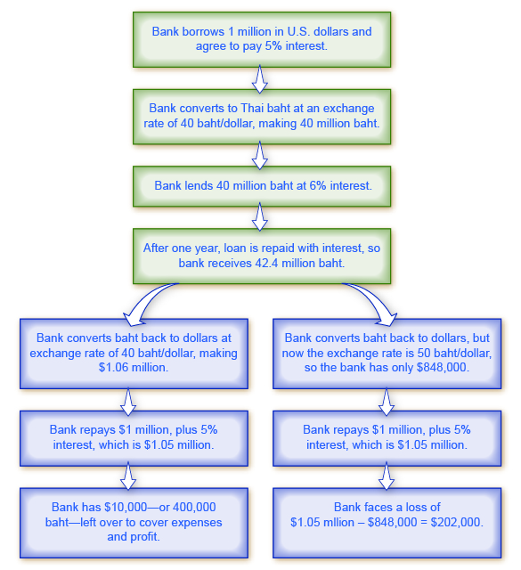

By the end of this section you will be able to:

* Explain how exchange rate shifting influences aggregate demand and supply
* Explain how loans and banks can also be influenced by shifting exchange rates

A **central bank**{: data-type="term" .no-emphasis} will be concerned about the exchange rate for multiple reasons: (1) Movements in the exchange rate will affect the quantity of aggregate demand in an economy; (2) frequent substantial fluctuations in the exchange rate can disrupt international trade and cause problems in a nation’s banking system–this may contribute to an unsustainable balance of trade and large inflows of international financial capital, which can set the economy up for a deep recession if international investors decide to move their money to another country. Let’s discuss these scenarios in turn.

### Exchange Rates, Aggregate Demand, and Aggregate Supply

Foreign trade in goods and services typically involves incurring the costs of production in one currency while receiving revenues from sales in another currency. As a result, movements in exchange rates can have a powerful effect on incentives to export and import, and thus on **aggregate demand**{: data-type="term" .no-emphasis} in the economy as a whole.

For example, in 1999, when the euro first became a currency, its value measured in U.S. currency was $1.06/euro. By the end of 2013, the euro had risen (and the U.S. dollar had correspondingly weakened) to $1.37/euro. Consider the situation of a French firm that each year incurs €10 million in costs, and sells its products in the United States for $10 million. In 1999, when this firm converted $10 million back to euros at the exchange rate of $1.06/euro (that is, $10 million × \[€1/$1.06\]), it received €9.4 million, and suffered a loss. In 2013, when this same firm converted $10 million back to euros at the exchange rate of $1.37/euro (that is, $10 million × \[€1 euro/$1.37\]), it received approximately €7.3 million and an even larger loss. This example shows how a stronger euro discourages exports by the French firm, because it makes the costs of production in the domestic currency higher relative to the sales revenues earned in another country. From the point of view of the U.S. economy, the example also shows how a weaker U.S. dollar encourages **exports**{: data-type="term" .no-emphasis}.

Since an increase in exports results in more dollars flowing into the economy, and an increase in imports means more dollars are flowing out, it is easy to conclude that exports are “good” for the economy and imports are “bad,” but this overlooks the role of exchange rates. If an American consumer buys a Japanese car for $20,000 instead of an American car for $30,000, it may be tempting to argue that the American economy has lost out. However, the Japanese company will have to convert those dollars to yen to pay its workers and operate its factories. Whoever buys those dollars will have to use them to purchase American goods and services, so the money comes right back into the American economy. At the same time, the consumer saves money by buying a less expensive import, and can use the extra money for other purposes.

### Fluctuations in Exchange Rates

Exchange rates can fluctuate a great deal in the short run. As yet one more example, the Indian rupee moved from 39 rupees/dollar in February 2008 to 51 rupees/dollar in March 2009, a decline of more than one-fourth in the value of the rupee on foreign exchange markets. [\[link\]](#CNX_Econ_C29_014) earlier showed that even two economically developed neighboring economies like the United States and Canada can see significant movements in exchange rates over a few years. For firms that depend on export sales, or firms that rely on imported inputs to production, or even purely domestic firms that compete with firms tied into international trade—which in many countries adds up to half or more of a nation’s GDP—sharp movements in exchange rates can lead to dramatic changes in profits and losses. So, a central bank may desire to keep exchange rates from moving too much as part of providing a stable business climate, where firms can focus on productivity and innovation, not on reacting to exchange rate fluctuations.

One of the most economically destructive effects of exchange rate fluctuations can happen through the banking system. Most international loans are measured in a few large currencies, like U.S. dollars, European euros, and Japanese yen. In countries that do not use these currencies, banks often borrow funds in the currencies of other countries, like U.S. dollars, but then lend in their own domestic currency. The left-hand chain of events in [\[link\]](#CNX_Econ_C29_014) shows how this pattern of international borrowing can work. A bank in Thailand borrows one million in U.S. dollars. Then the bank converts the dollars to its domestic currency—in the case of Thailand, the currency is the baht—at a rate of 40 baht/dollar. The bank then lends the baht to a firm in Thailand. The business repays the loan in baht, and the bank converts it back to U.S. dollars to pay off its original U.S. dollar loan.

 {: #CNX_Econ_C29_014 data-title="International Borrowing "}

This process of borrowing in a foreign currency and lending in a domestic currency can work just fine, as long as the exchange rate does not shift. In the scenario outlined, if the dollar strengthens and the baht weakens, a problem arises. The right-hand chain of events in [\[link\]](#CNX_Econ_C29_014) illustrates what happens when the baht unexpectedly weakens from 40 baht/dollar to 50 baht/dollar. The Thai firm still repays the loan in full to the bank. But because of the shift in the exchange rate, the bank cannot repay its loan in U.S. dollars. (Of course, if the exchange rate had changed in the other direction, making the Thai currency stronger, the bank could have realized an unexpectedly large profit.)

In 1997–1998, countries across eastern Asia, like Thailand, Korea, Malaysia, and Indonesia, experienced a sharp depreciation of their currencies, in some cases 50% or more. These countries had been experiencing substantial inflows of **foreign investment capital**{: data-type="term" .no-emphasis}, with bank lending increasing by 20% to 30% per year through the mid-1990s. When their exchange rates depreciated, the banking systems in these countries were bankrupt. Argentina experienced a similar chain of events in 2002. When the Argentine peso depreciated, Argentina’s banks found themselves unable to pay back what they had borrowed in U.S. dollars.

Banks play a vital role in any economy in facilitating transactions and in making loans to firms and consumers. When most of a country’s largest banks become **bankrupt**{: data-type="term" .no-emphasis} simultaneously, a sharp decline in aggregate demand and a deep recession results. Since the main responsibilities of a central bank are to control the money supply and to ensure that the banking system is stable, a central bank must be concerned about whether large and unexpected exchange rate depreciation will drive most of the country’s existing banks into bankruptcy. For more on this concern, return to the chapter on [The International Trade and Capital Flows](#m48731).

### Summing Up Public Policy and Exchange Rates

Every nation would prefer a stable exchange rate to facilitate **international trade**{: data-type="term" .no-emphasis} and reduce the degree of risk and uncertainty in the economy. However, a nation may sometimes want a weaker exchange rate to stimulate aggregate demand and reduce a recession, or a stronger exchange rate to fight inflation. The country must also be concerned that rapid movements from a weak to a strong exchange rate may cripple its export industries, while rapid movements from a strong to a weak exchange rate can cripple its banking sector. In short, every choice of an exchange rate—whether it should be stronger or weaker, or fixed or changing—represents potential tradeoffs.

### Key Concepts and Summary

A central bank will be concerned about the exchange rate for several reasons. Exchange rates will affect imports and exports, and thus affect aggregate demand in the economy. Fluctuations in exchange rates may cause difficulties for many firms, but especially banks. The exchange rate may accompany unsustainable flows of international financial capital.

### Self-Check Questions

This chapter has explained that “one of the most economically destructive effects of exchange rate fluctuations can happen through the banking system,” if banks borrow from abroad to lend domestically. Why is this less likely to be a problem for the U.S. banking system?

The problem occurs when banks borrow foreign currency but lend in domestic currency. Since banks’ assets (loans they made) are in domestic currency, while their debts (money they borrowed) are in foreign currency, when the domestic currency declines, their debts grow larger. If the domestic currency falls substantially in value, as happened during the Asian financial crisis, then the banking system could fail. This problem is unlikely to occur for U.S. banks because, even when they borrow from abroad, they tend to borrow dollars. Remember, there are trillions of dollars in circulation in the global economy. Since both assets and debts are in dollars, a change in the value of the dollar does not cause banking system failure the way it can when banks borrow in foreign currency.

A booming economy can attract financial capital inflows, which promote further growth. But capital can just as easily flow out of the country, leading to economic recession. Is a country whose economy is booming because it decided to stimulate consumer spending more or less likely to experience capital flight than an economy whose boom is caused by economic investment expenditure?

While capital flight is possible in either case, if a country borrows to invest in real capital it is more likely to be able to generate the income to pay back its debts than a country that borrows to finance consumption. As a result, an investment-stimulated economy is less likely to provoke capital flight and economic recession.

### Review Questions

What are some of the reasons a central bank is likely to care, at least to some extent, about the exchange rate?

How can an unexpected fall in exchange rates injure the financial health of a nation’s banks?

### Critical Thinking Questions

Suppose a country has an overall balance of trade so that exports of goods and services equal imports of goods and services. Does that imply that the country has balanced trade with *each* of its trading partners?

We learned that monetary policy is amplified by changes in exchange rates and the corresponding changes in the balance of trade. From the perspective of a nation’s central bank, is this a good thing or a bad thing?

If a developing country needs foreign capital inflows, management expertise, and technology, how can it encourage foreign investors while at the same time protect itself against capital flight and banking system collapse, as happened during the Asian financial crisis?

