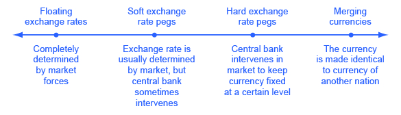

By the end of this section, you will be able to:

* Differentiate among a floating exchange rate, a soft peg, a hard peg, and a merged currency
* Identify the tradeoffs that come with a floating exchange rate, a soft peg, a hard peg, and a merged currency

Exchange rate policies come in a range of different forms listed in [\[link\]](#CNX_Econ_C29_016)\: let the foreign exchange market determine the exchange rate; let the market set the value of the exchange rate most of the time, but have the central bank sometimes intervene to prevent fluctuations that seem too large; have the central bank guarantee a specific exchange rate; or share a currency with other countries. Let’s discuss each type of exchange rate policy and its tradeoffs.

 {: #CNX_Econ_C29_016 data-title="A Spectrum of Exchange Rate Policies "}

# Floating Exchange Rates

A policy which allows the foreign exchange market to set exchange rates is referred to as a **floating exchange rate**{: data-type="term"}. The U.S. dollar is a floating exchange rate, as are the currencies of about 40% of the countries in the world economy. The major concern with this policy is that exchange rates can move a great deal in a short time.

Consider the U.S. exchange rate expressed in terms of another fairly stable currency, the Japanese yen, as shown in [\[link\]](#CNX_Econ_C29_017). On January 1, 2002, the exchange rate was 133 yen/dollar. On January 1, 2005, it was 103 yen/dollar. On June 1, 2007, it was 122 yen/dollar, on January 1, 2012, it was 77 yen per dollar, and on March 1, 2015, it was 120 yen per dollar. As investor sentiment swings back and forth, driving exchange rates up and down, exporters, importers, and banks involved in international lending are all affected. At worst, large movements in exchange rates can drive companies into bankruptcy or trigger a nationwide banking collapse. But even in the moderate case of the yen/dollar exchange rate, these movements of roughly 30 percent back and forth impose stress on both economies as firms must alter their export and import plans to take the new exchange rates into account. Especially in smaller countries where international trade is a relatively large share of GDP, exchange rate movements can rattle their economies.

 by about 14% and again at the end of the year in 2014 also by about 14%. (Source: Federal Reserve Economic Data (FRED) https://research.stlouisfed.org/fred2/series/DEXJPUS)"){: #CNX_Econ_C29_017 data-title="U.S. Dollar Exchange Rate in Japanese Yen "}

However, movements of floating exchange rates have advantages, too. After all, prices of goods and services rise and fall throughout a market economy, as demand and supply shift. If an economy experiences strong inflows or outflows of international financial capital, or has relatively high inflation, or if it experiences strong productivity growth so that purchasing power changes relative to other economies, then it makes economic sense for the exchange rate to shift as well.

Floating exchange rate advocates often argue that if government policies were more predictable and stable, then inflation rates and interest rates would be more predictable and stable. Exchange rates would bounce around less, too. The economist **Milton Friedman**{: data-type="term" .no-emphasis} (1912–2006), for example, wrote a defense of floating exchange rates in 1962 in his book *Capitalism and Freedom*\:

\> Being in favor of floating exchange rates does not mean being in favor of unstable exchange rates. When we support a free price system \[for goods and services\] at home, this does not imply that we favor a system in which prices fluctuate wildly up and down. What we want is a system in which prices are free to fluctuate but in which the forces determining them are sufficiently stable so that in fact prices move within moderate ranges. This is equally true in a system of floating exchange rates. The ultimate objective is a world in which exchange rates, while free to vary, are, in fact, highly stable because basic economic policies and conditions are stable.

Advocates of floating exchange rates admit that, yes, exchange rates may sometimes fluctuate. They point out, however, that if a central bank focuses on preventing either high inflation or deep recession, with low and reasonably steady interest rates, then exchange rates will have less reason to vary.

# Using Soft Pegs and Hard Pegs

When a government intervenes in the foreign exchange market so that the exchange rate of its currency is different from what the market would have produced, it is said to have established a “peg” for its currency. A **soft peg**{: data-type="term"} is the name for an exchange rate policy where the government usually allows the exchange rate to be set by the market, but in some cases, especially if the exchange rate seems to be moving rapidly in one direction, the central bank will intervene in the market. With a **hard peg**{: data-type="term"} exchange rate policy, the central bank sets a fixed and unchanging value for the exchange rate. A central bank can implement soft peg and hard peg policies.

Suppose the market exchange rate for the Brazilian currency, the real, would be 35 cents/real with a daily quantity of 15 billion real traded in the market, as shown at the equilibrium E0 in [\[link\]](#CNX_Econ_C29_024) (a) and [\[link\]](#CNX_Econ_C29_024) (b). However, the government of Brazil decides that the exchange rate should be 30 cents/real, as shown in [\[link\]](#CNX_Econ_C29_024) (a). Perhaps Brazil sets this lower exchange rate to benefit its export industries. Perhaps it is an attempt to stimulate aggregate demand by stimulating exports. Perhaps Brazil believes that the current market exchange rate is higher than the long-term purchasing power parity value of the real, so it is minimizing fluctuations in the real by keeping it at this lower rate. Perhaps the target exchange rate was set sometime in the past, and is now being maintained for the sake of stability. Whatever the reason, if Brazil’s central bank wishes to keep the exchange rate below the market level, it must face the reality that at this weaker exchange rate of 30 cents/real, the quantity demanded of its currency at 17 billion reals is greater than the quantity supplied of 13 billion reals in the foreign exchange market.

  If an exchange rate is pegged below what would otherwise be the equilibrium, then the quantity demanded of the currency will exceed the quantity supplied. (b) If an exchange rate is pegged above what would otherwise be the equilibrium, then the quantity supplied of the currency exceeds the quantity demanded."){: #CNX_Econ_C29_024 data-title="Pegging an Exchange Rate "}

The Brazilian central bank could weaken its exchange rate in two ways. One approach is to use an **expansionary monetary policy**{: data-type="term" .no-emphasis} that leads to lower interest rates. In foreign exchange markets, the lower interest rates will reduce demand and increase supply of the real and lead to depreciation. This technique is not often used because lowering interest rates to weaken the currency may be in conflict with the country’s monetary policy goals. Alternatively, Brazil’s central bank could trade directly in the foreign exchange market. The central bank can expand the money supply by creating reals, use the reals to purchase foreign currencies, and avoid selling any of its own currency. In this way, it can fill the gap between **quantity demanded**{: data-type="term" .no-emphasis} and **quantity supplied**{: data-type="term" .no-emphasis} of its currency.

[\[link\]](#CNX_Econ_C29_024) (b) shows the opposite situation. Here, the Brazilian government desires a stronger exchange rate of 40 cents/real than the market rate of 35 cents/real. Perhaps Brazil desires the stronger currency to reduce aggregate demand and to fight inflation, or perhaps Brazil believes that that current market exchange rate is temporarily lower than the long-term rate. Whatever the reason, at the higher desired exchange rate, the quantity supplied of 16 billion reals exceeds the quantity demanded of 14 billion reals.

Brazil’s central bank can use a **contractionary monetary policy**{: data-type="term" .no-emphasis} to raise interest rates, which will increase demand and reduce supply of the currency on foreign exchange markets, and lead to an appreciation. Alternatively, Brazil’s central bank can trade directly in the foreign exchange market. In this case, with an excess supply of its own currency in foreign exchange markets, the central bank must use reserves of foreign currency, like U.S. dollars, to demand its own currency and thus cause an appreciation of its exchange rate.

Both a soft peg and a hard peg policy require that the central bank intervene in the foreign exchange market. However, a hard peg policy attempts to preserve a fixed exchange rate at all times. A soft peg policy typically allows the exchange rate to move up and down by relatively small amounts in the short run of several months or a year, and to move by larger amounts over time, but seeks to avoid extreme short-term fluctuations.

# Tradeoffs of Soft Pegs and Hard Pegs

When a country decides to alter the market exchange rate, it faces a number of tradeoffs. If it uses **monetary policy**{: data-type="term" .no-emphasis} to alter the exchange rate, it then cannot at the same time use monetary policy to address issues of inflation or recession. If it uses direct purchases and sales of foreign currencies in exchange rates, then it must face the issue of how it will handle its reserves of foreign currency. Finally, a pegged exchange rate can even create additional movements of the exchange rate; for example, even the possibility of government intervention in exchange rate markets will lead to rumors about whether and when the government will intervene, and dealers in the foreign exchange market will react to those rumors. Let’s consider these issues in turn.

One concern with pegged exchange rate policies is that they imply a country’s monetary policy is no longer focused on controlling inflation or shortening recessions, but now must also take the exchange rate into account. For example, when a country pegs its exchange rate, it will sometimes face economic situations where it would like to have an expansionary monetary policy to fight recession—but it cannot do so because that policy would depreciate its exchange rate and break its hard peg. With a soft peg exchange rate policy, the **central bank**{: data-type="term" .no-emphasis} can sometimes ignore the exchange rate and focus on domestic inflation or recession—but in other cases the central bank may ignore inflation or recession and instead focus on its soft peg exchange rate. With a hard peg policy, domestic monetary policy is effectively no longer determined by domestic inflation or unemployment, but only by what monetary policy is needed to keep the exchange rate at the hard peg.

Another issue arises when a central bank intervenes directly in the exchange rate market. If a central bank ends up in a situation where it is perpetually creating and selling its own currency on foreign exchange markets, it will be buying the currency of other countries, like U.S. dollars or euros, to hold as **reserves**{: data-type="term" .no-emphasis}. Holding large reserves of other currencies has an **opportunity cost**{: data-type="term" .no-emphasis}, and central banks will not wish to boost such reserves without limit.

In addition, a central bank that causes a large increase in the supply of money is also risking an inflationary surge in aggregate demand. Conversely, when a central bank wishes to buy its own currency, it can do so by using its reserves of international currency like the U.S. dollar or the euro. But if the central bank runs out of such reserves, it can no longer use this method to strengthen its currency. Thus, buying foreign currencies in exchange rate markets can be expensive and inflationary, while selling foreign currencies can work only until a central bank runs out of reserves.

Yet another issue is that when a government pegs its exchange rate, it may unintentionally create another reason for additional fluctuation. With a soft peg policy, foreign exchange dealers and international investors react to every rumor about how or when the central bank is likely to intervene to influence the exchange rate, and as they react to rumors the exchange rate will shift up and down. Thus, even though the goal of a soft peg policy is to reduce short-term fluctuations of the exchange rate, the existence of the policy—when anticipated in the foreign exchange market—may sometimes increase short-term fluctuations as international investors try to anticipate how and when the central bank will act. The following Clear It Up feature discusses the effects of **international capital flows**{: data-type="term"}—capital that flows across national boundaries as either portfolio investment or direct investment.

How do Tobin taxes control the flow of capital?

Some countries like Chile and Malaysia have sought to reduce movements in exchange rates by limiting inflows and outflows of international financial capital. This policy can be enacted either through targeted taxes or by regulations.

Taxes on international capital flows are sometimes known as **Tobin taxes**{: data-type="term"}, named after **James Tobin**{: data-type="term" .no-emphasis}, the 1981 Nobel laureate in economics who proposed such a tax in a 1972 lecture. For example, a government might tax all foreign exchange transactions, or attempt to tax short-term **portfolio investment**{: data-type="term" .no-emphasis} while exempting long-term foreign **direct investment**{: data-type="term" .no-emphasis}. Countries can also use regulation to forbid certain kinds of foreign investment in the first place or to make it difficult for international financial investors to withdraw their funds from a country.

The goal of such policies is to reduce international capital flows, especially short-term portfolio flows, in the hope that doing so will reduce the chance of large movements in exchange rates that can bring macroeconomic disaster.

But proposals to limit **international financial flows**{: data-type="term" .no-emphasis} have severe practical difficulties. Taxes are imposed by national governments, not international ones. If one government imposes a Tobin tax on exchange rate transactions carried out within its territory, the exchange rate market might easily be operated by a firm based someplace like the Grand Caymans, an island nation in the Caribbean well-known for allowing some financial wheeling and dealing. In an interconnected global economy, if goods and services are allowed to flow across national borders, then payments need to flow across borders, too. It is very difficult—in fact close to impossible—for a nation to allow only the flows of payments that relate to goods and services, while clamping down or taxing other flows of financial capital. If a nation participates in international trade, it must also participate in international capital movements.

Finally, countries all over the world, especially low-income countries, are crying out for foreign investment to help develop their economies. Policies that discourage international financial investment may prevent some possible harm, but they rule out potentially substantial economic benefits as well.

A hard peg exchange rate policy will not allow short-term fluctuations in the exchange rate. If the government first announces a hard peg and then later changes its mind—perhaps the government becomes unwilling to keep interest rates high or to hold high levels of foreign exchange reserves—then the result of abandoning a hard peg could be a dramatic shift in the exchange rate.

In the mid-2000s, about one-third of the countries in the world used a soft peg approach and about one-quarter used a hard peg approach. The general trend in the 1990s was to shift away from a soft peg approach in favor of either floating rates or a hard peg. The concern is that a successful soft peg policy may, for a time, lead to very little variation in exchange rates, so that firms and banks in the economy begin to act as if a hard peg exists. When the exchange rate does move, the effects are especially painful because firms and banks have not planned and hedged against a possible change. Thus, the argument went, it is better either to be clear that the exchange rate is always flexible, or that it is fixed, but choosing an in-between soft peg option may end up being worst of all.

# A Merged Currency

A final approach to exchange rate policy is for a nation to choose a common currency shared with one or more nations is also called a **merged currency**{: data-type="term"}. A merged currency approach eliminates foreign exchange risk altogether. Just as no one worries about exchange rate movements when buying and selling between New York and California, Europeans know that the value of the euro will be the same in Germany and France and other European nations that have adopted the euro.

However, a merged currency also poses problems. Like a hard peg, a merged currency means that a nation has given up altogether on domestic monetary policy, and instead has put its interest rate policies in other hands. When Ecuador uses the U.S. dollar as its currency, it has no voice in whether the Federal Reserve raises or lowers interest rates. The European Central Bank that determines monetary policy for the euro has representatives from all the euro nations. However, from the standpoint of, say, Portugal, there will be times when the decisions of the European Central Bank about monetary policy do not match the decisions that would have been made by a Portuguese central bank.

The lines between these four different exchange rate policies can blend into each other. For example, a soft peg exchange rate policy in which the government almost never acts to intervene in the exchange rate market will look a great deal like a floating exchange rate. Conversely, a soft peg policy in which the government intervenes often to keep the exchange rate near a specific level will look a lot like a hard peg. A decision to merge currencies with another country is, in effect, a decision to have a permanently fixed exchange rate with those countries, which is like a very hard exchange rate peg. The range of exchange rates policy choices, with their advantages and disadvantages, are summarized in [\[link\]](#Table_29_03).

<table id="Table_29_03" summary="This table has five columns and six rows. The first row is a header row and it labels the columns &#x201C;Situation&#x201D;, &#x201C;Floating Exchange Rates&#x201D;, &#x201C;Soft Peg&#x201D;, &#x201C;Hard Peg&#x201D;, and &#x201C;Merged Currency&#x201D;. Under the &#x201C;Situation&#x201D; column are the following situations: Large short-run fluctuations in exchange rates?, Large long-term fluctuations in exchange rates?, Power of central bank to conduct countercyclical monetary policy?, Costs of holding foreign exchange reserves?, and Risk of being stuck with an exchange rate that causes a large trade imbalance and very high inflows or outflows of financial capital? Under the &#x201C;Floating Exchange Rates&#x201D; column are the following tradeoffs: Often a lot in the short term, Can often happen, Flexible exchange rates make monetary policy stronger, Do not need to hold reserves, and Adjusts often. Under the column &#x201C;Soft Peg&#x201D; are the following tradeoffs: Maybe less in the short run, but still large changes over time,  Can often happen, Some power, although conflicts may arise between exchange rate policy and countercyclical policy, Hold moderate reserves that rise and fall over time, Adjusts over the medium term, if not the short term. Under the column &#x201C;Hard Peg&#x201D; are the following tradeoffs: None, unless a change in the fixed rate, Cannot happen unless hard peg changes, in which case substantial volatility can occur, Very little; central bank must keep exchange rate fixed, Hold large reserves, and May become stuck over time either far above or below the market level. Under the &#x201C;Merged Currency&#x201D; column are the following tradeoffs: None, Cannot happen, None; nation does not have its own currency, No need to hold reserves, and Cannot adjust."><caption>Tradeoffs of Exchange Rate Policies</caption><thead>
<tr>
<th>Situation</th>
<th>Floating Exchange Rates</th>
<th>Soft Peg</th>
<th>Hard Peg</th>
<th>Merged Currency</th>
</tr>
</thead><tbody>
<tr>
<td>Large short-run fluctuations in exchange rates?</td>
<td>Often a lot in the short term</td>
<td>Maybe less in the short run, but still large changes over time</td>
<td>None, unless a change in the fixed rate</td>
<td>None</td>
</tr>
<tr>
<td>Large long-term fluctuations in exchange rates?</td>
<td>Can often happen</td>
<td>Can often happen</td>
<td>Cannot happen unless hard peg changes, in which case substantial volatility can occur</td>
<td>Cannot happen</td>
</tr>
<tr>
<td>Power of central bank to conduct countercyclical monetary policy?</td>
<td>Flexible exchange rates make monetary policy stronger</td>
<td>Some power, although conflicts may arise between exchange rate policy and countercyclical policy</td>
<td>Very little; central bank must keep exchange rate fixed</td>
<td>None; nation does not have its own currency</td>
</tr>
<tr>
<td>Costs of holding foreign exchange reserves?</td>
<td>Do not need to hold reserves</td>
<td>Hold moderate reserves that rise and fall over time</td>
<td>Hold large reserves</td>
<td>No need to hold reserves</td>
</tr>
<tr>
<td>Risk of being stuck with an exchange rate that causes a large trade imbalance and very high inflows or outflows of financial capital?</td>
<td>Adjusts often</td>
<td>Adjusts over the medium term, if not the short term</td>
<td>May become stuck over time either far above or below the market level</td>
<td>Cannot adjust</td>
</tr>
</tbody></table>

Global macroeconomics would be easier if the whole world had one currency and one central bank. The exchange rates between different currencies complicate the picture. If exchange rates are set solely by financial markets, they fluctuate substantially as short-term portfolio investors try to anticipate tomorrow’s news. If the government attempts to intervene in exchange rate markets through soft pegs or hard pegs, it gives up at least some of the power to use monetary policy to focus on domestic inflations and recessions, and it risks causing even greater fluctuations in foreign exchange markets.

There is no consensus among economists about which exchange rate policies are best: floating, soft peg, hard peg, or merged currencies. The choice depends both on how well a nation’s central bank can implement a specific exchange rate policy and on how well a nation’s firms and banks can adapt to different exchange rate policies. A national economy that does a fairly good job at achieving the four main economic goals of growth, low inflation, low unemployment, and a sustainable **balance of trade**{: data-type="term" .no-emphasis} will probably do just fine most of the time with any exchange rate policy; conversely, no exchange rate policy is likely to save an economy that consistently fails at achieving these goals. On the other hand, a merged currency applied across wide geographic and cultural areas carries with it its own set of problems, such as the ability for countries to conduct their own independent monetary policies.

Is a Stronger Dollar Good for the U.S. Economy?

The foreign exchange value of the dollar is a price and whether a higher price is good or bad depends on where you are standing: sellers benefit from higher prices and buyers are harmed. A stronger dollar is good for U.S. imports (and people working for U.S. importers) and U.S. investment abroad. It is also good for U.S. tourists going to other countries, since their dollar goes further. But a stronger dollar is bad for U.S. exports (and people working in U.S. export industries); it is bad for foreign investment in the United States (leading, for example, to higher U.S. interest rates); and it is bad for foreign tourists (as well as U.S hotels, restaurants, and others in the tourist industry). In short, whether the U.S. dollar is good or bad is a more complex question than you may have thought. The economic answer is “it depends.”

# Key Concepts and Summary

In a floating exchange rate policy, a country’s exchange rate is determined in the foreign exchange market. In a soft peg exchange rate policy, a country’s exchange rate is usually determined in the foreign exchange market, but the government sometimes intervenes to strengthen or weaken the exchange rate. In a hard peg exchange rate policy, the government chooses an exchange rate. A central bank can intervene in exchange markets in two ways. It can raise or lower interest rates to make the currency stronger or weaker. Or it can directly purchase or sell its currency in foreign exchange markets. All exchange rates policies face tradeoffs. A hard peg exchange rate policy will reduce exchange rate fluctuations, but means that a country must focus its monetary policy on the exchange rate, not on fighting recession or controlling inflation. When a nation merges its currency with another nation, it gives up on nationally oriented monetary policy altogether.

A soft peg exchange rate may create additional volatility as exchange rate markets try to anticipate when and how the government will intervene. A flexible exchange rate policy allows monetary policy to focus on inflation and unemployment, and allows the exchange rate to change with inflation and rates of return, but also raises a risk that exchange rates may sometimes make large and abrupt movements. The spectrum of exchange rate policies includes: (a) a floating exchange rate, (b) a pegged exchange rate, soft or hard, and (c) a merged currency. Monetary policy can focus on a variety of goals: (a) inflation; (b) inflation or unemployment, depending on which is the most dangerous obstacle; and (c) a long-term rule based policy designed to keep the money supply stable and predictable.

# Self-Check Questions

How would a contractionary monetary policy affect the exchange rate, net exports, aggregate demand, and aggregate supply?

A contractionary monetary policy, by driving up domestic interest rates, would cause the currency to appreciate. The higher value of the currency in foreign exchange markets would reduce exports, since from the perspective of foreign buyers, they are now more expensive. The higher value of the currency would similarly stimulate imports, since they would now be cheaper from the perspective of domestic buyers. Lower exports and higher imports cause net exports (EX – IM) to fall, which causes aggregate demand to fall. The result would be a decrease in GDP working through the exchange rate mechanism reinforcing the effect contractionary monetary policy has on domestic investment expenditure. However, cheaper imports would stimulate aggregate supply, bringing GDP back to potential, though at a lower price level.

A central bank can allow its currency to fall indefinitely, but it cannot allow its currency to rise indefinitely. Why not?

For a currency to fall, a central bank need only supply more of its currency in foreign exchange markets. It can print as much domestic currency as it likes. For a currency to rise, a central bank needs to buy its currency in foreign exchange markets, paying with foreign currency. Since no central bank has an infinite amount of foreign currency reserves, it cannot buy its currency indefinitely.

Is a country for which imports and exports make up a large fraction of the GDP more likely to adopt a flexible exchange rate or a fixed (hard peg) exchange rate?

Variations in exchange rates, because they change import and export prices, disturb international trade flows. When trade is a large part of a nation’s economic activity, government will find it more advantageous to fix exchange rates to minimize disruptions of trade flows.

# Review Questions

What is the difference between a floating exchange rate, a soft peg, a hard peg, and dollarization?

List some advantages and disadvantages of the different exchange rate policies.

# Critical Thinking Questions

Many developing countries, like Mexico, have moderate to high rates of inflation. At the same time, international trade plays an important role in their economies. What type of exchange rate regime would be best for such a country’s currency *vis à vis* the U.S. dollar?

What would make a country decide to change from a common currency, like the euro, back to its own currency?

# References

Friedman, Milton. *Capitalism and Freedom*. Chicago: University of Chicago Press, 1962.

## Glossary
{: data-type="glossary-title"}

floating exchange rate
: a country lets the value of its currency be determined in the exchange rate market
{: .definition}

hard peg
: an exchange rate policy in which the central bank sets a fixed and unchanging value for the exchange rate
{: .definition}

international capital flows
: flow of financial capital across national boundaries either as portfolio investment or direct investment
{: .definition}

merged currency
: when a nation chooses to use the currency of another nation
{: .definition}

soft peg
: an exchange rate policy in which the government usually allows the exchange rate to be set by the market, but in some cases, especially if the exchange rate seems to be moving rapidly in one direction, the central bank will intervene
{: .definition}

Tobin taxes
: see international capital flows
{: .definition}

