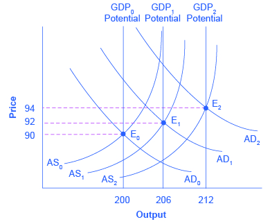
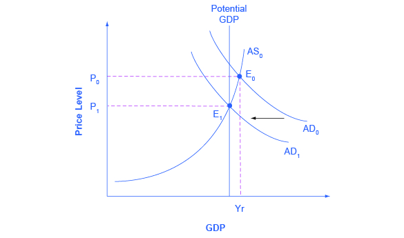

By the end of this section, you will be able to:

* Explain how expansionary fiscal policy can shift aggregate demand and influence the economy
* Explain how contractionary fiscal policy can shift aggregate demand and influence the economy

We need to emphasize that fiscal policy is the use of government spending and tax policy to alter the economy. Fiscal policy does not include all spending (such as the increase in spending that accompanies a war).

Graphically, we see that fiscal policy, whether through change in spending or taxes, shifts the **aggregate demand**{: data-type="term" .no-emphasis} outward in the case of **expansionary fiscal policy**{: data-type="term"} and inward in the case of **contractionary fiscal policy**{: data-type="term"}. [\[link\]](#CNX_Econ_C30_009) illustrates the process by using an aggregate demand/aggregate supply diagram in a growing economy. The original equilibrium occurs at E0, the intersection of aggregate demand curve AD0 and aggregate supply curve SRAS0, at an output level of 200 and a price level of 90.

One year later, **aggregate supply**{: data-type="term" .no-emphasis} has shifted to the right to SRAS1 in the process of long-term economic growth, and aggregate demand has also shifted to the right to AD1, keeping the economy operating at the new level of potential GDP. The new equilibrium (E1) is an output level of 206 and a price level of 92. One more year later, aggregate supply has again shifted to the right, now to SRAS2, and aggregate demand shifts right as well to AD2. Now the equilibrium is E2, with an output level of 212 and a price level of 94. In short, the figure shows an economy that is growing steadily year to year, producing at its potential GDP each year, with only small inflationary increases in the price level.

{: #CNX_Econ_C30_009 data-title="A Healthy, Growing Economy "}

Aggregate demand and aggregate supply do not always move neatly together. Aggregate demand may fail to increase along with aggregate supply, or aggregate demand may even shift left, for a number of possible reasons: households become hesitant about consuming; firms decide against investing as much; or perhaps the demand from other countries for exports diminishes. For example, investment by private firms in physical capital in the U.S. economy boomed during the late 1990s, rising from 14.1% of GDP in 1993 to 17.2% in 2000, before falling back to 15.2% by 2002. Conversely, if shifts in aggregate demand run ahead of increases in aggregate supply, inflationary increases in the price level will result. Business cycles of recession and recovery are the consequence of shifts in aggregate supply and aggregate demand.

[Monetary Policy and Bank Regulation](/m48768){: .target-chapter} shows us that a central bank can use its powers over the banking system to engage in countercyclical—or “against the business cycle”—actions. If recession threatens, the central bank uses an expansionary monetary policy to increase the supply of money, increase the quantity of loans, reduce interest rates, and shift aggregate demand to the right. If inflation threatens, the central bank uses contractionary monetary policy to reduce the supply of money, reduce the quantity of loans, raise interest rates, and shift aggregate demand to the left. Fiscal policy is another macroeconomic policy tool for adjusting aggregate demand by using either government spending or taxation policy.

# Expansionary Fiscal Policy

Expansionary fiscal policy increases the level of aggregate demand, through either increases in government spending or reductions in taxes. Expansionary policy can do this by (1) increasing consumption by raising disposable income through cuts in personal income taxes or payroll taxes; (2) increasing investments by raising after-tax profits through cuts in business taxes; and (3) increasing government purchases through increased spending by the federal government on final goods and services and raising federal grants to state and local governments to increase their expenditures on final goods and services. Contractionary fiscal policy does the reverse: it decreases the level of aggregate demand by decreasing consumption, decreasing investments, and decreasing government spending, either through cuts in government spending or increases in taxes. The aggregate demand/aggregate supply model is useful in judging whether expansionary or contractionary fiscal policy is appropriate.

Consider first the situation in [\[link\]](#CNX_Econ_C30_010), which is similar to the U.S. economy during the recession in 2008–2009. The intersection of aggregate demand (AD0) and aggregate supply (SRAS0) is occurring below the level of potential GDP as indicated by the LRAS curve. At the equilibrium (E0), a recession occurs and unemployment rises. In this case, expansionary fiscal policy using tax cuts or increases in government spending can shift aggregate demand to AD1, closer to the full-employment level of output. In addition, the price level would rise back to the level P1 associated with potential GDP.

 represents a recession, occurring at a quantity of output (Y0) below potential GDP. However, a shift of aggregate demand from AD0 to AD1, enacted through an expansionary fiscal policy, can move the economy to a new equilibrium output of E1 at the level of potential GDP which is shown by the LRAS curve. Since the economy was originally producing below potential GDP, any inflationary increase in the price level from P0 to P1 that results should be relatively small."){: #CNX_Econ_C30_010 data-title="Expansionary Fiscal Policy "}

Should the government use tax cuts or spending increases, or a mix of the two, to carry out expansionary fiscal policy? After the Great Recession of 2008–2009 (which started, actually, in very late 2007), U.S. government spending rose from 19.6% of GDP in 2007 to 24.6% in 2009, while tax revenues declined from 18.5% of GDP in 2007 to 14.8% in 2009. The choice between whether to use tax or spending tools often has a political tinge. As a general statement, conservatives and Republicans prefer to see expansionary fiscal policy carried out by tax cuts, while liberals and Democrats prefer that expansionary fiscal policy be implemented through spending increases. The Obama administration and Congress passed an $830 billion expansionary policy in early 2009 involving both tax cuts and increases in government spending, according to the Congressional Budget Office. However, state and local governments, whose budgets were also hard hit by the recession, began cutting their spending—a policy that offset federal expansionary policy.

The conflict over which policy tool to use can be frustrating to those who want to categorize economics as “liberal” or “conservative,” or who want to use economic models to argue against their political opponents. But the AD–AS model can be used both by advocates of smaller government, who seek to reduce taxes and government spending, and by advocates of bigger government, who seek to raise taxes and government spending. Economic studies of specific taxing and spending programs can help to inform decisions about whether taxes or spending should be changed, and in what ways. Ultimately, decisions about whether to use tax or spending mechanisms to implement macroeconomic policy is, in part, a political decision rather than a purely economic one.

# Contractionary Fiscal Policy

Fiscal policy can also contribute to pushing aggregate demand beyond potential GDP in a way that leads to inflation. As shown in [\[link\]](#CNX_Econ_C30_011), a very large budget deficit pushes up aggregate demand, so that the intersection of aggregate demand (AD0) and aggregate supply (SRAS0) occurs at equilibrium E0, which is an output level above potential GDP. This is sometimes known as an “overheating economy” where demand is so high that there is upward pressure on wages and prices, causing inflation. In this situation, contractionary fiscal policy involving federal spending cuts or tax increases can help to reduce the upward pressure on the price level by shifting aggregate demand to the left, to AD1, and causing the new equilibrium E1 to be at potential GDP, where aggregate demand intersects the LRAS curve.

{: #CNX_Econ_C30_011 data-title="A Contractionary Fiscal Policy "}

Again, the AD–AS model does not dictate how this contractionary fiscal policy is to be carried out. Some may prefer spending cuts; others may prefer tax increases; still others may say that it depends on the specific situation. The model only argues that, in this situation, aggregate demand needs to be reduced.

# Key Concepts and Summary

Expansionary fiscal policy increases the level of aggregate demand, either through increases in government spending or through reductions in taxes. Expansionary fiscal policy is most appropriate when an economy is in recession and producing below its potential GDP. Contractionary fiscal policy decreases the level of aggregate demand, either through cuts in government spending or increases in taxes. Contractionary fiscal policy is most appropriate when an economy is producing above its potential GDP.

# Self-Check Questions

What is the main reason for employing contractionary fiscal policy in a time of strong economic growth?

To keep prices from rising too much or too rapidly.

What is the main reason for employing expansionary fiscal policy during a recession?

To increase employment.

# Review Questions

What is the difference between expansionary fiscal policy and contractionary fiscal policy?

Under what general macroeconomic circumstances might a government use expansionary fiscal policy? When might it use contractionary fiscal policy?

# Critical Thinking Questions

How will cuts in state budget spending affect federal expansionary policy?

Is expansionary fiscal policy more attractive to politicians who believe in larger government or to politicians who believe in smaller government? Explain your answer.

# Problems

Specify whether expansionary or contractionary fiscal policy would seem to be most appropriate in response to each of the situations below and sketch a diagram using aggregate demand and aggregate supply curves to illustrate your answer:

1.  A recession.
2.  A stock market collapse that hurts consumer and business confidence.
3.  Extremely rapid growth of exports.
4.  Rising inflation.
5.  A rise in the natural rate of unemployment.
6.  A rise in oil prices.
{: data-number-style="lower-alpha"}

# References

Alesina, Alberto, and Francesco Giavazzi. *Fiscal Policy after the Financial Crisis (National Bureau of Economic Research Conference Report)*. Chicago: University Of Chicago Press, 2013.

Martin, Fernando M. “Fiscal Policy in the Great Recession and Lessons from the Past.” Federal Reserve Bank of St. Louis: *Economic Synopses*. no. 1 (2012). http://research.stlouisfed.org/publications/es/12/ES\\\_2012-01-06.pdf.

Bivens, Josh, Andrew Fieldhouse, and Heidi Shierholz. “From Free-fall to Stagnation: Five Years After the Start of the Great Recession, Extraordinary Policy Measures Are Still Needed, But Are Not Forthcoming.” *Economic Policy Institute*. Last modified February 14, 2013. http://www.epi.org/publication/bp355-five-years-after-start-of-great-recession/.

Lucking, Brian, and Dan Wilson. Federal Reserve Bank of San Francisco, “FRBSF Economic Letter—U.S. Fiscal Policy: Headwind or Tailwind?” Last modified July 2, 2012. http://www.frbsf.org/economic-research/publications/economic-letter/2012/july/us-fiscal-policy/.

Greenstone, Michael, and Adam Looney. Brookings. “The Role of Fiscal Stimulus in the Ongoing Recovery.” Last modified July 6, 2012. http://www.brookings.edu/blogs/jobs/posts/2012/07/06-jobs-greenstone-looney.

## Glossary
{: data-type="glossary-title"}

contractionary fiscal policy
: fiscal policy that decreases the level of aggregate demand, either through cuts in government spending or increases in taxes
{: .definition}

expansionary fiscal policy
: fiscal policy that increases the level of aggregate demand, either through increases in government spending or cuts in taxes
{: .definition}

