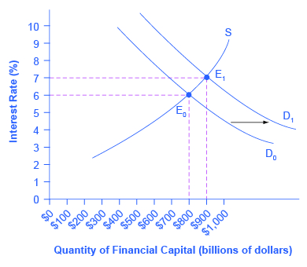

By the end of this section, you will be able to:

* Understand how fiscal policy and monetary policy are interconnected
* Explain the three lag times that often occur when solving economic problems.
* Identify the legal and political challenges of responding to an economic problem.

In the early 1960s, many leading economists believed that the problem of the business cycle, and the swings between cyclical unemployment and inflation, were a thing of the past. On the cover of its December 31, 1965, issue, *Time* magazine, then the premier news magazine in the United States, ran a picture of **John Maynard Keynes**{: data-type="term" .no-emphasis}, and the story inside identified Keynesian theories as “the prime influence on the world’s economies.” The article reported that policymakers have “used Keynesian principles not only to avoid the violent \[business\] cycles of prewar days but to produce phenomenal economic growth and to achieve remarkably stable prices.”

This happy consensus, however, did not last. The U.S. economy suffered one recession from December 1969 to November 1970, a deeper recession from November 1973 to March 1975, and then double-dip recessions from January to June 1980 and from July 1981 to November 1982. At various times, inflation and unemployment both soared. Clearly, the problems of macroeconomic policy had not been completely solved. As economists began to consider what had gone wrong, they identified a number of issues that make discretionary fiscal policy more difficult than it had seemed in the rosy optimism of the mid-1960s.

### Fiscal Policy and Interest Rates

Because fiscal policy affects the quantity that the government borrows in **financial capital markets**{: data-type="term" .no-emphasis}, it not only affects aggregate demand—it can also affect interest rates. In [\[link\]](#CNX_Econ_C30_013), the original equilibrium (E0) in the financial capital market occurs at a quantity of $800 billion and an interest rate of 6%. However, an increase in government budget deficits shifts the demand for financial capital from D0 to D1. The new equilibrium (E1) occurs at a quantity of $900 billion and an interest rate of 7%.

A consensus estimate based on a number of studies is that an increase in budget deficits (or a fall in budget surplus) by 1% of GDP will cause an increase of 0.5–1.0% in the long-term interest rate.

 {: #CNX_Econ_C30_013 data-title="Fiscal Policy and Interest Rates "}

A problem arises here. An expansionary fiscal policy, with tax cuts or spending increases, is intended to increase aggregate demand. If an expansionary fiscal policy also causes higher interest rates, then firms and households are discouraged from borrowing and spending (as occurs with tight monetary policy), thus reducing aggregate demand. Even if the direct effect of expansionary fiscal policy on increasing demand is not totally offset by lower aggregate demand from higher interest rates, fiscal policy can end up being less powerful than was originally expected. This is referred to as **crowding out**{: data-type="term"}, where government borrowing and spending results in higher interest rates, which reduces business investment and household consumption.

The broader lesson is that fiscal and monetary policy must be coordinated. If expansionary fiscal policy is to work well, then the central bank can also reduce or keep short-term interest rates low. Conversely, monetary policy can also help to ensure that contractionary fiscal policy does not lead to a recession.

### Long and Variable Time Lags

Monetary policy can be changed several times each year, but fiscal policy is much slower to be enacted. Imagine that the economy starts to slow down. It often takes some months before the economic statistics signal clearly that a downturn has started, and a few months more to confirm that it is truly a recession and not just a one- or two-month blip. The time it takes to determine that a recession has occurred is often called the **recognition lag**{: data-type="term"}. After this lag, policymakers become aware of the problem and propose fiscal policy bills. The bills go into various congressional committees for hearings, negotiations, votes, and then, if passed, eventually for the president’s signature. Many fiscal policy bills about spending or taxes propose changes that would start in the next budget year or would be phased in gradually over time. The time to get a bill passed is often referred to as the **legislative lag**{: data-type="term"}. Finally, once the bill is passed it takes some time for the funds to be dispersed to the appropriate agencies to implement the programs. The time to get the projects started is often called the **implementation lag**{: data-type="term"}.

Moreover, the exact level of fiscal policy to be implemented is never completely clear. Should the budget deficit be increased by 0.5% of GDP? By 1% of GDP? By 2% of GDP? In an AD/AS diagram, it is straightforward to sketch an aggregate demand curve shifting to the potential GDP level of output. In the real world, the actual level of potential output is known only roughly, not precisely, and exactly how a spending cut or tax increase will affect aggregate demand is always somewhat controversial. Also unknown is the state of the economy at any point in time. During the early days of the Obama administration, for example, no one knew how deep in the hole the economy really was. During the financial crisis of 2008-09, the rapid collapse of the banking system and automotive sector made it difficult to assess how quickly the economy was collapsing.

Thus, it can take many months or even more than a year to begin an expansionary fiscal policy after a recession has started—and even then, uncertainty will remain over exactly how much to expand or contract taxes and spending. When politicians attempt to use countercyclical fiscal policy to fight recession or inflation, they run the risk of responding to the macroeconomic situation of two or three years ago, in a way that may be exactly wrong for the economy at that time. George P. Schultz, a professor of economics, former Secretary of the Treasury, and Director of the Office of Management and Budget, once wrote: “While the economist is accustomed to the concept of lags, the politician likes instant results. The tension comes because, as I have seen on many occasions, the economist’s lag is the politician’s nightmare.”

### Temporary and Permanent Fiscal Policy

A temporary tax cut or spending increase will explicitly last only for a year or two, and then revert back to its original level. A permanent tax cut or spending increase is expected to stay in place for the foreseeable future. The effect of temporary and permanent fiscal policies on aggregate demand can be very different. Consider how you would react if the government announced a tax cut that would last one year and then be repealed, in comparison with how you would react if the government announced a permanent tax cut. Most people and firms will react more strongly to a permanent policy change than a temporary one.

This fact creates an unavoidable difficulty for countercyclical fiscal policy. The appropriate policy may be to have an expansionary fiscal policy with large budget deficits during a recession, and then a contractionary fiscal policy with budget surpluses when the economy is growing well. But if both policies are explicitly temporary ones, they will have a less powerful effect than a permanent policy.

### Structural Economic Change Takes Time

When an economy recovers from a recession, it does not usually revert back to its exact earlier shape. Instead, the internal structure of the economy evolves and changes and this process can take time. For example, much of the economic growth of the mid-2000s was in the sectors of construction (especially of housing) and finance. However, when housing prices started falling in 2007 and the resulting financial crunch led into recession (as discussed in [Monetary Policy and Bank Regulation](/m48768)), both sectors contracted. The manufacturing sector of the U.S. economy has been losing jobs in recent years as well, under pressure from technological change and foreign competition. Many of the people thrown out of work from these sectors in the Great Recession of 2008–2009 will never return to the same jobs in the same sectors of the economy; instead, the economy will need to grow in new and different directions, as the following Clear It Up feature shows. Fiscal policy can increase overall demand, but the process of structural economic change—the expansion of a new set of industries and the movement of workers to those industries—inevitably takes time.

Why do jobs vanish?

People can lose jobs for a variety of reasons: because of a recession, but also because of longer-run changes in the economy, such as new technology. Productivity improvements in auto manufacturing, for example, can reduce the number of workers needed, and eliminate these jobs in the long run. The Internet has created jobs but also caused the loss of jobs as well, from travel agents to book store clerks. Many of these jobs may never come back. Short-run fiscal policy to reduce unemployment can create jobs, but it cannot replace jobs that will never return.

### The Limitations of Fiscal Policy

Fiscal policy can help an economy that is producing below its potential GDP to expand aggregate demand so that it produces closer to potential GDP, thus lowering unemployment. But fiscal policy cannot help an economy produce at an output level above potential GDP without causing inflation At this point, unemployment becomes so low that workers become scarce and wages rise rapidly.

Visit this [website][1] to read about how the recovery is being affected by fiscal policies.

### Political Realties and Discretionary Fiscal Policy

A final problem for discretionary fiscal policy arises out of the difficulties of explaining to politicians how countercyclical fiscal policy that runs against the tide of the business cycle should work. Politicians often have a gut-level belief that when the economy and tax revenues slow down, it is time to hunker down, pinch pennies, and trim expenses. Countercyclical policy, however, says that when the economy has slowed down, it is time for the government to go on a spree, raising spending, and cutting taxes. This offsets the drop in the economy in the other sectors. Conversely, when economic times are good and tax revenues are rolling in, politicians often feel that it is time for tax cuts and new spending. But countercyclical policy says that this economic boom should be an appropriate time for keeping taxes high and restraining spending.

Politicians tend to prefer expansionary fiscal policy over contractionary policy. There is rarely a shortage of proposals for tax cuts and spending increases, especially during recessions. However, politicians are less willing to hear the message that in good economic times, they should propose tax increases and spending limits. In the economic upswing of the late 1990s and early 2000s, for example, the U.S. GDP grew rapidly. Estimates from respected government economic forecasters like the nonpartisan Congressional Budget Office and the Office of Management and Budget stated that the GDP was above potential GDP, and that unemployment rates were unsustainably low. However, no mainstream politician took the lead in saying that the booming economic times might be an appropriate time for spending cuts or tax increases.

### Discretionary Fiscal Policy: Summing Up

Expansionary fiscal policy can help to end recessions and contractionary fiscal policy can help to reduce inflation. Given the uncertainties over interest rate effects, time lags, temporary and permanent policies, and unpredictable political behavior, many economists and knowledgeable policymakers had concluded by the mid-1990s that discretionary fiscal policy was a blunt instrument, more like a club than a scalpel. It might still make sense to use it in extreme economic situations, like an especially deep or long recession. For less extreme situations, it was often preferable to let fiscal policy work through the automatic stabilizers and focus on monetary policy to steer short-term countercyclical efforts.

### Key Concepts and Summary

Because fiscal policy affects the quantity of money that the government borrows in financial capital markets, it not only affects aggregate demand—it can also affect interest rates. If an expansionary fiscal policy also causes higher interest rates, then firms and households are discouraged from borrowing and spending, reducing aggregate demand in a situation called crowding out. Given the uncertainties over interest rate effects, time lags (implementation lag, legislative lag, and recognition lag), temporary and permanent policies, and unpredictable political behavior, many economists and knowledgeable policymakers have concluded that discretionary fiscal policy is a blunt instrument and better used only in extreme situations.

### Self-Check Questions

What would happen if expansionary fiscal policy was implemented in a recession but, due to lag, did not actually take effect until after the economy was back to potential GDP?

Prices would be pushed up as a result of too much spending.

What would happen if contractionary fiscal policy were implemented during an economic boom but, due to lag, it did not take effect until the economy slipped into recession?

Employment would suffer as a result of too little spending.

Do you think the typical time lag for fiscal policy is likely to be longer or shorter than the time lag for monetary policy? Explain your answer?

Monetary policy probably has shorter time lags than fiscal policy. Imagine that the data becomes fairly clear that an economy is in or near a recession. Expansionary monetary policy can be carried out through open market operations, which can be done fairly quickly, since the Federal Reserve’s Open Market Committee meets six times a year. Also, monetary policy takes effect through interest rates, which can change fairly quickly. However, fiscal policy is carried out through acts of Congress that need to be signed into law by the president. Negotiating such laws often takes months, and even after the laws are negotiated, it takes more months for spending programs or tax cuts to have an effect on the macroeconomy.

### Review Questions

What are some practical weaknesses of discretionary fiscal policy?

### Critical Thinking Questions

What is a potential problem with a temporary tax increase designed to increase aggregate demand if people know that it is temporary?

If the government gives a $300 tax cut to everyone in the country, explain the mechanism by which this will cause interest rates to rise.

### References

Leduc, Sylvain, and Daniel Wilson. Federal Reserve Bank of San Francisco: Working Paper Series. “Are State Governments Roadblocks to Federal Stimulus? Evidence from Highway Grants in the 2009 Recovery Act. (Working Paper 2013-16).” Last modified July 2013. http://www.frbsf.org/economic-research/files/wp2013-16.pdf.

Lucking, Brian, and Daniel Wilson. “FRBSF Economic Letter-Fiscal Headwinds: Is the Other Shoe About to Drop?” *Federal Reserve Bank of San Francisco*. Last modified June 3, 2013. http://www.frbsf.org/economic-research/publications/economic-letter/2013/june/fiscal-headwinds-federal-budget-policy/.

Recovery.gov. “Track the Money.” http://www.recovery.gov/Pages/default.aspx.

Bastagli, Francesca, David Coady, and Sanjeev Gupta. International Monetary Fund. “IMF Staff Discussion Note: Income Inequality and Fiscal Policy.” Last modified June 28, 2012. http://www.imf.org/external/pubs/ft/sdn/2012/sdn1208.pdf.

### Glossary
{: data-type="glossary-title"}

crowding out
: federal spending and borrowing causes interest rates to rise and business investment to fall
^

implementation lag
: the time it takes for the funds relating to fiscal policy to be dispersed to the appropriate agencies to implement the programs
^

legislative lag
: the time it takes to get a fiscal policy bill passed
^

recognition lag
: the time it takes to determine that a recession has occurred

[1]: http://openstaxcollege.org/l/fiscalpolicy
