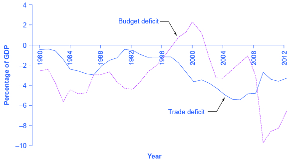

By the end of this section, you will be able to:

* Discuss twin deficits as they related to budget and trade deficit
* Explain the relationship between budget deficits and exchange rates
* Explain the relationship between budget deficits and inflation
* Identify causes of recessions

Government budget balances can affect the trade balance. As [The Keynesian Perspective](/m48749){: .target-chapter} chapter discusses, a net inflow of foreign financial investment always accompanies a trade deficit, while a net outflow of financial investment always accompanies a trade surplus. One way to understand the connection from budget deficits to trade deficits is that when government creates a budget deficit with some combination of tax cuts or spending increases, it will increase aggregate demand in the economy, and some of that increase in aggregate demand will result in a higher level of imports. A higher level of imports, with exports remaining fixed, will cause a larger trade deficit. That means foreigners’ holdings of dollars increase as Americans purchase more imported goods. Foreigners use those dollars to invest in the United States, which leads to an inflow of foreign investment. One possible source of funding our budget deficit is foreigners buying Treasury securities that are sold by the U.S. government. So a budget deficit is often accompanied by a trade deficit.

# Twin Deficits?

In the mid-1980s, it was common to hear economists and even newspaper articles refer to the twin deficits, as the budget deficit and trade deficit both grew substantially. [\[link\]](#CNX_Econ_C31_007) shows the pattern. The federal budget deficit went from 2.6% of GDP in 1981 to 5.1% of GDP in 1985—a drop of 2.5% of GDP. Over that time, the trade deficit moved from 0.5% in 1981 to 2.9% in 1985—a drop of 2.4% of GDP. In the mid-1980s, the considerable increase in government borrowing was matched by an inflow of foreign investment capital, so the government budget deficit and the trade deficit moved together.

 {: #CNX_Econ_C31_007 data-media-type="image/jpg" data-title="U.S. Budget Deficits and Trade Deficits "}

Of course, no one should expect the budget deficit and trade deficit to move in lockstep, because the other parts of the national saving and investment identity—investment and private savings—will often change as well. In the late 1990s, for example, the government budget balance turned from deficit to surplus, but the trade deficit remained large and growing. During this time, the inflow of foreign financial investment was supporting a surge of physical capital investment by U.S. firms. In the first half of the 2000s, the budget and trade deficits again increased together, but in 2009, the budget deficit increased while the trade deficit declined. The budget deficit and the trade deficits are related to each other, but they are more like cousins than twins.

# Budget Deficits and Exchange Rates

Exchange rates can also help to explain why budget deficits are linked to trade deficits. [\[link\]](#CNX_Econ_C31_008) shows a situation using the **exchange rate**{: data-type="term" .no-emphasis} for the U.S. dollar, measured in euros. At the original equilibrium (E0), where the demand for U.S. dollars (D0) intersects with the supply of U.S. dollars (S0) on the foreign exchange market, the exchange rate is 0.9 euros per U.S. dollar and the equilibrium quantity traded in the market is $100 billion per day (which was roughly the quantity of dollar–euro trading in exchange rate markets in the mid-2000s). Then the U.S. budget deficit rises and foreign financial investment provides the source of funds for that budget deficit.

International financial investors, as a group, will demand more U.S. dollars on foreign exchange markets to purchase the U.S. government bonds, and they will supply fewer of the U.S. dollars that they already hold in these markets. Demand for U.S. dollars on the foreign exchange market shifts from D0 to D1 and the supply of U.S. dollars falls from S0 to S1. At the new equilibrium (E1), the exchange rate has appreciated to 1.05 euros per dollar while, in this example, the quantity of dollars traded remains the same.

 {: #CNX_Econ_C31_008 data-media-type="image/jpg" data-title="Budget Deficits and Exchange Rates "}

A stronger exchange rate, of course, makes it more difficult for exporters to sell their goods abroad while making imports cheaper, so a trade deficit (or a reduced trade surplus) results. Thus, a budget deficit can easily result in an inflow of foreign financial capital, a stronger exchange rate, and a trade deficit.

You can also imagine this appreciation of the exchange rate as being driven by interest rates. As explained earlier in [Budget Deficits and Interest Rates in Fiscal Policy, Investment, and Economic Growth](/m48807#CNX_Econ_C31_004), a budget deficit increases demand in markets for domestic financial capital, raising the domestic interest rate. A higher interest rate will attract an inflow of foreign financial capital, and appreciate the exchange rate in response to the increase in demand for U.S. dollars by foreign investors and a decrease in supply of U. S. dollars. Because of higher interest rates in the United States, Americans find U.S. bonds more attractive than foreign bonds. When Americans are buying fewer foreign bonds, they are supplying fewer U.S. dollars. The depreciation of the U.S. dollar leads to a larger trade deficit (or reduced surplus). The connections between inflows of foreign investment capital, interest rates, and exchange rates are all just different ways of drawing the same economic connections: a larger budget deficit can result in a larger trade deficit, although the connection should not be expected to be one-to-one.

# From Budget Deficits to International Economic Crisis

The economic story of how an outflow of international financial capital can cause a deep recession is laid out, step-by-step, in the [Exchange Rates and International Capital Flows](/m48776){: .target-chapter} chapter. When international financial investors decide to withdraw their funds from a country like Turkey, they increase the supply of the Turkish lira and reduce the demand for lira, depreciating the lira exchange rate. When firms and the government in a country like Turkey borrow money in international financial markets, they typically do so in stages. First, banks in Turkey borrow in a widely used currency like U.S. dollars or euros, then convert those U.S. dollars to lira, and then lend the money to borrowers in Turkey. If the value of the lira exchange rate depreciates, then Turkey’s banks will find it impossible to repay the international loans that are in U.S. dollars or euros.

The combination of less foreign investment capital and banks that are bankrupt can sharply reduce aggregate demand, which causes a deep **recession**{: data-type="term" .no-emphasis}. Many countries around the world have experienced this kind of recession in recent years: along with Turkey in 2002, this general pattern was followed by Mexico in 1995, Thailand and countries across East Asia in 1997–1998, Russia in 1998, and Argentina in 2002. In many of these countries, large government budget deficits played a role in setting the stage for the financial crisis. A moderate increase in a budget deficit that leads to a moderate increase in a trade deficit and a moderate appreciation of the exchange rate is not necessarily a cause for concern. But beyond some point that is hard to define in advance, a series of large budget deficits can become a cause for concern among international investors.

One reason for concern is that extremely large budget deficits mean that aggregate demand may shift so far to the right as to cause high inflation. The example of Turkey is a situation where very large budget deficits brought inflation rates well into double digits. In addition, very large budget deficits at some point begin to raise a fear that the borrowing will not be repaid. In the last 175 years, the government of Turkey has been unable to pay its debts and defaulted on its loans six times. Brazil’s government has been unable to pay its debts and defaulted on its loans seven times; Venezuela, nine times; and Argentina, five times. The risk of high inflation or a default on repaying international loans will worry international investors, since both factors imply that the rate of return on their investments in that country may end up lower than expected. If international investors start withdrawing the funds from a country rapidly, the scenario of less investment, a depreciated exchange rate, widespread bank failure, and deep recession can occur. The following Clear It Up feature explains other impacts of large deficits.

What are the risks of chronic large deficits in the United States?

If a government runs large budget deficits for a sustained period of time, what can go wrong? According to a recent report by the Brookings Institution, a key risk of a large budget deficit is that government debt may grow too high compared to the country’s GDP growth. As debt grows, the national savings rate will decline, leaving less available in financial capital for private investment. The impact of chronically large budget deficits is as follows:

* As the population ages, there will be an increasing demand for government services that may cause higher government deficits. Government borrowing and its interest payments will pull resources away from domestic investment in human capital and physical capital that is essential to economic growth.
* Interest rates may start to rise so that the cost of financing government debt will rise as well, creating pressure on the government to reduce its budget deficits through spending cuts and tax increases. These steps will be politically painful, and they will also have a contractionary effect on aggregate demand in the economy.
* Rising percentage of debt to GDP will create uncertainty in the financial and global markets that might cause a country to resort to inflationary tactics to reduce the real value of the debt outstanding. This will decrease real wealth and damage confidence in the country’s ability to manage its spending. After all, if the government has borrowed at a fixed interest rate of, say, 5%, and it lets inflation rise above that 5%, then it will effectively be able to repay its debt at a negative real interest rate.

The conventional reasoning suggests that the relationship between sustained deficits that lead to high levels of government debt and long-term growth is negative. How significant this relationship is, how big an issue it is compared to other macroeconomic issues, and the direction of causality, is less clear.

What remains important to acknowledge is that the relationship between debt and growth is negative and that for some countries, the relationship may be stronger than in others. It is also important to acknowledge the direction of causality: does high debt cause slow growth, slow growth cause high debt, or are both high debt and slow growth the result of third factors? In our analysis, we have argued simply that high debt causes slow growth. There may be more to this debate than we have space to discuss here.

# Using Fiscal Policy to Address Trade Imbalances

If a nation is experiencing the inflow of foreign investment capital associated with a trade deficit because foreign investors are making long-term direct investments in firms, there may be no substantial reason for concern. After all, many low-income nations around the world would welcome direct investment by multinational firms that ties them more closely into the global networks of production and distribution of goods and services. In this case, the inflows of foreign investment capital and the trade deficit are attracted by the opportunities for a good rate of return on private sector investment in an economy.

However, governments should beware of a sustained pattern of high budget deficits and high trade deficits. The danger arises in particular when the inflow of foreign investment capital is not funding long-term physical capital investment by firms, but instead is short-term portfolio investment in government bonds. When inflows of foreign financial investment reach high levels, foreign financial investors will be on the alert for any reason to fear that the country’s exchange rate may decline or the government may be unable to repay what it has borrowed on time. Just as a few falling rocks can trigger an avalanche; a relatively small piece of bad news about an economy can trigger an enormous outflow of short-term financial capital.

Reducing a nation’s budget deficit will not always be a successful method of reducing its trade deficit, because other elements of the national saving and investment identity, like private saving or investment, may change instead. In those cases when the budget deficit is the main cause of the trade deficit, governments should take steps to reduce their budget deficits, lest they make their economy vulnerable to a rapid outflow of international financial capital that could bring a deep recession.

Financing Higher Education

Over the period between 1982 and 2012, the increases in the cost of a college education had far outpaced that of the income of the typical American family. According to the research done by the President Obama’s staff, the cost of education at a four-year public college increased by 257% compared to an increase in family incomes of only 16% over the prior 30 years. The ongoing debate over a balanced budget and proposed cutbacks accentuated the need to increase investment in human capital to grow the economy versus deepening the already significant debt levels of the U.S. government. In the summer of 2013, President Obama presented a plan to make college more affordable that included increasing Pell Grant awards and the number of recipients, caps on interest rates for student loans, and providing education tax credits. In addition, the plan includes an accountability method for institutions of higher education that focuses on completion rates and creates a College Scorecard. Whether or not all these initiatives come to fruition remains to be seen, but they are indicative of creative approaches that government can take to meet its obligation from both a public and fiscal policy perspective.

# Key Concepts and Summary

The government need not balance its budget every year. However, a sustained pattern of large budget deficits over time risks causing several negative macroeconomic outcomes: a shift to the right in aggregate demand that causes an inflationary increase in the price level; crowding out private investment in physical capital in a way that slows down economic growth; and creating a dependence on inflows of international portfolio investment which can sometimes turn into outflows of foreign financial investment that can be injurious to a macroeconomy.

# Self-Check Questions

In the late 1990s, the U.S. government moved from a budget deficit to a budget surplus and the trade deficit in the U.S. economy grew substantially. Using the national saving and investment identity, what can you say about the direction in which saving and/or investment must have changed in this economy?

In this case, the national saving and investment identity is written in this way:

<math xmlns="http://www.w3.org/1998/Math/MathML"><mtable columnspacing="2px" columnalign="right center left"><mtr><mtd><mtext>Quantity supplied of financial capital</mtext></mtd><mtd><mtext> = </mtext></mtd><mtd><mtext>Quantity demanded of financial capital</mtext></mtd></mtr><mtr><mtd><mtext>(T – G) + (M – X) + S</mtext></mtd><mtd><mtext> = </mtext></mtd><mtd><mtext>I</mtext></mtd></mtr></mtable></math>

The increase in the government budget surplus and the increase in the trade deficit both increased the supply of financial capital. If investment in physical capital remained unchanged, then private savings must go down, and if savings remained unchanged, then investment must go up. In fact, both effects happened; that is, in the late 1990s, in the U.S. economy, savings declined and investment rose.

# Review Questions

Under what conditions will a larger budget deficit cause a trade deficit?

# Critical Thinking Questions

Explain how a shift from a government budget deficit to a budget surplus might affect the exchange rate.

Describe how a plan for reducing the government deficit might affect a college student, a young professional, and a middle-income family.

# Problems

Sketch a diagram of how a budget deficit causes a trade deficit. (*Hint*: Begin with what will happen to the exchange rate when foreigners demand more U.S. government debt.)

Sketch a diagram of how sustained budget deficits cause low economic growth.

Assume that you are employed by the government of Tanzania in 1964, a new nation recently independent from Britain. The Tanzanian parliament has decided that it will spend 10 million shillings on schools, roads, and healthcare for the year. You estimate that the net taxes for the year are eight million shillings. The difference will be financed by selling 10-year government bonds at 12% interest per year. The interest on outstanding bonds must be added to government expenditure each year. Assume that additional taxes are added to finance this increase in government expenditure so the gap between government spending is always two million. If the school, road, and healthcare budget are unchanged, compute the value of the accumulated debt in 10 years.

# References

The White House. “This is why it\'s time to make college more affordable.” Last modified August 20, 2013. http://www.whitehouse.gov/share/college-affordability.

Rubin, Robert E., Peter R. Orszag, and Allen Sinai. “Sustained Budget Deficits: Longer-Run U.S. Economic Performance and the Risk of Financial and Fiscal Disarray.” Last modified January 4, 2004. http://www.brookings.edu/~/media/research/files/papers/2004/1/05budgetdeficit%20orszag/20040105.pdf.

