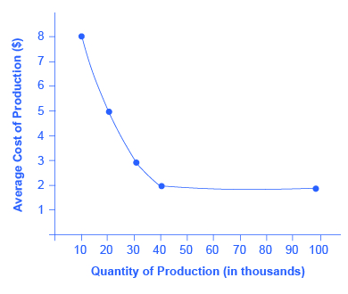

By the end of this section, you will be able to:

* Identify at least two advantages of intra-industry trading
* Explain the relationship between economies of scale and intra-industry trade

Absolute and comparative advantages explain a great deal about patterns of global trade. For example, they help to explain the patterns noted at the start of this chapter, like why you may be eating fresh fruit from Chile or Mexico, or why lower productivity regions like Africa and Latin America are able to sell a substantial proportion of their exports to higher productivity regions like the European Union and North America. Comparative advantage, however, at least at first glance, does not seem especially well-suited to explain other common patterns of international trade.

### The Prevalence of Intra-industry Trade between Similar Economies

The theory of comparative advantage suggests that trade should happen between economies with large differences in opportunity costs of production. Roughly half of all world trade involves shipping goods between the fairly similar high-income economies of the United States, Canada, the European Union, Japan, Mexico, and China (see [\[link\]](#Table_33_14)).

<table id="Table_33_14" summary="This table has three columns and two rows. The first row is a header row and it labels each column &#x201C;Country&#x201D;, &#x201C;U.S. Exports Go to...&#x201D;, and &#x201C;U.S. Imports Come from...&#x201D;. Under the &#x201C;Country&#x201D; column are the European Union, Canada, Japan, Mexico, and China. Under the &#x201C;U.S. Exports Go to...&#x201D; column are the following values: 19.0%, 22.0%, 4.0%, 15.0%, and 8.0%. Under the column &#x201C;U.S. Imports Come from...&#x201D; are the following values: 21.0%, 14.0%, 6.0%, 13.0%, and 20.0%."><caption>Where U.S. Exports Go and U.S. Imports Originate (2015)(Source: https://www.census.gov/foreign-trade/Press-Release/current\_press\_release/ft900.pdf)</caption><thead>
<tr>
<th>Country</th>
<th>U.S. Exports Go to ...</th>
<th>U.S. Imports Come from ...</th>
</tr>
</thead><tbody>
<tr>
<td>European Union</td>
<td>19.0%</td>
<td>21.0%</td>
</tr>

<tr>
<td>Canada</td>
<td>22.0%</td>
<td>14.0%</td>
</tr>

<tr>
<td>Japan</td>
<td>  4.0%</td>
<td>  6.0%</td>
</tr>

<tr>
<td>Mexico</td>
<td>15.0%</td>
<td>13.0%</td>
</tr>

<tr>
<td>China</td>
<td>8.0%</td>
<td>20.0%</td>
</tr>
</tbody></table>

Moreover, the theory of comparative advantage suggests that each economy should specialize to a degree in certain products, and then exchange those products. A high proportion of trade, however, is **intra-industry trade**{: data-type="term"}—that is, trade of goods within the same industry from one country to another. For example, the United States produces and exports autos and imports autos. [\[link\]](#Table_33_15) shows some of the largest categories of U.S. exports and imports. In all of these categories, the United States is both a substantial exporter and a substantial importer of goods from the same industry. In 2014, according to the Bureau of Economic Analysis, the United States exported $159 billion worth of autos, and imported $327 billion worth of autos. About 60% of U.S. trade and 60% of European trade is intra-industry trade.

<table id="Table_33_15" summary="This table has three columns and six rows. The first row is a header row and it labels each column &#x201C;Some U.S. Exports&#x201D;, &#x201C;Quantity of Exports ($ billions)&#x201D;, and &#x201C;Quantity of Imports ($ billions)&#x201D;. Under the column &#x201C;Some U.S. Exports&#x201D; are Autos, Food and beverages, Capital goods, Consumer goods, Industrial supplies, and Other transportation. Under the column &#x201C;Quantity of Exports ($ billions)&#x201D; are the following values: 46, 44, $550, 99, $507, and $45. Under the column &#x201C;Quantity of Imports ($ billions)&#x201D; are the following values: &gt;27, 26, $551, $558, $665, and $55."><caption>Some Intra-Industry U.S. Exports and Imports in 2014(Source: http://www.bea.gov/newsreleases/international/trade/tradnewsrelease.htm)</caption><thead>
<tr>
<th>Some U.S. Exports</th>
<th>Quantity of Exports ($ billions)</th>
<th>Quantity of Imports ($ billions)</th>
</tr>
</thead><tbody>
<tr>
<td>Autos</td>
<td>$146</td>
<td>$327</td>
</tr>

<tr>
<td>Food and beverages</td>
<td>$144</td>
<td>$126</td>
</tr>

<tr>
<td>Capital goods</td>
<td>$550</td>
<td>$551</td>
</tr>

<tr>
<td>Consumer goods</td>
<td>$199</td>
<td>$558</td>
</tr>

<tr>
<td>Industrial supplies</td>
<td> $507</td>
<td> $665</td>
</tr>

<tr>
<td>Other transportation</td>
<td> $45</td>
<td> $55</td>
</tr>

</tbody></table>

Why do similar high-income economies engage in intra-industry trade? What can be the economic benefit of having workers of fairly similar skills making cars, computers, machinery and other products which are then shipped across the oceans to and from the United States, the European Union, and Japan? There are two reasons: (1) The **division of labor**{: data-type="term" .no-emphasis} leads to learning, innovation, and unique skills; and (2) economies of scale.

### Gains from Specialization and Learning

Consider the category of machinery, where the U.S. economy has considerable intra-industry trade. Machinery comes in many varieties, so the United States may be exporting machinery for manufacturing with wood, but importing machinery for photographic processing. The underlying reason why a country like the United States, Japan, or Germany produces one kind of machinery rather than another is usually not related to U.S., German, or Japanese firms and workers having generally higher or lower skills. It is just that, in working on very specific and particular products, firms in certain countries develop unique and different skills.

Specialization in the world economy can be very finely split. In fact, recent years have seen a trend in international trade called **splitting up the value chain**{: data-type="term"}. The **value chain**{: data-type="term"} describes how a good is produced in stages. As indicated in the beginning of the chapter, the production of the iPhone involves the design and engineering of the phone in the United States, parts supplied from Korea, the assembly of the parts in China, and the advertising and marketing done in the United States. Thanks in large part to improvements in communication technology, sharing information, and transportation, it has become easier to split up the value chain. Instead of production in a single large factory, all of these steps can be split up among different firms operating in different places and even different countries. Because firms split up the value chain, international trade often does not involve whole finished products like automobiles or refrigerators being traded between nations. Instead, it involves shipping more specialized goods like, say, automobile dashboards or the shelving that fits inside refrigerators. Intra-industry trade between similar countries produces economic gains because it allows workers and firms to learn and innovate on particular products—and often to focus on very particular parts of the value chain.

Visit this [website][1] for some interesting information about the assembly of the iPhone.

  

### Economies of Scale, Competition, Variety

A second broad reason that intra-industry trade between similar nations produces economic gains involves economies of scale. The concept of **economies of scale**{: data-type="term" .no-emphasis}, as introduced in [Cost and Industry Structure](/m48620){: .target-chapter}, means that as the scale of output goes up, average costs of production decline—at least up to a point. [\[link\]](#CNX_Econ_C33_005) illustrates economies of scale for a plant producing toaster ovens. The horizontal axis of the figure shows the quantity of production by a certain firm or at a certain manufacturing plant. The vertical axis measures the average cost of production. Production plant S produces a small level of output at 30 units and has an average cost of production of $30 per toaster oven. Plant M produces at a medium level of output at 50 units, and has an average cost of production of $20 per toaster oven. Plant L produces 150 units of output with an average cost of production of only $10 per toaster oven. Although plant V can produce 200 units of output, it still has the same unit cost as Plant L.

In this example, a small or medium plant, like S or M, will not be able to compete in the market with a large or a very large plant like L or V, because the firm that operates L or V will be able to produce and sell their output at a lower price. In this example, economies of scale operate up to point L, but beyond point L to V, the additional scale of production does not continue to reduce average costs of production.

 {: #CNX_Econ_C33_005 data-title="Economies of Scale "}

The concept of economies of scale becomes especially relevant to international trade when it enables one or two large producers to supply the entire country. For example, a single large automobile factory could probably supply all the cars purchased in a smaller economy like the United Kingdom or Belgium in a given year. However, if a country has only one or two large factories producing cars, and no **international trade**{: data-type="term" .no-emphasis}, then consumers in that country would have relatively little choice between kinds of cars (other than the color of the paint and other nonessential options). Little or no competition will exist between different car manufacturers.

International trade provides a way to combine the lower average production costs that come from economies of scale and still have competition and variety for consumers. Large automobile factories in different countries can make and sell their products around the world. If the U.S. automobile market was made up of only General Motors, Ford, and Chrysler, the level of competition and consumer choice would be quite a lot lower than when U.S. carmakers must face competition from Toyota, Honda, Suzuki, Fiat, Mitsubishi, Nissan, Volkswagen, Kia, Hyundai, BMW, Subaru, and others. Greater competition brings with it innovation and responsiveness to what consumers want. America’s car producers make far better cars now than they did several decades ago, and much of the reason is competitive pressure, especially from East Asian and European carmakers.

### Dynamic Comparative Advantage

The sources of gains from intra-industry trade between similar economies—namely, the learning that comes from a high degree of specialization and splitting up the value chain and from economies of scale—do not contradict the earlier theory of comparative advantage. Instead, they help to broaden the concept.

In intra-industry trade, the level of worker productivity is not determined by climate or geography. It is not even determined by the general level of education or skill. Instead, the level of worker productivity is determined by how firms engage in specific learning about specialized products, including taking advantage of economies of scale. In this vision, comparative advantage can be dynamic—that is, it can evolve and change over time as new skills are developed and as the value chain is split up in new ways. This line of thinking also suggests that countries are not destined to have the same comparative advantage forever, but must instead be flexible in response to ongoing changes in comparative advantage.

### Key Concepts and Summary

A large share of global trade happens between high-income economies that are quite similar in having well-educated workers and advanced technology. These countries practice intra-industry trade, in which they import and export the same products at the same time, like cars, machinery, and computers. In the case of intra-industry trade between economies with similar income levels, the gains from trade come from specialized learning in very particular tasks and from economies of scale. Splitting up the value chain means that several stages of producing a good take place in different countries around the world.

### Self-Check Questions

How can there be any economic gains for a country from both importing and exporting the same good, like cars?

There are a number of possible advantages of intra-industry trade. Both nations can take advantage of extreme specialization and learning in certain kinds of cars with certain traits, like gas-efficient cars, luxury cars, sport-utility vehicles, higher- and lower-quality cars, and so on. Moreover, nations can take advantage of economies of scale, so that large companies will compete against each other across international borders, providing the benefits of competition and variety to customers. This same argument applies to trade between U.S. states, where people often buy products made by people of other states, even though a similar product is made within the boundaries of their own state. All states—and all countries—can benefit from this kind of competition and trade.

[[link]](#Table_33_16) shows how the average costs of production for semiconductors (the “chips” in computer memories) change as the quantity of semiconductors built at that factory increases.

1.  Based on these data, sketch a curve with quantity produced on the horizontal axis and average cost of production on the vertical axis. How does the curve illustrate economies of scale?
2.  If the equilibrium quantity of semiconductors demanded is 90,000, can this economy take full advantage of economies of scale? What about if quantity demanded is 70,000 semiconductors? 50,000 semiconductors? 30,000 semiconductors?
3.  Explain how international trade could make it possible for even a small economy to take full advantage of economies of scale, while also benefiting from competition and the variety offered by several producers.
{: type="a"}

<table id="Table_33_16" summary="This table has six rows and two columns. The first row is a header row and it labels each column &#x201C;Quantity of Semiconductors&#x201D; and &#x201C;Average Total Cost&#x201D;. Under the &#x201C;Quantity of Semiconductors&#x201D; column are the following values: 10,000; 20,000; 30,000; 40,000; and 100,000. Under the column &#x201C;Average Total Cost&#x201D; are the following values: $8 each, $5 each, $3 each, $2 each, and $2 each."><caption /><thead>
<tr>
<th>Quantity of Semiconductors</th>
<th>Average Total Cost</th>
</tr>
</thead><tbody>
<tr>
<td>  10,000</td>
<td>$8 each</td>
</tr>

<tr>
<td>  20,000</td>
<td>$5 each</td>
</tr>

<tr>
<td>  30,000</td>
<td>$3 each</td>
</tr>

<tr>
<td>  40,000</td>
<td>$2 each</td>
</tr>

<tr>
<td> 100,000</td>
<td>$2 each</td>
</tr>
</tbody></table>

(a) Start by plotting the points on a sketch diagram and then drawing a line through them. The following figure illustrates the average costs of production of semiconductors.

{: #CNX_Econ_C33_009}

The curve illustrates economies of scale by showing that as the scale increases—that is, as production at this particular factory goes up—the average cost of production declines. The economies of scale exist up to an output of 40,000 semiconductors; at higher outputs, the average cost of production does not seem to decline any further.* * *
{: data-type="newline"}

(b) At any quantity demanded above 40,000, this economy can take full advantage of economies of scale; that is, it can produce at the lowest cost per unit. Indeed, if the quantity demanded was quite high, like 500,000, then there could be a number of different factories all taking full advantage of economies of scale and competing with each other. If the quantity demanded falls below 40,000, then the economy by itself, without foreign trade, cannot take full advantage of economies of scale.* * *
{: data-type="newline"}

(c) The simplest answer to this question is that the small country could have a large enough factory to take full advantage of economies of scale, but then export most of the output. For semiconductors, countries like Taiwan and Korea have recently fit this description. Moreover, this country could also import semiconductors from other countries which also have large factories, thus getting the benefits of competition and variety. A slightly more complex answer is that the country can get these benefits of economies of scale without producing semiconductors, but simply by buying semiconductors made at low cost around the world. An economy, especially a smaller country, may well end up specializing and producing a few items on a large scale, but then trading those items for other items produced on a large scale, and thus gaining the benefits of economies of scale by trade, as well as by direct production.

### Review Questions

What is intra-industry trade?

What are the two main sources of economic gains from intra-industry trade?

What is splitting up the value chain?

### Critical Thinking Questions

Does intra-industry trade contradict the theory of comparative advantage?

Do consumers benefit from intra-industry trade?

Why might intra-industry trade seem surprising from the point of view of comparative advantage?

### Problems

From earlier chapters you will recall that technological change shifts the average cost curves. Draw a graph showing how technological change could influence intra-industry trade.

Consider two countries: South Korea and Taiwan. Taiwan can produce one million mobile phones per day at the cost of $10 per phone and South Korea can produce 50 million mobile phones at $5 per phone. Assume these phones are the same type and quality and there is only one price. What is the minimum price at which both countries will engage in trade?

### References

U.S. Census Bureau. 2015. “U.S. International Trade in Goods and Services: December 2014.” Accessed April 13, 2015. http://www.bea.gov/newsreleases/international/trade/2015/pdf/trad1214.pdf.

U.S. Census Bureau. U.S. Bureau of Economic Analysis. 2015. “U.S. International Trade in Goods and Services February 2015.” Accessed April 10, 2015. https://www.census.gov/foreign-trade/Press-Release/current\\\_press\\\_release/ft900.pdf.

Vernengo, Matias. “What Do Undergraduates Really Need to Know About Trade and Finance?” in *Political Economy and Contemporary Capitalism: Radical Perspectives on Economic Theory and Policy*, ed. Ron Baiman, Heather Boushey, and Dawn Saunders. M. E. Sharpe Inc, 2000. Armonk. 177-183.

### Glossary
{: data-type="glossary-title"}

intra-industry trade
: international trade of goods within the same industry
^

splitting up the value chain
: many of the different stages of producing a good happen in different geographic locations
^

value chain
: how a good is produced in stages

[1]: http://openstaxcollege.org/l/iphoneassembly
