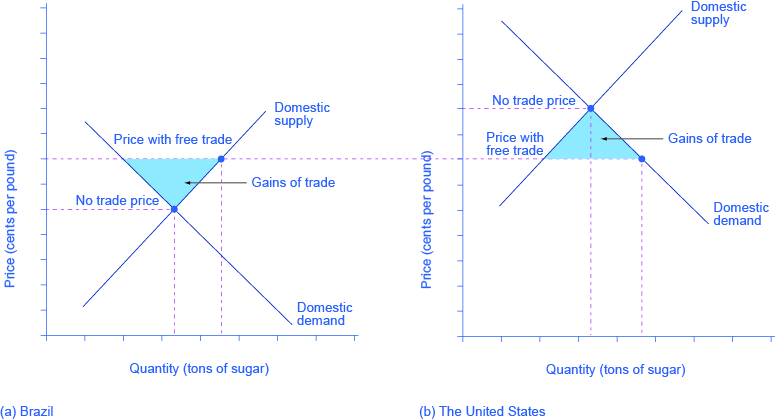
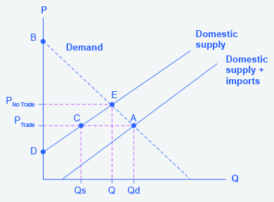

By the end of this section, you will be able to:

* Explain protectionism and its three main forms
* Analyze protectionism through concepts of demand and supply, noting its effects on equilibrium
* Calculate the effects of trade barriers

When a government legislates policies to reduce or block international trade it is engaging in **protectionism**{: data-type="term"}. Protectionist policies often seek to shield domestic producers and domestic workers from foreign competition. Protectionism takes three main forms: tariffs, import quotas, and nontariff barriers.

Recall from [International Trade](/m48818){: .target-chapter} that **tariffs**{: data-type="term" .no-emphasis} are taxes imposed on imported goods and services. They make imports more expensive for consumers, discouraging imports. For example, in recent years large, flat-screen televisions imported from China have faced a 5% tariff rate.

Another way to control trade is through **import quotas**{: data-type="term"}, which are numerical limitations on the quantity of products that can be imported. For instance, during the early 1980s, the Reagan Administration imposed a quota on the import of Japanese automobiles. In the 1970s, many developed countries, including the United States, found themselves with declining textile industries. Textile production does not require highly skilled workers, so producers were able to set up lower-cost factories in developing countries. In order to “manage” this loss of jobs and income, the developed countries established an international Multifiber Agreement that essentially divided up the market for textile exports between importers and the remaining domestic producers. The agreement, which ran from 1974 to 2004, specified the exact quota of textile imports that each developed country would accept from each low-income country. A similar story exists for sugar imports into the United States, which are still governed by quotas.

**Nontariff barriers**{: data-type="term"} are all the other ways that a nation can draw up rules, regulations, inspections, and paperwork to make it more costly or difficult to import products. A rule requiring certain safety standards can limit imports just as effectively as high tariffs or low import quotas, for instance. There are also nontariff barriers in the form of “rules-of-origin” regulations- these rules describe the “Made in Country X” label as the one in which the last substantial change in the product took place. A manufacturer wishing to evade import restrictions may try to change the production process so that the last big change in the product happens in his or her own country. For example, certain textiles are made in the United States, shipped to other countries, combined with textiles made in those other countries to make apparel—and then re-exported back to the United States for a final assembly, to escape paying tariffs or to obtain a “Made in the USA” label.

Despite import quotas, tariffs, and nontariff barriers, the share of apparel sold in the United States that is imported rose from about half in 1999 to about three-quarters today. The U.S. Bureau of Labor Statistics (BLS), estimated the number of U.S. jobs in textiles and apparel fell from 666,360 in 2007 to 385,240 in 2012, a 42% decline. Even more U.S. textile industry jobs would have been lost without tariffs, however, domestic jobs that are saved by import quotas come at a cost. Because textile and apparel protectionism adds to the costs of imports, consumers end up paying billions of dollars more for clothing each year.

When the United States eliminates trade barriers in one area, consumers spend the money they save on that product elsewhere in the economy—so there is no overall loss of jobs for the economy as a whole. Of course, workers in some of the poorest countries of the world who would otherwise have jobs producing textiles, would gain considerably if the United States reduced its barriers to trade in textiles. That said, there are good reasons to be wary about reducing barriers to trade. The 2012 and 2013 Bangladeshi fires in textile factories, which resulted in a horrific loss of life, present complications that our simplified analysis in the chapter will not capture.

Realizing the compromises between nations that come about due to trade policy, many countries came together in 1947 to form the General Agreement on Tariffs and Trade (GATT). (We’ll cover the GATT in more detail later in the chapter.) This agreement has since been superseded by the **World Trade Organization (WTO)**{: data-type="term"}, whose membership includes about 150 nations and most of the economies of the world. It is the primary international mechanism through which nations negotiate their trade rules—including rules about tariffs, quotas, and nontariff barriers. The next section examines the results of such protectionism and develops a simple model to show the impact of trade policy.

# Demand and Supply Analysis of Protectionism

To the non-economist, restricting imports may appear to be nothing more than taking sales from foreign producers and giving them to domestic producers. Other factors are at work, however, because firms do not operate in a vacuum. Instead, firms sell their products either to consumers or to other firms (if they are business suppliers), who are also affected by the trade barriers. A demand and supply analysis of protectionism shows that it is not just a matter of domestic gains and foreign losses, but a policy that imposes substantial domestic costs as well.

Consider two countries, Brazil and the United States, who produce sugar. Each country has a domestic supply and demand for sugar, as detailed in [\[link\]](#Table_34_01) and illustrated in [\[link\]](#CNX_Econ_C34_001). In Brazil, without trade, the **equilibrium**{: data-type="term" .no-emphasis} price of sugar is 12 cents per pound and the equilibrium output is 30 tons. When there is no trade in the United States, the equilibrium price of sugar is 24 cents per pound and the equilibrium quantity is 80 tons. These equilibrium points are labeled with the point E.

 ![This is a two-panel demand and supply graph, with quantity of sugar on the x-axis and price of sugar measured in cents per pound on the y-axis. The price-quantity pairs are plotted using the numbers from Table 34\_01. The graph shows three sets of price outcomes in each country: no trade, free trade, and price with partial protectionism. The no-trade price in Brazil is lower than in the United States. Hence, when countries can engage in trade, the free-trade price will rise in Brazil and decrease in the United States.](../resources/CNX_Econ_C34_001.jpg "Before trade, the equilibrium price of sugar in Brazil is 12 cents a pound and for 24 cents per pound in the United States. When trade is allowed, businesses will buy cheap sugar in Brazil and sell it in the United States. This will result in higher prices in Brazil and lower prices in the United States. Ignoring transaction costs, prices should converge to 16 cents per pound, with Brazil exporting 15 tons of sugar and the United States importing 15 tons of sugar. If trade is only partly open between the countries, it will lead to an outcome between the free-trade and no-trade possibilities."){: #CNX_Econ_C34_001 data-title="The Sugar Trade between Brazil and the United States "}

<table id="Table_34_01" summary="The table represents the sugar trade between Brazil and the United States. Column 1 is labeled price; column 2 shows the quantity supplied (Qs) in Brazil (in tons); column 3 shows the quantity demanded (Qd) in Brazil (in tons); column 4 shows the quantity supplied (Qs) in the U.S. (in tons); and column 5 shows the quantity demanded (Qd) in the U.S. (in tons). At a price of 12 cents, Brazil Qs is 30; Brazil Qd is 30; U.S. Qs is 66; U.S. Qd is 93. At a price of 14 cents, Brazil Qs is 35; Brazil Qd is 28; U.S. Qs is 69; U.S. Qd is 90. At a price of 16 cents, Brazil Qs is 40; Brazil Qd is 25; U.S. Qs is 72; U.S. Qd is 87. At a price of 20 cents, Brazil Qs is 45; Brazil Qd is 21; U.S. Qs is 76; U.S. Qd is 83. At a price of 24 cents, Brazil Qs is 50; Brazil Qd is 18; U.S. Qs is 80; U.S. Qd is 80. At a price of 28 cents; Brazil Qs is 55; Brazil Qd is 15; U.S. Qs is 82; U.S. Qd is 78."><caption>The Sugar Trade between Brazil and the United States</caption><thead>
<tr>
<th>Price</th>
<th>Brazil: Quantity Supplied (tons)</th>
<th>Brazil: Quantity Demanded (tons)</th>
<th>U.S.: Quantity Supplied (tons)</th>
<th>U.S.: Quantity Demanded (tons) </th>
</tr>
</thead><tbody>
<tr>
<td>8 cents</td>
<td>20</td>
<td>35</td>
<td>60</td>
<td>100</td>
</tr>

<tr>
<td>12 cents</td>
<td>30</td>
<td>30</td>
<td>66</td>
<td>93</td>
</tr>

<tr>
<td>14 cents</td>
<td>35</td>
<td>28</td>
<td>69</td>
<td>90</td>
</tr>

<tr>
<td>16 cents</td>
<td>40</td>
<td>25</td>
<td>72</td>
<td>87</td>
</tr>

<tr>
<td>20 cents</td>
<td>45</td>
<td>21</td>
<td>76</td>
<td>83</td>
</tr>

<tr>
<td>24 cents</td>
<td>50</td>
<td>18</td>
<td>80</td>
<td>80</td>
</tr>

<tr>
<td>28 cents</td>
<td>55</td>
<td>15</td>
<td>82</td>
<td>78</td>
</tr>
</tbody></table>

If international trade between Brazil and the United States now becomes possible, profit-seeking firms will spot an opportunity: buy sugar cheaply in Brazil, and sell it at a higher price in the United States. As sugar is shipped from Brazil to the United States, the quantity of sugar produced in Brazil will be greater than Brazilian consumption (with the extra production being exported), and the amount produced in the United States will be less than the amount of U.S. consumption (with the extra consumption being imported). Exports to the United States will reduce the supply of sugar in Brazil, raising its price. Imports into the United States will increase the supply of sugar, lowering its price. When the price of sugar is the same in both countries, there is no incentive to trade further. As [\[link\]](#CNX_Econ_C34_001) shows, the equilibrium with trade occurs at a price of 16 cents per pound. At that price, the sugar farmers of Brazil supply a quantity of 40 tons, while the consumers of Brazil buy only 25 tons.

The extra 15 tons of sugar production, shown by the horizontal gap between the **demand curve**{: data-type="term" .no-emphasis} and the **supply curve**{: data-type="term" .no-emphasis} in Brazil, is exported to the United States. In the United States, at a price of 16 cents, the farmers produce a quantity of 72 tons and consumers demand a quantity of 87 tons. The excess demand of 15 tons by American consumers, shown by the horizontal gap between demand and domestic supply at the price of 16 cents, is supplied by imported sugar. Free trade typically results in income distribution effects, but the key is to recognize the overall gains from trade, as shown in [\[link\]](#CNX_Econ_C34_003). Building on the concepts outlined in [Demand and Supply](/m48628) and [Demand, Supply, and Efficiency](/m48832) in terms of consumer and producer surplus, [\[link\]](#CNX_Econ_C34_003) (a) shows that producers in Brazil gain by selling more sugar at a higher price, while [\[link\]](#CNX_Econ_C34_003) (b) shows consumers in the United States benefit from the lower price and greater availability of sugar. Consumers in Brazil are worse off (compare their no-trade consumer surplus with the free-trade consumer surplus) and U.S. producers of sugar are worse off. There are gains from trade—an increase in social surplus in each country. That is, both the United States and Brazil are better off than they would be without trade. The following Clear It Up feature explains how trade policy can influence low-income countries.

{: #CNX_Econ_C34_003 data-title="Free Trade of Sugar "}

Visit this [website][1] to read more about the global sugar trade.

  

Why are there low-income countries?

Why are the poor countries of the world poor? There are a number of reasons, but one of them will surprise you: the trade policies of the high-income countries. Following is a stark review of social priorities which has been widely publicized by the international aid organization, **Oxfam International**{: data-type="term" .no-emphasis}.

**High-income countries**{: data-type="term" .no-emphasis} of the world—primarily the United States, Canada, countries of the European Union, and Japan—subsidize their domestic farmers collectively by about $360 billion per year. By contrast, the total amount of foreign aid from these same high-income countries to the poor countries of the world is about $70 billion per year, or less than 20% of the farm subsidies. Why does this matter?

It matters because the support of farmers in high-income countries is devastating to the livelihoods of farmers in **low-income countries**{: data-type="term" .no-emphasis}. Even when their climate and land are well-suited to products like cotton, rice, sugar, or milk, farmers in low-income countries find it difficult to compete. Farm **subsidies**{: data-type="term" .no-emphasis} in the high-income countries cause farmers in those countries to increase the amount they produce. This increase in supply drives down world prices of farm products below the costs of production. As Michael Gerson of the *Washington Post* describes it: “\[T\]he effects in the cotton-growing regions of West Africa are dramatic . . . keep\[ing\] millions of Africans on the edge of malnutrition. In some of the poorest countries on Earth, cotton farmers are some of the poorest people, earning about a dollar a day. . . . Who benefits from the current system of subsidies? About 20,000 American cotton producers, with an average annual income of more than $125,000.”

As if subsidies were not enough, often, the high-income countries block agricultural exports from low-income countries. In some cases, the situation gets even worse when the governments of high-income countries, having bought and paid for an excess supply of farm products, give away those products in poor countries and drive local farmers out of business altogether.

For example, shipments of excess milk from the European Union to Jamaica have caused great hardship for Jamaican dairy farmers. Shipments of excess rice from the United States to Haiti drove thousands of low-income rice farmers in Haiti out of business. The opportunity costs of protectionism are not paid just by domestic consumers, but also by foreign producers—and for many agricultural products, those foreign producers are the world’s poor.

Now, let’s look at what happens with **protectionism**{: data-type="term" .no-emphasis}. U.S. sugar farmers are likely to argue that, if only they could be protected from sugar imported from Brazil, the United States would have higher domestic sugar production, more jobs in the sugar industry, and American sugar farmers would receive a higher price. If the United States government sets a high-enough tariff on imported sugar, or sets an import quota at zero, the result will be that the quantity of sugar traded between countries could be reduced to zero, and the prices in each country will return to the levels before trade was allowed.

Blocking only some trade is also possible. Suppose that the United States passed a sugar import quota of seven tons. The United States will import no more than seven tons of sugar, which means that Brazil can export no more than seven tons of sugar to the United States. As a result, the price of sugar in the United States will be 20 cents, which is the price where the quantity demanded is seven tons greater than the domestic quantity supplied. Conversely, if Brazil can export only seven tons of sugar, then the price of sugar in Brazil will be 14 cents per pound, which is the price where the domestic quantity supplied in Brazil is seven tons greater than domestic demand.

In general, when a country sets a low or medium tariff or import quota, the equilibrium price and quantity will be somewhere between no trade and completely free trade. The following Work It Out explores the impact of these trade barriers.

Effects of Trade Barriers

Let’s look carefully at the effects of tariffs or quotas. If the U.S. government imposes a tariff or quota sufficient to eliminate trade with Brazil, two things occur: U.S. consumers pay a higher price and therefore buy a smaller quantity of sugar. U.S. producers obtain a higher price so they sell a larger quantity of sugar. The effects of a tariff on producers and consumers in the United States can be measured using two concepts developed in [Demand, Supply, and Efficiency](/m48832)\: **consumer surplus**{: data-type="term" .no-emphasis} and **producer surplus**{: data-type="term" .no-emphasis}.

{: #CNX_Econ_C34_002 data-title="U.S. Sugar Supply and Demand "}

Step 1. Look at [\[link\]](#CNX_Econ_C34_002), which shows a hypothetical version of the demand and supply of sugar in the United States.

Step 2. Note that the sugar market is in equilibrium at point A where Domestic Quantity Demanded (Qd) = Quantity Supplied (Domestic Qs + Imports from Brazil) at a price of PTrade when there is free trade.

Step 3. Note, also, that imports are equal to the distance between points C and A.

Step 4. Recall that consumer surplus is the value a consumer gets beyond what they paid for when they buy a product. Graphically, it is the area under a demand curve but above the price. In this case, the consumer surplus in the United States is the area of the triangle formed by the points PTrade, A, and B.

Step 5. Recall, also, that producer surplus is another name for profit—it is the income producers get above the cost of production, which is shown by the supply curve here. In this case, the producer surplus with trade is the area of the triangle formed by the points Ptrade, C, and D.

Step 6. Suppose that the barriers to trade are imposed, imports are excluded, and the price rises to PNoTrade. Look what happens to producer surplus and consumer surplus. At the higher price, the domestic quantity supplied increases from Qs to Q at point E. Because producers are selling more quantity at a higher price, the producer surplus increases to the area of the triangle PNoTrade, E, and D.

Step 7. Compare the areas of the two triangles and you will see the increase in the producer surplus.

Step 8. Examine the consumer surplus. Consumers are now paying a higher price to get a lower quantity (Q instead of Qd). Their consumer surplus shrinks to the area of the triangle PNoTrade, E, and B.

Step 9. Determine the net effect. The producer surplus increases by the area Ptrade, C, E, PNoTrade. The loss of consumer surplus, however, is larger. It is the area Ptrade, A, E, PNoTrade. In other words, consumers lose more than producers gain as a result of the trade barriers and the United States has a lower social surplus.

# Who Benefits and Who Pays?

Using the demand and supply model, consider the impact of protectionism on producers and consumers in each of the two countries. For protected producers like U.S. sugar farmers, restricting imports is clearly positive. Without a need to face imported products, these producers are able to sell more, at a higher price. For consumers in the country with the protected good, in this case U.S. sugar consumers, restricting imports is clearly negative. They end up buying a lower quantity of the good and paying a higher price for what they do buy, compared to the equilibrium price and quantity without trade. The following Clear It Up feature considers why a country might outsource jobs even for a domestic product.

Why are Life Savers, an American product, not made in America?

Life Savers, the hard candy with the hole in the middle, were invented in 1912 by Clarence Crane in Cleveland, Ohio. Starting in the late 1960s and for 35 years afterward, 46 billion Life Savers a year, in 200 million rolls, were produced by a plant in Holland, Michigan. But in 2002, the Kraft Company announced that the Michigan plant would be closed and Life Saver production moved across the border to Montreal, Canada.

One reason is that Canadian workers are paid slightly less, especially in healthcare and insurance costs that are not linked to employment there. Another main reason is that the United States government keeps the price of sugar high for the benefit of sugar farmers, with a combination of a government price floor program and strict quotas on imported sugar. According to the Coalition for Sugar Reform, from 2009 to 2012, the price of refined sugar in the United States ranged from 64% to 92% higher than the world price. Life Saver production uses over 100 tons of sugar each day, because the candies are 95% sugar.

A number of other candy companies have also reduced U.S. production and expanded foreign production. Indeed, from 1997 to 2011, some 127,000 jobs in the sugar-using industries, or more than seven times the total employment in sugar production, were eliminated. While the candy industry is especially affected by the cost of sugar, the costs are spread more broadly. U.S. consumers pay roughly $1 billion per year in higher food prices because of elevated sugar costs. Meanwhile, sugar producers in low-income countries are driven out of business. Because of the sugar subsidies to domestic producers and the quotas on imports, they cannot sell their output profitably, or at all, in the United States market.

The fact that protectionism pushes up prices for consumers in the country enacting such protectionism is not always acknowledged openly, but it is not disputed. After all, if protectionism did not benefit domestic producers, there would not be much point in enacting such policies in the first place. Protectionism is simply a method of requiring consumers to subsidize producers. The subsidy is indirect, since it is paid by consumers through higher prices, rather than a direct subsidy paid by the government with money collected from taxpayers. But protectionism works like a subsidy, nonetheless. The American satirist Ambrose Bierce defined “tariff” this way in his 1911 book, *The Devil’s Dictionary*\: “Tariff, n. A scale of taxes on imports, designed to protect the domestic producer against the greed of his consumer.”

The effect of protectionism on producers and consumers in the foreign country is complex. When an import quota is used to impose partial protectionism, the sugar producers of Brazil receive a lower price for the sugar they sell in Brazil—but a higher price for the sugar they are allowed to export to the United States. Indeed, notice that some of the burden of protectionism, paid by domestic consumers, ends up in the hands of foreign producers in this case. Brazilian sugar consumers seem to benefit from U.S. protectionism, because it reduces the price of sugar that they pay. On the other hand, at least some of these Brazilian sugar consumers also work as sugar farmers, so their incomes and jobs are reduced by protectionism. Moreover, if trade between the countries vanishes, Brazilian consumers would miss out on better prices for imported goods—which do not appear in our single-market example of sugar protectionism.

The effects of protectionism on foreign countries notwithstanding, protectionism requires domestic consumers of a product (consumers may include either households or other firms) to pay higher prices to benefit domestic producers of that product. In addition, when a country enacts protectionism, it loses the economic gains it would have been able to achieve through a combination of comparative advantage, specialized learning, and economies of scale, concepts discussed in [International Trade](/m48818){: .target-chapter}.

# Key Concepts and Summary

There are three tools for restricting the flow of trade: tariffs, import quotas, and nontariff barriers. When a country places limitations on imports from abroad, regardless of whether it uses tariffs, quotas, or nontariff barriers, it is said to be practicing protectionism. Protectionism will raise the price of the protected good in the domestic market, which causes domestic consumers to pay more, but domestic producers to earn more.

# Self-Check Questions

Explain how a tariff reduction causes an increase in the equilibrium quantity of imports and a decrease in the equilibrium price. *Hint:* Consider the [Work It Out](#fs-idm78672016) "Effects of Trade Barriers."

This is the opposite case of the Work It Out feature. A reduced tariff is like a decrease in the cost of production, which is shown by a downward (or rightward) shift in the supply curve.

Explain how a subsidy on agricultural goods like sugar adversely affects the income of foreign producers of imported sugar.

A subsidy is like a reduction in cost. This shifts the supply curve down (or to the right), driving the price of sugar down. If the subsidy is large enough, the price of sugar can fall below the cost of production faced by foreign producers, which means they will lose money on any sugar they produce and sell.

# Review Questions

Who does protectionism protect? What does it protect them from?

Name and define three policy tools for enacting protectionism.

How does protectionism affect the price of the protected good in the domestic market?

# Critical Thinking Questions

Show graphically that for any tariff, there is an equivalent quota that would give the same result. What would be the difference, then, between the two types of trade barriers? *Hint*: It is not something you can see from the graph.

From the [Work It Out](#fs-idm78672016) "Effects of Trade Barriers," you can see that a tariff raises the price of imports. What is interesting is that the price rises by less than the amount of the tariff. Who pays the rest of the tariff amount? Can you show this graphically?

# Problems

Assume two countries, Thailand (T) and Japan (J), have one good: cameras. The demand (d) and supply (s) for cameras in Thailand and Japan is described by the following functions:

<math xmlns="http://www.w3.org/1998/Math/MathML"><mtable><mtr><mtd><mtable columnspacing="2px" columnalign="right center left"><mtr><mtd><msup><mtext>Qd</mtext><mtext>T</mtext></msup></mtd><mtd><mtext> = </mtext></mtd><mtd><mtext>60 – P</mtext></mtd></mtr></mtable></mtd></mtr></mtable></math>

<math xmlns="http://www.w3.org/1998/Math/MathML"><mtable><mtr><mtd><mtable columnspacing="2px" columnalign="right center left"><mtr><mtd><msup><mtext>Qs</mtext><mtext>T</mtext></msup></mtd><mtd><mtext> = </mtext></mtd><mtd><mtext>–5 + </mtext><mfrac><mtext>1</mtext><mtext>4</mtext></mfrac><mtext>P</mtext></mtd></mtr></mtable></mtd></mtr></mtable></math>

<math xmlns="http://www.w3.org/1998/Math/MathML"><mtable><mtr><mtd><mtable columnspacing="2px" columnalign="right center left"><mtr><mtd><msup><mtext>Qd</mtext><mtext>J</mtext></msup></mtd><mtd><mtext> = </mtext></mtd><mtd><mtext>80 – P</mtext></mtd></mtr></mtable></mtd></mtr></mtable></math>

<math xmlns="http://www.w3.org/1998/Math/MathML"><mtable><mtr><mtd><mtable columnspacing="2px" columnalign="right center left"><mtr><mtd><msup><mtext>Qs</mtext><mtext>J</mtext></msup></mtd><mtd><mtext> = </mtext></mtd><mtd><mtext>–10 + </mtext><mfrac><mtext>1</mtext><mtext>2</mtext></mfrac><mtext>P</mtext></mtd></mtr></mtable></mtd></mtr></mtable></math>

P is the price measured in a common currency used in both countries, such as the Thai Baht.

1.  Compute the equilibrium price (P) and quantities (Q) in each country without trade.
2.  Now assume that free trade occurs. The free-trade price goes to 56.36 Baht. Who exports and imports cameras and in what quantities?
{: data-number-style="lower-alpha"}

# References

Bureau of Labor Statistics. “Industries at a Glance.” Accessed December 31, 2013. http://www.bls.gov/iag/.

Oxfam International. Accessed January 6, 2014. http://www.oxfam.org/.

[1]: http://openstaxcollege.org/l/sugartrade
