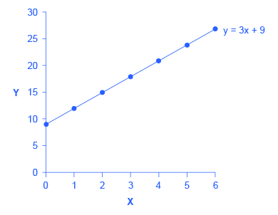
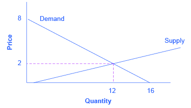
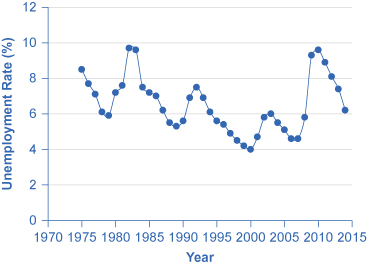
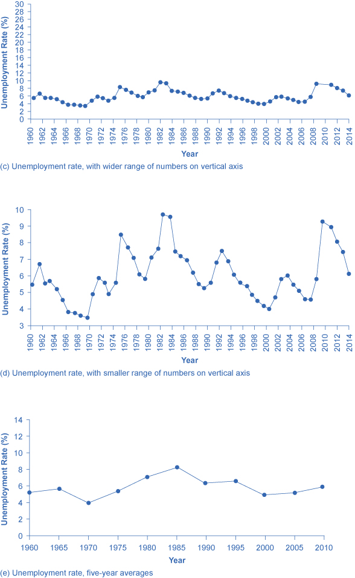
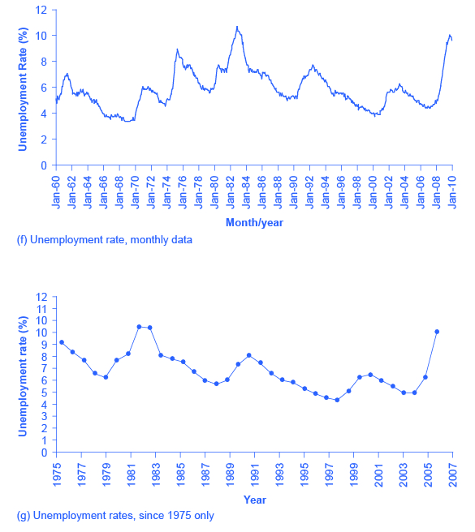

<?cnx.eoc class="summary" title="Chapter Review"?>

<?cnx.eoc class="self-check-questions" title="Self-Check Questions"?>

<?cnx.eoc class="review-questions" title="Review Questions"?>

<?cnx.eoc class="critical-thinking" title="Critical Thinking Questions"?>

<?cnx.eoc class="problems" title="Problems"?>

<?cnx.eoc class="references" title="References"?>

(This appendix should be consulted after first reading [Welcome to Economics!](/m48590){: .target-chapter}) Economics is not math. There is no important concept in this course that cannot be explained without mathematics. That said, math is a tool that can be used to illustrate economic concepts. Remember the saying a picture is worth a thousand words? Instead of a picture, think of a graph. It is the same thing. Economists use models as the primary tool to derive insights about economic issues and problems. Math is one way of working with (or manipulating) economic models.

There are other ways of representing models, such as text or narrative. But why would you use your fist to bang a nail, if you had a hammer? Math has certain advantages over text. It disciplines your thinking by making you specify exactly what you mean. You can get away with fuzzy thinking in your head, but you cannot when you reduce a model to algebraic equations. At the same time, math also has disadvantages. Mathematical models are necessarily based on simplifying assumptions, so they are not likely to be perfectly realistic. Mathematical models also lack the nuances which can be found in narrative models. The point is that math is one tool, but it is not the only tool or even always the best tool economists can use. So what math will you need for this book? The answer is: little more than high school algebra and graphs. You will need to know:

* What a function is
* How to interpret the equation of a line (i.e., slope and intercept)
* How to manipulate a line (i.e., changing the slope or the intercept)
* How to compute and interpret a growth rate (i.e., percentage change)
* How to read and manipulate a graph

In this text, we will use the easiest math possible, and we will introduce it in this appendix. So if you find some math in the book that you cannot follow, come back to this appendix to review. Like most things, math has diminishing returns. A little math ability goes a long way; the more advanced math you bring in, the less additional knowledge that will get you. That said, if you are going to major in economics, you should consider learning a little calculus. It will be worth your while in terms of helping you learn advanced economics more quickly.

# Algebraic Models

Often economic models (or parts of models) are expressed in terms of mathematical functions. What is a function? A **function**{: data-type="term" .no-emphasis} describes a relationship. Sometimes the relationship is a definition. For example (using words), your professor is Adam Smith. This could be expressed as Professor = Adam Smith. Or Friends = Bob + Shawn + Margaret.

Often in economics, functions describe cause and effect. The variable on the left-hand side is what is being explained (“the effect”). On the right-hand side is what is doing the explaining (“the causes”). For example, suppose your GPA was determined as follows:

<math xmlns="http://www.w3.org/1998/Math/MathML"><mtext>GPA = 0.25 × combined\_SAT + 0.25 × class\_attendance + 0.50 × hours\_spent\_studying</mtext></math>

This equation states that your GPA depends on three things: your combined SAT score, your class attendance, and the number of hours you spend studying. It also says that study time is twice as important (0.50) as either combined\\\_SAT score (0.25) or class\\\_attendance (0.25). If this relationship is true, how could you raise your GPA? By not skipping class and studying more. Note that you cannot do anything about your SAT score, since if you are in college, you have (presumably) already taken the SATs.

Of course, economic models express relationships using economic variables, like Budget = money\\\_spent\\\_on\\\_econ\\\_books + money\\\_spent\\\_on\\\_music, assuming that the only things you buy are economics books and music.

Most of the relationships we use in this course are expressed as linear equations of the form:

<math xmlns="http://www.w3.org/1998/Math/MathML"><mtext>y = b + mx</mtext></math>

**Expressing Equations Graphically**

Graphs are useful for two purposes. The first is to express equations visually, and the second is to display statistics or data. This section will discuss expressing equations visually.

To a mathematician or an economist, a **variable**{: data-type="term" .no-emphasis} is the name given to a quantity that may assume a range of values. In the equation of a line presented above, x and y are the variables, with x on the horizontal axis and y on the vertical axis, and b and m representing factors that determine the shape of the line. To see how this equation works, consider a numerical example:

<math xmlns="http://www.w3.org/1998/Math/MathML"><mtext>y = 9 + 3x</mtext></math>

In this equation for a specific line, the b term has been set equal to 9 and the m term has been set equal to 3. [\[link\]](#Table_A_01) shows the values of x and y for this given equation. [\[link\]](#CNX_Econ_A01_010) shows this equation, and these values, in a graph. To construct the table, just plug in a series of different values for x, and then calculate what value of y results. In the figure, these points are plotted and a line is drawn through them.

<table id="Table_A_01" summary="The table shows the values for the slop intercept equation. Column 1 shows the values for x. Column 2 shows the values for y. Row 1: (0, 9); Row 2: (1, 12); Row 3: (2, 15); Row 4: (3, 18); Row 5: (4, 21); Row 6: (5, 24); Row 7: (6, 27)."><caption>Values for the Slope Intercept Equation</caption><thead>
<tr>
<th>x</th>
<th>y</th>
</tr>
</thead><tbody>
<tr>
<td>0</td>
<td>9</td>
</tr>

<tr>
<td>1</td>
<td>12</td>
</tr>

<tr>
<td>2</td>
<td>15</td>
</tr>

<tr>
<td>3</td>
<td>18</td>
</tr>

<tr>
<td>4</td>
<td>21</td>
</tr>
<tr>
<td>5</td>
<td>24</td>
</tr>
<tr>
<td>6</td>
<td>27</td>
</tr>

      </tbody></table>

 {: #CNX_Econ_A01_010 data-title="Slope and the Algebra of Straight Lines "}

This example illustrates how the b and m terms in an equation for a straight line determine the shape of the line. The b term is called the y-intercept. The reason for this name is that, if x = 0, then the b term will reveal where the line intercepts, or crosses, the y-axis. In this example, the line hits the vertical axis at 9. The m term in the equation for the line is the slope. Remember that **slope**{: data-type="term" .no-emphasis} is defined as rise over run; more specifically, the slope of a line from one point to another is the change in the vertical axis divided by the change in the horizontal axis. In this example, each time the x term increases by one (the run), the y term rises by three. Thus, the slope of this line is three. Specifying a y-intercept and a slope—that is, specifying b and m in the equation for a line—will identify a specific line. Although it is rare for real-world data points to arrange themselves as an exact straight line, it often turns out that a straight line can offer a reasonable approximation of actual data.

**Interpreting the Slope**

The concept of slope is very useful in economics, because it measures the relationship between two variables. A **positive slope**{: data-type="term" .no-emphasis} means that two variables are positively related; that is, when x increases, so does y, or when x decreases, y decreases also. Graphically, a positive slope means that as a line on the line graph moves from left to right, the line rises. The length-weight relationship, shown in [\[link\]](#CNX_Econ_A01_008) later in this Appendix, has a positive slope. We will learn in other chapters that price and quantity supplied have a positive relationship; that is, firms will supply more when the price is higher.

A **negative slope**{: data-type="term" .no-emphasis} means that two variables are negatively related; that is, when x increases, y decreases, or when x decreases, y increases. Graphically, a negative slope means that, as the line on the line graph moves from left to right, the line falls. The altitude-air density relationship, shown in [\[link\]](#CNX_Econ_A01_009) later in this appendix, has a negative slope. We will learn that price and quantity demanded have a negative relationship; that is, consumers will purchase less when the price is higher.

A slope of zero means that there is no relationship between x and y. Graphically, the line is flat; that is, zero rise over the run. [\[link\]](#CNX_Econ_A01_025) of the unemployment rate, shown later in this appendix, illustrates a common pattern of many line graphs: some segments where the slope is positive, other segments where the slope is negative, and still other segments where the slope is close to zero.

The slope of a straight line between two points can be calculated in numerical terms. To calculate slope, begin by designating one point as the “starting point” and the other point as the “end point” and then calculating the rise over run between these two points. As an example, consider the slope of the air density graph between the points representing an altitude of 4,000 meters and an altitude of 6,000 meters:

Rise: Change in variable on vertical axis (end point minus original point)

<math xmlns="http://www.w3.org/1998/Math/MathML"><mtable columnspacing="2px" columnalign="right center left"><mtr><mtd /><mtd><mtext> = </mtext></mtd><mtd><mtext>0.100 – 0.307</mtext></mtd></mtr><mtr><mtd /><mtd><mtext> = </mtext></mtd><mtd><mtext>–0.207</mtext></mtd></mtr></mtable></math>

Run: Change in variable on horizontal axis (end point minus original point)

<math xmlns="http://www.w3.org/1998/Math/MathML"><mtable columnspacing="2px 2px 2px" columnalign="center center left"><mtr><mtd /><mtd><mtext>= </mtext></mtd><mtd><mtext>6,000 – 4,000</mtext></mtd></mtr><mtr><mtd /><mtd><mtext>= </mtext></mtd><mtd><mtext>2,000</mtext></mtd></mtr></mtable></math>

Thus, the slope of a straight line between these two points would be that from the altitude of 4,000 meters up to 6,000 meters, the density of the air decreases by approximately 0.1 kilograms/cubic meter for each of the next 1,000 meters

Suppose the slope of a line were to increase. Graphically, that means it would get steeper. Suppose the slope of a line were to decrease. Then it would get flatter. These conditions are true whether or not the slope was positive or negative to begin with. A higher positive slope means a steeper upward tilt to the line, while a smaller positive slope means a flatter upward tilt to the line. A negative slope that is larger in absolute value (that is, more negative) means a steeper downward tilt to the line. A slope of zero is a horizontal flat line. A vertical line has an infinite slope.

Suppose a line has a larger intercept. Graphically, that means it would shift out (or up) from the old origin, parallel to the old line. If a line has a smaller intercept, it would shift in (or down), parallel to the old line.

**Solving Models with Algebra**

Economists often use models to answer a specific question, like: What will the unemployment rate be if the economy grows at 3% per year? Answering specific questions requires solving the “system” of equations that represent the model.

Suppose the demand for personal pizzas is given by the following equation:

<math xmlns="http://www.w3.org/1998/Math/MathML"><mtext>Qd = 16 – 2P</mtext></math>

where Qd is the amount of personal pizzas consumers want to buy (i.e., quantity demanded), and P is the price of pizzas. Suppose the supply of personal pizzas is:

<math xmlns="http://www.w3.org/1998/Math/MathML"><mtext>Qs = 2 + 5P</mtext></math>

where Qs is the amount of pizza producers will supply (i.e., quantity supplied).

Finally, suppose that the personal pizza market operates where supply equals demand, or

<math xmlns="http://www.w3.org/1998/Math/MathML"><mtext>Qd = Qs</mtext></math>

We now have a system of three equations and three unknowns (Qd, Qs, and P), which we can solve with algebra:

Since Qd = Qs, we can set the demand and supply equation equal to each other:

<math xmlns="http://www.w3.org/1998/Math/MathML"><mtable columnspacing="2px" columnalign="right center left"><mtr><mtd><mtext>Qd</mtext></mtd><mtd><mtext> = </mtext></mtd><mtd><mtext>Qs</mtext></mtd></mtr><mtr><mtd><mtext>16 – 2P</mtext></mtd><mtd><mtext> = </mtext></mtd><mtd><mtext>2 + 5P</mtext></mtd></mtr></mtable></math>

Subtracting 2 from both sides and adding 2P to both sides yields:

<math xmlns="http://www.w3.org/1998/Math/MathML"><mtable columnspacing="2px" columnalign="right center left"><mtr><mtd><mtext>16 – 2P – 2</mtext></mtd><mtd><mtext> = </mtext></mtd><mtd><mtext>2 + 5P – 2</mtext></mtd></mtr><mtr><mtd><mtext>14 – 2P</mtext></mtd><mtd><mtext> = </mtext></mtd><mtd><mtext>5P</mtext></mtd></mtr><mtr><mtd><mtext>14 – 2P + 2P</mtext></mtd><mtd><mtext> = </mtext></mtd><mtd><mtext>5P + 2P</mtext></mtd></mtr><mtr><mtd><mtext>14</mtext></mtd><mtd><mtext> = </mtext></mtd><mtd><mtext>7P</mtext></mtd></mtr><mtr><mtd><mfrac><mtext>14</mtext><mtext>7</mtext></mfrac></mtd><mtd><mtext> = </mtext></mtd><mtd><mfrac><mtext>7P</mtext><mtext>7</mtext></mfrac></mtd></mtr><mtr><mtd><mtext>2</mtext></mtd><mtd><mtext> = </mtext></mtd><mtd><mtext>P</mtext></mtd></mtr></mtable></math>

In other words, the price of each personal pizza will be $2. How much will consumers buy?

Taking the price of $2, and plugging it into the demand equation, we get:

<math xmlns="http://www.w3.org/1998/Math/MathML"><mtable columnspacing="2px" columnalign="right center left"><mtr><mtd><mtext>Qd</mtext></mtd><mtd><mtext> = </mtext></mtd><mtd><mtext>16 – 2P</mtext></mtd></mtr><mtr><mtd /><mtd><mtext> = </mtext></mtd><mtd><mtext>16 – 2(2)</mtext></mtd></mtr><mtr><mtd /><mtd><mtext> = </mtext></mtd><mtd><mtext>16 – 4</mtext></mtd></mtr><mtr><mtd /><mtd><mtext> = </mtext></mtd><mtd><mtext>12</mtext></mtd></mtr></mtable></math>

So if the price is $2 each, consumers will purchase 12. How much will producers supply? Taking the price of $2, and plugging it into the supply equation, we get:

<math xmlns="http://www.w3.org/1998/Math/MathML"><mtable columnspacing="2px" columnalign="right center left"><mtr><mtd><mtext>Qs</mtext></mtd><mtd><mtext> = </mtext></mtd><mtd><mtext>2 + 5P</mtext></mtd></mtr><mtr><mtd /><mtd><mtext> = </mtext></mtd><mtd><mtext>2 + 5(2)</mtext></mtd></mtr><mtr><mtd /><mtd><mtext> = </mtext></mtd><mtd><mtext>2 + 10</mtext></mtd></mtr><mtr><mtd /><mtd><mtext> = </mtext></mtd><mtd><mtext>12</mtext></mtd></mtr></mtable></math>

So if the price is $2 each, producers will supply 12 personal pizzas. This means we did our math correctly, since Qd = Qs.

**Solving Models with Graphs**

If algebra is not your forte, you can get the same answer by using graphs. Take the equations for Qd and Qs and graph them on the same set of axes as shown in [\[link\]](#CNX_Econ_A01_024). Since P is on the vertical axis, it is easiest if you solve each equation for P. The demand curve is then P = 8 – 0.5Qd and the demand curve is P = –0.4 + 0.2Qs. Note that the vertical intercepts are 8 and –0.4, and the slopes are –0.5 for demand and 0.2 for supply. If you draw the graphs carefully, you will see that where they cross (Qs = Qd), the price is $2 and the quantity is 12, just like the algebra predicted.

{: #CNX_Econ_A01_024 data-title="Supply and Demand Graph "}

We will use graphs more frequently in this book than algebra, but now you know the math behind the graphs.

# Growth Rates

Growth rates are frequently encountered in real world economics. A **growth rate**{: data-type="term" .no-emphasis} is simply the percentage change in some quantity. It could be your income. It could be a business’s sales. It could be a nation’s GDP. The formula for computing a growth rate is straightforward:

<math xmlns="http://www.w3.org/1998/Math/MathML"><mtable columnspacing="2px" columnalign="right center left"><mtr><mtd><mtext>Percentage change</mtext></mtd><mtd><mtext> = </mtext></mtd><mtd><mfrac><mtext>Change in quantity</mtext><mtext>Quantity</mtext></mfrac></mtd></mtr></mtable></math>

Suppose your job pays $10 per hour. Your boss, however, is so impressed with your work that he gives you a $2 per hour raise. The percentage change (or growth rate) in your pay is $2/$10 = 0.20 or 20%.

To compute the growth rate for data over an extended period of time, for example, the average annual growth in GDP over a decade or more, the denominator is commonly defined a little differently. In the previous example, we defined the quantity as the initial quantity—or the quantity when we started. This is fine for a one-time calculation, but when we compute the growth over and over, it makes more sense to define the quantity as the average quantity over the period in question, which is defined as the quantity halfway between the initial quantity and the next quantity. This is harder to explain in words than to show with an example. Suppose a nation’s GDP was $1 trillion in 2005 and $1.03 trillion in 2006. The growth rate between 2005 and 2006 would be the change in GDP ($1.03 trillion – $1.00 trillion) divided by the average GDP between 2005 and 2006 ($1.03 trillion + $1.00 trillion)/2. In other words:

<math xmlns="http://www.w3.org/1998/Math/MathML"><mtable columnspacing="2px" columnalign="right center left"><mtr><mtd /><mtd><mtext> = </mtext></mtd><mtd><mfrac><mtext>$1.03 trillion – $1.00 trillion</mtext><mtext>($1.03 trillion + $1.00 trillion) / 2</mtext></mfrac></mtd></mtr><mtr><mtd /><mtd><mtext> = </mtext></mtd><mtd><mfrac><mtext>0.03</mtext><mtext>1.015</mtext></mfrac></mtd></mtr><mtr><mtd /><mtd><mtext> = </mtext></mtd><mtd><mtext>0.0296</mtext></mtd></mtr><mtr><mtd /><mtd><mtext> = </mtext></mtd><mtd><mtext>2.96% growth</mtext></mtd></mtr></mtable></math>

Note that if we used the first method, the calculation would be ($1.03 trillion – $1.00 trillion) / $1.00 trillion = 3% growth, which is approximately the same as the second, more complicated method. If you need a rough approximation, use the first method. If you need accuracy, use the second method.

A few things to remember: A positive growth rate means the quantity is growing. A smaller growth rate means the quantity is growing more slowly. A larger growth rate means the quantity is growing more quickly. A negative growth rate means the quantity is decreasing.

The same change over times yields a smaller growth rate. If you got a $2 raise each year, in the first year the growth rate would be $2/$10 = 20%, as shown above. But in the second year, the growth rate would be $2/$12 = 0.167 or 16.7% growth. In the third year, the same $2 raise would correspond to a $2/$14 = 14.2%. The moral of the story is this: To keep the growth rate the same, the change must increase each period.

# Displaying Data Graphically and Interpreting the Graph

Graphs are also used to display data or evidence. Graphs are a method of presenting numerical patterns. They condense detailed numerical information into a visual form in which relationships and numerical patterns can be seen more easily. For example, which countries have larger or smaller populations? A careful reader could examine a long list of numbers representing the populations of many countries, but with over 200 nations in the world, searching through such a list would take concentration and time. Putting these same numbers on a graph can quickly reveal population patterns. Economists use graphs both for a compact and readable presentation of groups of numbers and for building an intuitive grasp of relationships and connections.

Three types of graphs are used in this book: line graphs, pie graphs, and bar graphs. Each is discussed below. We also provide warnings about how graphs can be manipulated to alter viewers’ perceptions of the relationships in the data.

**Line Graphs**

The graphs we have discussed so far are called **line graphs**{: data-type="term" .no-emphasis}, because they show a relationship between two variables: one measured on the horizontal axis and the other measured on the vertical axis.

Sometimes it is useful to show more than one set of data on the same axes. The data in [\[link\]](#Table_A_02) is displayed in [\[link\]](#CNX_Econ_A01_008) which shows the relationship between two variables: length and median weight for American baby boys and girls during the first three years of life. (The **median**{: data-type="term" .no-emphasis} means that half of all babies weigh more than this and half weigh less.) The line graph measures length in inches on the horizontal axis and weight in pounds on the vertical axis. For example, point A on the figure shows that a boy who is 28 inches long will have a median weight of about 19 pounds. One line on the graph shows the length-weight relationship for boys and the other line shows the relationship for girls. This kind of graph is widely used by healthcare providers to check whether a child’s physical development is roughly on track.

 is typically 19 pounds in weight (measured on the vertical axis). These data apply only to children in the first three years of life."){: #CNX_Econ_A01_008 data-title="The Length-Weight Relationship for American Boys and Girls "}

<table id="Table_A_02" summary="The table shows length (inches) and weight (pounds) for Boys from birth to 36 months and Girls from birth to 36 months. The measurement for length (inches) is provided first, and the measurement for weight (pounds) is provided second. The first set of amounts is for boys. Row 1: length = 20, weight = 8.0. Row 2: length = 22, weight = 10.5. Row 3: length = 24, weight = 13.5. Row 4: length = 26, weight = 16.4. Row 5: length = 28, weight = 19. Row 6: length 30, weight = 21.8. Row 7: length = 32, weight = 24.3. Row 8: length = 34, weight = 27. Row 9: length = 36, weight = 9.3. Row 10: length = 38, weight = 32. The following amounts are for girls. Row 1: length = 20, weight = 7.9. Row 2: length 22, weight = 10.5. Row 3: length = 24, weight = 13.2. Row 4: length = 26, weight = 16. Row 5: length = 28, weight = 18.8. Row 6: length = 30, weight = 21.2. Row 7: length = 32, weight = 24. Row 8: length = 34, weight = 26.2. Row 9: length = 36, weight = 28.9. Row 10: length = 38, weight = 31.3."><caption>Length to Weight Relationship for American Boys and Girls</caption><thead>
<tr>
<th colspan="2">Boys from Birth to 36 Months</th>
<th colspan="2">Girls from Birth to 36 Months</th>
</tr>
</thead><tbody>
<tr>
<td>Length (inches)</td>
<td>Weight (pounds)</td>
<td>Length (inches)</td>
<td>Weight (pounds)</td>
</tr>

<tr>
<td>20.0</td>
<td>8.0</td>
<td>20.0</td>
<td>7.9</td>
</tr>

<tr>
<td>22.0</td>
<td>10.5</td>
<td>22.0</td>
<td>10.5</td>
</tr>

<tr>
<td>24.0</td>
<td>13.5</td>
<td>24.0</td>
<td>13.2</td>
</tr>
<tr>
<td>26.0</td>
<td>16.4</td>
<td>26.0</td>
<td>16.0</td>
</tr>
<tr>
<td>28.0</td>
<td>19.0</td>
<td>28.0</td>
<td>18.8</td>
</tr>
<tr>
<td>30.0</td>
<td>21.8</td>
<td>30.0</td>
<td>21.2</td>
</tr>
<tr>
<td>32.0</td>
<td>24.3</td>
<td>32.0</td>
<td>24.0</td>
</tr>
<tr>
<td>34.0</td>
<td>27.0</td>
<td>34.0</td>
<td>26.2</td>
</tr>
<tr>
<td>36.0</td>
<td>29.3</td>
<td>36.0</td>
<td>28.9</td>
</tr>
<tr>
<td>38.0</td>
<td>32.0</td>
<td>38.0</td>
<td>31.3</td>
</tr>

      </tbody></table>

Not all relationships in economics are linear. Sometimes they are curves. [\[link\]](#CNX_Econ_A01_009) presents another example of a line graph, representing the data from [\[link\]](#Table_A_03). In this case, the line graph shows how thin the air becomes when you climb a mountain. The horizontal axis of the figure shows altitude, measured in meters above sea level. The vertical axis measures the density of the air at each altitude. Air density is measured by the weight of the air in a cubic meter of space (that is, a box measuring one meter in height, width, and depth). As the graph shows, air pressure is heaviest at ground level and becomes lighter as you climb. [\[link\]](#CNX_Econ_A01_009) shows that a cubic meter of air at an altitude of 500 meters weighs approximately one kilogram (about 2.2 pounds). However, as the altitude increases, air density decreases. A cubic meter of air at the top of Mount Everest, at about 8,828 meters, would weigh only 0.023 kilograms. The thin air at high altitudes explains why many mountain climbers need to use oxygen tanks as they reach the top of a mountain.

 and air density of 0.023 kilograms per cubic meter (the vertical axis)."){: #CNX_Econ_A01_009 data-title="Altitude-Air Density Relationship "}

<table id="Table_A_03" summary="The table shows the relationship between altitude and air density. Column 1 lists the Altitude (meters). Column 2 lists the Air Density (kg/cubic meters). Altitude of 0 (meters) has Air density of 1.200 (kg/cubic meters). Altitude of 500 (meters) has Air density of 1.093 (kg/cubic meters). Altitude of 1,000 (meters) has Air density of 0.831 (kg/cubic meters). Altitude of 1,500 (meters) has Air density of 0.678 (kg/cubic meters). Altitude of 2,000 (meters) has Air density of 0.569 (kg/cubic meters). Altitude of 2,500 (meters) has Air density of 0.484 (kg/cubic meters). Altitude of 3,000 (meters) has Air density of 0.415 (kg/cubic meters). Altitude of 3,500 (meters) has Air density of 0.357 (kg/cubic meters). Altitude of 4,000 (meters) has Air density of 0.307 (kg/cubic meters). Altitude of 4,500 (meters) has Air density of 0.231 (kg/cubic meters). Altitude of 5,000 (meters) has Air density of 0.182 (kg/cubic meters). Altitude of 5,500 (meters) has Air density of 0.142 (kg/cubic meters). Altitude of 6,000 (meters) has Air density of 0.100 (kg/cubic meters). Altitude of 6,500 (meters) has Air density of 0.085 (kg/cubic meters). Altitude of 7,000 (meters) has Air density of 0.066 (kg/cubic meters). Altitude of 7,500 (meters) has Air density of 0.051 (kg/cubic meters). Altitude of 8,000 (meters) has Air density of 0.041 (kg/cubic meters). Altitude of 8,500 (meters) has Air density of 0.025 (kg/cubic meters). Altitude of 9,000 (meters) has Air density of 0.022 (kg/cubic meters). Altitude of 9,500 (meters) has Air density of 0.019 (kg/cubic meters). Altitude of 10,000 (meters) has Air density of 0.014 (kg/cubic meters)."><caption>Altitude to Air Density Relationship</caption><thead>
<tr>
<th>Altitude (meters)</th>
<th>Air Density (kg/cubic meters)</th>
</tr>
</thead><tbody>
<tr>
<td>0</td>
<td>1.200</td>
</tr>

<tr>
<td>500</td>
<td>1.093</td>
</tr>

<tr>
<td>1,000</td>
<td>0.831</td>
</tr>
<tr>
<td>1,500</td>
<td>0.678</td>
</tr>
<tr>
<td>2,000</td>
<td>0.569</td>
</tr>
<tr>
<td>2,500</td>
<td>0.484</td>
</tr>
<tr>
<td>3,000</td>
<td>0.415</td>
</tr>
<tr>
<td>3,500</td>
<td>0.357</td>
</tr>
<tr>
<td>4,000</td>
<td>0.307</td>
</tr>
<tr>
<td>4,500</td>
<td>0.231</td>
</tr>
<tr>
<td>5,000</td>
<td>0.182</td>
</tr>
<tr>
<td>5,500</td>
<td>0.142</td>
</tr>
<tr>
<td>6,000</td>
<td>0.100</td>
</tr>
<tr>
<td>6,500</td>
<td>0.085</td>
</tr>
<tr>
<td>7,000</td>
<td>0.066</td>
</tr>
<tr>
<td>7,500</td>
<td>0.051</td>
</tr>
<tr>
<td>8,000</td>
<td>0.041</td>
</tr>
<tr>
<td>8,500</td>
<td>0.025</td>
</tr>
<tr>
<td>9,000</td>
<td>0.022</td>
</tr>
<tr>
<td>9,500</td>
<td>0.019</td>
</tr>
<tr>
<td>10,000</td>
<td>0.014</td>
</tr>
</tbody></table>

The length-weight relationship and the altitude-air density relationships in these two figures represent averages. If you were to collect actual data on air pressure at different altitudes, the same altitude in different geographic locations will have slightly different air density, depending on factors like how far you are from the equator, local weather conditions, and the humidity in the air. Similarly, in measuring the height and weight of children for the previous line graph, children of a particular height would have a range of different weights, some above average and some below. In the real world, this sort of variation in data is common. The task of a researcher is to organize that data in a way that helps to understand typical patterns. The study of statistics, especially when combined with computer statistics and spreadsheet programs, is a great help in organizing this kind of data, plotting line graphs, and looking for typical underlying relationships. For most economics and social science majors, a statistics course will be required at some point.

One common line graph is called a **time series**{: data-type="term" .no-emphasis}, in which the horizontal axis shows time and the vertical axis displays another variable. Thus, a time series graph shows how a variable changes over time. [\[link\]](#CNX_Econ_A01_025) shows the unemployment rate in the United States since 1975, where unemployment is defined as the percentage of adults who want jobs and are looking for a job, but cannot find one. The points for the unemployment rate in each year are plotted on the graph, and a line then connects the points, showing how the unemployment rate has moved up and down since 1975. The line graph makes it easy to see, for example, that the highest unemployment rate during this time period was slightly less than 10% in the early 1980s and 2010, while the unemployment rate declined from the early 1990s to the end of the 1990s, before rising and then falling back in the early 2000s, and then rising sharply during the recession from 2008–2009.

{: #CNX_Econ_A01_025 data-title="U.S. Unemployment Rate, 1975&#x2013;2014"}

**Pie Graphs**

A **pie graph**{: data-type="term" .no-emphasis} (sometimes called a **pie chart**{: data-type="term" .no-emphasis}) is used to show how an overall total is divided into parts. A circle represents a group as a whole. The slices of this circular “pie” show the relative sizes of subgroups.

[\[link\]](#CNX_Econ_A01_020) shows how the U.S. population was divided among children, working age adults, and the elderly in 1970, 2000, and what is projected for 2030. The information is first conveyed with numbers in [\[link\]](#Table_A_04), and then in three pie charts. The first column of [\[link\]](#Table_A_04) shows the total U.S. population for each of the three years. Columns 2–4 categorize the total in terms of age groups—from birth to 18 years, from 19 to 64 years, and 65 years and above. In columns 2–4, the first number shows the actual number of people in each age category, while the number in parentheses shows the percentage of the total population comprised by that age group.

<table id="Table_A_04" summary="The table shows U.S. age distribution data for the years 1970, 2000, and 2030 (projected). Column 1 lists the Year. Column 2 lists the Total Population (in millions). Column 3 lists the percentage of citizens 19 and Under. Column 4 lists the percentage of citizens 20&#x2014;64 Years. Column 5 lists the percentage of citizens Over 65. Row 1: Year 1970; 205.0 million total population; 77.2 (37.6%) 19 and under; 107.7 (52.5%) 20-64 years; 20.1 (9.8%) over 65. Row 2: Year 2000; 275.4 million total population; 78.4 (28.5%) 19 and under; 162.2 (58.9%) 20-64 years; 34.8 (12.6%) over 65. Row 3: Year 2030; 351.1 million total population; 92.6 (26.4%) 19 and under; 188.2 (53.6%) 20-64 years; 70.3 (20.0%) over 65."><caption>U.S. Age Distribution, 1970, 2000, and 2030 (projected)</caption><thead>
<tr>
<th>Year</th>
<th>Total Population</th>
<th>19 and Under</th>
<th>20–64 years</th>
<th>Over 65</th>
</tr>
</thead><tbody>
<tr>
<td>1970</td>
<td>205.0 million</td>
<td>77.2 (37.6%)</td>
<td>107.7 (52.5%)</td>
<td>20.1 (9.8%)</td>
</tr>
<tr>
<td>2000</td>
<td>275.4 million</td>
<td>78.4 (28.5%)</td>
<td>162.2 (58.9%)</td>
<td>34.8 (12.6%)</td>
</tr>
<tr>
<td>2030</td>
<td>351.1 million</td>
<td>92.6 (26.4%)</td>
<td>188.2 (53.6%)</td>
<td>70.3 (20.0%)</td>
</tr>

      </tbody></table>

 ![The image shows three pie graphs representing age distribution in the U.S. Image (a) shows that in 1970, people 19 and under made up 77.2 million or 37.6% of the population; people between ages 20 and 64 made up 107.7 million or 52.5% of the population; and people 65 or older made up 20.1 million or 9.8% of the population. Image (b) shows that in 2000, people 19 and under made up 78.4 million or 28.5% of the population; people between ages 20 and 64 made up 162.2 million or 58.9% of the population; and people 65 or older made up 34.8 million or 12.6% of the population. Image (c) projects that in 2030, people 19 and under will make up 92.6 million or 26.4% of the population; people between ages 20 and 64 made up 188.2 million or 53.6% of the population; and people 65 or older made up 70.3 million or 20% of the population.](../resources/CNX_Econ_A01_020.jpg "The three pie graphs illustrate the division of total population into three age groups for the three different years."){: #CNX_Econ_A01_020 data-title="Pie Graphs of the U.S. Age Distribution (numbers in millions) "}

In a pie graph, each slice of the pie represents a share of the total, or a percentage. For example, 50% would be half of the pie and 20% would be one-fifth of the pie. The three pie graphs in [\[link\]](#CNX_Econ_A01_020) show that the share of the U.S. population 65 and over is growing. The pie graphs allow you to get a feel for the relative size of the different age groups from 1970 to 2000 to 2030, without requiring you to slog through the specific numbers and percentages in the table. Some common examples of how pie graphs are used include dividing the population into groups by age, income level, ethnicity, religion, occupation; dividing different firms into categories by size, industry, number of employees; and dividing up government spending or taxes into its main categories.

**Bar Graphs**

A **bar graph**{: data-type="term" .no-emphasis} uses the height of different bars to compare quantities. [\[link\]](#Table_A_05) lists the 12 most populous countries in the world. [\[link\]](#CNX_Econ_A01_004) provides this same data in a bar graph. The height of the bars corresponds to the population of each country. Although you may know that China and India are the most populous countries in the world, seeing how the bars on the graph tower over the other countries helps illustrate the magnitude of the difference between the sizes of national populations.

 {: #CNX_Econ_A01_004 data-title="Leading Countries of the World by Population, 2015 (in millions) "}

<table id="Table_A_05" summary="This table has two columns and twelve rows. The first row is a header row and it labels each column, 'Country,' and 'Population.' Under the 'Country' column are the values: China; India; United States; Indonesia; Brazil; Pakistan; Nigeria; Bangladesh; Russia; Japan; Mexico; and Philippines. Under the 'Population' column are the values: 1,369; 1, 270; 321; 255; 204; 190; 184; 158; 146; 127; 121; and 101."><caption>Leading 12 Countries of the World by Population</caption><thead>
<tr>
<th>Country</th>
<th>Population</th>
</tr>
</thead><tbody>
<tr>
<td>China</td>
<td>1,369</td>
</tr>
<tr>
<td>India</td>
<td>1,270</td>
</tr>
<tr>
<td>United States</td>
<td>321</td>
</tr>
<tr>
<td>Indonesia</td>
<td>255</td>
</tr>
<tr>
<td>Brazil</td>
<td>204</td>
</tr>
<tr>
<td>Pakistan</td>
<td>190</td>
</tr>
<tr>
<td>Nigeria</td>
<td>184</td>
</tr>
<tr>
<td>Bangladesh</td>
<td>158</td>
</tr>
<tr>
<td>Russia</td>
<td>146</td>
</tr>
<tr>
<td>Japan</td>
<td>127</td>
</tr>
<tr>
<td>Mexico</td>
<td>121</td>
</tr>
<tr>
<td>Philippines</td>
<td>101</td>
</tr>

      </tbody></table>

Bar graphs can be subdivided in a way that reveals information similar to that we can get from pie charts. [\[link\]](#CNX_Econ_A01_021) offers three bar graphs based on the information from [\[link\]](#CNX_Econ_A01_020) about the U.S. age distribution in 1970, 2000, and 2030. [\[link\]](#CNX_Econ_A01_021) (a) shows three bars for each year, representing the total number of persons in each age bracket for each year. [\[link\]](#CNX_Econ_A01_021) (b) shows just one bar for each year, but the different age groups are now shaded inside the bar. In [\[link\]](#CNX_Econ_A01_021) (c), still based on the same data, the vertical axis measures percentages rather than the number of persons. In this case, all three bar graphs are the same height, representing 100% of the population, with each bar divided according to the percentage of population in each age group. It is sometimes easier for a reader to run his or her eyes across several bar graphs, comparing the shaded areas, rather than trying to compare several pie graphs.

 ![The image shows three bar graphs that represent the U.S. population. All three images reveal the same information presented in different ways. In 1970, people 19 and under made up 77.2 million or 37.6% of the population; people between ages 20 and 64 made up 107.7 million or 52.5% of the population; and people 65 or older made up 20.1 million or 9.8% of the population. In 2000, people 19 and under made up 78.4 million or 28.5% of the population; people between ages 20 and 64 made up 162.2 million or 58.9% of the population; and people 65 or older made up 34.8 million or 12.6% of the population. In 2030, the projection is that people 19 and under will make up 92.6 million or 26.4% of the population; people between ages 20 and 64 made up 188.2 million or 53.6% of the population; and people 65 or older made up 70.3 million or 20% of the population. Image (a) shows separate bar graphs for each age group in each time period (so 9 bars total). Image (b) shows the total population divided into age groups (so 3 bars total, with different color coding to identify the portions pertaining to different ages). Image (c) shows the total population divided into percentages to reveal the prediction that in 2030 (so 3 bars total, with different color coding to identify the portions pertaining to different ages).](../resources/CNX_Econ_A01_021.jpg "Population data can be represented in different ways. (a) Shows three bars for each year, representing the total number of persons in each age bracket for each year. (b) Shows just one bar for each year, but the different age groups are now shaded inside the bar. (c) Sets the vertical axis as a measure of percentages rather than the number of persons. All three bar graphs are the same height and each bar is divided according to the percentage of population in each age group."){: #CNX_Econ_A01_021 data-title="U.S. Population with Bar Graphs "}

[\[link\]](#CNX_Econ_A01_004) and [\[link\]](#CNX_Econ_A01_021) show how the bars can represent countries or years, and how the vertical axis can represent a numerical or a percentage value. Bar graphs can also compare size, quantity, rates, distances, and other quantitative categories.

**Comparing Line Graphs with Pie Charts and Bar Graphs**

Now that you are familiar with pie graphs, bar graphs, and line graphs, how do you know which graph to use for your data? Pie graphs are often better than line graphs at showing how an overall group is divided. However, if a pie graph has too many slices, it can become difficult to interpret.

Bar graphs are especially useful when comparing quantities. For example, if you are studying the populations of different countries, as in [\[link\]](#CNX_Econ_A01_004), bar graphs can show the relationships between the population sizes of multiple countries. Not only can it show these relationships, but it can also show breakdowns of different groups within the population.

A line graph is often the most effective format for illustrating a relationship between two variables that are both changing. For example, time series graphs can show patterns as time changes, like the unemployment rate over time. Line graphs are widely used in economics to present continuous data about prices, wages, quantities bought and sold, the size of the economy.

**How Graphs Can Be Misleading**

Graphs not only reveal patterns; they can also alter how patterns are perceived. To see some of the ways this can be done, consider the line graphs of [\[link\]](#CNX_Econ_A01_022), [\[link\]](#CNX_Econ_A01_023), and [\[link\]](#CNX_Econ_A01_017). These graphs all illustrate the unemployment rate—but from different perspectives.

{: #CNX_Econ_A01_022}

{: #CNX_Econ_A01_023 data-title="Presenting Unemployment Rates in Different Ways, All of Them Accurate "}

{: #CNX_Econ_A01_017 data-title="Presenting Unemployment Rates in Different Ways, All of Them Accurate "}

Suppose you wanted a graph which gives the impression that the rise in unemployment in 2009 was not all that large, or all that extraordinary by historical standards. You might choose to present your data as in [\[link\]](#CNX_Econ_A01_022) (a). [\[link\]](#CNX_Econ_A01_022) (a) includes much of the same data presented earlier in [\[link\]](#CNX_Econ_A01_025), but stretches the horizontal axis out longer relative to the vertical axis. By spreading the graph wide and flat, the visual appearance is that the rise in unemployment is not so large, and is similar to some past rises in unemployment. Now imagine you wanted to emphasize how unemployment spiked substantially higher in 2009. In this case, using the same data, you can stretch the vertical axis out relative to the horizontal axis, as in [\[link\]](#CNX_Econ_A01_022) (b), which makes all rises and falls in unemployment appear larger.

A similar effect can be accomplished without changing the length of the axes, but by changing the scale on the vertical axis. In [\[link\]](#CNX_Econ_A01_023) (c), the scale on the vertical axis runs from 0% to 30%, while in [\[link\]](#CNX_Econ_A01_023) (d), the vertical axis runs from 3% to 10%. Compared to [\[link\]](#CNX_Econ_A01_025), where the vertical scale runs from 0% to 12%, [\[link\]](#CNX_Econ_A01_023) (c) makes the fluctuation in unemployment look smaller, while [\[link\]](#CNX_Econ_A01_023) (d) makes it look larger.

Another way to alter the perception of the graph is to reduce the amount of variation by changing the number of points plotted on the graph. [\[link\]](#CNX_Econ_A01_023) (e) shows the unemployment rate according to five-year averages. By averaging out some of the year- to-year changes, the line appears smoother and with fewer highs and lows. In reality, the unemployment rate is reported monthly, and [\[link\]](#CNX_Econ_A01_017) (f) shows the monthly figures since 1960, which fluctuate more than the five-year average. [\[link\]](#CNX_Econ_A01_017) (f) is also a vivid illustration of how graphs can compress lots of data. The graph includes monthly data since 1960, which over almost 50 years, works out to nearly 600 data points. Reading that list of 600 data points in numerical form would be hypnotic. You can, however, get a good intuitive sense of these 600 data points very quickly from the graph.

A final trick in manipulating the perception of graphical information is that, by choosing the starting and ending points carefully, you can influence the perception of whether the variable is rising or falling. The original data show a general pattern with unemployment low in the 1960s, but spiking up in the mid-1970s, early 1980s, early 1990s, early 2000s, and late 2000s. [\[link\]](#CNX_Econ_A01_017) (g), however, shows a graph that goes back only to 1975, which gives an impression that unemployment was more-or-less gradually falling over time until the 2009 recession pushed it back up to its “original” level—which is a plausible interpretation if one starts at the high point around 1975.

These kinds of tricks—or shall we just call them “presentation choices”— are not limited to line graphs. In a pie chart with many small slices and one large slice, someone must decided what categories should be used to produce these slices in the first place, thus making some slices appear bigger than others. If you are making a bar graph, you can make the vertical axis either taller or shorter, which will tend to make variations in the height of the bars appear more or less.

Being able to read graphs is an essential skill, both in economics and in life. A graph is just one perspective or point of view, shaped by choices such as those discussed in this section. Do not always believe the first quick impression from a graph. View with caution.

# Key Concepts and Summary

Math is a tool for understanding economics and economic relationships can be expressed mathematically using algebra or graphs. The algebraic equation for a line is y = b + mx, where x is the variable on the horizontal axis and y is the variable on the vertical axis, the b term is the y-intercept and the m term is the slope. The slope of a line is the same at any point on the line and it indicates the relationship (positive, negative, or zero) between two economic variables.

Economic models can be solved algebraically or graphically. Graphs allow you to illustrate data visually. They can illustrate patterns, comparisons, trends, and apportionment by condensing the numerical data and providing an intuitive sense of relationships in the data. A line graph shows the relationship between two variables: one is shown on the horizontal axis and one on the vertical axis. A pie graph shows how something is allotted, such as a sum of money or a group of people. The size of each slice of the pie is drawn to represent the corresponding percentage of the whole. A bar graph uses the height of bars to show a relationship, where each bar represents a certain entity, like a country or a group of people. The bars on a bar graph can also be divided into segments to show subgroups.

Any graph is a single visual perspective on a subject. The impression it leaves will be based on many choices, such as what data or time frame is included, how data or groups are divided up, the relative size of vertical and horizontal axes, whether the scale used on a vertical starts at zero. Thus, any graph should be regarded somewhat skeptically, remembering that the underlying relationship can be open to different interpretations.

# Review Questions

Name three kinds of graphs and briefly state when is most appropriate to use each type of graph.

What is slope on a line graph?

What do the slices of a pie chart represent?

Why is a bar chart the best way to illustrate comparisons?

How does the appearance of positive slope differ from negative slope and from zero slope?

