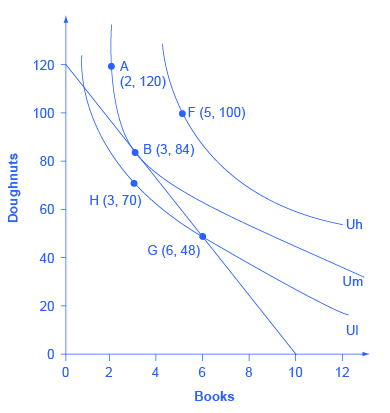
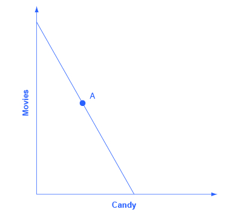
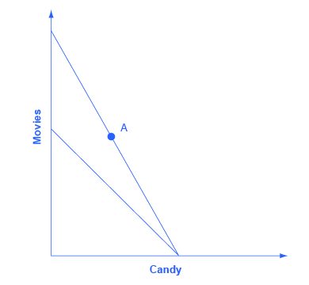
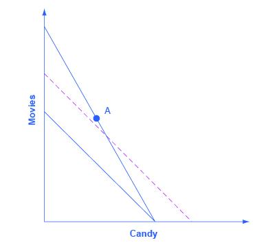

<cnx-pi data-type="cnx.eoc">class="summary" title="Chapter Review"</cnx-pi>

<cnx-pi data-type="cnx.eoc">class="self-check-questions" title="Self-Check Questions"</cnx-pi>

<cnx-pi data-type="cnx.eoc">class="review-questions" title="Review Questions"</cnx-pi>

<cnx-pi data-type="cnx.eoc">class="critical-thinking" title="Critical Thinking Questions"</cnx-pi>

<cnx-pi data-type="cnx.eoc">class="problems" title="Problems"</cnx-pi>

<cnx-pi data-type="cnx.eoc">class="references" title="References"</cnx-pi>

Economists use a vocabulary of maximizing utility to describe people’s preferences. In [Consumer Choices](/m48640){: .target-chapter}, the level of **utility**{: data-type="term" .no-emphasis} that a person receives is described in numerical terms. This appendix presents an alternative approach to describing personal preferences, called indifference curves, which avoids any need for using numbers to measure utility. By setting aside the assumption of putting a numerical valuation on utility—an assumption that many students and economists find uncomfortably unrealistic—the **indifference curve**{: data-type="term" .no-emphasis} framework helps to clarify the logic of the underlying model.

# What Is an Indifference Curve?

People cannot really put a numerical value on their level of satisfaction. However, they can, and do, identify what choices would give them more, or less, or the same amount of satisfaction. An indifference curve shows combinations of goods that provide an equal level of utility or satisfaction. For example, [\[link\]](#CNX_Econ_A06_001) presents three indifference curves that represent Lilly’s preferences for the tradeoffs that she faces in her two main relaxation activities: eating doughnuts and reading paperback books. Each indifference curve (Ul, Um, and Uh) represents one level of utility. First we will explore the meaning of one particular indifference curve and then we will look at the indifference curves as a group.

 {: #CNX_Econ_A06_001 data-title="Lilly&#x2019;s Indifference Curves "}

**The Shape of an Indifference Curve**

The indifference curve Um has four points labeled on it: A, B, C, and D. Since an indifference curve represents a set of choices that have the same level of utility, Lilly must receive an equal amount of utility, judged according to her personal preferences, from two books and 120 doughnuts (point A), from three books and 84 doughnuts (point B) from 11 books and 40 doughnuts (point C) or from 12 books and 35 doughnuts (point D). She would also receive the same utility from any of the unlabeled intermediate points along this indifference curve.

Indifference curves have a roughly similar shape in two ways: 1) they are downward sloping from left to right; 2) they are convex with respect to the origin. In other words, they are steeper on the left and flatter on the right. The downward slope of the indifference curve means that Lilly must trade off less of one good to get more of the other, while holding utility constant. For example, points A and B sit on the same indifference curve Um, which means that they provide Lilly with the same level of utility. Thus, the **marginal utility**{: data-type="term" .no-emphasis} that Lilly would gain from, say, increasing her consumption of books from two to three must be equal to the marginal utility that she would lose if her consumption of doughnuts was cut from 120 to 84—so that her overall utility remains unchanged between points A and B. Indeed, the slope along an indifference curve is referred to as the **marginal rate of substitution**{: data-type="term" .no-emphasis}, which is the rate at which a person is willing to trade one good for another so that utility will remain the same.

Indifference curves like Um are steeper on the left and flatter on the right. The reason behind this shape involves diminishing marginal utility—the notion that as a person consumes more of a good, the marginal utility from each additional unit becomes lower. Compare two different choices between points that all provide Lilly an equal amount of utility along the indifference curve Um: the choice between A and B, and between C and D. In both choices, Lilly consumes one more book, but between A and B her consumption of doughnuts falls by 36 (from 120 to 84) and between C and D it falls by only five (from 40 to 35). The reason for this difference is that points A and C are different starting points, and thus have different implications for marginal utility. At point A, Lilly has few books and many doughnuts. Thus, her marginal utility from an extra book will be relatively high while the marginal utility of additional doughnuts is relatively low—so on the margin, it will take a relatively large number of doughnuts to offset the utility from the marginal book. At point C, however, Lilly has many books and few doughnuts. From this starting point, her marginal utility gained from extra books will be relatively low, while the marginal utility lost from additional doughnuts would be relatively high—so on the margin, it will take a relatively smaller number of doughnuts to offset the change of one marginal book. In short, the slope of the indifference curve changes because the marginal rate of substitution—that is, the quantity of one good that would be traded for the other good to keep utility constant—also changes, as a result of **diminishing marginal utility**{: data-type="term" .no-emphasis} of both goods.

**The Field of Indifference Curves**

Each indifference curve represents the choices that provide a single level of utility. Every level of utility will have its own indifference curve. Thus, Lilly’s preferences will include an infinite number of indifference curves lying nestled together on the diagram—even though only three of the indifference curves, representing three levels of utility, appear on [\[link\]](#CNX_Econ_A06_001). In other words, an infinite number of indifference curves are not drawn on this diagram—but you should remember that they exist.

Higher indifference curves represent a greater level of utility than lower ones. In [\[link\]](#CNX_Econ_A06_001), indifference curve Ul can be thought of as a “low” level of utility, while Um is a “medium” level of utility and Uh is a “high” level of utility. All of the choices on indifference curve Uh are preferred to all of the choices on indifference curve Um, which in turn are preferred to all of the choices on Ul.

To understand why higher indifference curves are preferred to lower ones, compare point B on indifference curve Um to point F on indifference curve Uh. Point F has greater consumption of both books (five to three) and doughnuts (100 to 84), so point F is clearly preferable to point B. Given the definition of an indifference curve—that all the points on the curve have the same level of utility—if point F on indifference curve Uh is preferred to point B on indifference curve Um, then it must be true that all points on indifference curve Uh have a higher level of utility than all points on Um. More generally, for any point on a lower indifference curve, like Ul, you can identify a point on a higher indifference curve like Um or Uh that has a higher consumption of both goods. Since one point on the higher indifference curve is preferred to one point on the lower curve, and since all the points on a given indifference curve have the same level of utility, it must be true that all points on higher indifference curves have greater utility than all points on lower indifference curves.

These arguments about the shapes of indifference curves and about higher or lower levels of utility do not require any numerical estimates of utility, either by the individual or by anyone else. They are only based on the assumptions that when people have less of one good they need more of another good to make up for it, if they are keeping the same level of utility, and that as people have more of a good, the marginal utility they receive from additional units of that good will diminish. Given these gentle assumptions, a field of indifference curves can be mapped out to describe the preferences of any individual.

**The Individuality of Indifference Curves**

Each person determines their own preferences and utility. Thus, while indifference curves have the same general shape—they slope down, and the slope is steeper on the left and flatter on the right—the specific shape of indifference curves can be different for every person. [\[link\]](#CNX_Econ_A06_001), for example, applies only to Lilly’s preferences. Indifference curves for other people would probably travel through different points.

# Utility-Maximizing with Indifference Curves

People seek the highest level of utility, which means that they wish to be on the highest possible indifference curve. However, people are limited by their budget constraints, which show what tradeoffs are actually possible.

**Maximizing Utility at the Highest Indifference Curve**

Return to the situation of Lilly’s choice between paperback books and doughnuts. Say that books cost $6, doughnuts are 50 cents each, and that Lilly has $60 to spend. This information provides the basis for the budget line shown in [\[link\]](#CNX_Econ_A06_002). Along with the **budget line**{: data-type="term" .no-emphasis} are shown the three indifference curves from [\[link\]](#CNX_Econ_A06_001). What is Lilly’s utility-maximizing choice? Several possibilities are identified in the diagram.

 {: #CNX_Econ_A06_002 data-title="Indifference Curves and a Budget Constraint "}

The choice of F with five books and 100 doughnuts is highly desirable, since it is on the highest indifference curve Uh of those shown in the diagram. However, it is not affordable given Lilly’s budget constraint. The choice of H with three books and 70 doughnuts on indifference curve Ul is a wasteful choice, since it is inside Lilly’s budget set, and as a utility-maximizer, Lilly will always prefer a choice on the budget constraint itself. Choices B and G are both on the opportunity set. However, choice G of six books and 48 doughnuts is on lower indifference curve Ul than choice B of three books and 84 doughnuts, which is on the indifference curve Um. If Lilly were to start at choice G, and then thought about whether the marginal utility she was deriving from doughnuts and books, she would decide that some additional doughnuts and fewer books would make her happier—which would cause her to move toward her preferred choice B. Given the combination of Lilly’s personal preferences, as identified by her indifference curves, and Lilly’s opportunity set, which is determined by prices and income, B will be her utility-maximizing choice.

The highest achievable indifference curve touches the opportunity set at a single point of tangency. Since an infinite number of indifference curves exist, even if only a few of them are drawn on any given diagram, there will always exist one indifference curve that touches the budget line at a single point of tangency. All higher indifference curves, like Uh, will be completely above the budget line and, although the choices on that indifference curve would provide higher utility, they are not affordable given the budget set. All lower indifference curves, like Ul, will cross the budget line in two separate places. When one indifference curve crosses the budget line in two places, however, there will be another, higher, attainable indifference curve sitting above it that touches the budget line at only one point of tangency.

# Changes in Income

A rise in income causes the budget constraint to shift to the right. In graphical terms, the new **budget constraint**{: data-type="term" .no-emphasis} will now be tangent to a higher indifference curve, representing a higher level of utility. A reduction in income will cause the budget constraint to shift to the left, which will cause it to be tangent to a lower indifference curve, representing a reduced level of utility. If income rises by, for example, 50%, exactly how much will a person alter consumption of books and doughnuts? Will consumption of both goods rise by 50%? Or will the quantity of one good rise substantially, while the quantity of the other good rises only a little, or even declines?

Since personal preferences and the shape of indifference curves are different for each individual, the response to changes in income will be different, too. For example, consider the preferences of Manuel and Natasha in [\[link\]](#CNX_Econ_A06_013) (a) and [\[link\]](#CNX_Econ_A06_013) (b). They each start with an identical income of $40, which they spend on yogurts that cost $1 and rental movies that cost $4. Thus, they face identical budget constraints. However, based on Manuel’s preferences, as revealed by his indifference curves, his utility-maximizing choice on the original budget set occurs where his opportunity set is tangent to the highest possible indifference curve at W, with three movies and 28 yogurts, while Natasha’s utility-maximizing choice on the original budget set at Y will be seven movies and 12 yogurts.

  Manuel&#x2019;s original choice at W involves more yogurt and more movies, and he reacts to the higher income by mainly increasing consumption of movies at X. (b) Conversely, Natasha&#x2019;s original choice (Y) involves relatively more movies, but she reacts to the higher income by choosing relatively more yogurts. Even when budget constraints are the same, personal preferences lead to different original choices and to different reactions in response to a change in income."){: #CNX_Econ_A06_013 data-title="Manuel and Natasha&#x2019;s Indifference Curves "}

Now, say that income rises to $60 for both Manuel and Natasha, so their budget constraints shift to the right. As shown in [\[link\]](#CNX_Econ_A06_013) (a), Manuel’s new utility maximizing choice at X will be seven movies and 32 yogurts—that is, Manuel will choose to spend most of the extra income on movies. Natasha’s new utility maximizing choice at Z will be eight movies and 28 yogurts—that is, she will choose to spend most of the extra income on yogurt. In this way, the indifference curve approach allows for a range of possible responses. However, if both goods are normal goods, then the typical response to a higher level of income will be to purchase more of them—although exactly how much more is a matter of personal preference. If one of the goods is an inferior good, the response to a higher level of income will be to purchase less of it.

# Responses to Price Changes: Substitution and Income Effects

A higher price for a good will cause the budget constraint to shift to the left, so that it is tangent to a lower indifference curve representing a reduced level of utility. Conversely, a lower price for a good will cause the opportunity set to shift to the right, so that it is tangent to a higher indifference curve representing an increased level of utility. Exactly how much a change in price will lead to the quantity demanded of each good will depend on personal preferences.

Anyone who faces a change in price will experience two interlinked motivations: a substitution effect and an income effect. The **substitution effect**{: data-type="term" .no-emphasis} is that when a good becomes more expensive, people seek out substitutes. If oranges become more expensive, fruit-lovers scale back on oranges and eat more apples, grapefruit, or raisins. Conversely, when a good becomes cheaper, people substitute toward consuming more. If oranges get cheaper, people fire up their juicing machines and ease off on other fruits and foods. The **income effect**{: data-type="term" .no-emphasis} refers to how a change in the price of a good alters the effective buying power of one’s income. If the price of a good that you have been buying falls, then in effect your buying power has risen—you are able to purchase more goods. Conversely, if the price of a good that you have been buying rises, then the buying power of a given amount of income is diminished. (One common source of confusion is that the “income effect” does not refer to a change in actual income. Instead, it refers to the situation in which the price of a good changes, and thus the quantities of goods that can be purchased with a fixed amount of income change. It might be more accurate to call the “income effect” a “buying power effect,” but the “income effect” terminology has been used for decades, and it is not going to change during this economics course.) Whenever a price changes, consumers feel the pull of both substitution and income effects at the same time.

Using indifference curves, you can illustrate the substitution and income effects on a graph. In [\[link\]](#CNX_Econ_A06_005), Ogden faces a choice between two goods: haircuts or personal pizzas. Haircuts cost $20, personal pizzas cost $6, and he has $120 to spend.

 {: #CNX_Econ_A06_005 data-title="Substitution and Income Effects "}

The price of haircuts rises to $30. Ogden starts at choice A on the higher **opportunity set**{: data-type="term" .no-emphasis} and the higher indifference curve. After the price of pizza increases, he chooses B on the lower opportunity set and the lower indifference curve. Point B with two haircuts and 10 personal pizzas is immediately below point A with three haircuts and 10 personal pizzas, showing that Ogden reacted to a higher price of haircuts by cutting back only on haircuts, while leaving his consumption of pizza unchanged.

The dashed line in the diagram, and point C, are used to separate the substitution effect and the income effect. To understand their function, start by thinking about the substitution effect with this question: How would Ogden change his consumption if the relative prices of the two goods changed, but this change in relative prices did not affect his utility? The slope of the budget constraint is determined by the relative price of the two goods; thus, the slope of the original budget line is determined by the original relative prices, while the slope of the new budget line is determined by the new relative prices. With this thought in mind, the dashed line is a graphical tool inserted in a specific way: It is inserted so that it is parallel with the new budget constraint, so it reflects the new relative prices, but it is tangent to the original indifference curve, so it reflects the original level of utility or buying power.

Thus, the movement from the original choice (A) to point C is a substitution effect; it shows the choice that Ogden would make if relative prices shifted (as shown by the different slope between the original budget set and the dashed line) but if buying power did not shift (as shown by being tangent to the original indifference curve). The substitution effect will encourage people to shift away from the good which has become relatively more expensive—in Ogden’s case, the haircuts on the vertical axis—and toward the good which has become relatively less expensive—in this case, the pizza on the vertical axis. The two arrows labeled with “s” for “substitution effect,” one on each axis, show the direction of this movement.

The income effect is the movement from point C to B, which shows how Ogden reacts to a reduction in his buying power from the higher indifference curve to the lower indifference curve, but holding constant the relative prices (because the dashed line has the same slope as the new budget constraint). In this case, where the price of one good increases, buying power is reduced, so the income effect means that consumption of both goods should fall (if they are both normal goods, which it is reasonable to assume unless there is reason to believe otherwise). The two arrows labeled with “i” for “income effect,” one on each axis, show the direction of this income effect movement.

Now, put the substitution and income effects together. When the price of pizza increased, Ogden consumed less of it, for two reasons shown in the exhibit: the substitution effect of the higher price led him to consume less and the income effect of the higher price also led him to consume less. However, when the price of pizza increased, Ogden consumed the same quantity of haircuts. The substitution effect of a higher price for pizza meant that haircuts became relatively less expensive (compared to pizza), and this factor, taken alone, would have encouraged Ogden to consume more haircuts. However, the income effect of a higher price for pizza meant that he wished to consume less of both goods, and this factor, taken alone, would have encouraged Ogden to consume fewer haircuts. As shown in [\[link\]](#CNX_Econ_A06_005), in this particular example the substitution effect and income effect on Ogden’s consumption of haircuts are offsetting—so he ends up consuming the same quantity of haircuts after the price increase for pizza as before.

The size of these income and substitution effects will differ from person to person, depending on individual preferences. For example, if Ogden’s substitution effect away from pizza and toward haircuts is especially strong, and outweighs the income effect, then a higher price for pizza might lead to increased consumption of haircuts. This case would be drawn on the graph so that the point of tangency between the new budget constraint and the relevant indifference curve occurred below point B and to the right. Conversely, if the substitution effect away from pizza and toward haircuts is not as strong, and the income effect on is relatively stronger, then Ogden will be more likely to react to the higher price of pizza by consuming less of both goods. In this case, his optimal choice after the price change will be above and to the left of choice B on the new budget constraint.

Although the substitution and income effects are often discussed as a sequence of events, it should be remembered that they are twin components of a single cause—a change in price. Although you can analyze them separately, the two effects are always proceeding hand in hand, happening at the same time.

# Indifference Curves with Labor-Leisure and Intertemporal Choices

The concept of an indifference curve applies to tradeoffs in any household choice, including the labor-leisure choice or the intertemporal choice between present and future consumption. In the labor-leisure choice, each indifference curve shows the combinations of leisure and income that provide a certain level of utility. In an intertemporal choice, each indifference curve shows the combinations of present and future consumption that provide a certain level of utility. The general shapes of the indifference curves—downward sloping, steeper on the left and flatter on the right—also remain the same.

**A Labor-Leisure Example**

Petunia is working at a job that pays $12 per hour but she gets a raise to $20 per hour. After family responsibilities and sleep, she has 80 hours per week available for work or leisure. As shown in [\[link\]](#CNX_Econ_A06_006), the highest level of utility for Petunia, on her original budget constraint, is at choice A, where it is tangent to the lower indifference curve (Ul). Point A has 30 hours of leisure and thus 50 hours per week of work, with income of $600 per week (that is, 50 hours of work at $12 per hour). Petunia then gets a raise to $20 per hour, which shifts her budget constraint to the right. Her new utility-maximizing choice occurs where the new budget constraint is tangent to the higher indifference curve Uh. At B, Petunia has 40 hours of leisure per week and works 40 hours, with income of $800 per week (that is, 40 hours of work at $20 per hour).

 ![The graph shows the effects of a change in Petunia&#x2019;s wage. Petunia starts at choice A (30, $600), the tangency between her original budget constraint and the lower indifference curve Ul. The wage increase shifts her budget constraint to the right, so that she can now choose B (40, $800) on indifference curve Uh. The substitution effect is the movement from A to C which is approximately point (21, $750). In this case, the substitution effect would lead Petunia to choose less leisure, which is relatively more expensive, and more income, which is relatively cheaper to earn. The income effect is the movement from C to B.](../resources/CNX_Econ_A06_006.jpg "Petunia starts at choice A, the tangency between her original budget constraint and the lower indifference curve Ul. The wage increase shifts her budget constraint to the right, so that she can now choose B on indifference curve Uh. The substitution effect is the movement from A to C. In this case, the substitution effect would lead Petunia to choose less leisure, which is relatively more expensive, and more income, which is relatively cheaper to earn. The income effect is the movement from C to B. The income effect in this example leads to greater consumption of both goods. Overall, in this example, income rises because of both substitution and income effects. However, leisure declines because of the substitution effect but increases because of the income effect&#x2014;leading, in Petunia&#x2019;s case, to an overall increase in the quantity of leisure consumed."){: #CNX_Econ_A06_006 data-title="Effects of a Change in Petunia&#x2019;s Wage "}

Substitution and income effects provide a vocabulary for discussing how Petunia reacts to a higher hourly wage. The dashed line serves as the tool for separating the two effects on the graph.

The substitution effect tells how Petunia would have changed her hours of work if her wage had risen, so that income was relatively cheaper to earn and leisure was relatively more expensive, but if she had remained at the same level of utility. The slope of the budget constraint in a **labor-leisure diagram**{: data-type="term" .no-emphasis} is determined by the wage rate. Thus, the dashed line is carefully inserted with the slope of the new opportunity set, reflecting the labor-leisure tradeoff of the new wage rate, but tangent to the original indifference curve, showing the same level of utility or “buying power.” The shift from original choice A to point C, which is the point of tangency between the original indifference curve and the dashed line, shows that because of the higher wage, Petunia will want to consume less leisure and more income. The “s” arrows on the horizontal and vertical axes of [\[link\]](#CNX_Econ_A06_006) show the substitution effect on leisure and on income.

The income effect is that the higher wage, by shifting the labor-leisure budget constraint to the right, makes it possible for Petunia to reach a higher level of utility. The income effect is the movement from point C to point B; that is, it shows how Petunia’s behavior would change in response to a higher level of utility or “buying power,” with the wage rate remaining the same (as shown by the dashed line being parallel to the new budget constraint). The income effect, encouraging Petunia to consume both more leisure and more income, is drawn with arrows on the horizontal and vertical axis of [\[link\]](#CNX_Econ_A06_006).

Putting these effects together, Petunia responds to the higher wage by moving from choice A to choice B. This movement involves choosing more income, both because the substitution effect of higher wages has made income relatively cheaper or easier to earn, and because the income effect of higher wages has made it possible to have more income and more leisure. Her movement from A to B also involves choosing more leisure because, according to Petunia’s preferences, the income effect that encourages choosing more leisure is stronger than the substitution effect that encourages choosing less leisure.

[\[link\]](#CNX_Econ_A06_006) represents only Petunia’s preferences. Other people might make other choices. For example, a person whose substitution and income effects on leisure exactly counterbalanced each other might react to a higher wage with a choice like D, exactly above the original choice A, which means taking all of the benefit of the higher wages in the form of income while working the same number of hours. Yet another person, whose substitution effect on leisure outweighed the income effect, might react to a higher wage by making a choice like F, where the response to higher wages is to work more hours and earn much more income. To represent these different preferences, you could easily draw the indifference curve Uh to be tangent to the new budget constraint at D or F, rather than at B.

**An Intertemporal Choice Example**

Quentin has saved up $10,000. He is thinking about spending some or all of it on a vacation in the present, and then will save the rest for another big vacation five years from now. Over those five years, he expects to earn a total 80% rate of return. [\[link\]](#CNX_Econ_A06_007) shows Quentin’s budget constraint and his indifference curves between present consumption and future consumption. The highest level of utility that Quentin can achieve at his original intertemporal budget constraint occurs at point A, where he is consuming $6,000, saving $4,000 for the future, and expecting with the accumulated interest to have $7,200 for future consumption (that is, $4,000 in current financial savings plus the 80% rate of return).

However, Quentin has just realized that his expected rate of return was unrealistically high. A more realistic expectation is that over five years he can earn a total return of 30%. In effect, his intertemporal budget constraint has pivoted to the left, so that his original utility-maximizing choice is no longer available. Will Quentin react to the lower rate of return by saving more, or less, or the same amount? Again, the language of substitution and income effects provides a framework for thinking about the motivations behind various choices. The dashed line, which is a graphical tool to separate the substitution and income effect, is carefully inserted with the same slope as the new opportunity set, so that it reflects the changed rate of return, but it is tangent to the original indifference curve, so that it shows no change in utility or “buying power.”

The substitution effect tells how Quentin would have altered his consumption because the lower rate of return makes future consumption relatively more expensive and present consumption relatively cheaper. The movement from the original choice A to point C shows how Quentin substitutes toward more present consumption and less future consumption in response to the lower interest rate, with no change in utility. The substitution arrows on the horizontal and vertical axes of [\[link\]](#CNX_Econ_A06_007) show the direction of the substitution effect motivation. The substitution effect suggests that, because of the lower interest rate, Quentin should consume more in the present and less in the future.

Quentin also has an income effect motivation. The lower rate of return shifts the budget constraint to the left, which means that Quentin’s utility or “buying power” is reduced. The income effect (assuming normal goods) encourages less of both present and future consumption. The impact of the income effect on reducing present and future consumption in this example is shown with “i” arrows on the horizontal and vertical axis of [\[link\]](#CNX_Econ_A06_007).

 ![The graph shows the indifference curve and an intertemporal budget constraint. The x-axis is labeled &#x201C;present consumption.&#x201D; The y-axis is labeled &#x201C;future consumption.&#x201D; The original choice is A ($6,000, $7,200), at the tangency between the original budget constraint and the original indifference curve Uh. A dashed line is drawn parallel to the new budget set, so that its slope reflects the lower rate of return, but is tangent to the original indifference curve. The movement from A to C which is approximately point ($7,900, $5,000) is the substitution effect. The income effect is the shift from C to B ($7,000, $3,900). The following points are also marked: F ($4,000, $6,500), and D ($6,000, $5,200).](../resources/CNX_Econ_A06_007.jpg "The original choice is A, at the tangency between the original budget constraint and the original indifference curve Uh. The dashed line is drawn parallel to the new budget set, so that its slope reflects the lower rate of return, but is tangent to the original indifference curve. The movement from A to C is the substitution effect: in this case, future consumption has become relatively more expensive, and present consumption has become relatively cheaper. The income effect is the shift from C to B; that is, the reduction in utility or &#x201C;buying power&#x201D; that causes a move to a lower indifference curve Ul, but with the relative price the same. It means less present and less future consumption. In the move from A to B, the substitution effect on present consumption is greater than the income effect, so the overall result is more present consumption. Notice that the lower indifference curve could have been drawn tangent to the lower budget constraint point D or point F, depending on personal preferences."){: #CNX_Econ_A06_007 data-title="Indifference Curve and an Intertemporal Budget Constraint "}

Taking both effects together, the substitution effect is encouraging Quentin toward more present and less future consumption, because present consumption is relatively cheaper, while the income effect is encouraging him to less present and less future consumption, because the lower interest rate is pushing him to a lower level of utility. For Quentin’s personal preferences, the substitution effect is stronger so that, overall, he reacts to the lower rate of return with more present consumption and less savings at choice B. However, other people might have different preferences. They might react to a lower rate of return by choosing the same level of present consumption and savings at choice D, or by choosing less present consumption and more savings at a point like F. For these other sets of preferences, the income effect of a lower rate of return on present consumption would be relatively stronger, while the substitution effect would be relatively weaker.

# Sketching Substitution and Income Effects

Indifference curves provide an analytical tool for looking at all the choices that provide a single level of utility. They eliminate any need for placing numerical values on utility and help to illuminate the process of making utility-maximizing decisions. They also provide the basis for a more detailed investigation of the complementary motivations that arise in response to a change in a price, wage or rate of return—namely, the substitution and income effects.

If you are finding it a little tricky to sketch diagrams that show substitution and income effects so that the points of tangency all come out correctly, it may be useful to follow this procedure.

Step 1. Begin with a budget constraint showing the choice between two goods, which this example will call “candy” and “movies.” Choose a point A which will be the optimal choice, where the indifference curve will be tangent—but it is often easier not to draw in the indifference curve just yet. See [\[link\]](#CNX_Econ_A06_008).

 {: #CNX_Econ_A06_008 data-title=""}

Step 2. Now the price of movies changes: let’s say that it rises. That shifts the budget set inward. You know that the higher price will push the decision-maker down to a lower level of utility, represented by a lower indifference curve. But at this stage, draw only the new budget set. See [\[link\]](#CNX_Econ_A06_009).

 {: #CNX_Econ_A06_009 data-title=""}

Step 3. The key tool in distinguishing between substitution and income effects is to insert a dashed line, parallel to the new budget line. This line is a graphical tool that allows you to distinguish between the two changes: (1) the effect on consumption of the two goods of the shift in prices—with the level of utility remaining unchanged—which is the substitution effect; and (2) the effect on consumption of the two goods of shifting from one indifference curve to the other—with relative prices staying unchanged—which is the income effect. The dashed line is inserted in this step. The trick is to have the dashed line travel close to the original choice A, but not directly through point A. See [\[link\]](#CNX_Econ_A06_010).

{: #CNX_Econ_A06_010 data-title=""}

Step 4. Now, draw the original indifference curve, so that it is tangent to both point A on the original budget line and to a point C on the dashed line. Many students find it easiest to first select the tangency point C where the original indifference curve touches the dashed line, and then to draw the original indifference curve through A and C. The substitution effect is illustrated by the movement along the original indifference curve as prices change but the level of utility holds constant, from A to C. As expected, the substitution effect leads to less consumed of the good that is relatively more expensive, as shown by the “s” (substitution) arrow on the vertical axis, and more consumed of the good that is relatively less expensive, as shown by the “s” arrow on the horizontal axis. See [\[link\]](#CNX_Econ_A06_011).

{: #CNX_Econ_A06_011 data-title=""}

Step 5. With the substitution effect in place, now choose utility-maximizing point B on the new opportunity set. When you choose point B, think about whether you wish the substitution or the income effect to have a larger impact on the good (in this case, candy) on the horizontal axis. If you choose point B to be directly in a vertical line with point A (as is illustrated here), then the income effect will be exactly offsetting the substitution effect on the horizontal axis. If you insert point B so that it lies a little to right of the original point A, then the substitution effect will exceed the income effect. If you insert point B so that it lies a little to the left of point A, then the income effect will exceed the substitution effect. The income effect is the movement from C to B, showing how choices shifted as a result of the decline in buying power and the movement between two levels of utility, with relative prices remaining the same. With normal goods, the negative income effect means less consumed of each good, as shown by the direction of the “i” (income effect) arrows on the vertical and horizontal axes. See [\[link\]](#CNX_Econ_A06_012).

 {: #CNX_Econ_A06_012 data-title=""}

In sketching substitution and income effect diagrams, you may wish to practice some of the following variations: (1) Price falls instead of a rising; (2) The price change affects the good on either the vertical or the horizontal axis; (3) Sketch these diagrams so that the substitution effect exceeds the income effect; the income effect exceeds the substitution effect; and the two effects are equal.

One final note: The helpful dashed line can be drawn tangent to the new indifference curve, and parallel to the original budget line, rather than tangent to the original indifference curve and parallel to the new budget line. Some students find this approach more intuitively clear. The answers you get about the direction and relative sizes of the substitution and income effects, however, should be the same.

# Key Concepts and Summary

An indifference curve is drawn on a budget constraint diagram that shows the tradeoffs between two goods. All points along a single indifference curve provide the same level of utility. Higher indifference curves represent higher levels of utility. Indifference curves slope downward because, if utility is to remain the same at all points along the curve, a reduction in the quantity of the good on the vertical axis must be counterbalanced by an increase in the quantity of the good on the horizontal axis (or vice versa). Indifference curves are steeper on the far left and flatter on the far right, because of diminishing marginal utility.

The utility-maximizing choice along a budget constraint will be the point of tangency where the budget constraint touches an indifference curve at a single point. A change in the price of any good has two effects: a substitution effect and an income effect. The substitution effect motivation encourages a utility-maximizer to buy less of what is relatively more expensive and more of what is relatively cheaper. The income effect motivation encourages a utility-maximizer to buy more of both goods if utility rises or less of both goods if utility falls (if they are both normal goods).

In a labor-leisure choice, every wage change has a substitution and an income effect. The substitution effect of a wage increase is to choose more income, since it is cheaper to earn, and less leisure, since its opportunity cost has increased. The income effect of a wage increase is to choose more of leisure and income, since they are both normal goods. The substitution and income effects of a wage decrease would reverse these directions.

In an intertemporal consumption choice, every interest rate change has a substitution and an income effect. The substitution effect of an interest rate increase is to choose more future consumption, since it is now cheaper to earn future consumption and less present consumption (more savings), since the opportunity cost of present consumption in terms of what is being given up in the future has increased. The income effect of an interest rate increase is to choose more of both present and future consumption, since they are both normal goods. The substitution and income effects of an interest rate decrease would reverse these directions.

# Review Questions

What point is preferred along an indifference curve?

Why do indifference curves slope down?

Why are indifference curves steep on the left and flatter on the right?

How many indifference curves does a person have?

How can you tell which indifference curves represent higher or lower levels of utility?

What is a substitution effect?

What is an income effect?

Does the “income effect” involve a change in income? Explain.

Does a change in price have both an income effect and a substitution effect? Does a change in income have both an income effect and a substitution effect?

Would you expect, in some cases, to see only an income effect or only a substitution effect? Explain.

Which is larger, the income effect or the substitution effect?

